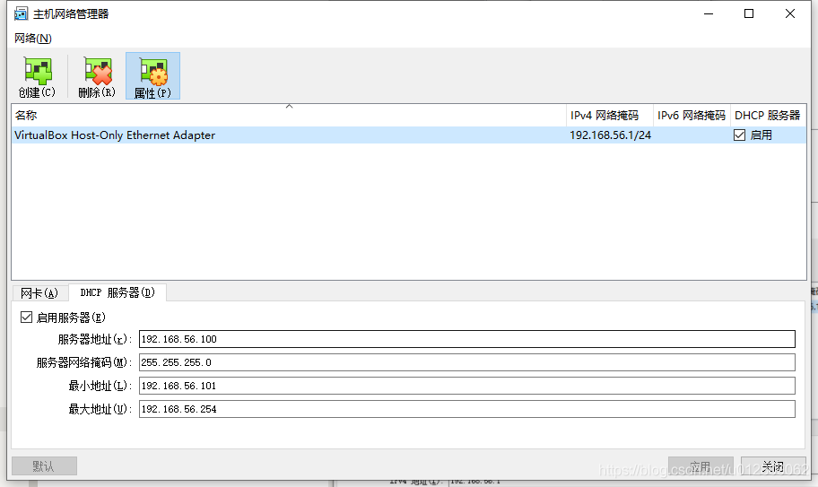

---
阅读进度                            再继续的章节

https://learn.microsoft.com/zh-cn/training/paths/rust-first-steps/      完毕

【弃】Rust入门秘笈                        Rust所有权
Rust编程：入门、实战与进阶          第四章，差2.4，2.5，枚举
通过例子学Rust
深入浅出Rust                        2.3.1

Rust编程语言入门教程视频            69
Rust程序设计                        3.3
Rust 程序设计语言 简体中文版 
https://kaisery.github.io/trpl-zh-cn/title-page.html        迭代器与闭包
www.runoob.com/rust                 Rust 面向对象


Rust编程之道
Rust权威指南                继续第八章
精通Rust(第2版)             4.3

案例：https://www.cnblogs.com/jiangbo4444/category/2071807.html


https://zhuanlan.zhihu.com/p/457636529
https://github.com/wasmflow/node-to-rust
---

# 准备

## 安装系统

### 安装 ububtu 20.10 server

- 下载ubuntu-22.10-live-server-amd64.iso
- virtualbox，新建虚拟机：2cpu，4g内存，200g硬盘，网卡1使用默认“网络地址转换NAT”（装完系统后可以在虚拟机里上外网，但与宿主不可互ping，需要加装host-only网卡用于形成互ping的局域网）
- 运行安装server，不要最小安装那样会缺少必要的程序
- 【Mirror address】那步骤改地址改为：<http://mirrors.aliyun.com/ubuntu>，注意不是proxy的地址不要搞错。。。另外此时可以多找几个看看网速，避免很慢
- 并且选上安装ssh，其余默认即可
- 需要下载的都安装完后，回车重启，重启过程中有err再次回车即可，直到输入用户名密码登录，安装完毕

### 设置root密码

- 首先确保已登录普通用户。
- 输入命令：sudo passwd root，输入当前普通用户密码，设置root用户密码，再次输入确认root用户密码
- 输入命令：su root，输入root用户密码进行登录，成功进入root用户后退出root用户，输入命令exit

### 安装net-tools

```shell
    sudo apt install net-tools
```

### 调整网卡硬件

- 关闭运行的虚拟机系统，以下配置是硬件级别设置，可用于所有被虚拟的系统，如centos7和ubuntu20等

- Virtualbox工具栏->管理->全局设定

    

- Virtualbox工具栏->管理->主机网络管理器

    

    

    此刻多了一块网卡如下

    

- Virtualbox客户机网络设置

    网络地址转换NAT，用于上外网

    

    Host-Only用于ssh，即局域网互通

    

### 查看网络状态的命令

- ip a 或 ip addr
- networkctl status -a
- route -n

### 在centos中配置网络

- 修改网卡1（网络地址转换NAT）配置为如下，HWADDR可以不用，UUID可以使用uuidgen生成。保存后, service network restart，此时应可正常访问外网

``` shell

[huawei@10 ~]$ cat /etc/sysconfig/network-scripts/ifcfg-enp0s3
TYPE="Ethernet"
PROXY_METHOD="none"
BROWSER_ONLY="no"
BOOTPROTO="dhcp"
DEFROUTE="yes"
IPV4_FAILURE_FATAL="no"
IPV6INIT="yes"
IPV6_AUTOCONF="yes"
IPV6_DEFROUTE="yes"
IPV6_FAILURE_FATAL="no"
IPV6_ADDR_GEN_MODE="stable-privacy"
NAME="enp0s3"
UUID="00359752-7a18-4c26-bac6-cbb3bb484892"
DEVICE="enp0s3"
ONBOOT="yes"
HWADDR="08:00:27:C5:A0:36"

```

- 修改网卡2（Host-Only）配置为如下，HWADDR可以不用，UUID可以使用uuidgen生成，使用固定IP地址（IPADDR确保在前面创建的host-only网卡的min到max地址中即可）保存后, service network restart，此时应可以与物理机或其他虚拟机互ping

``` shell

[huawei@10 ~]$ cat /etc/sysconfig/network-scripts/ifcfg-enp0s8
TYPE=Ethernet
PROXY_METHOD=none
BROWSER_ONLY=no
BOOTPROTO=yes
DEFROUTE=yes
IPV4_FAILURE_FATAL=no
IPV6INIT=yes
IPV6_AUTOCONF=yes
IPV6_DEFROUTE=yes
IPV6_FAILURE_FATAL=no
IPV6_ADDR_GEN_MODE=stable-privacy
NAME=enp0s8
UUID=27aaf75f-90ce-4cb3-94e2-5279c86b3fcf
DEVICE=enp0s8
ONBOOT=yes
HWADDR="08:00:27:2B:24:FD"
IPADDR=192.168.56.120
NETMASK=255.255.255.0

```

### 在ubuntu中配置网络

- 修改配置文件内容为如下（addresses确保在前面创建的host-only网卡的min到max地址中即可，enp0s3是NAT的网卡，enp0s8是Host-Only网络）
- sudo netplan apply
- ip addr 查看静态ip是否设置成功
- 此时应可以与物理机或其他虚拟机互ping且可以上外网
- 如失败可以route -n看下路由表，检查enp0s8的gateway是否非[添加网卡硬件](#添加网卡硬件)的全局设定中的ip，如何改待完善。。。

``` shell

huaw@test:~$ cat /etc/netplan/00-installer-config.yaml
# This is the network config written by 'subiquity'
network:
  ethernets:
    enp0s3:
      addresses: []
      dhcp4: true
    enp0s8:
      dhcp4: false
      addresses: [192.168.56.102/24]
      nameservers:
        addresses: [192.168.56.1]
  version: 2

```

### 配置ssh

- ubuntu server安装时候如选上ssh了，则不用配置
- 手动配置则如下操作：先 sudo vi /etc/ssh/sshd_config，修改PermitRootLogin为yes后保存退出，再 sudo service ssh restart


### VirtualBox虚拟机Ubuntu扩容

- 关闭虚拟机，windows进入VirtualBox的安装目录查看需要修改的虚拟硬盘，使用命令对磁盘进行扩容操作

``` cmd
cd D:\Program Files\Oracle\VirtualBox

VBoxManage list hdds    // 查看对应虚拟磁盘文件的guid

VBoxManage modifyhd 2246d63c-5e3c-454f-8ecc-e5125dbe74a7 ––resize 51200     // 通过guid修改size
```

- 启动虚拟机，扩大ubuntu--vg-ubuntu--lv

    后续操作见 [resize.md](#resize.md)

### Linux磁盘空间100% 查找并删除大文件

https://blog.csdn.net/CL_YD/article/details/79458092?spm=1001.2101.3001.6650.3&utm_medium=distribute.pc_relevant.none-task-blog-2%7Edefault%7ECTRLIST%7ERate-3-79458092-blog-114849739.pc_relevant_aa2&depth_1-utm_source=distribute.pc_relevant.none-task-blog-2%7Edefault%7ECTRLIST%7ERate-3-79458092-blog-114849739.pc_relevant_aa2&utm_relevant_index=6


挂盘
http://events.jianshu.io/p/a2d773965de5

### 修改时区

- 执行tzselect，选4 Asia，选10 China，选1 Beijing，选1 yes
- sudo vi ~/.profile，在文件尾追加如下一行

``` shell
    TZ='Asia/Shanghai'; export TZ
```

- sudo vi /etc/default/locale，在文件尾追加如下一行

``` shell
    LC_TIME=zh_CN.UTF-8
```

### 修改shell前导

- /etc/bash.bashrc与/home/huaw/.bashrc，文件末尾追加此行

``` shell
PS1='[\u@\h \W]\$ '
```

### 改源

- 在安装ubuntu server时候因为修改过Mirror address，因此也不用改了
- 如需手动修改则如下

``` shell
sudo cp /etc/apt/sources.list /etc/apt/sources.list.old
```

- 将如下内容覆盖到sources.list文件里即可

```
deb https://mirrors.ustc.edu.cn/ubuntu/ focal main restricted universe multiverse
deb https://mirrors.ustc.edu.cn/ubuntu/ focal-updates main restricted universe multiverse
deb https://mirrors.ustc.edu.cn/ubuntu/ focal-backports main restricted universe multiverse
deb https://mirrors.ustc.edu.cn/ubuntu/ focal-security main restricted universe multiverse

# deb-src https://mirrors.ustc.edu.cn/ubuntu/ focal main restricted universe multiverse
# deb-src https://mirrors.ustc.edu.cn/ubuntu/ focal-updates main restricted universe multiverse
# deb-src https://mirrors.ustc.edu.cn/ubuntu/ focal-backports main restricted universe multiverse
# deb-src https://mirrors.ustc.edu.cn/ubuntu/ focal-security main restricted universe multiverse

## Pre-released source, not recommended.
# deb https://mirrors.ustc.edu.cn/ubuntu/ focal-proposed main restricted universe multiverse
# deb-src https://mirrors.ustc.edu.cn/ubuntu/ focal-proposed main restricted universe multiverse
```

### 先安装必要工具

此处可以先重启一下后再操作如下

- ubuntu

``` shell
sudo apt-get remove needrestart
sudo apt-get install -y gcc
sudo apt-get install -y gdb
sudo apt-get install -y cmake
sudo apt-get install -y python2
sudo apt-get install -y python3
sudo apt-get install -y perl
sudo apt-get install -y openjdk-18-jdk
sudo apt-get install -y openjdk-17-jdk
sudo apt-get install -y cmake
sudo apt-get install -y automake
sudo apt-get install -y git
sudo apt-get install -y pkg-config
sudo apt-get install -y openssl
sudo apt-get install -y libssl-dev
sudo apt-get install -y build-essential
sudo apt-get install -y libxml2
sudo apt-get install -y clang
sudo apt-get install -y libclang
sudo apt-get install -y libclang-dev
sudo apt-get install -y protoc
sudo apt-get install -y libprotoc-dev
sudo apt-get install -y bison
sudo apt-get install -y flex
sudo apt-get install -y gettext
sudo apt-get install -y libreadline-dev
sudo apt-get install -y protobuf-compiler
sudo apt-get install -y libprotobuf-dev
sudo apt-get install -y unixodbc
sudo apt-get install -y lib32readline-dev
```

- centos

``` shell
yum install clang
yum install centos-release-scl
yum install devtoolset-7
scl enable devtoolset-7 bash
```

## 安装rust

- 执行下面，然后选择1

``` shell
curl https://sh.rustup.rs -sSf | sh
```

- sudo vi ~/.profile，末尾添加如下

```shell
export PATH="$HOME/.cargo/bin:$PATH"
```

- 验证成功

``` shell
huaw@test:~$ .  ~/.profile
huaw@test:~$ rustc --version
rustc 1.65.0 (897e37553 2022-11-02)
huaw@test:~$ cargo --version
cargo 1.65.0 (4bc8f24d3 2022-10-20)
```

## 更新rust

``` shell
huaw@test:~$ rustup update
```

## 连接remote ssh失败的解决方法之一

如果连不上，有可能是因为目标虚拟机的ip之前被别的机器使用过，需要重新生成，在windows执行如下(ip为目标虚拟机ip)

```console
ssh-keygen -R 192.168.56.102
```

会更新/c/Users/huaw/.ssh/known_hosts updated，再次连接成功

## 安装vscode插件

- rust-analyzer
- rust syntax
- crates            可以显示依赖包的最新版本
- better toml       为 TOML 文件增加语法高亮。
- rust test lens
- Tabnine
- CodeLLDB          调试 Rust 项目
- search-crates-io  会在写 Cargo.toml 的依赖时时，尝试自动补全
- 执行命令安装如下：
    cargo install cargo-edit
    打开vscode命令面板->open setting (json)，加入如下后重新开启vscode

``` json
"rust-analyzer.checkOnSave.command": "clippy",      将cargo check换为clippy
"rust-analyzer.inlayHints.enable": false,           可以关掉嵌入提示
"rust-analyzer.inlayHints.chainingHints": false,    可以关掉嵌入提示
"rust-analyzer.inlayHints.parameterHints": false,   可以关掉嵌入提示
"rust-analyzer.inlayHints.chainingHints.enable": false,
"rust-analyzer.inlayHints.parameterHints.enable": false,
"rust-analyzer.inlayHints.typeHints.enable": false
"rust-analyzer.updates.askBeforeDownload": true     下载更新之前，弹出确认框
```
## helloworld

- 新建“main.rs”

``` rust
fn main()
{
    println!("hello world");
}
```

- 使用“rustc main.rs”进行编译

- 运行可执行文件“./main”即可

## 猜数字

``` rust
use rand::Rng;
use std::cmp::Ordering;
use std::io;

fn main() {
    println!("猜数字");
    let secretnum = rand::thread_rng().gen_range(1..100);
    println!("神秘数字是:{}", secretnum);

    loop {
        println!("type a number:");
        let mut guess = String::new();
        io::stdin().read_line(&mut guess).expect("无法读取");
        let guess: u32 = match guess.trim().parse() {
            Ok(num) => num, // 解析出如果类型正确则直接赋值，此处的mum理解为占位符，其实名字随意
            Err(_) => continue, // 参数“_”理解为放弃使用此参数，此为专用不可换名
        };
        println!("你猜的是{}", guess);
        match guess.cmp(&secretnum) {
            Ordering::Less => println!("too small"),
            Ordering::Greater => println!("too big"),
            Ordering::Equal => {
                println!("you win");
                break;
            }
        };
    }
}

```

## vscode调试rust

- 项目名称greeting
- launch.json
- tasks.json
- 先f7编译，在rs文件上加断点F5即可调试

``` shell
huaw@test:~/playground/rust$ cat .vscode/launch.json
{
    "version": "0.2.0",
    "configurations": [
        {
            "name": "rust", // 配置名称，将会在调试配置下拉列表中显示
            "type": "lldb", // 调试器类型：Windows表示器使用cppvsdbg；GDB和LLDB使用cppdbg。该值自动生成
            "request": "launch", // 调试方式
            "program": "${workspaceRoot}/greeting/target/debug/greeting", // 要调试的程序（完整路径，支持相对路径）
            "args": [], // 传递给上面程序的参数，没有参数留空即可
            "stopAtEntry": false, // 是否停在程序入口点（即停在main函数开始）（目前为不停下）
            "cwd": "${workspaceRoot}", // 调试程序时的工作目录
            "environment": [],
            "externalConsole": false, // 调试时是否显示控制台窗口(目前为不显示)
            //"preLaunchTask": "build", //预先执行task.json
            "MIMode": "lldb" //MAC下的debug程序
        }
    ]
}

huaw@test:~/playground/rust$ cat .vscode/tasks.json 
{
        "version": "2.0.0",
        "tasks": [
                {
                        "type": "shell",
                        "command": "cargo",
                        "options": {
                                "cwd": "${workspaceFolder}/greeting/"
                        },

                        "args":[
                                "build"
                        ],
                        "problemMatcher": [
                                "$rustc"
                        ],
                        "group": "build",
                        "label": "rust: cargo build"
                }
        ]
}

```

## 统计代码量

- https://github.com/XAMPPRocky/tokei
- huaw@test:~/playground/$ cargo install tokei
- huaw@test:~/playground/rust/my_extension$ tokei . --files


# cargo

## 常用命令


## 创建项目

- 会自动创建目录
- src/main.rs是主文件，说明这是一个可执行程序
- 如果是创建库，通过给cargo new命令添加--lib参数，则可以创建用于编写库的项目：cargo new --lib hellolib，此时没有main.rs，而有lib.rs
- src/main.rs与src/lib.rs可以同时存在，都叫做crate roots，即编译的入口文件
- toml是配置文件，记录版本信息，依赖项

``` shell
huaw@test:~/playground/rust$ cargo new hellocargo
     Created binary (application) `hellocargo` package

huaw@test:~/playground/rust/hellocargo$ tree
.
├── Cargo.toml
└── src
    └── main.rs
```


## 版本管理

默认自带版本管理，但可以使用huaw@test:~/playground/rust$ cargo new --vcs none hello3创建不带有版本管理的项目

## 迁移到cargo项目

将代码挪到使用cargo创建的项目目录下的src内即可，然后手写toml

## 检查代码语法

仅检查代码问题，并不编译，快很多

``` shell
huaw@test:~/playground/rust/hellocargo$ cargo check
    Checking hellocargo v0.1.0 (/home/huaw/playground/rust/hellocargo)
    Finished dev [unoptimized + debuginfo] target(s) in 0.07s
```

## 编译、运行、清理

- Cargo 调用了 Rust 编译器 rustc，然后又运行了生成的可执行文件。Cargo 把可执行文件放到了包顶部的 target 子目录中
- Cargo.lock 此文件会在编译时刻出现，内容是记录的所有依赖库版本
- 如toml进行了手动改变，则编译后会更新Cargo.lock

``` shell
huaw@test:~/playground/rust/hellocargo$ cargo run
    Finished dev [unoptimized + debuginfo] target(s) in 0.00s
     Running `target/debug/hellocargo`
Hello, world!
```


### debug

会build到target/debug下

``` shell
huaw@test:~/playground/rust/hellocargo$ cargo build
   Compiling hellocargo v0.1.0 (/home/huaw/playground/rust/hellocargo)
    Finished dev [unoptimized + debuginfo] target(s) in 0.38s
```

### release

会build到target/release下，当然也可以运行命令 cargo run --release

``` shell
huaw@test:~/playground/rust/hellocargo$ cargo build --release
   Compiling hellocargo v0.1.0 (/home/huaw/playground/rust/hellocargo)
    Finished release [optimized] target(s) in 0.19s
```

### clean

cargo clean会清理target


## rust语言服务

- 关闭语言服务

    vscode主菜单view->command palette->rust-analyzer: Stop server

- 开启语言服务

    vscode主菜单view->command palette->rust-analyzer: Start server

## 换源

*** 实测快慢取决于ubuntu源，另外有梯子无需改源 ***

在cargo所在目录中（默认是$HOME/.cargo）执行 touch config 创建配置文件，写如下后保存，按需再重新 cargo build 即可

``` shell
huaw@test:~/.cargo$ cat config 
[source.crates-io]
registry ="https://github.com/rust-lang/crates.io-index"
replace-with = 'tuna'
[source.tuna]
registry = "https://mirrors.tuna.tsinghua.edu.cn/git/cratesio-index.git"
[net]
git-fetch-with-cli = true
```

## 查找第三方crate

cargo search 可以检查其是否可用并确定最新版本：
```
$ cargo search structopt
structopt = "0.3.21"                  # Parse command-line argument by defining a struct.
.
.
.
```

## 添加依赖项

- 通过将以下条目添加到 Cargo.toml 文件的 [dependencies] 部分，将其添加为我们项目的依赖项
- 关于版本号规则参考：https://course.rs/cargo/reference/specify-deps.html

```rust
[dependencies]
structopt = "0.3"
```

## 更新依赖

由于 Cargo.lock 会锁住依赖的版本，你需要通过手动的方式将依赖更新到新的版本：

``` shell
$ cargo update            # 更新所有依赖
$ cargo update -p regex   # 只更新 “regex”
```

以上命令将使用新的版本信息重新生成 Cargo.lock ，需要注意的是 cargo update -p regex 传递的参数实际上是一个 Package ID， regex 只是一个简写形式。

## 发布模块

cargo publish

# 搭建pgx开发环境

## 安装pg

``` shell
wget https://ftp.postgresql.org/pub/source/v15.1/postgresql-15.1.tar.gz
tar -xf postgresql-15.1.tar.gz
cd
./configure --prefix=/home/huaw/work/outpostdbv4/  安装到此位置
make
make install

$ sudo vi ~/.bashrc，末尾添 
export LD_LIBRARY_PATH=/home/huaw/work/outpostdbv4/lib/:$LD_LIBRARY_PATH
export PGHOME=/home/huaw/work/outpostdbv4/
export PGDATA=/home/huaw/playground/data    需要手动创建出来
export PATH=$PGHOME/bin:$PATH
$ source  ~/.bashrc
```

## 安装rust

``` shell
$ curl https://sh.rustup.rs -sSf | sh
$ sudo vi ~/.profile，末尾添  export PATH="$HOME/.cargo/bin:$PATH"
$ source  ~/.profile
```

## 安装pgx

- 使用install进行安装
- init命令负责初始化环境，下面指定了已经安装后的路径，如果之前没有安装pg则使用“cargo pgx init”，会下载几个版本的postgres然后编译到目录~/.pgx/中（此目录里含有对应的pg代码目录与initdb后对应的数据目录）。这个步骤时间会稍长（因为后续pgx会为每中版本的postgres的header文件生成对应的Rust bindings，以及后续pgx 的测试框架中也会用到）

``` shell
$ cargo install --force --locked cargo-pgx --version=0.7.0  中途卡住就关了重新执行即可
$ cargo pgx init --pg15 /home/huaw/work/outpostdbv4/bin/pg_config
$ cargo install --force cargo-make
```

## 创建pgx项目

- 创建一个extension项目

``` shell
huaw@test:~/playground/rust$ cargo pgx new my_extension


huaw@test:~/playground/rust/my_extension$ tree
.
├── Cargo.toml
├── my_extension.control
├── sql
└── src
    └── lib.rs

2 directories, 3 files
```

## 主要文件说明

lib.rs里的#[pg_extern] 宏所修饰的函数就是我们要实现的extension函数，mod tests , pub mod pg_test 是pgx已经为我们写好了的测试模块，用于编写相关测试代码。pgx默认已经给我们写好了名为 hello_my_extension 的extension，功能很简单，就是返回 “Hello, my_extension” 字符串
​

```
use pgx::prelude::*;    // 导入包

pgx::pg_module_magic!();    // 初始化

#[pg_extern]    // pg_extern会将此函数导出为c函数
fn hello_my_extension() -> &'static str {
    "Hello, my_extension"
}

#[cfg(any(test, feature = "pg_test"))]  // 可以使用cargo pgx test 进行测试，即调用crate::hello_my_extension会返回"Hello, my_extension"
#[pg_schema]
mod tests {
    use pgx::prelude::*;

    #[pg_test]
    fn test_hello_my_extension() {
        assert_eq!("Hello, my_extension", crate::hello_my_extension());
    }

}

#[cfg(test)]
pub mod pg_test {
    pub fn setup(_options: Vec<&str>) {
        // perform one-off initialization when the pg_test framework starts
    }

    pub fn postgresql_conf_options() -> Vec<&'static str> {
        // return any postgresql.conf settings that are required for your tests
        vec![]
    }
}

```

Cargo.toml里面有项目的设置，lib类型是cdylib（动态库）

my_extension.control文件用于pg加载插件时刻使用

``` shell
comment = 'my_extension:  Created by pgx'
default_version = '@CARGO_VERSION@'
module_pathname = '$libdir/my_extension'
relocatable = false
superuser = false

```

## 编译运行

- 运行extension

使用cargo pgx run即可，后也可以跟参数pg14或pg13，对应不同的postgres版本（默认版本是在Cargo.toml的features里设置），cargo pgx run会把extension编译为一个 .so 共享库文件，复制到对应版本的 ~/.pgx/ 目录中，然后启动Postgres实例，通过psql连接到和extension同名的数据库上。编译完成后，开发者就会处于psql的shell界面中，可以调用extension进行测试了。

``` shell

huaw@test:~/playground/rust/$ cd my_extension
huaw@test:~/playground/rust/my_extension$ cargo pgx run pg14


...
Compiling funty v2.0.0
   Compiling bitvec v1.0.1
   Compiling serde_cbor v0.11.2
   Compiling uuid v1.2.2
   Compiling seahash v4.1.0
   Compiling pgx v0.6.0
   Compiling my_extension v0.0.0 (/home/huaw/playground/rust/my_extension)
    Finished dev [unoptimized + debuginfo] target(s) in 2m 22s
  Installing extension
     Copying control file to /home/huaw/.pgx/13.9/pgx-install/share/postgresql/extension/my_extension.control
     Copying shared library to /home/huaw/.pgx/13.9/pgx-install/lib/postgresql/my_extension.so
 Discovering SQL entities
  Discovered 1 SQL entities: 0 schemas (0 unique), 1 functions, 0 types, 0 enums, 0 sqls, 0 ords, 0 hashes, 0 aggregates, 0 triggers
     Writing SQL entities to /home/huaw/.pgx/13.9/pgx-install/share/postgresql/extension/my_extension--0.0.0.sql
    Finished installing my_extension
    Starting Postgres v13 on port 28813
     Creating database my_extension
psql (13.9)
Type "help" for help.
```

在psql里检测插件

``` sql

my_extension=# CREATE EXTENSION my_extension;  // 安装插件
CREATE EXTENSION
my_extension=# \df
                              List of functions
 Schema |        Name        | Result data type | Argument data types | Type 
--------+--------------------+------------------+---------------------+------
 public | hello_my_extension | text             |                     | func
(1 row)

my_extension=# SELECT hello_my_extension();
 hello_my_extension  
---------------------
 Hello, my_extension
(1 row)

my_extension=# \q
```

## 手动测试pgx插件

如cargo pgx run失败则参考如下操作流程进行测试

``` shell
- cargo pgx install，会将编译出的so,sql,control自动拷贝到之前通过cargo pgx init配置的对应目录中
- 删除$PGDATA，重新initdb，此步骤是确保$PGDATA位置的pg数据目录正常
- 修改配置 vi $PGDATA/pg_hba.conf，末尾添加
  host all all 0.0.0.0/0 md5
  用于手动psql登入
- 配置监听地址 vi $PGDATA/postgresql.conf，port改为5432
- pg_ctl start，启动pg，如果之前未关闭则先pg_ctl stop后再start
- psql -p 5432 -d postgres，登入pg，下面的操作显示的结果也许不同

my_extension=# select current_database();
 current_database 
------------------
 my_extension
(1 row)

my_extension=# select current_user;
 current_user 
--------------
 huaw
(1 row)

my_extension=# select inet_server_addr();
 inet_server_addr 
------------------
 127.0.0.1
(1 row)

my_extension=# select inet_client_port();
 inet_client_port 
------------------
            54856
(1 row)

my_extension=#  drop extension my_extension cascade; CREATE EXTENSION my_extension;
DROP EXTENSION
CREATE EXTENSION
my_extension=# select hello_my_extension();
 hello_my_extension 
--------------------
 aaa!!!
(1 row)
```

## 运行test

还可以进行测试，其实就是跑make test，但会测试所有回归，时间稍长

``` shell
huaw@test:~/playground/rust/my_extension$ cargo pgx test

...
Compiling pgx-tests v0.6.0
   Compiling my_extension v0.0.0 (/home/huaw/playground/rust/my_extension)
    Building [=======================> ] 231/232: my_extension(test)             
    Finished test [unoptimized + debuginfo] target(s) in 5m 29s
     Running unittests src/lib.rs (target/debug/deps/my_extension-a0aa68729b5952a7)

running 1 test
    Building extension with features  pg_test
     Running command "cargo" "build" "--features" " pg_test" "--message-format=json-render-diagnostics"


  Installing extension
     Copying control file to /home/huaw/.pgx/13.9/pgx-install/share/postgresql/extension/my_extension.control
     Copying shared library to /home/huaw/.pgx/13.9/pgx-install/lib/postgresql/my_extension.so
    Finished installing my_extension
The files belonging to this database system will be owned by user "huaw".
This user must also own the server process.

The database cluster will be initialized with locale "C".
The default database encoding has accordingly been set to "SQL_ASCII".
The default text search configuration will be set to "english".

Data page checksums are disabled.

creating directory /home/huaw/playground/rust/my_extension/target/pgx-test-data-13 ... ok
creating subdirectories ... ok
selecting dynamic shared memory implementation ... posix
selecting default max_connections ... 100
selecting default shared_buffers ... 128MB
selecting default time zone ... Asia/Shanghai
creating configuration files ... ok
running bootstrap script ... ok
performing post-bootstrap initialization ... ok
syncing data to disk ... ok

initdb: warning: enabling "trust" authentication for local connections
You can change this by editing pg_hba.conf or using the option -A, or
--auth-local and --auth-host, the next time you run initdb.

Success. You can now start the database server using:

    /home/huaw/.pgx/13.9/pgx-install/bin/pg_ctl -D /home/huaw/playground/rust/my_extension/target/pgx-test-data-13 -l logfile start

test tests::pg_test_hello_my_extension ... ok

test result: ok. 1 passed; 0 failed; 0 ignored; 0 measured; 0 filtered out; finished in 28.34s

stopping postgres (pid=103537)
huaw@test:~/playground/rust/my_extension$ 
```

## 查看与导出sql

可以使用cargo pgx schema查看pgx生成的sql语句内容，可以看到末尾打印出编译成了"LANGUAGE c"。保存为sql文件则“cargo pgx schema -o a.sql”即可

``` shell
huaw@test:~/playground/rust/my_extension$ cargo pgx schema
    Building for SQL generation with features ``
    Finished dev [unoptimized + debuginfo] target(s) in 0.07s
 Discovering SQL entities
  Discovered 1 SQL entities: 0 schemas (0 unique), 1 functions, 0 types, 0 enums, 0 sqls, 0 ords, 0 hashes, 0 aggregates, 0 triggers
     Writing SQL entities to /dev/stdout
/* 
This file is auto generated by pgx.

The ordering of items is not stable, it is driven by a dependency graph.
*/

-- src/lib.rs:6
-- my_extension::hello_my_extension
CREATE  FUNCTION "hello_my_extension"() RETURNS TEXT /* &str */
STRICT
LANGUAGE c /* Rust */
AS 'MODULE_PATHNAME', 'hello_my_extension_wrapper';
huaw@test:~/playground/rust/my_extension$ 
```

## 案例：myadd

- 在hello_my_extension函数下面添加一个带有缺省值的新函数

``` rust
#[pg_extern]
fn myadd(a:i64, b:default!(i64, 100)) -> i64 {
    a+b
}

```

- cargo pgx run pg14 编译运行，进入psql后：
   drop extension my_extension cascade; CREATE EXTENSION my_extension;
   可以看到2个函数了，编译后虽然so是最新的，但因为so里多了个函数，所以在pg里需要重新安装扩展才能使用（即需要重新运行对应的sql）。如果仅仅是函数实现发生了改变则无需上面的步骤，直接运行函数即可

- 使用\df可以查看此函数转换后的函数与参数类型信息


## 案例：to_lowercase

- 使用Option作为参数与返回值
- 使用info!在psql里打印输出

``` rust
#[pg_extern]
fn to_lowercase(s: Option<String>) -> Option<String> {
    info!("to lowercase called with {:?}", s);  // 在psql里输出
    s.map(|v| v.to_lowercase())
}
```

## 案例：自定义类型 SortedID

- 创建一个随机的、且可排序的自定义数据类型

- 先Add dependencies to a Cargo.toml，完成后配置文件里的依赖部分内容会自动更新

``` shell
huaw@test:~/playground/rust/my_extension$ cargo add uuid7 --features serde
    Updating crates.io index
      Adding uuid7 v0.3.2 to dependencies.
             Features:
             + serde
             + std
             - uuid

huaw@test:~/playground/rust/my_extension$ cargo add serde --features derive
    Updating crates.io index
      Adding serde v1.0.150 to dependencies.
             Features:
             + derive
             + serde_derive
             + std
             - alloc
             - rc
             - unstable
```

- 新建文件加入代码

    这里使用了rust的uuid7、serde以及PostgresType / Eq / Hash / Ord

```rust
huaw@test:~/playground/rust/my_extension$ cat src/sortable_id.rs 
use pgx::*;
use uuid7::{uuid7, Uuid};
use serde::{Serialize, Deserialize};

#[derive(Debug, Clone, Copy, PartialEq, Eq, PartialOrd, Ord, Hash, Serialize, Deserialize)]
#[derive(PostgresType, PostgresEq, PostgresOrd, PostgresHash)]

pub struct SortableId(Uuid);

impl Default for SortableId{
    fn default() -> Self{
        Self(uuid7())
    }
}

#[pg_extern]
fn generate_sortable_id() -> SortableId{
    SortableId::default()
}
```

- 在lib.rs的头部导入上面的代码

``` rust
mod sortable_id;
use pgx::*;
use pgx::prelude::*;
pub use sortable_id::*;
...
```

- cargo pgx run
  
    进入psql后再次：
    drop extension my_extension cascade;
    CREATE EXTENSION my_extension;
    \df
    即可看到新添的n个sortableid_开头的函数了，可以试一下

``` sql
my_extension=# select generate_sortable_id();
          generate_sortable_id          
----------------------------------------
 "01850aa2-8c02-733d-9929-80aea7a4ce4f"
(1 row)
```

- 修改在psql里的内容呈现形式，在sortable_id.rs里添加inoutfuncs的内容

``` rust
huaw@test:~/playground/rust/my_extension$ cat src/sortable_id.rs 
use pgx::*;
use uuid7::{uuid7, Uuid};
use serde::{Serialize, Deserialize};

#[derive(Debug, Clone, Copy, PartialEq, Eq, PartialOrd, Ord, Hash, Serialize, Deserialize)]
#[derive(PostgresType, PostgresEq, PostgresOrd, PostgresHash)]

#[inoutfuncs]

pub struct SortableId{
    inner: Uuid,
}

impl Default for SortableId{
    fn default() -> Self{
        Self{
            inner: uuid7()
        }
    }
}

impl InOutFuncs for SortableId{
    fn output(&self, buffer: &mut StringInfo) {
        buffer.push_str(&self.inner.to_string());
    }

    fn input(input: &pgx::cstr_core::CStr) -> Self
        where
            Self: Sized,
    {
        let id = input.to_str().expect("input is not a valid utf8 string").parse().expect("imput is not a valid uuid");
        Self {inner: id}
    }
}


#[pg_extern]
fn generate_sortable_id() -> SortableId{
    SortableId::default()
}
```

- 再次run，drop，create，执行generate_sortable_id，引号已被去除了

``` sql
my_extension=# select generate_sortable_id();
         generate_sortable_id         
--------------------------------------
 01850ab4-6a7b-79f7-a6db-99e418d2a00a
(1 row)
```

- 测试SortedID，这里需要之前未添加成功的my_generate_series，所以待完善

``` sql
my_extension=# create table ids(id sortableid primary key default generate_sortable_id());
CREATE TABLE

```

## 案例：使用jsonschema进行验证

- 安装jsonschema

``` shell
huaw@test:~/playground/rust/my_extension$ cargo add jsonschema 
    Updating crates.io index
      Adding jsonschema v0.16.1 to dependencies.
             Features:
             + clap
             + cli
             + reqwest
             + resolve-file
             + resolve-http
             - draft201909
             - draft202012
huaw@test:~/playground/rust/my_extension$ cargo add jsonschema --no-default-features
    Updating crates.io index
      Adding jsonschema v0.16.1 to dependencies.
             Features:
             - clap
             - cli
             - draft201909
             - draft202012
             - reqwest
             - resolve-file
             - resolve-http
    Blocking waiting for file lock on package cache
```

- 在lib.rs中添加一个新函数

``` rust
#[pg_extern]
fn check_json_schema(instance: Json, schema: Json) -> bool {
    jsonschema::is_valid(&schema.0, &instance.0)
}
```

- 进行验证

``` sql
huaw@test:~/playground/rust/my_extension$ cargo pgx run
.
.
.

my_extension=# drop extension my_extension cascade; CREATE EXTENSION my_extension; \df
DROP EXTENSION
CREATE EXTENSION
                                        List of functions
 Schema |         Name         | Result data type |          Argument data types          | Type 
--------+----------------------+------------------+---------------------------------------+------
 public | check_json_schema    | boolean          | instance json, schema json            | func
 public | generate_sortable_id | sortableid       |                                       | func
 public | hello                | text             |                                       | func
 public | myadd                | bigint           | a bigint, b bigint DEFAULT 100        | func
 public | sortableid_cmp       | integer          | "left" sortableid, "right" sortableid | func
 public | sortableid_eq        | boolean          | "left" sortableid, "right" sortableid | func
 public | sortableid_ge        | boolean          | "left" sortableid, "right" sortableid | func
 public | sortableid_gt        | boolean          | "left" sortableid, "right" sortableid | func
 public | sortableid_hash      | integer          | value sortableid                      | func
 public | sortableid_in        | sortableid       | input cstring                         | func
 public | sortableid_le        | boolean          | "left" sortableid, "right" sortableid | func
 public | sortableid_lt        | boolean          | "left" sortableid, "right" sortableid | func
 public | sortableid_ne        | boolean          | "left" sortableid, "right" sortableid | func
 public | sortableid_out       | cstring          | input sortableid                      | func
 public | to_lowercase         | text             | s text                                | func
(15 rows)

-- 
my_extension=# create table todos(
    title varchar(255) not null,
    metadata json,

    check (
        check_json_schema(metadata,
            '{
                "type": "object",
                "properties": {
                    "tags": {
                        "type": "array",
                        "items": {
                            "type": "string",
                            "maxLength": 4
                        }
                    }
                }
            }'
        )
    )
);
CREATE TABLE

my_extension=# \d todos 
                        Table "public.todos"
  Column  |          Type          | Collation | Nullable | Default 
----------+------------------------+-----------+----------+---------
 title    | character varying(255) |           | not null | 
 metadata | json                   |           |          | 
Check constraints:
    "todos_metadata_check" CHECK (check_json_schema(metadata, '{
                "type": "object",
                "properties": {
                    "tags": {
                        "type": "array",
                        "items": {
                            "type": "string",
                            "maxLength": 4
                        }
                    }
                }
            }'::json))


-- shopping长度大于上面设置的maxLength，会失败
my_extension=# insert into todos(title, metadata) values('buy stuff', '{"tags": ["shopping"]}');
ERROR:  new row for relation "todos" violates check constraint "todos_metadata_check"
DETAIL:  Failing row contains (buy stuff, {"tags": ["shopping"]}).

-- pay长度大于上面设置的maxLength，会成功
my_extension=# insert into todos(title, metadata) values('buy stuff', '{"tags": ["pay"]}');
INSERT 0 1

my_extension=# select * from todos;
   title   |     metadata      
-----------+-------------------
 buy stuff | {"tags": ["pay"]}
(1 row)

-- 类型错误
my_extension=# insert into todos(title, metadata) values('bad', '{"tags": [{"a": 1}]}');
ERROR:  new row for relation "todos" violates check constraint "todos_metadata_check"
DETAIL:  Failing row contains (bad, {"tags": [{"a": 1}]}).
```

- 当然还可以再加一个jsonb的，这里就不测试了

``` rust
#[pg_extern]
fn check_jsonb_schema(v: JsonB, schema: Json) -> bool {
    jsonschema::is_valid(&schema.0, &v.0)
}
```

## 案例：spi

- 在rs里调用sql后返回给pg
- 添加代码到lib.rs里

``` rust
#[pg_extern]
fn extract_ts(ts: &str) -> i64 {
    let sql = format!(
        "select (extract(epoch from timestamptz '{}') * 1000)::bigint",
        ts
    );
    Spi::get_one(&sql).expect("SPI result was null")
}
```

- 进行验证

``` sql
huaw@test:~/playground/rust/my_extension$ cargo pgx run
.
.
.
my_extension=# drop extension my_extension cascade; CREATE EXTENSION my_extension; \df
DROP EXTENSION
CREATE EXTENSION
                                        List of functions
 Schema |         Name         | Result data type |          Argument data types          | Type 
--------+----------------------+------------------+---------------------------------------+------
 public | check_json_schema    | boolean          | instance json, schema json            | func
 public | check_jsonb_schema   | boolean          | v jsonb, schema json                  | func
 public | extract_ts           | bigint           | ts text                               | func
 public | generate_sortable_id | sortableid       |                                       | func
 public | hello                | text             |                                       | func
 public | myadd                | bigint           | a bigint, b bigint DEFAULT 100        | func
 public | sortableid_cmp       | integer          | "left" sortableid, "right" sortableid | func
 public | sortableid_eq        | boolean          | "left" sortableid, "right" sortableid | func
 public | sortableid_ge        | boolean          | "left" sortableid, "right" sortableid | func
 public | sortableid_gt        | boolean          | "left" sortableid, "right" sortableid | func
 public | sortableid_hash      | integer          | value sortableid                      | func
 public | sortableid_in        | sortableid       | input cstring                         | func
 public | sortableid_le        | boolean          | "left" sortableid, "right" sortableid | func
 public | sortableid_lt        | boolean          | "left" sortableid, "right" sortableid | func
 public | sortableid_ne        | boolean          | "left" sortableid, "right" sortableid | func
 public | sortableid_out       | cstring          | input sortableid                      | func
 public | to_lowercase         | text             | s text                                | func
(17 rows)


-- 不使用新函数
my_extension=# select (extract(epoch from timestamptz '2022-09-16 23:1') * 1000)::bigint;
     int8      
---------------
 1663340460000
(1 row)


-- 使用新函数
my_extension=# select extract_ts('2022-09-16 23:01');
  extract_ts   
---------------
 1663340460000
(1 row)


```

## 打包输出

- cargo pgx package 打包（编译为release），如果找不到pg_config，可以使用安装的方式 “sudo apt-get install --reinstall libpq-dev”。也可以手动指定文件位置，会输出到本地的target子目录内

``` shell
huaw@huaw:~/playground/rust/my_extension$ cargo pgx package --pg-config /home/huaw/work/pg15out/bin/pg_config
```

- 直接将输出安装到指定位置，包括control文件，sql文件，so文件

``` shell
huaw@huaw:~/playground/rust/my_extension$ cargo pgx install --pg-config /home/huaw/work/pg15out/bin/pg_config

   Building extension with features pg15
     Running command "cargo" "build" "--features" "pg15" "--no-default-features" "--message-format=json-render-diagnostics"
   Compiling my_extension v0.0.0 (/home/huaw/playground/rust/my_extension)
    Finished dev [unoptimized + debuginfo] target(s) in 11.35s
  Installing extension
     Copying control file to /home/huaw/work/pg15out/share/postgresql/extension/my_extension.control
     Copying shared library to /home/huaw/work/pg15out/lib/postgresql/my_extension.so
 Discovering SQL entities
  Discovered 1 SQL entities: 0 schemas (0 unique), 1 functions, 0 types, 0 enums, 0 sqls, 0 ords, 0 hashes, 0 aggregates, 0 triggers
     Writing SQL entities to /home/huaw/work/pg15out/share/postgresql/extension/my_extension--0.0.0.sql
    Finished installing my_extension
```

## start、stop、status

https://github.com/tcdi/pgx  

``` shell
huaw@test:~/.pgx$ cargo pgx start all
    Starting Postgres v11 on port 28811
    Starting Postgres v13 on port 28813
    Starting Postgres v14 on port 28814
    Starting Postgres v15 on port 28815

huaw@test:~/.pgx$ cargo pgx status
Postgres v11 is running
Postgres v12 is running
Postgres v13 is running
Postgres v14 is running
Postgres v15 is running

huaw@test:~/.pgx$ cargo pgx stop pg11
    Stopping Postgres v11

huaw@test:~/.pgx$ cargo pgx stop all
    Stopping Postgres v12
    Stopping Postgres v13
    Stopping Postgres v14
    Stopping Postgres v15

huaw@test:~/.pgx$ cargo pgx status
Postgres v11 is stopped
Postgres v12 is stopped
Postgres v13 is stopped
Postgres v14 is stopped
Postgres v15 is stopped

```

# 基本概念

- rust是静态编译语言

## 语句和表达式

- 语句（statement）指那些执行操作但不返回值的指令。因为语句不会返回值。所以在Rust中不能将一条let语句赋值给另一个变量，如下错误

``` rust
fn main() {
    let x = (let y = 6);
    // 由于语句 let y = 6 没有返回任何值，所以变量 x 就没有可以绑定的东西。
}
```

- 表达式（expression）指会进行计算并产生一个值作为结果的指令。调用函数是表达式，调用宏是表达式，用来创建作用域的花括号（{}）也是表达式。

``` rust
fn main() {
    let x = {
        let y = 4;
        y + 1   // 这里没有加分号（是表达式）。若其后加了分号（即 y + 1;）则变成了语句，将不会返回任何值
    };

    println!("x = {}", x);  // 输出 x = 5
}
```


## 基本数据类型

### 整数

表示整数，比如：i8、u8、i16、u16、i32、u32、i64、u64、isize、usize。i表示有符号，u表示无符号，可以将 usize 和 isize 看作 C 和 C++ 中的 size_t 和 ptrdiff_t。usize 无符号，isize 有符号。它们的精度取决于目标机器的寻址空间大小：在 32 位机器上是 32 位长，在 64 位机器上是 64 位长。Rust 要求数组索引必须是 usize 值。另外，表示数组或向量的大小，或者某些数据结构中元素数量的值通常也是 usize 类型的。

```rust
fn main() {
   let integer1: u32 = 17; // 类型声明
   let integer2 = 17u32; // 类型后缀声明
   let integer3 = 17; // 默认i32类型
   let integer4: u32 = 0b10001; // 二进制
   let integer5: u32 = 0o21; // 八进制
   let integer6: u32 = 0x11; // 十六进制
   let integer7 = 50_000; // 数字可读性分隔符_
   println!("{}", integer1);
   println!("{}", integer2);
   println!("{}", integer3);
   println!("{}", integer4);
   println!("{}", integer5);
   println!("{}", integer6);
   println!("{}", integer7);

huaw@test:~/playground/rust/hellocargo$ cargo run
    Finished dev [unoptimized + debuginfo] target(s) in 0.00s
     Running `target/debug/hellocargo`
17
17
17
17
17
17
50000
}
```

字面量后面可以跟后缀，可代表该数字的具体类型，从而省略掉显示类型标记

``` rust
fn main() {
    let var5 = 0x_1234_ABCD; //使用下划线分割数字,不影响语义,但是极大地提升了阅读体验。
    let var6 = 123usize; // i6变量是usize类型
    let var7 = 0x_ff_u8; // i7变量是u8类型
    let var8 = 32; // 不写类型,默认为 i32 类型
    println!("{}", var5);
    println!("{}", var6);
    println!("{}", var7);
    println!("{}", var8);
    let x : i32 = 9;
    println!("9 power 3 = {}", x.pow(3));   // 整数类型有一个方法是pow，它可以计算n次幂
    println!("9 power 3 = {}", 9_i32.pow(3)); // 甚至可以不使用变量，直接对整型字面量调用函数
}

huaw@test:~/playground/rust/hellocargo$ cargo run
   Compiling hellocargo v0.1.0 (/home/huaw/playground/rust/hellocargo)
    Finished dev [unoptimized + debuginfo] target(s) in 0.19s
     Running `target/debug/hellocargo`
305441741
123
255
32
9 power 3 = 729
9 power 3 = 729
```

### 浮点

可以带小数的类型，两个浮点类型 f32 和 f64，分别是 IEEE 单精度和双精度浮点类型，类似 C和 C++ 的 float 和 double。

``` rust
fn main() {
    let float1: f32 = 1.1; // 类型声明
    let float2 = 2.2f32; // 类型后缀声明
    let float3 = 3.3; // 默认f64类型
    let float4 = 11_000.555_001; // 数字可读性分隔符_
    println!("{}", float1);
    println!("{}", float2);
    println!("{}", float3);
    println!("{}", float4);
}

huaw@test:~/playground/rust/hellocargo$ cargo run
   Compiling hellocargo v0.1.0 (/home/huaw/playground/rust/hellocargo)
    Finished dev [unoptimized + debuginfo] target(s) in 0.20s
     Running `target/debug/hellocargo`
1.1
2.2
3.3
11000.555001
```

### 布尔

bool类型只包括两个值: true 和 false。布尔类型最主要的用途是在if表达式内作为条件使用。必须写成 if x != 0 { ... } 类型这样才行。

``` rust
fn main() {
    let t: bool = true; // 显式类型声明
    let f = false; // 隐式类型声明
    println!("{}", t);
    println!("{}", f);
}
huaw@test:~/playground/rust/hellocargo$ cargo run
   Compiling hellocargo v0.1.0 (/home/huaw/playground/rust/hellocargo)
    Finished dev [unoptimized + debuginfo] target(s) in 0.22s
     Running `target/debug/hellocargo`
true
false
```

### 字符

char类型表示单个字符。char类型使用单引号制定，而不同于字符串使用双引号指定。因为char类型的设计目的是描述任意一个unicode字符，因此它占据的内存空间不是1个字节，而是4个字节。Rust 会将字符和数值类型区别对待，即 char 既不是 u8 也不是 i8

``` rust
fn main() {
    let a = 'y';
    let b = '✔';
    let c = '☺';
    println!("a = {}, b = {}, c = {}", a, b, c);    // 输出 a = y, b = ✔, c = ☺
}
```

字符类型字面量也可以使用转义符：

``` rust
let love = '❤'; // 可以直接嵌入任何 unicode 字符
let c1 = '\n'; // 换行符
let c2 = '\x7f'; // 8 bit 字符变量
let c3 = '\u{7FFF}'; // unicode字符
```


## 类型转换

与 C 和 C++ 不同，Rust 几乎不进行隐式数值类型转换。如果函数接收 f64 参数，传入 i32 值就会导致错误。事实上，Rust 甚至都不会隐式地将 i16 值转换为 i32 值，即使每个 i16 值也是 i32 值。不过，这里的关键词是隐式。使用 as 操作符进行显式转换是没有问题的，
## 打印输出

println! 和 print! 类似，只是多 ln 的会多一个换行，会输出到标准输出流。eprint! 和 eprintln! 会将内容输出到标准错误流。

- 换行

``` rust
fn main() {
    println!();
}
```

- 普通文本

``` rust
fn main() {
    println!("Hello World!"); // Hello World!
}
```

- 参数文本

    其中 {} 会被后面的参数 31 替换，如果多个 {} 则依次替换后面的参数。

``` rust
fn main() {
    println!("{} days", 31); // 31 days
    println!("{} {}", 31, "days"); // 31 days
}
```

- 位置参数

``` rust
fn main() {
    println!("{0}-{1}-{1}-{0}", "A", "B"); // A-B-B-A
}
```

- 命名参数

``` rust
fn main() {
    println!("name:{name}, age:{age}", age = 44, name = "jiangbo");
}
```

- 进制转换

``` rust
fn main() {
    println!("十进制：{}", 63); // 十进制：63
    println!("二进制：{:b}", 63); // 二进制：111111
    println!("八进制：{:o}", 63); // 八进制：77
    println!("大写十六进制：{:X}", 63); // 大写十六进制：3F
    println!("小写十六进制：{:x}", 63); // 小写十六进制：3f
}
```

- 输出宽度

``` rust
fn main() {
    // All of these print "Hello x    !"
    println!("Hello {:5}!", "x");
    println!("Hello {:1$}!", "x", 5);
    println!("Hello {1:0$}!", 5, "x");
    println!("Hello {:width$}!", "x", width = 5);
}
```

- 对齐和填充

``` rust

    < 左对齐
    ^ 居中对齐
    > 右对齐

fn main() {
    println!("Hello {:<5}!", "x"); // Hello x    !
    println!("Hello {:-<5}!", "x"); // Hello x----!
    println!("Hello {:^5}!", "x"); // Hello   x  !
    println!("Hello {:>5}!", "x"); // Hello     x!
}
```

- 精度

``` rust
fn main() {
    let pi = 3.141592;
    println!("{:.3}", pi); // 3.142
}
```

- 转义

``` rust
fn main() {
    println!("Hello {{}}"); // Hello {}
    println!("{{ Hello"); // { Hello
}
```


``` rust
fn main() {
    println!("{}", 1); // 默认用法,打印Display
    println!("{:o}", 9); // 八进制
    println!("{:x}", 255); // 十六进制 小写
    println!("{:X}", 255); // 十六进制 大写
    println!("{:p}", &0); // 指针
    println!("{:b}", 15); // 二进制
    println!("{:e}", 10000f32); // 科学计数(小写)
    println!("{:E}", 10000f32); // 科学计数(大写)
    println!("{:?}", "test"); // 打印Debug
    println!("{:#?}", ("test1", "test2")); // 带换行和缩进的Debug打印
    println!("{a} {b} {b}", a = "x", b = "y"); // 命名参数
}

huaw@test:~/playground/rust/hellocargo$ cargo run
   Compiling hellocargo v0.1.0 (/home/huaw/playground/rust/hellocargo)
    Finished dev [unoptimized + debuginfo] target(s) in 0.24s
     Running `target/debug/hellocargo`
1
11
ff
FF
0x559f769a3068
1111
1e4
1E4
"test"
(
    "test1",
    "test2",
)
x y y
```

## 变量（可变变量和不可变变量）

- 使用let声明变量，默认是不可变（非常量，仅是不可变的变量），再次赋值会出错
- 类型没有“默认构造函数”，变量没有“默认值”，如果没有显式赋值，它就没有被初始化
- Rust里面的下划线是一个特殊的标识符，作用是忽略这个变量绑定，后面不会再用到了

``` rust
fn main() {
    let mut a = 123;
    let b = a;
    a = 321;
    // b = 321; // 这样写会报错
    println!("a = {}, b = {}", a, b);
}
```

- 如要可变加mut

``` rust
let foo = 5;    // foo是不可变的
let mut bar = 5;    // bar是可变的
```

- 会自动推导（可能多种结果则需要手动指定），可以不写类型，但rust是强类型

``` rust
//  指定具体类型
let guess: u32 = 10;
```

## shadowing

- 在同一个代码块中声明一个与之前已声明变量同名的新变量，新变量会遮蔽之前的变量，即无法再去访问前一个同名的变量

- 实质是通过let关键字声明了一个新的变量，只是名称恰巧与前一个变量名相同而已，但它们是两个完全不同的变量，处于不同的内存空间，值可以不同，值的类型也可以不同

- 常用于需要在同一个函数内部把一个变量转换为另一个类型的变量，但又不想给它们起不同的名字。或是在同一个函数内部，需要修改一个变量绑定的可变性

``` rust
fn main() {
    let name = "yuyoubei";
    println!("name = {}", name); // 输出 name = yuyoubei
    let name = name.len();
    println!("name = {}", name); // 输出 name = 8
}
```

## 常量

- 常量声明使用const关键字，且必须注明值的类型。
- 通过变量遮蔽的方式可以让不可变变量的值改变（本质上是新的变量，只是同名而已）。但是，常量不能遮蔽，不能重复定义。也就是说，不存在内层或后面作用域定义的常量去遮蔽外层或前面定义的同名常量的情况。常量一旦定义后就永远不可变更和重新赋值。
- 常量可以在任何作用域中声明，包括全局作用域。在声明它的作用域中，常量在整个程序生命周期内都有效，这使得常量可以作为多处代码共同使用的全局范围的值。
- 常量只能被赋值为常量表达式或数学表达式，不能是函数返回值，或是其他在运行时才能确定的值。

``` rust
fn main() {
    const MAX_POINTS : u32 = 100_000;
    println!("MAX POINTS = {}", MAX_POINTS);
}
```

## 注释

同c++

```
fn main() {
    // 这 是 行 注 释 的 例 子
    // 注 意 有 两 个 斜 线 在 本 行 的 开 头
    // 在 这 里 面 的 所 有 内 容 都 不 会 被 编 译 器 读 取
    // println!("Hello, world!");
    // 请 运 行 一 下 ， 你 看 到 结 果 了 吗 ？ 现 在 请 将 上 述 语 句 的 两 条 斜 线 删 掉 ， 并 重 新 运 行 。
    /*
     * 这 是 另 外 一 种 注 释——块 注 释 。 一 般 而 言 ， 行 注 释 是 推 荐 的 注 释 格 式 ，
     * 不 过 块 注 释 在 临 时 注 释 大 块 代 码 特 别 有 用 。/* 块 注 释 可 以 /* 嵌 套, */ */
     * 所 以 只 需 很 少 按 键 就 可 注 释 掉 这 些 main() 函 数 中 的 行 。/*/*/* 自 己 试 试 ！*/*/*/
     */
    /*
    注 意 ， 上 面 的 例 子 中 纵 向 都 有 `*`， 这 只 是 一 种 风 格 ， 实 际 上 这 并 不 是 必 须 的 。
    */
    // 观 察 块 注 释 是 如 何 简 单 地 对 表 达 式 进 行 修 改 的 ， 行 注 释 则 不 能 这 样 。
    // 删 除 注 释 分 隔 符 将 会 改 变 结 果 。
    let x = 5 + /* 90 + */ 5;
    println!("Is `x` 10 or 100? x = {}", x);
}
```


## 运算符

- 算术运算符
- 关系运算符

``` rust
fn logical_op(x: i32, y: i32) {
    let z : bool = x < y;
    println!("{}", z);
}
```

- 逻辑运算符

``` rust
fn main() {
    let x = true;
    let y: bool = !x; // 取反运算
    let z = x && y; // 逻辑与,带短路功能
    println!("{}", z);
    let z = x || y; // 逻辑或,带短路功能
    println!("{}", z);
    let z = x & y; // 按位与,不带短路功能
    println!("{}", z);
    let z = x | y; // 按位或,不带短路功能
    println!("{}", z);
    let z = x ^ y; // 按位异或,不带短路功能
    println!("{}", z);
}

huaw@test:~/playground/rust/hellocargo$ cargo run
   Compiling hellocargo v0.1.0 (/home/huaw/playground/rust/hellocargo)
    Finished dev [unoptimized + debuginfo] target(s) in 0.19s
     Running `target/debug/hellocargo`
false
true
false
true
true
```

- 位运算符

## 类型推导

Rust只允许“局部变量/全局变量”实现类型推导，而函数签名等场景下是不允许的，这是故意这样设计的。这是因为局部变量只有局部的影响，全局变量必须当场初始化而函数签名具有全局性影响。函数签名如果使用自动类型推导，可能导致某个调用的地方使用方式发生变化，它的参数、返回值类型就发生了变化，进而导致远处另一个地方的编译错误，这是设计者不希望看到的情况。

``` rust
fn main() {
    // 没有明确标出变量的类型,但是通过字面量的后缀,
    // 编译器知道elem的类型为u8
    let elem = 5u8;
    // 创建一个动态数组,数组内包含的是什么元素类型可以不写
    let mut vec = Vec::new();
    vec.push(elem);
    // 到后面调用了push函数,通过elem变量的类型,
    // 编译器可以推导出vec的实际类型是 Vec<u8>
    println!("{:?}", vec);

    let player_scores = [("Jack", 20), ("Jane", 23), ("Jill", 18), ("John", 19)];
    // players 是动态数组,内部成员的类型没有指定,交给编译器自动推导
    let players: Vec<_> = player_scores
        .iter()
        .map(|&(player, _score)| player)
        .collect();
    println!("{:?}", players);
}

huaw@test:~/playground/rust/hellocargo$ cargo run
   Compiling hellocargo v0.1.0 (/home/huaw/playground/rust/hellocargo)
    Finished dev [unoptimized + debuginfo] target(s) in 0.30s
     Running `target/debug/hellocargo`
[5]
["Jack", "Jane", "Jill", "John"]
```

## 类型别名

- 可以用type关键字给同一个类型起个别名（type alias）

``` rust
type Age = u32;
fn grow(age: Age, year: u32) -> Age {
    age + year
}
fn main() {
    let x: Age = 20;
    println!("20 years later: {}", grow(x, 20));
}

huaw@test:~/playground/rust/hellocargo$ cargo run
   Compiling hellocargo v0.1.0 (/home/huaw/playground/rust/hellocargo)
    Finished dev [unoptimized + debuginfo] target(s) in 0.21s
     Running `target/debug/hellocargo`
20 years later: 40
```

- 类型别名还可以用在泛型，以后使用Double<i32>的时候，就等同于（i32，Vec<i32>）

``` rust
type Double<T> = (T, Vec<T>); // 小括号包围的是一个 tuple,请参见后文中的复合数据类型
```

## 静态变量

- 用static声明的变量的生命周期是整个程序，从启动到退出。static变量的生命周期永远是'static，它占用的内存空间也不会在执行过程中回收。这也是Rust中唯一的声明全局变量的方法。
- 全局变量必须在声明的时候马上初始化
- 全局变量的初始化必须是编译期可确定的常量，不能包括执行期才能确定的表达式、语句和函数调用；
- 带有mut修饰的全局变量，在使用的时候必须使用unsafe关键字。

``` rust
fn main() {
    //局部变量声明,可以留待后面初始化,只要保证使用前已经初始化即可
    let x;
    let y = 1_i32;
    x = 2_i32;
    println!("{} {}", x, y);
    //全局变量必须声明的时候初始化,因为全局变量可以写到函数外面,被任意一个函数使用
    static G1: i32 = 3;
    println!("{}", G1);
    //可变全局变量无论读写都必须用 unsafe修饰
    static mut G2: i32 = 4;
    unsafe {
        G2 = 5;
        println!("{}", G2);
    }
    //全局变量的内存不是分配在当前函数栈上,函数退出的时候,并不会销毁全局变量占用的内存空间,程序退出才会回收
}

huaw@test:~/playground/rust/hellocargo$ cargo run
   Compiling hellocargo v0.1.0 (/home/huaw/playground/rust/hellocargo)
    Finished dev [unoptimized + debuginfo] target(s) in 0.20s
     Running `target/debug/hellocargo`
2 1
3
5
```

- 禁止在声明static变量的时候调用普通函数，或者利用语句块调用其他非const代码

``` rust
// 这样是允许的
static array : [i32; 3] = [1,2,3];
// 这样是不允许的
static vec : Vec<i32> = { let mut v = Vec::new(); v.push(1); v };
```

调用const fn是允许的

``` rust
#![feature(const_fn)]
fn main() {
use std::sync::atomic::AtomicBool;
static FLAG: AtomicBool = AtomicBool::new(true);
}
```

## 溢出处理

在release中溢出会翻转（wrap）为负值（与 C++ 不同，C++ 中的有符号整数溢出是未定义行为）

## 命令行参数

- 使用cargo run方式输入命令行参数

``` rust
fn main() {
    let args = std::env::args();
    for arg in args {
        println!("{}", arg);
    }
}

huaw@test:~/playground/rust/tut$ cargo run 123 abc.txt
   Compiling tut v0.1.0 (/home/huaw/playground/rust/tut)
    Finished dev [unoptimized + debuginfo] target(s) in 0.21s
     Running `target/debug/tut 123 abc.txt`
target/debug/tut
123
abc.txt

----------------------------
use std::env;

fn main() {
    let args: Vec<String> = env::args().collect();

    let query = &args[1];
    let filename = &args[2];

    println!("Searching for {}", query);
    println!("In file {}", filename);
}

huaw@test:~/playground/rust/tut$ cargo run 123 abc.txt
   Compiling tut v0.1.0 (/home/huaw/playground/rust/tut)
    Finished dev [unoptimized + debuginfo] target(s) in 0.25s
     Running `target/debug/tut 123 abc.txt`
Searching for 123
In file abc.txt
```

- 使用vscode方式输入命令行参数

    打开许久未碰的 launch.json ，找到 "args": []，这里可以设置运行时的参数，我们将它写成 "args": ["first", "second"] ，然后保存、再次运行，注意这里的运行需要在gui上点击debug按钮才可

## stdin

``` rust
use std::io::stdin;

fn main() {
    let mut str_buf = String::new();
    stdin().read_line(&mut str_buf)
        .expect("Failed to read line.");
    println!("Your input line is \n{}", str_buf);
}
```
## 重定向

### 输出到文件

``` shell
$ cargo run > output.txt
```

### 区分stdout于stderr

正常的println在cargo run > output.txt中被重定向到了txt里，但eprintln依然输出到了stderr

``` rust
use std::fs;
use std::process;

fn main() {
    let fname = "Cargo1.toml";
    let text = fs::read_to_string(fname).unwrap_or_else(|err| {
        println!("{}", fname);
        eprintln!("Problem parsing arguments: {}", err);
        process::exit(1);
    });
    println!("{}", text);
}

huaw@test:~/playground/rust/tut$ cargo run > output.txt
   Compiling tut v0.1.0 (/home/huaw/playground/rust/tut)
    Finished dev [unoptimized + debuginfo] target(s) in 0.18s
     Running `target/debug/tut`
Problem parsing arguments: No such file or directory (os error 2)
```

## exit

``` rust
use std::process;
process::exit(1);
```

## 环境变量

代码中：

``` rust
use std::env;
let case_sensitive = env::var("CASE_INSENSITIVE").is_err();
```

运行：

``` shell
CASE_INSENSITIVE=1; cargo run
```

# 内建复合类型

## tuple

元组类型是由一个或多个类型的元素组合成的复合类型，使用小括号“()”把所有元素放在一起。元素之间使用逗号“，”分隔。元组中的每个元素都有各自的类型，且这些元素的类型可以不同。元组的长度固定，一旦定义就不能再增长或缩短。如果显式指定了元组的数据类型，那么元素的个数必须和数据类型的个数相同。

- 使用“元组名.索引”来访问元组中相应索引位置的元素
- 使用模式匹配的方式来解构赋值，元组中的每个元素按照位置顺序赋值给变量（就是拆包）

``` rust
fn main() {
    let tup1: (i8, f32, bool) = (-10, 7.7, false);
    let tup2 = (7.7, (false, 10));
    let tup3 = (100,); // 在元素后面添加逗号来区分是元组，而不是括号表达式

    println!("{}, {}", tup1.0, (tup2.1).1);
    println!("{}", tup3.0);

    let (x, y, z) = tup1;
    println!("x: {}, y: {}, z: {}", x, y, z);
}

huaw@test:~/playground/rust/hellocargo$ cargo run
    Finished dev [unoptimized + debuginfo] target(s) in 0.01s
     Running `target/debug/hellocargo`
-10, 10
100
x: -10, y: 7.7, z: false
```

## 数组

数组（Array）是Rust内建的原始集合类型，数组的特点为：
· 数组大小固定。
· 元素均为同类型。
· 默认不可变。

数组类型是由相同类型的元素组合成的复合类型，我们可以使用
[T; n]表示，T代表元素类型，n代表长度即元素个数。

数组的声明和初始化有以下3种方式

- 指定数组类型，为每个元素赋初始值。所有初始值放入中括号“[]”中，之间使用逗号“，”分隔。如 let arr: [i32; 5] = [1, 2, 3, 4, 5];
- 省略数组类型，为每个元素赋初始值。由于已指定每个元素的初始值，可以从初始值推断出数组类型。如 let arr = [1, 2, 3, 4, 5];
- 省略数组类型，为所有元素使用默认值初始化。如 let arr = [1; 5]; // 等价于：let arr = [1, 1, 1, 1, 1];

使用“数组名［索引］”来访问数组中相应索引位置的元素，元素的索引从0开始计数。

``` rust
fn main() {
    let arr1: [i32; 5] = [1, 2, 3, 4, 5];
    let arr2 = [1, 2, 3, 4, 5];
    let arr3: [i32; 5] = [1; 5];
    let arr4 = [1; 5];

    println!("{:?}", arr1);
    println!("{:?}", arr2);
    println!("{:?}", arr3);
    println!("{:?}", arr4);
    println!("arr1[0]: {}, arr3[2]: {}", arr1[0], arr3[2]);
}

huaw@test:~/playground/rust/hellocargo$ cargo run
   Compiling hellocargo v0.1.0 (/home/huaw/playground/rust/hellocargo)
    Finished dev [unoptimized + debuginfo] target(s) in 0.21s
     Running `target/debug/hellocargo`
[1, 2, 3, 4, 5]
[1, 2, 3, 4, 5]
[1, 1, 1, 1, 1]
[1, 1, 1, 1, 1]
arr1[0]: 1, arr3[2]: 1
```
## range

范围类型常用来生成从一个整数开始到另一个整数结束的整数序列，有左闭右开和全闭两种形式，比如（1..5）是左闭右开区间，表示生成1、2、3、4这4个数字；（1..=5）是全闭区间，表示生成1、2、3、4、5这5个数字。范围类型自带一些方法，如

- rev方法可以将范围内的数字顺序反转
- sum方法可以对范围内的数字进行求和

下面案例演示了rev、sum方法

``` rust
fn main() {
    print!("(1..5): ");
    for i in 1..5 {
        print!("{} ", i);
    }
    println!();

    print!("(1..=5).rev: ");
    for i in (1..=5).rev() {
        print!("{} ", i);
    }
    println!();

    let sum: i32 = (1..=5).sum();
    println!("1 + 2 + 3 + 4 + 5 = {}", sum);
}

huaw@test:~/playground/rust/hellocargo$ cargo run
    Finished dev [unoptimized + debuginfo] target(s) in 0.01s
     Running `target/debug/hellocargo`
(1..5): 1 2 3 4 
(1..=5).rev: 5 4 3 2 1 
1 + 2 + 3 + 4 + 5 = 15
```

## 切片

- Rust还有另外⼀种不持有所有权的数据类型：切⽚（slice）。切⽚允许我们引⽤集合中某⼀段连续的元素序列，⽽不是整个集合。
- 字符串字⾯量就是切⽚

- ..y 等价于 0..y
- x.. 等价于位置 x 到数据结束
- .. 等价于位置 0 到结束

``` rust
fn main() {
    let s = String::from("broadcast");

    let part1 = &s[0..5];
    let part2 = &s[5..9];

    println!("{}={}+{}", s, part1, part2);
}

broadcast=broad+cast

----------------------------------

fn main() {
    let arr = [1, 3, 5, 7, 9];
    let part = &arr[0..3];
    for i in part.iter() {
        println!("{}", i);
    }
}

1
3
5
```

``` rust
let arr: [i32; 5] = [1, 2, 3, 4, 5];
assert_eq!(&arr, &[1, 2,3,4,5]);
assert_eq!(&arr[1..], [2,3,4,5]);
assert_eq!(&arr.len(), &5);
assert_eq!(&arr.is_empty(), &false);
let arr = &mut [1, 2, 3];
arr[1] = 7;
assert_eq!(arr, &[1, 7, 3]);
let vec = vec![1, 2, 3];
assert_eq!(&vec[..], [1,2,3]);
let str_slice: &[&str] = &["one", "two", "three"];
assert_eq!(str_slice, ["one", "two", "three"]);
```

函数的参数是切片

``` rust
fn largest(list: &[i32]) -> i32 {
    let mut largest = list[0];

    for &item in list {
        if item > largest {
            largest = item;
        }
    }

    largest
}

fn main() {
    let number_list = vec![34, 50, 25, 100, 65];

    let result = largest(&number_list);
    println!("The largest number is {}", result);

    let number_list = vec![102, 34, 6000, 89, 54, 2, 43, 8];

    let result = largest(&number_list);
    println!("The largest number is {}", result);
}
```

错误的演示，被切片引用的字符串禁止更改其值

``` rust
fn main() {
    let mut s = String::from("runoob");
    let slice = &s[0..3];
    s.push_str("yes!"); // 错误
    println!("slice = {}", slice);
}
```

# 结构体

## 1 经典结构的定义、赋值、取值

- 结构体类型是一个自定义数据类型，通过struct关键字加自定义命名，可以把多个类型组合在一起成为新的类型。
- 结构体中以“name:type”格式定义字段，name是字段名称，type是字段类型。结构体名和字段名都遵循变量的命名规则，结构体名应该能够描述它所组合的数据的意义；字段默认不可变，并要求明确指定数据类型，不能使用自动类型推导功能。
- 每个字段之间用逗号分隔，最后一个逗号可以省略。
- 需要注意的是，结构体实例默认是不可变的，且不允许只将某个字段标记为可变，即mut只能加在struct的实例上。⼀旦实例可变，那么实例中的所有字段都将是可变的。Rust不允许我们单独声明某⼀部分字段的可变性
- 结构体的使⽤要⽐元组更加灵活：你不再需要依赖顺序索引来指定或访问实例中的值。
- 可以通过声明结构体名称，并使⽤⼀对花括号包含键值对来创建实例。赋值顺序并不需要严格对应结构体中声明顺序

``` rust
struct Site {
    domain: String,
    name: String,
    nation: String,
    found: u32,
}
fn main() {
    let runoob = Site {
        domain: String::from("www.runoob.com"),
        name: String::from("RUNOOB"),
        nation: String::from("China"),
        found: 2013,
    };

    let domain = String::from("www.runoob.com");
    let name = String::from("RUNOOB");
    let runoob = Site {
        domain, // 等同于 domain : domain, 但名字只能是domain，不可换成别的
        name,   // 等同于 name : name,
        nation: String::from("China"),
        found: 2013,
    };

    // 想要新建一个结构体的实例，其中大部分属性需要被设置成
    // 与现存的一个结构体属性一样，仅需更改其中的一两个字段
    // 的值，可以使用结构体更新语法：

    let site = Site {
        domain: String::from("www.runoob.com"),
        name: String::from("RUNOOB"),
        ..runoob
        // 注意：..runoob 后面不可以有逗号。这种语法不允许
        // 一成不变的复制另一个结构体实例，意思就是说至少重
        // 新设定一个字段的值才能引用其他实例的值。
    };
}

```

重新对成员赋值与获取成员值

``` rust
struct Student {
    name: &'static str,
    score: i32,
}

fn main() {
    let score = 59;
    let username = "zhangsan";

    let mut student = Student {
        score,
        name: username,
    };

    student.score = 60;
    println!("name: {}, score: {}", student.name, student.score);

    let student2 = Student {
        name: "lisi",
        ..student
    };

    println!("name: {}, score: {}", student2.name, student2.score);
}

huaw@test:~/playground/rust/hellocargo$ cargo run
    Finished dev [unoptimized + debuginfo] target(s) in 0.00s
     Running `target/debug/hellocargo`
name: zhangsan, score: 60
name: lisi, score: 60
```

## 2 元组结构

- 有struct的名称，但struct的内部成员没有名称
- 用于处理那些需要定义类型（经常使用）又不想太复杂的简单数据
- 可以对其进行模式匹配与解构（即tuple的使用方式）

``` rust
fn main() {
    struct Color(u8, u8, u8);
    struct Point(f64, f64);

    let black = Color(0, 0, 0);
    let origin = Point(0.0, 0.0);

    println!("black = ({}, {}, {})", black.0, black.1, black.2);
    println!("origin = ({}, {})", origin.0, origin.1);
}

black = (0, 0, 0)
origin = (0, 0)
```

## 3 空结构体

Rust允许我们创建没有任何字段的结构体！因为这种结构体与空元组()⼗分相似，所以它们也被称为空结构体。当你想要在某些类型上实现⼀个trait，却不需要在该类型中存储任何数据时，空结构体就可以发挥相应的作⽤。

## 打印结构体

要导入调试库 #[derive(Debug)] ，之后在 println 和 print 宏中就可以用 {:?}或{:#?}输出整个结构体

``` rust
#[derive(Debug)]

struct Site {
    domain: String,
    name: String,
    nation: String,
    found: u32,
}
fn main() {
    let runoob = Site {
        domain: String::from("www.runoob.com"),
        name: String::from("RUNOOB"),
        nation: String::from("China"),
        found: 2013,
    };

    let domain = String::from("www.runoob.com");
    let name = String::from("RUNOOB");
    let runoob = Site {
        domain, // 等同于 domain : domain,
        name,   // 等同于 name : name,
        nation: String::from("China"),
        found: 2013,
    };
    let site = Site {
        domain: String::from("www.runoob.com"),
        name: String::from("RUNOOB"),
        ..runoob
    };
    println!("rect1 is {:?}", site);
    println!("rect1 is {:#?}", site);
}

rect1 is Site { domain: "www.runoob.com", name: "RUNOOB", nation: "China", found: 2013 }
rect1 is Site {
    domain: "www.runoob.com",
    name: "RUNOOB",
    nation: "China",
    found: 2013,
}

```

## 结构体的方法

- ⽅法与函数⼗分相似：它们都使⽤fn关键字及⼀个名称来进⾏声明；它们都可以拥有参数和返回值；另外，它们都包含了⼀段在调⽤时执⾏的代码。
- 但是，⽅法与函数依然是两个不同的概念，因为⽅法总是被定义在某个结构体（或者枚举类型、trait对象）的上下⽂中，并且它们的第⼀个参数永远都是self，⽤于指代调⽤该⽅法的结构体实例。

这是一个结构与一个函数的演示，但两部分是分开的

``` rust
#[derive(Debug)]

struct Rect{
    w: u32,
    h: u32,
}

fn getarea(rc: &Rect) -> u32{
    rc.w * rc.h
}

fn main() {
    let rc = Rect{
        w: 10,
        h: 20,
    };
    println!("{}", getarea(&rc));
    println!("{:?}", rc);
    println!("{:#?}", rc);
}
```

- 结构体方法的第一个参数必须是self、&self或是&mut self，如果是self则相当于所有权进行了转移，所以通常使用引用进行定义

``` rust
#[derive(Debug)]

struct Rect{
    w: u32,
    h: u32,
}

impl Rect{
    fn canhole(&self, other: &Rect) -> bool{
        self.w > other.w && self.h > other.h
    }
}


fn main() {
    let rc1 = Rect{
        w: 10,
        h: 20,
    };
    let rc2 = Rect{
        w: 30,
        h: 40,
    };
    let rc3 = Rect{
        w: 5,
        h: 6,
    };
    println!("{}", rc1.canhole(&rc2));
    println!("{}", rc1.canhole(&rc3));
}

false
true
```

## 关联函数

- 第一个参数是非self的函数叫关联函数。
- 这种函数不依赖实例，但是使用它需要声明是在哪个 impl 块中的。
- 结构体 impl 块可以写几次，效果相当于它们内容的拼接！
- 关联函数常常被⽤作构造器来返回⼀个结构体的新实例。
- 关联函数可以将那些不需要实例的特定功能放置到结构体的命名空间中。

``` rust
#[derive(Debug)]

struct Rect{
    w: u32,
    h: u32,
}

impl Rect{
    fn canhole(&self, other: &Rect) -> bool{
        self.w > other.w && self.h > other.h
    }
    fn square(w: u32)-> Rect{
        Rect { w, h:w }
    }
}


fn main() {
    let rc1 = Rect{
        w: 10,
        h: 20,
    };
    let rc2 = Rect{
        w: 30,
        h: 40,
    };
    let rc3 = Rect{
        w: 5,
        h: 6,
    };
    println!("{}", rc1.canhole(&rc2));
    println!("{}", rc1.canhole(&rc3));
    let s = Rect::square(10);
    println!("{}", rc1.canhole(&s));
}

false
true
false
```

多个impl块的案例

``` rust
impl Rectangle {
    fn area(&self) -> u32 {
        self.width * self.height
    }
}
impl Rectangle {
    fn can_hold(&self, other: &Rectangle) -> bool {
        self.width > other.width && self.height > other.height
    }
}
```

# 枚举

## 传统的使用样式

``` rust
#[derive(Debug)]
enum Week {
    Monday,
    Tuesday,
    Wednesday,
    Thursday,
    Friday,
    Saturday,
    Sunday,
}

fn main() {
    let today = Week::Saturday;  // 使用枚举
    let tomorrow = Week::Sunday;

    println!("{:?}", today);
}
```

## 将数据附加到枚举

- 省去了额外还需要创建struct对此枚举进行再次封装
- 每个枚举值都可以拥有不同的类型以及与其相关联的数据

下例中的枚举值有两种，且每种对应不同的数据结构，但其都属于addr这个枚举

``` rust
fn main() {
    enum IpAddr {
        V4(u8, u8, u8, u8),
        V6(String),
    }

    let home = IpAddr::V4(127, 0, 0, 1);
    let loopback = IpAddr::V6(String::from("::1"));
}

--------------------------
使用结构定义枚举

// Define a tuple struct
#[derive(Debug)]
struct KeyPress(String, char);

// Define a classic struct
#[derive(Debug)]
struct MouseClick { x: i64, y: i64 }

// Define the WebEvent enum variants to use the data from the structs
// and a boolean type for the page Load variant
#[derive(Debug)]
enum WebEvent { WELoad(bool), WEClick(MouseClick), WEKeys(KeyPress) }

fn main() {
    // Instantiate a MouseClick struct and bind the coordinate values
    let click = MouseClick { x: 100, y: 250 };
    println!("Mouse click location: {}, {}", click.x, click.y);
        
    // Instantiate a KeyPress tuple and bind the key values
    let keys = KeyPress(String::from("Ctrl+"), 'N');
    println!("\nKeys pressed: {}{}", keys.0, keys.1);
        
    // Instantiate WebEvent enum variants
    // Set the boolean page Load value to true
    let we_load = WebEvent::WELoad(true);
    // Set the WEClick variant to use the data in the click struct
    let we_click = WebEvent::WEClick(click);
    // Set the WEKeys variant to use the data in the keys tuple
    let we_key = WebEvent::WEKeys(keys);
        
    // Print the values in the WebEvent enum variants
    // Use the {:#?} syntax to display the enum structure and data in a readable form
    println!("\nWebEvent enum structure: \n\n {:#?} \n\n {:#?} \n\n {:#?}", we_load, we_click, we_key);
}


执行打印出

Mouse click location: 100, 250

Keys pressed: Ctrl+N

WebEvent enum structure: 

 WELoad(
    true,
) 

 WEClick(
    MouseClick {
        x: 100,
        y: 250,
    },
) 

 WEKeys(
    KeyPress(
        "Ctrl+",
        'N',
    ),
)
--------------------------
另一个案例，每种枚举值都不同类型

fn main() {
    enum Message {
        Quit,
        Move {x:i32, y: i32},   // 匿名struct
        Write(String),  // 字符串
        ChangeColor(i32, i32, i32),  // 3个整数
    }

    let q = Message::Quit;
    let m = Message::Move { x: 12, y: 12 };
    let w = Message::Write(String::from("hello"));
    let c = Message::ChangeColor(0, 255, 255);
}
```

## 枚举也能有方法

类似struct方法的实现方式

``` rust
fn main() {
    enum Message {
        Quit,
        Move {x:i32, y: i32},   // 匿名struct
        Write(String),  // 字符串
        ChangeColor(i32, i32, i32),  // 3个整数
    }

    impl Message{
        fn call(&self) {

        }
    }

    let q = Message::Quit;
    let m = Message::Move { x: 12, y: 12 };
    let w = Message::Write(String::from("hello"));
    let c = Message::ChangeColor(0, 255, 255);

    m.call();
}
```


## 综合案例

``` rust
enum WebEvent {
    // 单元类型的枚举
    PageLoad,
    PageUnload,
    // 元组类型的枚举
    KeyPress(char),
    Paste(String),
    // C 类型的枚举
    Click { x: i64, y: i64 },
}

fn inspect(event: WebEvent) {
    match event {
        WebEvent::PageLoad => println!("page loaded"),
        WebEvent::PageUnload => println!("page unloaded"),
        WebEvent::KeyPress(c) => println!("pressed '{}'.", c),
        WebEvent::Paste(s) => println!("pasted \"{}\".", s),
        WebEvent::Click { x, y } => {
            println!("clicked at x={}, y={}.", x, y);
        }
    }
}

fn main() {
    let pressed = WebEvent::KeyPress('x');
    // `to_owned()` creates an owned `String` from a string slice.
    let pasted = WebEvent::Paste("my text".to_owned());
    let click = WebEvent::Click { x: 20, y: 80 };
    let load = WebEvent::PageLoad;
    let unload = WebEvent::PageUnload;

    inspect(pressed);
    inspect(pasted);
    inspect(click);
    inspect(load);
    inspect(unload);
}

pressed 'x'.
pasted "my text".
clicked at x=20, y=80.
page loaded
page unloaded
```

# 常用集合类型

## vector

Vec\<T>，也被称为 vector。vector在内存中是连续的，内存布局上真实数据在堆上，栈上只是个引用

下面演示了vec的创建、增删改查、遍历、连接

``` rust
#[derive(Debug)]

enum Data {
    IData(i32),
    FData(f32),
    SData(String),
}

fn main() {

// vector 的定义
    // 这一个可以动态添加和删除元素
    let mut vec1: Vec<u32> = Vec::new();
    // 在定义的时候就填充好值，因为没有mut，所以无法动态添加和删除
    // vec! 是rust提供的宏，可以动态地根据我们的数据，自动推断出这个 vector 变量的类型
    let vec2 = vec![1, 2, 3, 4, 5];
    let vec3 = vec!["str1", "str2", "str3"];
    // 也可以像数组那样初始化，即5个元素，值都是0
    let zeroes = vec![0; 5]; 


// 添加和删除元素
    let mut nums: Vec<u32> = Vec::new();
    nums.push(10);
    nums.push(11);
    nums.push(12);
    println!("{:?}", nums); // 打印出 [10, 11, 12]
    let x = nums.pop(); // 返回的类型是 Option<T> 类型，如果vec已空则返回None
    println!("{:?}", nums); // 这里打印出 [10, 11]
    println!("x: {:?}", x);  // 这里将打印出 Some(12)

// 改元素值
    fn main() {
        let mut index_vec = vec![15, 3, 46];
        let three = index_vec[1];
        println!("Vector: {:?}, three = {}", index_vec, three);
        index_vec[1] = index_vec[1] + 5;
        println!("Vector: {:?}", index_vec);  
    }

    运行输出
    Vector: [15, 3, 46], three = 3
    Vector: [15, 8, 46]

// 访问元素，注意下面两种都是取引用，取值会导致所有权的移动
    let mut nums: Vec<u32> = Vec::new();
    nums.push(10);
    nums.push(11);
    nums.push(12);

    // 这里获取的是第0个元素的引用
    // 使用 [index] 这种形式，越界会 panic 然后退出进程
    let first_num = &nums[0];
    println!("first_num: {}", first_num);
        
    // get 方法在这里返回的 Option<&u32>
    // 越界返回 Option<T> 中的 None
    let second_num = nums.get(1);
    println!("x:{:?}", second_num);

    // 可以使用match匹配有值与null
    match nums.get(2) {
        Some(third) => println!("The third element is {}", third),
        None => println!("There is no third element."),
    }

    // 也可以这样进行match
    let mut v = vec![1, 2, 4, 8];
    println!("{}", match v.get(0) {
        Some(value) => value.to_string(),
        None => "None".to_string()
    });


// 遍历，这里这里也是取引用，否则再次使用就会出错，因为元素已被move走了
    let mut names: Vec<String> = Vec::new();
    names.push("Jack".to_string());
    names.push("Tony".to_string());
    names.push("Tina".to_string());
    // 遍历vector中每一个元素，然后打印出来
    for name in &names {
        println!("name: {}", name);
    }
        
    // 打印出整个vector来
    println!("names: {:?}", names);

    // 在遍历中修改元素
    let mut v = vec![100, 32, 57];
    for i in &mut v {
        *i += 50;
    }
    for i in &v {
        println!("{}", i);
    }


    
// 存储不同类型的值
    let mut data_sets: Vec<Data> = Vec::new();
    data_sets.push(Data::IData(10));
    data_sets.push(Data::FData(3.14159));
    data_sets.push(Data::SData(String::from("Hello Rust")));
    println!("data_sets: {:?}", data_sets);

// 连接2个vec
    let mut v1: Vec<i32> = vec![1, 2, 4, 8];
    let mut v2: Vec<i32> = vec![16, 32, 64];
    v1.append(&mut v2);
    println!("{:?}", v1);

}
  
```

## VecDeque

## HashMap

- HashMap的所有权规则与其它Rust类型没有区别:若类型实现Copy特征，该类型会被复制进HashMap, 因此无所谓所有权。若没实现Copy特征，所有权将被转移给HashMap中

``` rust

use std::collections::HashMap;

fn main() {
// 创建
    // 创建一个HashMap
    let mut my_gems = HashMap::new();
    my_gems.insert("红宝石", 1);
    my_gems.insert("蓝宝石", 2);
    my_gems.insert("河边捡的误以为是宝石的破石头", 18);
    let name = String::from("Sunface");
    let age = 18;
    my_gems.insert(&name, age); // 这里插入的是字符串引用，所以下面还能用
    println!("{:?}",my_gems);
    println!("{}",name);

    let mut scores = HashMap::new();
    scores.insert(String::from("Blue"), 10);
    scores.insert(String::from("Yellow"), 50);
    println!("{:?}",scores);

    // collect方式创建
    // 源自元组的vec
    let teams_list = vec![
        ("中国队".to_string(), 100),
        ("美国队".to_string(),10),
        ("日本队".to_string(),50),
    ];
    let teams_map: HashMap<_,_> = teams_list.into_iter().collect();
    println!("{:?}",teams_map);

    // 源自2个vec，使用zip合并
    let teams = vec![String::from("Blue"), String::from("Yellow")];
    let initial_scores = vec![10, 50];
    let scores: HashMap<_, _> = teams.into_iter().zip(initial_scores.into_iter()).collect();
    println!("{:?}",scores);

    // 所有权被move了
    let field_name = String::from("Favorite color");
    let field_value = String::from("Blue");
    let mut map = HashMap::new();
    map.insert(field_name, field_value);
    // 这里 field_name 和 field_value 不再有效，
    // 尝试使用它们看看会出现什么编译错误！
    // println!("{}",field_value);


// 删除元素
    use std::collections::HashMap;
    fn main() {
        let mut reviews: HashMap<String, String> = HashMap::new();
        reviews.insert(String::from("Ancient Roman History"), String::from("Very accurate."));
        reviews.insert(String::from("Cooking with Rhubarb"), String::from("Sweet recipes."));
        reviews.insert(String::from("Programming in Rust"), String::from("Great examples."));
        // Remove book review
        let obsolete: &str = "Ancient Roman History";
        println!("\n'{}\' removed.", obsolete);
        reviews.remove(obsolete);
        // Confirm book review removed
        println!("\nReview for \'{}\': {:?}", obsolete, reviews.get(obsolete));
    }

    运行输出
    'Ancient Roman History' removed.
    Review for 'Ancient Roman History': None


// 访问元素
    // get方法返回一个Option<&T>类型：当查询不到时，会返回一个None，查询到时返回Some(&T)
    // &T是对HashMap中值的借用，如果不使用借用，可能会发生所有权的转移
    let mut scores = HashMap::new();
    scores.insert(String::from("Blue"), 10);
    scores.insert(String::from("Yellow"), 50);
    let team_name = String::from("Blue");
    let score = scores.get(&team_name);
    println!("{}", scores.get("Yellow").unwrap());

// 遍历
    // 返回k与v
    for (key, value) in &scores {
        println!("{}: {}", key, value);
    }

    // iter方式返回元组
    for p in scores.iter() {
        println!("{:?}", p);
    }


// 插入与更新
    // 存在则更新，不存在则插入
    // Entry 的 or_insert 方法在键对应的值存在时就返回这个值的可变引用，
    // 如果不存在则将参数作为新值插入并返回新值的可变引用
    let mut scores = HashMap::new();
    scores.insert("Blue", 10);
    // 覆盖已有的值
    let old = scores.insert("Blue", 20);
    assert_eq!(old, Some(10));
    // 查询新插入的值
    let new = scores.get("Blue");
    assert_eq!(new, Some(&20));
    // 查询Yellow对应的值，若不存在则插入新值
    let v = scores.entry("Yellow").or_insert(5);
    assert_eq!(*v, 5); // 不存在，插入5
    // 查询Yellow对应的值，若不存在则插入新值
    let v = scores.entry("Yellow").or_insert(50);
    assert_eq!(*v, 5); // 已经存在，因此50没有插入

    // 查询某个key对应的值，若不存在则插入新值，若存在则对已有的值进行更新
    // 统计词语出现的次数
    // or_insert返回了&mut v引用，因此可以通过该可变引用直接修改map中对应的值
    // 使用count引用时，需要先进行解引用*count，否则会出现类型不匹配
    let text = "hello world wonderful world";
    let mut map = HashMap::new();
    // 根据空格来且分字符串(英文单词都是通过空格切分)
    for word in text.split_whitespace() {
        let count = map.entry(word).or_insert(0);
        *count += 1;
    }
    println!("{:?}", map);


    // 在已经确定有某个键的情况下如果想直接修改对应的值，有更快的办法
    // 如果有k存在则更新v
    let mut map = HashMap::new();
    map.insert(100, "a");
    if let Some(x) = map.get_mut(&100) {
        *x = "bbb";
    }
    println!("{:?}", map);
}

```


# 字符串

字符串是在任何编程语言中最常用的数据类型之一。在 Rust 中，它们通常以两种形式出现：&str 类型和 String 类型。Rust 字符串保证是有效的 UTF-8 编码字节序列。它们不像C 字符串那样以空值（NULL）终止，并且可以在字符串之间包含空的字节。

## String

- String 是一个 Vec\<u8> 的封装。String是由标准库提供的，是可增长的、可变的、有所有权的、UTF-8 编码的字符串类型。
- 操作字符串前要确定是要操作字符还是字节，因为一个Unicode字符不一定是一个字节。对于Unicode可以使用chars获取所有字符，使用bytes则能得到所有字节。

``` rust
fn main() {
// 创建
    let string = String::new();
    let hello = String::from("你好");
    let one = 1.to_string(); // 整数到字符串
    let float = 1.3.to_string(); // 浮点数到字符串
    let slice = "slice".to_string(); // 字符串切片到字符串
    

// 追加
    let mut s = String::from("run");
    s.push_str("oob"); // 追加字符串切片
    s.push('!'); // 追加字符
    let s2 = "bar";
    s.push_str(s2);
    println!("s is {}", s);
    println!("s2 is {}", s2);

// 连接
    // 使用加号连接
    let s1 = String::from("Hello, ");
    let s2 = String::from("world!");
    let s3 = s1 + &s2; // 注意 s1 被移动了，不能继续使用
    // s1 在相加后不再有效的原因，和使用 s2 的引用的原因，与使用 + 运算符时调用的函数签名有关
    // println!("s1 is {}", s1);  这里不能编译通过

    let s1 = String::from("tic");
    let s2 = String::from("tac");
    let s3 = String::from("toe");
    let s = s1 + "-" + &s2 + "-" + &s3;
    // println!("s1 is {}", s1);  同上

    // format!宏拼接能解决上面的问题
    let s1 = String::from("tic");
    let s2 = String::from("tac");
    let s3 = String::from("toe");
    let s = format!("{}-{}-{}", s1, s2, s3);
    println!("s1 is {}", s1); 
    println!("s2 is {}", s2); 
    println!("s3 is {}", s3); 
    println!("s is {}", s); 

// 取所有字节
    for b in "नमस्ते".bytes() {
        println!("{}", b);
    }
// 取所有字符
    for c in "नमस्ते".chars() {
        println!("{}", c);
    }


// 字节数、字符数
    let s = "hello";
    println!("{}", s.len());    // 5字节
    let s = "你好";
    println!("{}", s.len());    // 6字节，中文是 UTF-8 编码的，每个字符长 3 字节
    let s = "hello你好";
    println!("{}", s.chars().count());      // 7，统计字符数量

// 遍历字符串
    let s = String::from("hello中文");
    for c in s.chars() {
        println!("{}", c);
    }

// 取单个字符
    // nth 函数是从迭代器中取出某值的方法，请不要在遍历中这样使用！因为 UTF-8 每个字符的长度不一定相等！
    let s = String::from("EN中文");
    let a = s.chars().nth(2);
    println!("{:?}", a);

// 取子串，实际是个切片
    // 可以使用 [] 和一个 range 来创建含特定字节的字符串 slice，返回一个&str
    // 注意这里明显是ASCII一个字节，汉字3个字节，且必须取整个字符，切半个字符会出错
    let s = String::from("EN中文");
    let sub = &s[1..5]; // N中
    println!("{}", sub);
}

```

## &Str

# 函数

## 基本样式

fn <函数名> ( <参数> ) <函数体>

## 参数

``` rust
fn main() {
    another_function(5, 6);
}

fn another_function(x: i32, y: i32) {
    println!("x 的值为 : {}", x);
    println!("y 的值为 : {}", y);
}
```


## 返回值

- 在参数声明之后用 -> 来声明函数返回值的类型，不是 “ : ”
- 正常函数最后一句无“；”则当作返回值使用，如有；且无return则是返回空tuple（即（））

## 嵌套函数定义

函数定义可以嵌套，表达式块是一个合法的函数体

``` rust
fn main() {
    fn five() -> i32 {
        5
    }
    println!("five() 的值为: {}", five());
}
```

# 流程控制

## 条件判断

- if后面必须是bool类型表达式，与条件相关联的代码块就叫做分支（arm）

``` rust

fn main() {
    let a = 12;
    let b;
    if a > 0 {
        b = 1;
    }  
    else if a < 0 {
        b = -1;
    }  
    else {
        b = 0;
    }
    println!("b is {}", b);
}
```

- if块自身也是表达式（即右值，可将完整ifelse块作为rvalue赋值给变量，但块内需要有返回值，即满足条件的执行体需要最后一句无；才可）

``` rust
fn main() {
    let a = 3;
    let number = if a > 0 { 1 } else { -1 };
    // 使用 if-else 结构实现类似于三元条件运算表达式 (A ? B : C) 的效果
    // 两个函数体表达式的类型必须一样！且必须有一个 else 及其后的表达式块。
    println!("number 为 {}", number);
}
```

- 虽然 C/C++ 语言中的条件表达式用整数表示，非 0 即真，但这个规则在很多注重代码安全性的语言中是被禁止的。
- 若多个elseif则建议换为match表达式

## 循环

### continue、break

``` rust
fn main() {
    for i in 0..10 {
        if i == 0 || i == 4 {
            continue;
        }
        if i == 6 {
            break;
        }

        println!("i: {}", i);
    }
}

huaw@test:~/playground/rust/hellocargo$ cargo run
   Compiling hellocargo v0.1.0 (/home/huaw/playground/rust/hellocargo)
    Finished dev [unoptimized + debuginfo] target(s) in 0.22s
     Running `target/debug/hellocargo`
i: 1
i: 2
i: 3
i: 5
```

以下示例演示在loop表达式中使用break返回一个值，如果break没有返回值则默认返回的是空元组，即“（）”

``` rust
fn main() {
    let mut counter = 1;
    // stop_loop is set when loop stops
    let stop_loop = loop {
        counter *= 2;
        if counter > 100 {
            // Stop loop, return counter value
            break counter;
        }
    };
    // Loop should break when counter = 128
    println!("Break the loop at counter = {}.", stop_loop);
}


Break the loop at counter = 128.
```

### loop

- 死循环，在发生手动停止前重复代码。

``` rust
fn main() {
    let mut i = 1;
    loop {
        println!("Hello Yiibai");
        if i == 7 {
            break;
        }
        i += 1;
    }
}
```

- 是表达式，可当右值，在循环体内使用break返回结果

``` rust
fn main() {
    let mut count = 0;
    let _counter = loop {
        count += 1;
        let counter = count * 2;
        println!("count: {}, counter: {}", count, counter);

        if count == 10 {
            break counter;
        }
    };
}

huaw@test:~/playground/rust/hellocargo$ cargo run
   Compiling hellocargo v0.1.0 (/home/huaw/playground/rust/hellocargo)
    Finished dev [unoptimized + debuginfo] target(s) in 0.19s
     Running `target/debug/hellocargo`
count: 1, counter: 2
count: 2, counter: 4
count: 3, counter: 6
count: 4, counter: 8
count: 5, counter: 10
count: 6, counter: 12
count: 7, counter: 14
count: 8, counter: 16
count: 9, counter: 18
count: 10, counter: 20
```

### while

在条件一直为 true 时重复代码。

``` rust
fn main() {
    let mut count = 0;
    let mut _counter = 0;
    while count != 10 {
        count += 1;
        _counter = count * 2;
        println!("count: {}, counter: {}", count, _counter);
    }
}

huaw@test:~/playground/rust/hellocargo$ cargo run
   Compiling hellocargo v0.1.0 (/home/huaw/playground/rust/hellocargo)
    Finished dev [unoptimized + debuginfo] target(s) in 0.18s
     Running `target/debug/hellocargo`
count: 1, counter: 2
count: 2, counter: 4
count: 3, counter: 6
count: 4, counter: 8
count: 5, counter: 10
count: 6, counter: 12
count: 7, counter: 14
count: 8, counter: 16
count: 9, counter: 18
count: 10, counter: 20
```

### for

- 对集合中的每个项重复表达式主体中的操作。Rust 使用迭代器从头到尾遍历集合中的每个项。
- 在 Rust 中，可以迭代任何集合类型，例如数组、向量或哈希映射。 
- for 循环使用临时变量作为迭代器。 该变量在循环表达式的开始位置隐式声明，并且每次迭代都会设置当前值。
- 使用 iter() 方法访问集合中的项。
- 创建迭代器的另一种简单方法是使用范围表示法 a..b。 该迭代器从 a 值开始，并以步长值 1 迭代到 b，但它不使用值 b。
- 语法，注意下面是“for var in 表达式”

``` rust
for var in expression
{
    //block statements
}
```

序列与数组的迭代

``` rust
fn main() {
    let mut _counter = 0;
    for count in 1..=10 {
        _counter = count * 2;
        println!("count: {}, counter: {}", count, _counter);
    }
}

huaw@test:~/playground/rust/hellocargo$ cargo run
   Compiling hellocargo v0.1.0 (/home/huaw/playground/rust/hellocargo)
    Finished dev [unoptimized + debuginfo] target(s) in 0.20s
     Running `target/debug/hellocargo`
count: 1, counter: 2
count: 2, counter: 4
count: 3, counter: 6
count: 4, counter: 8
count: 5, counter: 10
count: 6, counter: 12
count: 7, counter: 14
count: 8, counter: 16
count: 9, counter: 18
count: 10, counter: 20

------------------------------------
fn main() {
    let a = [10, 20, 30, 40, 50];
    for i in a.iter() {
        println!("值为 : {}", i);
    }
}

值为 : 10
值为 : 20
值为 : 30
值为 : 40
值为 : 50
------------------------------------
fn main() {
    let fruits = ["mango", "apple", "banana", "litchi", "watermelon"];
    for a in fruits.iter() {
        print!("{} ", a);
    }
}

huaw@test:~/playground/rust/hellocargo$ cargo run
    Finished dev [unoptimized + debuginfo] target(s) in 0.01s
     Running `target/debug/hellocargo`
mango apple banana litchi watermelon 
```


# Option与匹配

## Option

- 定义于标准库里，在Prelude（预导入模块）中
- Option（是个枚举）可标识⼀个值⽆效或缺失，即类似Null的作用，可选的枚举值是Some(T)与None

``` rust
enum Option<T> {
    None,     // The value doesn't exist
    Some(T),  // The value exists
}
```

- Option\<T>与T不是同一种类型，需要将Option\<T>转为T才行
- None 和 Some 不是类型，而是 Option<T> 类型的变体。函数不能使用 Some 或 None 作为参数，而只能使用 Option<T> 作为参数

简单的使用如下

``` rust
fn main() {
    let s :Option<i8> = Some(42);
    let s2 = Some("str");
    let n: Option<i32> = None;  // 此处n为空
    let s3:i8 = 10;
    let sum = s + s3;   // 此句错误，两种类型不一致
}
```

``` rust
let fruits = vec!["banana", "apple", "coconut", "orange", "strawberry"];

// pick the first item:
let first = fruits.get(0);
println!("{:?}", first);

// pick the third item:
let third = fruits.get(2);
println!("{:?}", third);

// pick the 99th item, which is non-existent:
let non_existent = fruits.get(99);
println!("{:?}", non_existent);

输出
Some("banana")
Some("coconut")
None
```

## Match

### 匹配数值与枚举

- match是运算符，用于流程控制的模式匹配，检查当前值是否匹配一系列模式中的某一个。
- 模式可由字面值、变量、通配符和其他内容构成。
- Rust要求match模式匹配是穷尽式的，即必须穷举所有的可能性，否则会导致程序错误。
- 每一个模式都是一个分支，程序根据匹配的模式执行相应的代码。按照从上到下的顺序对 match arm 进行评估。 必须在一般事例之前定义具体事例，否则它们将无法进行匹配和评估。如下案例的“Some(&"coconut")”与“Some(fruit_name)”的先后关系

```rust
let fruits = vec!["banana", "apple", "coconut", "orange", "strawberry"];
for &index in [0, 2, 99].iter() {
    match fruits.get(index) {
        Some(&"coconut") => println!("Coconuts are awesome!!!"),
        Some(fruit_name) => println!("It's a delicious {}!", fruit_name),
        None => println!("There is no fruit! :("),
    }
}

输出

It's a delicious banana!
Coconuts are awesome!!!
There is no fruit! :(
```


- 可以使用通配符“\_”放置在其他分支之后，作用类似default

``` rust
fn main() {
    let age = 16;
    match age {
        0 => println!("You are a baby."),
        1..=2 => println!("You are a toddler."),
        3..=4 => println!("You are a preschooler."),
        5..=9 => println!("You are a schoolchild."),
        10..=11 => println!("You are a preteen."),
        12..=17 => println!("You are a teenager."),
        18..=100 => println!("You are an adult."),
        _ => (),
    }
}

You are a teenager.


---------------------
这里演示了匹配后执行多行代码的写法

fn main() {
    enum Number {
        Zero,
        One,
        Two,
    }

    fn tostr(a: Number)-> String{
        match a {
            Number::Zero => String::from("this is 0"),
            Number::One => {
                println!("~~~");
                String::from("this is 1")
            }
            Number::Two => String::from("this is 2"),
            _=> String::from("..."),
        }
    }
    let a = Number::One;
    println!("{}", tostr(a))
}

~~~
this is 1
```

下面演示使用match取枚举中的成员值

``` rust
#[derive(Debug)] // 这样可以立刻看到州的名称
enum UsState {
    Alabama,
    Alaska,
    // --snip--
}

enum Coin {
    Penny,
    Nickel,
    Dime,
    Quarter(UsState),
}

fn value_in_cents(coin: Coin) -> u8 {
    match coin {
        Coin::Penny => 1,
        Coin::Nickel => 5,
        Coin::Dime => 10,
        Coin::Quarter(state) => {
            println!("State quarter from {:?}!", state);
            25
        }
    }
}
fn main() {
    let c = Coin::Quarter(UsState::Alaska);
    println!("{}", value_in_cents(c));
}

State quarter from Alaska!
25
----------------------
另一个简单的案例

fn main() {
    enum Book {
        Papery {index: u32},
        Electronic {url: String},
    }
   
    let book = Book::Papery{index: 1001};
    let ebook = Book::Electronic{url: String::from("url...")};
   
    match book {
        Book::Papery { index } => {
            println!("Papery book {}", index);
        },
        Book::Electronic { url } => {
            println!("E-book {}", url);
        }
    }
}

Papery book 1001
```

### 匹配Option

``` rust
匹配准确的数字
fn main() {
    let t = Some(64);
    match t {
            Some(64) => println!("Yes"),
            _ => println!("No"),
    }
}

Yes
---------------------
匹配有值
fn main() {
    let opt = Option::Some("Hello");
    match opt {
        Option::Some(something) => {
            println!("{}", something);
        },
        Option::None => {
            println!("opt is nothing");
        }
    }
    let opt: Option<&str> = Option::None;
    match opt {
        Option::Some(something) => {
            println!("{}", something);
        },
        Option::None => {
            println!("opt is nothing");
        }
    }
}

Hello
opt is nothing
---------------------
匹配有值并逻辑计算

fn main() {
    fn plus_one(x: Option<i32>) -> Option<i32> {
        match x {
            None => None,
            Some(i) => Some(i + 1),
        }
    }

    let five = Some(5);
    let six = plus_one(five);
    let none = plus_one(None);
}
```


## if let

- if let 运算符可将模式与表达式进行比较。 如果表达式与模式匹配，则会执行 if 块。 - if let 表达式的好处是，当你关注的是要匹配的单个模式时，你不需要 match 表达式的所有样板代码。
- 适用于只针对一种匹配进行处理，忽略其它匹配，可以有else

语法格式如下：

``` rust
if let 匹配值 = 源变量 {
    语句块
}
```

下面的案例演示了如何使用if let替代match

``` rust
match版本：

let a_number: Option<u8> = Some(7);
match a_number {
    Some(7) => println!("That's my lucky number!"),
    _ => {},
}


if let版本：

let a_number: Option<u8> = Some(7);
if let Some(7) = a_number {
    println!("That's my lucky number!");
}

```

另一个案例

``` rust
match版本

fn main() {
    let i = 0;
    match i {
        0 => println!("zero"),
        _ => {},
    }
}
zero


if let版本

let i = 0;
if let 0 = i {
    println!("zero");
}
zero

```

if let用于枚举且有else的案例

``` rust
fn main() {
    enum Book {
        Papery(u32),
        Electronic(String)
    }
    let book = Book::Electronic(String::from("url"));
    if let Book::Papery(index) = book {
        println!("Papery {}", index);
    } else {
        println!("Not papery book");
    }
}
```

## while let

# 错误处理

## 严重错误panic!

是不可恢复的错误

- 可以手动触发，如 panic!("crash and burn");
- 也可逻辑触发，如数组越界

默认非release时运行可以通过设置参数当出现panic时可以自动打印堆栈回溯，命令如下：

- RUST_BACKTRACE=1 cargo run
- RUST_BACKTRACE=full cargo run

另外可以在Cargo.toml里添加如下用于设置当panic时候由rust还是os负责清理内存（abort即退出，由os清理）

``` toml
[profile.release]
panic = 'abort'
```

## 使用Result类型来处理错误

- 是可恢复的错误
- 在 Rust 中通过 Result<T, E> 枚举类作返回值来进行异常表达。T 代表成功时返回的 Ok 成员中的数据的类型，而 E 代表失败时返回的 Err 成员中的错误的类型
- Result则包含了Ok与Err两个变体

``` rust
enum Result<T, E> {
    Ok(T),
    Err(E),
}
```

- 在 Rust 标准库中可能产生异常的函数的返回值都是 Result 类型的，简单演示如下：

``` rust
use std::fs::File;

fn main() {
    let f = File::open("hello.txt");
    let f = match f {
        Ok(file) => file,
        Err(error) => panic!("Problem opening the file: {:?}", error),
    };

    /* 上面的match可以替换if let
    if let Ok(file) = f {
        println!("File opened successfully.");
    } else {
        println!("Failed to open the file.");
    }
    */
}
```

- 匹配不同的错误，此案例比较繁琐，使用闭包可以化繁为简

``` rust
use std::fs::File;
use std::io::ErrorKind;

fn main() {
    let f = File::open("hello.txt");

    let f = match f {
        Ok(file) => file,
        Err(error) => match error.kind() {
            ErrorKind::NotFound => match File::create("hello.txt") {
                Ok(fc) => fc,
                Err(e) => panic!("Problem creating the file: {:?}", e),
            },
            other_error => {
                panic!("Problem opening the file: {:?}", other_error)
            }
        },
    };
}

-------------------------------- 闭包的方案
use std::fs::File;
use std::io::ErrorKind;

fn main() {
    let f = File::open("hello.txt").unwrap_or_else(|error| {
        if error.kind() == ErrorKind::NotFound {
            File::create("hello.txt").unwrap_or_else(|error| {
                panic!("Problem creating the file: {:?}", error);
            })
        } else {
            panic!("Problem opening the file: {:?}", error);
        }
    });
}
```

- 下面演示了当⽆法匹配Ok(num)模式⽽跳过match表达式的第⼀个分⽀，并匹配上第⼆个分⽀中的Err(_)模式。这⾥的下画线_是⼀个通配符，它可以在本例中匹配所有可能的Err值，⽽不管其中究竟有何种错误信息。

``` rust
let guess: u32 = match guess.trim().parse() {
    Ok(num) => num,
    Err(_) => continue,
};
```

### unwrap

如果 Result 值是成员 Ok，unwrap 会返回 Ok 中的值。如果 Result 是成员 Err，unwrap 会调用 panic!

``` rust
use std::fs::File;

fn main() {
    let f1 = File::open("hello.txt").unwrap();
    // let f2 = File::open("hello.txt").expect("Failed to open.");
}
```

### expect

expect比unwrap多一个功能，就是可以自定义panic的错误信息

``` rust
use std::fs::File;

fn main() {
    let f = File::open("hello.txt").expect("Failed to open hello.txt");
}
```

## ?运算符（传递错误）

目标是选择在哪一层进行错误的处理，先看下面的案例

``` rust
pub fn add_task(journal_path: PathBuf, task: Task) -> Result<()> {
    // Open the file.
    let mut file = OpenOptions::new()
        .read(true)
        .write(true)
        .create(true)
        .open(journal_path)?;

    // Consume the file's contents as a vector of tasks.
    let mut tasks: Vec<Task> = match serde_json::from_reader(&file) {
        Ok(tasks) => tasks,
        Err(e) if e.is_eof() => Vec::new(),
        Err(e) => Err(e)?,
    };

    // Rewind the file after reading from it.
    file.seek(SeekFrom::Start(0))?;

    // Write the modified task list back into the file.
    tasks.push(task);
    serde_json::to_writer(file, &tasks)?;

    Ok(())
}
```

上面语句后面的问号 (?) 用于传播错误，而无需编写太多样板代码。 如果返回的错误与其所在函数的返回类型匹配，那么它是用于提前返回错误的语法糖。 所以下面两个代码片段是等效的：

``` rust
fn function_1() -> Result(Success, Failure) {
    match operation_that_might_fail() {
        Ok(success) => success,
        Err(failure) => return Err(failure),
    }
}

fn function_2() -> Result(Success, Failure) {
    operation_that_might_fail()?
}
```

另一个简单的案例

``` rust
fn f(i: i32) -> Result<i32, bool> {
    if i >= 0 { Ok(i) }
    else { Err(false) }
}

fn g(i: i32) -> Result<i32, bool> {
    let t = f(i)?;
    Ok(t) // 因为确定 t 不是 Err, t 在这里已经是 i32 类型
}

fn main() {
    let r = g(10000);
    if let Ok(v) = r {
        println!("Ok: g(10000) = {}", v);
    } else {
        println!("Err");
    }
}
```

另一个复杂的案例：读取文件内容。如果文件不存在或不能读取，这个函数会将这些错误返回给调用它的代码

- 版本1

    如果这个函数没有出任何错误成功返回，函数的调用者会收到一个包含 String 的 Ok 值，需要在每一步都进行结果判断，逻辑较繁琐

``` rust
use std::fs::File;
use std::io::{self, Read};

fn read_username_from_file() -> Result<String, io::Error> {
    let f = File::open("hello.txt");

    let mut f = match f {
        Ok(file) => file,
        Err(e) => return Err(e),
    };

    let mut s = String::new();

    match f.read_to_string(&mut s) {
        Ok(_) => Ok(s),
        Err(e) => Err(e),
    }
}
```

- 版本2

    使用了 ? 运算符代替match（效果类似，内部实现不同）。如果 Result 的值是 Ok，这个表达式将会返回 Ok 中的值而程序将继续执行。如果值是 Err，Err 中的值将作为整个函数的返回值，就好像使用了 return 关键字一样，这样错误值就被传播给了调用者。

``` rust
use std::fs::File;
use std::io;
use std::io::Read;

fn read_username_from_file() -> Result<String, io::Error> {
    let mut f = File::open("hello.txt")?;
    let mut s = String::new();
    f.read_to_string(&mut s)?;
    Ok(s)
}
```

- 版本3

    ？后面可以链式调用，只不过太精简会导致debug时候比较麻烦。另外此功能其实在标准库里已经提供了...

``` rust
use std::fs::File;
use std::io;
use std::io::Read;

fn read_username_from_file() -> Result<String, io::Error> {
    let mut s = String::new();
    File::open("hello.txt")?.read_to_string(&mut s)?;
    Ok(s)
}


-------------------
fn read_username_from_file() -> Result<String, io::Error> {
    fs::read_to_string("hello.txt")
}
```

# 断言

## assert!

- 在运行时断言布尔表达式是true，为false则测试失败会调用panic!。
- 断言总是在调试和发布版本中检查，并且不能被禁用。
- 可以第二个参数附带自定义错误信息

``` rust
fn main() {
    // the panic message for these assertions is the stringified value of the
    // expression given.
    assert!(true);

    fn some_computation() -> bool { true } // a very simple function

    assert!(some_computation());

    // assert with a custom message
    let x = true;
    assert!(x, "x wasn't true!");

    let a = 3; let b = 27;
    assert!(a + b == 30, "a = {}, b = {}", a, b);
}
```

## assert_eq!

- 断言两个表达式彼此相等。panic时，此宏将打印表达式的值及其调试表示。
- 像 assert! 一样，这个宏有第二种形式，可以提供自定义的panic消息。

这个案例可以通过测试

``` rust
fn add(a: i32, b: i32) -> i32 {
    a + b
}

#[test]
fn add_works() {
    assert_eq!(add(1, 2), 3);
    assert_eq!(add(10, 12), 22);
    assert_eq!(add(5, -2), 3);
}

```

``` rust
fn main() {
    let a = 3;
    let b = 1 + 2;
    assert_eq!(a, b);
    assert_eq!(a, b, "we are testing addition with {} and {}", a, b);
}
```

## assert_ne!

- 断言两个表达式不相等。Panics时，此宏将打印表达式的值及其调试表示。
- 像 assert! 一样，这个宏有第二种形式，可以提供自定义的Panics消息。

``` rust
fn main() {
    let a = 3;
    let b = 2;
    assert_ne!(a, b);
    assert_ne!(a, b, "we are testing that the values are not equal");
}
```

## debug 断言

这类似于 assert!。debug 断言宏也可以用在除测试代码之外的代码中。在其他代码中，这主要用于代码运行时，对应该保存的任何契约或不变性进行断言的情况。这些断言仅在调试版本中有效，并且有助于在调试模式下运行代码时捕获断言异常。当代码以优化模式编译时，这些宏调用将被忽略，并被优化为无操作。它还有类似的变体，例如 debug_assert_eq!和 debug_assert_ne!，它们的工作方式类似 assert!宏。

# 所有权

## 规则

下面三条规则是所有权概念的基础：

- Rust 中的每个值都有一个变量，称为其所有者。
- 一次只能有一个所有者。
- 当所有者不在程序运行范围时，该值将被删除。

## 作用域

- Rust 中，作用域常常由大括号 {} 表示。 常见的作用域包括函数体、if、else 和 match 分支。

``` rust
如果尝试在 mascot 的范围之外使用它，将得到错误
{
    let mascot = String::from("ferris");
}
println!("{}", mascot);
```

- 所有权和删除

当对象超出范围时，便会将其“删除”。删除变量会释放与其关联的所有资源。 对于文件的变量，文件最终会被关闭。 对于已分配了与其关联的内存的变量，内存将被释放。

``` rust
作用域的末尾，mascot 被“删除”，它拥有的 String 被删除，最后 String 拥有的内存被释放。
{
    let mascot = String::from("ferris");
    // mascot dropped here. The string data memory will be freed here.
}
```

## 移动语义

有时，我们不希望在作用域末尾删除与变量关联的内容。 相反，我们希望将某个项的所有权从一个绑定转移到另一个绑定。

``` rust
{
    let mascot = String::from("ferris");
    let ferris = mascot; // 注意这里，所有权一旦转移，旧变量将不再有效
    println!("{}", mascot) // 将 String 的所有权从 mascot 转移到 ferris 之后，将无法再使用 mascot 变量。
}
```

- 在 Rust 中，“转移所有权”被称为“移动”。 换句话说，String 值的所有权已从 mascot 移动到了 ferris。

``` rust
let s1 = String::from("hello");
let s2 = s1; 
println!("{}, world!", s1); // 错误！s1 已经失效
```

- 涉及函数的所有权机制：在其他编程语言中，函数参数的传递默认是隐式复制。 但在 Rust 中，此操作不会发生，所有权的转移（即移动）才是默认行为。

``` rust
fn main() {
    let s = String::from("hello");
    // s 被声明有效

    takes_ownership(s);
    // s 的值被当作参数传入函数
    // 所以可以当作 s 已经被移动，从这里开始已经无效

    let x = 5;
    // x 被声明有效

    makes_copy(x);
    // x 的值被当作参数传入函数
    // 但 x 是基本类型，依然有效
    // 在这里依然可以使用 x 却不能使用 s

} // 函数结束, x 无效, 然后是 s. 但 s 已被移动, 所以不用被释放


fn takes_ownership(some_string: String) {
    // 一个 String 参数 some_string 传入，有效
    println!("{}", some_string);
} // 函数结束, 参数 some_string 在这里释放

fn makes_copy(some_integer: i32) {
    // 一个 i32 参数 some_integer 传入，有效
    println!("{}", some_integer);
} // 函数结束, 参数 some_integer 是基本类型, 无需释放
```

- 函数返回值的所有权机制

``` rust
fn main() {
    let s1 = gives_ownership();
    // gives_ownership 移动它的返回值到 s1

    let s2 = String::from("hello");
    // s2 被声明有效

    let s3 = takes_and_gives_back(s2);
    // s2 被当作参数移动, s3 获得返回值所有权
} // s3 无效被释放, s2 被移动, s1 无效被释放.

fn gives_ownership() -> String {
    let some_string = String::from("hello");
    // some_string 被声明有效

    return some_string;
    // some_string 被当作返回值移动出函数
}

fn takes_and_gives_back(a_string: String) -> String { 
    // a_string 被声明有效

    a_string  // a_string 被当作返回值移出函数
}
```

## Copy特征

- 实现了Copy特征的值会被复制而不是移动，即所有权不能被转移。大多数简单类型都具有Copy特征。有如下：
  - 所有整数类型，例如 i32 、 u32 、 i64 等。
  - 布尔类型 bool，值为 true 或 false 。
  - 所有浮点类型，f32 和 f64。
  - 字符类型 char。
  - 仅包含以上类型数据的元组（Tuples）。
- 复制数字的成本低，因此复制这些值是有意义的。复制字符串、向量或其他复杂类型的成本可能高昂，因此它们没有实现Copy特征，而是被移动。（需要分配内存或某种资源的类型都不会是Copy的）
- 如果⼀种类型本⾝或这种类型的任意成员实现了Drop这种trait，那么Rust就不允许其实现Copy这种trait。尝试给某个需要在离开作⽤域时执⾏特殊指令的类型实现Copy这种trait会导致编译时错误。

下面的代码是安全的

``` rust
fn process(input: u32) {}

fn caller() {
    let n = 1u32;
    process(n); // Ownership of the number in `n` copied into `process`
    process(n); // `n` can be used again because it wasn't moved, it was copied.
}
```

## Clone方法

- 为了复制没有Copy特性的数据，可调用clone方法，会复制内存并生成一个新值。新值用于移动语义，旧值仍可使用。

``` rust
fn process(s: String) {}

fn main() {
    let s = String::from("Hello, world!");
    process(s.clone()); // Passing another value, cloned from `s`.
    process(s); // s was never moved and so it can still be used.
}
```

这种方法可能有用，但会导致代码运行速度变慢，因为每次调用 clone 都是对数据的一次完整复制。 此方法通常包括内存分配或其他成本高昂的操作。 我们可使用引用来“借用”值，从而避免这些成本。

## 引用（借用）

通过引用，我们可以“借用”一些值，而无需拥有它们。

- 引用不会获得值的所有权。
- 引用只能租借（Borrow）值的所有权。
- &代表的就是引⽤ 语义，它允许在不获取所有权的前提下使⽤值。
- 引用本身也是一个类型并具有一个值，这个值记录的是别的值所在的位置，但引用不具有所指值的所有权。所以当引⽤离开当前作⽤域时，它指向的值也不会被丢弃。
- 这种通过引⽤传递参数给函数的⽅法也被称为借⽤（borrowing）。
下面两个案例无需完全拥有某个值即可使用它。但只能读不能写。

``` rust
let greeting = String::from("hello");
let greeting_reference = &greeting; // We borrow `greeting` but the string data is still owned by `greeting`
println!("Greeting: {}", greeting); // We can still use `greeting`

greeting 是使用引用符号 (&) 借用的。
变量 greeting_reference 的类型为字符串引用 (&String)。
由于我们只借用了 greeting，并没有移动所有权，
因此，在我们创建greeting_reference 之后仍然可以使用 greeting。
```

``` rust
fn print_greeting(message: &String) {
  println!("Greeting: {}", message);
}

fn main() {
  let greeting = String::from("Hello");
  print_greeting(&greeting); // `print_greeting` takes a `&String` not an owned `String` so we borrow `greeting` with `&`
  print_greeting(&greeting); // Since `greeting` didn't move into `print_greeting` we can use it again
}
```

下面演示了一个错误：

``` rust
fn main() {
    let s1 = String::from("hello");
    let s2 = &s1;
    let s3 = s1;
    // 因为 s2 租借的 s1 已经将所有权移动到 s3，
    // 所以 s2 将无法继续租借使用 s1 的所有权。
    // 如果需要使用 s2 使用该值，必须重新租借，
    // 如下面一段代码
    println!("{}", s2); 
}
```

``` rust
fn main() {
    let s1 = String::from("hello");
    let mut s2 = &s1;
    let s3 = s1;
    s2 = &s3; // 重新从 s3 租借所有权
    println!("{}", s2);
}
```

### 改变借用的值

通过&mut借用（称为“可变借用”），可以读取和更改数据。

下面演示了通过引用修改数据

``` rust
fn main() {
    let mut s1 = String::from("run");
    // s1 是可变的

    let s2 = &mut s1;
    // s2 是可变的引用

    s2.push_str("oob");
    println!("{}", s2);
}
```

函数参数的案例

``` rust
fn main() {
    let mut greeting = String::from("hello");
    change(&mut greeting);
    print!("{}", greeting);
}

fn change(text: &mut String) {
    text.push_str(", world");
}
```

### 引用的限制

- 允许在一个作用域中有且仅有一个可变引⽤，或是无可变引用但却有任意数量的不可变引⽤

- 不能同时多个可变引用指向同一个变量

``` rust
错误的案例

fn main() {
    let mut value = String::from("hello");

    let ref1 = &mut value;
    let ref2 = &mut value;

    println!("{}, {}", ref1, ref2);
}
```

- 不能同时存在可变引用与不可变引用指向同一个变量

``` rust
错误的案例

fn main() {
    let mut value = String::from("hello");

    let ref1 = &value;
    let ref2 = &mut value;

    println!("{}, {}", ref1, ref2);
}
```

### 垂悬引用

伴随着 dangle 函数的结束，其局部变量的值本身没有被当作返回值，被释放了。但它的引用却被返回，这个引用所指向的值已经不能确定的存在，故不允许其出现

``` rust
fn main() {
    let reference_to_nothing = dangle();
}

fn dangle() -> &String {
    let s = String::from("hello");

    &s
}
```

## 生命周期

- ⽣命周期保证了结构体实例中引⽤数据的有效期不短于实例本⾝。
- 使用引用会出现问题。 引用所引用的项不跟踪其所有引用。 此行为可能会导致一个问题：当删除该项并释放其资源时，我们如何确保没有引用指向现已释放且无效的内存？Rust 给出的回答是通过生命周期实现。 它们使 Rust 能够在不产生垃圾收集性能开销的情况下确保内存安全。

### 为何需要声明周期

下面的代码无法编译，编译器无法判断所有引用的有效性与生存期

``` rust
fn main() {
    let magic1 = String::from("abracadabra!");
    let magic2 = String::from("shazam!");

    let result = longest_word(&magic1, &magic2);
    println!("The longest magic word is {}", result);
}

fn longest_word(x: &String, y: &String) -> &String {
    if x.len() > y.len() {
        x
    } else {
        y
    }
}
```

所以需要向函数签名中添加通用生存期参数。这些参数定义了引用之间的关系，方便借用检查器完成其分析。确保在尖括号内声明通用生存期参数，并在参数列表和函数名称之间添加声明。

``` rust
fn main() {
    let magic1 = String::from("abracadabra!");
    let magic2 = String::from("shazam!");

    let result = longest_word(&magic1, &magic2);
    println!("The longest magic word is {}", result);
}

fn longest_word<'a>(x: &'a String, y: &'a String) -> &'a String {
    if x.len() > y.len() {
        x
    } else {
        y
    }
}
```

### 在函数中添加生存期

- 生命周期注解用单引号开头，跟着一个小写字母单词

``` rust
&i32        // 常规引用
&'a i32     // 带有显式生命周期的引用
&'a mut i32 // 带有显式生命周期的可变引用
```

- 需要用泛型声明来规范生命周期的名称，且使用相同的生存期名称
- 返回值和所有参数引用必须具有相同的生存期。

``` rust
fn longer<'a>(s1: &'a str, s2: &'a str) -> &'a str {
    if s2.len() > s1.len() {
        s2
    } else {
        s1
    }
}

fn main() {
    let r;
    {
        let s1 = "rust";
        let s2 = "ecmascript";
        r = longer(&s1, &s2);
        println!("{} is longer", r);
    }
}

```

另一个案例，返回对插入到向量中的值的引用

``` rust
fn copy_and_return<'a>(vector: &'a mut Vec<String>, value: &str) -> &'a String{
    vector.push(String::from(value));
    &vector[vector.len() - 1]
}

fn main() {
    let name1 = "Joe";
    let name2 = "Chris";
    let name3 = "Anne";

    let mut names = Vec::new();

    assert_eq!("Joe", copy_and_return(&mut names, &name1));
    assert_eq!("Chris", copy_and_return(&mut names, &name2));
    assert_eq!("Anne", copy_and_return(&mut names, &name3));

    assert_eq!(
        names,
        vec!["Joe".to_string(), "Chris".to_string(), "Anne".to_string()]
    )
}

```

### 在类型中添加生存期

每当一个结构或枚举在它的字段之一中包含引用时，我们必须用它所携带的每个引用的生存期来批注该类型定义。


案例：
- 有一个 text 字符串（它拥有自己的内容）和一个 Highlight 元组结构。 此结构有一个字段，该字段包含一个字符串切片。 切片是来自程序的另一部分的借用值。
- 将通用生存期参数的名称放在结构名称后面的尖括号内。 这样，就可以在结构定义的主体中使用该生存期参数。 由于声明的原因，此 Highlight 实例的生存期不能超过其字段中的引用。
- 使用名为 'document 的生存期对我们的结构进行了批注。 此批注是一个提醒，它提醒 Highlight 结构的生存期不能超过它借用的 &str 的源（一个假定的文档）的生存期。

``` rust
#[derive(Debug)]
struct Highlight<'document>(&'document str);

fn main() {
    let text = String::from("The quick brown fox jumps over the lazy dog.");
    let fox = Highlight(&text[4..19]);
    let dog = Highlight(&text[35..43]);
    println!("{:?}", fox);
    println!("{:?}", dog);
}

输出
Highlight("quick brown fox")
Highlight("lazy dog")
```

另一个案例

``` rust
struct ImportantExcerpt<'a> {
    part: &'a str,
}

fn main() {
    let novel = String::from("Call me Ishmael. Some years ago...");
    let first_sentence = novel.split('.').next().expect("Could not find a '.'");
    let i = ImportantExcerpt {
        part: first_sentence,
    };
}
```

### 生命周期省略规则

- 函数或方法的参数的生命周期被称为 输入生命周期（input lifetimes），而返回值的生命周期被称为 输出生命周期（output lifetimes）。
- 第一条规则是每一个是引用的参数都有它自己的生命周期参数。
- 第二条规则是如果只有一个输入生命周期参数，那么它被赋予所有输出生命周期参数
- 第三条规则是如果方法有多个输入生命周期参数并且其中一个参数是 &self 或 &mut self，说明是个对象的方法(method)，那么所有输出生命周期参数被赋予 self 的生命周期。

### 方法定义中的生命周期注解

### 静态生命周期


# 泛型（静态多态）

泛型数据类型是根据其他部分未知类型定义的类型，例如：

``` rust
Option<T> 枚举在类型 T 上是泛型类型，后者是其 Some 变体包含的值。
Result<T, E> 在其成功和失败类型上都是泛型类型，分别包含在其 Ok 和 Err 变体中。
Vec<T>、数组类型 [T; n] 以及哈希映射 HashMap<K, V> 在其所包含的类型上是泛型类型。
```

## 带有类型参数的结构

一个类型参数的结构

``` rust
struct Point<T> {
    x: T,
    y: T,
}

fn main() {
    let boolean = Point { x: true, y: false };
    let integer = Point { x: 1, y: 9 };
    let float = Point { x: 1.7, y: 4.3 };
    let string_slice = Point { x: "high", y: "low" };
}
```

两个类型参数的结构

``` rust
struct Point<T, U> {
    x: T,
    y: U,
}

fn main() {
    let integer_and_boolean = Point { x: 5, y: false }; // Point<integer, bool>
    let float_and_string = Point { x: 1.0, y: "hey" }; // Point<f64, &'static str>
    let integer_and_float = Point { x: 5, y: 4.0 }; // Point<integer, f64>
    let both_integer = Point { x: 10, y: 30 }; // Point<integer, integer>
    let both_boolean = Point { x: true, y: true }; // Point<bool, bool>
}
```

## 带有类型参数的函数

``` rust
struct Container<T> {
    value: T,
}

impl<T> Container<T> {
    pub fn new(value: T) -> Self {
        Container { value }
    }
}

fn main() {
    assert_eq!(Container::new(42).value, 42);
    assert_eq!(Container::new(3.14).value, 3.14);
    assert_eq!(Container::new("Foo").value, "Foo");
    assert_eq!(Container::new(String::from("Bar")).value, String::from("Bar"));
    assert_eq!(Container::new(true).value, true);
    assert_eq!(Container::new(-12).value, -12);
    assert_eq!(Container::new(Some("text")).value, Some("text"));
}
```


# Trait 特征（动态多态）

- 可以理解为虚接口。
- Rust提供了trait来定义不同type所需的“common behavior”，以此简化代码。
- 我们还可以在特征中定义常量，所有实现者都可以共享它
- 特征中声明的方法也可以具有默认实现（可以理解为虚函数与纯虚函数的关系）
- 特征中带有self参数的方法（self得是第一个参数）可以理解为类的成员函数。不以self作为参数的方法可以理解为类的静态方法。
- 实现者可以是任何结构体、枚举、基元类型、函数及闭包，甚至特征

## 简单定义与使用

案例1，为不同shape添加area接口

``` rust
// 定义trait
trait Area {
    fn area(&self) -> f64;
}

// 定义具体类型
struct Circle {
    radius: f64,
}

struct Rectangle {
    width: f64,
    height: f64,
}

// 为具体类型实现trait
impl Area for Circle {
    fn area(&self) -> f64 {
        use std::f64::consts::PI;
        PI * self.radius.powf(2.0)
    }
}

impl Area for Rectangle {
    fn area(&self) -> f64 {
        self.width * self.height
    }
}

fn main() {
    let circle = Circle { radius: 5.0 };
    let rectangle = Rectangle {
        width: 10.0,
        height: 20.0,
    };

    println!("Circle area: {}", circle.area());
    println!("Rectangle area: {}", rectangle.area());
}


huaw@huaw:~/playground/rust/tut$ cargo run
    Finished dev [unoptimized + debuginfo] target(s) in 0.02s
     Running `target/debug/tut`
Circle area: 78.53981633974483
Rectangle area: 200
```

案例2，可以在trait里定义多个api，而有默认实现（非纯虚函数）。以及演示trait作为参数的使用方式

``` rust
// Behavior里的eat提供了默认实现，后面的具体类型可以选择保留或重载
// 允许调用相同 trait 中的其他方法，如Cat的eat里有调用了make_sound
// 可以用作函数参数，也可作为函数返回值类型

pub trait Behavior {
    fn eat(&self) {
        println!("真香")
    }
    fn make_sound(&self)-> String;
}
struct Dog;
impl Behavior for Dog {
    fn make_sound(&self)-> String {
        "汪！".to_string()
    }
}
struct Cat;
impl Behavior for Cat {
    fn make_sound(&self)-> String {
        "喵~".to_string()
    }
    fn eat(&self) {
        println!("{} 真香真香真香", self.make_sound())
    }
}

// impl Trait 语法
fn feed(item: &impl Behavior) {
    item.eat();
}

// Trait Bound 语法
fn feed2<T: Behavior>(item: &T) {
    item.eat();
}

/* 因为 impl Trait 工作方式的限制这里不能编译，仅做演示
fn getani(isdog: bool) -> impl Behavior {
    if isdog{
        return Dog;
    }else
    {
        return Cat;
    }
}
*/

fn main() {
    let dog = Dog;
    let cat = Cat;
    dog.eat();
    println!("{}", dog.make_sound());
    cat.eat();
    println!("{}", cat.make_sound());

    feed(&dog);
    feed2(&dog);
}


真香
汪！
喵~ 真香真香真香
喵~
```

## Trait的继承

``` rust
trait Vehicle {
    fn get_price(&self) -> u64;
}
trait Car: Vehicle {
    fn model(&self) -> String;
}
struct TeslaRoadster {
    model: String,
    release_date: u16,
}
impl TeslaRoadster {
    fn new(model: &str, release_date: u16) -> Self {
        Self {
            model: model.to_string(),
            release_date,
        }
    }
}
impl Car for TeslaRoadster {
    fn model(&self) -> String {
        "Tesla Roadster I".to_string()
    }
}
impl Vehicle for TeslaRoadster {
    fn get_price(&self) -> u64 {
        200_000
    }
}
fn main() {
    let my_roadster = TeslaRoadster::new("Tesla Roadster II", 2020);
    println!(
        "{} is priced at ${}",
        my_roadster.model,
        my_roadster.get_price()
    );
}

```


## 通过derive注解派⽣trait

有的Trait可以直接继承（自动派生一些内置的特征，这有助于我们实现更高级的功能），有的则需要手动实现，看下面的代码

``` rust
struct Point {
    x: i32,
    y: i32,
}

fn main() {
    let p1 = Point { x: 1, y: 2 };
    let p2 = Point { x: 4, y: -3 };

    if p1 == p2 { // can't compare two Point values!
        println!("equal!");
    } else {
        println!("not equal!");
    }

    println!("{}", p1); // can't print using the '{}' format specifier!
    println!("{:?}", p1); //  can't print using the '{:?}' format specifier!
}
```

上面的代码编译失败，因为Point 类型没有实现以下特征：

- Debug 特征，允许使用 {:?} 格式说明符来设置类型的格式，在面向程序员的调试上下文中使用。
- Display 特征，允许使用 {} 格式说明符来设置类型的格式，与 Debug 类似。 但 Display 更适合面向用户的输出。
- PartialEq 特征，允许比较实现器是否相等。

修改为如下即可通过：

``` rust
// 使用 #[derive(Trait)] 属性自动实现 Debug 和 PartialEq 特征
#[derive(Debug, PartialEq)]
struct Point {
    x: i32,
    y: i32,
}

// 手动实现Display特征
use std::fmt;
impl fmt::Display for Point {
    fn fmt(&self, f: &mut fmt::Formatter<'_>) -> fmt::Result {
        write!(f, "({}, {})", self.x, self.y)
    }
}

fn main() {
    let p1 = Point { x: 1, y: 2 };
    let p2 = Point { x: 4, y: -3 };

    if p1 == p2 {
        println!("equal!");
    } else {
        println!("not equal!");
    }

    println!("{}", p1);
    println!("{:?}", p1);
}

huaw@huaw:~/playground/rust/tut$ cargo run
    Finished dev [unoptimized + debuginfo] target(s) in 0.02s
     Running `target/debug/tut`
not equal!
(1, 2)
Point { x: 1, y: 2 }
```

## 泛型Trait

特征也可以是泛型。这在用户希望为多种类型实现特征的情况下非常有用：

``` rust
pub trait From<T> {
    fn from(T) -> Self;
}
```

## 关联类型特征

看着很像c++泛型里的类型定义

``` rust
trait Foo {
    type Out;
    fn get_value(self) -> Self::Out;
}
```

## 函数参数是Trait

``` rust
#![allow(dead_code, unused_variables)]

// 定义trait
trait AsJson {
    fn as_json(&self) -> String;
}

// 定义函数，参数是trait
// 两种写法都可以：一种是泛型，一种是普通
fn send_data_as_json<T: AsJson>(value: &T) {
// fn send_data_as_json(value: &impl AsJson) {
    println!("Sending JSON data to server...");
    println!("-> {}", value.as_json());
    println!("Done!\n");
}

struct Person {
    name: String,
    age: u8,
    favorite_fruit: String,
}

struct Dog {
    name: String,
    color: String,
    likes_petting: bool,
}

impl AsJson for Person {
    fn as_json(&self) -> String {
        format!(
            r#"{{ "type": "person", "name": "{}", "age": {}, "favoriteFruit": "{}" }}"#,
            self.name, self.age, self.favorite_fruit
        )
    }
}

impl AsJson for Dog {
    fn as_json(&self) -> String {
        format!(
            r#"{{ "type": "dog", "name": "{}", "color": "{}", "likesPetting": {} }}"#,
            self.name, self.color, self.likes_petting
        )
    }
}

struct Cat {
    name: String,
    sharp_claws: bool,
}

fn main() {
    let laura = Person {
        name: String::from("Laura"),
        age: 31,
        favorite_fruit: String::from("apples"),
    };

    let fido = Dog {
        name: String::from("Fido"),
        color: String::from("Black"),
        likes_petting: true,
    };

    let kitty = Cat {
        name: String::from("Kitty"),
        sharp_claws: false,
    };

    send_data_as_json(&laura);
    send_data_as_json(&fido);

    // The Cat type does not implement the trait AsJson.
    // send_data_as_json(&kitty) // uncomment this line to see the compiler error.
}

huaw@huaw:~/playground/rust/tut$ cargo run
    Finished dev [unoptimized + debuginfo] target(s) in 0.02s
     Running `target/debug/tut`
Sending JSON data to server...
-> { "type": "person", "name": "Laura", "age": 31, "favoriteFruit": "apples" }
Done!

Sending JSON data to server...
-> { "type": "dog", "name": "Fido", "color": "Black", "likesPetting": true }
Done!
```

## 自定义Iterator

- 该接口在标准库中定义，用于（如范围、数组、矢量和哈希映射）这些容器。
- Iterator 具有方法 next，调用时它将返回 Option<Item>。 只要有元素，next 方法就会返回 Some(Item)。 用尽所有元素后，它将返回 None 以指示迭代已完成。

``` rust
trait Iterator {
    type Item;
    fn next(&mut self) -> Option<Self::Item>;
}
```

案例1，简单的自定义实现

``` rust
struct Counter {
    length: usize,
    count: usize,
}

impl Counter {
    fn new(length: usize) -> Counter {
        Counter { count: 0, length }
    }
}

impl Iterator for Counter {
    type Item = usize;

    fn next(&mut self) -> Option<Self::Item> {
        self.count += 1;
        if self.count <= self.length {
            Some(self.count)
        } else {
            None
        }
    }
}

fn main() {
    for number in Counter::new(10) {
        println!("{}", number);
    }

    let sum_until_10: usize = Counter::new(10).sum();
    assert_eq!(sum_until_10, 55);

    let powers_of_2: Vec<usize> = Counter::new(8).map(|n| 2usize.pow(n as u32)).collect();
    assert_eq!(powers_of_2, vec![2, 4, 8, 16, 32, 64, 128, 256]);
}

huaw@huaw:~/playground/rust/tut$ cargo run
   Compiling tut v0.1.0 (/home/huaw/playground/rust/tut)
    Finished dev [unoptimized + debuginfo] target(s) in 0.48s
     Running `target/debug/tut`
1
2
3
4
5
6
7
8
9
10
```

案例2，复杂的实现

``` rust
目标：输入[ 1, 1, 2, 1, 3, 3 ]，输出[ [1, 1], [2], [1], [3, 3] ]

struct Groups<T> {
    inner: Vec<T>,
}

impl<T> Groups<T> {
    fn new(inner: Vec<T>) -> Self {
        Groups { inner }
    }
}

impl<T: PartialEq> Iterator for Groups<T> {
    type Item = Vec<T>;

    fn next(&mut self) -> Option<Self::Item> {
        // if the inner vector is empty, we are done
        if self.inner.is_empty() {
            return None;
        }

        // lets check the span of equal items
        let mut cursor = 1;
        let first = &self.inner[0];
        for element in &self.inner[1..] {
            if element == first {
                cursor += 1;
            } else {
                break;
            }
        }

        // we use the `Vec::drain` to extract items up until the cursor
        let items = self.inner.drain(0..cursor).collect();

        // return the extracted items
        Some(items)
    }
}

fn main() {
    let data = vec![4, 1, 1, 2, 1, 3, 3, -2, -2, -2, 5, 5];
    // groups:     |->|---->|->|->|--->|----------->|--->|
    assert_eq!(
        Groups::new(data).into_iter().collect::<Vec<Vec<_>>>(),
        vec![
            vec![4],
            vec![1, 1],
            vec![2],
            vec![1],
            vec![3, 3],
            vec![-2, -2, -2],
            vec![5, 5],
        ]
    );

    let data2 = vec![1, 2, 2, 1, 1, 2, 2, 3, 4, 4, 3];
    // groups:      |->|---->|---->|----|->|----->|->|
    assert_eq!(
        Groups::new(data2).into_iter().collect::<Vec<Vec<_>>>(),
        vec![
            vec![1],
            vec![2, 2],
            vec![1, 1],
            vec![2, 2],
            vec![3],
            vec![4, 4],
            vec![3],
        ]
    )
}

```

## 多类型参数与where

待完善

# 闭包

特点：

- 创建闭包不用取名，方便快捷
- 闭包可以捕获调用者作用域中的值
- 闭包可以被保存进变量或作为参数传递给其他函数
- 闭包主要用作高阶函数的参数。高阶函数是一个以另一个函数或闭包作为参数的函数。
- 闭包提供简便、抽象的另一个场景是，当你有一个对 Vec 等集合进行操作的函数时，希望根据某些条件过滤元素。

## 创建

语法：
|参数列表| -> 返回类型 {代码段}

``` rust
普通样式
fn main() {
    let closure = |a: i32| -> i32 {
        println!("a={}", a);
        a
    };
    println!("closure return {}", closure(10));
}

没有返回值，返回类型可以被省略
fn main() {
    let closure = |a: i32| {
        println!("a={}", a);
    };
    
    closure(10);
}

代码段只有一行，花括号也可以被省略
fn main() {
    let closure = |a: i32| println!("a = {}", a);
    closure(10);
}

什么都不做的无参数闭包
fn main(){
    let my_closure = || ();
    my_closure();
}

闭包会自动推导参数类型。如定义了闭包，省略参数，而不去调用它则编译出错
fn main() {
    let closure = |a| println!("a = {}", a);
    closure(10); 加上调用则不会出错了
    closure(1.0); 两次调用，但参数的类型不一致也会出错
}
```

## 捕获的三种方式

- Fn
- FnMut
- FnOnce

## 闭包作为函数参数

# 组织管理

Rust允许你将包拆分为不同的单元包，并将单元包拆分为不同的模块，从⽽使你能够在其他模块中引⽤某个特定模块内定义的条⽬。为了引⽤外部条⽬，你需要指定它们的绝对路径或相对路径。我们可以通过use语句将这些路径引⼊作⽤域，接着在该作⽤域中使⽤较短的路径来多次使⽤对应的条⽬。模块中的代码是默认私有的，但你可以通过添加pub关键字来将定义声明为公共的。

代码的组织

- 包 Package
- 箱 Crate
- 模块 Module

## 标准的目录结构

Cargo推荐的目录结构

- Cargo.toml 和 Cargo.lock 保存在 package 根目录下
- 源代码放在 src 目录下
- 默认的 lib 包根是 src/lib.rs
- 默认的二进制包根是 src/main.rs
- 其它二进制包根放在 src/bin/ 目录下
- 基准测试 benchmark 放在 benches 目录下
- 示例代码放在 examples 目录下
- 集成测试代码放在 tests 目录下
- bin、tests、examples 等目录路径都可以通过配置文件进行配置，它们被统一称之为 Cargo Target。
``` shell
.
├── Cargo.lock
├── Cargo.toml
├── src/
│   ├── lib.rs
│   ├── main.rs
│   └── bin/
│       ├── named-executable.rs
│       ├── another-executable.rs
│       └── multi-file-executable/
│           ├── main.rs
│           └── some_module.rs
├── benches/
│   ├── large-input.rs
│   └── multi-file-bench/
│       ├── main.rs
│       └── bench_module.rs
├── examples/
│   ├── simple.rs
│   └── multi-file-example/
│       ├── main.rs
│       └── ex_module.rs
└── tests/
    ├── some-integration-tests.rs
    └── multi-file-test/
        ├── main.rs
        └── test_module.rs
```

## 模块系统module system

### 包 Package

- 通过cargo new project-name可以创建一个包，内容如下

``` rust
my-project
├── src
│  └── main.rs
└── Cargo.toml
```

- 可以理解为是一个工程，是最大的单位，包含Cargo.toml和src/main.rs，默认编译目标是可执行Crate
- 如果有src/main.rs和src/lib.rs，则编译目标则是2个（一个库Crate与一个可执行Crate，它们的名称相同)
- 一个包可以包含最多一个库Crate与多个可执行Crate（可通过Cargo.toml配置Crate的输出名称）
- 一个包里至少包含1个crate（可以是库也可以是可执行）

### 箱 Crate

- 可以理解为项目，编译为可执行程序或库文件。
- ⼀个⽤于⽣成库或可执⾏⽂件的树形模块结构。
- cargo new my-project，创建可执行程序，在src内有main.rs
- cargo new --lib my-lib，创建库，在src内有lib.rs
- src内可以同时有main.rs与lib.rs，build时则可以同时编译出库与可执行程序，名称与new创建项目时候使用的一致
- 可将main.rs挪到src/bin下，在此文件夹内的每个rs都会被编译为一个可执行程序，但别忘了每个rs里都要有main函数才可

### 模块 Module

- 关键字是mod，是Crate内的代码组织单位
- module用于控制作用域和私有性(public、private)，可包含如struct、enum、常量、trait、函数等的定义
- 模块中定义的元素默认是私有的，你需要使用关键字 pub 将它暴露给调用方
- 可嵌套（模块可以在其他模块内部声明，也可以组织为文件和目录。）
- 每个 Rust 程序都需要一个 root 模块。对于可执行文件，它通常是 main.rs 文件，对于程序库，它通常是 lib.rs 文件。
- src/main.rs 与src/lib.rs 被称作单元包的根节点，因为这两个⽂件的内容各⾃组成了⼀个名为crate的模块，并位于单元包模块结构的根部。这个模块结构也被称为模块树（moduletree）。
- 为了让编译器能够识别我们的模块，我们需要使用关键字 mod 声明，例如 modmy_module。在我们的 root 模块中，要在模块名称前使用关键字 use，这表示将元素引入作用域。

案例，一个mod里有3个mod，每个mod里还有一个func

``` rust
mod nation {
    mod government {
        fn govern() {}
    }
    mod congress {
        fn legislate() {}
    }
    mod court {
        fn judicial() {}
    }
}

```

另一个案例，用到了pub与use

``` rust
mod food {
    pub struct Cake;
    struct Smoothie;
    struct Pizza;
}
use food::Cake;
fn main() {
    let eatable = Cake;
}

```


## 私有与共有

- Rust 中有两种简单的访问权：公共（public）和私有（private）。
- 默认情况下，如果不加修饰符，模块中的成员访问权将是私有的。
- 如果想使用公共权限，需要使用 pub 关键字。
- 对于私有的模块，只有在与其平级的位置或下级的位置才能访问，不能从其外部访问。

### 公有的函数

``` rust
mod nation {
    pub mod government {
        pub fn govern() {
            println!("!");
        }
    }

    mod congress {
        pub fn legislate() {}
    }
   
    mod court {
        fn judicial() {
            super::congress::legislate();
        }
    }
}

fn main() {
    // 可访问，nation与main是同级的，
    // 且government与govern皆公有
    nation::government::govern();

    // 不能访问，nation是公有但court是私有
    nation::court::judicial();
}

```

另一个案例

``` rust
mod text_processing {

    pub mod letters {
        pub fn count_letters(text: &str) -> usize {
            text.chars().filter(|ref c| c.is_alphabetic()).count()
        }
    }

    pub mod numbers {
        pub fn count_numbers(text: &str) -> usize {
           text.chars().filter(|ref c| c.is_numeric()).count()
        }
    }
}

fn count_letters_and_numbers(text: &str) -> (usize, usize) {
    let number_of_letters = text_processing::letters::count_letters(text);
    let number_of_numbers = text_processing::numbers::count_numbers(text);
    (number_of_letters, number_of_numbers)
}

fn main() {
    assert_eq!(count_letters_and_numbers("221B Baker Street"), (12, 3));
    assert_eq!(count_letters_and_numbers("711 Maple Street"), (11, 3));
    assert_eq!(count_letters_and_numbers("4 Privet Drive"), (11, 1));
}
```

### 公有的结构

如果模块中定义了结构体，结构体除了其本身是私有的以外，其字段也默认是私有的。所以如果想使用模块中的结构体以及其字段，需要 pub 声明。

注意下例中summer里可以访问Breakfast.seasonal_fruit是因为都在同一层级，即summer是Breakfast的成员函数。但eat_at_restaurant却不可以

``` rust
mod back_of_house {
    pub struct Breakfast {
        pub toast: String,
        seasonal_fruit: String,
    }

    impl Breakfast {
        pub fn summer(toast: &str) -> Breakfast {
            Breakfast {
                toast: String::from(toast),
                seasonal_fruit: String::from("peaches"),
            }
        }
    }
}
pub fn eat_at_restaurant() {
    let mut meal = back_of_house::Breakfast::summer("Rye");
    meal.toast = String::from("Wheat");
    println!("I'd like {} toast please", meal.toast);
}
fn main() {
    eat_at_restaurant()
}
```

### 公有的枚举

将枚举设为公有，则它的所有成员都将变为公有

``` rust
mod SomeModule {
    pub enum Person {
        King {
            name: String
        },
        Quene
    }
}

fn main() {
    let person = SomeModule::Person::King{
        name: String::from("Blue")
    };
    match person {
        SomeModule::Person::King {name} => {
            println!("{}", name);
        }
        _ => {}
    }
}
```

## 添加第三方Crate

- 在 Cargo.toml的dependencies中加入rand = "0.8.3"，即导入rand的0.8.3版本，写完此句后语言服务后台就会自动下载编译，如果长时间未停止则需要手动操作：
  - 先关闭语言服务

    操作见[rust语言服务](#rust语言服务)

  - 尝试手动构建

    进入项目目录后 cargo build，如果出现“Blocking waiting for file lock on package cache”则可以ctrl+c先关闭之，然后 whereis cargo 找到并进入可执行文件的路径。ls -al 查看是否有.package-cache文件，如有则删除之。回到原位重新 cargo build 即可。构建时如从creats.io下载库很慢，则需[换源](#换源)

- 在需要使用此Crate的rs头部加入一行 use rand::Rng;即为导入完毕

## 导入模块

### 路径种类

类似于在⽂件系统中使⽤路径进⾏导航的⽅式，为了在Rust的模块树中找到某个条⽬，我们同样需要使⽤路径。路径有两种形式：

- 绝对路径：从 crate 根开始
    - crate：绝对导入前缀，指向当前项目的根目录。在上述代码中是 root 模块，即 main.rs文件。任何在关键字 crate 之后的内容都会解析成来自 root 模块。
- 相对路径：从当前模块开始
    - self：相对导入前缀，指向与当前模块相关的元素。该前缀用于任何代码想要引用自身包含的模块时，例如“use self::foo::Bar;”。这主要用于在父模块中重新导出子模块中的元素。
    - super：相对导入前缀，可以用于从父模块导入元素。诸如 tests 这类子模块将使用它从父模块导入元素。例如，如果模块 bar 希望访问父模块 foo 中的元素 Foo，那么可以使用“super::foo::Foo;”将其导入模块 bar。

注意下例里使用了pub才可顺利的调用

``` rust
mod front_of_house {
    pub mod hosting {
        pub fn add_to_waitlist() {}
    }
}

pub fn eat_at_restaurant() {
    // 绝对路径
    crate::front_of_house::hosting::add_to_waitlist();

    // 相对路径
    front_of_house::hosting::add_to_waitlist();
}
```

- 可以使用 super 开头来构建从父模块开始的相对路径。这么做类似于文件系统中以 .. 开头的语法。

``` rust
fn serve_order() {}

mod back_of_house {
    fn fix_incorrect_order() {
        cook_order();
        super::serve_order();
    }

    fn cook_order() {}
}
```

### use

- use 关键字能够将模块标识符引入当前作用域

下例use 关键字把 govern 标识符导入到了当前的模块下，可以直接使用，这样就解决了局部模块路径过长的问题

``` rust

mod nation {
    pub mod government {
        pub fn govern() {println!("!")}
    }
}

use crate::nation::government::govern;

fn main() {
    govern();
}
```

- 省略相同部分的语法糖

``` rust
use std::cmp::Ordering;
use std::io;


use std::{cmp::Ordering, io};
```

- 如write在io下，且同时都导入的语法糖

``` rust
use std::io;
use std::io::Write;


use std::io::{self, Write};
```

- 通配符*可以导入所有

``` rust
use std::collections::*;
```

### as

- 有些情况下存在两个相同的名称，且同样需要导入，可以使用 as 关键字为标识符添加别名

这里有两个 govern 函数，一个是 nation 下的，一个是 government 下的，用 as 将 nation 下的取别名 nation_govern。两个名称可以同时使用。

``` rust
mod nation {
    pub mod government {
        pub fn govern() {}
    }
    pub fn govern() {}
}
   
use crate::nation::government::govern;
use crate::nation::govern as nation_govern;

fn main() {
    nation_govern();
    govern();
}
```

### pub use 重导出

使用 use 关键字，将某个名称导入当前作用域后，这个名称在此作用域中就可以使用了，但它对此作用域之外还是私有的。如果想让其他人调用我们的代码时，也能够正常使用这个名称，就好像它本来就在当前作用域一样，那我们可以将 pub 和 use 合起来使用。这种技术被称为 “重导出（re-exporting）”：我们不仅将一个名称导入了当前作用域，还允许别人把它导入他们自己的作用域。

use 关键字可以与 pub 关键字配合使用

``` rust
mod nation {
    pub mod government {
        pub fn govern() {}
    }
    pub use government::govern;
}

fn main() {
    nation::govern();
}


--------------
mod front_of_house {
    pub mod hosting {
        pub fn add_to_waitlist() {}
    }
}

pub use crate::front_of_house::hosting;

pub fn eat_at_restaurant() {
    hosting::add_to_waitlist();
    hosting::add_to_waitlist();
    hosting::add_to_waitlist();
}
```

### 引用标准库

- 标准库（std）其实也是外部 crate，只不过随 Rust 语言一同分发，所有的系统库模块都是被默认导入的，所以在使用的时候只需要使用 use 关键字简化路径就可以方便的使用了，无需修改 Cargo.toml 来引入 std
- Rust 官方标准库字典：https://doc.rust-lang.org/stable/std/all.html

``` rust
use std::f64::consts::PI;

fn main() {
    println!("{}", (PI / 2.0).sin());
}
```

### 合并use语句

``` rust
use std::cmp::Ordering;
use std::io;
可以使用下面一句代替
use std::{cmp::Ordering, io};


--------------
use std::io;
use std::io::Write;
可以使用下面一句代替
use std::io::{self, Write};
```

### 通配符

``` rust
将定义在std::collections内的所有公共条⽬都导⼊当前作⽤域
use std::collections::*;
```

## 多文件

### mod与main在相同文件

``` rust
mod authentication {
    use std::collections::hash_map::DefaultHasher;
    use std::hash::{Hash, Hasher};

    pub struct User {
        username: String,
        password_hash: u64,
    }

    impl User {
        pub fn new(username: &str, password: &str) -> User {
            User {
                username: username.to_string(),
                password_hash: hash_password(&password.to_owned()),
            }
        }

        pub fn get_username(&self) -> &String {
            &self.username
        }

        pub fn set_password(&mut self, new_password: &str) {
            self.password_hash = hash_password(&new_password.to_owned())
        }
    }
    fn hash_password<T: Hash>(t: &T) -> u64 {
        let mut s = DefaultHasher::new();
        t.hash(&mut s);
        s.finish()
    }
}

fn main() {
    let mut user = authentication::User::new("jeremy", "super-secret");

    println!("The username is: {}", user.get_username());
    user.set_password("even-more-secret");
}
```

### mod与main在不同文件

2个文件在同级目录中的简单案例

``` rust
huaw@huaw:~/playground/rust/tut$ cat src/foo.rs 
pub struct Bar;
impl Bar {
    pub fn init() {
        println!("Bar type initialized");
    }
}


huaw@huaw:~/playground/rust/tut$ cat src/main.rs 

写法1：
mod foo;
fn main() {
    let _bar = foo::Bar::init();
}

写法2：
mod foo;
use crate::foo::Bar;
fn main() {
    let _bar = Bar::init();
}


huaw@huaw:~/playground/rust/tut$ cargo run
    Finished dev [unoptimized + debuginfo] target(s) in 0.02s
     Running `target/debug/tut`
Bar type initialized
```

另一个案例

``` rust
huaw@huaw:~/playground/rust/tut/src$ cat authentication.rs 

use std::collections::hash_map::DefaultHasher;
use std::hash::{Hash, Hasher};

pub struct User {
    username: String,
    password_hash: u64,
}

impl User {
    pub fn new(username: &str, password: &str) -> User {
        User {
            username: username.to_string(),
            password_hash: hash_password(&password.to_owned()),
        }
    }

    pub fn get_username(&self) -> &String {
        &self.username
    }

    pub fn set_password(&mut self, new_password: &str) {
        self.password_hash = hash_password(&new_password.to_owned())
    }
}
fn hash_password<T: Hash>(t: &T) -> u64 {
    let mut s = DefaultHasher::new();
    t.hash(&mut s);
    s.finish()
}

huaw@huaw:~/playground/rust/tut/src$ cat main.rs 
mod authentication; // 可以理解为include的效果

fn main() {
    let mut user = authentication::User::new("jeremy", "super-secret");

    println!("The username is: {}", user.get_username());
    user.set_password("even-more-secret");
}

```

### 多文件拆分案例

- 单文件形式

``` rust
mod front_of_house {
    pub mod hosting {
        pub fn add_to_waitlist() {println!("!");}
    }
}

pub use crate::front_of_house::hosting;

fn main() {
    hosting::add_to_waitlist();
    hosting::add_to_waitlist();
    hosting::add_to_waitlist();
}
```

- 将模块front_of_house挪到front_of_house.rs中，注意文件名与模块名得一样

``` rust
huaw@test:~/playground/rust/my-project$ cat src/front_of_house.rs 
pub mod hosting {
    pub fn add_to_waitlist() {println!("!");}
}

huaw@test:~/playground/rust/my-project$ cat src/main.rs 
mod front_of_house;
pub use crate::front_of_house::hosting;
fn main() {
    hosting::add_to_waitlist();
    hosting::add_to_waitlist();
    hosting::add_to_waitlist();
}

```

- 将模块hosting挪出去，注意这里需要建立文件夹了

``` rust
huaw@test:~/playground/rust/my-project/src$ tree
.
├── front_of_house
│   └── hosting.rs
├── front_of_house.rs
└── main.rs


huaw@test:~/playground/rust/my-project/src$ cat front_of_house/hosting.rs
pub fn add_to_waitlist() {
    println!("!");
}

huaw@test:~/playground/rust/my-project/src$ cat front_of_house.rs 
pub mod hosting;

huaw@test:~/playground/rust/my-project/src$ cat main.rs 
mod front_of_house;
pub use crate ::front_of_house :: hosting;
fn main() {
    hosting ::add_to_waitlist();
    hosting ::add_to_waitlist();
    hosting ::add_to_waitlist();
}
```


# 自动化测试

Rust 语言本身内置了简单测试机制，使用#[test]进行标记。在常规编译中会被跳过，但在通过cargo test命令运行程序时会包含并自动调用。测试函数可以写在源代码中的任何地方，只要紧跟着它要测试的代码即可。这样，cargo test 会自动把它们收集起来并全部运行。每个test函数是在单独的线程里运行

## 单元测试

- 用 #[test] 属性标记的函数，用于验证代码是否按预期方式正常运行。
- 系统仅会在测试代码时（cargo test）编译这些函数。
- 这些函数通常使用 assert! 或 assert_eq! 宏来检查结果。

测试通过的案例

``` rust
fn add(a: i32, b: i32) -> i32 {
    a + b
}

#[test]
fn add_works() {
    assert_eq!(add(1, 2), 3);
    assert_eq!(add(10, 12), 22);
    assert_eq!(add(5, -2), 3);
}

huaw@huaw:~/playground/rust/tut$ cargo test
   Compiling tut v0.1.0 (/home/huaw/playground/rust/tut)
    Finished test [unoptimized + debuginfo] target(s) in 0.53s
     Running unittests src/main.rs (target/debug/deps/tut-ce448080f83ef596)

running 1 test
test add_works ... ok

test result: ok. 1 passed; 0 failed; 0 ignored; 0 measured; 0 filtered out; finished in 0.00s

```

添加一个会测试失败的函数，运行$ cargo test 会打印失败的信息

``` rust
fn add(a: i32, b: i32) -> i32 {
    a + b
}

#[test]
fn add_works() {
    assert_eq!(add(1, 2), 3);
    assert_eq!(add(10, 12), 22);
    assert_eq!(add(5, -2), 3);
}

#[test]
fn add_fails() {    // 这个函数会失败
    assert_eq!(add(2, 2), 7);
}

huaw@huaw:~/playground/rust/tut$ cargo test
   Compiling tut v0.1.0 (/home/huaw/playground/rust/tut)
    Finished test [unoptimized + debuginfo] target(s) in 0.46s
     Running unittests src/main.rs (target/debug/deps/tut-ce448080f83ef596)

running 2 tests
test add_works ... ok
test add_fails ... FAILED

failures:

---- add_fails stdout ----
thread 'add_fails' panicked at 'assertion failed: `(left == right)`
  left: `4`,
 right: `7`', src/main.rs:14:5
note: run with `RUST_BACKTRACE=1` environment variable to display a backtrace


failures:
    add_fails

test result: FAILED. 1 passed; 1 failed; 0 ignored; 0 measured; 0 filtered out; finished in 0.00s

error: test failed, to rerun pass `--bin tut`
```

### 故障测试should_panic

- 在许多情况下经常要测试某种条件是否会导致 panic!。使用should_panic便可以检查 panic!。
- 在#[test]下一行加上#[should_panic]，代表下面的函数会在测试过程中崩溃。还可以带个参数expected，用以更加严格的匹配panic错误信息
- 如果将此属性添加到测试函数，则当函数中的代码崩溃时，测试便会通过。 当代码不崩溃时，测试便会失败

``` rust
fn add(a: i32, b: i32) -> i32 {
    a + b
}

#[test]
fn add_works() {
    assert_eq!(add(1, 2), 3);
    assert_eq!(add(10, 12), 22);
    assert_eq!(add(5, -2), 3);
}

#[test]
#[should_panic] // 有了这句就能顺利通过测试了
fn add_fails() {
    assert_eq!(add(2, 2), 7);
}
```

另一个案例


``` rust
pub fn add_two(a: i32) -> i32 {
    internal_adder(a, 2)
}

fn internal_adder(a: i32, b: i32) -> i32 {
    if a < 0 {
        panic!("a should bigger than 0");
    }
    a + b
}

fn main()
{

}

#[cfg(test)]
mod tests {
    use super::*;

    #[test]
    #[should_panic(expected = "a should bigger")]
    fn internal() {
        assert_eq!(4, internal_adder(-2, 2));
    }
}
```

### 忽略测试ignore

- 在#[test]下面加上#[ignore]则此函数就会被忽略
- 也可以使用 “cargo test -- --ignored” 专门对所有被忽略的函数进行测试

``` rust
fn add(a: i32, b: i32) -> i32 {
    a + b
}

#[test]
fn add_works() {
    assert_eq!(add(1, 2), 3);
    assert_eq!(add(10, 12), 22);
    assert_eq!(add(5, -2), 3);
}

#[test]
#[ignore = "not yet reviewed by the Q.A. team"]
fn add_negatives() { // 这个测试函数会被忽略
    assert_eq!(add(-2, -2), -4)
}

huaw@huaw:~/playground/rust/tut$ cargo test
   Compiling tut v0.1.0 (/home/huaw/playground/rust/tut)
    Finished test [unoptimized + debuginfo] target(s) in 0.51s
     Running unittests src/main.rs (target/debug/deps/tut-ce448080f83ef596)

running 2 tests
test add_negatives ... ignored, not yet reviewed by the Q.A. team
test add_works ... ok

test result: ok. 1 passed; 0 failed; 1 ignored; 0 measured; 0 filtered out; finished in 0.00s

```

### 对module进行测试

- 单独写一个带有#[cfg(test)] 属性的子模块。
- cfg 属性负责控制条件编译，并仅会在谓词为 true 时编译其所附带的内容。 每当执行 $ cargo test 命令时，Cargo 都会自动发出 test 编译标志，因此，当我们运行测试时，该标志将始终为 true。
- tests函数里的“use super:: *”作用是将外部所有内容都导入到本模块里

简单的案例

``` rust
pub fn is_even(num: i32) -> bool {
    num % 2 == 0
}

#[cfg(test)]
mod tests {
    use super::*;

    #[test]
    fn is_true_when_even() {
        assert!(is_even(4));
    }

    #[test]
    fn is_false_when_odd() {
        assert!(!is_even(3));
    }
}

huaw@huaw:~/playground/rust/tut$ cargo test
   Compiling tut v0.1.0 (/home/huaw/playground/rust/tut)
    Finished test [unoptimized + debuginfo] target(s) in 0.47s
     Running unittests src/main.rs (target/debug/deps/tut-ce448080f83ef596)

running 2 tests
test tests::is_true_when_even ... ok
test tests::is_false_when_odd ... ok

test result: ok. 2 passed; 0 failed; 0 ignored; 0 measured; 0 filtered out; finished in 0.00s
```

另一个案例

``` rust
fn add(a: i32, b: i32) -> i32 {
    a + b
}

#[cfg(test)]
mod add_function_tests {
    use super::*;

    #[test]
    fn add_works() {
        assert_eq!(add(1, 2), 3);
        assert_eq!(add(10, 12), 22);
        assert_eq!(add(5, -2), 3);
    }

    #[test]
    #[should_panic]
    fn add_fails() {
        assert_eq!(add(2, 2), 7);
    }

    #[test]
    #[ignore]
    fn add_negatives() {
        assert_eq!(add(-2, -2), -4)
    }
}

huaw@huaw:~/playground/rust/tut$ cargo test
   Compiling tut v0.1.0 (/home/huaw/playground/rust/tut)
    Finished test [unoptimized + debuginfo] target(s) in 0.45s
     Running unittests src/main.rs (target/debug/deps/tut-ce448080f83ef596)

running 3 tests
test add_function_tests::add_negatives ... ignored
test add_function_tests::add_fails - should panic ... ok
test add_function_tests::add_works ... ok

test result: ok. 2 passed; 0 failed; 1 ignored; 0 measured; 0 filtered out; finished in 0.00s
```

## 文档测试

Rust也可对文档中的示例代码进行测试。更加详细参考"精通Rust第二版 3.5节"

- 得是库项目

``` shell
$ cargo new --lib basic_math
$ cd basic_math
```

- 编辑src/lib.rs，使用三斜杠 (///) 注释源代码

``` rust
/// Generally, the first line is a brief summary describing the function.
///
/// The next lines present detailed documentation. 
/// Code blocks start with triple backticks. The code has an implicit `fn main()` inside and `extern crate <cratename>`,  
/// which means you can just start writing code.
///
/// ```
/// let result = basic_math::add(2, 3);
/// assert_eq!(result, 5);
/// ```
pub fn add(a: i32, b: i32) -> i32 {
    a + b
}
```

- 通过命令 $ cargo test 调用此代码的测试。输出表明其中有 0 个单元测试和 1 个文档测试。


``` rust
huaw@huaw:~/playground/rust/basic_math$ cargo test
    Finished test [unoptimized + debuginfo] target(s) in 0.00s
     Running unittests src/lib.rs (target/debug/deps/basic_math-abdc8b7a90d255eb)

running 0 tests

test result: ok. 0 passed; 0 failed; 0 ignored; 0 measured; 0 filtered out; finished in 0.00s

   Doc-tests basic_math

running 1 test
test src/lib.rs - add (line 7) ... ok

test result: ok. 1 passed; 0 failed; 0 ignored; 0 measured; 0 filtered out; finished in 0.15s
```

- 下面是更加复杂的案例，演示了如何在doc里添should_panic标记。注意此案例依然是lib库，且库名为basic_math，下面的代码是在src/lib.rs中

``` rust
/// This function divides two numbers.
///
/// # Example #1
///
/// ```
/// let result = basic_math::div(10, 2);
/// assert_eq!(result, 5);
/// ```
///
/// # Example #2
///
/// ```
/// let result = basic_math::div(6, 3);
/// assert_eq!(result, 2);
/// ```
///
/// # Panics
///
/// The function panics if the second argument is zero.
///
/// ```should_panic
/// assert_eq!(basic_math::div(6, 0), 0);
/// ```
/// 
/// 
/// ```should_panic
/// assert!(false);
/// ```
pub fn div(a: i32, b: i32) -> i32 {
    if b == 0 {
        panic!("Divide-by-zero error");
    }
    a / b
}

/// This function subtracts two numbers.
///
/// # Example #1
///
/// ```
/// let result = basic_math::sub(9, 2);
/// assert_eq!(result, 7);
/// ```
///
/// # Example #2
///
/// ```
/// let result = basic_math::sub(6, 9);
/// assert_eq!(result, -3);
/// ```
pub fn sub(a: i32, b: i32) -> i32 {
    a - b
}


huaw@huaw:~/playground/rust/basic_math$ cargo test
   Compiling basic_math v0.1.0 (/home/huaw/playground/rust/basic_math)
    Finished test [unoptimized + debuginfo] target(s) in 0.55s
     Running unittests src/lib.rs (target/debug/deps/basic_math-abdc8b7a90d255eb)

running 0 tests

test result: ok. 0 passed; 0 failed; 0 ignored; 0 measured; 0 filtered out; finished in 0.00s

   Doc-tests basic_math

running 6 tests
test src/lib.rs - div (line 12) ... ok
test src/lib.rs - div (line 5) ... ok
test src/lib.rs - div (line 24) ... ok
test src/lib.rs - div (line 21) ... ok
test src/lib.rs - sub (line 45) ... ok
test src/lib.rs - sub (line 38) ... ok

test result: ok. 6 passed; 0 failed; 0 ignored; 0 measured; 0 filtered out; finished in 1.28s

```
## 集成测试

- 是对库Crate的测试手段，测试Crate的public接口，目的是测试被测试库的多个部分是否能正确工作
- 集成测试完全位于被测试库的外部，测试代码位于src同级的tests目录下，每个测试文件都是单独的一个crate。
- 集成测试的覆盖率很重要

案例，演示对库进行集成测试的步骤

- 构建库项目，添加代码到src/lib.rs

``` rust
$ cargo new --lib rusty_pizza
$ cd rusty_pizza

huaw@huaw:~/playground/rust/rusty_pizza$ cat src/lib.rs 
pub struct Pizza {
    pub topping: String,
    pub inches: u8,
}

impl Pizza {
    pub fn pepperoni(inches: u8) -> Self {
        Pizza::bake("pepperoni", inches)
    }

    pub fn mozzarella(inches: u8) -> Self {
        Pizza::bake("mozzarella", inches)
    }

    fn bake(topping: &str, inches: u8) -> Self {
        Pizza {
            topping: String::from(topping),
            inches,
        }
    }
```

- 在 src 目录旁创建名为 tests 的新目录。 在其中放置名为 pizzas.rs 的新文件，执行 cargo test 命令以查看结果。从输出中，可以看到 Rust 将测试结果各自放在不同的部分。 首先是单元测试结果，然后是集成结果，最后是文档结果。

``` rust
huaw@huaw:~/playground/rust/rusty_pizza$ tree
.
├── Cargo.lock
├── Cargo.toml
├── src
│   └── lib.rs
└── tests
    └── pizzas.rs

2 directories, 4 files


huaw@huaw:~/playground/rust/rusty_pizza$ cat tests/pizzas.rs 
use rusty_pizza::Pizza;

#[test]
fn can_make_pepperoni_pizza() {
    let pizza = Pizza::pepperoni(12);
    assert_eq!(pizza.topping, "pepperoni");
    assert_eq!(pizza.inches, 12);
}

#[test]
fn can_make_mozzarella_pizza() {
    let pizza = Pizza::mozzarella(16);
    assert_eq!(pizza.topping, "mozzarella");
    assert_eq!(pizza.inches, 16);


huaw@huaw:~/playground/rust/rusty_pizza$ cargo test
    Finished test [unoptimized + debuginfo] target(s) in 0.00s
     Running unittests src/lib.rs (target/debug/deps/rusty_pizza-f7576be79af5ee00)

running 0 tests

test result: ok. 0 passed; 0 failed; 0 ignored; 0 measured; 0 filtered out; finished in 0.00s

     Running tests/pizzas.rs (target/debug/deps/pizzas-58c7bfebc476b46c)

running 2 tests
test can_make_mozzarella_pizza ... ok
test can_make_pepperoni_pizza ... ok

test result: ok. 2 passed; 0 failed; 0 ignored; 0 measured; 0 filtered out; finished in 0.00s

   Doc-tests rusty_pizza

running 0 tests

test result: ok. 0 passed; 0 failed; 0 ignored; 0 measured; 0 filtered out; finished in 0.00s
```

- 所有测试手段仅针对库crate，无法测试二进制的可执行程序。因此，许多Rust二进制Crate都包含一个库项目（即src/lib.rs），该库文件包含大部分的逻辑，然后被src/main.rs调用。此时，集成测试可使用use将Crate作为库导入，从而测试二进制文件的大部分功能。

另一个集成测试案例，演示了在tests里加入了一些工具代码common.rs

``` rust 
huaw@huaw:~/playground/rust/integration_test$ tree
.
├── Cargo.lock
├── Cargo.toml
├── src
│   └── lib.rs
└── tests
    ├── common.rs
    └── sum.rs

huaw@huaw:~/playground/rust/integration_test$ cat src/lib.rs 
pub fn add(left: usize, right: usize) -> usize {
    left + right
}

pub fn sum(a: i8, b: i8) -> i8 {
    a + b
}

#[cfg(test)]
mod tests {
    use super::*;

    #[test]
    fn it_works() {
        let result = add(2, 2);
        assert_eq!(result, 4);
    }
}
huaw@huaw:~/playground/rust/integration_test$ cat tests/common.rs 
pub fn setup() {
    println!("Setting up fixtures");
}
pub fn teardown() {
    println!("Tearing down");
}
huaw@huaw:~/playground/rust/integration_test$ cat tests/sum.rs 
use integration_test::sum;
mod common;
use common::{setup, teardown};
#[test]
fn sum_test() {
    assert_eq!(sum(6, 8), 14);
}
#[test]
fn test_with_fixture() {
    setup();
    assert_eq!(sum(7, 14), 21);
    teardown();
}
```

## 使用Result<T, E>测试

- 无需panic，可使用Result<T, E>作为返回类型编写测试，返回 ok测试通过，返回 Err:测试失败
- 不要在使用 Result<T,E> 编写的测试上标注 #[should_panic]

``` rust

fn main()
{

}

#[cfg(test)]
mod tests {
    use super::*;
    #[test]
    fn it_works() -> Result<(), String> {
        if 2 + 21 == 4 {
            Ok(())
        } else {
            Err(String::from("two plus two does not equal four"))
        }
    }
}
```

## 运行测试的参数

- cargo test

    默认是并行测试

- cargo test -- --test-threads=1

    使用一个线程进行测试，从而保证不同的测试之间不会相互影响

- cargo test -- --show-output

    默认情况下，如果测试通过，终端只会显示其已编译通过，而不会显示其他内容，包括其中的打印函数。而测试不通过时则会显示这些内容。使用--show-output就能全部都输出

## 运行指定的测试

- 测试单个函数，cargo test 后面接要被测试的函数名即可，如“cargo test name_of_target_func”
- 测试多个函数，只要在参数中包含多个目标名称的共同部分，就可以特定这几个测试用来运行。由于模块名称本身是测试名称的一部分，因此也可以用来做过滤器。

## unimplemented

在编译时，如果你只是提供一个空的函数体，那么将会得到未提供其他方法实现的错误提示。对于这些方法，我们可以在其中放置一个 unimplemented!()宏，使其通过类型检查器的校验从而顺利编译，并在运行时避免这些错误。

``` rust
fn pow(base: i64, exponent: usize) -> i64 {
    unimplemented!();
}
#[cfg(test)]
mod tests {
    use super::pow;
    #[test]
    fn minus_two_raised_three_is_minus_eight() {
        assert_eq!(pow(-2, 3), -8);
    }
}

huaw@huaw:~/playground/rust/tut$ cargo test
.
.
.
running 1 test
test tests::minus_two_raised_three_is_minus_eight ... FAILED

failures:

---- tests::minus_two_raised_three_is_minus_eight stdout ----
thread 'tests::minus_two_raised_three_is_minus_eight' panicked at 'not implemented', src/main.rs:2:5
note: run with `RUST_BACKTRACE=1` environment variable to display a backtrace


failures:
    tests::minus_two_raised_three_is_minus_eight

test result: FAILED. 0 passed; 1 failed; 0 ignored; 0 measured; 0 filtered out; finished in 0.00s

error: test failed, to rerun pass `--bin tut`
```

# 文件读写

## 文本一次全读

content是string类型

``` rust
use std::fs;

fn main() {
    let text = fs::read_to_string("Cargo.toml").unwrap();
    println!("{}", text);
}
```

## 二进制一次全读

content是vec[u8]类型

``` rust
use std::fs;

fn main() {
    let content = fs::read("Cargo.toml").unwrap();
    println!("{:?}", content);
}
```

## 二进制读取指定大小

``` rust

use std::io::prelude::*;
use std::fs;

fn main() {
    let mut buffer = [0u8; 5];
    let mut file = fs::File::open("Cargo.toml").unwrap();
    file.read(&mut buffer).unwrap();
    println!("{:?}", buffer);
    file.read(&mut buffer).unwrap();
    println!("{:?}", buffer);
}
```

## 写文本文件

``` rust
use std::fs;

fn main() {
    fs::write("text.txt", "FROM RUST PROGRAM")
        .unwrap();
}
```