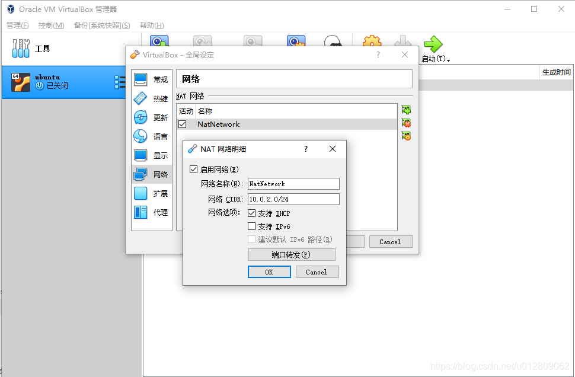
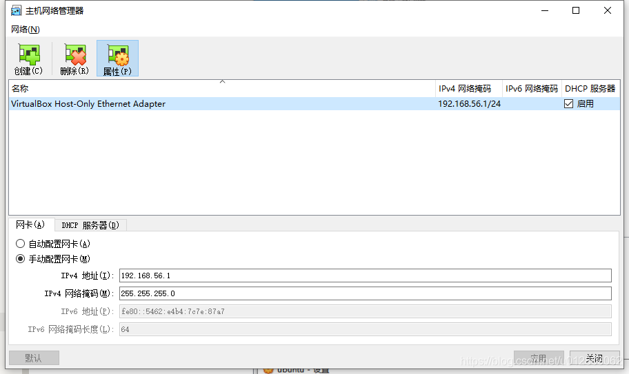

---
阅读进度                            再继续的章节

Rust入门秘笈                        Rust所有权
Rust编程：入门、实战与进阶          第四章，差2.4，2.5，枚举
通过例子学Rust
深入浅出Rust                        2.3.1

Rust编程语言入门教程视频            p20
Rust程序设计                        3.3
Rust 程序设计语言 简体中文版 
https://kaisery.github.io/trpl-zh-cn/title-page.html
www.runoob.com/rust                 rust-enum.html


Rust编程之道
Rust权威指南
精通Rust(第2版) 


---

# 准备

## 安装系统

### 安装 ububtu 20.10 server

- 下载ubuntu-22.10-live-server-amd64.iso
- virtualbox，新建虚拟机：2cpu，4g内存，25g硬盘，网卡1使用默认“网络地址转换NAT”（装完系统后可以在虚拟机里上外网，但与宿主不可互ping，需要加装host-only网卡用于形成互ping的局域网）
- 运行安装server，不要最小安装那样会缺少必要的程序，【Mirror address】那步骤改地址改为：<http://mirrors.aliyun.com/ubuntu>，  并且选上安装ssh，其余默认即可
- 需要下载的都安装完后，回车重启，重启过程中有err再次回车即可，直到输入用户名密码登录，安装完毕

### 设置root密码

- 首先确保已登录普通用户。
- 输入命令：sudo passwd root，输入当前普通用户密码，设置root用户密码，再次输入确认root用户密码
- 输入命令：su root，输入root用户密码进行登录，成功进入root用户后退出root用户，输入命令exit

### 安装net-tools

```shell
    sudo apt install net-tools
```

### 调整网卡硬件

- 关闭运行的虚拟机系统，以下配置是硬件级别设置，可用于所有被虚拟的系统，如centos7和ubuntu20等

- Virtualbox工具栏->管理->全局设定

    

- Virtualbox工具栏->管理->主机网络管理器

    

    

    此刻多了一块网卡如下

    

- Virtualbox客户机网络设置

    网络地址转换NAT，用于上外网

    

    Host-Only用于ssh，即局域网互通

    

### 查看网络状态的命令

- ip a 或 ip addr
- networkctl status -a
- route -n

### 在centos中配置网络

- 修改网卡1（网络地址转换NAT）配置为如下，HWADDR可以不用，UUID可以使用uuidgen生成。保存后, service network restart，此时应可正常访问外网

``` shell

[huawei@10 ~]$ cat /etc/sysconfig/network-scripts/ifcfg-enp0s3
TYPE="Ethernet"
PROXY_METHOD="none"
BROWSER_ONLY="no"
BOOTPROTO="dhcp"
DEFROUTE="yes"
IPV4_FAILURE_FATAL="no"
IPV6INIT="yes"
IPV6_AUTOCONF="yes"
IPV6_DEFROUTE="yes"
IPV6_FAILURE_FATAL="no"
IPV6_ADDR_GEN_MODE="stable-privacy"
NAME="enp0s3"
UUID="00359752-7a18-4c26-bac6-cbb3bb484892"
DEVICE="enp0s3"
ONBOOT="yes"
HWADDR="08:00:27:C5:A0:36"

```

- 修改网卡2（Host-Only）配置为如下，HWADDR可以不用，UUID可以使用uuidgen生成，使用固定IP地址（IPADDR确保在前面创建的host-only网卡的min到max地址中即可）保存后, service network restart，此时应可以与物理机或其他虚拟机互ping

``` shell

[huawei@10 ~]$ cat /etc/sysconfig/network-scripts/ifcfg-enp0s8
TYPE=Ethernet
PROXY_METHOD=none
BROWSER_ONLY=no
BOOTPROTO=yes
DEFROUTE=yes
IPV4_FAILURE_FATAL=no
IPV6INIT=yes
IPV6_AUTOCONF=yes
IPV6_DEFROUTE=yes
IPV6_FAILURE_FATAL=no
IPV6_ADDR_GEN_MODE=stable-privacy
NAME=enp0s8
UUID=27aaf75f-90ce-4cb3-94e2-5279c86b3fcf
DEVICE=enp0s8
ONBOOT=yes
HWADDR="08:00:27:2B:24:FD"
IPADDR=192.168.56.120
NETMASK=255.255.255.0

```

### 在ubuntu中配置网络

- 修改配置文件内容为如下（addresses确保在前面创建的host-only网卡的min到max地址中即可，enp0s3是NAT的网卡，enp0s8是Host-Only网络）
- sudo netplan apply
- ip addr 查看静态ip是否设置成功
- 此时应可以与物理机或其他虚拟机互ping且可以上外网
- 如失败可以route -n看下路由表，检查enp0s8的gateway是否非[添加网卡硬件](#添加网卡硬件)的全局设定中的ip，如何改待完善。。。

``` shell

huaw@test:~$ cat /etc/netplan/00-installer-config.yaml
# This is the network config written by 'subiquity'
network:
  ethernets:
    enp0s3:
      addresses: []
      dhcp4: true
    enp0s8:
      dhcp4: false
      addresses: [192.168.56.102/24]
      nameservers:
        addresses: [192.168.56.1]
  version: 2

```

### 配置ssh

- ubuntu server安装时候如选上ssh了，则不用配置
- 手动配置则如下操作：先 sudo vi /etc/ssh/sshd_config，修改PermitRootLogin为yes后保存退出，再 sudo service ssh restart

### 扩大空余磁盘

- 先查看磁盘占用空间，找到挂载的位置（/dev/mapper/ubuntu--vg-ubuntu--lv），然后扩容，再变更文件系统尺寸。操作如下：

``` shell

huaw@test:~$ df -h
Filesystem                         Size  Used Avail Use% Mounted on
tmpfs                              393M  1.1M  392M   1% /run
/dev/mapper/ubuntu--vg-ubuntu--lv   12G  5.1G  5.7G  48% /
tmpfs                              2.0G     0  2.0G   0% /dev/shm
tmpfs                              5.0M     0  5.0M   0% /run/lock
/dev/sda2                          2.0G  136M  1.7G   8% /boot
tmpfs                              393M  4.0K  393M   1% /run/user/1000


huaw@test:~$ sudo lvresize -l +100%FREE /dev/mapper/ubuntu--vg-ubuntu--lv
  New size (5887 extents) matches existing size (5887 extents).

huaw@test:~$ sudo resize2fs /dev/mapper/ubuntu--vg-ubuntu--lv
resize2fs 1.46.5 (30-Dec-2021)
Filesystem at /dev/mapper/ubuntu--vg-ubuntu--lv is mounted on /; on-line resizing required
old_desc_blocks = 2, new_desc_blocks = 3
The filesystem on /dev/mapper/ubuntu--vg-ubuntu--lv is now 6028288 (4k) blocks long.

huaw@test:~$ df -h
Filesystem                         Size  Used Avail Use% Mounted on
tmpfs                              393M  1.1M  392M   1% /run
/dev/mapper/ubuntu--vg-ubuntu--lv   23G  5.1G   17G  24% /
tmpfs                              2.0G     0  2.0G   0% /dev/shm
tmpfs                              5.0M     0  5.0M   0% /run/lock
/dev/sda2                          2.0G  136M  1.7G   8% /boot
tmpfs                              393M  4.0K  393M   1% /run/user/1000
```

### VirtualBox扩展虚拟机Ubuntu的硬盘容量

- 关闭虚拟机，windows进入VirtualBox的安装目录查看需要修改的虚拟硬盘，使用命令对磁盘进行扩容操作

``` cmd
cd D:\Program Files\Oracle\VirtualBox

VBoxManage list hdds    // 查看对应虚拟磁盘文件的guid

VBoxManage modifyhd 2246d63c-5e3c-454f-8ecc-e5125dbe74a7 ––resize 51200     // 通过guid修改size
```

- 启动虚拟机，进行分区

``` shell

$sudo fdisk /dev/sda
（按m可以查看帮助文档）

首先输入命令：n(添加新分区)之后回车：
接着输入命令:p
剩下步骤全按回车默认，
最后输入命令w保存分区信息。

退出程序后再查看下分区信息：fdisk -l

发现多了一个分区 /dev/sda4
然后重启Ubuntu虚拟机。
```

- 格式化刚才划好的分区/dev/sda4

``` shell

sudo mkfs -t ext4 /dev/sda4
```

- 挂载分区

``` shell
创建目录 /home/huaw/sda4
sudo mkdir sda4

将分区 /dev/sda4 挂载到 /home/huaw/sda4
sudo mount /dev/sda4 /home/huaw/sda4

开机自动挂载，则修改/etc/fstab文件
sudo vim /etc/fstab

在这个文件里面添加一行，保存文件
/dev/sda4 /home/huaw/sda4/ ext4 defaults 0 1

容量扩展完成，再次查看下刚刚挂载好的分区
df -H
```

### Linux磁盘空间100% 查找并删除大文件

https://blog.csdn.net/CL_YD/article/details/79458092?spm=1001.2101.3001.6650.3&utm_medium=distribute.pc_relevant.none-task-blog-2%7Edefault%7ECTRLIST%7ERate-3-79458092-blog-114849739.pc_relevant_aa2&depth_1-utm_source=distribute.pc_relevant.none-task-blog-2%7Edefault%7ECTRLIST%7ERate-3-79458092-blog-114849739.pc_relevant_aa2&utm_relevant_index=6


挂盘
http://events.jianshu.io/p/a2d773965de5

### 修改时区

- 执行tzselect，选4 Asia，选10 China，选1 Beijing，选1 yes
- sudo vi ~/.profile，在文件尾追加如下一行

``` shell
    TZ='Asia/Shanghai'; export TZ
```

- sudo vi /etc/default/locale，在文件尾追加如下一行

``` shell
    LC_TIME=zh_CN.UTF-8
```

### 修改shell前导

- /etc/bash.bashrc与/home/huaw/.bashrc，文件末尾追加此行

``` shell
PS1='[\u@\h \W]\$ '
```

### 改源

- 在安装ubuntu server时候因为修改过Mirror address，因此也不用改了
- 如需手动修改则如下

``` shell

sudo vim /etc/apt/sources.list
:%s/cn\.archive\.ubuntu\.com/mirrors\.aliyun\.com/g

```

### 先安装必要工具

此处可以先重启一下后再操作如下

``` shell
sudo apt-get remove needrestart

sudo apt-get install -y gcc
sudo apt-get install -y gdb
sudo apt-get install -y cmake
sudo apt-get install -y python2
sudo apt-get install -y python3
sudo apt-get install -y perl
sudo apt-get install -y openjdk-18-jdk
sudo apt-get install -y openjdk-17-jdk
sudo apt-get install -y cmake
sudo apt-get install -y automake
sudo apt-get install -y git
sudo apt-get install -y pkg-config
sudo apt-get install -y openssl
sudo apt-get install -y libssl-dev
sudo apt-get install -y build-essential
sudo apt-get install -y libxml2
sudo apt-get install -y clang
sudo apt-get install -y libclang
sudo apt-get install -y protoc
sudo apt-get install -y libprotoc-dev
sudo apt-get install -y bison
sudo apt-get install -y flex
sudo apt-get install -y gettext
sudo apt-get install -y libreadline-dev
sudo apt-get install -y protobuf-compiler
sudo apt-get install -y libprotobuf-dev
sudo apt-get install -y unixodbc
```

## 安装rust

- 执行下面，然后选择1

``` shell
curl https://sh.rustup.rs -sSf | sh
```

- sudo vi ~/.profile，末尾添加如下

```shell
export PATH="$HOME/.cargo/bin:$PATH"
```

- 验证成功

``` shell
huaw@test:~$ .  ~/.profile
huaw@test:~$ rustc --version
rustc 1.65.0 (897e37553 2022-11-02)
huaw@test:~$ cargo --version
cargo 1.65.0 (4bc8f24d3 2022-10-20)
```

## 更新rust

``` shell
huaw@test:~$ rustup update
```

## 连接remote ssh失败的解决方法之一

如果连不上，有可能是因为目标虚拟机的ip之前被别的机器使用过，需要重新生成，在windows执行如下(ip为目标虚拟机ip)

```console
ssh-keygen -R 192.168.56.102
```

会更新/c/Users/huaw/.ssh/known_hosts updated，再次连接成功

## 安装vscode插件

- rust-analyzer
- rust syntax
- crates
- better toml
- rust test lens
- Tabnine
- CodeLLDB

## helloworld

- 新建“main.rs”

``` rust
fn main()
{
    println!("hello world");
}
```

- 使用“rustc main.rs”进行编译

- 运行可执行文件“./main”即可

## 猜数字

``` rust
use rand::Rng;
use std::cmp::Ordering;
use std::io;

fn main() {
    println!("猜数字");
    let secretnum = rand::thread_rng().gen_range(1..100);
    println!("神秘数字是:{}", secretnum);

    loop {
        println!("type a number:");
        let mut guess = String::new();
        io::stdin().read_line(&mut guess).expect("无法读取");
        let guess: u32 = match guess.trim().parse() {
            Ok(num) => num, // 解析出如果类型正确则直接赋值，此处的mum理解为占位符，其实名字随意
            Err(_) => continue, // 参数“_”理解为放弃使用此参数，此为专用不可换名
        };
        println!("你猜的是{}", guess);
        match guess.cmp(&secretnum) {
            Ordering::Less => println!("too small"),
            Ordering::Greater => println!("too big"),
            Ordering::Equal => {
                println!("you win");
                break;
            }
        };
    }
}

```

## vscode调试rust

- 项目名称greeting
- launch.json
- tasks.json
- 先f7编译，在rs文件上加断点F5即可调试

``` shell
huaw@test:~/playground/rust$ cat .vscode/launch.json
{
    "version": "0.2.0",
    "configurations": [
        {
            "name": "rust", // 配置名称，将会在调试配置下拉列表中显示
            "type": "lldb", // 调试器类型：Windows表示器使用cppvsdbg；GDB和LLDB使用cppdbg。该值自动生成
            "request": "launch", // 调试方式
            "program": "${workspaceRoot}/greeting/target/debug/greeting", // 要调试的程序（完整路径，支持相对路径）
            "args": [], // 传递给上面程序的参数，没有参数留空即可
            "stopAtEntry": false, // 是否停在程序入口点（即停在main函数开始）（目前为不停下）
            "cwd": "${workspaceRoot}", // 调试程序时的工作目录
            "environment": [],
            "externalConsole": false, // 调试时是否显示控制台窗口(目前为不显示)
            //"preLaunchTask": "build", //预先执行task.json
            "MIMode": "lldb" //MAC下的debug程序
        }
    ]
}

huaw@test:~/playground/rust$ cat .vscode/tasks.json 
{
        "version": "2.0.0",
        "tasks": [
                {
                        "type": "shell",
                        "command": "cargo",
                        "options": {
                                "cwd": "${workspaceFolder}/greeting/"
                        },

                        "args":[
                                "build"
                        ],
                        "problemMatcher": [
                                "$rustc"
                        ],
                        "group": "build",
                        "label": "rust: cargo build"
                }
        ]
}

```


# cargo

## 常用命令


## 创建项目

- 会自动创建目录
- src/main.rs是主文件，说明这是一个可执行程序
- 如果是创建库，通过给cargo new命令添加--lib参数，则可以创建用于编写库的项目：cargo new --lib hellolib，此时没有main.rs，而有lib.rs
- src/main.rs与src/lib.rs可以同时存在，都叫做crate roots，即编译的入口文件
- toml是配置文件，记录版本信息，依赖项

``` shell
huaw@test:~/playground/rust$ cargo new hellocargo
     Created binary (application) `hellocargo` package

huaw@test:~/playground/rust/hellocargo$ tree
.
├── Cargo.toml
└── src
    └── main.rs
```


## 版本管理

默认自带版本管理，但可以使用huaw@test:~/playground/rust$ cargo new --vcs none hello3创建不带有版本管理的项目

## 迁移到cargo项目

将代码挪到使用cargo创建的项目目录下的src内即可，然后手写toml

## 检查代码语法

仅检查代码问题，并不编译，快很多

``` shell
huaw@test:~/playground/rust/hellocargo$ cargo check
    Checking hellocargo v0.1.0 (/home/huaw/playground/rust/hellocargo)
    Finished dev [unoptimized + debuginfo] target(s) in 0.07s
```

## 编译、运行、清理

- Cargo 调用了 Rust 编译器 rustc，然后又运行了生成的可执行文件。Cargo 把可执行文件放到了包顶部的 target 子目录中
- Cargo.lock 此文件会在编译时刻出现，内容是记录的所有依赖库版本
- 如toml进行了手动改变，则编译后会更新Cargo.lock

``` shell
huaw@test:~/playground/rust/hellocargo$ cargo run
    Finished dev [unoptimized + debuginfo] target(s) in 0.00s
     Running `target/debug/hellocargo`
Hello, world!
```


### debug

会build到target/debug下

``` shell
huaw@test:~/playground/rust/hellocargo$ cargo build
   Compiling hellocargo v0.1.0 (/home/huaw/playground/rust/hellocargo)
    Finished dev [unoptimized + debuginfo] target(s) in 0.38s
```

### release

会build到target/release下

``` shell
huaw@test:~/playground/rust/hellocargo$ cargo build --release
   Compiling hellocargo v0.1.0 (/home/huaw/playground/rust/hellocargo)
    Finished release [optimized] target(s) in 0.19s
```

### clean

cargo clean会清理target


## rust语言服务

- 关闭语言服务

    vscode主菜单view->command palette->rust-analyzer: Stop server

- 开启语言服务

    vscode主菜单view->command palette->rust-analyzer: Start server

## 换源

在cargo所在目录中执行 touch config 创建配置文件，写如下后保存，按需再重新 cargo build 即可

``` shell
huaw@test:~/.cargo/bin$ cat config 
[source.crates-io]
registry ="https://github.com/rust-lang/crates.io-index"
replace-with = 'tuna'
[source.tuna]
registry = "https://mirrors.tuna.tsinghua.edu.cn/git/cratesio-index.git"
[net]
git-fetch-with-cli = true
```

# cargo-pgx

## 下载、编译、运行、测试、打包

- 安装

install进行安装，init命令会下载版本几个的postgres然后编译到目录~/.pgx/中（此目录里含有对应的pg代码目录与initdb后对应的数据目录）。这个下载步骤是必须的，因为后续pgx会为每中版本的postgres的header文件生成对应的Rust bindings，以及后续pgx 的测试框架中也会用到。​

``` shell
cargo install cargo-pgx
cargo pgx init  // 此步会下载n个pg源码进行编译，时间会稍长
```

- 创建一个extension项目

``` shell
huaw@test:~/playground/rust$ cargo pgx new my_extension

huaw@test:~/playground/rust/my_extension$ tree
.
├── Cargo.toml
├── my_extension.control
├── sql
└── src
    └── lib.rs

2 directories, 3 files
```

- 文件说明

lib.rs里的#[pg_extern] 宏所修饰的函数就是我们要实现的extension函数，mod tests , pub mod pg_test 是pgx已经为我们写好了的测试模块，用于编写相关测试代码。pgx默认已经给我们写好了名为 hello_my_extension 的extension，功能很简单，就是返回 “Hello, my_extension” 字符串
​

```
use pgx::prelude::*;    // 导入包

pgx::pg_module_magic!();    // 初始化

#[pg_extern]    // pg_extern会将此函数导出为c函数
fn hello_my_extension() -> &'static str {
    "Hello, my_extension"
}

#[cfg(any(test, feature = "pg_test"))]  // 可以使用cargo pgx test 进行测试，即调用crate::hello_my_extension会返回"Hello, my_extension"
#[pg_schema]
mod tests {
    use pgx::prelude::*;

    #[pg_test]
    fn test_hello_my_extension() {
        assert_eq!("Hello, my_extension", crate::hello_my_extension());
    }

}

#[cfg(test)]
pub mod pg_test {
    pub fn setup(_options: Vec<&str>) {
        // perform one-off initialization when the pg_test framework starts
    }

    pub fn postgresql_conf_options() -> Vec<&'static str> {
        // return any postgresql.conf settings that are required for your tests
        vec![]
    }
}

```

Cargo.toml里面有项目的设置，lib类型是cdylib（动态库）

my_extension.control文件用于pg加载插件时刻使用

``` shell
comment = 'my_extension:  Created by pgx'
default_version = '@CARGO_VERSION@'
module_pathname = '$libdir/my_extension'
relocatable = false
superuser = false

```

- 运行extension

使用cargo pgx run即可，后也可以跟参数pg14或pg13，对应不同的postgres版本（默认版本是在Cargo.toml的features里设置），cargo pgx run会把extension编译为一个 .so 共享库文件，复制到对应版本的 ~/.pgx/ 目录中，然后启动Postgres实例，通过psql连接到和extension同名的数据库上。编译完成后，开发者就会处于psql的shell界面中，可以调用extension进行测试了。

``` shell

huaw@test:~/playground/rust/$ cd my_extension
huaw@test:~/playground/rust/my_extension$ cargo pgx run pg14


...
Compiling funty v2.0.0
   Compiling bitvec v1.0.1
   Compiling serde_cbor v0.11.2
   Compiling uuid v1.2.2
   Compiling seahash v4.1.0
   Compiling pgx v0.6.0
   Compiling my_extension v0.0.0 (/home/huaw/playground/rust/my_extension)
    Finished dev [unoptimized + debuginfo] target(s) in 2m 22s
  Installing extension
     Copying control file to /home/huaw/.pgx/13.9/pgx-install/share/postgresql/extension/my_extension.control
     Copying shared library to /home/huaw/.pgx/13.9/pgx-install/lib/postgresql/my_extension.so
 Discovering SQL entities
  Discovered 1 SQL entities: 0 schemas (0 unique), 1 functions, 0 types, 0 enums, 0 sqls, 0 ords, 0 hashes, 0 aggregates, 0 triggers
     Writing SQL entities to /home/huaw/.pgx/13.9/pgx-install/share/postgresql/extension/my_extension--0.0.0.sql
    Finished installing my_extension
    Starting Postgres v13 on port 28813
     Creating database my_extension
psql (13.9)
Type "help" for help.
```

在psql里检测插件

``` sql

my_extension=# CREATE EXTENSION my_extension;  // 安装插件
CREATE EXTENSION
my_extension=# \df
                              List of functions
 Schema |        Name        | Result data type | Argument data types | Type 
--------+--------------------+------------------+---------------------+------
 public | hello_my_extension | text             |                     | func
(1 row)

my_extension=# SELECT hello_my_extension();
 hello_my_extension  
---------------------
 Hello, my_extension
(1 row)

my_extension=# \q
```

还可以进行测试，其实就是跑make test，但会测试所有回归，时间稍长

``` shell
huaw@test:~/playground/rust/my_extension$ cargo pgx test

...
Compiling pgx-tests v0.6.0
   Compiling my_extension v0.0.0 (/home/huaw/playground/rust/my_extension)
    Building [=======================> ] 231/232: my_extension(test)             
    Finished test [unoptimized + debuginfo] target(s) in 5m 29s
     Running unittests src/lib.rs (target/debug/deps/my_extension-a0aa68729b5952a7)

running 1 test
    Building extension with features  pg_test
     Running command "cargo" "build" "--features" " pg_test" "--message-format=json-render-diagnostics"


  Installing extension
     Copying control file to /home/huaw/.pgx/13.9/pgx-install/share/postgresql/extension/my_extension.control
     Copying shared library to /home/huaw/.pgx/13.9/pgx-install/lib/postgresql/my_extension.so
    Finished installing my_extension
The files belonging to this database system will be owned by user "huaw".
This user must also own the server process.

The database cluster will be initialized with locale "C".
The default database encoding has accordingly been set to "SQL_ASCII".
The default text search configuration will be set to "english".

Data page checksums are disabled.

creating directory /home/huaw/playground/rust/my_extension/target/pgx-test-data-13 ... ok
creating subdirectories ... ok
selecting dynamic shared memory implementation ... posix
selecting default max_connections ... 100
selecting default shared_buffers ... 128MB
selecting default time zone ... Asia/Shanghai
creating configuration files ... ok
running bootstrap script ... ok
performing post-bootstrap initialization ... ok
syncing data to disk ... ok

initdb: warning: enabling "trust" authentication for local connections
You can change this by editing pg_hba.conf or using the option -A, or
--auth-local and --auth-host, the next time you run initdb.

Success. You can now start the database server using:

    /home/huaw/.pgx/13.9/pgx-install/bin/pg_ctl -D /home/huaw/playground/rust/my_extension/target/pgx-test-data-13 -l logfile start

test tests::pg_test_hello_my_extension ... ok

test result: ok. 1 passed; 0 failed; 0 ignored; 0 measured; 0 filtered out; finished in 28.34s

stopping postgres (pid=103537)
huaw@test:~/playground/rust/my_extension$ 
```

可以使用cargo pgx schema查看pgx生成的sql语句内容，可以看到末尾打印出编译成了"LANGUAGE c"。保存为sql文件则“cargo pgx schema -o a.sql”即可

``` shell
huaw@test:~/playground/rust/my_extension$ cargo pgx schema
    Building for SQL generation with features ``
    Finished dev [unoptimized + debuginfo] target(s) in 0.07s
 Discovering SQL entities
  Discovered 1 SQL entities: 0 schemas (0 unique), 1 functions, 0 types, 0 enums, 0 sqls, 0 ords, 0 hashes, 0 aggregates, 0 triggers
     Writing SQL entities to /dev/stdout
/* 
This file is auto generated by pgx.

The ordering of items is not stable, it is driven by a dependency graph.
*/

-- src/lib.rs:6
-- my_extension::hello_my_extension
CREATE  FUNCTION "hello_my_extension"() RETURNS TEXT /* &str */
STRICT
LANGUAGE c /* Rust */
AS 'MODULE_PATHNAME', 'hello_my_extension_wrapper';
huaw@test:~/playground/rust/my_extension$ 
```

- 添加一个新函数

上面的代码已经编译过且在pg里安装过，如仅改函数逻辑，不改签名则可以每次run重新build库文件后自动更新为最新逻辑，否则就需要编译完手动在psql里重新安装插件才会更新逻辑，具体看如下

- 在hello_my_extension函数下面添加一个新函数

``` rust
#[pg_extern]
fn hello_my_extension2() -> &'static str {
    "Hello, my_extension2"
}
```

- cargo pgx run pg14 编译运行，进入psql后：
   drop extension my_extension;
   CREATE EXTENSION my_extension; 
   可以看到2个函数了

- cargo pgx package 打包（编译为release），如果找不到pg_config，可以安装一下 “sudo apt-get install --reinstall libpq-dev”。


## 其他命令

https://github.com/tcdi/pgx  

``` shell
huaw@test:~/.pgx$ cargo pgx start all
    Starting Postgres v11 on port 28811
    Starting Postgres v13 on port 28813
    Starting Postgres v14 on port 28814
    Starting Postgres v15 on port 28815

huaw@test:~/.pgx$ cargo pgx status
Postgres v11 is running
Postgres v12 is running
Postgres v13 is running
Postgres v14 is running
Postgres v15 is running

huaw@test:~/.pgx$ cargo pgx stop pg11
    Stopping Postgres v11

huaw@test:~/.pgx$ cargo pgx stop all
    Stopping Postgres v12
    Stopping Postgres v13
    Stopping Postgres v14
    Stopping Postgres v15

huaw@test:~/.pgx$ cargo pgx status
Postgres v11 is stopped
Postgres v12 is stopped
Postgres v13 is stopped
Postgres v14 is stopped
Postgres v15 is stopped

```

# 基本概念

- rust是静态编译语言

## 语句和表达式

- 语句（statement）指那些执行操作但不返回值的指令。因为语句不会返回值。所以在Rust中不能将一条let语句赋值给另一个变量，如下错误

``` rust
fn main() {
    let x = (let y = 6);
    // 由于语句 let y = 6 没有返回任何值，所以变量 x 就没有可以绑定的东西。
}
```

- 表达式（expression）指会进行计算并产生一个值作为结果的指令。调用函数是表达式，调用宏是表达式，用来创建作用域的花括号（{}）也是表达式。

``` rust
fn main() {
    let x = {
        let y = 4;
        y + 1   // 这里没有加分号（是表达式）。若其后加了分号（即 y + 1;）则变成了语句，将不会返回任何值
    };

    println!("x = {}", x);  // 输出 x = 5
}
```


## 基本数据类型

### 整数

表示整数，比如：i8、u8、i16、u16、i32、u32、i64、u64、isize、usize。i表示有符号，u表示无符号，可以将 usize 和 isize 看作 C 和 C++ 中的 size_t 和 ptrdiff_t。usize 无符号，isize 有符号。它们的精度取决于目标机器的寻址空间大小：在 32 位机器上是 32 位长，在 64 位机器上是 64 位长。Rust 要求数组索引必须是 usize 值。另外，表示数组或向量的大小，或者某些数据结构中元素数量的值通常也是 usize 类型的。

```rust
fn main() {
   let integer1: u32 = 17; // 类型声明
   let integer2 = 17u32; // 类型后缀声明
   let integer3 = 17; // 默认i32类型
   let integer4: u32 = 0b10001; // 二进制
   let integer5: u32 = 0o21; // 八进制
   let integer6: u32 = 0x11; // 十六进制
   let integer7 = 50_000; // 数字可读性分隔符_
   println!("{}", integer1);
   println!("{}", integer2);
   println!("{}", integer3);
   println!("{}", integer4);
   println!("{}", integer5);
   println!("{}", integer6);
   println!("{}", integer7);

huaw@test:~/playground/rust/hellocargo$ cargo run
    Finished dev [unoptimized + debuginfo] target(s) in 0.00s
     Running `target/debug/hellocargo`
17
17
17
17
17
17
50000
}
```

字面量后面可以跟后缀，可代表该数字的具体类型，从而省略掉显示类型标记

``` rust
fn main() {
    let var5 = 0x_1234_ABCD; //使用下划线分割数字,不影响语义,但是极大地提升了阅读体验。
    let var6 = 123usize; // i6变量是usize类型
    let var7 = 0x_ff_u8; // i7变量是u8类型
    let var8 = 32; // 不写类型,默认为 i32 类型
    println!("{}", var5);
    println!("{}", var6);
    println!("{}", var7);
    println!("{}", var8);
    let x : i32 = 9;
    println!("9 power 3 = {}", x.pow(3));   // 整数类型有一个方法是pow，它可以计算n次幂
    println!("9 power 3 = {}", 9_i32.pow(3)); // 甚至可以不使用变量，直接对整型字面量调用函数
}

huaw@test:~/playground/rust/hellocargo$ cargo run
   Compiling hellocargo v0.1.0 (/home/huaw/playground/rust/hellocargo)
    Finished dev [unoptimized + debuginfo] target(s) in 0.19s
     Running `target/debug/hellocargo`
305441741
123
255
32
9 power 3 = 729
9 power 3 = 729
```

### 浮点

可以带小数的类型，两个浮点类型 f32 和 f64，分别是 IEEE 单精度和双精度浮点类型，类似 C和 C++ 的 float 和 double。

``` rust
fn main() {
    let float1: f32 = 1.1; // 类型声明
    let float2 = 2.2f32; // 类型后缀声明
    let float3 = 3.3; // 默认f64类型
    let float4 = 11_000.555_001; // 数字可读性分隔符_
    println!("{}", float1);
    println!("{}", float2);
    println!("{}", float3);
    println!("{}", float4);
}

huaw@test:~/playground/rust/hellocargo$ cargo run
   Compiling hellocargo v0.1.0 (/home/huaw/playground/rust/hellocargo)
    Finished dev [unoptimized + debuginfo] target(s) in 0.20s
     Running `target/debug/hellocargo`
1.1
2.2
3.3
11000.555001
```

### 布尔

bool类型只包括两个值: true 和 false。布尔类型最主要的用途是在if表达式内作为条件使用。必须写成 if x != 0 { ... } 类型这样才行。

``` rust
fn main() {
    let t: bool = true; // 显式类型声明
    let f = false; // 隐式类型声明
    println!("{}", t);
    println!("{}", f);
}
huaw@test:~/playground/rust/hellocargo$ cargo run
   Compiling hellocargo v0.1.0 (/home/huaw/playground/rust/hellocargo)
    Finished dev [unoptimized + debuginfo] target(s) in 0.22s
     Running `target/debug/hellocargo`
true
false
```

### 字符

char类型表示单个字符。char类型使用单引号制定，而不同于字符串使用双引号指定。因为char类型的设计目的是描述任意一个unicode字符，因此它占据的内存空间不是1个字节，而是4个字节。Rust 会将字符和数值类型区别对待，即 char 既不是 u8 也不是 i8

``` rust
fn main() {
    let a = 'y';
    let b = '✔';
    let c = '☺';
    println!("a = {}, b = {}, c = {}", a, b, c);    // 输出 a = y, b = ✔, c = ☺
}
```

字符类型字面量也可以使用转义符：

``` rust
let love = '❤'; // 可以直接嵌入任何 unicode 字符
let c1 = '\n'; // 换行符
let c2 = '\x7f'; // 8 bit 字符变量
let c3 = '\u{7FFF}'; // unicode字符
```


## 类型转换

与 C 和 C++ 不同，Rust 几乎不进行隐式数值类型转换。如果函数接收 f64 参数，传入 i32 值就会导致错误。事实上，Rust 甚至都不会隐式地将 i16 值转换为 i32 值，即使每个 i16 值也是 i32 值。不过，这里的关键词是隐式。使用 as 操作符进行显式转换是没有问题的，
## Format格式说明

println!是个宏，自动换行，如下面使用占位符

``` rust
fn main() {
    println!("{}", 1); // 默认用法,打印Display
    println!("{:o}", 9); // 八进制
    println!("{:x}", 255); // 十六进制 小写
    println!("{:X}", 255); // 十六进制 大写
    println!("{:p}", &0); // 指针
    println!("{:b}", 15); // 二进制
    println!("{:e}", 10000f32); // 科学计数(小写)
    println!("{:E}", 10000f32); // 科学计数(大写)
    println!("{:?}", "test"); // 打印Debug
    println!("{:#?}", ("test1", "test2")); // 带换行和缩进的Debug打印
    println!("{a} {b} {b}", a = "x", b = "y"); // 命名参数
}

huaw@test:~/playground/rust/hellocargo$ cargo run
   Compiling hellocargo v0.1.0 (/home/huaw/playground/rust/hellocargo)
    Finished dev [unoptimized + debuginfo] target(s) in 0.24s
     Running `target/debug/hellocargo`
1
11
ff
FF
0x559f769a3068
1111
1e4
1E4
"test"
(
    "test1",
    "test2",
)
x y y
```

## 变量（可变变量和不可变变量）

- 使用let声明变量，默认是不可变（非常量，仅是不可变的变量），再次赋值会出错
- 类型没有“默认构造函数”，变量没有“默认值”，如果没有显式赋值，它就没有被初始化
- Rust里面的下划线是一个特殊的标识符，作用是忽略这个变量绑定，后面不会再用到了

``` rust
fn main() {
    let mut a = 123;
    let b = a;
    a = 321;
    // b = 321; // 这样写会报错
    println!("a = {}, b = {}", a, b);
}
```

- 如要可变加mut

``` rust
let foo = 5;    // foo是不可变的
let mut bar = 5;    // bar是可变的
```

- 会自动推导（可能多种结果则需要手动指定），可以不写类型，但rust是强类型

``` rust
//  指定具体类型
let guess: u32 = 10;
```

## shadowing

- 在同一个代码块中声明一个与之前已声明变量同名的新变量，新变量会遮蔽之前的变量，即无法再去访问前一个同名的变量

- 实质是通过let关键字声明了一个新的变量，只是名称恰巧与前一个变量名相同而已，但它们是两个完全不同的变量，处于不同的内存空间，值可以不同，值的类型也可以不同

- 常用于需要在同一个函数内部把一个变量转换为另一个类型的变量，但又不想给它们起不同的名字。或是在同一个函数内部，需要修改一个变量绑定的可变性

``` rust
fn main() {
    let name = "yuyoubei";
    println!("name = {}", name); // 输出 name = yuyoubei
    let name = name.len();
    println!("name = {}", name); // 输出 name = 8
}
```

## 常量

- 常量声明使用const关键字，且必须注明值的类型。
- 通过变量遮蔽的方式可以让不可变变量的值改变（本质上是新的变量，只是同名而已）。但是，常量不能遮蔽，不能重复定义。也就是说，不存在内层或后面作用域定义的常量去遮蔽外层或前面定义的同名常量的情况。常量一旦定义后就永远不可变更和重新赋值。
- 常量可以在任何作用域中声明，包括全局作用域。在声明它的作用域中，常量在整个程序生命周期内都有效，这使得常量可以作为多处代码共同使用的全局范围的值。
- 常量只能被赋值为常量表达式或数学表达式，不能是函数返回值，或是其他在运行时才能确定的值。

``` rust
fn main() {
    const MAX_POINTS : u32 = 100_000;
    println!("MAX POINTS = {}", MAX_POINTS);
}
```

## 注释

同c++

```
fn main() {
    // 这 是 行 注 释 的 例 子
    // 注 意 有 两 个 斜 线 在 本 行 的 开 头
    // 在 这 里 面 的 所 有 内 容 都 不 会 被 编 译 器 读 取
    // println!("Hello, world!");
    // 请 运 行 一 下 ， 你 看 到 结 果 了 吗 ？ 现 在 请 将 上 述 语 句 的 两 条 斜 线 删 掉 ， 并 重 新 运 行 。
    /*
     * 这 是 另 外 一 种 注 释——块 注 释 。 一 般 而 言 ， 行 注 释 是 推 荐 的 注 释 格 式 ，
     * 不 过 块 注 释 在 临 时 注 释 大 块 代 码 特 别 有 用 。/* 块 注 释 可 以 /* 嵌 套, */ */
     * 所 以 只 需 很 少 按 键 就 可 注 释 掉 这 些 main() 函 数 中 的 行 。/*/*/* 自 己 试 试 ！*/*/*/
     */
    /*
    注 意 ， 上 面 的 例 子 中 纵 向 都 有 `*`， 这 只 是 一 种 风 格 ， 实 际 上 这 并 不 是 必 须 的 。
    */
    // 观 察 块 注 释 是 如 何 简 单 地 对 表 达 式 进 行 修 改 的 ， 行 注 释 则 不 能 这 样 。
    // 删 除 注 释 分 隔 符 将 会 改 变 结 果 。
    let x = 5 + /* 90 + */ 5;
    println!("Is `x` 10 or 100? x = {}", x);
}
```


## 运算符

- 算术运算符
- 关系运算符

``` rust
fn logical_op(x: i32, y: i32) {
    let z : bool = x < y;
    println!("{}", z);
}
```

- 逻辑运算符

``` rust
fn main() {
    let x = true;
    let y: bool = !x; // 取反运算
    let z = x && y; // 逻辑与,带短路功能
    println!("{}", z);
    let z = x || y; // 逻辑或,带短路功能
    println!("{}", z);
    let z = x & y; // 按位与,不带短路功能
    println!("{}", z);
    let z = x | y; // 按位或,不带短路功能
    println!("{}", z);
    let z = x ^ y; // 按位异或,不带短路功能
    println!("{}", z);
}

huaw@test:~/playground/rust/hellocargo$ cargo run
   Compiling hellocargo v0.1.0 (/home/huaw/playground/rust/hellocargo)
    Finished dev [unoptimized + debuginfo] target(s) in 0.19s
     Running `target/debug/hellocargo`
false
true
false
true
true
```

- 位运算符

## 类型推导

Rust只允许“局部变量/全局变量”实现类型推导，而函数签名等场景下是不允许的，这是故意这样设计的。这是因为局部变量只有局部的影响，全局变量必须当场初始化而函数签名具有全局性影响。函数签名如果使用自动类型推导，可能导致某个调用的地方使用方式发生变化，它的参数、返回值类型就发生了变化，进而导致远处另一个地方的编译错误，这是设计者不希望看到的情况。

``` rust
fn main() {
    // 没有明确标出变量的类型,但是通过字面量的后缀,
    // 编译器知道elem的类型为u8
    let elem = 5u8;
    // 创建一个动态数组,数组内包含的是什么元素类型可以不写
    let mut vec = Vec::new();
    vec.push(elem);
    // 到后面调用了push函数,通过elem变量的类型,
    // 编译器可以推导出vec的实际类型是 Vec<u8>
    println!("{:?}", vec);

    let player_scores = [("Jack", 20), ("Jane", 23), ("Jill", 18), ("John", 19)];
    // players 是动态数组,内部成员的类型没有指定,交给编译器自动推导
    let players: Vec<_> = player_scores
        .iter()
        .map(|&(player, _score)| player)
        .collect();
    println!("{:?}", players);
}

huaw@test:~/playground/rust/hellocargo$ cargo run
   Compiling hellocargo v0.1.0 (/home/huaw/playground/rust/hellocargo)
    Finished dev [unoptimized + debuginfo] target(s) in 0.30s
     Running `target/debug/hellocargo`
[5]
["Jack", "Jane", "Jill", "John"]
```

## 类型别名

- 可以用type关键字给同一个类型起个别名（type alias）

``` rust
type Age = u32;
fn grow(age: Age, year: u32) -> Age {
    age + year
}
fn main() {
    let x: Age = 20;
    println!("20 years later: {}", grow(x, 20));
}

huaw@test:~/playground/rust/hellocargo$ cargo run
   Compiling hellocargo v0.1.0 (/home/huaw/playground/rust/hellocargo)
    Finished dev [unoptimized + debuginfo] target(s) in 0.21s
     Running `target/debug/hellocargo`
20 years later: 40
```

- 类型别名还可以用在泛型，以后使用Double<i32>的时候，就等同于（i32，Vec<i32>）

``` rust
type Double<T> = (T, Vec<T>); // 小括号包围的是一个 tuple,请参见后文中的复合数据类型
```

## 静态变量

- 用static声明的变量的生命周期是整个程序，从启动到退出。static变量的生命周期永远是'static，它占用的内存空间也不会在执行过程中回收。这也是Rust中唯一的声明全局变量的方法。
- 全局变量必须在声明的时候马上初始化
- 全局变量的初始化必须是编译期可确定的常量，不能包括执行期才能确定的表达式、语句和函数调用；
- 带有mut修饰的全局变量，在使用的时候必须使用unsafe关键字。

``` rust
fn main() {
    //局部变量声明,可以留待后面初始化,只要保证使用前已经初始化即可
    let x;
    let y = 1_i32;
    x = 2_i32;
    println!("{} {}", x, y);
    //全局变量必须声明的时候初始化,因为全局变量可以写到函数外面,被任意一个函数使用
    static G1: i32 = 3;
    println!("{}", G1);
    //可变全局变量无论读写都必须用 unsafe修饰
    static mut G2: i32 = 4;
    unsafe {
        G2 = 5;
        println!("{}", G2);
    }
    //全局变量的内存不是分配在当前函数栈上,函数退出的时候,并不会销毁全局变量占用的内存空间,程序退出才会回收
}

huaw@test:~/playground/rust/hellocargo$ cargo run
   Compiling hellocargo v0.1.0 (/home/huaw/playground/rust/hellocargo)
    Finished dev [unoptimized + debuginfo] target(s) in 0.20s
     Running `target/debug/hellocargo`
2 1
3
5
```

- 禁止在声明static变量的时候调用普通函数，或者利用语句块调用其他非const代码

``` rust
// 这样是允许的
static array : [i32; 3] = [1,2,3];
// 这样是不允许的
static vec : Vec<i32> = { let mut v = Vec::new(); v.push(1); v };
```

调用const fn是允许的

``` rust
#![feature(const_fn)]
fn main() {
use std::sync::atomic::AtomicBool;
static FLAG: AtomicBool = AtomicBool::new(true);
}
```

## 溢出处理

在release中溢出会翻转（wrap）为负值（与 C++ 不同，C++ 中的有符号整数溢出是未定义行为）

## 命令行参数

## 断言

assert! 宏，用于验证参数的值都不等于0。! 符号表示这是一个宏调用，不是函数调用。与 C 和 C++ 中的assert 宏类似，Rust 中的 assert! 宏会检查自己的参数是不是true，如果不是，则终止程序并输出相关信息，包含检查失败的代码在源代码中的位置。这种突然的终止在 Rust 中叫panic。
与 C 和 C++ 中的断言可以跳过不同，Rust 不管程序是如何编译的都会检查断言。不过也有一个 debug_assert! 宏，它会在程序为速度而编译时被跳过。

# 复合类型

复合类型（compound type）可以将多个不同类型的值组合为一个类型。Rust中提供了两种内置的复合数据类型：元组（tuple）和数组（array）。

## tuple

元组类型是由一个或多个类型的元素组合成的复合类型，使用小括号“()”把所有元素放在一起。元素之间使用逗号“，”分隔。元组中的每个元素都有各自的类型，且这些元素的类型可以不同。元组的长度固定，一旦定义就不能再增长或缩短。如果显式指定了元组的数据类型，那么元素的个数必须和数据类型的个数相同。

- 使用“元组名.索引”来访问元组中相应索引位置的元素
- 使用模式匹配的方式来解构赋值，元组中的每个元素按照位置顺序赋值给变量（就是拆包）

``` rust
fn main() {
    let tup1: (i8, f32, bool) = (-10, 7.7, false);
    let tup2 = (7.7, (false, 10));
    let tup3 = (100,); // 在元素后面添加逗号来区分是元组，而不是括号表达式

    println!("{}, {}", tup1.0, (tup2.1).1);
    println!("{}", tup3.0);

    let (x, y, z) = tup1;
    println!("x: {}, y: {}, z: {}", x, y, z);
}

huaw@test:~/playground/rust/hellocargo$ cargo run
    Finished dev [unoptimized + debuginfo] target(s) in 0.01s
     Running `target/debug/hellocargo`
-10, 10
100
x: -10, y: 7.7, z: false
```

## 数组

数组（Array）是Rust内建的原始集合类型，数组的特点为：
· 数组大小固定。
· 元素均为同类型。
· 默认不可变。

数组类型是由相同类型的元素组合成的复合类型，我们可以使用
[T; n]表示，T代表元素类型，n代表长度即元素个数。

数组的声明和初始化有以下3种方式

- 指定数组类型，为每个元素赋初始值。所有初始值放入中括号“[]”中，之间使用逗号“，”分隔。如 let arr: [i32; 5] = [1, 2, 3, 4, 5];
- 省略数组类型，为每个元素赋初始值。由于已指定每个元素的初始值，可以从初始值推断出数组类型。如 let arr = [1, 2, 3, 4, 5];
- 省略数组类型，为所有元素使用默认值初始化。如 let arr = [1; 5]; // 等价于：let arr = [1, 1, 1, 1, 1];

使用“数组名［索引］”来访问数组中相应索引位置的元素，元素的索引从0开始计数。

``` rust
fn main() {
    let arr1: [i32; 5] = [1, 2, 3, 4, 5];
    let arr2 = [1, 2, 3, 4, 5];
    let arr3: [i32; 5] = [1; 5];
    let arr4 = [1; 5];

    println!("{:?}", arr1);
    println!("{:?}", arr2);
    println!("{:?}", arr3);
    println!("{:?}", arr4);
    println!("arr1[0]: {}, arr3[2]: {}", arr1[0], arr3[2]);
}

huaw@test:~/playground/rust/hellocargo$ cargo run
   Compiling hellocargo v0.1.0 (/home/huaw/playground/rust/hellocargo)
    Finished dev [unoptimized + debuginfo] target(s) in 0.21s
     Running `target/debug/hellocargo`
[1, 2, 3, 4, 5]
[1, 2, 3, 4, 5]
[1, 1, 1, 1, 1]
[1, 1, 1, 1, 1]
arr1[0]: 1, arr3[2]: 1
```
## range

范围类型常用来生成从一个整数开始到另一个整数结束的整数序列，有左闭右开和全闭两种形式，比如（1..5）是左闭右开区间，表示生成1、2、3、4这4个数字；（1..=5）是全闭区间，表示生成1、2、3、4、5这5个数字。范围类型自带一些方法，如

- rev方法可以将范围内的数字顺序反转
- sum方法可以对范围内的数字进行求和

下面案例演示了rev、sum方法

``` rust
fn main() {
    print!("(1..5): ");
    for i in 1..5 {
        print!("{} ", i);
    }
    println!();

    print!("(1..=5).rev: ");
    for i in (1..=5).rev() {
        print!("{} ", i);
    }
    println!();

    let sum: i32 = (1..=5).sum();
    println!("1 + 2 + 3 + 4 + 5 = {}", sum);
}

huaw@test:~/playground/rust/hellocargo$ cargo run
    Finished dev [unoptimized + debuginfo] target(s) in 0.01s
     Running `target/debug/hellocargo`
(1..5): 1 2 3 4 
(1..=5).rev: 5 4 3 2 1 
1 + 2 + 3 + 4 + 5 = 15
```

## 切片

切片（Slice）是对数据值的部分引用。切片结果必须是引用类型

- ..y 等价于 0..y
- x.. 等价于位置 x 到数据结束
- .. 等价于位置 0 到结束

``` rust
fn main() {
    let s = String::from("broadcast");

    let part1 = &s[0..5];
    let part2 = &s[5..9];

    println!("{}={}+{}", s, part1, part2);
}

broadcast=broad+cast

----------------------------------

fn main() {
    let arr = [1, 3, 5, 7, 9];
    let part = &arr[0..3];
    for i in part.iter() {
        println!("{}", i);
    }
}

1
3
5
```

``` rust
    let arr: [i32; 5] = [1, 2, 3, 4, 5];
    assert_eq!(&arr, &[1, 2,3,4,5]);
    assert_eq!(&arr[1..], [2,3,4,5]);
    assert_eq!(&arr.len(), &5);
    assert_eq!(&arr.is_empty(), &false);
    let arr = &mut [1, 2, 3];
    arr[1] = 7;
    assert_eq!(arr, &[1, 7, 3]);
    let vec = vec![1, 2, 3];
    assert_eq!(&vec[..], [1,2,3]);
    let str_slice: &[&str] = &["one", "two", "three"];
    assert_eq!(str_slice, ["one", "two", "three"]);
```

错误的演示，被切片引用的字符串禁止更改其值

``` rust
fn main() {
    let mut s = String::from("runoob");
    let slice = &s[0..3];
    s.push_str("yes!"); // 错误
    println!("slice = {}", slice);
}
```

# 结构体

## 定义、赋值、取值

- 结构体类型是一个自定义数据类型，通过struct关键字加自定义命名，可以把多个类型组合在一起成为新的类型。
- 结构体中以“name:type”格式定义字段，name是字段名称，type是字段类型。结构体名和字段名都遵循变量的命名规则，结构体名应该能够描述它所组合的数据的意义；字段默认不可变，并要求明确指定数据类型，不能使用自动类型推导功能。
- 每个字段之间用逗号分隔，最后一个逗号可以省略。
- 需要注意的是，结构体实例默认是不可变的，且不允许只将某个字段标记为可变，即mut只能加在struct的实例上。

``` rust
struct Site {
    domain: String,
    name: String,
    nation: String,
    found: u32,
}
fn main() {
    let runoob = Site {
        domain: String::from("www.runoob.com"),
        name: String::from("RUNOOB"),
        nation: String::from("China"),
        found: 2013,
    };

    let domain = String::from("www.runoob.com");
    let name = String::from("RUNOOB");
    let runoob = Site {
        domain, // 等同于 domain : domain, 但名字只能是domain，不可换成别的
        name,   // 等同于 name : name,
        nation: String::from("China"),
        found: 2013,
    };

    // 想要新建一个结构体的实例，其中大部分属性需要被设置成
    // 与现存的一个结构体属性一样，仅需更改其中的一两个字段
    // 的值，可以使用结构体更新语法：

    let site = Site {
        domain: String::from("www.runoob.com"),
        name: String::from("RUNOOB"),
        ..runoob
        // 注意：..runoob 后面不可以有逗号。这种语法不允许
        // 一成不变的复制另一个结构体实例，意思就是说至少重
        // 新设定一个字段的值才能引用其他实例的值。
    };
}

```

重新对成员赋值与获取成员值

``` rust
struct Student {
    name: &'static str,
    score: i32,
}

fn main() {
    let score = 59;
    let username = "zhangsan";

    let mut student = Student {
        score,
        name: username,
    };

    student.score = 60;
    println!("name: {}, score: {}", student.name, student.score);

    let student2 = Student {
        name: "lisi",
        ..student
    };

    println!("name: {}, score: {}", student2.name, student2.score);
}

huaw@test:~/playground/rust/hellocargo$ cargo run
    Finished dev [unoptimized + debuginfo] target(s) in 0.00s
     Running `target/debug/hellocargo`
name: zhangsan, score: 60
name: lisi, score: 60
```

## 元组结构体

- 有struct的名称，但struct的内部成员没有名称
- 用于处理那些需要定义类型（经常使用）又不想太复杂的简单数据
- 可以对其进行模式匹配与解构（即tuple的使用方式）

``` rust
fn main() {
    struct Color(u8, u8, u8);
    struct Point(f64, f64);

    let black = Color(0, 0, 0);
    let origin = Point(0.0, 0.0);

    println!("black = ({}, {}, {})", black.0, black.1, black.2);
    println!("origin = ({}, {})", origin.0, origin.1);
}

black = (0, 0, 0)
origin = (0, 0)
```

## unit like struct

无任何字段的结构，待完善

## 打印结构体

要导入调试库 #[derive(Debug)] ，之后在 println 和 print 宏中就可以用 {:?}或{:#?}输出整个结构体

``` rust
#[derive(Debug)]

struct Site {
    domain: String,
    name: String,
    nation: String,
    found: u32,
}
fn main() {
    let runoob = Site {
        domain: String::from("www.runoob.com"),
        name: String::from("RUNOOB"),
        nation: String::from("China"),
        found: 2013,
    };

    let domain = String::from("www.runoob.com");
    let name = String::from("RUNOOB");
    let runoob = Site {
        domain, // 等同于 domain : domain,
        name,   // 等同于 name : name,
        nation: String::from("China"),
        found: 2013,
    };
    let site = Site {
        domain: String::from("www.runoob.com"),
        name: String::from("RUNOOB"),
        ..runoob
    };
    println!("rect1 is {:?}", site);
    println!("rect1 is {:#?}", site);
}

rect1 is Site { domain: "www.runoob.com", name: "RUNOOB", nation: "China", found: 2013 }
rect1 is Site {
    domain: "www.runoob.com",
    name: "RUNOOB",
    nation: "China",
    found: 2013,
}

```

## 结构体方法

这是一个结构与一个函数的演示，但两部分是分开的

``` rust
#[derive(Debug)]

struct Rect{
    w: u32,
    h: u32,
}

fn getarea(rc: &Rect) -> u32{
    rc.w * rc.h
}

fn main() {
    let rc = Rect{
        w: 10,
        h: 20,
    };
    println!("{}", getarea(&rc));
    println!("{:?}", rc);
    println!("{:#?}", rc);
}
```

- 结构体方法的第一个参数必须是self、&self或是&mut self，如果是self则相当于所有权进行了转移，所以通常使用引用进行定义

``` rust
#[derive(Debug)]

struct Rect{
    w: u32,
    h: u32,
}

impl Rect{
    fn canhole(&self, other: &Rect) -> bool{
        self.w > other.w && self.h > other.h
    }
}


fn main() {
    let rc1 = Rect{
        w: 10,
        h: 20,
    };
    let rc2 = Rect{
        w: 30,
        h: 40,
    };
    let rc3 = Rect{
        w: 5,
        h: 6,
    };
    println!("{}", rc1.canhole(&rc2));
    println!("{}", rc1.canhole(&rc3));
}

false
true
```

## 结构体关联函数

- 第一个参数是非self的函数叫关联函数。
- 这种函数不依赖实例，但是使用它需要声明是在哪个 impl 块中的。
- 结构体 impl 块可以写几次，效果相当于它们内容的拼接！

``` rust
#[derive(Debug)]

struct Rect{
    w: u32,
    h: u32,
}

impl Rect{
    fn canhole(&self, other: &Rect) -> bool{
        self.w > other.w && self.h > other.h
    }
    fn square(w: u32)-> Rect{
        Rect { w, h:w }
    }
}


fn main() {
    let rc1 = Rect{
        w: 10,
        h: 20,
    };
    let rc2 = Rect{
        w: 30,
        h: 40,
    };
    let rc3 = Rect{
        w: 5,
        h: 6,
    };
    println!("{}", rc1.canhole(&rc2));
    println!("{}", rc1.canhole(&rc3));
    let s = Rect::square(10);
    println!("{}", rc1.canhole(&s));
}

false
true
false
```

# 枚举

## 传统的使用样式

``` rust
#[derive(Debug)]
enum Week {
    Monday,
    Tuesday,
    Wednesday,
    Thursday,
    Friday,
    Saturday,
    Sunday,
}

fn main() {
    let today = Week::Saturday;  // 使用枚举
    let tomorrow = Week::Sunday;

    println!("{:?}", today);
}
```

## 将数据附加到枚举

- 省去了额外还需要创建struct对此枚举进行再次封装
- 每个枚举值都可以拥有不同的类型以及与其相关联的数据

下例中的枚举值有两种，且每种对应不同的数据结构，但其都属于addr这个枚举

``` rust
fn main() {
    enum IpAddr {
        V4(u8, u8, u8, u8),
        V6(String),
    }

    let home = IpAddr::V4(127, 0, 0, 1);
    let loopback = IpAddr::V6(String::from("::1"));
}

--------------------------
另一个案例，每种枚举值都不同类型

fn main() {
    enum Message {
        Quit,
        Move {x:i32, y: i32},   // 匿名struct
        Write(String),  // 字符串
        ChangeColor(i32, i32, i32),  // 3个整数
    }

    let q = Message::Quit;
    let m = Message::Move { x: 12, y: 12 };
    let w = Message::Write(String::from("hello"));
    let c = Message::ChangeColor(0, 255, 255);
}
```

## 枚举也能有方法

类似struct方法的实现方式

``` rust
fn main() {
    enum Message {
        Quit,
        Move {x:i32, y: i32},   // 匿名struct
        Write(String),  // 字符串
        ChangeColor(i32, i32, i32),  // 3个整数
    }

    impl Message{
        fn call(&self) {

        }
    }

    let q = Message::Quit;
    let m = Message::Move { x: 12, y: 12 };
    let w = Message::Write(String::from("hello"));
    let c = Message::ChangeColor(0, 255, 255);

    m.call();
}
```

## Option枚举

- 定义于标准库里
- 在Prelude（预导入模块）中
- Option（是个枚举）用于某个值可能存在或不存在，即类似Null的作用，可选的枚举值是Some(T)与None
- Option\<T>与T不是同一种类型，需要将Option\<T>转为T才行

``` rust
fn main() {
    let s :Option<i8> = Some(42);
    let s2 = Some("str");
    let n: Option<i32> = None;  // 此处n为空
    let s3:i8 = 10;
    let sum = s + s3;   // 此句错误，两种类型不一致
}
```

# 容器

## Vec

## VecDeque

## HashMap

# 字符串

## String

## &Str

# 函数

## 基本样式

fn <函数名> ( <参数> ) <函数体>

## 参数

``` rust
fn main() {
    another_function(5, 6);
}

fn another_function(x: i32, y: i32) {
    println!("x 的值为 : {}", x);
    println!("y 的值为 : {}", y);
}
```


## 返回值

- 在参数声明之后用 -> 来声明函数返回值的类型，不是 “ : ”
- 正常函数最后一句无“；”则当作返回值使用，如有；且无return则是返回空tuple（即（））

## 嵌套函数定义

函数定义可以嵌套，表达式块是一个合法的函数体

``` rust
fn main() {
    fn five() -> i32 {
        5
    }
    println!("five() 的值为: {}", five());
}
```

# 流程控制

## 条件判断

- if后面必须是bool类型表达式，与条件相关联的代码块就叫做分支（arm）

``` rust

fn main() {
    let a = 12;
    let b;
    if a > 0 {
        b = 1;
    }  
    else if a < 0 {
        b = -1;
    }  
    else {
        b = 0;
    }
    println!("b is {}", b);
}
```

- if块自身也是表达式（即右值，可将完整ifelse块作为rvalue赋值给变量，但块内需要有返回值，即满足条件的执行体需要最后一句无；才可）

``` rust
fn main() {
    let a = 3;
    let number = if a > 0 { 1 } else { -1 };
    // 使用 if-else 结构实现类似于三元条件运算表达式 (A ? B : C) 的效果
    // 两个函数体表达式的类型必须一样！且必须有一个 else 及其后的表达式块。
    println!("number 为 {}", number);
}
```

- 虽然 C/C++ 语言中的条件表达式用整数表示，非 0 即真，但这个规则在很多注重代码安全性的语言中是被禁止的。
- 若多个elseif则建议换为match表达式

## 循环

### continue、break

``` rust
fn main() {
    for i in 0..10 {
        if i == 0 || i == 4 {
            continue;
        }
        if i == 6 {
            break;
        }

        println!("i: {}", i);
    }
}

huaw@test:~/playground/rust/hellocargo$ cargo run
   Compiling hellocargo v0.1.0 (/home/huaw/playground/rust/hellocargo)
    Finished dev [unoptimized + debuginfo] target(s) in 0.22s
     Running `target/debug/hellocargo`
i: 1
i: 2
i: 3
i: 5
```

### loop

- 死循环

``` rust
fn main() {
    let mut i = 1;
    loop {
        println!("Hello Yiibai");
        if i == 7 {
            break;
        }
        i += 1;
    }
}
```

- 是表达式，可当右值，在循环体内使用break返回结果

``` rust
fn main() {
    let mut count = 0;
    let _counter = loop {
        count += 1;
        let counter = count * 2;
        println!("count: {}, counter: {}", count, counter);

        if count == 10 {
            break counter;
        }
    };
}

huaw@test:~/playground/rust/hellocargo$ cargo run
   Compiling hellocargo v0.1.0 (/home/huaw/playground/rust/hellocargo)
    Finished dev [unoptimized + debuginfo] target(s) in 0.19s
     Running `target/debug/hellocargo`
count: 1, counter: 2
count: 2, counter: 4
count: 3, counter: 6
count: 4, counter: 8
count: 5, counter: 10
count: 6, counter: 12
count: 7, counter: 14
count: 8, counter: 16
count: 9, counter: 18
count: 10, counter: 20
```

### while

``` rust
fn main() {
    let mut count = 0;
    let mut _counter = 0;
    while count != 10 {
        count += 1;
        _counter = count * 2;
        println!("count: {}, counter: {}", count, _counter);
    }
}

huaw@test:~/playground/rust/hellocargo$ cargo run
   Compiling hellocargo v0.1.0 (/home/huaw/playground/rust/hellocargo)
    Finished dev [unoptimized + debuginfo] target(s) in 0.18s
     Running `target/debug/hellocargo`
count: 1, counter: 2
count: 2, counter: 4
count: 3, counter: 6
count: 4, counter: 8
count: 5, counter: 10
count: 6, counter: 12
count: 7, counter: 14
count: 8, counter: 16
count: 9, counter: 18
count: 10, counter: 20
```

### for

语法，注意下面是“for var in 表达式”

``` rust
for var in expression
{
    //block statements
}
```

序列与数组的迭代

``` rust
fn main() {
    let mut _counter = 0;
    for count in 1..=10 {
        _counter = count * 2;
        println!("count: {}, counter: {}", count, _counter);
    }
}

huaw@test:~/playground/rust/hellocargo$ cargo run
   Compiling hellocargo v0.1.0 (/home/huaw/playground/rust/hellocargo)
    Finished dev [unoptimized + debuginfo] target(s) in 0.20s
     Running `target/debug/hellocargo`
count: 1, counter: 2
count: 2, counter: 4
count: 3, counter: 6
count: 4, counter: 8
count: 5, counter: 10
count: 6, counter: 12
count: 7, counter: 14
count: 8, counter: 16
count: 9, counter: 18
count: 10, counter: 20

------------------------------------
fn main() {
    let a = [10, 20, 30, 40, 50];
    for i in a.iter() {
        println!("值为 : {}", i);
    }
}

值为 : 10
值为 : 20
值为 : 30
值为 : 40
值为 : 50
------------------------------------
fn main() {
    let fruits = ["mango", "apple", "banana", "litchi", "watermelon"];
    for a in fruits.iter() {
        print!("{} ", a);
    }
}

huaw@test:~/playground/rust/hellocargo$ cargo run
    Finished dev [unoptimized + debuginfo] target(s) in 0.01s
     Running `target/debug/hellocargo`
mango apple banana litchi watermelon 
```

## match匹配

### 简单匹配

- match是运算符，用于流程控制的模式匹配，检查当前值是否匹配一系列模式中的某一个。
- 模式可由字面值、变量、通配符和其他内容构成。
- 每一个模式都是一个分支，程序根据匹配的模式执行相应的代码。
- Rust要求match模式匹配是穷尽式的，即必须穷举所有的可能性，否则会导致程序错误。
- 可以使用通配符“\_”放置在其他分支之后，作用类似default

``` rust
fn main() {
    let age = 16;
    match age {
        0 => println!("You are a baby."),
        1..=2 => println!("You are a toddler."),
        3..=4 => println!("You are a preschooler."),
        5..=9 => println!("You are a schoolchild."),
        10..=11 => println!("You are a preteen."),
        12..=17 => println!("You are a teenager."),
        18..=100 => println!("You are an adult."),
        _ => (),
    }
}

You are a teenager.


---------------------
这里演示了匹配后执行多行代码的写法

fn main() {
    enum Number {
        Zero,
        One,
        Two,
    }

    fn tostr(a: Number)-> String{
        match a {
            Number::Zero => String::from("this is 0"),
            Number::One => {
                println!("~~~");
                String::from("this is 1")
            }
            Number::Two => String::from("this is 2"),
            _=> String::from("..."),
        }
    }
    let a = Number::One;
    println!("{}", tostr(a))
}

~~~
this is 1
```

### 绑定值的模式

其实就是使用match取枚举中的成员值

``` rust
#[derive(Debug)] // 这样可以立刻看到州的名称
enum UsState {
    Alabama,
    Alaska,
    // --snip--
}

enum Coin {
    Penny,
    Nickel,
    Dime,
    Quarter(UsState),
}

fn value_in_cents(coin: Coin) -> u8 {
    match coin {
        Coin::Penny => 1,
        Coin::Nickel => 5,
        Coin::Dime => 10,
        Coin::Quarter(state) => {
            println!("State quarter from {:?}!", state);
            25
        }
    }
}
fn main() {
    let c = Coin::Quarter(UsState::Alaska);
    println!("{}", value_in_cents(c));
}

State quarter from Alaska!
25
----------------------
另一个简单的案例

fn main() {
    enum Book {
        Papery {index: u32},
        Electronic {url: String},
    }
   
    let book = Book::Papery{index: 1001};
    let ebook = Book::Electronic{url: String::from("url...")};
   
    match book {
        Book::Papery { index } => {
            println!("Papery book {}", index);
        },
        Book::Electronic { url } => {
            println!("E-book {}", url);
        }
    }
}

Papery book 1001
```

### 匹配Option

``` rust
匹配准确的数字
fn main() {
    let t = Some(64);
    match t {
            Some(64) => println!("Yes"),
            _ => println!("No"),
    }
}

Yes
---------------------
匹配有值
fn main() {
    let opt = Option::Some("Hello");
    match opt {
        Option::Some(something) => {
            println!("{}", something);
        },
        Option::None => {
            println!("opt is nothing");
        }
    }
    let opt: Option<&str> = Option::None;
    match opt {
        Option::Some(something) => {
            println!("{}", something);
        },
        Option::None => {
            println!("opt is nothing");
        }
    }
}

Hello
opt is nothing
---------------------
匹配有值并逻辑计算

fn main() {
    fn plus_one(x: Option<i32>) -> Option<i32> {
        match x {
            None => None,
            Some(i) => Some(i + 1),
        }
    }

    let five = Some(5);
    let six = plus_one(five);
    let none = plus_one(None);
}
```

## if let

- 适用于只针对一种匹配进行处理，忽略其它匹配
- 可以有else

``` rust
语法格式：
if let 匹配值 = 源变量 {
    语句块
}

---------------------------
下面两种效果相同

fn main() {
    let i = 0;
    match i {
        0 => println!("zero"),
        _ => {},
    }
}
zero

let i = 0;
if let 0 = i {
    println!("zero");
}
zero
---------------------------
也适用于枚举

fn main() {
    enum Book {
        Papery(u32),
        Electronic(String)
    }
    let book = Book::Electronic(String::from("url"));
    if let Book::Papery(index) = book {
        println!("Papery {}", index);
    } else {
        println!("Not papery book");
    }
}
```

## while let

# 所有权

## 规则

下面三条规则是所有权概念的基础：

- Rust 中的每个值都有一个变量，称为其所有者。
- 一次只能有一个所有者。
- 当所有者不在程序运行范围时，该值将被删除。

## 移动 move

``` rust
let x = 5;
let y = x;
```

将值 5 绑定到变量 x，然后将 x 的值复制并赋值给变量 y。现在栈中将有两个值 5。此情况中的数据是"基本数据"类型的数据，不需要存储到堆中，仅在栈中的数据的"移动"方式是直接复制，这不会花费更长的时间或更多的存储空间。"基本数据"类型有这些：
- 所有整数类型，例如 i32 、 u32 、 i64 等。
- 布尔类型 bool，值为 true 或 false 。
- 所有浮点类型，f32 和 f64。
- 字符类型 char。
- 仅包含以上类型数据的元组（Tuples）。


``` rust
let s1 = String::from("hello");
let s2 = s1; 
println!("{}, world!", s1); // 错误！s1 已经失效
```

- 涉及函数的所有权机制

``` rust
fn main() {
    let s = String::from("hello");
    // s 被声明有效

    takes_ownership(s);
    // s 的值被当作参数传入函数
    // 所以可以当作 s 已经被移动，从这里开始已经无效

    let x = 5;
    // x 被声明有效

    makes_copy(x);
    // x 的值被当作参数传入函数
    // 但 x 是基本类型，依然有效
    // 在这里依然可以使用 x 却不能使用 s

} // 函数结束, x 无效, 然后是 s. 但 s 已被移动, 所以不用被释放


fn takes_ownership(some_string: String) {
    // 一个 String 参数 some_string 传入，有效
    println!("{}", some_string);
} // 函数结束, 参数 some_string 在这里释放

fn makes_copy(some_integer: i32) {
    // 一个 i32 参数 some_integer 传入，有效
    println!("{}", some_integer);
} // 函数结束, 参数 some_integer 是基本类型, 无需释放
```

- 函数返回值的所有权机制
``` rust
fn main() {
    let s1 = gives_ownership();
    // gives_ownership 移动它的返回值到 s1

    let s2 = String::from("hello");
    // s2 被声明有效

    let s3 = takes_and_gives_back(s2);
    // s2 被当作参数移动, s3 获得返回值所有权
} // s3 无效被释放, s2 被移动, s1 无效被释放.

fn gives_ownership() -> String {
    let some_string = String::from("hello");
    // some_string 被声明有效

    return some_string;
    // some_string 被当作返回值移动出函数
}

fn takes_and_gives_back(a_string: String) -> String { 
    // a_string 被声明有效

    a_string  // a_string 被当作返回值移出函数
}
```

## 克隆 Clone

Rust会尽可能地降低程序的运行成本，所以默认情况下，长度较大的数据存放在堆中，且采用移动的方式进行数据交互。但如果需要将数据单纯的复制一份以供他用，可以使用数据的第二种交互方式——克隆。

``` rust
let s1 = String::from("hello");
    let s2 = s1.clone();
    println!("s1 = {}, s2 = {}", s1, s2);

   Compiling greeting v0.1.0 (/home/huaw/playground/rust/greeting)
    Finished dev [unoptimized + debuginfo] target(s) in 0.22s
     Running `target/debug/greeting`
s1 = hello, s2 = hello
```

## 引用

- 引用不会获得值的所有权。
- 引用只能租借（Borrow）值的所有权。
- 引用本身也是一个类型并具有一个值，这个值记录的是别的值所在的位置，但引用不具有所指值的所有权：

``` rust
fn main() {
    let s1 = String::from("hello");
    let s2 = &s1;
    println!("s1 is {}, s2 is {}", s1, s2);
}

s1 is hello, s2 is hello
```

下面演示了一个错误：

``` rust
fn main() {
    let s1 = String::from("hello");
    let s2 = &s1;
    let s3 = s1;
    // 因为 s2 租借的 s1 已经将所有权移动到 s3，
    // 所以 s2 将无法继续租借使用 s1 的所有权。
    // 如果需要使用 s2 使用该值，必须重新租借，
    // 如下面一段代码
    println!("{}", s2); 
}
```

``` rust
fn main() {
    let s1 = String::from("hello");
    let mut s2 = &s1;
    let s3 = s1;
    s2 = &s3; // 重新从 s3 租借所有权
    println!("{}", s2);
}
```

- 通过引用修改数据
用 &mut 修饰可变的引用类型，下面演示了通过引用修改数据

``` rust
fn main() {
    let mut s1 = String::from("run");
    // s1 是可变的

    let s2 = &mut s1;
    // s2 是可变的引用

    s2.push_str("oob");
    println!("{}", s2);
}
```

- 可变引用不允许多重引用，但不可变引用却可以
这段程序不正确，因为多重可变引用了 s

``` rust
let mut s = String::from("hello");

let r1 = &mut s;
let r2 = &mut s;

println!("{}, {}", r1, r2);
```

- 垂悬引用
伴随着 dangle 函数的结束，其局部变量的值本身没有被当作返回值，被释放了。但它的引用却被返回，这个引用所指向的值已经不能确定的存在，故不允许其出现

``` rust
fn main() {
    let reference_to_nothing = dangle();
}

fn dangle() -> &String {
    let s = String::from("hello");

    &s
}
```

# 组织管理

Rust 提供了将包分成多个 crate，将 crate 分成模块，以及通过指定绝对或相对路径从一个模块引用另一个模块中定义的项的方式。可以通过使用 use 语句将路径引入作用域，这样在多次使用时可以使用更短的路径。模块定义的代码默认是私有的，不过可以选择增加 pub 关键字使其定义变为公有。

## Package

- 可以理解为是一个工程，包含1个 Cargo.toml，它描述了如何构建这些 Crates（项目）
- 包中可以包含至多一个库 crate(library crate，即库项目)。包中可以包含任意多个二进制 crate(binary crate，即可执行项目)，但是必须至少包含一个 crate（无论是库的还是二进制的）。

## Crate

- cargo new my-project，创建可执行程序，在src内有main.rs
- cargo new --lib my-lib，创建库，在src内有lib.rs
- src内可以同时有main.rs与lib.rs，build时则可以同时编译出库与可执行程序，名称与new创建项目时候使用的一致
- 可将main.rs挪到src/bin下，在此文件夹内的每个rs都会被编译为一个可执行程序，但别忘了每个rs里都要有main函数才可

## Module

module用于控制作用域和私有性

作用

- 在一个 crate 内，将代码进行分组
- 增加可读性，易于复用
- 控制项目 (item)的私有性。public、private

建立module:

- mod 关键字
- 可嵌套
- 可包含其它项 (struct、enum、常量、trait、函数等) 的定义

案例，一个mod里有3个mod，每个mod里还有一个func

``` rust
mod nation {
    mod government {
        fn govern() {}
    }
    mod congress {
        fn legislate() {}
    }
    mod court {
        fn judicial() {}
    }
}

```

## Module的访问路径

为了在Rust 的模块中找到某个条目，需要使用路径：

- 绝对路径:从 crate 根开始，以 crate 名或者字面值 crate 开头。
- 相对路径:从当前模块开始，以 self、super 或当前模块的标识符开头。
- 绝对路径和相对路径都后跟一个或多个由双冒号（::）分割的标识符。


注意下例里使用了pub才可顺利的调用

``` rust
mod front_of_house {
    pub mod hosting {
        pub fn add_to_waitlist() {}
    }
}

pub fn eat_at_restaurant() {
    // 绝对路径
    crate::front_of_house::hosting::add_to_waitlist();

    // 相对路径
    front_of_house::hosting::add_to_waitlist();
}
```

- 可以使用 super 开头来构建从父模块开始的相对路径。这么做类似于文件系统中以 .. 开头的语法。

``` rust
fn serve_order() {}

mod back_of_house {
    fn fix_incorrect_order() {
        cook_order();
        super::serve_order();
    }

    fn cook_order() {}
}
```

## 私有与共有

- Rust 中有两种简单的访问权：公共（public）和私有（private）。
- 默认情况下，如果不加修饰符，模块中的成员访问权将是私有的。
- 如果想使用公共权限，需要使用 pub 关键字。
- 对于私有的模块，只有在与其平级的位置或下级的位置才能访问，不能从其外部访问。

### 公有的函数

``` rust
mod nation {
    pub mod government {
        pub fn govern() {
            println!("!");
        }
    }

    mod congress {
        pub fn legislate() {}
    }
   
    mod court {
        fn judicial() {
            super::congress::legislate();
        }
    }
}

fn main() {
    // 可访问，nation与main是同级的，
    // 且government与govern皆公有
    nation::government::govern();

    // 不能访问，nation是公有但court是私有
    nation::court::judicial();
}

```

### 公有的结构

如果模块中定义了结构体，结构体除了其本身是私有的以外，其字段也默认是私有的。所以如果想使用模块中的结构体以及其字段，需要 pub 声明。

注意下例中summer里可以访问Breakfast.seasonal_fruit是因为都在同一层级，即summer是Breakfast的成员函数。但eat_at_restaurant却不可以

``` rust
mod back_of_house {
    pub struct Breakfast {
        pub toast: String,
        seasonal_fruit: String,
    }

    impl Breakfast {
        pub fn summer(toast: &str) -> Breakfast {
            Breakfast {
                toast: String::from(toast),
                seasonal_fruit: String::from("peaches"),
            }
        }
    }
}
pub fn eat_at_restaurant() {
    let mut meal = back_of_house::Breakfast::summer("Rye");
    meal.toast = String::from("Wheat");
    println!("I'd like {} toast please", meal.toast);
}
fn main() {
    eat_at_restaurant()
}
```

### 公有的枚举

将枚举设为公有，则它的所有成员都将变为公有

``` rust
mod SomeModule {
    pub enum Person {
        King {
            name: String
        },
        Quene
    }
}

fn main() {
    let person = SomeModule::Person::King{
        name: String::from("Blue")
    };
    match person {
        SomeModule::Person::King {name} => {
            println!("{}", name);
        }
        _ => {}
    }
}
```

## use

- use 关键字能够将模块标识符引入当前作用域

下例use 关键字把 govern 标识符导入到了当前的模块下，可以直接使用，这样就解决了局部模块路径过长的问题

``` rust

mod nation {
    pub mod government {
        pub fn govern() {println!("!")}
    }
}

use crate::nation::government::govern;

fn main() {
    govern();
}
```

- 省略相同部分的语法糖

``` rust
use std::cmp::Ordering;
use std::io;


use std::{cmp::Ordering, io};
```

- 如write在io下，且同时都导入的语法糖

``` rust
use std::io;
use std::io::Write;


use std::io::{self, Write};
```

- 通配符*可以导入所有

``` rust
use std::collections::*;
```

## as

- 有些情况下存在两个相同的名称，且同样需要导入，可以使用 as 关键字为标识符添加别名

这里有两个 govern 函数，一个是 nation 下的，一个是 government 下的，用 as 将 nation 下的取别名 nation_govern。两个名称可以同时使用。

``` rust
mod nation {
    pub mod government {
        pub fn govern() {}
    }
    pub fn govern() {}
}
   
use crate::nation::government::govern;
use crate::nation::govern as nation_govern;

fn main() {
    nation_govern();
    govern();
}
```

## pub use 重导出

使用 use 关键字，将某个名称导入当前作用域后，这个名称在此作用域中就可以使用了，但它对此作用域之外还是私有的。如果想让其他人调用我们的代码时，也能够正常使用这个名称，就好像它本来就在当前作用域一样，那我们可以将 pub 和 use 合起来使用。这种技术被称为 “重导出（re-exporting）”：我们不仅将一个名称导入了当前作用域，还允许别人把它导入他们自己的作用域。

use 关键字可以与 pub 关键字配合使用

``` rust
mod nation {
    pub mod government {
        pub fn govern() {}
    }
    pub use government::govern;
}

fn main() {
    nation::govern();
}


--------------
mod front_of_house {
    pub mod hosting {
        pub fn add_to_waitlist() {}
    }
}

pub use crate::front_of_house::hosting;

pub fn eat_at_restaurant() {
    hosting::add_to_waitlist();
    hosting::add_to_waitlist();
    hosting::add_to_waitlist();
}
```

## 引用标准库

- 标准库（std）其实也是外部 crate，只不过随 Rust 语言一同分发，所有的系统库模块都是被默认导入的，所以在使用的时候只需要使用 use 关键字简化路径就可以方便的使用了，无需修改 Cargo.toml 来引入 std
- Rust 官方标准库字典：https://doc.rust-lang.org/stable/std/all.html

``` rust
use std::f64::consts::PI;

fn main() {
    println!("{}", (PI / 2.0).sin());
}
```

## 使用外部包

- 在 Cargo.toml的dependencies中加入rand = "0.8.3"，即导入rand的0.8.3版本，写完此句后语言服务后台就会自动下载编译，如果长时间未停止则需要手动操作：
  - 先关闭语言服务

    操作见[rust语言服务](#rust语言服务)

  - 尝试手动构建

    进入项目目录后 cargo build，如果出现“Blocking waiting for file lock on package cache”则可以ctrl+c先关闭之，然后 whereis cargo 找到并进入可执行文件的路径。ls -al 查看是否有.package-cache文件，如有则删除之。回到原位重新 cargo build 即可。构建时如从creats.io下载库很慢，则需[换源](#换源)

- 在需要使用此包的rs头部加入一行 use rand::Rng;即为导入此包

## 多文件

- 单文件形式

``` rust
mod front_of_house {
    pub mod hosting {
        pub fn add_to_waitlist() {println!("!");}
    }
}

pub use crate ::front_of_house :: hosting;

fn main() {
    hosting ::add_to_waitlist();
    hosting ::add_to_waitlist();
    hosting ::add_to_waitlist();
}
```

- 将模块front_of_house挪到front_of_house.rs中，注意文件名与模块名得一样

``` rust
huaw@test:~/playground/rust/my-project$ cat src/front_of_house.rs 
pub mod hosting {
    pub fn add_to_waitlist() {println!("!");}
}

huaw@test:~/playground/rust/my-project$ cat src/main.rs 
mod front_of_house;
pub use crate ::front_of_house :: hosting;
fn main() {
    hosting ::add_to_waitlist();
    hosting ::add_to_waitlist();
    hosting ::add_to_waitlist();
}

```

- 将模块hosting挪出去，注意这里需要建立文件夹了

``` rust
huaw@test:~/playground/rust/my-project/src$ tree
.
├── front_of_house
│   └── hosting.rs
├── front_of_house.rs
└── main.rs


huaw@test:~/playground/rust/my-project/src$ cat front_of_house/hosting.rs
pub fn add_to_waitlist() {
    println!("!");
}

huaw@test:~/playground/rust/my-project/src$ cat front_of_house.rs 
pub mod hosting;

huaw@test:~/playground/rust/my-project/src$ cat main.rs 
mod front_of_house;
pub use crate ::front_of_house :: hosting;
fn main() {
    hosting ::add_to_waitlist();
    hosting ::add_to_waitlist();
    hosting ::add_to_waitlist();
}
```

# 单元测试

Rust 语言本身内置了简单测试机制，如下代码在函数定义上方的 #[test] 表示 test_gcd 是一个测试函数，在常规编译中会被跳过，但在通过 cargo test 命令运行程序时会包含并自动调用。测试函数可以写在源代码中的任何地方，只要紧跟着它要测试的代码即可。这样，cargo test 会自动把它们收集起来并全部运行。

``` shell
huaw@test:~/playground/rust/hello3$ cat src/main.rs 
fn gcd(mut n: u64, mut m: u64) -> u64 {
    assert!(n != 0 && m != 0);
    while m != 0 {
        if m < n {
            let t = m;
            m = n;
            n = t;
        }
        m = m % n;
    }
    n
}

#[test]
fn test_gcd() {
    assert_eq!(gcd(14, 15), 1);
    assert_eq!(gcd(2 * 3 * 5 * 11 * 17, 3 * 7 * 11 * 13 * 19), 3 * 11);
}

huaw@test:~/playground/rust/hello3$ cargo test
   Compiling hello3 v0.1.0 (/home/huaw/playground/rust/hello3)
    Finished test [unoptimized + debuginfo] target(s) in 0.63s
     Running unittests src/main.rs (target/debug/deps/hello3-542dcbdbc46ebcea)

running 1 test
test test_gcd ... ok

test result: ok. 1 passed; 0 failed; 0 ignored; 0 measured; 0 filtered out; finished in 0.00s
```
