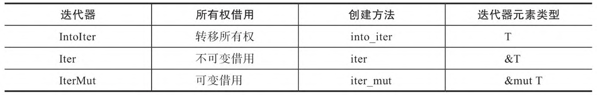

---
阅读进度                            再继续的章节

https://learn.microsoft.com/zh-cn/training/paths/rust-first-steps/      完毕

【弃】Rust入门秘笈
Rust编程：入门、实战与进阶          完毕
【弃】通过例子学Rust
深入浅出Rust                        完毕，部分内容较深入未仔细阅读

Rust编程语言入门教程视频            69
Rust程序设计                        3.3
Rust 程序设计语言 简体中文版 
https://kaisery.github.io/trpl-zh-cn/title-page.html        迭代器与闭包
www.runoob.com/rust                 Rust 面向对象


Rust编程之道                继续3.5     
Rust权威指南                继续第15章 函数和⽅法的隐式解引⽤转换，第16章已完毕，第18章646页
精通Rust(第2版)             4.3

案例：https://www.cnblogs.com/jiangbo4444/category/2071807.html


https://zhuanlan.zhihu.com/p/457636529
https://github.com/wasmflow/node-to-rust


https://doc.rust-lang.org/rust-by-example/fn/closures/input_parameters.html
https://mirrors.gitcode.host/rust-lang-cn/rust-by-example-cn/mod.html


https://rust-book.junmajinlong.com/ch3/08_slice.html        继续此
https://doc.rust-lang.org/std/primitive.slice.html#impl
https://rustwiki.org/zh-CN/std/primitive.slice.html#method.to_vec
https://www.cnblogs.com/jiangbo4444/category/2071807.html?page=3


待看
https://kumakichi.github.io/easy_rust_chs/Chapter_1.html

---

# 准备

## 安装系统

### 安装 ububtu 20.10 server

- 下载ubuntu-22.10-live-server-amd64.iso
- virtualbox，新建虚拟机：2cpu，4g内存，200g硬盘，网卡1使用默认“网络地址转换NAT”（装完系统后可以在虚拟机里上外网，但与宿主不可互ping，需要加装host-only网卡用于形成互ping的局域网）
- 运行安装server，不要最小安装那样会缺少必要的程序
- 【Mirror address】那步骤改地址改为：<http://mirrors.aliyun.com/ubuntu>，注意不是proxy的地址不要搞错。。。另外此时可以多找几个看看网速，避免很慢
- 并且选上安装ssh，其余默认即可
- 需要下载的都安装完后，回车重启，重启过程中有err再次回车即可，直到输入用户名密码登录，安装完毕

### 设置root密码

- 首先确保已登录普通用户。
- 输入命令：sudo passwd root，输入当前普通用户密码，设置root用户密码，再次输入确认root用户密码
- 输入命令：su root，输入root用户密码进行登录，成功进入root用户后退出root用户，输入命令exit

### 安装net-tools

```shell
    sudo apt install net-tools
```

### 调整网卡硬件

- 关闭运行的虚拟机系统，以下配置是硬件级别设置，可用于所有被虚拟的系统，如centos7和ubuntu20等

- Virtualbox工具栏->管理->全局设定

    

- Virtualbox工具栏->管理->主机网络管理器

    

    

    此刻多了一块网卡如下

    

- Virtualbox客户机网络设置

    网络地址转换NAT，用于上外网

    

    Host-Only用于ssh，即局域网互通

    

### 查看网络状态的命令

- ip a 或 ip addr
- networkctl status -a
- route -n

### 在centos中配置网络

- 修改网卡1（网络地址转换NAT）配置为如下，HWADDR可以不用，UUID可以使用uuidgen生成。保存后, service network restart，此时应可正常访问外网

``` shell

[huawei@10 ~]$ cat /etc/sysconfig/network-scripts/ifcfg-enp0s3
TYPE="Ethernet"
PROXY_METHOD="none"
BROWSER_ONLY="no"
BOOTPROTO="dhcp"
DEFROUTE="yes"
IPV4_FAILURE_FATAL="no"
IPV6INIT="yes"
IPV6_AUTOCONF="yes"
IPV6_DEFROUTE="yes"
IPV6_FAILURE_FATAL="no"
IPV6_ADDR_GEN_MODE="stable-privacy"
NAME="enp0s3"
UUID="00359752-7a18-4c26-bac6-cbb3bb484892"
DEVICE="enp0s3"
ONBOOT="yes"
HWADDR="08:00:27:C5:A0:36"

```

- 修改网卡2（Host-Only）配置为如下，HWADDR可以不用，UUID可以使用uuidgen生成，使用固定IP地址（IPADDR确保在前面创建的host-only网卡的min到max地址中即可）保存后, service network restart，此时应可以与物理机或其他虚拟机互ping

``` shell

[huawei@10 ~]$ cat /etc/sysconfig/network-scripts/ifcfg-enp0s8
TYPE=Ethernet
PROXY_METHOD=none
BROWSER_ONLY=no
BOOTPROTO=yes
DEFROUTE=yes
IPV4_FAILURE_FATAL=no
IPV6INIT=yes
IPV6_AUTOCONF=yes
IPV6_DEFROUTE=yes
IPV6_FAILURE_FATAL=no
IPV6_ADDR_GEN_MODE=stable-privacy
NAME=enp0s8
UUID=27aaf75f-90ce-4cb3-94e2-5279c86b3fcf
DEVICE=enp0s8
ONBOOT=yes
HWADDR="08:00:27:2B:24:FD"
IPADDR=192.168.56.120
NETMASK=255.255.255.0

```

### 在ubuntu中配置网络

- 修改配置文件内容为如下（addresses确保在前面创建的host-only网卡的min到max地址中即可，enp0s3是NAT的网卡，enp0s8是Host-Only网络）
- sudo netplan apply
- ip addr 查看静态ip是否设置成功
- 此时应可以与物理机或其他虚拟机互ping且可以上外网
- 如失败可以route -n看下路由表，检查enp0s8的gateway是否非[添加网卡硬件](#添加网卡硬件)的全局设定中的ip，如何改待完善。。。

``` shell

huaw@test:~$ cat /etc/netplan/00-installer-config.yaml
# This is the network config written by 'subiquity'
network:
  ethernets:
    enp0s3:
      addresses: []
      dhcp4: true
    enp0s8:
      dhcp4: false
      addresses: [192.168.56.102/24]
      nameservers:
        addresses: [192.168.56.1]
  version: 2

```

### 配置ssh

- ubuntu server安装时候如选上ssh了，则不用配置
- 手动配置则如下操作：先 sudo vi /etc/ssh/sshd_config，修改PermitRootLogin为yes后保存退出，再 sudo service ssh restart


### VirtualBox虚拟机Ubuntu扩容

- 关闭虚拟机，windows进入VirtualBox的安装目录查看需要修改的虚拟硬盘，使用命令对磁盘进行扩容操作

``` cmd
cd D:\Program Files\Oracle\VirtualBox

VBoxManage list hdds    // 查看对应虚拟磁盘文件的guid

VBoxManage modifyhd 2246d63c-5e3c-454f-8ecc-e5125dbe74a7 ––resize 51200     // 通过guid修改size
```

- 启动虚拟机，扩大ubuntu--vg-ubuntu--lv

    后续操作见 [resize.md](#resize.md)

### Linux磁盘空间100% 查找并删除大文件

https://blog.csdn.net/CL_YD/article/details/79458092?spm=1001.2101.3001.6650.3&utm_medium=distribute.pc_relevant.none-task-blog-2%7Edefault%7ECTRLIST%7ERate-3-79458092-blog-114849739.pc_relevant_aa2&depth_1-utm_source=distribute.pc_relevant.none-task-blog-2%7Edefault%7ECTRLIST%7ERate-3-79458092-blog-114849739.pc_relevant_aa2&utm_relevant_index=6


挂盘
http://events.jianshu.io/p/a2d773965de5

### 修改时区

- 执行tzselect，选4 Asia，选10 China，选1 Beijing，选1 yes
- sudo vi ~/.profile，在文件尾追加如下一行

``` shell
    TZ='Asia/Shanghai'; export TZ
```

- sudo vi /etc/default/locale，在文件尾追加如下一行

``` shell
    LC_TIME=zh_CN.UTF-8
```

### 修改shell前导

- /etc/bash.bashrc与/home/huaw/.bashrc，文件末尾追加此行

``` shell
PS1='[\u@\h \W]\$ '
```

### 改源

- 在安装ubuntu server时候因为修改过Mirror address，因此也不用改了
- 如需手动修改则如下

``` shell
sudo cp /etc/apt/sources.list /etc/apt/sources.list.old
```

- 将如下内容覆盖到sources.list文件里即可

```
deb https://mirrors.ustc.edu.cn/ubuntu/ focal main restricted universe multiverse
deb https://mirrors.ustc.edu.cn/ubuntu/ focal-updates main restricted universe multiverse
deb https://mirrors.ustc.edu.cn/ubuntu/ focal-backports main restricted universe multiverse
deb https://mirrors.ustc.edu.cn/ubuntu/ focal-security main restricted universe multiverse

# deb-src https://mirrors.ustc.edu.cn/ubuntu/ focal main restricted universe multiverse
# deb-src https://mirrors.ustc.edu.cn/ubuntu/ focal-updates main restricted universe multiverse
# deb-src https://mirrors.ustc.edu.cn/ubuntu/ focal-backports main restricted universe multiverse
# deb-src https://mirrors.ustc.edu.cn/ubuntu/ focal-security main restricted universe multiverse

## Pre-released source, not recommended.
# deb https://mirrors.ustc.edu.cn/ubuntu/ focal-proposed main restricted universe multiverse
# deb-src https://mirrors.ustc.edu.cn/ubuntu/ focal-proposed main restricted universe multiverse
```

### 先安装必要工具

此处可以先重启一下后再操作如下

- ubuntu

``` shell
sudo apt-get remove needrestart
sudo apt-get install -y gcc
sudo apt-get install -y gdb
sudo apt-get install -y cmake
sudo apt-get install -y python2
sudo apt-get install -y python3
sudo apt-get install -y perl
sudo apt-get install -y openjdk-18-jdk
sudo apt-get install -y openjdk-17-jdk
sudo apt-get install -y cmake
sudo apt-get install -y automake
sudo apt-get install -y git
sudo apt-get install -y pkg-config
sudo apt-get install -y openssl
sudo apt-get install -y libssl-dev
sudo apt-get install -y build-essential
sudo apt-get install -y libxml2
sudo apt-get install -y clang
sudo apt-get install -y libclang
sudo apt-get install -y libclang-dev
sudo apt-get install -y protoc
sudo apt-get install -y libprotoc-dev
sudo apt-get install -y bison
sudo apt-get install -y flex
sudo apt-get install -y gettext
sudo apt-get install -y libreadline-dev
sudo apt-get install -y protobuf-compiler
sudo apt-get install -y libprotobuf-dev
sudo apt-get install -y unixodbc
sudo apt-get install -y lib32readline-dev
```

- centos

``` shell
yum install clang
yum install centos-release-scl
yum install devtoolset-7
scl enable devtoolset-7 bash
```

## 安装rust

- 执行下面，然后选择1

``` shell
curl https://sh.rustup.rs -sSf | sh
```

- sudo vi ~/.profile，末尾添加如下

```shell
export PATH="$HOME/.cargo/bin:$PATH"
```

- 验证成功

``` shell
huaw@test:~$ .  ~/.profile
huaw@test:~$ rustc --version
rustc 1.65.0 (897e37553 2022-11-02)
huaw@test:~$ cargo --version
cargo 1.65.0 (4bc8f24d3 2022-10-20)
```

## 更新rust

``` shell
huaw@test:~$ rustup update
```

## 连接remote ssh失败的解决方法之一

如果连不上，有可能是因为目标虚拟机的ip之前被别的机器使用过，需要重新生成，在windows执行如下(ip为目标虚拟机ip)

```console
ssh-keygen -R 192.168.56.102
```

会更新/c/Users/huaw/.ssh/known_hosts updated，再次连接成功

## 安装vscode插件

- rust-analyzer
- rust syntax
- crates            可以显示依赖包的最新版本
- better toml       为 TOML 文件增加语法高亮。
- rust test lens
- Tabnine
- CodeLLDB          调试 Rust 项目
- search-crates-io  会在写 Cargo.toml 的依赖时时，尝试自动补全
- 执行命令安装如下：
    cargo install cargo-edit
    打开vscode命令面板->open setting (json)，加入如下后重新开启vscode

``` json
"rust-analyzer.checkOnSave.command": "clippy",      将cargo check换为clippy
"rust-analyzer.inlayHints.enable": false,           可以关掉嵌入提示
"rust-analyzer.inlayHints.chainingHints": false,    可以关掉嵌入提示
"rust-analyzer.inlayHints.parameterHints": false,   可以关掉嵌入提示
"rust-analyzer.inlayHints.chainingHints.enable": false,
"rust-analyzer.inlayHints.parameterHints.enable": false,
"rust-analyzer.inlayHints.typeHints.enable": false
"rust-analyzer.updates.askBeforeDownload": true     下载更新之前，弹出确认框
```
## helloworld

- 新建“main.rs”

``` rust
fn main()
{
    println!("hello world");
}
```

- 使用“rustc main.rs”进行编译

- 运行可执行文件“./main”即可

## 猜数字

``` rust
use rand::Rng;
use std::cmp::Ordering;
use std::io;

fn main() {
    println!("猜数字");
    let secretnum = rand::thread_rng().gen_range(1..100);
    println!("神秘数字是:{}", secretnum);

    loop {
        println!("type a number:");
        let mut guess = String::new();
        io::stdin().read_line(&mut guess).expect("无法读取");
        let guess: u32 = match guess.trim().parse() {
            Ok(num) => num, // 解析出如果类型正确则直接赋值，此处的mum理解为占位符，其实名字随意
            Err(_) => continue, // 参数“_”理解为放弃使用此参数，此为专用不可换名
        };
        println!("你猜的是{}", guess);
        match guess.cmp(&secretnum) {
            Ordering::Less => println!("too small"),
            Ordering::Greater => println!("too big"),
            Ordering::Equal => {
                println!("you win");
                break;
            }
        };
    }
}

```

## vscode调试rust

- 项目名称greeting
- launch.json
- tasks.json
- 先f7编译，在rs文件上加断点F5即可调试

``` shell
huaw@test:~/playground/rust$ cat .vscode/launch.json
{
    "version": "0.2.0",
    "configurations": [
        {
            "name": "rust", // 配置名称，将会在调试配置下拉列表中显示
            "type": "lldb", // 调试器类型：Windows表示器使用cppvsdbg；GDB和LLDB使用cppdbg。该值自动生成
            "request": "launch", // 调试方式
            "program": "${workspaceRoot}/greeting/target/debug/greeting", // 要调试的程序（完整路径，支持相对路径）
            "args": [], // 传递给上面程序的参数，没有参数留空即可
            "stopAtEntry": false, // 是否停在程序入口点（即停在main函数开始）（目前为不停下）
            "cwd": "${workspaceRoot}", // 调试程序时的工作目录
            "environment": [],
            "externalConsole": false, // 调试时是否显示控制台窗口(目前为不显示)
            //"preLaunchTask": "build", //预先执行task.json
            "MIMode": "lldb" //MAC下的debug程序
        }
    ]
}

huaw@test:~/playground/rust$ cat .vscode/tasks.json 
{
        "version": "2.0.0",
        "tasks": [
                {
                        "type": "shell",
                        "command": "cargo",
                        "options": {
                                "cwd": "${workspaceFolder}/greeting/"
                        },

                        "args":[
                                "build"
                        ],
                        "problemMatcher": [
                                "$rustc"
                        ],
                        "group": "build",
                        "label": "rust: cargo build"
                }
        ]
}

```

## 统计代码量

- https://github.com/XAMPPRocky/tokei
- huaw@test:~/playground/$ cargo install tokei
- huaw@test:~/playground/rust/my_extension$ tokei . --files


# cargo

## 常用命令


## 创建项目

- 会自动创建目录
- src/main.rs是主文件，说明这是一个可执行程序
- 如果是创建库，通过给cargo new命令添加--lib参数，则可以创建用于编写库的项目：cargo new --lib hellolib，此时没有main.rs，而有lib.rs
- src/main.rs与src/lib.rs可以同时存在，都叫做crate roots，即编译的入口文件
- toml是配置文件，记录版本信息，依赖项

``` shell
huaw@test:~/playground/rust$ cargo new hellocargo
     Created binary (application) `hellocargo` package

huaw@test:~/playground/rust/hellocargo$ tree
.
├── Cargo.toml
└── src
    └── main.rs
```


## 版本管理

默认自带版本管理，但可以使用huaw@test:~/playground/rust$ cargo new --vcs none hello3创建不带有版本管理的项目

## 迁移到cargo项目

将代码挪到使用cargo创建的项目目录下的src内即可，然后手写toml

## 检查代码语法

仅检查代码问题，并不编译，快很多

``` shell
huaw@test:~/playground/rust/hellocargo$ cargo check
    Checking hellocargo v0.1.0 (/home/huaw/playground/rust/hellocargo)
    Finished dev [unoptimized + debuginfo] target(s) in 0.07s
```

## 编译、运行、清理

- Cargo 调用了 Rust 编译器 rustc，然后又运行了生成的可执行文件。Cargo 把可执行文件放到了包顶部的 target 子目录中
- Cargo.lock 此文件会在编译时刻出现，内容是记录的所有依赖库版本
- 如toml进行了手动改变，则编译后会更新Cargo.lock

``` shell
huaw@test:~/playground/rust/hellocargo$ cargo run
    Finished dev [unoptimized + debuginfo] target(s) in 0.00s
     Running `target/debug/hellocargo`
Hello, world!
```


### debug

会build到target/debug下

``` shell
huaw@test:~/playground/rust/hellocargo$ cargo build
   Compiling hellocargo v0.1.0 (/home/huaw/playground/rust/hellocargo)
    Finished dev [unoptimized + debuginfo] target(s) in 0.38s
```

### release

会build到target/release下，当然也可以运行命令 cargo run --release

``` shell
huaw@test:~/playground/rust/hellocargo$ cargo build --release
   Compiling hellocargo v0.1.0 (/home/huaw/playground/rust/hellocargo)
    Finished release [optimized] target(s) in 0.19s
```

### debug与release下的不同配置

当项⽬的Cargo.toml ⽂件中没有任何[profile.*]区域时，Cargo针对每个配置都会有⼀套可以应⽤的默认选项。通过为任意的配置添加[profile.*]区域，我们可以覆盖默认设置的任意⼦集。例如，下⾯是opt-level选项分别在debug与release配置中的默认值：

``` toml
[profile.dev]
opt-level = 0
[profile.release]
opt-level = 3
```

### clean

cargo clean会清理target


## rust语言服务

- 关闭语言服务

    vscode主菜单view->command palette->rust-analyzer: Stop server

- 开启语言服务

    vscode主菜单view->command palette->rust-analyzer: Start server

## 换源

*** 实测快慢取决于ubuntu源，另外有梯子无需改源 ***

在cargo所在目录中（默认是$HOME/.cargo）执行 touch config 创建配置文件，写如下后保存，按需再重新 cargo build 即可

``` shell
huaw@test:~/.cargo$ cat config 
[source.crates-io]
registry ="https://github.com/rust-lang/crates.io-index"
replace-with = 'tuna'
[source.tuna]
registry = "https://mirrors.tuna.tsinghua.edu.cn/git/cratesio-index.git"
[net]
git-fetch-with-cli = true
```

## 查找第三方crate

cargo search 可以检查其是否可用并确定最新版本：
```
$ cargo search structopt
structopt = "0.3.21"                  # Parse command-line argument by defining a struct.
.
.
.
```

## 添加依赖项

- 通过将以下条目添加到 Cargo.toml 文件的 [dependencies] 部分，将其添加为我们项目的依赖项

```rust
[dependencies]
structopt = "0.3"
```

## 版本号规则

指定版本号的时候，可以使用模糊匹配的方式:

- pgx = "=0.7.2" 代表明确指定版本号
- ^符号，如^1.2.3代表1.2.3<=version<2.0.0；
- ~符号，如~1.2.3代表1.2.3<=version<1.3.0；
- *符号，如1.*代表1.0.0<=version<2.0.0；
- 比较符号，比如>=1.2.3、>1.2.3、<2.0.0、=1.2.3含义基本上一目了然，还可以把多个限制条件合起来用逗号分开，比如version=">1.2，<1.9"。
- 直接写一个数字的话，等同于^符号的意思。所以lazy_static="1.0"等同于lazy_static="^1.0"，含义是1.0.0<=version<2.0.0。

cargo会到网上找到当前符合这个约束条件的最新的版本下载下来。

## 更新依赖

由于 Cargo.lock 会锁住依赖的版本，你需要通过手动的方式将依赖更新到新的版本：

``` shell
$ cargo update            # 更新所有依赖
$ cargo update -p regex   # 只更新 “regex”
```

以上命令将使用新的版本信息重新生成 Cargo.lock ，需要注意的是 cargo update -p regex 传递的参数实际上是一个 Package ID， regex 只是一个简写形式。

## build.rs

cargo工具还允许用户在正式编译开始前执行一些自定义的逻辑。方法是在Cargo.toml中配置一个build的属性

``` rust
[package]
# ...
build = "build.rs"
```

自定义逻辑就写在build.rs文件里面。在执行cargo build的时候，cargo会先把这个build.rs编译成一个可执行程序，然后运行这个程序，做完后再开始编译真正的crate。build.rs一般用于下面这些情况：

- 提前调用外部编译工具，比如调用gcc编译一个C库；
- 在操作系统中查找C库的位置；
- 根据某些配置，自动生成源码；
- 执行某些平台相关的配置。

build.rs里面甚至可以再依赖其他的库。可以在build-dependencies里面指定：

``` rust
[build-dependencies]
anyhow = { version = "1.0", features = ["backtrace"] }
bindgen = "0.61"
```

案例详见“深入浅出RUST” 32.2.3章

## 发布模块

cargo publish

# 搭建pgx开发环境

## 安装pg

``` shell
wget https://ftp.postgresql.org/pub/source/v15.1/postgresql-15.1.tar.gz
tar -xf postgresql-15.1.tar.gz
cd
./configure --prefix=/home/huaw/work/outpostdbv4/  安装到此位置
make
make install

$ sudo vi ~/.bashrc，末尾添 
export LD_LIBRARY_PATH=/home/huaw/work/outpostdbv4/lib/:$LD_LIBRARY_PATH
export PGHOME=/home/huaw/work/outpostdbv4/
export PGDATA=/home/huaw/playground/data    需要手动创建出来
export PATH=$PGHOME/bin:$PATH
$ source  ~/.bashrc
```

## 安装rust

``` shell
$ curl https://sh.rustup.rs -sSf | sh
$ sudo vi ~/.profile，末尾添  export PATH="$HOME/.cargo/bin:$PATH"
$ source  ~/.profile
```

## 安装pgx

- 使用install进行安装
- init命令负责初始化环境，下面指定了已经安装后的路径，如果之前没有安装pg则使用“cargo pgx init”，会下载几个版本的postgres然后编译到目录~/.pgx/中（此目录里含有对应的pg代码目录与initdb后对应的数据目录）。这个步骤时间会稍长（因为后续pgx会为每中版本的postgres的header文件生成对应的Rust bindings，以及后续pgx 的测试框架中也会用到）

``` shell
$ cargo install --force --locked cargo-pgx --version=0.7.0  中途卡住就关了重新执行即可
$ cargo pgx init --pg15 /home/huaw/work/outpostdbv4/bin/pg_config
$ cargo install --force cargo-make
```

## 创建pgx项目

- 创建一个extension项目

``` shell
huaw@test:~/playground/rust$ cargo pgx new my_extension


huaw@test:~/playground/rust/my_extension$ tree
.
├── Cargo.toml
├── my_extension.control
├── sql
└── src
    └── lib.rs

2 directories, 3 files
```

## 主要文件说明

lib.rs里的#[pg_extern] 宏所修饰的函数就是我们要实现的extension函数，mod tests , pub mod pg_test 是pgx已经为我们写好了的测试模块，用于编写相关测试代码。pgx默认已经给我们写好了名为 hello_my_extension 的extension，功能很简单，就是返回 “Hello, my_extension” 字符串
​

```
use pgx::prelude::*;    // 导入包

pgx::pg_module_magic!();    // 初始化

#[pg_extern]    // pg_extern会将此函数导出为c函数
fn hello_my_extension() -> &'static str {
    "Hello, my_extension"
}

#[cfg(any(test, feature = "pg_test"))]  // 可以使用cargo pgx test 进行测试，即调用crate::hello_my_extension会返回"Hello, my_extension"
#[pg_schema]
mod tests {
    use pgx::prelude::*;

    #[pg_test]
    fn test_hello_my_extension() {
        assert_eq!("Hello, my_extension", crate::hello_my_extension());
    }

}

#[cfg(test)]
pub mod pg_test {
    pub fn setup(_options: Vec<&str>) {
        // perform one-off initialization when the pg_test framework starts
    }

    pub fn postgresql_conf_options() -> Vec<&'static str> {
        // return any postgresql.conf settings that are required for your tests
        vec![]
    }
}

```

Cargo.toml里面有项目的设置，lib类型是cdylib（动态库）

my_extension.control文件用于pg加载插件时刻使用

``` shell
comment = 'my_extension:  Created by pgx'
default_version = '@CARGO_VERSION@'
module_pathname = '$libdir/my_extension'
relocatable = false
superuser = false

```

## 编译运行

- 运行extension

使用cargo pgx run即可，后也可以跟参数pg14或pg13，对应不同的postgres版本（默认版本是在Cargo.toml的features里设置），cargo pgx run会把extension编译为一个 .so 共享库文件，复制到对应版本的 ~/.pgx/ 目录中，然后启动Postgres实例，通过psql连接到和extension同名的数据库上。编译完成后，开发者就会处于psql的shell界面中，可以调用extension进行测试了。

``` shell

huaw@test:~/playground/rust/$ cd my_extension
huaw@test:~/playground/rust/my_extension$ cargo pgx run pg14


...
Compiling funty v2.0.0
   Compiling bitvec v1.0.1
   Compiling serde_cbor v0.11.2
   Compiling uuid v1.2.2
   Compiling seahash v4.1.0
   Compiling pgx v0.6.0
   Compiling my_extension v0.0.0 (/home/huaw/playground/rust/my_extension)
    Finished dev [unoptimized + debuginfo] target(s) in 2m 22s
  Installing extension
     Copying control file to /home/huaw/.pgx/13.9/pgx-install/share/postgresql/extension/my_extension.control
     Copying shared library to /home/huaw/.pgx/13.9/pgx-install/lib/postgresql/my_extension.so
 Discovering SQL entities
  Discovered 1 SQL entities: 0 schemas (0 unique), 1 functions, 0 types, 0 enums, 0 sqls, 0 ords, 0 hashes, 0 aggregates, 0 triggers
     Writing SQL entities to /home/huaw/.pgx/13.9/pgx-install/share/postgresql/extension/my_extension--0.0.0.sql
    Finished installing my_extension
    Starting Postgres v13 on port 28813
     Creating database my_extension
psql (13.9)
Type "help" for help.
```

在psql里检测插件

``` sql

my_extension=# CREATE EXTENSION my_extension;  // 安装插件
CREATE EXTENSION
my_extension=# \df
                              List of functions
 Schema |        Name        | Result data type | Argument data types | Type 
--------+--------------------+------------------+---------------------+------
 public | hello_my_extension | text             |                     | func
(1 row)

my_extension=# SELECT hello_my_extension();
 hello_my_extension  
---------------------
 Hello, my_extension
(1 row)

my_extension=# \q
```

## 手动测试pgx插件

如cargo pgx run失败则参考如下操作流程进行测试

``` shell
- cargo pgx install，会将编译出的so,sql,control自动拷贝到之前通过cargo pgx init配置的对应目录中
- 删除$PGDATA，重新initdb，此步骤是确保$PGDATA位置的pg数据目录正常
- 修改配置 vi $PGDATA/pg_hba.conf，末尾添加
  host all all 0.0.0.0/0 md5
  用于手动psql登入
- 配置监听地址 vi $PGDATA/postgresql.conf，port改为5432
- pg_ctl start，启动pg，如果之前未关闭则先pg_ctl stop后再start
- psql -p 5432 -d postgres，登入pg，下面的操作显示的结果也许不同

my_extension=# select current_database();
 current_database 
------------------
 my_extension
(1 row)

my_extension=# select current_user;
 current_user 
--------------
 huaw
(1 row)

my_extension=# select inet_server_addr();
 inet_server_addr 
------------------
 127.0.0.1
(1 row)

my_extension=# select inet_client_port();
 inet_client_port 
------------------
            54856
(1 row)

my_extension=#  drop extension my_extension cascade; CREATE EXTENSION my_extension;
DROP EXTENSION
CREATE EXTENSION
my_extension=# select hello_my_extension();
 hello_my_extension 
--------------------
 aaa!!!
(1 row)
```

## 运行test

还可以进行测试，其实就是跑make test，但会测试所有回归，时间稍长

``` shell
huaw@test:~/playground/rust/my_extension$ cargo pgx test

...
Compiling pgx-tests v0.6.0
   Compiling my_extension v0.0.0 (/home/huaw/playground/rust/my_extension)
    Building [=======================> ] 231/232: my_extension(test)             
    Finished test [unoptimized + debuginfo] target(s) in 5m 29s
     Running unittests src/lib.rs (target/debug/deps/my_extension-a0aa68729b5952a7)

running 1 test
    Building extension with features  pg_test
     Running command "cargo" "build" "--features" " pg_test" "--message-format=json-render-diagnostics"


  Installing extension
     Copying control file to /home/huaw/.pgx/13.9/pgx-install/share/postgresql/extension/my_extension.control
     Copying shared library to /home/huaw/.pgx/13.9/pgx-install/lib/postgresql/my_extension.so
    Finished installing my_extension
The files belonging to this database system will be owned by user "huaw".
This user must also own the server process.

The database cluster will be initialized with locale "C".
The default database encoding has accordingly been set to "SQL_ASCII".
The default text search configuration will be set to "english".

Data page checksums are disabled.

creating directory /home/huaw/playground/rust/my_extension/target/pgx-test-data-13 ... ok
creating subdirectories ... ok
selecting dynamic shared memory implementation ... posix
selecting default max_connections ... 100
selecting default shared_buffers ... 128MB
selecting default time zone ... Asia/Shanghai
creating configuration files ... ok
running bootstrap script ... ok
performing post-bootstrap initialization ... ok
syncing data to disk ... ok

initdb: warning: enabling "trust" authentication for local connections
You can change this by editing pg_hba.conf or using the option -A, or
--auth-local and --auth-host, the next time you run initdb.

Success. You can now start the database server using:

    /home/huaw/.pgx/13.9/pgx-install/bin/pg_ctl -D /home/huaw/playground/rust/my_extension/target/pgx-test-data-13 -l logfile start

test tests::pg_test_hello_my_extension ... ok

test result: ok. 1 passed; 0 failed; 0 ignored; 0 measured; 0 filtered out; finished in 28.34s

stopping postgres (pid=103537)
huaw@test:~/playground/rust/my_extension$ 
```

## 查看与导出sql

可以使用cargo pgx schema查看pgx生成的sql语句内容，可以看到末尾打印出编译成了"LANGUAGE c"。保存为sql文件则“cargo pgx schema -o a.sql”即可

``` shell
huaw@test:~/playground/rust/my_extension$ cargo pgx schema
    Building for SQL generation with features ``
    Finished dev [unoptimized + debuginfo] target(s) in 0.07s
 Discovering SQL entities
  Discovered 1 SQL entities: 0 schemas (0 unique), 1 functions, 0 types, 0 enums, 0 sqls, 0 ords, 0 hashes, 0 aggregates, 0 triggers
     Writing SQL entities to /dev/stdout
/* 
This file is auto generated by pgx.

The ordering of items is not stable, it is driven by a dependency graph.
*/

-- src/lib.rs:6
-- my_extension::hello_my_extension
CREATE  FUNCTION "hello_my_extension"() RETURNS TEXT /* &str */
STRICT
LANGUAGE c /* Rust */
AS 'MODULE_PATHNAME', 'hello_my_extension_wrapper';
huaw@test:~/playground/rust/my_extension$ 
```

## 案例：myadd

- 在hello_my_extension函数下面添加一个带有缺省值的新函数

``` rust
#[pg_extern]
fn myadd(a:i64, b:default!(i64, 100)) -> i64 {
    a+b
}

```

- cargo pgx run pg14 编译运行，进入psql后：
   drop extension my_extension cascade; CREATE EXTENSION my_extension;
   可以看到2个函数了，编译后虽然so是最新的，但因为so里多了个函数，所以在pg里需要重新安装扩展才能使用（即需要重新运行对应的sql）。如果仅仅是函数实现发生了改变则无需上面的步骤，直接运行函数即可

- 使用\df可以查看此函数转换后的函数与参数类型信息


## 案例：to_lowercase

- 使用Option作为参数与返回值
- 使用info!在psql里打印输出

``` rust
#[pg_extern]
fn to_lowercase(s: Option<String>) -> Option<String> {
    info!("to lowercase called with {:?}", s);  // 在psql里输出
    s.map(|v| v.to_lowercase())
}
```

## 案例：自定义类型 SortedID

- 创建一个随机的、且可排序的自定义数据类型

- 先Add dependencies to a Cargo.toml，完成后配置文件里的依赖部分内容会自动更新

``` shell
huaw@test:~/playground/rust/my_extension$ cargo add uuid7 --features serde
    Updating crates.io index
      Adding uuid7 v0.3.2 to dependencies.
             Features:
             + serde
             + std
             - uuid

huaw@test:~/playground/rust/my_extension$ cargo add serde --features derive
    Updating crates.io index
      Adding serde v1.0.150 to dependencies.
             Features:
             + derive
             + serde_derive
             + std
             - alloc
             - rc
             - unstable
```

- 新建文件加入代码

    这里使用了rust的uuid7、serde以及PostgresType / Eq / Hash / Ord

```rust
huaw@test:~/playground/rust/my_extension$ cat src/sortable_id.rs 
use pgx::*;
use uuid7::{uuid7, Uuid};
use serde::{Serialize, Deserialize};

#[derive(Debug, Clone, Copy, PartialEq, Eq, PartialOrd, Ord, Hash, Serialize, Deserialize)]
#[derive(PostgresType, PostgresEq, PostgresOrd, PostgresHash)]

pub struct SortableId(Uuid);

impl Default for SortableId{
    fn default() -> Self{
        Self(uuid7())
    }
}

#[pg_extern]
fn generate_sortable_id() -> SortableId{
    SortableId::default()
}
```

- 在lib.rs的头部导入上面的代码

``` rust
mod sortable_id;
use pgx::*;
use pgx::prelude::*;
pub use sortable_id::*;
...
```

- cargo pgx run
  
    进入psql后再次：
    drop extension my_extension cascade;
    CREATE EXTENSION my_extension;
    \df
    即可看到新添的n个sortableid_开头的函数了，可以试一下

``` sql
my_extension=# select generate_sortable_id();
          generate_sortable_id          
----------------------------------------
 "01850aa2-8c02-733d-9929-80aea7a4ce4f"
(1 row)
```

- 修改在psql里的内容呈现形式，在sortable_id.rs里添加inoutfuncs的内容

``` rust
huaw@test:~/playground/rust/my_extension$ cat src/sortable_id.rs 
use pgx::*;
use uuid7::{uuid7, Uuid};
use serde::{Serialize, Deserialize};

#[derive(Debug, Clone, Copy, PartialEq, Eq, PartialOrd, Ord, Hash, Serialize, Deserialize)]
#[derive(PostgresType, PostgresEq, PostgresOrd, PostgresHash)]

#[inoutfuncs]

pub struct SortableId{
    inner: Uuid,
}

impl Default for SortableId{
    fn default() -> Self{
        Self{
            inner: uuid7()
        }
    }
}

impl InOutFuncs for SortableId{
    fn output(&self, buffer: &mut StringInfo) {
        buffer.push_str(&self.inner.to_string());
    }

    fn input(input: &pgx::cstr_core::CStr) -> Self
        where
            Self: Sized,
    {
        let id = input.to_str().expect("input is not a valid utf8 string").parse().expect("imput is not a valid uuid");
        Self {inner: id}
    }
}


#[pg_extern]
fn generate_sortable_id() -> SortableId{
    SortableId::default()
}
```

- 再次run，drop，create，执行generate_sortable_id，引号已被去除了

``` sql
my_extension=# select generate_sortable_id();
         generate_sortable_id         
--------------------------------------
 01850ab4-6a7b-79f7-a6db-99e418d2a00a
(1 row)
```

- 测试SortedID，这里需要之前未添加成功的my_generate_series，所以待完善

``` sql
my_extension=# create table ids(id sortableid primary key default generate_sortable_id());
CREATE TABLE

```

## 案例：使用jsonschema进行验证

- 安装jsonschema

``` shell
huaw@test:~/playground/rust/my_extension$ cargo add jsonschema 
    Updating crates.io index
      Adding jsonschema v0.16.1 to dependencies.
             Features:
             + clap
             + cli
             + reqwest
             + resolve-file
             + resolve-http
             - draft201909
             - draft202012
huaw@test:~/playground/rust/my_extension$ cargo add jsonschema --no-default-features
    Updating crates.io index
      Adding jsonschema v0.16.1 to dependencies.
             Features:
             - clap
             - cli
             - draft201909
             - draft202012
             - reqwest
             - resolve-file
             - resolve-http
    Blocking waiting for file lock on package cache
```

- 在lib.rs中添加一个新函数

``` rust
#[pg_extern]
fn check_json_schema(instance: Json, schema: Json) -> bool {
    jsonschema::is_valid(&schema.0, &instance.0)
}
```

- 进行验证

``` sql
huaw@test:~/playground/rust/my_extension$ cargo pgx run
.
.
.

my_extension=# drop extension my_extension cascade; CREATE EXTENSION my_extension; \df
DROP EXTENSION
CREATE EXTENSION
                                        List of functions
 Schema |         Name         | Result data type |          Argument data types          | Type 
--------+----------------------+------------------+---------------------------------------+------
 public | check_json_schema    | boolean          | instance json, schema json            | func
 public | generate_sortable_id | sortableid       |                                       | func
 public | hello                | text             |                                       | func
 public | myadd                | bigint           | a bigint, b bigint DEFAULT 100        | func
 public | sortableid_cmp       | integer          | "left" sortableid, "right" sortableid | func
 public | sortableid_eq        | boolean          | "left" sortableid, "right" sortableid | func
 public | sortableid_ge        | boolean          | "left" sortableid, "right" sortableid | func
 public | sortableid_gt        | boolean          | "left" sortableid, "right" sortableid | func
 public | sortableid_hash      | integer          | value sortableid                      | func
 public | sortableid_in        | sortableid       | input cstring                         | func
 public | sortableid_le        | boolean          | "left" sortableid, "right" sortableid | func
 public | sortableid_lt        | boolean          | "left" sortableid, "right" sortableid | func
 public | sortableid_ne        | boolean          | "left" sortableid, "right" sortableid | func
 public | sortableid_out       | cstring          | input sortableid                      | func
 public | to_lowercase         | text             | s text                                | func
(15 rows)

-- 
my_extension=# create table todos(
    title varchar(255) not null,
    metadata json,

    check (
        check_json_schema(metadata,
            '{
                "type": "object",
                "properties": {
                    "tags": {
                        "type": "array",
                        "items": {
                            "type": "string",
                            "maxLength": 4
                        }
                    }
                }
            }'
        )
    )
);
CREATE TABLE

my_extension=# \d todos 
                        Table "public.todos"
  Column  |          Type          | Collation | Nullable | Default 
----------+------------------------+-----------+----------+---------
 title    | character varying(255) |           | not null | 
 metadata | json                   |           |          | 
Check constraints:
    "todos_metadata_check" CHECK (check_json_schema(metadata, '{
                "type": "object",
                "properties": {
                    "tags": {
                        "type": "array",
                        "items": {
                            "type": "string",
                            "maxLength": 4
                        }
                    }
                }
            }'::json))


-- shopping长度大于上面设置的maxLength，会失败
my_extension=# insert into todos(title, metadata) values('buy stuff', '{"tags": ["shopping"]}');
ERROR:  new row for relation "todos" violates check constraint "todos_metadata_check"
DETAIL:  Failing row contains (buy stuff, {"tags": ["shopping"]}).

-- pay长度大于上面设置的maxLength，会成功
my_extension=# insert into todos(title, metadata) values('buy stuff', '{"tags": ["pay"]}');
INSERT 0 1

my_extension=# select * from todos;
   title   |     metadata      
-----------+-------------------
 buy stuff | {"tags": ["pay"]}
(1 row)

-- 类型错误
my_extension=# insert into todos(title, metadata) values('bad', '{"tags": [{"a": 1}]}');
ERROR:  new row for relation "todos" violates check constraint "todos_metadata_check"
DETAIL:  Failing row contains (bad, {"tags": [{"a": 1}]}).
```

- 当然还可以再加一个jsonb的，这里就不测试了

``` rust
#[pg_extern]
fn check_jsonb_schema(v: JsonB, schema: Json) -> bool {
    jsonschema::is_valid(&schema.0, &v.0)
}
```

## 案例：spi

- 在rs里调用sql后返回给pg
- 添加代码到lib.rs里

``` rust
#[pg_extern]
fn extract_ts(ts: &str) -> i64 {
    let sql = format!(
        "select (extract(epoch from timestamptz '{}') * 1000)::bigint",
        ts
    );
    Spi::get_one(&sql).expect("SPI result was null")
}
```

- 进行验证

``` sql
huaw@test:~/playground/rust/my_extension$ cargo pgx run
.
.
.
my_extension=# drop extension my_extension cascade; CREATE EXTENSION my_extension; \df
DROP EXTENSION
CREATE EXTENSION
                                        List of functions
 Schema |         Name         | Result data type |          Argument data types          | Type 
--------+----------------------+------------------+---------------------------------------+------
 public | check_json_schema    | boolean          | instance json, schema json            | func
 public | check_jsonb_schema   | boolean          | v jsonb, schema json                  | func
 public | extract_ts           | bigint           | ts text                               | func
 public | generate_sortable_id | sortableid       |                                       | func
 public | hello                | text             |                                       | func
 public | myadd                | bigint           | a bigint, b bigint DEFAULT 100        | func
 public | sortableid_cmp       | integer          | "left" sortableid, "right" sortableid | func
 public | sortableid_eq        | boolean          | "left" sortableid, "right" sortableid | func
 public | sortableid_ge        | boolean          | "left" sortableid, "right" sortableid | func
 public | sortableid_gt        | boolean          | "left" sortableid, "right" sortableid | func
 public | sortableid_hash      | integer          | value sortableid                      | func
 public | sortableid_in        | sortableid       | input cstring                         | func
 public | sortableid_le        | boolean          | "left" sortableid, "right" sortableid | func
 public | sortableid_lt        | boolean          | "left" sortableid, "right" sortableid | func
 public | sortableid_ne        | boolean          | "left" sortableid, "right" sortableid | func
 public | sortableid_out       | cstring          | input sortableid                      | func
 public | to_lowercase         | text             | s text                                | func
(17 rows)


-- 不使用新函数
my_extension=# select (extract(epoch from timestamptz '2022-09-16 23:1') * 1000)::bigint;
     int8      
---------------
 1663340460000
(1 row)


-- 使用新函数
my_extension=# select extract_ts('2022-09-16 23:01');
  extract_ts   
---------------
 1663340460000
(1 row)


```

## 打包输出

- cargo pgx package 打包（编译为release），如果找不到pg_config，可以使用安装的方式 “sudo apt-get install --reinstall libpq-dev”。也可以手动指定文件位置，会输出到本地的target子目录内

``` shell
huaw@huaw:~/playground/rust/my_extension$ cargo pgx package --pg-config /home/huaw/work/pg15out/bin/pg_config
```

- 直接将输出安装到指定位置，包括control文件，sql文件，so文件

``` shell
huaw@huaw:~/playground/rust/my_extension$ cargo pgx install --pg-config /home/huaw/work/pg15out/bin/pg_config

   Building extension with features pg15
     Running command "cargo" "build" "--features" "pg15" "--no-default-features" "--message-format=json-render-diagnostics"
   Compiling my_extension v0.0.0 (/home/huaw/playground/rust/my_extension)
    Finished dev [unoptimized + debuginfo] target(s) in 11.35s
  Installing extension
     Copying control file to /home/huaw/work/pg15out/share/postgresql/extension/my_extension.control
     Copying shared library to /home/huaw/work/pg15out/lib/postgresql/my_extension.so
 Discovering SQL entities
  Discovered 1 SQL entities: 0 schemas (0 unique), 1 functions, 0 types, 0 enums, 0 sqls, 0 ords, 0 hashes, 0 aggregates, 0 triggers
     Writing SQL entities to /home/huaw/work/pg15out/share/postgresql/extension/my_extension--0.0.0.sql
    Finished installing my_extension
```

## start、stop、status

https://github.com/tcdi/pgx  

``` shell
huaw@test:~/.pgx$ cargo pgx start all
    Starting Postgres v11 on port 28811
    Starting Postgres v13 on port 28813
    Starting Postgres v14 on port 28814
    Starting Postgres v15 on port 28815

huaw@test:~/.pgx$ cargo pgx status
Postgres v11 is running
Postgres v12 is running
Postgres v13 is running
Postgres v14 is running
Postgres v15 is running

huaw@test:~/.pgx$ cargo pgx stop pg11
    Stopping Postgres v11

huaw@test:~/.pgx$ cargo pgx stop all
    Stopping Postgres v12
    Stopping Postgres v13
    Stopping Postgres v14
    Stopping Postgres v15

huaw@test:~/.pgx$ cargo pgx status
Postgres v11 is stopped
Postgres v12 is stopped
Postgres v13 is stopped
Postgres v14 is stopped
Postgres v15 is stopped

```

# pg操作补充

## initdb带有密码的用户

- 超级用户名：aaa
- 密码：/home/huaw/playground/pw.txt的第一行内容
- 开启登录需要密码

参考 https://webinstall.dev/postgres/

``` shell
huaw@huaw:~/work/outpostdbv4/bin$ ./initdb --username aaa --pwfile /home/huaw/playground/pw.txt --auth-local=password --auth-host=password

huaw@huaw:~/work/outpostdbv4/bin$ ./pg_ctl start

huaw@huaw:~/work/outpostdbv4/bin$ ./psql -p 5333 -d postgres -U aaa

然后输入密码即可登录

查看用户 postgres=# SELECT rolname,rolpassword FROM pg_authid;
```


# 基本概念

- rust是静态编译语言
- Rust不支持++、--运算符，请使用+=1、-=1替代。
- Rust没有三元运算符（？：）

## 语句和表达式

- 语句（statement）指那些执行操作但不返回值的指令。因为语句不会返回值。所以在Rust中不能将一条let语句赋值给另一个变量，如下错误

``` rust
fn main() {
    let x = (let y = 6);
    // 由于语句 let y = 6 没有返回任何值，所以变量 x 就没有可以绑定的东西。
}
```

- 表达式（expression）指会进行计算并产生一个值作为结果的指令。调用函数是表达式，调用宏是表达式，用来创建作用域的花括号（{}）也是表达式。

``` rust
fn main() {
    let x = {
        let y = 4;
        y + 1   // 这里没有加分号（是表达式）。若其后加了分号（即 y + 1;）则变成了语句，将不会返回任何值
    };

    println!("x = {}", x);  // 输出 x = 5
}
```


## 基本数据类型scalar

### 整数

表示整数，比如：i8、u8、i16、u16、i32、u32、i64、u64、isize、usize。i表示有符号，u表示无符号，可以将 usize 和 isize 看作 C 和 C++ 中的 size_t 和 ptrdiff_t。usize 无符号，isize 有符号。它们的精度取决于目标机器的寻址空间大小：在 32 位机器上是 32 位长，在 64 位机器上是 64 位长。Rust 要求数组索引必须是 usize 值。另外，表示数组或向量的大小，或者某些数据结构中元素数量的值通常也是 usize 类型的。

```rust
fn main() {
   let integer1: u32 = 17; // 类型声明
   let integer2 = 17u32; // 类型后缀声明
   let integer3 = 17; // 默认i32类型
   let integer4: u32 = 0b10001; // 二进制
   let integer5: u32 = 0o21; // 八进制
   let integer6: u32 = 0x11; // 十六进制
   let integer7 = 50_000; // 数字可读性分隔符_
   println!("{}", integer1);
   println!("{}", integer2);
   println!("{}", integer3);
   println!("{}", integer4);
   println!("{}", integer5);
   println!("{}", integer6);
   println!("{}", integer7);

huaw@test:~/playground/rust/hellocargo$ cargo run
    Finished dev [unoptimized + debuginfo] target(s) in 0.00s
     Running `target/debug/hellocargo`
17
17
17
17
17
17
50000
}
```

字面量后面可以跟后缀，可代表该数字的具体类型，从而省略掉显示类型标记

``` rust
fn main() {
    let var5 = 0x_1234_ABCD; //使用下划线分割数字,不影响语义,但是极大地提升了阅读体验。
    let var6 = 123usize; // i6变量是usize类型
    let var7 = 0x_ff_u8; // i7变量是u8类型
    let var8 = 32; // 不写类型,默认为 i32 类型
    println!("{}", var5);
    println!("{}", var6);
    println!("{}", var7);
    println!("{}", var8);
    let x : i32 = 9;
    println!("9 power 3 = {}", x.pow(3));   // 整数类型有一个方法是pow，它可以计算n次幂
    println!("9 power 3 = {}", 9_i32.pow(3)); // 甚至可以不使用变量，直接对整型字面量调用函数
}

huaw@test:~/playground/rust/hellocargo$ cargo run
   Compiling hellocargo v0.1.0 (/home/huaw/playground/rust/hellocargo)
    Finished dev [unoptimized + debuginfo] target(s) in 0.19s
     Running `target/debug/hellocargo`
305441741
123
255
32
9 power 3 = 729
9 power 3 = 729
```

### 浮点

可以带小数的类型，两个浮点类型 f32 和 f64，分别是 IEEE 单精度和双精度浮点类型，类似 C和 C++ 的 float 和 double。

``` rust
fn main() {
    let float1: f32 = 1.1; // 类型声明
    let float2 = 2.2f32; // 类型后缀声明
    let float3 = 3.3; // 默认f64类型
    let float4 = 11_000.555_001; // 数字可读性分隔符_
    println!("{}", float1);
    println!("{}", float2);
    println!("{}", float3);
    println!("{}", float4);
}

huaw@test:~/playground/rust/hellocargo$ cargo run
   Compiling hellocargo v0.1.0 (/home/huaw/playground/rust/hellocargo)
    Finished dev [unoptimized + debuginfo] target(s) in 0.20s
     Running `target/debug/hellocargo`
1.1
2.2
3.3
11000.555001
```

### 布尔

- bool类型只包括两个值: true 和 false。布尔类型最主要的用途是在if表达式内作为条件使用。必须写成 if x != 0 { ... } 类型这样才行。
- 布尔值可以使用as操作符转换为各种数值类型，false对应0，true对应1。

``` rust
fn main() {
    let t: bool = true; // 显式类型声明
    let f = false; // 隐式类型声明
    println!("{}", t);
    println!("{}", f);
    println!("{}", true as u32);
    println!("{}", false as u8);
    // println!("{}", 1_u8 as bool);  // 编译错误
}
huaw@test:~/playground/rust/hellocargo$ cargo run
   Compiling hellocargo v0.1.0 (/home/huaw/playground/rust/hellocargo)
    Finished dev [unoptimized + debuginfo] target(s) in 0.22s
     Running `target/debug/hellocargo`
true
false
1
0
```

### 字符

char类型表示单个字符。char类型使用单引号制定，而不同于字符串使用双引号指定。因为char类型的设计目的是描述任意一个unicode字符(即将其转换为UTF-8编码的数据进行存储)，因此它占据的内存空间不是1个字节，而是4个字节。Rust 会将字符和数值类型区别对待，即 char 既不是 u8 也不是 i8

``` rust
fn main() {
    let a = 'y';
    let b = '✔';
    let c = '☺';
    println!("a = {}, b = {}, c = {}", a, b, c);    // 输出 a = y, b = ✔, c = ☺

    // char -> Integer
    println!("{}", '我' as i32);     // 25105
    println!("{}", '是' as u16);     // 26159
    println!("{}", '是' as u8);      // 47，被截断了

    // u8 -> char
    println!("{}", 97u8 as char);    // a

    // std::char
    use std::char;

    println!("{}", char::from_u32(0x2764).unwrap());  // ❤
    assert_eq!(char::from_u32(0x110000), None);  // true

    println!("{}", char::from_digit(4,10).unwrap());  // '4'
    println!("{}", char::from_digit(11,16).unwrap()); // 'b'
    assert_eq!(char::from_digit(11,10),None); // true

}
```

字符类型字面量也可以使用转义符：

``` rust
let love = '❤'; // 可以直接嵌入任何 unicode 字符
let c1 = '\n'; // 换行符
let c2 = '\x7f'; // 8 bit 字符变量
let c3 = '\u{7FFF}'; // unicode字符
```

## 与、或、非

- !、&、| 操作符有两种意思，根据上下文决定：
    - 操作数是整数值时：按位取反、按位与、按位或
    - 操作数是布尔值时：逻辑取反、逻辑与、逻辑或
- &、&&都表示逻辑与，但后者会短路计算。同理|、||都表示逻辑或，但后者会短路计算

``` rust
// 不会panic报错退出，因为不会评估 || 运算符右边的操作数
    if true || panic!("not bang!!!") {}
// 会panic报错退出，因为会评估 | 运算符右边的操作数
    if true | panic!("bang!!!") {}
```

## 最大值、最小值

``` rust
fn main(){
    let n: i32 = std::i32::MAX;  // i32类型的最大值
    // println!("{}", n + 1);     // 编译错误，溢出
    println!("{}, {}", n, std::i32::MIN);
}
```

## 类型转换

Rust中类型转换分为隐式类型转换和显式类型转换。隐式类型转换是由编译器来完成的，显式类型转换是由开发者来指定的。一般，我们所说的类型转换是指显式类型转换。
基础类型可以通过 as 关键字进行转换，如果是自定义类型，则通过 From 和 Into 进行转换。

### 原生类型间的转换 as

- as关键字用于Rust中原生数据类型间的转换。需要注意的是，短类型转换为长类型是没有问题的，但是长类型转换为短类型会被截断处理。此外，当有符号类型向无符号类型转换时，不适合使用as关键字。
- 与 C 和 C++ 不同，Rust 几乎不进行隐式数值类型转换。如果函数接收 f64 参数，传入 i32 值就会导致错误。事实上，Rust 甚至都不会隐式地将 i16 值转换为 i32 值，即使每个 i16 值也是 i32 值。不过，可以通过as操作符将bool类型转换为数字0和1。但要注意，Rust并不支持将数字转换为bool类型。

``` rust
fn main() {
    let x: u16 = 7;
    let y = x as u32; // 将u16类型转换为u32类型基本没有问题
    println!("u16: {}, u32: {}", x, y);

    let x = std::u32::MAX; // 将变量x赋值为u32类型的最大值
    let y = x as u16; // 将其转换为u16类型时会被截断处理，变量y的值变成了u16类型的最大值。
    println!("u32: {}, u16: {}", x, y);

    let x = 65u8;
    let y = x as char; // 将u8类型转换为char类型
    println!("u8: {}, char: {}", x, y);

    let x = 'A';
    let y = x as u8; // 将char类型转换为u8类型，可以看到u8类型和char类型可以相互转换
    println!("char: {}, u8: {}", x, y);

    let x = 7;
    let y = x as f64; // 将i32类型转换为f64类型
    println!("i32: {}, f64: {}", x, y);

    let x = 7.7;
    let y = x as i32; // 将f64类型转换为i32类型，可以看到f64类型转换为i32类型会有精度丢失问题。
    println!("f64: {}, i32: {}", x, y);
}

u16: 7, u32: 7
u32: 4294967295, u16: 65535
u8: 65, char: A
char: A, u8: 65
i32: 7, f64: 7
f64: 7.7, i32: 7
```

### 数字与String类型间的转换

使用to_string方法可以将任意数字转换为String类型，使用parse方法可以将String类型解析为指定的数字类型。

``` rust
fn main() {
    let x = 7;
    let y = x.to_string(); // 将i32类型转换为String类型
    println!("i32: {}, String: {}", x, y);

    let x = 7.7;
    let y = x.to_string(); // 将f64类型转换为String类型
    println!("f64: {}, String: {}", x, y);

    let x = String::from("7");
    let y = x.parse::<i32>().unwrap(); // 将String类型转换为i32类型
    println!("String: {}, i32: {}", x, y);

    let x = String::from("7.7");
    let y = x.parse::<f64>().unwrap(); // 将String类型转换为f64类型
    println!("String: {}, f64: {}", x, y);
}

i32: 7, String: 7
f64: 7.7, String: 7.7
String: 7, i32: 7
String: 7.7, f64: 7.7
```

### &str与String类型间的转换

使用as_str方法可以将String类型转换为&str类型，使用to_string方法可以将&str类型转换为String类型

``` rust
fn main() {
    let x = String::from("hello");
    let y = x.as_str();

    let x = "hello";
    let y = x.to_string();
}

```

### 自定义类型的转换

参考 From 和 Into 相关部分

## 打印输出

### print

println! 和 print! 类似，只是多 ln 的会多一个换行，会输出到标准输出流。eprint! 和 eprintln! 会将内容输出到标准错误流。

- 换行

``` rust
fn main() {
    println!();
}
```

- 普通文本

``` rust
fn main() {
    println!("Hello World!"); // Hello World!
}
```

- 参数文本

    其中 {} 会被后面的参数 31 替换，如果多个 {} 则依次替换后面的参数。

``` rust
fn main() {
    println!("{} days", 31); // 31 days
    println!("{} {}", 31, "days"); // 31 days
}
```

- 位置参数

``` rust
fn main() {
    println!("{0}-{1}-{1}-{0}", "A", "B"); // A-B-B-A
}
```

- 命名参数

``` rust
fn main() {
    println!("name:{name}, age:{age}", age = 44, name = "jiangbo");
}
```

- 进制转换

``` rust
fn main() {
    println!("十进制：{}", 63); // 十进制：63
    println!("二进制：{:b}", 63); // 二进制：111111
    println!("八进制：{:o}", 63); // 八进制：77
    println!("大写十六进制：{:X}", 63); // 大写十六进制：3F
    println!("小写十六进制：{:x}", 63); // 小写十六进制：3f
}
```

- 输出宽度

``` rust
fn main() {
    // All of these print "Hello x    !"
    println!("Hello {:5}!", "x");
    println!("Hello {:1$}!", "x", 5);
    println!("Hello {1:0$}!", 5, "x");
    println!("Hello {:width$}!", "x", width = 5);
}
```

- 对齐和填充

``` rust

    < 左对齐
    ^ 居中对齐
    > 右对齐

fn main() {
    println!("Hello {:<5}!", "x"); // Hello x    !
    println!("Hello {:-<5}!", "x"); // Hello x----!
    println!("Hello {:^5}!", "x"); // Hello   x  !
    println!("Hello {:>5}!", "x"); // Hello     x!
}
```

- 精度

``` rust
fn main() {
    let pi = 3.141592;
    println!("{:.3}", pi); // 3.142
}
```

- 转义

``` rust
fn main() {
    println!("Hello {{}}"); // Hello {}
    println!("{{ Hello"); // { Hello
}
```


``` rust
fn main() {
    println!("{}", 1); // 默认用法,打印Display
    println!("{:o}", 9); // 八进制
    println!("{:x}", 255); // 十六进制 小写
    println!("{:X}", 255); // 十六进制 大写
    println!("{:p}", &0); // 指针
    println!("{:b}", 15); // 二进制
    println!("{:e}", 10000f32); // 科学计数(小写)
    println!("{:E}", 10000f32); // 科学计数(大写)
    println!("{:?}", "test"); // 打印Debug
    println!("{:#?}", ("test1", "test2")); // 带换行和缩进的Debug打印
    println!("{a} {b} {b}", a = "x", b = "y"); // 命名参数
}

huaw@test:~/playground/rust/hellocargo$ cargo run
   Compiling hellocargo v0.1.0 (/home/huaw/playground/rust/hellocargo)
    Finished dev [unoptimized + debuginfo] target(s) in 0.24s
     Running `target/debug/hellocargo`
1
11
ff
FF
0x559f769a3068
1111
1e4
1E4
"test"
(
    "test1",
    "test2",
)
x y y
```

## 变量（可变变量和不可变变量）

- 使用let声明变量，默认是不可变（非常量，仅是不可变的变量），再次赋值会出错
- 类型没有“默认构造函数”，变量没有“默认值”，如果没有显式赋值，它就没有被初始化
- Rust里面的下划线是一个特殊的标识符，作用是忽略这个变量绑定，后面不会再用到了

``` rust
fn main() {
    let mut a = 123;
    let b = a;
    a = 321;
    // b = 321; // 这样写会报错
    println!("a = {}, b = {}", a, b);
}
```

- 如要可变加mut

``` rust
let foo = 5;    // foo是不可变的
let mut bar = 5;    // bar是可变的
```

- 会自动推导（可能多种结果则需要手动指定），可以不写类型，但rust是强类型

``` rust
//  指定具体类型
let guess: u32 = 10;
```

## shadowing

- 在同一个代码块中声明一个与之前已声明变量同名的新变量，新变量会遮蔽之前的变量，即无法再去访问前一个同名的变量

- 实质是通过let关键字声明了一个新的变量，只是名称恰巧与前一个变量名相同而已，但它们是两个完全不同的变量，处于不同的内存空间，值可以不同，值的类型也可以不同

- 常用于需要在同一个函数内部把一个变量转换为另一个类型的变量，但又不想给它们起不同的名字。或是在同一个函数内部，需要修改一个变量绑定的可变性

``` rust
fn main() {
    let name = "yuyoubei";
    println!("name = {}", name); // 输出 name = yuyoubei
    let name = name.len();
    println!("name = {}", name); // 输出 name = 8
}
```

## 常量

- 常量声明使用const关键字，且必须注明值的类型。
- 通过变量遮蔽的方式可以让不可变变量的值改变（本质上是新的变量，只是同名而已）。但是，常量不能遮蔽，不能重复定义。也就是说，不存在内层或后面作用域定义的常量去遮蔽外层或前面定义的同名常量的情况。常量一旦定义后就永远不可变更和重新赋值。
- 常量可以在任何作用域中声明，包括全局作用域。在声明它的作用域中，常量在整个程序生命周期内都有效，这使得常量可以作为多处代码共同使用的全局范围的值。
- 常量只能被赋值为常量表达式或数学表达式，不能是函数返回值，或是其他在运行时才能确定的值。

``` rust
fn main() {
    const MAX_POINTS : u32 = 100_000;
    println!("MAX POINTS = {}", MAX_POINTS);
}
```

## 注释

同c++

```
fn main() {
    // 这 是 行 注 释 的 例 子
    // 注 意 有 两 个 斜 线 在 本 行 的 开 头
    // 在 这 里 面 的 所 有 内 容 都 不 会 被 编 译 器 读 取
    // println!("Hello, world!");
    // 请 运 行 一 下 ， 你 看 到 结 果 了 吗 ？ 现 在 请 将 上 述 语 句 的 两 条 斜 线 删 掉 ， 并 重 新 运 行 。
    /*
     * 这 是 另 外 一 种 注 释——块 注 释 。 一 般 而 言 ， 行 注 释 是 推 荐 的 注 释 格 式 ，
     * 不 过 块 注 释 在 临 时 注 释 大 块 代 码 特 别 有 用 。/* 块 注 释 可 以 /* 嵌 套, */ */
     * 所 以 只 需 很 少 按 键 就 可 注 释 掉 这 些 main() 函 数 中 的 行 。/*/*/* 自 己 试 试 ！*/*/*/
     */
    /*
    注 意 ， 上 面 的 例 子 中 纵 向 都 有 `*`， 这 只 是 一 种 风 格 ， 实 际 上 这 并 不 是 必 须 的 。
    */
    // 观 察 块 注 释 是 如 何 简 单 地 对 表 达 式 进 行 修 改 的 ， 行 注 释 则 不 能 这 样 。
    // 删 除 注 释 分 隔 符 将 会 改 变 结 果 。
    let x = 5 + /* 90 + */ 5;
    println!("Is `x` 10 or 100? x = {}", x);
}
```


## 运算符

- 算术运算符
- 关系运算符

``` rust
fn logical_op(x: i32, y: i32) {
    let z : bool = x < y;
    println!("{}", z);
}
```

- 逻辑运算符

``` rust
fn main() {
    let x = true;
    let y: bool = !x; // 取反运算
    let z = x && y; // 逻辑与,带短路功能
    println!("{}", z);
    let z = x || y; // 逻辑或,带短路功能
    println!("{}", z);
    let z = x & y; // 按位与,不带短路功能
    println!("{}", z);
    let z = x | y; // 按位或,不带短路功能
    println!("{}", z);
    let z = x ^ y; // 按位异或,不带短路功能
    println!("{}", z);
}

huaw@test:~/playground/rust/hellocargo$ cargo run
   Compiling hellocargo v0.1.0 (/home/huaw/playground/rust/hellocargo)
    Finished dev [unoptimized + debuginfo] target(s) in 0.19s
     Running `target/debug/hellocargo`
false
true
false
true
true
```

- 位运算符

## 运算符重载

https://mirrors.gitcode.host/rust-lang-cn/rust-by-example-cn/trait/ops.html

## 类型推导

Rust只允许“局部变量/全局变量”实现类型推导，而函数签名等场景下是不允许的，这是故意这样设计的。这是因为局部变量只有局部的影响，全局变量必须当场初始化而函数签名具有全局性影响。函数签名如果使用自动类型推导，可能导致某个调用的地方使用方式发生变化，它的参数、返回值类型就发生了变化，进而导致远处另一个地方的编译错误，这是设计者不希望看到的情况。

``` rust
fn main() {
    // 没有明确标出变量的类型,但是通过字面量的后缀,
    // 编译器知道elem的类型为u8
    let elem = 5u8;
    // 创建一个动态数组,数组内包含的是什么元素类型可以不写
    let mut vec = Vec::new();
    vec.push(elem);
    // 到后面调用了push函数,通过elem变量的类型,
    // 编译器可以推导出vec的实际类型是 Vec<u8>
    println!("{:?}", vec);

    let player_scores = [("Jack", 20), ("Jane", 23), ("Jill", 18), ("John", 19)];
    // players 是动态数组,内部成员的类型没有指定,交给编译器自动推导
    let players: Vec<_> = player_scores
        .iter()
        .map(|&(player, _score)| player)
        .collect();
    println!("{:?}", players);
}

huaw@test:~/playground/rust/hellocargo$ cargo run
   Compiling hellocargo v0.1.0 (/home/huaw/playground/rust/hellocargo)
    Finished dev [unoptimized + debuginfo] target(s) in 0.30s
     Running `target/debug/hellocargo`
[5]
["Jack", "Jane", "Jill", "John"]
```

## 打印数据类型

``` rust
fn print_type_of<T>(_: &T) {
    println!("{}", std::any::type_name::<T>())
}

fn main() {
    let mut x= Some(123);
    print_type_of(&x);
    let z = x.as_ref();
    print_type_of(&z);
}
core::option::Option<i32>
core::option::Option<&i32>
```

## 类型别名

- 可以用type关键字给同一个类型起个别名（type alias）

``` rust
type Age = u32;
fn grow(age: Age, year: u32) -> Age {
    age + year
}
fn main() {
    let x: Age = 20;
    println!("20 years later: {}", grow(x, 20));
}

huaw@test:~/playground/rust/hellocargo$ cargo run
   Compiling hellocargo v0.1.0 (/home/huaw/playground/rust/hellocargo)
    Finished dev [unoptimized + debuginfo] target(s) in 0.21s
     Running `target/debug/hellocargo`
20 years later: 40
```

- 类型别名还可以用在泛型，以后使用Double<i32>的时候，就等同于（i32，Vec<i32>）

``` rust
type Double<T> = (T, Vec<T>); // 小括号包围的是一个 tuple,请参见后文中的复合数据类型
```

## 原生指针

Rust 提供了多种类型的指针，包括

- 引用 Reference
  它本质上是一种非空指针，属于Safe Rust范畴，见[引用](#引用)
- 原生指针 Raw Pointer
  原生指针主要用于Unsafe Rust中。直接使用原生指针是不安全的，比如原生指针可能指向一个Null，或者一个已经被释放的内存区域，因为使用原生指针的地方不在Safe Rust的可控范围内，所以需要程序员自己保证安全。Rust支持两种原生指针：不可变原生指针*constT和可变原生指针*mut T。

    ``` rust
    fn main() {
        let mut x = 10;
        let ptr_x = &mut x as *mut i32;
        let y = Box::new(20);
        let ptr_y = &*y as *const i32;
        unsafe {
            *ptr_x += *ptr_y;
        }
        assert_eq!(x, 30);
    }
    ```

- 函数指针 fn Pointer
  见[函数指针](##函数指针)
- 智能指针 Smart Pointer
  见[智能指针](#智能指针)

## 静态变量

- 用static声明的变量的生命周期是整个程序，从启动到退出。static变量的生命周期永远是'static，它占用的内存空间也不会在执行过程中回收。这也是Rust中唯一的声明全局变量的方法。

下面的案例中的全局变量展示的不够完美，仅当静态变量使用，更好的案例见[全局变量](##全局变量)

``` rust
fn main() {
    //局部变量声明,可以留待后面初始化,只要保证使用前已经初始化即可
    let x;
    let y = 1_i32;
    x = 2_i32;
    println!("{} {}", x, y);
    //全局变量必须声明的时候初始化,因为全局变量可以写到函数外面,被任意一个函数使用
    static G1: i32 = 3;
    println!("{}", G1);
    //可变全局变量无论读写都必须用 unsafe修饰
    static mut G2: i32 = 4;
    unsafe {
        G2 = 5;
        println!("{}", G2);
    }
    //全局变量的内存不是分配在当前函数栈上,函数退出的时候,并不会销毁全局变量占用的内存空间,程序退出才会回收
}

huaw@test:~/playground/rust/hellocargo$ cargo run
   Compiling hellocargo v0.1.0 (/home/huaw/playground/rust/hellocargo)
    Finished dev [unoptimized + debuginfo] target(s) in 0.20s
     Running `target/debug/hellocargo`
2 1
3
5
```

- 禁止在声明static变量的时候调用普通函数，或者利用语句块调用其他非const代码

``` rust
// 这样是允许的
static array : [i32; 3] = [1,2,3];
// 这样是不允许的
static vec : Vec<i32> = { let mut v = Vec::new(); v.push(1); v };
```

调用const fn是允许的

``` rust
#![feature(const_fn)]
fn main() {
use std::sync::atomic::AtomicBool;
static FLAG: AtomicBool = AtomicBool::new(true);
}
```

## 全局变量

- 全局变量必须在声明的时候马上初始化
- 全局变量的初始化必须是编译期可确定的常量，不能包括执行期才能确定的表达式、语句和函数调用；
- 带有mut修饰的全局变量，在使用的时候必须使用unsafe关键字。

案例：使用Lazy::new初始化全局变量

``` rust
once_cell = "1.17.1" 
chrono = "0.4.24"


use once_cell::sync::Lazy; // 效果相当于“异步的支持延迟初始化的单例模式”
use chrono::Utc;
static GLOBAL_DATA: Lazy<String> = Lazy::new(||Utc::now().to_string());
fn main() {
    println!("{}", *GLOBAL_DATA);
}

// 另外一些初始化演示，如：
static mut BGWORKER: Lazy<BgWorker> = Lazy::new(|| { BgWorker::new() });

static UNIX_SOCKET_DIR: Lazy<String> = Lazy::new(|| {
	unsafe {
		let opt_name = std::ffi::CString::new("unix_socket_directories").unwrap();
		let cvalue = pgx::pg_sys::GetConfigOption(opt_name.as_ptr(), false, false);
		let value = std::ffi::CStr::from_ptr(cvalue);
		let svalue = value.to_str().unwrap();
		svalue.to_owned()
	}
});

static SQL_PORT: Lazy<i32> = Lazy::new(|| {
	unsafe {
		let opt_name = std::ffi::CString::new("port").unwrap();
		let cvalue = pgx::pg_sys::GetConfigOption(opt_name.as_ptr(), false, false);
		let value = std::ffi::CStr::from_ptr(cvalue);
		let svalue = value.to_str().unwrap();
		i32::from_str_radix(svalue, 10).unwrap()
	}
});

```

案例：使用lazy_static初始化全局变量

``` rust
chrono = "0.4.24"
lazy_static = "1.4.0"


#[macro_use]
extern crate lazy_static; 
use chrono::Utc;

lazy_static!(
    static ref GLOBAL_DATA: String = Utc::now().to_string();
);

fn main() {
    println!("{}", *GLOBAL_DATA);
}
```

## 溢出处理

在release中溢出会翻转（wrap）为负值（与 C++ 不同，C++ 中的有符号整数溢出是未定义行为）

## sizeof

- &[u32；5]类型为普通指针，占8个字节；&mut[u32]类型为胖指针，占16个字节。
- 空枚举，空元组，空数组，空struct大小都是0，以及由大小为0的元素构成的struct也是0

``` rust
fn main() {
    assert_eq!(std::mem::size_of::<&[u32; 5]>(), 8);
    assert_eq!(std::mem::size_of::<&mut [u32]>(), 16);
}
```

## 命令行参数

### std::env::args

命令行参数可使用 std::env::args 进行接收，这将返回一个迭代器，该迭代器会对 每个参数举出一个字符串。

- 使用cargo run方式输入命令行参数

``` rust
fn main() {
    let args = std::env::args();
    for arg in args {
        println!("{}", arg);
    }
}

huaw@test:~/playground/rust/tut$ cargo run 123 abc.txt
   Compiling tut v0.1.0 (/home/huaw/playground/rust/tut)
    Finished dev [unoptimized + debuginfo] target(s) in 0.21s
     Running `target/debug/tut 123 abc.txt`
target/debug/tut
123
abc.txt

----------------------------
use std::env;

fn main() {
    let args: Vec<String> = env::args().collect();

    // 第一个参数是调用本程序的路径
    println!("My path is {}.", args[0]);

    // 其余的参数是被传递给程序的命令行参数。
    // 请这样调用程序：
    //   $ ./args arg1 arg2
    println!("I got {:?} arguments: {:?}.", args.len() - 1, &args[1..]);
}

huaw@huaw:~/playground/rust/tut$ cargo run --bin main p1 p2
warning: unused manifest key: build
    Finished dev [unoptimized + debuginfo] target(s) in 0.05s
     Running `target/debug/main p1 p2`
My path is target/debug/main.
I got 2 arguments: ["p1", "p2"].
```

### 使用vscode方式输入命令行参数

    打开许久未碰的 launch.json ，找到 "args": []，这里可以设置运行时的参数，我们将它写成 "args": ["first", "second"] ，然后保存、再次运行，注意这里的运行需要在gui上点击debug按钮才可

## stdin

``` rust
use std::io::stdin;

fn main() {
    let mut str_buf = String::new();
    stdin().read_line(&mut str_buf)
        .expect("Failed to read line.");
    println!("Your input line is \n{}", str_buf);
}
```
## 重定向

### 输出到文件

``` shell
$ cargo run > output.txt
```

### 区分stdout于stderr

正常的println在cargo run > output.txt中被重定向到了txt里，但eprintln依然输出到了stderr

``` rust
use std::fs;
use std::process;

fn main() {
    let fname = "Cargo1.toml";
    let text = fs::read_to_string(fname).unwrap_or_else(|err| {
        println!("{}", fname);
        eprintln!("Problem parsing arguments: {}", err);
        process::exit(1);
    });
    println!("{}", text);
}

huaw@test:~/playground/rust/tut$ cargo run > output.txt
   Compiling tut v0.1.0 (/home/huaw/playground/rust/tut)
    Finished dev [unoptimized + debuginfo] target(s) in 0.18s
     Running `target/debug/tut`
Problem parsing arguments: No such file or directory (os error 2)
```

## type 别名

可以使用type重新取别名

``` rust
use std::num::ParseIntError;

// Define a generic alias for a `Result` with the error type `ParseIntError`.
type AliasedResult<T> = Result<T, ParseIntError>;

// Use the above alias to refer to our specific `Result` type.
fn multiply(first_number_str: &str, second_number_str: &str) -> AliasedResult<i32> {
    first_number_str.parse::<i32>().and_then(|first_number| {
        second_number_str.parse::<i32>().map(|second_number| first_number * second_number)
    })
}

// Here, the alias again allows us to save some space.
fn print(result: AliasedResult<i32>) {
    match result {
        Ok(n)  => println!("n is {}", n),
        Err(e) => println!("Error: {}", e),
    }
}

fn main() {
    print(multiply("10", "2"));
    print(multiply("t", "2"));
}
```

## exit

``` rust
use std::process;
process::exit(1);
```

## 环境变量

代码中：

``` rust
use std::env;
let case_sensitive = env::var("CASE_INSENSITIVE").is_err();
```

运行：

``` shell
CASE_INSENSITIVE=1; cargo run
```

## 属性 dead_code

如果在项目中有代码没有使用，编译器会发出警告，可以使用属性来关闭。更好地处理方式是直接删除不使用的代码。

``` rust
fn used_function() {}

// 使用 `#[allow(dead_code)]` 来抑制编译器的警告
#[allow(dead_code)]
fn unused_function() {}

fn main() {
    used_function();
}
```

## 属性-cfg

Rust使用属性来进行条件编译。

- 属性配置方式

``` rust
#[cfg(target_os = "linux")]
fn are_you_on_linux() {
    println!("You are running linux!");
}

// target_os 是 rust 自动传递的
#[cfg(not(target_os = "linux"))]
fn are_you_on_linux() {
    println!("You are *not* running linux!");
}

fn main() {
    are_you_on_linux();
}
```

- 宏配置方式

target_os 由 rust 自动传入。

``` rust
fn main() {
    println!("Are you sure?");
    if cfg!(target_os = "linux") {
        println!("Yes. It's definitely linux!");
    } else {
        println!("Yes. It's definitely *not* linux!");
    }
}
```

- 自定义条件

有部分条件如 target_os 是由 rustc 隐式地提供的，但是自定义条件必须使用 --cfg 标记来传给 rustc。
详见https://doc.rust-lang.org/stable/rust-by-example/attribute/cfg/custom.html，暂未细致查阅cargo里如何使用

# 内建复合类型

## tuple

元组类型是由一个或多个类型的元素组合成的复合类型，使用小括号“()”把所有元素放在一起。元素之间使用逗号“，”分隔。元组中的每个元素都有各自的类型，且这些元素的类型可以不同。元组的长度固定，一旦定义就不能再增长或缩短。如果显式指定了元组的数据类型，那么元素的个数必须和数据类型的个数相同。

- 使用“元组名.索引”来访问元组中相应索引位置的元素
- 使用模式匹配的方式来解构赋值，元组中的每个元素按照位置顺序赋值给变量（就是拆包）

``` rust
fn main() {
    let tup1: (i8, f32, bool) = (-10, 7.7, false);
    let tup2 = (7.7, (false, 10));
    let tup3 = (100,); // 在元素后面添加逗号来区分是元组，而不是括号表达式

    println!("{}, {}", tup1.0, (tup2.1).1);
    println!("{}", tup3.0);

    let (x, y, z) = tup1;
    println!("x: {}, y: {}, z: {}", x, y, z);
}

huaw@test:~/playground/rust/hellocargo$ cargo run
    Finished dev [unoptimized + debuginfo] target(s) in 0.01s
     Running `target/debug/hellocargo`
-10, 10
100
x: -10, y: 7.7, z: false
```

案例：解构结构体和元组

``` rust
let ((feet, inches), Point {x, y}) = ((3, 10), Point { x: 3, y: -10 });
```

另一个案例

``` rust
// Tuples can be used as function arguments and as return values.
fn reverse(pair: (i32, bool)) -> (bool, i32) {
    // `let` can be used to bind the members of a tuple to variables.
    let (int_param, bool_param) = pair;

    (bool_param, int_param)
}

// The following struct is for the activity.
#[derive(Debug)]
struct Matrix(f32, f32, f32, f32);

fn main() {
    // A tuple with a bunch of different types.
    let long_tuple = (1u8, 2u16, 3u32, 4u64,
                      -1i8, -2i16, -3i32, -4i64,
                      0.1f32, 0.2f64,
                      'a', true);

    // Values can be extracted from the tuple using tuple indexing.
    println!("Long tuple first value: {}", long_tuple.0);
    println!("Long tuple second value: {}", long_tuple.1);

    // Tuples can be tuple members.
    let tuple_of_tuples = ((1u8, 2u16, 2u32), (4u64, -1i8), -2i16);

    // Tuples are printable.
    println!("tuple of tuples: {:?}", tuple_of_tuples);

    // But long Tuples (more than 12 elements) cannot be printed.
    //let too_long_tuple = (1, 2, 3, 4, 5, 6, 7, 8, 9, 10, 11, 12, 13);
    //println!("Too long tuple: {:?}", too_long_tuple);
    // TODO ^ Uncomment the above 2 lines to see the compiler error

    let pair = (1, true);
    println!("Pair is {:?}", pair);

    println!("Uhe reversed pair is {:?}", reverse(pair));

    // To create one element tuples, the comma is required to tell them apart
    // from a literal surrounded by parentheses.
    println!("One element tuple: {:?}", (5u32,));
    println!("Just an integer: {:?}", (5u32));

    // Tuples can be destructured to create bindings.
    let tuple = (1, "hello", 4.5, true);

    let (a, b, c, d) = tuple;
    println!("{:?}, {:?}, {:?}, {:?}", a, b, c, d);

    let matrix = Matrix(1.1, 1.2, 2.1, 2.2);
    println!("{:?}", matrix);
}

Long tuple first value: 1
Long tuple second value: 2
tuple of tuples: ((1, 2, 2), (4, -1), -2)
Pair is (1, true)
Uhe reversed pair is (true, 1)
One element tuple: (5,)
Just an integer: 5
1, "hello", 4.5, true
Matrix(1.1, 1.2, 2.1, 2.2)
```

## 数组 Array

数组（Array）是Rust内建的原始集合类型，数组的特点为：

- 数组大小固定。
- 元素均为同类型。
- 默认不可变。

数组类型是由相同类型的元素组合成的复合类型，数组类型表示为[T; N]，数组的引用类型表示为&[T; N]，T代表元素类型，n代表长度即元素个数。

数组的声明和初始化有以下3种方式

- 指定数组类型，为每个元素赋初始值。所有初始值放入中括号“[]”中，之间使用逗号“，”分隔。如 let arr: [i32; 5] = [1, 2, 3, 4, 5];
- 省略数组类型，为每个元素赋初始值。由于已指定每个元素的初始值，可以从初始值推断出数组类型。如 let arr = [1, 2, 3, 4, 5];
- 省略数组类型，为所有元素使用默认值初始化。如 let arr = [1; 5]; // 等价于：let arr = [1, 1, 1, 1, 1];

使用“数组名［索引］”来访问数组中相应索引位置的元素，元素的索引从0开始计数。

- 数组做函数参数时候还要添加一个元素个数做参数才可

``` rust
fn main() {
    let arr1: [i32; 5] = [1, 2, 3, 4, 5];
    let arr2 = [1, 2, 3, 4, 5];
    let arr3: [i32; 5] = [1; 5];
    let arr4 = [1; 5];

    println!("{:?}", arr1);
    println!("{:?}", arr2);
    println!("{:?}", arr3);
    println!("{:?}", arr4);
    println!("arr1[0]: {}, arr3[2]: {}", arr1[0], arr3[2]);
}

huaw@test:~/playground/rust/hellocargo$ cargo run
   Compiling hellocargo v0.1.0 (/home/huaw/playground/rust/hellocargo)
    Finished dev [unoptimized + debuginfo] target(s) in 0.21s
     Running `target/debug/hellocargo`
[1, 2, 3, 4, 5]
[1, 2, 3, 4, 5]
[1, 1, 1, 1, 1]
[1, 1, 1, 1, 1]
arr1[0]: 1, arr3[2]: 1
```

### 数组的方法(slice)

- Array类型自动转换为Slice类型
- 可以直接将数组的引用当成slice来使用。即&arr和&mut arr当作不可变slice和可变slice来使用。
- 在调用方法的时候，由于.操作符会自动创建引用或解除引用，因此Array可以直接调用Slice的所有方法。实际上，数组的方法都来自Slice类型。

案例：演示获取数组长度与遍历数组

``` rust
fn main() {
    // 自动推导类型为：[i32; 4]
    let _arr = [11,22,33,44];
    
    let _arr1: [&str; 3] = ["junma", "jinlong", "gaoxiao"];
    // 可以迭代数组，不过不能直接for i in arr{}，而是for i in &arr{}或者for i in arr.iter(){}
    for i in _arr1.iter() {
        println!("{}", i);
    }
    // 自动推导类型为：[u8; 1024]
    // 该数组初始化为1024个u8类型的0
    // 可将之当作以0填充的1K的buf空间
    let _arr2 = [0_u8; 1024]; 
    println!("{}", _arr2.len());    // 1024 
}
```

另一个案例

``` rust
fn main() {
    let arr = [11, 22, 33, 44];
    let slice = &arr; // &arr将自动转换为slice类型
    // 调用slice类型的方法first()返回slice的第一个元素
    println!("{}", slice.first().unwrap()); // 11

    // 点运算符会自动将arr.first()转换为&arr.first()
    // 而&arr又会自动转换为slice类型
    println!("{}", arr.first().unwrap()); // 11
}
```

### 函数参数是数组

- 传值

从输出结果可以看出来，修改的数组并未影响原来的数组。这是因为u32类型是可复制的类型，实现了Copytrait，所以整个数组也是可复制的。所以当数组被传入函数中时就会被复制一份新的副本。这里值得注意的是，[u32]和[u32；5]是两种不同的类型。

``` rust
fn reset1(mut arr: [u32; 5]) {
    arr[0] = 5;
    arr[1] = 4;
    arr[2] = 3;
    arr[3] = 2;
    arr[4] = 1;
    println!("reset arr {:?}", arr); // [5，4，3，2，1]
}


fn main() {
    let arr: [u32; 5] = [1, 2, 3, 4, 5];
    reset1(arr);
    println!("origin arr {:?}", arr); //[1，2，3，4，5]
}


reset arr [5, 4, 3, 2, 1]
origin arr [1, 2, 3, 4, 5]
```

- 传引用

使用了&mut [u32]，它是可变借用，&[u32]是不可变借用。因为这里要修改数组元素，所以使用可变借用。从输出的结果可以看出，胖指针&mut [u32]包含了长度信息。将引用当作函数参数，意味着被修改的是原数组，而不是最新的数组，所以原数组在reset之后也发生了改变

``` rust
fn reset(arr: &mut[u32]) {
    arr[0] = 5;
    arr[1] = 4;
    arr[2] = 3;
    arr[3] = 2;
    arr[4] = 1;
    // 重置之后，原始数组为 [5，4，3，2，1]
    println!("array length {:?}",arr.len());
    // arr已被重置为 [5，4，3，2，1]
    println!("reset array {:?}",arr);
}

fn main() {
    let mut arr =[1,2,3,4,5];// 重置之前，原始数组为 [1，2，3，4，5]
    println!("reset before : origin array {:?}",arr);
    {
        let mut_arr: &mut[u32] = &mut arr;
        reset(mut_arr);
    }
    println!("reset after : origin array {:?}",arr);
}

reset before : origin array [1, 2, 3, 4, 5]
array length 5
reset array [5, 4, 3, 2, 1]
reset after : origin array [5, 4, 3, 2, 1]
```

## 切片 slice

- 切片本身是没有所有权的，它是通过引用语法实现对集合中一段连续的元素序列的借用。切片可以和常见的能够在内存中开辟一段连续内存块的数据结构一起使用，比如数组、动态数组、字符串等。字符串切片就是指向字符串中一段连续的字符。
- 切片与数组类似，但它们的长度在编译时并不为人所知。相反，一个切片是一个两个字的对象；第一个字是一个指向数据的指针，第二个字是切片的长度。字的大小与usize相同，由处理器架构决定，例如x86-64的64位。
- Rust中几乎总是使用切片数据的引用。Slice类型表示为[T]，Slice的引用类型表示为&[T]或&mut [T]，前者不可通过Slice引用来修改源数据，后者可修改源数据。
- Rust常见的数据类型中，有三种类型已支持Slice操作：String类型、Array类型和Vec类型(其实Slice类型自身也支持切片操作)。实际上，用户自定义的类型也可以支持Slice操作，只要自定义的类型满足一些条件即可，

### 切片定义

切片本质上是指向一段内存空间的指针，用于访问一段连续内存块中的数据。它的数据结构存储了切片的起始位置和长度。Slice类型表示为[T]，Slice的引用类型表示为&[T]。切片定义的语法如下所示。

``` rust
let slice = &data[start_index..end_index];
```

s[n1..n2]：获取s中index=n1到index=n2(不包括n2)之间的所有元素
s[n1..]：获取s中index=n1到最后一个元素之间的所有元素
s[..n2]：获取s中第一个元素到index=n2(不包括n2)之间的所有元素
s[..]：获取s中所有元素
其他表示包含范围的方式，如s[n1..=n2]表示取index=n1到index=n2(包括n2)之间的所有元素


案例：字符串切片与动态数组切片

``` rust
fn main() {
    let s = String::from("Hello, Rust!");
    println!("{}", &s[0..5]); // Hello
    println!("{}", &s[..5]); // Hello
    println!("{}", &s[7..s.len()]); // Rust!
    println!("{}", &s[7..]); // Rust!
    println!("{}", &s[0..s.len()]); // Hello, Rust!
    println!("{}", &s[..]); // Hello, Rust!

    let vec = vec![10, 20, 30, 40, 50];
    println!("{:?}", &vec[0..2]); // [10, 20]
    println!("{:?}", &vec[..2]); // [10, 20]
    println!("{:?}", &vec[2..vec.len()]); // [30, 40, 50]
    println!("{:?}", &vec[2..]); // [30, 40, 50]
    println!("{:?}", &vec[0..vec.len()]); // [10, 20, 30, 40, 50]
    println!("{:?}", &vec[..]); // [10, 20, 30, 40, 50]


    // 不可变slice
    let mut arr = [11,22,33,44];
    let arr_slice1 = &arr[..=1];
    println!("{:?}", arr_slice1); // [11,22];

    // 切片 Vec
    let vec = vec![1, 2, 3];
    let int_slice = &vec[..];
    // 将数组强制转换为切片
    let str_slice: &[&str] = &["one", "two", "three"];


    // 由于切片存储了它们所指的序列的长度，它们的大小是Sized类型指针的两倍。
    let pointer_size = std::mem::size_of::<&u8>();
    assert_eq!(2 * pointer_size, std::mem::size_of::<&[u8]>());
    assert_eq!(2 * pointer_size, std::mem::size_of::<*const [u8]>());
    assert_eq!(2 * pointer_size, std::mem::size_of::<Box<[u8]>>());
    assert_eq!(2 * pointer_size, std::mem::size_of::<Rc<[u8]>>());
}
```

### 可变切片

默认情况下，切片是不能改变所引用的数组、动态数组、字符串中的元素的，也就是说不能通过更改切片的元素来影响源数据。但是，如果声明源数据是可变的，同时声明切片也是可变的，就可以通过更改切片的元素来更改源数据。可变切片类型为 &mut [T]

案例：更改可变切片的元素会更改源数据。动态数组和动态数组切片都是可变的，修改切片第1个元素的值，动态数组中对应的第4个元素的值也会被更改。

``` rust
fn main() {

    // 可变slice
    let mut arr = [11,22,33,44];
    let arr_slice2 = &mut arr[..=1];  
    arr_slice2[0] = 1111;
    println!("{:?}", arr_slice2);// [1111,22];
    println!("{:?}", arr);// [1111,22,33,44];

    let mut x = [1, 2, 3];
    let x = &mut x[..]; // 取 `x` 的完整切片。
    x[1] = 7;
    assert_eq!(x, &[1, 7, 3]);
}
```

### 迭代slice

### 切片作为函数参数

切片可以作为函数的参数，把数组、动态数组、字符串中一段连续的元素序列通过引用的方式传递给函数。

``` rust
use std::mem;

// This function borrows a slice.
fn analyze_slice(slice: &[i32]) {
    println!("First element of the slice: {}", slice[0]);
    println!("The slice has {} elements", slice.len());
}

fn main() {
    // Fixed-size array (type signature is superfluous).
    let xs: [i32; 5] = [1, 2, 3, 4, 5];

    // All elements can be initialized to the same value.
    let ys: [i32; 500] = [0; 500];

    // Indexing starts at 0.
    println!("First element of the array: {}", xs[0]);
    println!("Second element of the array: {}", xs[1]);

    // `len` returns the count of elements in the array.
    println!("Number of elements in array: {}", xs.len());

    // Arrays are stack allocated.
    println!("Array occupies {} bytes", mem::size_of_val(&xs));

    // Arrays can be automatically borrowed as slices.
    println!("Borrow the whole array as a slice.");
    analyze_slice(&xs);

    // Slices can point to a section of an array.
    // They are of the form [starting_index..ending_index].
    // `starting_index` is the first position in the slice.
    // `ending_index` is one more than the last position in the slice.
    println!("Borrow a section of the array as a slice.");
    analyze_slice(&ys[1 .. 4]);

    // Example of empty slice `&[]`:
    let empty_array: [u32; 0] = [];
    assert_eq!(&empty_array, &[]);
    assert_eq!(&empty_array, &[][..]); // Same but more verbose

    // Arrays can be safely accessed using `.get`, which returns an
    // `Option`. This can be matched as shown below, or used with
    // `.expect()` if you would like the program to exit with a nice
    // message instead of happily continue.
    for i in 0..xs.len() + 1 { // Oops, one element too far!
        match xs.get(i) {
            Some(xval) => println!("{}: {}", i, xval),
            None => println!("Slow down! {} is too far!", i),
        }
    }

    // Out of bound indexing causes runtime error.
    //println!("{}", xs[5]);
}

First element of the array: 1
Second element of the array: 2
Number of elements in array: 5
Array occupies 20 bytes
Borrow the whole array as a slice.
First element of the slice: 1
The slice has 5 elements
Borrow a section of the array as a slice.
First element of the slice: 0
The slice has 3 elements
0: 1
1: 2
2: 3
3: 4
4: 5
Slow down! 5 is too far!
```

另一个简单案例

``` rust
fn main() {
    let s = String::from("Hello, Rust!");
    let str = "Hello";
    let vec = vec![1, 2, 3, 4, 5];

    print_str(&s[0..5]); // slice: "Hello", length: 5
    print_str(&str); // slice: "Hello", length: 5
    print_vec(&vec[2..]); // slice: [3, 4, 5], length: 3
}

// print_str和print_vec函数的参数类型都是切片，print_str函数以&str为参数类型，这样既能接收字符串切片作为实参，也能接收字符串字面量作为实参，以便于函数更加灵活、通用。
fn print_str(s: &str) {
    println!("slice: {:?}, length: {}", s, s.len());
}

fn print_vec(vec: &[i32]) {
    println!("slice: {:?}, length: {}", vec, vec.len());
}

```

### 常用方法

- 有三种类型已支持Slice操作：String类型、Array类型和Vec类型。实际上，用户自定义的类型也可以支持Slice操作，只要自定义的类型满足一些条件即可。
- 注：这些方法都不适用于String Slice，String Slice可用的方法较少，上面给出官方手册中，除了方法名中有"ascii"的方法(如is_ascii()方法)是String Slice可使用的方法外，其他方法都不能被String Slice调用。


#### len、is_empty

``` rust
fn main() {
    let a = [1, 2, 3];
// len: 返回切片中的元素数。
    assert_eq!(a.len(), 3);

// is_empty: 如果切片的长度为 0，则返回 true。
    assert!(!a.is_empty());
}
```

#### first、last

单独仅取首、尾元素

``` rust
fn main() {

// first: 返回切片的第一个元素; 如果为空则返回None，不为空则返回Some
    let v = [10, 40, 30];
    assert_eq!(Some(&10), v.first());   
    let w: &[i32] = &[];
    assert_eq!(None, w.first());

// first_mut：是first的mut版本
    let x = &mut [0, 1, 2];
    if let Some(first) = x.first_mut() {
        *first = 5;
    }
    assert_eq!(x, &[5, 1, 2]);

// last：返回切片的最后一个元素; 如果为空则返回None，不为空则返回Some
    let v = [10, 40, 30];
    assert_eq!(Some(&30), v.last());
    let w: &[i32] = &[];
    assert_eq!(None, w.last());

// last_mut：是last的mut版本
    let x = &mut [0, 1, 2];
    if let Some(last) = x.last_mut() {
        *last = 10;
    }
    assert_eq!(x, &[0, 1, 10]);
}

```

#### split_first、split_last

将首、尾从slice分离出，并将剩余元素保存为新slice

``` rust
fn main() {
// split_first： 返回由第一个元素和其余元素们组成的tuple，如果slice为空则返回None。
    let x = &[0, 1, 2];
    if let Some((first, elements)) = x.split_first() {
        assert_eq!(first, &0);
        assert_eq!(elements, &[1, 2]);
    }

// split_first_mut： 是split_first的mut版本
    let x = &mut [0, 1, 2];
    if let Some((first, elements)) = x.split_first_mut() {
        *first = 3;
        elements[0] = 4;
        elements[1] = 5;
    }
    assert_eq!(x, &[3, 4, 5]);

// split_last 返回由最后一个元素和其余元素们组成的tuple，如果slice为空则返回None。
    let x = &[0, 1, 2];
    if let Some((last, elements)) = x.split_last() {
        assert_eq!(last, &2);
        assert_eq!(elements, &[0, 1]);
    }

// split_last_mut 是split_last的mut版本
    let x = &mut [0, 1, 2];
    if let Some((last, elements)) = x.split_last_mut() {
        *last = 3;
        elements[0] = 4;
        elements[1] = 5;
    }
    assert_eq!(x, &[4, 5, 3]);
}

```

#### get、get_unchecked

根据索引获取指定的元素Some(&T)或是子切片Some(&[T])

``` rust
fn main() {
// get 获取切片的指定元素或是子切片，如果越界返回None
    let v = [10, 40, 30];
    assert_eq!(Some(&40), v.get(1));
    assert_eq!(Some(&[10, 40][..]), v.get(0..2));
    assert_eq!(None, v.get(3));
    assert_eq!(None, v.get(0..4));

// get_mut 是get的mut版本
    let x = &mut [0, 1, 2];
    if let Some(elem) = x.get_mut(1) {
        *elem = 42;
    }
    assert_eq!(x, &[0, 42, 2]);

// get_unchecked：是get的不检测版本，不安全，不会返回None
    let x = &[1, 2, 4];
    unsafe {
        assert_eq!(x.get_unchecked(1), &2);
    }

// get_unchecked_mut：是get_mut的不检测版本，不安全，不会返回None
    let x = &mut [1, 2, 4];
    unsafe {
        let elem = x.get_unchecked_mut(1);
        *elem = 13;
    }
    assert_eq!(x, &[1, 13, 4]);
}
```

#### as_ptr、as_ptr_range

用于获取slice的指针，用于指针的操作

``` rust
fn main() {
// as_ptr 返回指向slice的指针，使用时候要确保源slice是有效的
    let x = &[1, 2, 4];
    let x_ptr = x.as_ptr();
    unsafe {
        for i in 0..x.len() {
            assert_eq!(x.get_unchecked(i), &*x_ptr.add(i));
        }
    }

// as_mut_ptr 是as_ptr的mut版本
    let x = &mut [1, 2, 4];
    let x_ptr = x.as_mut_ptr();
    unsafe {
        for i in 0..x.len() {
            *x_ptr.add(i) += 2;
        }
    }
    assert_eq!(x, &[3, 4, 6]);

// as_ptr_range

// as_mut_ptr_range

}

```

#### swap、reverse、swap_with_slice

交换同一slice内的2个元素、翻转slice、交换2个slice全部元素

``` rust
fn main() {

// swap 交换切片中的两个元素，索引越界则崩溃
    let mut v = ["a", "b", "c", "d", "e"];
    v.swap(2, 4);
    assert!(v == ["a", "b", "e", "d", "c"]);

// reverse 翻转
    let mut v = [1, 2, 3];
    v.reverse();
    assert!(v == [3, 2, 1]);

// swap_with_slice 交换2个slice的所有元素值，2个slice的len不同则panic，不可对同一个slice进行此操作，因为在同一作用域内只能有一个此slice的可变引用
    let mut slice1 = [0, 0];
    let mut slice2 = [1, 2, 3, 4];
    slice1.swap_with_slice(&mut slice2[2..]);
    assert_eq!(slice1, [3, 4]);
    assert_eq!(slice2, [1, 2, 0, 0]);
}

```
#### iter、iter_mut、windows

获取slice的迭代器，以及更高级的一次可以迭代多个元素的方法

``` rust
fn main() {

// iter 获取迭代器
    let x = &[1, 2, 4];
    let mut iterator = x.iter();

    assert_eq!(iterator.next(), Some(&1));
    assert_eq!(iterator.next(), Some(&2));
    assert_eq!(iterator.next(), Some(&4));
    assert_eq!(iterator.next(), None);

// iter_mut 是iter的mut版本
    let x = &mut [1, 2, 4];
    for elem in x.iter_mut() {
        *elem += 2;
    }
    assert_eq!(x, &[3, 4, 6]);

// windows 另一种迭代器，每次迭代返回指定数量个元素，且会重叠（其实每次迭代仅前进了一个元素，其余都在重叠），此数量要小于slice元素总数，否则返回none，如是0则崩溃
    let slice = ['r', 'u', 's', 't'];
    let mut iter = slice.windows(2);
    assert_eq!(iter.next().unwrap(), &['r', 'u']);
    assert_eq!(iter.next().unwrap(), &['u', 's']);
    assert_eq!(iter.next().unwrap(), &['s', 't']);
    assert!(iter.next().is_none());

    let slice = ['f', 'o', 'o'];
    let mut iter = slice.windows(4);
    assert!(iter.next().is_none());

// 没有windows的mut版本，但可用Cell::as_slice_of_cells实现
}

```

#### chunks、rchunks、chunks_exact、rchunks_exact

也都是高级的一次可以迭代多个元素的方法，并且各有自己的特点

``` rust
fn main() {

// chunks 效果类似windows，但每次迭代出的元素不会重叠，且末尾一次可能数量小于指定元素数
    let slice = ['l', 'o', 'r', 'e', 'm'];
    let mut iter = slice.chunks(2);
    assert_eq!(iter.next().unwrap(), &['l', 'o']);
    assert_eq!(iter.next().unwrap(), &['r', 'e']);
    assert_eq!(iter.next().unwrap(), &['m']);
    assert!(iter.next().is_none());

// rchunks 是chunks的反方向版本，从后往前迭代，注意看下面每次迭代取出元素的顺序
    let slice = ['l', 'o', 'r', 'e', 'm'];
    let mut iter = slice.rchunks(2);
    assert_eq!(iter.next().unwrap(), &['e', 'm']);
    assert_eq!(iter.next().unwrap(), &['o', 'r']);
    assert_eq!(iter.next().unwrap(), &['l']);
    assert!(iter.next().is_none());

// chunks_mut 是chunks的mut版本
    let v = &mut [0, 1, 2, 3, 4];
    let mut count = 1;
    for chunk in v.chunks_mut(2) { // 每次返回2个元素
        for elem in chunk.iter_mut() { // 遍历这2个元素
            *elem += count; // 每个元素都加count
        }
        count += 10;
    }
    // 即前两个数加1，后两个数都加11，最后一个数加21
    assert_eq!(v, &[1, 2, 13, 14, 25]);


// rchunks_mut 是chunks_mut的反方向版本
    let v = &mut [0, 1, 2, 3, 4];
    let mut count = 1;
    for chunk in v.rchunks_mut(2) { // 每次返回2个元素
        for elem in chunk.iter_mut() { // 遍历这2个元素
            *elem += count; // 每个元素都加count
        }
        count += 10;
    }
    // 注意是从后往前迭代，所以是末尾两个数加1，前两个数都加11，最前一个数加21
    assert_eq!(v, &[21, 12, 13, 4, 5]);


// chunks_exact 效果类似chunks，只不过最末次迭代如果不足指定数量则返回none，余下的元素通过remainder获取
    let slice = ['l', 'o', 'r', 'e', 'm'];
    let mut iter = slice.chunks_exact(2);
    assert_eq!(iter.next().unwrap(), &['l', 'o']);
    assert_eq!(iter.next().unwrap(), &['r', 'e']);
    assert!(iter.next().is_none());
    assert_eq!(iter.remainder(), &['m']);

// rchunks_exact 是chunks_exact的反方向版本
    let slice = ['l', 'o', 'r', 'e', 'm'];
    let mut iter = slice.rchunks_exact(2);
    assert_eq!(iter.next().unwrap(), &['e', 'm']);
    assert_eq!(iter.next().unwrap(), &['o', 'r']);
    assert!(iter.next().is_none());
    assert_eq!(iter.remainder(), &['l']);


// chunks_exact_mut 是chunks_exact的mut版本
    let v = &mut [0, 1, 2, 3, 4];
    let mut count = 1;
    for chunk in v.chunks_exact_mut(2) { // 每次返回2个元素
        for elem in chunk.iter_mut() { // 遍历这2个元素
            *elem += count; // 每个元素都加count
        }
        count += 10;
    }
    // 即前两个数加1，后两个数都加11，最后一个数不会被迭代出来
    assert_eq!(v, &[1, 2, 13, 14, 4]);

// rchunks_exact_mut
    let v = &mut [0, 1, 2, 3, 4];
    let mut count = 1;
    for chunk in v.rchunks_exact_mut(2) { // 每次返回2个元素
        for elem in chunk.iter_mut() { // 遍历这2个元素
            *elem += count; // 每个元素都加count
        }
        count += 10;
    }
    // 即末尾两个数加1，前两个数都加11，最前一个数不会被迭代出来
    assert_eq!(v, &[0, 12, 13, 4, 5]);
}

```
#### split、split_at、rsplit、splitn、rsplitn、split_inclusive

所有分割操作都仅仅是生成新的子分片，如是mut版本则可以修改子分片中索引所指的内容，同时也会导致源分片中索引所指内容的改变，因为它们统统都是引用。。。

``` rust
fn main() {

// split_at 分割为2个子切片，参数用于指定第一个子切片的元素数量，如大于len则崩溃
    let v = [1, 2, 3, 4, 5, 6];
    {
    let (left, right) = v.split_at(0);
    assert_eq!(left, []);
    assert_eq!(right, [1, 2, 3, 4, 5, 6]);
    }

    {
        let (left, right) = v.split_at(2);
        assert_eq!(left, [1, 2]);
        assert_eq!(right, [3, 4, 5, 6]);
    }

    {
        let (left, right) = v.split_at(6);
        assert_eq!(left, [1, 2, 3, 4, 5, 6]);
        assert_eq!(right, []);
    }
    
// split_at_mut 是split_at的mut版本
    let mut v = [1, 0, 3, 0, 5, 6];
    let (left, right) = v.split_at_mut(2);
    assert_eq!(left, [1, 0]);
    assert_eq!(right, [3, 0, 5, 6]);
    left[1] = 2;
    right[1] = 4;
    // 注意看此例最后即使被分割后源slice依然包含所有元素，且元素值已被改变，体现出切片就是引用而已
    assert_eq!(v, [1, 2, 3, 4, 5, 6]);


// split 执行闭包找到满足的所有分割点，首尾的连续匹配次数会产生数量相同的空子切片，中间的连续匹配次数会产生数量-1个空子切片
    {
        // 理想场景：将满足闭包的元素作为切割点，返回其之后与其之后2个子切片（且都不含此元素）
        let slice = [10, 40, 33, 20, 22];
        let mut iter = slice.split(|num| num % 3 == 0);
        assert_eq!(iter.next().unwrap(), &[10, 40]);
        assert_eq!(iter.next().unwrap(), &[20, 22]);
        assert!(iter.next().is_none());
    }
    {
        let slice = [9, 10, 1, 33, 20, 2, 99];
        let mut iter = slice.split(|num| num % 3 == 0);
        assert_eq!(iter.next().unwrap(), &[]); // 1个匹配在两端将产生1个空子切片
        assert_eq!(iter.next().unwrap(), &[10, 1]);
                                                // 一个匹配在中间将会被去除，即数量-1
        assert_eq!(iter.next().unwrap(), &[20, 2]);
        assert_eq!(iter.next().unwrap(), &[]); // 1个匹配在两端将产生1个空子切片
        assert!(iter.next().is_none());
    }
    {
        
        let slice = [9, 3, 66, 10, 6, 99, 3, 33, 20, 3, 33, 99];
        let mut iter = slice.split(|num| num % 3 == 0);
        assert_eq!(iter.next().unwrap(), &[]); // 连续的n个匹配在两端（[9, 3, 66）将产生n个空子切片
        assert_eq!(iter.next().unwrap(), &[]);
        assert_eq!(iter.next().unwrap(), &[]);
        assert_eq!(iter.next().unwrap(), &[10]);
        assert_eq!(iter.next().unwrap(), &[]); // 连续的n个匹配且不在两端（6, 99, 3, 33）将产生n-1个空子切片
        assert_eq!(iter.next().unwrap(), &[]);
        assert_eq!(iter.next().unwrap(), &[]);
        assert_eq!(iter.next().unwrap(), &[20]);
        assert_eq!(iter.next().unwrap(), &[]);
        assert_eq!(iter.next().unwrap(), &[]);
        assert_eq!(iter.next().unwrap(), &[]); // 连续的n个匹配在两端（3, 33, 99）将产生n个空子切片
        assert!(iter.next().is_none());
    }

// split_inclusive 效果同split，只不过每个子切片都包含切割点
    {
        let slice = [10, 40, 33, 20, 22];
        let mut iter = slice.split_inclusive(|num| num % 3 == 0);
        assert_eq!(iter.next().unwrap(), &[10, 40, 33]);
        assert_eq!(iter.next().unwrap(), &[20, 22]);
        assert!(iter.next().is_none());
    }
    {
        let slice = [9, 10, 1, 33, 20, 2, 99];
        let mut iter = slice.split_inclusive(|num| num % 3 == 0);
        assert_eq!(iter.next().unwrap(), &[9]);
        assert_eq!(iter.next().unwrap(), &[10, 1, 33]);
        assert_eq!(iter.next().unwrap(), &[20, 2, 99]);
        assert!(iter.next().is_none());
    }
    {
        
        let slice = [9, 3, 66, 10, 6, 99, 3, 33, 20, 3, 33, 99];
        let mut iter = slice.split_inclusive(|num| num % 3 == 0);
        assert_eq!(iter.next().unwrap(), &[9]);
        assert_eq!(iter.next().unwrap(), &[3]);
        assert_eq!(iter.next().unwrap(), &[66]);
        assert_eq!(iter.next().unwrap(), &[10, 6]);
        assert_eq!(iter.next().unwrap(), &[99]);
        assert_eq!(iter.next().unwrap(), &[3]);
        assert_eq!(iter.next().unwrap(), &[33]);
        assert_eq!(iter.next().unwrap(), &[20, 3]);
        assert_eq!(iter.next().unwrap(), &[33]);
        assert_eq!(iter.next().unwrap(), &[99]);
        assert!(iter.next().is_none());
    }


// split_mut 是split的mut版本
    let mut v = [10, 40, 30, 20, 60, 50];
    for group in v.split_mut(|num| *num % 3 == 0) { // 这里是迭代所有的子分片
        // println!("1: {:?}", group);
        group[0] = 1; // 更改每个子分片的第一个元素，源分片里的值也会变，下面是打印出的内容
        // println!("2: {:?}", group);

        // 1: [10, 40]
        // 2: [1, 40]
        // 1: [20]
        // 2: [1]
        // 1: [50]
        // 2: [1]
    }
    assert_eq!(v, [1, 40, 30, 1, 60, 1]);

// split_inclusive_mut 是split_inclusive的mut版本
    let mut v = [10, 40, 30, 20, 60, 50];
    for group in v.split_inclusive_mut(|num| *num % 3 == 0) {
        let terminator_idx = group.len()-1;
        group[terminator_idx] = 1;
    }
    assert_eq!(v, [10, 40, 1, 20, 1, 1]);

// rsplit 是split的反方向版本，也要注意分割后子分片中元素的顺序
    {
        let slice = [11, 22, 33, 0, 44, 55];
        let mut iter = slice.rsplit(|num| *num == 0);
        assert_eq!(iter.next().unwrap(), &[44, 55]);
        assert_eq!(iter.next().unwrap(), &[11, 22, 33]);
        assert_eq!(iter.next(), None);
    }
    {
        let v = &[0, 1, 1, 2, 3, 5, 8];
        let mut it = v.rsplit(|n| *n % 2 == 0);
        assert_eq!(it.next().unwrap(), &[]);
        assert_eq!(it.next().unwrap(), &[3, 5]);
        assert_eq!(it.next().unwrap(), &[1, 1]);
        assert_eq!(it.next().unwrap(), &[]);
        assert_eq!(it.next(), None);
    }

// rsplit_mut 是split_mut的反方向版本
    let mut v = [100, 400, 300, 200, 600, 500];
    let mut count = 0;
    for group in v.rsplit_mut(|num| *num % 3 == 0) {
        // println!("1: {:?}", group);
        count += 1;
        group[0] = count;
        // println!("count: {:?}", count);
        // println!("2: {:?}", group);

        // 1: [500]
        // count: 1
        // 2: [1]
        // 1: [200]
        // count: 2
        // 2: [2]
        // 1: [100, 400]
        // count: 3
        // 2: [3, 400]
    }
    assert_eq!(v, [3, 400, 300, 2, 600, 1]);

// splitn 通过参数指定最多分割为几个子分片
    let v = [10, 40, 30, 20, 60, 50];
    for group in v.splitn(1, |num| *num % 3 == 0) {
        // println!("{:?}", group);
        // [10, 40, 30, 20, 60, 50]
    }
    for group in v.splitn(2, |num| *num % 3 == 0) {
        // println!("{:?}", group);
        // [10, 40]
        // [20, 60, 50]
    }
    for group in v.splitn(30, |num| *num % 3 == 0) { // 只有指定的数量较大才会分割的较为细致些
        // println!("{:?}", group);
        // [10, 40]
        // [20]
        // [50]
    }

// rsplitn 是splitn的反方向版本
    let v = [10, 40, 30, 20, 60, 50];
    for group in v.rsplitn(2, |num| *num % 3 == 0) {
        // println!("{:?}", group);
        // [50]
        // [10, 40, 30, 20]
    }

// splitn_mut 是splitn的mut版本
    let mut v = [10, 40, 30, 20, 60, 50];
    for group in v.splitn_mut(2, |num| *num % 3 == 0) {
        group[0] = 1;
    }
    assert_eq!(v, [1, 40, 30, 1, 60, 50]);

// rsplitn_mut 是rsplitn的mut版本
    let mut s = [10, 40, 30, 20, 60, 50];
    for group in s.rsplitn_mut(2, |num| *num % 3 == 0) {
        group[0] = 1;
    }
    assert_eq!(s, [1, 40, 30, 20, 60, 1]);
}

```
#### contains、starts_with、ends_with

检测包含指定元素，以及检测开头与结尾包含指定元素

``` rust
fn main() {

// contains 如果切片包含给定值的元素，则返回 true。
    let v = [10, 40, 30];
    assert!(v.contains(&30));
    assert!(!v.contains(&50));

    let v = [String::from("hello"), String::from("world")]; // `String` 切片
    assert!(v.iter().any(|e| e == "hello")); // 用 `&str` 搜索
    assert!(!v.iter().any(|e| e == "hi"));

// starts_with 开头检测成功为True
    let v = [10, 40, 30];
    assert!(v.starts_with(&[10]));
    assert!(v.starts_with(&[10, 40]));
    assert!(!v.starts_with(&[50]));
    assert!(!v.starts_with(&[10, 50]));
    let v = &[10, 40, 30];
    assert!(v.starts_with(&[])); // 如果参数为空切片，则始终返回true
    let v: &[u8] = &[];
    assert!(v.starts_with(&[]));

// ends_with 末尾检测成功为True
    let v = [10, 40, 30];
    assert!(v.ends_with(&[30]));
    assert!(v.ends_with(&[40, 30]));
    assert!(!v.ends_with(&[50]));
    assert!(!v.ends_with(&[50, 30]));
    let v = &[10, 40, 30];
    assert!(v.ends_with(&[])); // 如果参数为空切片，则始终返回true
    let v: &[u8] = &[];
    assert!(v.ends_with(&[]));
}

```

#### strip_prefix、strip_suffix

匹配成功则掐头或去尾

``` rust
fn main() {

// strip_prefix 掐头（返回去掉部分前缀的子分片）
    let v = &[10, 40, 30];
    assert_eq!(v.strip_prefix(&[10]), Some(&[40, 30][..])); // 如果源分片是以参数开头则返回参数之后的子分片
    assert_eq!(v.strip_prefix(&[10, 40]), Some(&[30][..]));
    assert_eq!(v.strip_prefix(&[50]), None); // 如果参数不匹配，则返回None
    assert_eq!(v.strip_prefix(&[10, 50]), None);
    assert_eq!(v.strip_prefix(&[]), Some(&[10, 40, 30][..])); // 如果参数是空slice，则返回原分片
    let prefix : &str = "he";
    assert_eq!(b"hello".strip_prefix(prefix.as_bytes()), Some(b"llo".as_ref())); // 匹配成功返回剩余分片内容

// strip_suffix 去尾（返回去掉部分后缀的子分片）
    let v = &[10, 40, 30];
    assert_eq!(v.strip_suffix(&[30]), Some(&[10, 40][..])); // 如果源分片是以参数结尾则返回参数之前的子分片
    assert_eq!(v.strip_suffix(&[40, 30]), Some(&[10][..]));
    assert_eq!(v.strip_suffix(&[50]), None); // 如果参数不匹配，则返回None
    assert_eq!(v.strip_suffix(&[50, 30]), None);
    assert_eq!(v.strip_suffix(&[]), Some(&[10, 40, 30][..])); // 如果参数是空slice，则返回原分片
}

```

#### binary_search、binary_search_by、binary_search_by_key、partition_point

二分查找，即需要先将slice排序，然后再找，可以直接比较值、运行闭包进行比较

``` rust

fn main() {

// binary_search 在排好序的切片中搜索给定的值，如果找到该值则返回pos，如果找到多个则可能返回任何一个pos...没有找到则返回err并且附带合适的插入位置
    let s = [0, 1, 1, 1, 1, 2, 3, 5, 8, 13, 21, 34, 55]; // 注意这里得是排好序的
    assert_eq!(s.binary_search(&13),  Ok(9)); // 找到pos=9
    assert_eq!(s.binary_search(&4),   Err(7)); // 没找到，但pos=7是合适的插入位置...
    assert_eq!(s.binary_search(&100), Err(13)); // 没找到，但pos=13是合适的插入位置...
    let r = s.binary_search(&1); 
    println!("{:?}", r); // Ok(3), 找到pos=3
    assert!(match r {
        Ok(1..=4) => true, // pos=1到4其实都可以
        _ => false,
    });

    // 下面演示向已排序的vec里插入数据
    let mut s = vec![0, 1, 1, 1, 1, 2, 3, 5, 8, 13, 21, 34, 55];
    let num = 42;
    let idx = s.binary_search(&num).unwrap_or_else(|x| x); 
    // let idx = s.partition_point(|&x| x < num); 此句与上句效果相同
    s.insert(idx, num);
    // let idx = s.partition_point(|&x| x < num);
    assert_eq!(s, [0, 1, 1, 1, 1, 2, 3, 5, 8, 13, 21, 34, 42, 55]);


// binary_search_by 是binary_search的闭包版本
    let s = [0, 1, 1, 1, 1, 2, 3, 5, 8, 13, 21, 34, 55];
    let seek = 13;
    assert_eq!(s.binary_search_by(|probe| probe.cmp(&seek)), Ok(9)); // 找到第一个，具有唯一确定的位置
    let seek = 4;
    assert_eq!(s.binary_search_by(|probe| probe.cmp(&seek)), Err(7)); // 没有找到第二个和第三个
    let seek = 100;
    assert_eq!(s.binary_search_by(|probe| probe.cmp(&seek)), Err(13));
    let seek = 1;
    let r = s.binary_search_by(|probe| probe.cmp(&seek)); // 第四个可以匹配 [1, 4] 中的任何位置。
    assert!(match r {
        Ok(1..=4) => true,
        _ => false,
    });


// binary_search_by_key 可以在已排序的tuple里进行二分查找，需要2个参数，第一个是要找的值，第2个是闭包
    let s = [  // 已按第二个元素排序
        (0, 0),
        (2, 1),
        (4, 1),
        (5, 1),
        (3, 1),
        (1, 2),
        (2, 3),
        (4, 5),
        (5, 8),
        (3, 13),
        (1, 21),
        (2, 34),
        (4, 55),
    ];
    // 下面搜索的key也是第二个元素值，因为是以第二个值排序的。。。
    assert_eq!(s.binary_search_by_key(&13, |&(a, b)| b), Ok(9)); // 找到pos=9，“|&(a, b)| b”代表上面的一个元组取第二个数，然后和“13”进行比较
    assert_eq!(s.binary_search_by_key(&4, |&(_, b)| b), Err(7)); // 没有找到，返回合适的插入位置，元组的第一个值其实没有用可以省略
    assert_eq!(s.binary_search_by_key(&100, |&(a, b)| b), Err(13));
    let r = s.binary_search_by_key(&1, |&(a, b)| b); // 找到pos=3
    println!("{:?}", r);
    assert!(match r {
        Ok(1..=4) => true, // pos=1到4其实都可以
        _ => false,
    });


// partition_point 也是闭包比较方式，貌似比前面的更好用点
    let v = [10, 20, 30, 30, 50, 60, 70];
    let i = v.partition_point(|&x| x < 50); // 找到元素值<50的pos=4
    assert_eq!(i, 4);
    assert!(v[..i].iter().all(|&x| x < 50)); // 新构建的slice所有值都<50
    assert!(v[i..].iter().all(|&x| !(x < 50))); // 新构建的slice所有值都>50

    // 如果slice所有元素都符合则返回slice.len，空slice返回0
    let a = [2, 4, 8];
    assert_eq!(a.partition_point(|x| x < &100), a.len());
    let a: [i32; 0] = [];
    assert_eq!(a.partition_point(|x| x < &100), 0);

    // 向已排序的vec里插入值
    let mut s = vec![0, 1, 1, 1, 1, 2, 3, 5, 8, 13, 21, 34, 55];
    let num = 42;
    let idx = s.partition_point(|&x| x < num);
    s.insert(idx, num);
    assert_eq!(s, [0, 1, 1, 1, 1, 2, 3, 5, 8, 13, 21, 34, 42, 55]);


    let s = [0, 1, 1, 1, 1, 2, 3, 5, 8, 13, 21, 34, 55];
    let low = s.partition_point(|x| x < &1); // 找到元素值<1的pos=1
    assert_eq!(low, 1);
    let high = s.partition_point(|x| x <= &1); // 找到元素值<=1的pos=5
    assert_eq!(high, 5);
    let r = s.binary_search(&1);
    println!("{:?}", &r.unwrap()); // 找到pos=3
    println!("{:?}", &s[low..high]); // 这是构建新的slice
    for i in low..high  // 这才是下面那句的作用，即构建range
    {
        println!("{:?}", i);
    }
    assert!((low..high).contains(&r.unwrap())); // range[1, 2, 3, 4]里包含3
    assert!(s[..low].iter().all(|&x| x < 1)); // 下面三句就是构建出slice【0】
    assert!(s[low..high].iter().all(|&x| x == 1)); // 【1，1，1，1】
    assert!(s[high..].iter().all(|&x| x > 1)); // 【2, 3, 5, 8, 13, 21, 34, 55】
    
    assert_eq!(s.partition_point(|x| x < &11), 9); // 未找到元素则返回合适的插入pos
    assert_eq!(s.partition_point(|x| x <= &11), 9);
    assert_eq!(s.binary_search(&11), Err(9));
}
```


#### sort、sort_by、sort_by_key、sort_by_cached_key

排序，在用时首选带有unstable（不稳定排序），因为它通常比稳定排序快，并且不分配辅助内存。

``` rust
fn main() {
// sort、sort_unstable 排序
    let mut v = [-5, 4, 1, -3, 2];
    v.sort();
    assert!(v == [-5, -3, 1, 2, 4]);

    let mut v = [-5, 4, 1, -3, 2];
    v.sort_unstable();
    assert!(v == [-5, -3, 1, 2, 4]);

// sort_by、sort_unstable_by 自定义cmp的排序方式
    let mut v = [5, 4, 1, 3, 2];
    v.sort_by(|a, b| a.cmp(b));
    assert!(v == [1, 2, 3, 4, 5]);
    // 反向排序
    v.sort_by(|a, b| b.cmp(a));
    assert!(v == [5, 4, 3, 2, 1]);

    let mut v = [5, 4, 1, 3, 2];
    v.sort_unstable_by(|a, b| a.cmp(b));
    assert!(v == [1, 2, 3, 4, 5]);
    v.sort_unstable_by(|a, b| b.cmp(a));
    assert!(v == [5, 4, 3, 2, 1]);

// sort_by_key、sort_unstable_by_key 根据闭包计算结果排序
    let mut v = [-5i32, 4, 1, -3, 2];
    v.sort_by_key(|k| k.abs());
    assert!(v == [1, 2, -3, 4, -5]);

    let mut v = [-5i32, 4, 1, -3, 2];
    v.sort_unstable_by_key(|k| k.abs());
    assert!(v == [1, 2, -3, 4, -5]);

// sort_by_cached_key 貌似与sort_by_key类似，未细致研究
    let mut v = [-5i32, 4, 32, -3, 2];
    v.sort_by_cached_key(|k| k.to_string());
    assert!(v == [-3, -5, 2, 32, 4]);
}

```

#### select_nth_unstable、select_nth_unstable_by、select_nth_unstable_by_key

nth算法，指定一个pos作为分割点，得到的结果为3部分，见下说明。常用于在未排序时快速找出指定数量个通过测试的结果，此结果未排序，但却都通过测试了

``` rust
fn main() {
    let mut v = [5, 8, 4, 2, 8, 5, 3, 7, 8];
/* select_nth_unstable 实现快速检索与分割
    会先进行不完全的排序，再返回分割后的元组(&mut [T], &mut T, &mut [T])，
    元组第二分量是对排序后的第N个元素的引用、第一分量是所有小于此值的slice，第三分离是所有大于此值的slice，且这2个slice均无序。
    案例如下：
    Before: [5, 8, 4, 2, 8, 5, 3, 7, 8]
    select_nth_unstable(3);
    After: [4, 2, 3,   5,   8, 8, 5, 7, 8]
           [...0...]  {1}  [......2......]
    */
    let s = v.select_nth_unstable(3);
    // println!("{:?}", s); // ([2, 3, 4], 5, [5, 7, 8, 8, 8])
    // println!("{:?}", v); // [2, 3, 4, 5, 5, 7, 8, 8, 8]，注意源slice已改变


// select_nth_unstable_by 是select_nth_unstable的自定义cmp版本，下面实现了倒排
    let mut v = [5, 8, 4, 2, 8, 5, 3, 7, 8];
    let s = v.select_nth_unstable_by(3, |a, b| b.cmp(a));
    // println!("{:?}", s); // ([8, 8, 8], 7, [5, 5, 4, 3, 2])
    // println!("{:?}", v); // [8, 8, 8, 7, 5, 5, 4, 3, 2]，注意源slice已改变

// select_nth_unstable_by_key 是select_nth_unstable的闭包版本
    let mut v = [-5i32, 8, 4, 2, 8, 5, -3, 7, 8];
    let s = v.select_nth_unstable_by_key(3, |a| a.abs());
    // println!("{:?}", s); // ([2, -3, 4], -5, [5, 7, 8, 8, 8])
    // println!("{:?}", v); // [2, -3, 4, -5, 5, 7, 8, 8, 8]，注意源slice已改变
}
```

#### rotate_left、rotate_right

将开头部分元素挪到末尾，或是反过来

``` rust
// rotate_left 将开头n个元素挪到末尾，如果参数大于len则panic
    let mut a = ['a', 'b', 'c', 'd', 'e', 'f'];
    a.rotate_left(2);
    assert_eq!(a, ['c', 'd', 'e', 'f', 'a', 'b']);
    let mut a = ['a', 'b', 'c', 'd', 'e', 'f'];
    a[1..5].rotate_left(1); // 将【'b', 'c', 'd', 'e'】旋转1下
    assert_eq!(a, ['a', 'c', 'd', 'e', 'b', 'f']);


// rotate_right 与rotate_left方向相反
    let mut a = ['a', 'b', 'c', 'd', 'e', 'f'];
    a.rotate_right(2);
    assert_eq!(a, ['e', 'f', 'a', 'b', 'c', 'd']);
    let mut a = ['a', 'b', 'c', 'd', 'e', 'f'];
    a[1..5].rotate_right(1);
    assert_eq!(a, ['a', 'e', 'b', 'c', 'd', 'f']);

```

#### fill、fill_with

使用相同值填充所有元素

``` rust
// fill 通过clone给定参数填充所有值
    let mut buf = vec![0; 10];
    buf.fill(1);
    assert_eq!(buf, vec![1; 10]);

// fill_with 通过调用闭包填充所有值
    let mut buf = vec![1; 10];
    buf.fill_with(Default::default);
    assert_eq!(buf, vec![0; 10]);

```

#### clone_from_slice、copy_from_slice、copy_within

拷贝slice、拷贝一部分

``` rust
// clone_from_slice 从src克隆slice到dst，且src与dst要len相同，否则panic
    let src = [1, 2, 3, 4];
    let mut dst = [0, 0];
    // 下面参数是为了保持2个len一致
    dst.clone_from_slice(&src[2..]);
    assert_eq!(src, [1, 2, 3, 4]);
    assert_eq!(dst, [3, 4]);

// copy_from_slice 与clone_from_slice的区别是内部使用memcpy进行复制，如果源未实现copy则应使用clone_from_slice
    let src = [1, 2, 3, 4];
    let mut dst = [0, 0];
    // 由于切片必须具有相同的长度，因此我们将源切片从四个元素切成两个。
    // 如果不这样做，它将为 panic。
    dst.copy_from_slice(&src[2..]);
    assert_eq!(src, [1, 2, 3, 4]);
    assert_eq!(dst, [3, 4]);

// copy_within 使用memmove在自身内进行字节复制，src是range，表示源pos与len，dest是目标pos，len与源len一致。这两个范围可以重叠。两个范围的末端必须小于或等于self.len
    let mut bytes = *b"0123456789"; // type: [u8; 13] 是字节数组，此处仅是赋值方式不同罢了
    bytes.copy_within(1..5, 6); // 用1234覆盖6789
    assert_eq!(&bytes, b"0123451234");
```

#### align_to、align_to_mut

按照字节重新适配到新的数据类型

``` rust
// align_to 用于将slice内所有元素按照新指定数据类型进行识别
    let v: Vec<i32> = vec![1, 2, 3, 4, 5, 6, 7, 8]; // 8个32位
    let (head, body, tail) = unsafe { v.align_to::<u8>() }; // 换为32个8位
    assert!(head.is_empty());
    assert!(tail.is_empty());
    println!("{:#x?}", body);
    println!("{:?}", body);

    let mut v: Vec<i32> = vec![1, 2, 3, 4, 5, 6, 7, 8]; // 8个32位
    let (head, body, tail) = unsafe { v.align_to_mut::<u16>() }; // 换为16个16位
    assert!(head.is_empty());
    assert!(tail.is_empty());
    println!("{:#x?}", body);
    println!("{:?}", body);
```

#### to_vec、into_vec

slice转vec、box<[slice]>转vec、重复n遍

``` rust
// to_vec 将slice复制到新的Vec中
    let s = [10, 40, 30];
    let x = s.to_vec();
    // 在此，`s` 和 `x` 可以独立修改。
    assert_eq!(x, vec![10, 40, 30]);

// into_vec 将box包装的slice转换为vec
    let s: Box<[i32]> = Box::new([10, 40, 30]);
    let x = s.into_vec();
    // `s` 不能再使用了，因为它已经转换成 `x`。
    assert_eq!(x, vec![10, 40, 30]);

// repeat 通过重复切片n次来创建vector
    assert_eq!([1, 2].repeat(3), vec![1, 2, 1, 2, 1, 2]);
```

#### concat、join

连接

``` rust
// concat 将多个slice展开为原始类型后再连接到一起
    assert_eq!(["hello", "world"].concat(), "helloworld");
    assert_eq!([[1, 2], [3, 4]].concat(), [1, 2, 3, 4]);

// join 是concat的加强版，可以在相邻slice之间加入指定分隔符
    assert_eq!(["hello", "world"].join(" "), "hello world");
    assert_eq!([[1, 2], [3, 4]].join(&0), [1, 2, 0, 3, 4]);
    assert_eq!([[1, 2], [3, 4]].join(&[0, 0][..]), [1, 2, 0, 0, 3, 4]);
```

## range

表示范围的操作符

|范围表达式|类型|表示的范围|
|-|-|-|
|start..end|std::ops::Range|start ≤ x < end|
|start..|std::ops::RangeFrom|start ≤ x|
|..end|std::ops::RangeTo|x < end|
|..|std::ops::RangeFull|-|
|start..=end|std::ops::RangeInclusive|start ≤ x ≤ end|
|..=end|std::ops::RangeToInclusive|x ≤ end|

范围类型常用来生成从一个整数开始到另一个整数结束的整数序列，有左闭右开和全闭两种形式，比如（1..5）是左闭右开区间，表示生成1、2、3、4这4个数字；（1..=5）是全闭区间，表示生成1、2、3、4、5这5个数字。

``` rust
let arr = [11, 22, 33, 44, 55];
let s1 = &arr[0..3];    // [11,22,33]
let s2 = &arr[1..=3];   // [22, 33, 44]
let s3 = &arr[..];      // [11, 22, 33, 44, 55]

for i in 1..5 {
    println!("{}", i);  // 1 2 3 4
}


let x = 0..5; // 两个表示范围的方式是等价的：
let y = std::ops::Range {start: 0, end: 5};
```

范围类型自带一些方法，如

- rev方法可以将范围内的数字顺序反转
- sum方法可以对范围内的数字进行求和

下面案例演示了rev、sum方法

``` rust
fn main() {
    print!("(1..5): ");
    for i in 1..5 {
        print!("{} ", i);
    }
    println!();

    print!("(1..=5).rev: ");
    for i in (1..=5).rev() {
        print!("{} ", i);
    }
    println!();

    let sum: i32 = (1..=5).sum();
    println!("1 + 2 + 3 + 4 + 5 = {}", sum);
}

huaw@test:~/playground/rust/hellocargo$ cargo run
    Finished dev [unoptimized + debuginfo] target(s) in 0.01s
     Running `target/debug/hellocargo`
(1..5): 1 2 3 4 
(1..=5).rev: 5 4 3 2 1 
1 + 2 + 3 + 4 + 5 = 15
```

# 结构体

## 1 经典结构的定义、赋值、取值

- 具名结构体（Named-Field Struct）
- 结构体类型是一个自定义数据类型，通过struct关键字加自定义命名，可以把多个类型组合在一起成为新的类型。
- 结构体中以“name:type”格式定义字段，name是字段名称，type是字段类型。结构体名和字段名都遵循变量的命名规则，结构体名应该能够描述它所组合的数据的意义；字段默认不可变，并要求明确指定数据类型，不能使用自动类型推导功能。
- 每个字段之间用逗号分隔，最后一个逗号可以省略。
- 需要注意的是，结构体实例默认是不可变的，且不允许只将某个字段标记为可变，即mut只能加在struct的实例上。⼀旦实例可变，那么实例中的所有字段都将是可变的。Rust不允许我们单独声明某⼀部分字段的可变性
- 结构体的使⽤要⽐元组更加灵活：你不再需要依赖顺序索引来指定或访问实例中的值。
- 可以通过声明结构体名称，并使⽤⼀对花括号包含键值对来创建实例。赋值顺序并不需要严格对应结构体中声明顺序

``` rust
struct Site {
    domain: String,
    name: String,
    nation: String,
    found: u32,
}
fn main() {
    let runoob = Site {
        domain: String::from("www.runoob.com"),
        name: String::from("RUNOOB"),
        nation: String::from("China"),
        found: 2013,
    };

    let domain = String::from("www.runoob.com");
    let name = String::from("RUNOOB");
    let runoob = Site {
        domain, // 等同于 domain : domain, 但名字只能是domain，不可换成别的
        name,   // 等同于 name : name,
        nation: String::from("China"),
        found: 2013,
    };

    // 想要新建一个结构体的实例，其中大部分属性需要被设置成
    // 与现存的一个结构体属性一样，仅需更改其中的一两个字段
    // 的值，可以使用结构体更新语法：

    let site = Site {
        domain: String::from("www.runoob.com"),
        name: String::from("RUNOOB"),
        ..runoob
        // 注意：..runoob 后面不可以有逗号。这种语法不允许
        // 一成不变的复制另一个结构体实例，意思就是说至少重
        // 新设定一个字段的值才能引用其他实例的值。
    };
}

```

重新对成员赋值与获取成员值

``` rust
struct Student {
    name: &'static str,
    score: i32,
}

fn main() {
    let score = 59;
    let username = "zhangsan";

    let mut student = Student {
        score,
        name: username,
    };

    student.score = 60;
    println!("name: {}, score: {}", student.name, student.score);

    let student2 = Student {
        name: "lisi",
        ..student
    };

    println!("name: {}, score: {}", student2.name, student2.score);
}

huaw@test:~/playground/rust/hellocargo$ cargo run
    Finished dev [unoptimized + debuginfo] target(s) in 0.00s
     Running `target/debug/hellocargo`
name: zhangsan, score: 60
name: lisi, score: 60
```

## 2 元组结构

- 元组结构体（Tuple-Like Struct）
- 有struct的名称，但struct的内部成员没有名称
- 用于处理那些需要定义类型（经常使用）又不想太复杂的简单数据
- 可以对其进行模式匹配与解构（即tuple的使用方式）

``` rust
fn main() {
    struct Color(u8, u8, u8);
    struct Point(f64, f64);

    let black = Color(0, 0, 0);
    let origin = Point(0.0, 0.0);

    println!("black = ({}, {}, {})", black.0, black.1, black.2);
    println!("origin = ({}, {})", origin.0, origin.1);
}

black = (0, 0, 0)
origin = (0, 0)
```

## 3 空结构体

- 单元结构体（Unit-Like Struct）
- Rust允许我们创建没有任何字段的结构体！因为这种结构体与空元组()⼗分相似，所以它们也被称为空结构体。当你想要在某些类型上实现⼀个trait，却不需要在该类型中存储任何数据时，空结构体就可以发挥相应的作⽤。也就是多用于泛型中使用。

``` rust
struct Cardinal;
struct BlueJay;
struct Turkey;

trait Red {}
trait Blue {}

impl Red for Cardinal {}
impl Blue for BlueJay {}

// 这些函数只对实现了相应的 trait 的类型有效。
// 事实上这些 trait 内部是空的，但这没有关系。
fn red<T: Red>(_: &T)   -> &'static str { "red" }
fn blue<T: Blue>(_: &T) -> &'static str { "blue" }

fn main() {
    let cardinal = Cardinal;
    let blue_jay = BlueJay;
    let _turkey   = Turkey;

    // 由于约束，`red()` 不能作用于 blue_jay （蓝松鸟），反过来也一样。
    println!("A cardinal is {}", red(&cardinal));
    println!("A blue jay is {}", blue(&blue_jay));
    //println!("A turkey is {}", red(&_turkey));
    // ^ 试一试：去掉此行注释。
}

A cardinal is red
A blue jay is blue
```

## 打印结构体

要导入调试库 #[derive(Debug)] ，之后在 println 和 print 宏中就可以用 {:?}或{:#?}输出整个结构体

``` rust
#[derive(Debug)]

struct Site {
    domain: String,
    name: String,
    nation: String,
    found: u32,
}
fn main() {
    let runoob = Site {
        domain: String::from("www.runoob.com"),
        name: String::from("RUNOOB"),
        nation: String::from("China"),
        found: 2013,
    };

    let domain = String::from("www.runoob.com");
    let name = String::from("RUNOOB");
    let runoob = Site {
        domain, // 等同于 domain : domain,
        name,   // 等同于 name : name,
        nation: String::from("China"),
        found: 2013,
    };
    let site = Site {
        domain: String::from("www.runoob.com"),
        name: String::from("RUNOOB"),
        ..runoob
    };
    println!("rect1 is {:?}", site);
    println!("rect1 is {:#?}", site);
}

rect1 is Site { domain: "www.runoob.com", name: "RUNOOB", nation: "China", found: 2013 }
rect1 is Site {
    domain: "www.runoob.com",
    name: "RUNOOB",
    nation: "China",
    found: 2013,
}

```

## 结构体的方法

- ⽅法与函数⼗分相似：它们都使⽤fn关键字及⼀个名称来进⾏声明；它们都可以拥有参数和返回值；另外，它们都包含了⼀段在调⽤时执⾏的代码。
- 但是，⽅法与函数依然是两个不同的概念，因为⽅法总是被定义在某个结构体（或者枚举类型、trait对象）的上下⽂中，并且它们的第⼀个参数永远都是self，⽤于指代调⽤该⽅法的结构体实例。

这是一个结构与一个函数的演示，但两部分是分开的

``` rust
#[derive(Debug)]

struct Rect{
    w: u32,
    h: u32,
}

fn getarea(rc: &Rect) -> u32{
    rc.w * rc.h
}

fn main() {
    let rc = Rect{
        w: 10,
        h: 20,
    };
    println!("{}", getarea(&rc));
    println!("{:?}", rc);
    println!("{:#?}", rc);
}
```

- 结构体方法的第一个参数必须是self、&self或是&mut self，如果是self则相当于所有权进行了转移，所以通常使用引用进行定义

``` rust
#[derive(Debug)]

struct Rect{
    w: u32,
    h: u32,
}

impl Rect{
    fn canhole(&self, other: &Rect) -> bool{
        self.w > other.w && self.h > other.h
    }
}


fn main() {
    let rc1 = Rect{
        w: 10,
        h: 20,
    };
    let rc2 = Rect{
        w: 30,
        h: 40,
    };
    let rc3 = Rect{
        w: 5,
        h: 6,
    };
    println!("{}", rc1.canhole(&rc2));
    println!("{}", rc1.canhole(&rc3));
}

false
true
```

## self详解

self表示调用方法时的Struct实例对象(如rect1.area()时，self就是rect1)。有如下几种self形式：

- fn f(self)：当obj.f()时，转移obj的所有权，调用f方法之后，obj将无效。很少使用，因为这会使得调用方法后对象立即消失。但有时候也能派上场，例如可用于替换对象：调用方法后原对象消失，但返回另一个替换后的对象。
- fn f(&self)：当obj.f()时，借用而非转移obj的只读权，方法内部不可修改obj的属性，调用f方法之后，obj依然可用
- fn f(&mut self)：当obj.f()时，借用obj的可写权，方法内部可修改obj的属性，调用f方法之后，obj依然可用
- 第一个参数self(或其他形式)没有指定类型。实际上，在方法的定义中，self的类型为Self(首字母大写)。例如，为Rectangle定义方法时，Self类型就是Rectangle类型。因此，下面几种定义方法的方式是等价的：

``` rust
fn f(self)
fn f(self: Self)

fn f(&self)
fn f(self: &Self)

fn f(&mut self)
fn f(self: &mut Self)
```

## 关联函数

- 第一个参数是非self的函数叫关联函数。
- 这种函数不依赖实例，但是使用它需要声明是在哪个 impl 块中的。
- 结构体 impl 块可以写几次，效果相当于它们内容的拼接！
- 关联函数常常被⽤作构造器来返回⼀个结构体的新实例。
- 关联函数可以将那些不需要实例的特定功能放置到结构体的命名空间中。
- 关联方法类似于其他语言中类方法或静态方法的概念。

``` rust
#[derive(Debug)]

struct Rect{
    w: u32,
    h: u32,
}

impl Rect{
    fn canhole(&self, other: &Rect) -> bool{
        self.w > other.w && self.h > other.h
    }
    fn square(w: u32)-> Rect{
        Rect { w, h:w }
    }
}


fn main() {
    let rc1 = Rect{
        w: 10,
        h: 20,
    };
    let rc2 = Rect{
        w: 30,
        h: 40,
    };
    let rc3 = Rect{
        w: 5,
        h: 6,
    };
    println!("{}", rc1.canhole(&rc2));
    println!("{}", rc1.canhole(&rc3));
    let s = Rect::square(10);
    println!("{}", rc1.canhole(&s));
}

false
true
false
```

多个impl块的案例

``` rust
impl Rectangle {
    fn area(&self) -> u32 {
        self.width * self.height
    }
}
impl Rectangle {
    fn can_hold(&self, other: &Rectangle) -> bool {
        self.width > other.width && self.height > other.height
    }
}
```

## 创建⾃定义类型来进⾏有效性验证

- 如果程序多处要验证一个数字是否在1到100之间，那不如定义一个新类型直接使用
- 如果⼀个函数需要将1〜100之间的数字作为参数或返回值，那么它就可以在⾃⼰的签名中使⽤Guess（⽽不是i32），并且再也不需要在函数体内做任何额外的检查了

``` rust
pub struct Guess {
    value: i32,
}
impl Guess {
    pub fn new(value: i32) -> Guess {
        if value < 1 || value > 100 {
            panic!("Guess value must be between 1 and 100, got {}.", value);
        }
        Guess { value }
    }
    pub fn value(&self) -> i32 {
        self.value
    }
}
```

# 枚举

## 枚举的三种形式

- 无参数枚举

案例里包含了三个值Zero、One和Two。需要注意，这三个是值，而非类型

``` rust
enum Number {
    Zero,
    One,
    Two,
}

fn main() {
    let a= Number::One;
    match a {
        Number::Zero => println!("0"),
        Number::One => println!("1"),
        Number::Two => println!("2"),
    }
}
```

另一个案例

``` rust
#[derive(Debug)]
enum Week {
    Monday,
    Tuesday,
    Wednesday,
    Thursday,
    Friday,
    Saturday,
    Sunday,
}

fn main() {
    let today = Week::Saturday;  // 使用枚举
    let tomorrow = Week::Sunday;

    println!("{:?}", today);
}

```

- 类C枚举体

案例里包含了三个枚举值：Red、Green和Blue，还分别被赋予了相应的值。同样，如果要使用具体的枚举值，需要加 Color 前缀

``` rust
enum Color {
    Red = 0xff0000,
    Green = 0x00ff00,
    Blue = 0x0000ff,
}
fn main() {
    println!("roses are #{:06x}", Color::Red as i32);
    println!("violets are #{:06x}", Color::Blue as i32);
}

```

- 携带类型参数的枚举体
  - 枚举值携带了类型参数本质上属于函数指针，使用这类枚举值就像函数调用那样，需要传入实际的参数
  - 省去了额外还需要创建struct对此枚举进行再次封装，每个枚举值都可以拥有不同的类型以及与其相关联的数据

下例中的枚举值有两种，且每种对应不同的数据结构，但其都属于addr这个枚举

``` rust
enum IpAddr {
    V4(u8, u8, u8, u8),
    V6(String),
}
fn main(){
    let x: fn(u8,u8,u8,u8) -> IpAddr = IpAddr::V4;
    let y : fn(String) -> IpAddr = IpAddr::V6;
    let home = IpAddr::V4(127,0,0,1);
    let home2 = x(127,0,0,2);
    let loopback = IpAddr::V6(String::from("::1"));
}
```

另一个案例，每种枚举值都不同类型

``` rust
fn main() {
    enum Message {
        Quit,
        Move {x:i32, y: i32},   // 匿名struct
        Write(String),  // 字符串
        ChangeColor(i32, i32, i32),  // 3个整数
    }

    let q = Message::Quit;
    let m = Message::Move { x: 12, y: 12 };
    let w = Message::Write(String::from("hello"));
    let c = Message::ChangeColor(0, 255, 255);
}
```

使用结构定义枚举的案例

``` rust
// Define a tuple struct
#[derive(Debug)]
struct KeyPress(String, char);

// Define a classic struct
#[derive(Debug)]
struct MouseClick { x: i64, y: i64 }

// Define the WebEvent enum variants to use the data from the structs
// and a boolean type for the page Load variant
#[derive(Debug)]
enum WebEvent { WELoad(bool), WEClick(MouseClick), WEKeys(KeyPress) }

fn main() {
    // Instantiate a MouseClick struct and bind the coordinate values
    let click = MouseClick { x: 100, y: 250 };
    println!("Mouse click location: {}, {}", click.x, click.y);
        
    // Instantiate a KeyPress tuple and bind the key values
    let keys = KeyPress(String::from("Ctrl+"), 'N');
    println!("\nKeys pressed: {}{}", keys.0, keys.1);
        
    // Instantiate WebEvent enum variants
    // Set the boolean page Load value to true
    let we_load = WebEvent::WELoad(true);
    // Set the WEClick variant to use the data in the click struct
    let we_click = WebEvent::WEClick(click);
    // Set the WEKeys variant to use the data in the keys tuple
    let we_key = WebEvent::WEKeys(keys);
        
    // Print the values in the WebEvent enum variants
    // Use the {:#?} syntax to display the enum structure and data in a readable form
    println!("\nWebEvent enum structure: \n\n {:#?} \n\n {:#?} \n\n {:#?}", we_load, we_click, we_key);
}


执行打印出

Mouse click location: 100, 250

Keys pressed: Ctrl+N

WebEvent enum structure: 

 WELoad(
    true,
) 

 WEClick(
    MouseClick {
        x: 100,
        y: 250,
    },
) 

 WEKeys(
    KeyPress(
        "Ctrl+",
        'N',
    ),
)
```

## 枚举也能有方法

类似struct方法的实现方式

``` rust
fn main() {
    enum Message {
        Quit,
        Move {x:i32, y: i32},   // 匿名struct
        Write(String),  // 字符串
        ChangeColor(i32, i32, i32),  // 3个整数
    }

    impl Message{
        fn call(&self) {

        }
    }

    let q = Message::Quit;
    let m = Message::Move { x: 12, y: 12 };
    let w = Message::Write(String::from("hello"));
    let c = Message::ChangeColor(0, 255, 255);

    m.call();
}
```

## 综合案例

``` rust
enum WebEvent {
    // 单元类型的枚举
    PageLoad,
    PageUnload,
    // 元组类型的枚举
    KeyPress(char),
    Paste(String),
    // C 类型的枚举
    Click { x: i64, y: i64 },
}

fn inspect(event: WebEvent) {
    match event {
        WebEvent::PageLoad => println!("page loaded"),
        WebEvent::PageUnload => println!("page unloaded"),
        WebEvent::KeyPress(c) => println!("pressed '{}'.", c),
        WebEvent::Paste(s) => println!("pasted \"{}\".", s),
        WebEvent::Click { x, y } => {
            println!("clicked at x={}, y={}.", x, y);
        }
    }
}

fn main() {
    let pressed = WebEvent::KeyPress('x');
    // `to_owned()` creates an owned `String` from a string slice.
    let pasted = WebEvent::Paste("my text".to_owned());
    let click = WebEvent::Click { x: 20, y: 80 };
    let load = WebEvent::PageLoad;
    let unload = WebEvent::PageUnload;

    inspect(pressed);
    inspect(pasted);
    inspect(click);
    inspect(load);
    inspect(unload);
}

pressed 'x'.
pasted "my text".
clicked at x=20, y=80.
page loaded
page unloaded
```

# 常用集合类型

在Rust标准库std::collections模块下有多种通用集合类型

## 线性序列

### 向量 Vec

- vector在内存中是连续的，内存布局上真实数据在堆上，栈上只是个引用
- vec!宏可以根据提供的值来创建⼀个新的vector

下面演示了vec的创建、增删改查、遍历、连接

``` rust
#[derive(Debug)]

enum Data {
    IData(i32),
    FData(f32),
    SData(String),
}

fn main() {

// vector 的定义
    // 这一个可以动态添加和删除元素
    let mut vec1: Vec<u32> = Vec::new();
    // 在定义的时候就填充好值，因为没有mut，所以无法动态添加和删除
    // vec! 是rust提供的宏，可以动态地根据我们的数据，自动推断出这个 vector 变量的类型
    let vec2 = vec![1, 2, 3, 4, 5];
    let vec3 = vec!["str1", "str2", "str3"];
    // 也可以像数组那样初始化，即5个元素，值都是0
    let zeroes = vec![0; 5]; 


// 添加和删除元素
    let mut nums: Vec<u32> = Vec::new();
    nums.push(10);
    nums.push(11);
    nums.push(12);
    println!("{:?}", nums); // 打印出 [10, 11, 12]
    let x = nums.pop(); // 返回的类型是 Option<T> 类型，如果vec已空则返回None
    println!("{:?}", nums); // 这里打印出 [10, 11]
    println!("x: {:?}", x);  // 这里将打印出 Some(12)

// 改元素值
    fn main() {
        let mut index_vec = vec![15, 3, 46];
        let three = index_vec[1];
        println!("Vector: {:?}, three = {}", index_vec, three);
        index_vec[1] = index_vec[1] + 5;
        println!("Vector: {:?}", index_vec);  
    }

    运行输出
    Vector: [15, 3, 46], three = 3
    Vector: [15, 8, 46]

// 访问元素，注意下面两种都是取引用（使⽤&与[]），取值会导致所有权的移动
// get⽅法则会返回⼀个Option<&T>
// get_mut可以获取可变引用，如：let mut timeline = new_tenant.timelines.get_mut(0).unwrap();

    let mut nums: Vec<u32> = Vec::new();
    nums.push(10);
    nums.push(11);
    nums.push(12);

    // 这里获取的是第0个元素的引用
    // 使用 [index] 这种形式，越界会 panic 然后退出进程
    let first_num = &nums[0];
    println!("first_num: {}", first_num);
        
    // get 方法在这里返回的 Option<&u32>
    // 越界返回 Option<T> 中的 None
    let second_num = nums.get(1);
    println!("x:{:?}", second_num);

    // 可以使用match匹配有值与null
    match nums.get(2) {
        Some(third) => println!("The third element is {}", third),
        None => println!("There is no third element."),
    }

    // 也可以这样进行match
    let mut v = vec![1, 2, 4, 8];
    println!("{}", match v.get(0) {
        Some(value) => value.to_string(),
        None => "None".to_string()
    });


// 遍历，这里这里也是取引用，否则再次使用就会出错，因为元素已被move走了
    let mut names: Vec<String> = Vec::new();
    names.push("Jack".to_string());
    names.push("Tony".to_string());
    names.push("Tina".to_string());
    // 遍历vector中每一个元素，然后打印出来
    for name in &names {
        println!("name: {}", name);
    }
        
    // 打印出整个vector来
    println!("names: {:?}", names);

    // 在遍历中修改元素
    // 使⽤解引⽤运算符*跳转到指针指向的值
    let mut v = vec![100, 32, 57];
    for i in &mut v {
        *i += 50;
    }
    for i in &v {
        println!("{}", i);
    }


    
// 存储不同类型的值
// 可以使⽤枚举，枚举中的所有值都是类型的变体
    enum SpreadsheetCell {
        Int(i32),
        Float(f64),
        Text(String),
    }
    let row = vec![
        SpreadsheetCell::Int(3),
        SpreadsheetCell::Text(String::from("blue")),
        SpreadsheetCell::Float(10.12),
    ]

// 另一个枚举案例
    let mut data_sets: Vec<Data> = Vec::new();
    data_sets.push(Data::IData(10));
    data_sets.push(Data::FData(3.14159));
    data_sets.push(Data::SData(String::from("Hello Rust")));
    println!("data_sets: {:?}", data_sets);

// 连接2个vec
    let mut v1: Vec<i32> = vec![1, 2, 4, 8];
    let mut v2: Vec<i32> = vec![16, 32, 64];
    v1.append(&mut v2);
    println!("{:?}", v1);

    // 可以在迭代 `Vector` 的同时，使用独立变量（`i`）来记录迭代次数
    for (i, x) in xs.iter().enumerate() {
        println!("In position {} we have value {}", i, x);
    }

    // 多亏了 `iter_mut`，可变的 `Vector` 在迭代的同时，其中每个值都能被修改
    for x in xs.iter_mut() {
        *x *= 3;
    }

// 插入（已排序）
    // 如果要在排序的 vector 中插入项目，同时保持排序顺序，请执行以下操作：
    let mut s = vec![0, 1, 1, 1, 1, 2, 3, 5, 8, 13, 21, 34, 55];
    let num = 42;
    let idx = s.binary_search(&num).unwrap_or_else(|x| x);
    s.insert(idx, num);
    assert_eq!(s, [0, 1, 1, 1, 1, 2, 3, 5, 8, 13, 21, 34, 42, 55]);

// 去重，如：changed_nodes.dedup();
}
  
```

### 双端队列 VecDeque

双端队列（Double-ended Queue，缩写为Deque）是一种同时具有队列（先进先出）和栈（后进先出）性质的数据结构。双端队列中的元素可以从两端弹出，插入和删除操作被限定在队列的两端进行。

### 链表 LinkedList

Rust提供的链表是双向链表，允许在任意一端插入或弹出元素。但是通常最好使用Vec或VecDeque类型，因为它们比链表更加快速，内存访问效率更高，并且可以更好地利用CPU缓存。

## Key-Value映射表

### 无序哈希表 HashMap

- HashMap＜K,V＞, Key必须是可哈希的类型，Value必须是在编译期已知大小的类型。
- 对于实现了Copy trait的类型，例如i32，它们的值会被简单地复制到哈希映射中。⽽对于String这种持有所有权的值，其值将会转移且所有权会转移给哈希映射

``` rust

use std::collections::HashMap;

fn main() {
// 创建
    // 创建一个HashMap
    let mut my_gems = HashMap::new();
    my_gems.insert("红宝石", 1);
    my_gems.insert("蓝宝石", 2);
    my_gems.insert("河边捡的误以为是宝石的破石头", 18);
    let name = String::from("Sunface");
    let age = 18;
    my_gems.insert(&name, age); // 这里插入的是字符串引用，所以下面还能用
    println!("{:?}",my_gems);
    println!("{}",name);

    let mut scores = HashMap::new();
    scores.insert(String::from("Blue"), 10);
    scores.insert(String::from("Yellow"), 50);
    println!("{:?}",scores);

    // collect方式创建
    // 源自元组的vec
    let teams_list = vec![
        ("中国队".to_string(), 100),
        ("美国队".to_string(),10),
        ("日本队".to_string(),50),
    ];
    // into_iter创建可以获取动态数组所有权的迭代器
    // 调⽤collect来将迭代器适配器返回的值收集到动态数组中
    let teams_map: HashMap<_,_> = teams_list.into_iter().collect();
    println!("{:?}",teams_map);

    // 源自2个vec，使用collect和zip合并
    let teams = vec![String::from("Blue"), String::from("Yellow")];
    let initial_scores = vec![10, 50];
    let scores: HashMap<_, _> = teams.into_iter().zip(initial_scores.into_iter()).collect();
    println!("{:?}",scores);

    // 所有权被move了
    let field_name = String::from("Favorite color");
    let field_value = String::from("Blue");
    let mut map = HashMap::new();
    map.insert(field_name, field_value);
    // 这里 field_name 和 field_value 不再有效，
    // 尝试使用它们看看会出现什么编译错误！
    // println!("{}",field_value);


// 删除元素
    use std::collections::HashMap;
    fn main() {
        let mut reviews: HashMap<String, String> = HashMap::new();
        reviews.insert(String::from("Ancient Roman History"), String::from("Very accurate."));
        reviews.insert(String::from("Cooking with Rhubarb"), String::from("Sweet recipes."));
        reviews.insert(String::from("Programming in Rust"), String::from("Great examples."));
        // Remove book review
        let obsolete: &str = "Ancient Roman History";
        println!("\n'{}\' removed.", obsolete);
        reviews.remove(obsolete);
        // Confirm book review removed
        println!("\nReview for \'{}\': {:?}", obsolete, reviews.get(obsolete));
    }

    运行输出
    //'Ancient Roman History' removed.
    // Review for 'Ancient Roman History': None


// 访问元素
    // get方法返回一个Option<&T>类型：当查询不到时，会返回一个None，查询到时返回Some(&T)
    // &T是对HashMap中值的借用，如果不使用借用，可能会发生所有权的转移
    let mut scores = HashMap::new();
    scores.insert(String::from("Blue"), 10);
    scores.insert(String::from("Yellow"), 50);
    let team_name = String::from("Blue");
    let score = scores.get(&team_name);
    println!("{}", scores.get("Yellow").unwrap());

// 遍历
    // 返回k与v
    for (key, value) in &scores {
        println!("{}: {}", key, value);
    }

    // iter方式返回元组
    for p in scores.iter() {
        println!("{:?}", p);
    }


// 插入与更新
    // 存在则更新，不存在则插入
    // Entry 的 or_insert 方法在键对应的值存在时就返回这个值的可变引用，
    // 如果不存在则将参数作为新值插入并返回新值的可变引用
    let mut scores = HashMap::new();
    scores.insert("Blue", 10);
    // 覆盖已有的值
    let old = scores.insert("Blue", 20);
    assert_eq!(old, Some(10));
    // 查询新插入的值
    let new = scores.get("Blue");
    assert_eq!(new, Some(&20));
    // 查询Yellow对应的值，若不存在则插入新值
    let v = scores.entry("Yellow").or_insert(5);
    assert_eq!(*v, 5); // 不存在，插入5
    // 查询Yellow对应的值，若不存在则插入新值
    let v = scores.entry("Yellow").or_insert(50);
    assert_eq!(*v, 5); // 已经存在，因此50没有插入

    // 查询某个key对应的值，若不存在则插入新值，若存在则对已有的值进行更新
    // 统计词语出现的次数
    // or_insert返回了&mut v引用，因此可以通过该可变引用直接修改map中对应的值
    // 使用count引用时，需要先进行解引用*count，否则会出现类型不匹配
    let text = "hello world wonderful world";
    let mut map = HashMap::new();
    // 根据空格来且分字符串(英文单词都是通过空格切分)
    for word in text.split_whitespace() {
        let count = map.entry(word).or_insert(0);
        *count += 1;
    }
    println!("{:?}", map);

// get_mut 获取可变引用
    // 在已经确定有某个键的情况下如果想直接修改对应的值，有更快的办法
    // 如果有k存在则更新v
    let mut map = HashMap::new();
    map.insert(100, "a");
    if let Some(x) = map.get_mut(&100) {
        *x = "bbb";
    }
    println!("{:?}", map);

// 检测有此K
    let mut map = HashMap::new();
    map.insert(1, "a");
    assert_eq!(map.contains_key(&1), true);
    assert_eq!(map.contains_key(&2), false);
}

```

自定义key的案例，自定义key时刻还是有要求的，细节见https://doc.rust-lang.org/stable/rust-by-example/std/hash/alt_key_types.html

``` rust
use std::collections::HashMap;

// Eq requires that you derive PartialEq on the type.
#[derive(PartialEq, Eq, Hash)]
struct Account<'a>{
    username: &'a str,
    password: &'a str,
}

struct AccountInfo<'a>{
    name: &'a str,
    email: &'a str,
}

type Accounts<'a> = HashMap<Account<'a>, AccountInfo<'a>>;

fn try_logon<'a>(accounts: &Accounts<'a>,
        username: &'a str, password: &'a str){
    println!("Username: {}", username);
    println!("Password: {}", password);
    println!("Attempting logon...");

    let logon = Account {
        username,
        password,
    };

    match accounts.get(&logon) {
        Some(account_info) => {
            println!("Successful logon!");
            println!("Name: {}", account_info.name);
            println!("Email: {}", account_info.email);
        },
        _ => println!("Login failed!"),
    }
}

fn main(){
    let mut accounts: Accounts = HashMap::new();

    let account = Account {
        username: "j.everyman",
        password: "password123",
    };

    let account_info = AccountInfo {
        name: "John Everyman",
        email: "j.everyman@email.com",
    };

    accounts.insert(account, account_info);

    try_logon(&accounts, "j.everyman", "psasword123");

    try_logon(&accounts, "j.everyman", "password123");
}

Username: j.everyman
Password: psasword123
Attempting logon...
Login failed!
Username: j.everyman
Password: password123
Attempting logon...
Successful logon!
Name: John Everyman
Email: j.everyman@email.com
```

### 有序哈希表 BTreeMap

- BTreeMap＜K，V＞是有序的，Key必须是可哈希的类型，Value必须是在编译期已知大小的类型。

## 集合类型

HashSet＜K＞和BTreeSet＜K＞其实就是HashMap＜K，V＞和BTreeMap＜K，V＞把Value设置为空元组的特定类型，等价于HashSet＜K，（）＞和BTreeSet＜K，（）＞。所以这两种集合类型的特性大概如下：

- 集合中的元素应该是唯一的，因为是Key-Value映射表的Key。同理，集合中的元素应该都是可哈希的类型。
- HashSet应该是无序的，BTreeSet应该是有序的。

### 无序集合 HashSet

Sets have 4 primary operations (all of the following calls return an iterator):

- 并集 union: get all the unique elements in both sets.
- 差集 difference: get all the elements that are in the first set but not the second.
- 交集 intersection: get all the elements that are only in both sets.
- 对称差 symmetric_difference: get all the elements that are in one set or the other, but not both.

``` rust
use std::collections::HashSet;

fn main() {
    let mut a: HashSet<i32> = vec!(1i32, 2, 3).into_iter().collect();
    let mut b: HashSet<i32> = vec!(2i32, 3, 4).into_iter().collect();

    assert!(a.insert(4));
    assert!(a.contains(&4));

    // 如果值已经存在，那么 `HashSet::insert()` 返回 false。
    assert!(b.insert(4), "Value 4 is already in set B!");
    // 改正 ^ 将此行注释掉。

    b.insert(5);

    // 若一个集合（collection）的元素类型实现了 `Debug`，那么该集合也就实现了 `Debug`。
    // 这通常将元素打印成这样的格式 `[elem1, elem2, ...]
    println!("A: {:?}", a);
    println!("B: {:?}", b);

    // 乱序打印 [1, 2, 3, 4, 5]。
    println!("Union: {:?}", a.union(&b).collect::<Vec<&i32>>());

    // 这将会打印出 [1]
    println!("Difference: {:?}", a.difference(&b).collect::<Vec<&i32>>());

    // 乱序打印 [2, 3, 4]。
    println!("Intersection: {:?}", a.intersection(&b).collect::<Vec<&i32>>());

    // 打印 [1, 5]
    println!("Symmetric Difference: {:?}",
             a.symmetric_difference(&b).collect::<Vec<&i32>>());
}


A: {3, 2, 4, 1}
B: {2, 3, 5, 4}
Union: [3, 2, 4, 1, 5]
Difference: [1]
Intersection: [3, 2, 4]
Symmetric Difference: [1, 5]
```

### 有序集合 BTreeSet

## 优先队列

### 二叉堆 BinaryHeap

# 字符串

字符串是在任何编程语言中最常用的数据类型之一。在 Rust 中，它们通常以两种形式出现：&str 类型和 String 类型。Rust 字符串保证是有效的 UTF-8 编码字节序列。它们不像C 字符串那样以空值（NULL）终止，并且可以在字符串之间包含空的字节。

## 字面值

字符串字面值被直接存储在二进制程序中。下面的"Hello,World!"是字面值。变量 s 的类型是 &str ，它是一个指向二进制程序特定位置的切片， &str 是不可变引用，所以字符串字面值也是不可变的

``` rust
let s = "Hello,World!"; // s是字符串切片，“Hello,World!”是字面值
```

## 原始字符串 raw string

原始标识符可以避免由于新增加关键字导致的不兼容问题，使用 r# 来使用。

``` rust
fn main() {
    let raw_str = r"Escapes don't work here: \x3F \u{211D}";
    println!("{}", raw_str);

    // 如果你要在原始字符串中写引号，请在两边加一对 #
    let quotes = r#"And then I said: "There is no escape!""#;
    println!("{}", quotes);

    // 如果字符串中需要写 "#，那就在定界符中使用更多的 #。
    // 可使用的 # 的数目没有限制。
    let longer_delimiter = r###"A string with "# in it. And even "##!"###;
    println!("{}", longer_delimiter);
}


Escapes don't work here: \x3F \u{211D}
And then I said: "There is no escape!"
A string with "# in it. And even "##!
```

## String

- 字符串是堆分配的，可增长的，不以空值为终点
- String内部指向的连续内存可以看作为UTF-8编码的字节数组
- 操作字符串前要确定是要操作字符还是字节，因为一个Unicode字符不一定是一个字节。对于Unicode可以使用chars获取所有字符，使用bytes则能得到所有字节。
- Rust中的字符串并不⽀持索引方式获取单个字符。
- String类型的本质是一个字段为Vec<u8>类型的结构体，它把字符内容存放在堆上，由指向堆上字节序列的指针（as_ptr方法）、记录堆上字节序列的长度（len方法）和堆分配的容量（capacity方法）3部分组成。
- 可以将一段字节序列转换为string。

### 常用方法

#### 构建

- 构建空的
- 构建指定容量的
- 从Vec<u8>构建
- 从utf16数组构建
- 由ptr、len、cap构建
- repeat重复多次构建

``` rust
use std::mem;

fn main() {
// new、with_capacity、创建带有指定容量的字符串
// capacity 字符串的容量
    let s = String::new(); // 创建空String，很快且不分配空间，即容量是0
    let mut s = String::with_capacity(10); // 创建一个具有特定容量字节的新的空String
    assert_eq!(s.len(), 0);
    let cap = s.capacity(); // 返回此字符串的容量 (以字节为单位)。获取上面设置的容量
    for _ in 0..10 {
        s.push('a');
    }
    assert_eq!(s.capacity(), cap);
    // 但这可能会使字符串重新分配，因为初次分配了10个字节
    s.push('a');
    println!("{}", s.capacity()); // 此时是20了

// from_utf8 由Vec<u8>转为String，遇到无效字符则返回Err
    let sparkle_heart = vec![240, 159, 146, 150]; // 一些字节
    let sparkle_heart = String::from_utf8(sparkle_heart).unwrap(); // 明确知道这些字节是有效的因此使用unwrap即可
    // let sparkle_heart = unsafe { String::from_utf8_unchecked(sparkle_heart)}; // 这是不安全版本
    assert_eq!("💖", sparkle_heart);
    let sparkle_heart = vec![0, 159, 146, 150]; // 一些无效字节
    assert!(String::from_utf8(sparkle_heart).is_err());

// from_utf8_lossy 将字节切片转换为字符串（ 返回Cow<'a, str>），包括无效字符，无效字符会转为'�'
    let sparkle_heart = vec![240, 159, 146, 150]; // vector 中的一些字节
    let sparkle_heart = String::from_utf8_lossy(&sparkle_heart);
    assert_eq!("💖", sparkle_heart);
    let input = b"Hello \xF0\x90\x80World"; // 一些无效的字节
    let output = String::from_utf8_lossy(input);
    assert_eq!("Hello �World", output);

// from_utf16 是from_utf8的16位版本
    // 𝄞music
    let v = &[0xD834, 0xDD1E, 0x006d, 0x0075,
            0x0073, 0x0069, 0x0063];
    assert_eq!(String::from("𝄞music"),
            String::from_utf16(v).unwrap());

    // 𝄞mu<invalid>ic
    let v = &[0xD834, 0xDD1E, 0x006d, 0x0075,
            0xD800, 0x0069, 0x0063];
    assert!(String::from_utf16(v).is_err());


// from_utf16_lossy，是from_utf8_lossy的16位版本，但返回String，因为 UTF-16 到 UTF-8 的转换需要分配内存。
    // 𝄞mus<invalid>ic<invalid>
    let v = &[0xD834, 0xDD1E, 0x006d, 0x0075,
            0x0073, 0xDD1E, 0x0069, 0x0063,
            0xD834];

    assert_eq!(String::from("𝄞mus\u{FFFD}ic\u{FFFD}"),
            String::from_utf16_lossy(v));


// from_raw_parts 很不安全的由ptr、len、cap构建String
    unsafe {
        let s = String::from("hello");
        // 防止自动丢弃字符串的数据
        let mut s = mem::ManuallyDrop::new(s);
        let ptr = s.as_mut_ptr();
        let len = s.len();
        let capacity = s.capacity();
        let s = String::from_raw_parts(
            ptr, // 第一个字节必须是有效的UTF-8
            len, // len需要小于或等于 capacity
            capacity
        );
        assert_eq!(String::from("hello"), s);
    }
                

// repeat 通过重复字符串 n 次来创建新的 String。
    assert_eq!("abc".repeat(4), String::from("abcabcabcabc"));


    let one = 1.to_string(); // 整数到字符串
    let float = 1.3.to_string(); // 浮点数到字符串
}

```

#### 基本属性

获取字节数、判断空

``` rust
// len 注意返回的是字节数，不是字符数
    let a = String::from("foo");
    assert_eq!(a.len(), 3);
    let fancy_f = String::from("ƒoo");
    assert_eq!(fancy_f.len(), 4);
    assert_eq!(fancy_f.chars().count(), 3);

// is_empty 判断len是否为0
    let mut v = String::new();
    assert!(v.is_empty());
    v.push('a');
    assert!(!v.is_empty());
```

#### 边界的概念

``` rust
// is_char_boundary 判断指定pos的字节是否为有效边界，字符串的开始和结束以及utf字符的第一个字节被视为有效的
    let s = "Löwe 老虎 Léopard";
    assert!(s.is_char_boundary(0)); // 开始是有效边界
    assert!(s.is_char_boundary(s.len())); // 结束也同样为有效边界

    assert!(s.is_char_boundary(6)); // start of `老`，此汉字的第一个字节是有效的
    assert!(!s.is_char_boundary(2)); // `ö` 的第二个字节
    assert!(!s.is_char_boundary(8)); // third byte of `老`
}
```

#### 类型转换

- 使用parse
- 转为vec<u8>、&str、以及mut &str、&[u8]、Box<str>，以及不安全的mut Vec<u8>

``` rust
// parse 解析为另一种类型（实现了FromStr的类型），失败返回Err
    let four: u32 = "4".parse().unwrap(); // 没指定类型
    assert_eq!(4, four);
    let four = "4".parse::<u32>(); // 指定类型
    assert_eq!(Ok(4), four);
    let nope = "j".parse::<u32>(); // 无法解析
    assert!(nope.is_err());

// into_bytes 将String转换为Vec<u8>，会消耗掉String
    let s = String::from("hello");
    let bytes = s.into_bytes();
    assert_eq!(&[104, 101, 108, 108, 111][..], &bytes[..]);

// into_boxed_str 将String转换为Box<str>
    let s = String::from("hello");
    let b = s.into_boxed_str();

// as_str 获取String的字符串切片，返回&str
    let s = String::from("foo");
    assert_eq!("foo", s.as_str());

// as_mut_str 是as_str的mut版本
    let mut s = String::from("foobar");
    let s_mut_str = s.as_mut_str();
    s_mut_str.make_ascii_uppercase();
    assert_eq!("FOOBAR", s_mut_str);

// as_bytes 返回&[u8]，即字节数组的切片
    let s = String::from("hello");
    assert_eq!(&[104, 101, 108, 108, 111], s.as_bytes());
    let bytes = "bors".as_bytes();
    assert_eq!(b"bors", bytes);

// as_bytes_mut 是as_bytes的不安全mut版本，要确保字符串是有效的UTF8
    let mut s = String::from("Hello");
    let bytes = unsafe { s.as_bytes_mut() };
    assert_eq!(b"Hello", bytes);
    let mut s = String::from("🗻∈🌏");
    unsafe {
        let bytes = s.as_bytes_mut();
        bytes[0] = 0xF0;
        bytes[1] = 0x9F;
        bytes[2] = 0x8D;
        bytes[3] = 0x94;
    }
    assert_eq!("🍔∈🌏", s);

// as_mut_vec 返回可变引用mut Vec<u8>，是不安全的，需假定所有字符都是有效的UTF-8
    let mut s = String::from("hello");
    unsafe {
        let vec = s.as_mut_vec();
        assert_eq!(&[104, 101, 108, 108, 111][..], &vec[..]);
        vec.reverse();
    }
    assert_eq!(s, "olleh");

// as_ptr 获取裸指针*const u8，还有as_mut_ptr
    let s = "Hello";
    let ptr = s.as_ptr();
```

#### 扩容与缩容

``` rust
fn main() {

// capacity 返回此字符串的容量 (以字节为单位)。
    let s = String::with_capacity(10);
    assert!(s.capacity() >= 10);


// reserve 再多扩容n个字节，如果容量已经足够，则不做任何事情
// try_reserve 还有更安全的try版本，返回result，便于了解是否成功
    let mut s = String::new();
    s.reserve(10);
    assert!(s.capacity() >= 10);

    let mut s = String::with_capacity(10);
    s.push('a');
    s.push('b');
    assert_eq!(2, s.len()); // s 现在的长度为 2，容量为 10
    assert_eq!(10, s.capacity());
    s.reserve(8); // 由于有8个额外的容量，因此没作用
    assert_eq!(10, s.capacity()); // 实际上并没有增加。

    match s.try_reserve(10) {
        Ok(_) => assert!(s.capacity() == 20),
        Err(e) => println!("{:?}", e),
    }

// reserve_exact 直接扩容到指定容量
// try_reserve_exact 是reserve_exact的try版本
    let mut s = String::with_capacity(10);
    s.reserve_exact(20);
    assert!(s.capacity() == 20);

    match s.try_reserve_exact(30) {
        Ok(_) => assert!(s.capacity() == 30),
        Err(e) => println!("{:?}", e),
    }

// shrink_to_fit 缩小字符串的容量，使其与长度一致
    let mut s = String::from("foo");
    s.reserve(100);
    assert!(s.capacity() >= 100);   
    s.shrink_to_fit();
    assert_eq!(3, s.capacity());

// shrink_to 缩小字符串的容量，至少保持与长度和提供的值一样大。如果当前容量小于下限则无操作
    let mut s = String::from("foo");
    s.reserve(100);
    assert!(s.capacity() >= 100);
    s.shrink_to(10);
    assert!(s.capacity() >= 10);
    s.shrink_to(0);
    assert!(s.capacity() >= 3);
}

```

#### 追加、插入

可以添加单个字符也可以是字符串切片，可以添加到末尾或指定pos

``` rust
// push_str 追加字符串切片到自身的末尾
    let mut s = String::from("foo");
    s.push_str("bar");
    assert_eq!("foobar", s);

// push 追加char到末尾
    let mut s = String::from("abc");
    s.push('1');
    s.push('2');
    s.push('3');
    assert_eq!("abc123", s);

// insert 在指定pos插入字符
    let mut s = String::with_capacity(3);
    s.insert(0, 'f');
    s.insert(1, 'o');
    s.insert(2, 'o');
    assert_eq!("foo", s);

// insert_str 在指定pos插入字符串切片
    let mut s = String::from("bar");
    s.insert_str(0, "foo");
    assert_eq!("foobar", s);
```

#### clear、删除、切割、截断

可以删除末尾的或指定pos的，也可迭代所有字符运行闭包决定删除哪个，以及清理与切割

``` rust
// clear 删除所有内容，len归0，但容量不变
    let mut s = String::from("foo");
    s.clear();
    assert!(s.is_empty());
    assert_eq!(0, s.len());
    assert_eq!(3, s.capacity());

// strip_prefix 返回删除了指定前缀的字符串切片
    assert_eq!("foo:bar".strip_prefix("foo:"), Some("bar"));
    assert_eq!("foo:bar".strip_prefix("bar"), None);
    assert_eq!("foofoo".strip_prefix("foo"), Some("foo"));

// strip_suffix 返回删除了指定后缀的字符串切片
    assert_eq!("bar:foo".strip_suffix(":foo"), Some("bar"));
    assert_eq!("bar:foo".strip_suffix("bar"), None);
    assert_eq!("foofoo".strip_suffix("foo"), Some("foo"));


// split_off 从pos切割为2个String，新String从pos处开始，原String容量不变，pos得是有效边界
    let mut hello = String::from("Hello, World!");
    let world = hello.split_off(7);
    assert_eq!(hello, "Hello, ");
    assert_eq!(world, "World!");

// split_at 从pos切割为2个&str，pos得是有效边界
    let s = "Per Martin-Löf";
    let (first, last) = s.split_at(3);
    assert_eq!("Per", first);
    assert_eq!(" Martin-Löf", last);

// split_at_mut 是split_at的mut版本
    let mut s = "Per Martin-Löf".to_string();
    {
        let (first, last) = s.split_at_mut(3);
        first.make_ascii_uppercase();
        assert_eq!("PER", first);
        assert_eq!(" Martin-Löf", last);
    }
    assert_eq!("PER Martin-Löf", s);

// truncate 缩短为指定的长度，此方法对capacity无影响仅去除内容
    let mut s = String::from("hello");
    s.truncate(2);
    assert_eq!("he", s);
    assert_eq!(5, s.capacity());

// pop 删除最后一个字符并返回之，如果String为空则返回None
    let mut s = String::from("abc");
    assert_eq!(s.pop(), Some('c'));
    assert_eq!(s.pop(), Some('b'));
    assert_eq!(s.pop(), Some('a'));
    assert_eq!(s.pop(), None);
    // 此时s无内容

// remove 删除指定pos的char并返回之
    let mut s = String::from("abc");
    assert_eq!(s.remove(0), 'a');
    assert_eq!(s.remove(1), 'c');
    assert_eq!(s.remove(0), 'b');
    // 此时s无内容

// retain 迭代每个字符运行闭包，保留结果为T的字符，去除结果为F的
    let mut s = String::from("f_o_ob_ar");
    s.retain(|c| c != '_');
    assert_eq!(s, "foobar");

    let mut s = String::from("abcde");
    let keep = [false, true, true, false, true];
    let mut iter = keep.iter();
    s.retain(|_| *iter.next().unwrap());
    assert_eq!(s, "bce");

// drain 删除指定range个字符，返回指向所有被删除字符的迭代器（即可得到被删除的子串）
    let mut s = String::from("α is alpha, β is beta");
    let beta_offset = s.find('β').unwrap_or(s.len());
    // 删除范围直到字符串中的 β
    let t: String = s.drain(..beta_offset).collect();
    assert_eq!(t, "α is alpha, ");
    assert_eq!(s, "β is beta");
    // 全范围清除字符串
    s.drain(..);
    assert_eq!(s, "");
```

#### trim

``` rust

// trim 去除两端空白
    let s = " Hello\tworld\t";
    assert_eq!("Hello\tworld", s.trim());

// trim_start 去除开头空白
    let s = " Hello\tworld\t";
    assert_eq!("Hello\tworld\t", s.trim_start());
    let s = "  English  ";
    assert!(Some('E') == s.trim_start().chars().next());
    let s = "  עברית  ";
    assert!(Some('ע') == s.trim_start().chars().next());

// trim_end 去除结尾空白
    let s = " Hello\tworld\t";
    assert_eq!(" Hello\tworld", s.trim_end());
    let s = "  English  ";
    assert!(Some('h') == s.trim_end().chars().rev().next());
    let s = "  עברית  ";
    assert!(Some('ת') == s.trim_end().chars().rev().next());

// trim_matches 去除两端的连续匹配项，中间的不去除
    assert_eq!("11foo1bar11".trim_matches('1'), "foo1bar");
    assert_eq!("123foo1bar123".trim_matches(char::is_numeric), "foo1bar");
    let x: &[_] = &['1', '2'];
    assert_eq!("12foo2bar12".trim_matches(x), "foo2bar");
    assert_eq!("1foo1barXX".trim_matches(|c| c == '1' || c == 'X'), "foo1bar");

// trim_start_matches 仅去除头部的连续匹配项
    assert_eq!("11foo1bar11".trim_start_matches('1'), "foo1bar11");
    assert_eq!("123foo1bar123".trim_start_matches(char::is_numeric), "foo1bar123");
    let x: &[_] = &['1', '2'];
    assert_eq!("12foo1bar12".trim_start_matches(x), "foo1bar12");

// trim_end_matches 仅去除尾部的连续匹配项
    assert_eq!("11foo1bar11".trim_end_matches('1'), "11foo1bar");
    assert_eq!("123foo1bar123".trim_end_matches(char::is_numeric), "123foo1bar");
    let x: &[_] = &['1', '2'];
    assert_eq!("12foo1bar12".trim_end_matches(x), "12foo1bar");
    assert_eq!("1fooX".trim_end_matches(|c| c == '1' || c == 'X'), "1foo");
```

#### 分割

``` rust
// split_whitespace 返回按照unicode概念里的空白分割后的迭代器
    let mut iter = "A few words".split_whitespace();
    assert_eq!(Some("A"), iter.next());
    assert_eq!(Some("few"), iter.next());
    assert_eq!(Some("words"), iter.next());
    assert_eq!(None, iter.next());

    // 注意下面的unicode里的空白表示方式
    let mut iter = " Mary   had\ta\u{2009}little  \n\t lamb".split_whitespace();
    assert_eq!(Some("Mary"), iter.next());
    assert_eq!(Some("had"), iter.next());
    assert_eq!(Some("a"), iter.next());
    assert_eq!(Some("little"), iter.next());
    assert_eq!(Some("lamb"), iter.next());
    assert_eq!(None, iter.next());

    assert_eq!("".split_whitespace().next(), None);
    assert_eq!("   ".split_whitespace().next(), None);

// split_ascii_whitespace 返回ASCII空格分割后的迭代器
    let mut iter = "A few words".split_ascii_whitespace();
    assert_eq!(Some("A"), iter.next());
    assert_eq!(Some("few"), iter.next());
    assert_eq!(Some("words"), iter.next());
    assert_eq!(None, iter.next());
    // 注意下面的\n\t都算ascii空白
    let mut iter = " Mary   had\ta little  \n\t lamb".split_ascii_whitespace();
    assert_eq!(Some("Mary"), iter.next());
    assert_eq!(Some("had"), iter.next());
    assert_eq!(Some("a"), iter.next());
    assert_eq!(Some("little"), iter.next());
    assert_eq!(Some("lamb"), iter.next());
    assert_eq!(None, iter.next());

    assert_eq!("".split_ascii_whitespace().next(), None);
    assert_eq!("   ".split_ascii_whitespace().next(), None);


// lines 按换行符 (\r\n或\n) 分割的迭代器，连续换行会产生空行，末行是否有回车都不会产生空行
    let text = "foo\r\nbar\n\nbaz\n";
    let mut lines = text.lines();
    assert_eq!(Some("foo"), lines.next());
    assert_eq!(Some("bar"), lines.next());
    assert_eq!(Some(""), lines.next());
    assert_eq!(Some("baz"), lines.next());
    assert_eq!(None, lines.next());

    let text = "foo\nbar\n\r\nbaz";
    let mut lines = text.lines();
    assert_eq!(Some("foo"), lines.next());
    assert_eq!(Some("bar"), lines.next());
    assert_eq!(Some(""), lines.next());
    assert_eq!(Some("baz"), lines.next());
    assert_eq!(None, lines.next());

// split 分割字符串
    let v: Vec<&str> = "Mary had a little lamb".split(' ').collect();
    assert_eq!(v, ["Mary", "had", "a", "little", "lamb"]);
    
    let v: Vec<&str> = "".split('X').collect();
    assert_eq!(v, [""]);
    
    let v: Vec<&str> = "lionXXtigerXleopard".split('X').collect();
    assert_eq!(v, ["lion", "", "tiger", "leopard"]);
    
    let v: Vec<&str> = "lion::tiger::leopard".split("::").collect();
    assert_eq!(v, ["lion", "tiger", "leopard"]);
    
    let v: Vec<&str> = "abc1def2ghi".split(char::is_numeric).collect(); // 使用数字分割
    assert_eq!(v, ["abc", "def", "ghi"]);
    
    let v: Vec<&str> = "lionXtigerXleopard".split(char::is_uppercase).collect(); // 大写字母分割
    assert_eq!(v, ["lion", "tiger", "leopard"]);

    let v: Vec<&str> = "2020-11-03 23:59".split(&['-', ' ', ':', '@'][..]).collect(); // 可以指定多个分割符
    assert_eq!(v, ["2020", "11", "03", "23", "59"]);
    
    let v: Vec<&str> = "abc1defXghi".split(|c| c == '1' || c == 'X').collect(); // 使用闭包的更复杂的模式
    assert_eq!(v, ["abc", "def", "ghi"]);

    let x = "||||a||b|c".to_string(); // 如果一个字符串包含多个连续的分隔符，您将在输出中得到空字符串：
    let d: Vec<_> = x.split('|').collect();
    assert_eq!(d, &["", "", "", "", "a", "", "b", "c"]);

    let x = "(///)".to_string(); // 连续的分隔符由空字符串分隔。
    let d: Vec<_> = x.split('/').collect();
    assert_eq!(d, &["(", "", "", ")"]);
    
    let d: Vec<_> = "010".split("0").collect(); // 字符串开头或结尾的分隔符与空字符串相邻。
    assert_eq!(d, &["", "1", ""]);

    let f: Vec<_> = "rust".split("").collect(); // 当空字符串用作分隔符时，它将字符串中的每个字符以及字符串的开头和结尾分隔开。
    assert_eq!(f, &["", "r", "u", "s", "t", ""]);

    let x = "    a  b c".to_string(); // 当使用空格作为分隔符时，连续的分隔符可能会导致令人惊讶的行为。这段代码是正确的：
    let d: Vec<_> = x.split(' ').collect();
    assert_eq!(d, &["", "", "", "", "a", "", "b", "c"]); // 而非 assert_eq!(d, &["a", "b", "c"]);


// rsplit 是split的反向版本
    let v: Vec<&str> = "Mary had a little lamb".rsplit(' ').collect();
    assert_eq!(v, ["lamb", "little", "a", "had", "Mary"]);
    
    let v: Vec<&str> = "".rsplit('X').collect();
    assert_eq!(v, [""]);
    
    let v: Vec<&str> = "lionXXtigerXleopard".rsplit('X').collect();
    assert_eq!(v, ["leopard", "tiger", "", "lion"]);
    
    let v: Vec<&str> = "lion::tiger::leopard".rsplit("::").collect();
    assert_eq!(v, ["leopard", "tiger", "lion"]);
    
    let v: Vec<&str> = "abc1defXghi".rsplit(|c| c == '1' || c == 'X').collect(); // 使用闭包的更复杂的模式
    assert_eq!(v, ["ghi", "def", "abc"]);

// split_inclusive 分割后分隔符包含在前一个子串中
    let v: Vec<&str> = "Mary had a little lamb\nlittle lamb\nlittle lamb."
        .split_inclusive('\n')
        .collect();
    assert_eq!(
        v,
        ["Mary had a little lamb\n", "little lamb\n", "little lamb."]
    );

    let v: Vec<&str> = "Mary had a little lamb\nlittle lamb\nlittle lamb.\n"
        .split_inclusive('\n')
        .collect();
    assert_eq!(
        v,
        [
            "Mary had a little lamb\n",
            "little lamb\n",
            "little lamb.\n"
        ]
    );


// split_terminator 与split不同之处在于连续多个空子串则仅保留一个，详见下面第二个断言的演示
    let v: Vec<&str> = "A.B.".split_terminator('.').collect();
    assert_eq!(v, ["A", "B"]);
    let v: Vec<&str> = "A..B..".split_terminator(".").collect();
    assert_eq!(v, ["A", "", "B", ""]);
    let v: Vec<&str> = "A.B:C.D".split_terminator(&['.', ':'][..]).collect();
    assert_eq!(v, ["A", "B", "C", "D"]);

// rsplit_terminator 是split_terminator的反向版本
    let v: Vec<&str> = "A.B.".rsplit_terminator('.').collect();
    assert_eq!(v, ["B", "A"]);
    let v: Vec<&str> = "A..B..".rsplit_terminator(".").collect();
    assert_eq!(v, ["", "B", "", "A"]);
    let v: Vec<&str> = "A.B:C.D".rsplit_terminator(&['.', ':'][..]).collect();
    assert_eq!(v, ["D", "C", "B", "A"]);


// splitn 可以指定最多分割几段，返回的最后一段包含源字符串剩余所有
    let v: Vec<&str> = "Mary had a little lambda".splitn(3, ' ').collect();
    assert_eq!(v, ["Mary", "had", "a little lambda"]);
    
    let v: Vec<&str> = "lionXXtigerXleopard".splitn(3, "X").collect();
    assert_eq!(v, ["lion", "", "tigerXleopard"]);
    
    let v: Vec<&str> = "abcXdef".splitn(1, 'X').collect();
    assert_eq!(v, ["abcXdef"]);
    
    let v: Vec<&str> = "".splitn(1, 'X').collect();
    assert_eq!(v, [""]);

    let v: Vec<&str> = "abc1defXghi".splitn(2, |c| c == '1' || c == 'X').collect();
    assert_eq!(v, ["abc", "defXghi"]);


// rsplitn 是splitn的反向版本
    let v: Vec<&str> = "Mary had a little lamb".rsplitn(3, ' ').collect();
    assert_eq!(v, ["lamb", "little", "Mary had a"]);
    
    let v: Vec<&str> = "lionXXtigerXleopard".rsplitn(3, 'X').collect();
    assert_eq!(v, ["leopard", "tiger", "lionX"]);
    
    let v: Vec<&str> = "lion::tiger::leopard".rsplitn(2, "::").collect();
    assert_eq!(v, ["leopard", "lion::tiger"]);

    let v: Vec<&str> = "abc1defXghi".rsplitn(2, |c| c == '1' || c == 'X').collect();
    assert_eq!(v, ["ghi", "abc1def"]);


// split_once 仅在第一次出现分隔符位置分割一次，返回2个&str
    assert_eq!("cfg".split_once('='), None);
    assert_eq!("cfg=foo".split_once('='), Some(("cfg", "foo")));
    assert_eq!("cfg=foo=bar".split_once('='), Some(("cfg", "foo=bar")));

// rsplit_once 是split_once的反向版本
    assert_eq!("cfg".rsplit_once('='), None);
    assert_eq!("cfg=foo".rsplit_once('='), Some(("cfg", "foo")));
    assert_eq!("cfg=foo=bar".rsplit_once('='), Some(("cfg=foo", "bar")));
```

#### 替换

``` rust
// replace 用一个子串替换模式的所有匹配项，源字符串不变，返回新字符串
    let s = "this is old";
    assert_eq!("this is new", s.replace("old", "new"));
    println!("{}", s);
    let s = "this is old";
    assert_eq!(s, s.replace("cookie monster", "little lamb"));

// replacen 可以指定最多替换次数的replace
    let s = "foo foo 123 foo";
    assert_eq!("new new 123 foo", s.replacen("foo", "new", 2));
    assert_eq!("faa fao 123 foo", s.replacen('o', "a", 3));
    assert_eq!("foo foo new23 foo", s.replacen(char::is_numeric, "new", 1));
    let s = "this is old";
    assert_eq!(s, s.replacen("cookie monster", "little lamb", 10));

// replace_range 替换指定range个字符
    let mut s = String::from("α is alpha, β is beta");
    let beta_offset = s.find('β').unwrap_or(s.len());
    s.replace_range(..beta_offset, "Α is capital alpha; ");
    assert_eq!(s, "Α is capital alpha; β is beta");
```

#### 取子串


``` rust
//  get 返回指定range的子切片，如果range不是有效边界则返回none
    let v = String::from("🗻∈🌏");
    assert_eq!(Some("🗻"), v.get(0..4));
    assert!(v.get(1..).is_none()); // 索引不在 UTF-8 序列边界上
    assert!(v.get(..8).is_none());
    assert!(v.get(..42).is_none()); // 越界

// get_mut get的mut版本
    let mut v = String::from("hello");
    assert!(v.get_mut(0..5).is_some()); // 正确的长度
    assert!(v.get_mut(..42).is_none()); // 越界
    assert_eq!(Some("he"), v.get_mut(0..2).map(|v| &*v));
    assert_eq!("hello", v);
    {
        let s = v.get_mut(0..2);
        let s = s.map(|s| {
            s.make_ascii_uppercase();
            &*s
        });
        assert_eq!(Some("HE"), s);
    }
    assert_eq!("HEllo", v);

// get_unchecked 是get的不检测版本，即更不安全的
    let v = "🗻∈🌏";
    unsafe {
        assert_eq!("🗻", v.get_unchecked(0..4));
        assert_eq!("∈", v.get_unchecked(4..7));
        assert_eq!("🌏", v.get_unchecked(7..11));
    }

// get_unchecked_mut 是get_mut的不检测版本，即更不安全的
    let mut v = String::from("🗻∈🌏");
    unsafe {
        assert_eq!("🗻", v.get_unchecked_mut(0..4));
        assert_eq!("∈", v.get_unchecked_mut(4..7));
        assert_eq!("🌏", v.get_unchecked_mut(7..11));
    }
```

#### 迭代


``` rust
// chars 返回其utf8字符串切片的迭代器，注意遍历出的是unicode字符
    let word = "goodbye";
    let count = word.chars().count();
    assert_eq!(7, count);
    let mut chars = word.chars();
    assert_eq!(Some('g'), chars.next());
    assert_eq!(Some('o'), chars.next());
    assert_eq!(Some('o'), chars.next());
    assert_eq!(Some('d'), chars.next());
    assert_eq!(Some('b'), chars.next());
    assert_eq!(Some('y'), chars.next());
    assert_eq!(Some('e'), chars.next());
    assert_eq!(None, chars.next());

    let a_string = "abc123汉字测试_+";
    println!( // -a-b-c-1-2-3-汉-字-测-试-_-+-
        "{}",
        a_string
            .chars() // Now it's an iterator
            .fold("-".to_string(), |mut string_so_far, next_char| { // Start with a String "-". Bring it in as mutable each time along with the next char
                string_so_far.push(next_char); // Push the char on, then '-'
                string_so_far.push('-');
                string_so_far} // Don't forget to pass it on to the next loop
            ));
            
// char_indices 是char的加强版，迭代出的不仅有unicode字符还有pos，关于pos看下面的案例
    let word = "goodbye";
    let count = word.char_indices().count();
    assert_eq!(7, count);
    let mut char_indices = word.char_indices();
    assert_eq!(Some((0, 'g')), char_indices.next());
    assert_eq!(Some((1, 'o')), char_indices.next());
    assert_eq!(Some((2, 'o')), char_indices.next());
    assert_eq!(Some((3, 'd')), char_indices.next());
    assert_eq!(Some((4, 'b')), char_indices.next());
    assert_eq!(Some((5, 'y')), char_indices.next());
    assert_eq!(Some((6, 'e')), char_indices.next());
    assert_eq!(None, char_indices.next());

    let numbers_together = "abc123汉字测试_+";
    for (index, number) in numbers_together.char_indices() {
        // print!("{}, {};", index, number);
        // 注意看下面汉字是一个字3个字节
        // 0, a;1, b;2, c;3, 1;4, 2;5, 3;6, 汉;9, 字;12, 测;15, 试;18, _;19, +;
    }


// bytes 这个才是按字节的迭代器
    let mut bytes = "bors".bytes();
    assert_eq!(Some(b'b'), bytes.next());
    assert_eq!(Some(b'o'), bytes.next());
    assert_eq!(Some(b'r'), bytes.next());
    assert_eq!(Some(b's'), bytes.next());
    assert_eq!(None, bytes.next());

    let numbers_together = "abc123汉字测试_+";
    for number in numbers_together.bytes() {
        // print!("{:x},", number);
        // 下面【】内的是汉字
        // 61,62,63,31,32,33,【e6,b1,89,e5,ad,97,e6,b5,8b,e8,af,95,】5f,2b
    }

// encode_utf16 在编码为UTF-16的字符串上返回u16的迭代器
    let text = "Zażółć gęślą jaźń";
    let utf8_len = text.len();
    let utf16_len = text.encode_utf16().count();
    assert!(utf16_len <= utf8_len);

```

#### 模式匹配与查找

Pattern可以是&str，char，char切片，类型为FnMut(char) -> bool的函数或闭包

``` rust
    let s = "Can you find a needle in a haystack?";
    // &str pattern
    assert_eq!(s.find("you"), Some(4));
    // char pattern
    assert_eq!(s.find('n'), Some(2));
    // array of chars pattern
    assert_eq!(s.find(&['a', 'e', 'i', 'o', 'u']), Some(1));
    // slice of chars pattern
    assert_eq!(s.find(&['a', 'e', 'i', 'o', 'u'][..]), Some(1));
    // closure pattern
    assert_eq!(s.find(|c: char| c.is_ascii_punctuation()), Some(35));
```

下面是各类使用匹配的查找

``` rust
// contains 模式匹配成功返回T
    let bananas = "bananas";
    assert!(bananas.contains("nana"));
    assert!(!bananas.contains("apples"));

// matches、rmatches 返回所有匹配的结果
    let v: Vec<&str> = "abcXXXabcYYYabc".matches("abc").collect();
    assert_eq!(v, ["abc", "abc", "abc"]);
    let v: Vec<&str> = "1abc2abc3".matches(char::is_numeric).collect();
    assert_eq!(v, ["1", "2", "3"]);

    let v: Vec<&str> = "abcXXXabcYYYabc".rmatches("abc").collect();
    assert_eq!(v, ["abc", "abc", "abc"]);
    let v: Vec<&str> = "1abc2abc3".rmatches(char::is_numeric).collect();
    assert_eq!(v, ["3", "2", "1"]);

// match_indices、rmatch_indices 比matches多返回一个所在的字节索引
    let v: Vec<_> = "abcXXXabcYYYabc".match_indices("abc").collect();
    assert_eq!(v, [(0, "abc"), (6, "abc"), (12, "abc")]);
    let v: Vec<_> = "1abcabc2".match_indices("abc").collect();
    assert_eq!(v, [(1, "abc"), (4, "abc")]);
    let v: Vec<_> = "ababa".match_indices("aba").collect();
    assert_eq!(v, [(0, "aba")]); // 只有第一个 `aba`
    let v: Vec<_> = "abcXXXabcYYYabc".rmatch_indices("abc").collect();
    assert_eq!(v, [(12, "abc"), (6, "abc"), (0, "abc")]);
    let v: Vec<_> = "1abcabc2".rmatch_indices("abc").collect();
    assert_eq!(v, [(4, "abc"), (1, "abc")]);
    let v: Vec<_> = "ababa".rmatch_indices("aba").collect();
    assert_eq!(v, [(2, "aba")]); // 只有最后的 `aba`


// starts_with 模式匹配开头
    let bananas = "bananas";
    assert!(bananas.starts_with("bana"));
    assert!(!bananas.starts_with("nana"));

// ends_with 模式匹配结尾
    let bananas = "bananas";
    assert!(bananas.ends_with("anas"));
    assert!(!bananas.ends_with("nana"));

// find 查找匹配，注意返回的是字节索引，不是第几个字符，没找到返回None
    let s = "Löwe 老虎 Léopard Gepardi";
    assert_eq!(s.find('L'), Some(0));
    assert_eq!(s.find('é'), Some(14));
    assert_eq!(s.find("pard"), Some(17));

    // 闭包的
    let s = "Löwe 老虎 Léopard";
    assert_eq!(s.find(char::is_whitespace), Some(5));
    assert_eq!(s.find(char::is_lowercase), Some(1));
    assert_eq!(
        s.find(|c: char| c.is_whitespace() || c.is_lowercase()),
        Some(1)
    );
    assert_eq!(s.find(|c: char| (c < 'o') && (c > 'a')), Some(4));

    // 找不到的
    let s = "Löwe 老虎 Léopard";
    let x: &[_] = &['1', '2'];
    assert_eq!(s.find(x), None);

// rfind 是find的反向版本
    let s = "Löwe 老虎 Léopard Gepardi";
    assert_eq!(s.rfind('L'), Some(13));
    assert_eq!(s.rfind('é'), Some(14));
    assert_eq!(s.rfind("pard"), Some(24));
    let s = "Löwe 老虎 Léopard";
    assert_eq!(s.rfind(char::is_whitespace), Some(12));
    assert_eq!(s.rfind(char::is_lowercase), Some(20));
    let s = "Löwe 老虎 Léopard";
    let x: &[_] = &['1', '2'];
    assert_eq!(s.rfind(x), None);
```

#### ascii、大小写


``` rust
// is_ascii 检查该字符串中的所有字符是否在ASCII范围内。
    let bytes = *b"0123456789";
    assert_eq!(true, bytes.is_ascii());
    let ascii = "hello!\n";
    let non_ascii = "Grüße, Jürgen ❤";
    assert!(ascii.is_ascii());
    assert!(!non_ascii.is_ascii());

// eq_ignore_ascii_case 检查两个字符（也支持字符串）是否为ASCII大小写不敏感（即不区分大小写的情况下是否相同）
    let char1 = 'i';
    let char2 = 'I';   
    let char3 = '☀'; 
    let char4 = 'M';
    let char5 = 'm';
    let char6 = 'k';
    assert_eq!(true, char1.eq_ignore_ascii_case(&char2));
    assert_eq!(false, char2.eq_ignore_ascii_case(&char3));
    assert_eq!(true, char5.eq_ignore_ascii_case(&char4));
    assert_eq!(false, char6.eq_ignore_ascii_case(&char5));
    assert!("Ferris".eq_ignore_ascii_case("FERRIS"));
    assert!("Ferrös".eq_ignore_ascii_case("FERRöS"));
    assert!(!"Ferrös".eq_ignore_ascii_case("FERRÖS"));


// make_ascii_uppercase 将字符串原地转换为大写字母，非ASCII字母则没有变化。
    let mut char4 = 'a';
    let mut char5 = '❤';
    let mut char6 = '!';
    char4.make_ascii_uppercase(); // 已改变为大写
    char5.make_ascii_uppercase();
    char6.make_ascii_uppercase();
    let mut s = String::from("Grüße, Jürgen ❤");
    s.make_ascii_uppercase();
    assert_eq!("GRüßE, JüRGEN ❤", s);

// make_ascii_lowercase 与make_ascii_uppercase相反
    let mut s = String::from("GRÜßE, JÜRGEN ❤");
    s.make_ascii_lowercase();
    assert_eq!("grÜße, jÜrgen ❤", s);


// to_lowercase 返回小写字符串，源字符串不变
    let s = "HELLO";
    assert_eq!("hello", s.to_lowercase());
    let sigma = "Σ";
    assert_eq!("σ", sigma.to_lowercase());
    let odysseus = "ὈΔΥΣΣΕΎΣ";  // 但在单词结尾时，它是 ς，而不是 σ：
    assert_eq!("ὀδυσσεύς", odysseus.to_lowercase());
    let new_year = "农历新年";
    assert_eq!(new_year, new_year.to_lowercase()); // 不区分大小写的语言不会更改：

// to_uppercase 返回大写字符串，源字符串不变
    let s = "hello";
    assert_eq!("HELLO", s.to_uppercase());
    let new_year = "农历新年";
    assert_eq!(new_year, new_year.to_uppercase());
    let s = "tschüß";
    assert_eq!("TSCHÜSS", s.to_uppercase());


// to_ascii_uppercase 返回该字符串的副本,其中每个字符都被映射到其ASCII大写等值。非ASCII字母则没有变化。
    let char1 = 't';
    let char2 = '❤';
    let char3 = '!';
    println!("{} uppercase is {}", char1, char1.to_ascii_uppercase()); // t uppercase is T
    println!("{} uppercase is {}", char2, char2.to_ascii_uppercase()); // ❤ uppercase is ❤
    println!("{} uppercase is {}", char3, char3.to_ascii_uppercase()); // ! uppercase is !
    let s = "Grüße, Jürgen ❤";
    assert_eq!("GRüßE, JüRGEN ❤", s.to_ascii_uppercase());

// to_ascii_lowercase 与to_ascii_uppercase 相反
    let s = "Grüße, Jürgen ❤";
    assert_eq!("grüße, jürgen ❤", s.to_ascii_lowercase());
```

#### 转码

``` rust
// escape_debug 使用char::escape_debug转码每个字符，只有以字符串开头是扩展grapheme码点才会被转义，都打印出“❤\n!”
    for c in "❤\n!".escape_debug() { // 迭代器形式
        print!("{}", c);
    }
    println!();
    println!("{}", "❤\n!".escape_debug()); // 直接使用println!
    println!("❤\\n!");
    assert_eq!("❤\n!".escape_debug().to_string(), "❤\\n!"); // String形式

// escape_default 使用char::escape_default转码每个字符，都打印出“\u{2764}\n!”
    for c in "❤\n!".escape_default() {
        print!("{}", c);
    }
    println!();
    println!("{}", "❤\n!".escape_default());
    println!("\\u{{2764}}\\n!");
    assert_eq!("❤\n!".escape_default().to_string(), "\\u{2764}\\n!");

// escape_unicode 使用char::escape_unicode转码每个字符，都打印出“\u{2764}\u{a}\u{21}”
    for c in "❤\n!".escape_unicode() {
        print!("{}", c);
    }
    println!();
    println!("{}", "❤\n!".escape_unicode());
    println!("\\u{{2764}}\\u{{a}}\\u{{21}}");
    assert_eq!("❤\n!".escape_unicode().to_string(), "\\u{2764}\\u{a}\\u{21}");
```

#### 待整理合并

``` rust
fn main() {
// 创建
    let string = String::new();
    let one = 1.to_string(); // 整数到字符串
    let float = 1.3.to_string(); // 浮点数到字符串

// 从字符串切片构建
    let s = "Hello, Rustaceans!"; // &str
    let str = String::from(s); // String
    let s = "Alice"; // &str
    let str = s.to_owned(); // String
    let s = "Hello, Rust!"; // &str
    let str = s.to_string(); // String

// 追加
    let mut s = String::from("run");
    s.push_str("oob"); // 追加字符串切片
    s.push('!'); // 追加字符
    let s2 = "bar";
    s.push_str(s2);
    println!("s is {}", s);
    println!("s2 is {}", s2);

// 插入
    // 使用insert方法在字符串中插入字符，使用insert_str方法在字符串中插入字符串字面量。
    // 这两个方法都接收两个参数，第1个参数是插入位置的索引，第2个参数是插入字符或字符串字面量。
    // 同样地，这两个方法都是在原字符串上插入，并不会返回新的字符串。
    let mut s = String::from("Hello World!");
    s.insert(5, ',');
    s.insert_str(7, "Rust ");
    println!("{}", s);  // Hello, Rust World!

// 连接
    // 使用“+”或“+=”运算符将两个字符串连接成一个新的字符串，要求运算符的右边必须是字符串字面量，但不能对两个String类型字符串使用“+”或“+=”运算符。连接与追加的区别在于，连接会返回新的字符串，而不是在原字符串上的追加。
    // 使用加号连接
    let s1 = String::from("Hello, ");
    let s2 = String::from("world!");
    let s3 = s1 + &s2; // 注意 s1 被移动了，不能继续使用
    // s1 在相加后不再有效的原因，和使用 s2 的引用的原因，与使用 + 运算符时调用的函数签名有关
    // println!("s1 is {}", s1);  这里不能编译通过

    let s1 = String::from("tic");
    let s2 = String::from("tac");
    let s3 = String::from("toe");
    let s = s1 + "-" + &s2 + "-" + &s3;
    // println!("s1 is {}", s1);  同上
    s += "!";

    // 对于较为复杂或带有格式的字符串连接，我们可以使用格式化宏format!，它对于String类型和&str类型的字符串都适用，
    // format!宏拼接能解决上面的问题
    let s1 = String::from("tic");
    let s2 = String::from("tac");
    let s3 = String::from("toe");
    let s = format!("{}-{}-{}", s1, s2, s3);
    println!("s1 is {}", s1); 
    println!("s2 is {}", s2); 
    println!("s3 is {}", s3); 
    println!("s is {}", s); 

// 取所有字节
    for b in "नमस्ते".bytes() {
        println!("{}", b);
    }
// 取所有字符
    for c in "नमस्ते".chars() {
        println!("{}", c);
    }


// 字节数、字符数
    let s = "hello";
    println!("{}", s.len());    // 5字节
    let s = "你好";
    println!("{}", s.len());    // 6字节，中文是 UTF-8 编码的，每个字符长 3 字节
    let s = "hello你好";
    println!("{}", s.chars().count());      // 7，统计字符数量

// 遍历字符串
    let s = String::from("hello中文");
    for c in s.chars() {
        println!("{}", c);
    }

// 取单个字符
    // nth 函数是从迭代器中取出某值的方法，请不要在遍历中这样使用！因为 UTF-8 每个字符的长度不一定相等！
    let s = String::from("EN中文");
    let a = s.chars().nth(2);
    println!("{:?}", a);

// 取子串，实际是个切片
    // 可以使用 [] 和一个 range 来创建含特定字节的字符串 slice，返回一个&str
    // 注意这里明显是ASCII一个字节，汉字3个字节，且必须取整个字符，切半个字符会出错
    let s = String::from("EN中文");
    let sub = &s[1..5]; // N中
    println!("{}", sub);

// 使用as_str方法将字符串对象转换为字符串字面量
    let str = String::from("Hello, Rust!");
    let s2 = str.as_str(); // 指向堆上字节序列的指针

// 替换
    // 使用replace和replacen方法将字符串中指定的子串替换为另一个字符串。replace方法接收两个参数，第1个参数是要被替换的字符串子串，第2个参数是新字符串，它会搜索和替换所有匹配到的要被替换的子串。replacen方法除replace方法接收的两个参数外，还接收第3个参数来指定替换的个数。
    let s = String::from("aaabbbbccaadd");
    let s1 = s.replace("aa", "77");
    let s2 = s.replacen("aa", "77", 1);
    println!("{}", s1);     // 77abbbbcc77dd
    println!("{}", s2);     // 77abbbbccaadd

// 删除

    let mut s = String::from("Löwe 老虎 Léopard");
    // pop：删除并返回字符串的最后一个字符，返回值类型是Option<char>。如果字符串为空，则返回None。
    println!("{:?}", s.pop());  // Some('d')
    println!("{}", s);  // Löwe 老虎 Léopar

    // remove：删除并返回字符串中指定位置的字符，其参数是该字符的起始索引位置。remove方法是按字节处理字符串的，如果给定的索引位置不是合法的字符边界，将会导致程序错误。
    println!("{:?}", s.remove(9));  // '虎'
    println!("{}", s);  // Löwe 老 Léopar

    // truncate：删除字符串中从指定位置开始到结尾的全部字符，其参数是起始索引位置。truncate方法也是按字节处理字符串的，如果给定的索引位置不是合法的字符边界，将会导致程序错误。
    s.truncate(9);
    println!("{}", s);  // Löwe 老

    // clear：等价于将truncate方法的参数指定为0，删除字符串中所有字符。
    s.clear();
    println!("{}", s);

// 分割
    let vec:Vec<String> = self.initdb_params.clone().unwrap().split(' ').map(str::to_string).collect();
}

```

## String的切片 str

String的切片和普通的切片有些不同。

- String的切片类型是str，而非[String]，String切片的引用是&str而非&[String]。
- Rust为了保证字符串总是有效的Unicode字符，它不允许用户直接修改字符串中的字符，所以也无法通过切片引用来修改源字符串，除非那是ASCII字符(ASCII字符总是有效的unicode字符)。
- Rust只为&str提供了两个转换ASCII大小写的方法来修改源字符串，除此之外，没有为字符串切片类型提供任何其他原地修改字符串的方法。

``` rust
fn main() {
    let mut s = String::from("HELLO");
    let ss = &mut s[..];
    ss.make_ascii_lowercase();
    println!("{}", s);  // hello
}
```

- Rust中的字符串本质上是一段有效的UTF8字节序列。字符串切⽚（&str）则是指向此字节序列的引⽤（&[u8]），使用时候而无需复制
- str字符串类型由两部分组成：指向字符串序列的指针和记录长度的值。可以通过str模块提供的as_ptr和len方法分别求得指针和长度

``` rust
fn main() {
    println!("字符串切片----->");
    let s = String::from("broadcast"); // 这是string

    let part1 = &s[0..5]; // 这是切片
    let part2 = &s[5..9];

    println!("{}={}+{}", s, part1, part2);
}

字符串切片----->
broadcast=broad+cast
```

字符串切片的成员函数

``` rust
fn main(){
    let truth:&'static str ="Rust是一门优雅的语言";
    let ptr = truth.as_ptr();
    let len = truth.len();
    assert_eq!(28,len);
    let s = unsafe {
        let slice = std::slice::from_raw_parts(ptr, len);
        std::str::from_utf8(slice)
    };
    assert_eq!(s,Ok(truth));
}
```

定义函数时，使用 &str作为参数类型，可以同时接受String和&str类型的参数。即使用字符串切片代替字符串引用会使API更加通用。下面是字符串切片当作函数参数的案例

``` rust
fn main() {
    let my_string = String::from("Hello world");
    let wordIndex = first_word(&my_string[..]);

    let my_string_literal = "hello world";
    let wordIndex = first_word(my_string_literal);
}

fn first_word(s: &str) -> &str {
    let bytes = s.as_bytes();

    for (i, &item) in bytes.iter().enumerate() {
        if item == b' ' {
            return &s[..i];
        }
    }
    &s[..]
}
```

## 字节数组

- 想要非 UTF-8 字符串（记住，&str 和 String 都必须是合法的 UTF-8 序列），或者 需要一个字节数组，其中大部分是文本？请使用字节串（byte string）！
- 双引号内容前面加b即为字节数组

``` rust
use std::str;

fn main() {
    // 注意这并不是一个 &str
    let bytestring: &[u8; 20] = b"this is a bytestring";

    // 字节串没有实现 Display，所以它们的打印功能有些受限
    println!("A bytestring: {:?}", bytestring);

    // 字节串可以使用单字节的转义字符...
    let escaped = b"\x52\x75\x73\x74 as bytes";
    // ...但不能使用 Unicode 转义字符
    // let escaped = b"\u{211D} is not allowed";
    println!("Some escaped bytes: {:?}", escaped);


    // 原始字节串和原始字符串的写法一样
    let raw_bytestring = br"\u{211D} is not escaped here";
    println!("{:?}", raw_bytestring);

    // 把字节串转换为 &str 可能失败
    if let Ok(my_str) = str::from_utf8(raw_bytestring) {
        println!("And the same as text: '{}'", my_str);
    }

    let quotes = br#"You can also use "fancier" formatting, \
                    like with normal raw strings"#;

    // 字节串可以不使用 UTF-8 编码
    let shift_jis = b"\x82\xe6\x82\xa8\x82\xb1\x82"; // SHIFT-JIS 编码的 "ようこそ"

    // 但这样的话它们就无法转换成 &str 了
    match str::from_utf8(shift_jis) {
        Ok(my_str) => println!("Conversion successful: '{}'", my_str),
        Err(e) => println!("Conversion failed: {:?}", e),
    };


    // 字节数组的遍历， escape_ascii 返回一个迭代器，产生这个片断的转义版本，将其视为ASCII字符串。
    let s = b"012abc\t\r\n'\"\\\x9d"; // 只能是ascii字符
    for c in s.escape_ascii() {
        print!("{:?}, ", c);
    }
    // 字节数组转String
    println!("{}", s.escape_ascii().to_string());
}

A bytestring: [116, 104, 105, 115, 32, 105, 115, 32, 97, 32, 98, 121, 116, 101, 115, 116, 114, 105, 110, 103]
Some escaped bytes: [82, 117, 115, 116, 32, 97, 115, 32, 98, 121, 116, 101, 115]
[92, 117, 123, 50, 49, 49, 68, 125, 32, 105, 115, 32, 110, 111, 116, 32, 101, 115, 99, 97, 112, 101, 100, 32, 104, 101, 114, 101]
And the same as text: '\u{211D} is not escaped here'
Conversion failed: Utf8Error { valid_up_to: 0, error_len: Some(1) }
```

# 函数

## 基本样式

fn <函数名> ( <参数> ) <函数体>

## 参数

``` rust
fn main() {
    another_function(5, 6);
}

fn another_function(x: i32, y: i32) {
    println!("x 的值为 : {}", x);
    println!("y 的值为 : {}", y);
}
```

## 返回值

- 在参数声明之后用 -> 来声明函数返回值的类型，不是 “ : ”
- 正常函数最后一句无“；”则当作返回值使用，如有；且无return则是返回空tuple（即（））

## 嵌套函数定义

函数定义可以嵌套，表达式块是一个合法的函数体

``` rust
fn main() {
    fn five() -> i32 {
        5
    }
    println!("five() 的值为: {}", five());
}
```

## 函数指针

fn pointer

- 函数当作参数

``` rust
pub fn math(op: fn(i32,i32) -> i32,a: i32,b:i32) -> i32{
    op(a,b)
}

fn sum(a: i32,b:i32) -> i32 {
    a+b
}
fn product(a: i32,b:i32) -> i32 {
    a*b
}
fn main(){
    let a= 2;
    let b=3;
    assert_eq!(math(sum,a,b),5); // 注意这里直接使用函数的名字来作为函数指针
    assert_eq!(math(product,a,b),6);
}
```

- 函数当作返回值

``` rust

fn is_true() -> bool { 
    true 
}

fn true_maker() -> fn() -> bool {
    is_true //使用了函数名字作为函数指针，如果加上括号，就会调用该函数，就像如下
}

fn main(){
    // true_maker（）（）调用相当于（true_maker（））（）。
    // 首先调用true_maker（），会返回is_true函数指针；
    // 然后再调用is_true（）函数，最终得到true。
    assert_eq!(true_maker()(), true);
}
```

# 宏

https://blog.logrocket.com/macros-in-rust-a-tutorial-with-examples/

- 宏看起来和函数很像，只不过名称末尾有一个感叹号!。
- 和C的宏不同，Rust宏会展开为抽象语法树（AST，abstract syntax tree），而不是字符串替换，这样就不会产生无法预料的优先权错误。
- 宏是通过 macro_rules! 宏来创建的。

## 语法
### 捕获（Captures）

匹配式（Patterns） 可以包含捕获。这样就可以根据概括性的语法类型匹配输入，将结果捕获到一个变量中，然后将该变量替换到输出中。捕获以美元符 ($) 开始，跟着一个标识符，一个冒号 (:)，最后是捕捉类型，必须是以下类型之一：

- item: 例如 函数、结构、模块等等
- block: 代码块 （即语句块和/或表达式，用大括号括起来）
- stmt: 语句
- pat: 匹配式
- expr: 表达式
- ty: 类型
- ident: 标识符
- path: 路径 (例如， foo, ::std::mem::replace, transmute::<_, int>, …)
- meta: 元项目;在 #[...] 和 #![...] 属性里的东西。
- tt: 单个 token tree

``` rust
macro_rules! create_function {
    // 此宏接受一个 `ident` 指示符表示的参数，并创建一个名为 `$func_name` 的函数。
    // `ident` 指示符用于变量名或函数名
    ($func_name:ident) => (
        fn $func_name() {
            // `stringify!` 宏把 `ident` 转换成字符串。
            println!("You called {:?}()",
                     stringify!($func_name))
        }
    )
}

// 借助上述宏来创建名为 `foo` 和 `bar` 的函数。
create_function!(foo);
create_function!(bar);

macro_rules! print_result {
    // 此宏接受一个 `expr` 类型的表达式，并将它作为字符串，连同其结果一起
    // 打印出来。
    // `expr` 指示符表示表达式。
    ($expression:expr) => (
        // `stringify!` 把表达式*原样*转换成一个字符串。
        println!("{:?} = {:?}",
                 stringify!($expression),
                 $expression)
    )
}

fn main() {
    foo();
    bar();

    print_result!(1u32 + 1);

    // 回想一下，代码块也是表达式！
    print_result!({
        let x = 1u32;

        x * x + 2 * x - 1
    });
}

You called "foo"()
You called "bar"()
"1u32 + 1" = 2
"{ let x = 1u32; x * x + 2 * x - 1 }" = 2
```

也可以在一个匹配式中有多个捕获：

``` rust
macro_rules! multiply_add {
    ($a:expr, $b:expr, $c:expr) => {$a * ($b + $c)};
}
```
### 重载

宏可以重载，从而接受不同的参数组合。在这方面，macro_rules! 的作用类似于匹配（match）代码块：

``` rust
// 根据你调用它的方式，`test!` 将以不同的方式来比较 `$left` 和 `$right`。
macro_rules! test {
    // 参数不需要使用逗号隔开。
    // 参数可以任意组合！
    ($left:expr; and $right:expr) => (
        println!("{:?} and {:?} is {:?}",
                 stringify!($left),
                 stringify!($right),
                 $left && $right)
    );
    // ^ 每个分支都必须以分号结束。
    ($left:expr; or $right:expr) => (
        println!("{:?} or {:?} is {:?}",
                 stringify!($left),
                 stringify!($right),
                 $left || $right)
    );
}

fn main() {
    test!(1i32 + 1 == 2i32; and 2i32 * 2 == 4i32);
    test!(true; or false);
}

"1i32 + 1 == 2i32" and "2i32 * 2 == 4i32" is true
"true" or "false" is true
```

### 重复

宏在参数列表中可以使用 + 来表示一个参数可能出现一次或多次，使用 * 来表示该参数可能出现零次或多次。

在下面例子中，“$($y:expr),+” 就可以匹配一个或多个用逗号隔开的表达式。另外注意到，宏定义的最后一个分支可以不用分号作为结束。

``` rust
// `min!` 将求出任意数量的参数的最小值。
macro_rules! find_min {
    // 基本情形：
    ($x:expr) => ($x);
    // `$x` 后面跟着至少一个 `$y,`
    ($x:expr, $($y:expr),+) => (
        // 对 `$x` 后面的 `$y` 们调用 `find_min!` 
        std::cmp::min($x, find_min!($($y),+))
    )
}

fn main() {
    println!("{}", find_min!(1u32));
    println!("{}", find_min!(1u32 + 2 , 2u32));
    println!("{}", find_min!(5u32, 2u32 * 3, 4u32));
}

1
2
4
```

下面的案例将每个元素格式化为一个字符串。它匹配零个或多个用逗号分隔的表达式，并展开为构造vector 的表达式。

``` rust
macro_rules! vec_strs {
    (
        // Start a repetition:
        $(
            // Each repeat must contain an expression...
            $element:expr
        )
        // ...separated by commas...
        ,
        // ...zero or more times.
        *
    ) => {
        // Enclose the expansion in a block so that we can use
        // multiple statements.
        {
            let mut v = Vec::new();

            // Start a repetition:
            $(
                // Each repeat will contain the following statement, with
                // $element replaced with the corresponding expression.
                v.push(format!("{}", $element));
            )*

            v
        }
    };
}

fn main() {
    let s = vec_strs![1, "a", true, 3.14159f32];
    assert_eq!(&*s, &["1", "a", "true", "3.14159"]);
}

```

## DRY (不写重复代码)

通过提取函数或测试集的公共部分，宏可以让你写出 DRY 的代码（DRY 是 Don't Repeat Yourself 的缩写，意思为 “不要写重复代码”）。这里给出一个例子，对 Vec<T> 实现并测试了关于 +=、*= 和 -= 等运算符。

注意使用cargo test启动此案例

``` rust
use std::ops::{Add, Mul, Sub};

macro_rules! assert_equal_len {
    // `tt`（token tree，标记树）指示符表示运算符和标记。
    ($a:ident, $b: ident, $func:ident, $op:tt) => (
        assert!($a.len() == $b.len(),
                "{:?}: dimension mismatch: {:?} {:?} {:?}",
                stringify!($func),
                ($a.len(),),
                stringify!($op),
                ($b.len(),));
    )
}

macro_rules! op {
    ($func:ident, $bound:ident, $op:tt, $method:ident) => (
        fn $func<T: $bound<T, Output=T> + Copy>(xs: &mut Vec<T>, ys: &Vec<T>) {
            assert_equal_len!(xs, ys, $func, $op);

            for (x, y) in xs.iter_mut().zip(ys.iter()) {
                *x = $bound::$method(*x, *y);
                // *x = x.$method(*y);
            }
        }
    )
}

// 实现 `add_assign`、`mul_assign` 和 `sub_assign` 等函数。
op!(add_assign, Add, +=, add);
op!(mul_assign, Mul, *=, mul);
op!(sub_assign, Sub, -=, sub);

mod test {
    use std::iter;
    macro_rules! test {
        ($func: ident, $x:expr, $y:expr, $z:expr) => {
            #[test]
            fn $func() {
                for size in 0usize..10 {
                    let mut x: Vec<_> = iter::repeat($x).take(size).collect();
                    let y: Vec<_> = iter::repeat($y).take(size).collect();
                    let z: Vec<_> = iter::repeat($z).take(size).collect();

                    super::$func(&mut x, &y);

                    assert_eq!(x, z);
                }
            }
        }
    }

    // 测试 `add_assign`、`mul_assign` 和 `sub_assign`
    test!(add_assign, 1u32, 2u32, 3u32);
    test!(mul_assign, 2u32, 3u32, 6u32);
    test!(sub_assign, 3u32, 2u32, 1u32);
}

```

## DSL（领域专用语言）

DSL 是 Rust 的宏中集成的微型 “语言”。这种语言是完全合法的，因为宏系统会把它转换成普通的 Rust 语法树，它只不过看起来像是另一种语言而已。这就允许你为一些特定功能创造一套简洁直观的语法（当然是有限制的）。

比如说我想要定义一套小的计算器 API，可以传给它表达式，它会把结果打印到控制台上。

``` rust
macro_rules! calculate {
    (eval $e:expr) => {{
        {
            let val: usize = $e; // 强制类型为整型
            println!("{} = {}", stringify!{$e}, val);
        }
    }};
}

fn main() {
    calculate! {
        eval 1 + 2 // 看到了吧，`eval` 可并不是 Rust 的关键字！
    }

    calculate! {
        eval (1 + 2) * (3 / 4)
    }
}
1 + 2 = 3
(1 + 2) * (3 / 4) = 0
```

## 可变参数接口

可变参数接口可以接受任意数目的参数。比如说 println 就可以，其参数的数目是由格式化字符串指定的。

我们可以把之前的 calculate! 宏改写成可变参数接口：

``` rust
macro_rules! calculate {
    // 单个 `eval` 的模式
    (eval $e:expr) => {{
        {
            let val: usize = $e; // Force types to be integers
            println!("{} = {}", stringify!{$e}, val);
        }
    }};

    // 递归地拆解多重的 `eval`
    (eval $e:expr, $(eval $es:expr),+) => {{
        calculate! { eval $e }
        calculate! { $(eval $es),+ }
    }};
}

fn main() {
    calculate! { // 妈妈快看，可变参数的 `calculate!`！
        eval 1 + 2,
        eval 3 + 4,
        eval (2 * 3) + 1
    }
}
1 + 2 = 3
3 + 4 = 7
(2 * 3) + 1 = 7
```

# 流程控制

- Rust中这些结构都是表达式，它们都有默认的返回值()，且if结构和loop循环结构可以指定返回值。

## 条件判断

- if后面必须是bool类型表达式，与条件相关联的代码块就叫做分支（arm）

``` rust

fn main() {
    let a = 12;
    let b;
    if a > 0 {
        b = 1;
    }  
    else if a < 0 {
        b = -1;
    }  
    else {
        b = 0;
    }
    println!("b is {}", b);
}
```

- if块自身也是表达式（即右值，可将完整ifelse块作为rvalue赋值给变量，但块内需要有返回值，即满足条件的执行体需要最后一句无；才可）

``` rust
fn main() {
    let a = 3;
    let number = if a > 0 { 1 } else { -1 };
    // 使用 if-else 结构实现类似于三元条件运算表达式 (A ? B : C) 的效果
    // 两个函数体表达式的类型必须一样！且必须有一个 else 及其后的表达式块。
    println!("number 为 {}", number);
}
```

- 虽然 C/C++ 语言中的条件表达式用整数表示，非 0 即真，但这个规则在很多注重代码安全性的语言中是被禁止的。
- 若多个elseif则建议换为match表达式

## 循环

### continue、break

``` rust
fn main() {
    for i in 0..10 {
        if i == 0 || i == 4 {
            continue;
        }
        if i == 6 {
            break;
        }

        println!("i: {}", i);
    }
}

huaw@test:~/playground/rust/hellocargo$ cargo run
   Compiling hellocargo v0.1.0 (/home/huaw/playground/rust/hellocargo)
    Finished dev [unoptimized + debuginfo] target(s) in 0.22s
     Running `target/debug/hellocargo`
i: 1
i: 2
i: 3
i: 5
```

以下示例演示在loop表达式中使用break返回一个值，如果break没有返回值则默认返回的是空元组，即“（）”

``` rust
fn main() {
    let mut counter = 1;
    // stop_loop is set when loop stops
    let stop_loop = loop {
        counter *= 2;
        if counter > 100 {
            // Stop loop, return counter value
            break counter;
        }
    };
    // Loop should break when counter = 128
    println!("Break the loop at counter = {}.", stop_loop);
}


Break the loop at counter = 128.
```

### loop

- 死循环，在发生手动停止前重复代码。

``` rust
fn main() {
    let mut i = 1;
    loop {
        println!("Hello Yiibai");
        if i == 7 {
            break;
        }
        i += 1;
    }
}
```

- 是表达式，可当右值，在循环体内使用break返回结果

``` rust
fn main() {
    let mut count = 0;
    let _counter = loop {
        count += 1;
        let counter = count * 2;
        println!("count: {}, counter: {}", count, counter);

        if count == 10 {
            break counter;
        }
    };
}

huaw@test:~/playground/rust/hellocargo$ cargo run
   Compiling hellocargo v0.1.0 (/home/huaw/playground/rust/hellocargo)
    Finished dev [unoptimized + debuginfo] target(s) in 0.19s
     Running `target/debug/hellocargo`
count: 1, counter: 2
count: 2, counter: 4
count: 3, counter: 6
count: 4, counter: 8
count: 5, counter: 10
count: 6, counter: 12
count: 7, counter: 14
count: 8, counter: 16
count: 9, counter: 18
count: 10, counter: 20
```

### while

在条件一直为 true 时重复代码。

``` rust
fn main() {
    let mut count = 0;
    let mut _counter = 0;
    while count != 10 {
        count += 1;
        _counter = count * 2;
        println!("count: {}, counter: {}", count, _counter);
    }
}

huaw@test:~/playground/rust/hellocargo$ cargo run
   Compiling hellocargo v0.1.0 (/home/huaw/playground/rust/hellocargo)
    Finished dev [unoptimized + debuginfo] target(s) in 0.18s
     Running `target/debug/hellocargo`
count: 1, counter: 2
count: 2, counter: 4
count: 3, counter: 6
count: 4, counter: 8
count: 5, counter: 10
count: 6, counter: 12
count: 7, counter: 14
count: 8, counter: 16
count: 9, counter: 18
count: 10, counter: 20
```

### for

- 对集合中的每个项重复表达式主体中的操作。Rust 使用迭代器从头到尾遍历集合中的每个项。
- 在 Rust 中，可以迭代任何集合类型，例如数组、向量或哈希映射。 
- for 循环使用临时变量作为迭代器。 该变量在循环表达式的开始位置隐式声明，并且每次迭代都会设置当前值。
- 使用 iter() 方法访问集合中的项。
- 创建迭代器的另一种简单方法是使用范围表示法 a..b。 该迭代器从 a 值开始，并以步长值 1 迭代到 b，但它不使用值 b。
- 语法，注意下面是“for var in 表达式”

``` rust
for var in expression
{
    //block statements
}
```

序列与数组的迭代

``` rust
fn main() {
    let mut _counter = 0;
    for count in 1..=10 {
        _counter = count * 2;
        println!("count: {}, counter: {}", count, _counter);
    }
}

huaw@test:~/playground/rust/hellocargo$ cargo run
   Compiling hellocargo v0.1.0 (/home/huaw/playground/rust/hellocargo)
    Finished dev [unoptimized + debuginfo] target(s) in 0.20s
     Running `target/debug/hellocargo`
count: 1, counter: 2
count: 2, counter: 4
count: 3, counter: 6
count: 4, counter: 8
count: 5, counter: 10
count: 6, counter: 12
count: 7, counter: 14
count: 8, counter: 16
count: 9, counter: 18
count: 10, counter: 20

------------------------------------
fn main() {
    let a = [10, 20, 30, 40, 50];
    for i in a.iter() {
        println!("值为 : {}", i);
    }
}

值为 : 10
值为 : 20
值为 : 30
值为 : 40
值为 : 50
------------------------------------
fn main() {
    let fruits = ["mango", "apple", "banana", "litchi", "watermelon"];
    for a in fruits.iter() {
        print!("{} ", a);
    }
}

huaw@test:~/playground/rust/hellocargo$ cargo run
    Finished dev [unoptimized + debuginfo] target(s) in 0.01s
     Running `target/debug/hellocargo`
mango apple banana litchi watermelon 
```

使⽤了enumerate⽅法来作为迭代器的适配器，它会在每次迭代过程中⽣成⼀个包含值本⾝及值索引的元组。

``` rust
fn main() {
    let v = vec!['a', 'b', 'c'];
    for (index, value) in v.iter().enumerate() {
        println!("{} is at index {}", value, index);
    }
}

a is at index 0
b is at index 1
c is at index 2
```

# 迭代器

迭代器主要用来遍历数据集合，把集合中所有元素按顺序传递给处理逻辑。Rust基于结构体和trait实现了迭代器模式和迭代器适配器模式，但这些迭代器和迭代器适配器都是惰性的，必须通过消费器发生消费数据的行为才会促使其工作。标准库std::iter中定义了很多迭代器相关的方法。

Rust提供的迭代器IntoIter、Iter、IterMut和所有权借用的对应关系如下表



## 不可变引用 iter

- 迭代器Iter由iter方法创建，能把容器中元素的引用传递给迭代器，而不发生所有权转移。引用传递之后，原容器还可以继续使用。
- next方法用于返回迭代器中的下一个元素，并将其封装在Some函数中。如果已经迭代到集合的末尾（最后一个元素的后面），则返回None。

案例：iter方法获得所有权的不可变借用。由于迭代器中元素是对动态数组中元素的引用，因此在match模式匹配时需要使用&操作符。迭代器遍历元素后，原动态数组还可以继续使用。

``` rust
fn main() {
    let vec = vec!["Java", "Rust", "Python"];
    for str in vec.iter() {
        match str {
            &"Rust" => println!("Niubility"),
            _ => println!("{}", str),
        }
    }

    println!("{:?}", vec);
}
Java
Niubility
Python
["Java", "Rust", "Python"]
```

另一个案例

``` rust
fn main() {
    let v = [1, 2, 3];
    let mut iter = v.iter();

    println!("{:?}", iter.next());
    println!("{:?}", iter.next());
    println!("{:?}", iter.next());
    println!("{:?}", iter.next());
}

Some(1)
Some(2)
Some(3)
None
```

## 可变引用 iter_mut

迭代器IterMut由iter_mut方法创建，会把容器中元素的可变引用传递给迭代器，不发生所有权转移。引用传递之后，原容器还可以继续使用。iter_mut方法与iter方法的不同点在于，iter方法创建的是只读迭代器，不能在迭代器中改变原容器的元素。但iter_mut方法创建的是可变迭代器，在迭代器中可以改变原容器的元素。

案例：iter_mut方法获得所有权的可变借用。由于迭代器中元素是对动态数组中元素的可变引用，因此在match模式匹配时需要使用&mut，并且通过解引用操作符“*”可以更改原动态数组中的元素。迭代器遍历元素后，原动态数组还可以继续使用。

``` rust
fn main() {
    let mut vec = vec!["Java", "Rust", "Python"];
    for str in vec.iter_mut() {
        match str {
            &mut "Rust" => {
                *str = "Niubility";
                println!("{}", str);
            }
            _ => println!("{}", str),
        }
    }

    println!("{:?}", vec);
}

Java
Niubility
Python
["Java", "Niubility", "Python"]
```

## 转移所有权 into_iter

迭代器IntoIter由into_iter方法创建，会把容器中元素的所有权转移给迭代器，之后原容器不能再使用。

``` rust
fn main() {
    let vec = vec!["Java", "Rust", "Python"];
    for str in vec.into_iter() {
        match str {
            "Rust" => println!("Niubility"),
            _ => println!("{}", str),
        }
    }

    // println!("{:?}", vec); into_iter方法创建迭代器后，原动态数组不能再使用。如果取消注释，将会抛出value borrowed here after ove的错误提示。
}
```

``` rust
fn main() {
    let vec1 = vec![1, 2, 3];
    let vec2 = vec![4, 5, 6];

    // `iter()` for vecs yields `&i32`. Destructure to `i32`.
    println!("2 in vec1: {}", vec1.iter().any(|&x| x == 2));
    // `into_iter()` for vecs yields `i32`. No destructuring required.
    println!("2 in vec2: {}", vec2.into_iter().any(|x| x == 2));

    // `iter()` only borrows `vec1` and its elements, so they can be used again
    println!("vec1 len: {}", vec1.len());
    println!("First element of vec1 is: {}", vec1[0]);
    // `into_iter()` does move `vec2` and its elements, so they cannot be used again
    // println!("First element of vec2 is: {}", vec2[0]);
    // println!("vec2 len: {}", vec2.len());
    // TODO: uncomment two lines above and see compiler errors.

    let array1 = [1, 2, 3];
    let array2 = [4, 5, 6];

    // `iter()` for arrays yields `&i32`.
    println!("2 in array1: {}", array1.iter().any(|&x| x == 2));
    // `into_iter()` for arrays yields `i32`.
    println!("2 in array2: {}", array2.into_iter().any(|x| x == 2));
}

2 in vec1: true
2 in vec2: false
vec1 len: 3
First element of vec1 is: 1
2 in array1: true
2 in array2: false
```

## 消费器

Rust中的迭代器都是惰性的，它们不会自动发生遍历行为。Iterator trait中定义了一类方法，这类方法叫作消费器。通过消费器可以消费迭代器中的元素，这些方法的默认实现都调用了next方法。下面介绍常用的消费器sum、any和collect，其他消费器可以在std::iter::Iterator中找到。

### sum

消费期sum可以对迭代器中的元素执行求和操作，它将迭代器中每个元素进行累加并返回总和。

``` rust
fn main() {
    let v = [1, 2, 3];
    // 通过iter方法将数组转换为迭代器，再调用sum消费器获取迭代器中所有元素的总和。
    let total: i32 = v.iter().sum();
    println!("total: {}", total);
}

total: 6
```

### any

消费器any可以查找迭代器中是否存在满足条件的元素。

``` rust
fn main() {
    let v = [1, 3, 4, 5];
    // 消费器any使用了两种方式检查数组中是否存在数值等于2的元素。
    // 在消费器any调用闭包中只有使用引用和解引用两种方式，程序才能正常运行。
    let result1 = v.iter().any(|&x| x == 2);
    let result2 = v.iter().any(|x| *x == 2);
    // let result3 = v.iter().any(|x| x == 2); 编译会失败

    println!("{}", result1);
    println!("{}", result2);
}

false
false
```

``` rust
fn main() {
    let vec1 = vec![1, 2, 3];
    let vec2 = vec![4, 5, 6];

    // `iter()` for vecs yields `&i32`. Destructure to `i32`.
    println!("2 in vec1: {}", vec1.iter().any(|&x| x == 2));
    // `into_iter()` for vecs yields `i32`. No destructuring required.
    println!("2 in vec2: {}", vec2.into_iter().any(|x| x == 2));

    // `iter()` only borrows `vec1` and its elements, so they can be used again
    println!("vec1 len: {}", vec1.len());
    println!("First element of vec1 is: {}", vec1[0]);
    // `into_iter()` does move `vec2` and its elements, so they cannot be used again
    // println!("First element of vec2 is: {}", vec2[0]);
    // println!("vec2 len: {}", vec2.len());
    // TODO: uncomment two lines above and see compiler errors.

    let array1 = [1, 2, 3];
    let array2 = [4, 5, 6];

    // `iter()` for arrays yields `&i32`.
    println!("2 in array1: {}", array1.iter().any(|&x| x == 2));
    // `into_iter()` for arrays yields `i32`.
    println!("2 in array2: {}", array2.into_iter().any(|x| x == 2));
}

2 in vec1: true
2 in vec2: false
vec1 len: 3
First element of vec1 is: 1
2 in array1: true
2 in array2: false
```

### collect

collect可以将迭代器转换成指定的容器类型，即将迭代器中的元素收集到指定的容器中。

``` rust
fn main() {
    let v1 = [1, 2, 3, 4, 5];
    // 通过iter方法将数组转换为迭代器，再使用map方法对原迭代器中的每个元素调用闭包执行加1操作并生成一个新迭代器，最后调用collect方法将新迭代器中的元素收集到动态数组中。
    let v2: Vec<i32> = v1.iter().map(|x| x + 1).collect();
    println!("{:?}", v2);
}

[2, 3, 4, 5, 6]
```

案例：用collect()使整个操作失败。返回结果是个Result<Vec<T>, E>

``` rust
fn main() {
    let strings = vec!["tofu", "93", "18"];
    let numbers: Result<Vec<_>, _> = strings
        .into_iter()
        .map(|s| s.parse::<i32>())
        .collect();
    println!("Results: {:?}", numbers);
}

Results: Err(ParseIntError { kind: InvalidDigit })
```

## 适配器

适配器Iterator trait中定义了一类方法，这类方法叫作迭代器适配器。它会将当前迭代器转换成另一种类型的迭代器，并支持链式调用多个迭代器适配器。不过，由于所有的迭代器都是惰性的，必须使用一个消费器来获取迭代器适配器的调用结果。

### map

适配器map对迭代器中每个元素调用闭包并生成一个新迭代器

``` rust
fn main() {
    let v = [1, 2, 3];
    // 通过iter方法将数组转换为迭代器，再使用map方法对原迭代器中的每个元素调用闭包执行加3操作并生成一个新迭代器，最后调用collect方法将新迭代器中的元素收集到动态数组中。
    let result: Vec<i32> = v.iter().map(|x| x + 3).collect();
    println!("{:?}", result);
}

[4, 5, 6]
```

案例：遇到err的情况

``` rust
fn main() {
    let strings = vec!["tofu", "93", "18"];
    let numbers: Vec<_> = strings
        .into_iter()
        .map(|s| s.parse::<i32>())
        .collect();
    println!("Results: {:?}", numbers);
}

Results: [Err(ParseIntError { kind: InvalidDigit }), Ok(93), Ok(18)]
```

### take

适配器take生成一个仅迭代原迭代器中前n个元素的新迭代器，常用于遍历指定数量元素的场景。

``` rust
fn main() {
    let v = [1, 2, 3, 4, 5];
    // 迭代器使用适配器take生成一个由前3个元素组成的新迭代器。
    let result = v.iter().take(3);

    for i in result {
        println!("{}", i);
    }
}

1
2
3
```

### filter

适配器filter对迭代器中每个元素调用闭包并生成一个过滤元素的新迭代器。闭包会返回true或false，如果返回true则该元素放入新迭代器，否则该元素将被忽略。

``` rust
fn main() {
    let v = [1, 2, 3];
    // 通过iter方法将数组转换为迭代器，再使用map方法对原迭代器中的每个元素调用闭包执行加3操作并生成一个新迭代器，然后新迭代器调用filter方法生成一个由能被3整除的元素组成的新迭代器，最后调用collect方法将新迭代器中的元素收集到动态数组中。
    let result: Vec<i32> = v.iter().map(|x| x + 3).filter(|x| x % 3 == 0).collect();

    println!("{:?}", result);
}

[6]
```

### filter_map

filter_map 会调用一个函数，过滤掉为 None 的所有结果。

``` rust
fn main() {
    let strings = vec!["tofu", "93", "18"];
    let numbers: Vec<_> = strings
        .into_iter()
        .filter_map(|s| s.parse::<i32>().ok())
        .collect();
    println!("Results: {:?}", numbers);
}

Results: [93, 18]
```

### map_err

配合filter_map使用可以对none与非none的进行分组

``` rust
fn main() {
    let strings = vec!["42", "tofu", "93", "999", "18"];
    let mut errors = vec![];
    let numbers: Vec<_> = strings
        .into_iter()
        .map(|s| s.parse::<u8>())
        .filter_map(|r| r.map_err(|e| errors.push(e)).ok())
        .collect();
    println!("Numbers: {:?}", numbers);
    println!("Errors: {:?}", errors);
}

Numbers: [42, 93, 18]
Errors: [ParseIntError { kind: InvalidDigit }, ParseIntError { kind: PosOverflow }]
```

### rev

通常，迭代器从左到右进行迭代。适配器rev可以反转迭代方向，生成一个方向相反的新迭代器，即新迭代器将从右向左进行迭代

``` rust
fn main() {
    let v = [1, 2, 3];
    let result = v.iter().rev();

    for i in result {
        println!("{}", i);
    }
}

3
2
1
```

### partition

用于分离成功和失败到两个容器中，得到的是Result

``` rust
fn main() {
    let strings = vec!["tofu", "93", "18"];
    let (numbers, errors): (Vec<_>, Vec<_>) = strings
        .into_iter()
        .map(|s| s.parse::<i32>())
        .partition(Result::is_ok);
    println!("Numbers: {:?}", numbers);
    println!("Errors: {:?}", errors);
}

Numbers: [Ok(93), Ok(18)]
Errors: [Err(ParseIntError { kind: InvalidDigit })]
```

下面的案例可以去除Result的包裹直接得到数值

``` rust
fn main() {
    let strings = vec!["tofu", "93", "18"];
    let (numbers, errors): (Vec<_>, Vec<_>) = strings
        .into_iter()
        .map(|s| s.parse::<i32>())
        .partition(Result::is_ok);
    let numbers: Vec<_> = numbers.into_iter().map(Result::unwrap).collect();
    let errors: Vec<_> = errors.into_iter().map(Result::unwrap_err).collect();
    println!("Numbers: {:?}", numbers);
    println!("Errors: {:?}", errors);
}

Numbers: [93, 18]
Errors: [ParseIntError { kind: InvalidDigit }]
```

### zip

适配器zip可将两个迭代器压缩在一起生成一个新迭代器。实际上，它在两个迭代器上同时迭代并返回一个元组，其中第一个元素来自第一个迭代器，第二个元素来自第二个迭代器。如果两个迭代器中任一迭代器返回None，适配器zip就返回None。

``` rust
fn main() {
    let v1 = [1, 2, 3];
    let v2 = [2, 3, 6];
    // 通过iter方法将数组v1和v2分别转换为迭代器，再使用适配器在两个迭代器上同时迭代，生成一个由元组（a,b）组成的新迭代器，接着使用map方法调用闭包对新迭代器中的每个元素执行a、b相加操作并生成一个新迭代器，然后新迭代器调用filter方法再次生成一个由能被3整除的元素组成的新迭代器，最后调用collect方法将新迭代器中的元素收集到动态数组中。

    let result: Vec<i32> = v1
        .iter()
        .zip(v2.iter())
        .map(|(a, b)| a + b)
        .filter(|x| x % 3 == 0)
        .collect();

    println!("{:?}", result);
}

[3, 9]
```

### find

- find() 采用返回 true 或 false 的闭包。它将这个闭包应用于迭代器的每个元素，如果它们中的任何一个返回 true ，那么 find() 返回 Some(element) 。如果它们都返回 false ，则返回 None 。
- find() 短路；换句话说，一旦闭包返回 true ，它将停止处理。
- 因为find() 采用引用，并且许多迭代器迭代引用，这导致参数是双重引用的可能令人困惑的情况。您可以在下面的示例中使用 &&x 看到这种效果。

``` rust
fn main() {
    let vec1 = vec![1, 2, 3];
    let vec2 = vec![4, 5, 6];

    // 对 vec1 的 `iter()` 举出 `&i32` 类型。
    let mut iter = vec1.iter();
    // 对 vec2 的 `into_iter()` 举出 `i32` 类型。
    let mut into_iter = vec2.into_iter();

    // 对迭代器举出的元素的引用是 `&&i32` 类型。解构成 `i32` 类型。
    // 译注：注意 `find` 方法会把迭代器元素的引用传给闭包。迭代器元素自身
    // 是 `&i32` 类型，所以传给闭包的是 `&&i32` 类型。
    println!("Find 2 in vec1: {:?}", iter     .find(|&&x| x == 2));
    // 对迭代器举出的元素的引用是 `&i32` 类型。解构成 `i32` 类型。
    println!("Find 2 in vec2: {:?}", into_iter.find(| &x| x == 2));

    let array1 = [1, 2, 3];
    let array2 = [4, 5, 6];

    // 对数组的 `iter()` 举出 `&i32`。
    println!("Find 2 in array1: {:?}", array1.iter()     .find(|&&x| x == 2));
    // 对数组的 `into_iter()` 通常举出 `&i32``。
    println!("Find 2 in array2: {:?}", array2.into_iter().find(|&x| x == 2));
}
```

## 高阶函数

Rust 提供了高阶函数（Higher Order Function, HOF），指那些输入一个或多个函数，并且/或者产生一个更有用的函数的函数。HOF 和惰性迭代器（lazy iterator）给 Rust 带来了函数式（functional）编程的风格。

``` rust
fn is_odd(n: u32) -> bool {
    n % 2 == 1
}

fn main() {
    println!("Find the sum of all the squared odd numbers under 1000");
    let upper = 1000;

    // 命令式（imperative）的写法
    // 声明累加器变量
    let mut acc = 0;
    // 迭代：0，1, 2, ... 到无穷大
    for n in 0.. {
        // 数字的平方
        let n_squared = n * n;

        if n_squared >= upper {
            // 若大于上限则退出循环
            break;
        } else if is_odd(n_squared) {
            // 如果是奇数就计数
            acc += n_squared;
        }
    }
    println!("imperative style: {}", acc);

    // 函数式的写法
    let sum_of_squared_odd_numbers: u32 =
        (0..).map(|n| n * n)             // 所有自然数取平方
             .take_while(|&n| n < upper) // 取小于上限的
             .filter(|&n| is_odd(n))     // 取奇数
             .fold(0, |sum, i| sum + i); // 最后加起来
    println!("functional style: {}", sum_of_squared_odd_numbers);
}

Find the sum of all the squared odd numbers under 1000
imperative style: 5456
functional style: 5456

```

## 自定义Iterator

- 该接口在标准库中定义，用于（如范围、数组、矢量和哈希映射）这些容器。
- Iterator 具有方法 next（还有很多其它方法），调用时它将返回 Option<Item>。 只要有元素，next 方法就会返回 Some(Item)。 用尽所有元素后，它将返回 None 以指示迭代已完成。

``` rust
trait Iterator {
    type Item; // 为了实现Iterator trait必须要定义⼀个具体的Item类型（关联类型），⽽这个Item类型会被⽤作next⽅法的返回值类型。
    fn next(&mut self) -> Option<Self::Item>;
}
```

案例1，简单的自定义实现

``` rust
struct Counter {
    length: usize,
    count: usize,
}

impl Counter {
    fn new(length: usize) -> Counter {
        Counter { count: 0, length }
    }
}

impl Iterator for Counter {
    type Item = usize;

    fn next(&mut self) -> Option<Self::Item> {
        self.count += 1;
        if self.count <= self.length {
            Some(self.count)
        } else {
            None
        }
    }
}

fn main() {
    for number in Counter::new(10) {
        println!("{}", number);
    }

    let sum_until_10: usize = Counter::new(10).sum();
    assert_eq!(sum_until_10, 55);

    let powers_of_2: Vec<usize> = Counter::new(8).map(|n| 2usize.pow(n as u32)).collect();
    assert_eq!(powers_of_2, vec![2, 4, 8, 16, 32, 64, 128, 256]);
}

huaw@huaw:~/playground/rust/tut$ cargo run
   Compiling tut v0.1.0 (/home/huaw/playground/rust/tut)
    Finished dev [unoptimized + debuginfo] target(s) in 0.48s
     Running `target/debug/tut`
1
2
3
4
5
6
7
8
9
10
```

案例2，复杂的实现

``` rust
目标：输入[ 1, 1, 2, 1, 3, 3 ]，输出[ [1, 1], [2], [1], [3, 3] ]

struct Groups<T> {
    inner: Vec<T>,
}

impl<T> Groups<T> {
    fn new(inner: Vec<T>) -> Self {
        Groups { inner }
    }
}

impl<T: PartialEq> Iterator for Groups<T> {
    type Item = Vec<T>;

    fn next(&mut self) -> Option<Self::Item> {
        // if the inner vector is empty, we are done
        if self.inner.is_empty() {
            return None;
        }

        // lets check the span of equal items
        let mut cursor = 1;
        let first = &self.inner[0];
        for element in &self.inner[1..] {
            if element == first {
                cursor += 1;
            } else {
                break;
            }
        }

        // we use the `Vec::drain` to extract items up until the cursor
        let items = self.inner.drain(0..cursor).collect();

        // return the extracted items
        Some(items)
    }
}

fn main() {
    let data = vec![4, 1, 1, 2, 1, 3, 3, -2, -2, -2, 5, 5];
    // groups:     |->|---->|->|->|--->|----------->|--->|
    assert_eq!(
        Groups::new(data).into_iter().collect::<Vec<Vec<_>>>(),
        vec![
            vec![4],
            vec![1, 1],
            vec![2],
            vec![1],
            vec![3, 3],
            vec![-2, -2, -2],
            vec![5, 5],
        ]
    );

    let data2 = vec![1, 2, 2, 1, 1, 2, 2, 3, 4, 4, 3];
    // groups:      |->|---->|---->|----|->|----->|->|
    assert_eq!(
        Groups::new(data2).into_iter().collect::<Vec<Vec<_>>>(),
        vec![
            vec![1],
            vec![2, 2],
            vec![1, 1],
            vec![2, 2],
            vec![3],
            vec![4, 4],
            vec![3],
        ]
    )
}

```

# 断言

## assert!

- 在运行时断言布尔表达式是true，为false则测试失败会调用panic!。
- 断言总是在调试和发布版本中检查，并且不能被禁用。
- 可以第二个参数附带自定义错误信息

``` rust
fn main() {
    // the panic message for these assertions is the stringified value of the
    // expression given.
    assert!(true);

    fn some_computation() -> bool { true } // a very simple function

    assert!(some_computation());

    // assert with a custom message
    let x = true;
    assert!(x, "x wasn't true!");

    let a = 3; let b = 27;
    assert!(a + b == 30, "a = {}, b = {}", a, b);
}
```

## assert_eq!

- 断言两个表达式彼此相等。panic时，此宏将打印表达式的值及其调试表示。
- 像 assert! 一样，这个宏有第二种形式，可以提供自定义的panic消息。

这个案例可以通过测试

``` rust
fn add(a: i32, b: i32) -> i32 {
    a + b
}

#[test]
fn add_works() {
    assert_eq!(add(1, 2), 3);
    assert_eq!(add(10, 12), 22);
    assert_eq!(add(5, -2), 3);
}

```

``` rust
fn main() {
    let a = 3;
    let b = 1 + 2;
    assert_eq!(a, b);
    assert_eq!(a, b, "we are testing addition with {} and {}", a, b);
}
```

## assert_ne!

- 断言两个表达式不相等。Panics时，此宏将打印表达式的值及其调试表示。
- 像 assert! 一样，这个宏有第二种形式，可以提供自定义的Panics消息。

``` rust
fn main() {
    let a = 3;
    let b = 2;
    assert_ne!(a, b);
    assert_ne!(a, b, "we are testing that the values are not equal");
}
```

## debug 断言

这类似于 assert!。debug 断言宏也可以用在除测试代码之外的代码中。在其他代码中，这主要用于代码运行时，对应该保存的任何契约或不变性进行断言的情况。这些断言仅在调试版本中有效，并且有助于在调试模式下运行代码时捕获断言异常。当代码以优化模式编译时，这些宏调用将被忽略，并被优化为无操作。它还有类似的变体，例如 debug_assert_eq!和 debug_assert_ne!，它们的工作方式类似 assert!宏。

# 模式匹配

## let变量赋值时的模式匹配

将表达式与模式进行比较匹配，并将任何模式中找到的变量名进行对应的赋值。

``` rust
let x = 5;
let (x, y) = (1, 2);
```

## 函数参数传值时的模式匹配

为函数参数传值和使用let变量赋值是类似的，本质都是在做模式匹配的操作。

``` rust
fn f1(i: i32){
  // xxx
}

fn f2(&(x, y): &(i32, i32)){
  // yyy
}
```

## match分支匹配

- match是运算符，用于流程控制的模式匹配，检查当前值是否匹配一系列模式中的某一个。match会从前先后匹配各分支，一旦匹配成功则不再继续向下匹配。
- 模式可由字面值、变量、通配符和其他内容构成。
- 无论加不加大括号，每个分支都是一个独立的作用域。
- match也经常用来穷举Enum类型的所有成员。此时要求穷尽所有成员，如果有遗漏成员，编译将失败。
- 每一个模式都是一个分支，程序根据匹配的模式执行相应的代码。按照从上到下的顺序对 match arm 进行评估。 必须在一般事例之前定义具体事例，否则它们将无法进行匹配和评估。如下案例的“Some(&"coconut")”与“Some(fruit_name)”的先后关系
- 可以使用通配符“\_”放置在其他分支之后，作用类似default

### 匹配字面值

``` rust
fn main() {
    let x = 1;
    match x {
        1 => println!("one"),
        2 => println!("two"),
        3 => println!("three"),
        _ => println!("anything"),
    }
}
```

```rust
let fruits = vec!["banana", "apple", "coconut", "orange", "strawberry"];
for &index in [0, 2, 99].iter() {
    match fruits.get(index) {
        Some(&"coconut") => println!("Coconuts are awesome!!!"),
        Some(fruit_name) => println!("It's a delicious {}!", fruit_name),
        None => println!("There is no fruit! :("),
    }
}

输出

It's a delicious banana!
Coconuts are awesome!!!
There is no fruit! :(
```

### 匹配区间

可以使⽤...来匹配闭区间的值。

``` rust
fn main() {
    let age = 16;
    match age {
        0 => println!("You are a baby."),
        1..=2 => println!("You are a toddler."),
        3..=4 => println!("You are a preschooler."),
        5..=9 => println!("You are a schoolchild."),
        10..=11 => println!("You are a preteen."),
        12..=17 => println!("You are a teenager."),
        18..=100 => println!("You are an adult."),
        _ => (),
    }
}

You are a teenager.
```

下⾯是⼀个使⽤char值区间的例⼦

``` rust
fn main() {
    let x = 'c';
    match x {
        'a'..='j' => println!("early ASCII letter"),
        'k'..='z' => println!("late ASCII letter"),
        _ => println!("something else"),
    }
}
```

### 匹配枚举

- 匹配简单的枚举，并且演示了匹配后执行多行代码的写法

``` rust
fn main() {
    enum Number {
        Zero,
        One,
        Two,
    }

    fn tostr(a: Number)-> String{
        match a {
            Number::Zero => String::from("this is 0"),
            Number::One => {
                println!("~~~");
                String::from("this is 1")
            }
            Number::Two => String::from("this is 2"),
            _=> String::from("..."),
        }
    }
    let a = Number::One;
    println!("{}", tostr(a))
}

this is 1
```

- 使用match取枚举中的成员值

``` rust
#[derive(Debug)] // 这样可以立刻看到州的名称
enum UsState {
    Alabama,
    Alaska,
    // --snip--
}

enum Coin {
    Penny,
    Nickel,
    Dime,
    Quarter(UsState),
}

fn value_in_cents(coin: Coin) -> u8 {
    match coin {
        Coin::Penny => 1,
        Coin::Nickel => 5,
        Coin::Dime => 10,
        Coin::Quarter(state) => {
            println!("State quarter from {:?}!", state);
            25
        }
    }
}
fn main() {
    let c = Coin::Quarter(UsState::Alaska);
    println!("{}", value_in_cents(c));
}

State quarter from Alaska!
25

----------------------
另一个枚举的案例

enum Message {
    Quit,
    Move { x: i32, y: i32 },
    Write(String),
    ChangeColor(i32, i32, i32),
}
fn main() {
    let msg = Message::ChangeColor(0, 160, 255);
    match msg {
        Message::Quit => {
            println!("The Quit variant has no data to destructure.")
        }
        Message::Move { x, y } => {
            println!("Move in the x direction {} and in the y direction {}", x, y);
        }
        Message::Write(text) => println!("Text message: {}", text),
        Message::ChangeColor(r, g, b) => {
            println!("Change the color to red {}, green {}, and blue {}", r, g, b)
        }
    }
}

Change the color to red 0, green 160, and blue 255

----------------------
另一个简单的案例

fn main() {
    enum Book {
        Papery {index: u32},
        Electronic {url: String},
    }
   
    let book = Book::Papery{index: 1001};
    let ebook = Book::Electronic{url: String::from("url...")};
   
    match book {
        Book::Papery { index } => {
            println!("Papery book {}", index);
        },
        Book::Electronic { url } => {
            println!("E-book {}", url);
        }
    }
}

Papery book 1001
```


- 匹配嵌套的枚举

``` rust
enum Color {
    Rgb(i32, i32, i32),
    Hsv(i32, i32, i32),
}
enum Message {
    Quit,
    Move { x: i32, y: i32 },
    Write(String),
    ChangeColor(Color),
}
fn main() {
    let msg = Message::ChangeColor(Color::Hsv(0, 160, 255));
    match msg {
        Message::ChangeColor(Color::Rgb(r, g, b)) => {
            println!("Change the color to red {}, green {}, and blue {}", r, g, b)
        }
        Message::ChangeColor(Color::Hsv(h, s, v)) => {
            println!(
                "Change the color to hue {}, saturation {}, and value {}",
                h, s, v
            )
        }
        _ => (),
    }
}

Change the color to hue 0, saturation 160, and value 255
```

### 匹配命名变量

由于match开启了⼀个新的作⽤域，所以被定义在match表达式内作为模式⼀部分的变量会覆盖掉match结构外的同名变量，正如覆盖其他普通变量⼀样。

注意下面match里的Some(y)的y不是外面的y，而是一个能匹配Some变体中携带的任意值的临时变量

``` rust
fn main() {
    let x = Some(5);
    let y = 10;
    match x {
        Some(50) => println!("Got 50"),
        Some(y) => println!("Matched, y = {:?}", y),
        _ => println!("Default case, x = {:?}", x),
    }
    println!("at the end: x = {:?}, y = {:?}", x, y);
}

Matched, y = 5
at the end: x = Some(5), y = 10
```

### 使用|（or）进行匹配

可以在match表达式的分⽀匹配中使⽤|来表⽰或 （or）的意思，它可以被⽤来⼀次性地匹配多个模式。

``` rust
fn main() {
    let x = 1;
    match x {
        1 | 2 => println!("one or two"),
        3 => println!("three"),
        _ => println!("anything"),
    }
}

one or two
```

### 匹配tuple

``` rust
fn main() {
    let triple = (0, -2, 3);
    // TODO ^ Try different values for `triple`

    println!("Tell me about {:?}", triple);
    // Match can be used to destructure a tuple
    match triple {
        // Destructure the second and third elements
        (0, y, z) => println!("First is `0`, `y` is {:?}, and `z` is {:?}", y, z),
        (1, ..)  => println!("First is `1` and the rest doesn't matter"),
        (.., 2)  => println!("last is `2` and the rest doesn't matter"),
        (3, .., 4)  => println!("First is `3`, last is `4`, and the rest doesn't matter"),
        // `..` can be used to ignore the rest of the tuple
        _      => println!("It doesn't matter what they are"),
        // `_` means don't bind the value to a variable
    }
}

Tell me about (0, -2, 3)
First is `0`, `y` is -2, and `z` is 3
```

### @绑定变量名

当解构后进行模式匹配时，如果某个值没有对应的变量名，则可以使用@手动绑定一个变量名。

``` rust
fn some_number() -> Option<u32> {
    Some(42)
}

fn age() -> u32 {
    15
}

fn main() {
    struct S(i32, i32);

    match S(1, 2) {
        // 如果匹配1成功，将其赋值给变量z
        // 如果匹配2成功，也将其赋值给变量z
        S(z @ 1, _) | S(_, z @ 2) => assert_eq!(z, 1),
        _ => panic!(),
    }

    let arr = ["x", "y", "z"];
    match arr {
        [.., "!"] => println!("!!!"),
        // 匹配成功，start = ["x", "y"]
        [start @ .., "z"] => println!("starts: {:?}", start),
        ["a", end @ ..] => println!("ends: {:?}", end),
        rest => println!("{:?}", rest),
    }

    match some_number() {
        // Got `Some` variant, match if its value, bound to `n`,
        // is equal to 42.
        Some(n @ 42) => println!("The Answer: {}!", n),
        // Match any other number.
        Some(n)      => println!("Not interesting... {}", n),
        // Match anything else (`None` variant).
        _            => (),
    }

    match age() {
        0             => println!("I haven't celebrated my first birthday yet"),
        // Could `match` 1 ..= 12 directly but then what age
        // would the child be? Instead, bind to `n` for the
        // sequence of 1 ..= 12. Now the age can be reported.
        n @ 1  ..= 12 => println!("I'm a child of age {:?}", n),
        n @ 13 ..= 19 => println!("I'm a teen of age {:?}", n),
        // Nothing bound. Return the result.
        n             => println!("I'm an old person of age {:?}", n),
    }
}

```

### 匹配数组与切片

``` rust
fn main() {
    // Try changing the values in the array, or make it a slice!
    let array = [1, -2, 6];

    match array {
        // Binds the second and the third elements to the respective variables
        [0, second, third] =>
            println!("array[0] = 0, array[1] = {}, array[2] = {}", second, third),

        // Single values can be ignored with _
        [1, _, third] => println!(
            "array[0] = 1, array[2] = {} and array[1] was ignored",
            third
        ),

        // You can also bind some and ignore the rest
        [-1, second, ..] => println!(
            "array[0] = -1, array[1] = {} and all the other ones were ignored",
            second
        ),
        // The code below would not compile
        // [-1, second] => ...

        // Or store them in another array/slice (the type depends on
        // that of the value that is being matched against)
        [3, second, tail @ ..] => println!(
            "array[0] = 3, array[1] = {} and the other elements were {:?}",
            second, tail
        ),

        // Combining these patterns, we can, for example, bind the first and
        // last values, and store the rest of them in a single array
        [first, middle @ .., last] => println!(
            "array[0] = {}, middle = {:?}, array[2] = {}",
            first, middle, last
        ),
    }
}
```

### 匹配struct

⽰例展⽰的match表达式将Point值分为了3种不同的情况：

- 位于x轴上的点（即y = 0）
- 位于y轴上的点（即x = 0）
- 以及不在任意⼀个轴上的点

``` rust
struct Point {
    x: i32,
    y: i32,
}
fn main() {
    let p = Point { x: 0, y: 7 };
    let Point { x: a, y: b } = p;
    assert_eq!(0, a);
    assert_eq!(7, b);
    match p {
        Point { x, y: 0 } => println!("On the x axis at {}", x),
        Point { x: 0, y } => println!("On the y axis at {}", y),
        Point { x, y } => println!("On neither axis: ({}, {})", x, y),
    }
}

On the y axis at 7
```

### 使用占位符忽略匹配

下画线_作为通配符模式来匹配任意可能的值⽽不绑定值本⾝的内容。虽然_模式最常被⽤在match表达式的最后⼀个分⽀中，但实际上我们可以把它⽤于包括函数参数在内的⼀切模式中。还有Range..形式的匹配也类似。

- 假设你正在实现⼀个trait，⽽这个trait的⽅法包含了你不需要的某些参数。在这种情形下，可以借助忽略模式来避免编译器产⽣未使⽤变量的警告。

``` rust
fn foo(_: i32, y: i32) { // 忽略传给第⼀个参数的值3
    println!("This code only uses the y parameter: {}", y);
}
fn main() {
    foo(3, 4);
}

This code only uses the y parameter: 4
```

- 当我们不需要使⽤Some中的值时，在模式中使⽤下画线来匹配Some变体

``` rust
fn main() {
    let mut setting_value = Some(5);
    let new_setting_value = Some(10);
    match (setting_value, new_setting_value) {
        (Some(_), Some(_)) => { // 确定setting_value和new_setting_value是否都是Some变体
            println!("Can't overwrite an existing customized value");
        }
        _ => {
            setting_value = new_setting_value;
        }
    }
    println!("setting is {:?}", setting_value);
}

Can't overwrite an existing customized value
setting is Some(5)
```

- 在⼀个模式中多次使⽤下画线来忽略多个特定的值。

``` rust
fn main() {
    let numbers = (2, 4, 8, 16, 32);
    match numbers {
        (first, _, third, _, fifth) => { // 在匹配拥有5个元素的元组时忽略了其中第⼆个与第四个元素的值。
            println!("Some numbers: {}, {}, {}", first, third, fifth)
        }
    }
}

Some numbers: 2, 8, 32
```

### 匹配Option与使用？

由于Option是一个枚举，我们可以使用模式匹配来处理每个变量

案例：简单类型的匹配不会转移所有权

``` rust
fn main() {
    // 数字
    let t = Some(64);
    match t {
            Some(64) => println!("Yes"),
            _ => println!("No"),
    }

    // 字符串切片
    let something: Option<&str> = Some("a String"); // Some("a String")
    let nothing: Option<&str> = None;   // None
    match something {
        Some(text) => println!("We go something: {}", text),
        None => println!("We got nothing."),
    }
    match nothing {
        Some(something_else) => println!("We go something: {}", something_else),
        None => println!("We got nothing"),
    }

    // 匹配后进行计算
    fn plus_one(x: Option<i32>) -> Option<i32> {
        match x {
            None => None,
            Some(i) => Some(i + 1),
        }
    }
    let five = Some(5);
    let six = plus_one(five);
    let none = plus_one(None);
}
```

案例：string会转移所有权

``` rust
fn main() {
    fn print_type_of<T>(_: &T) {
        println!("{}", std::any::type_name::<T>())
    }

    let some = Some(String::from("hello"));
    let ref_some = &some;
    match ref_some {
        Some(s) => { // 这里匹配的是一个&Option，所以s是一个&String，不会造成所有权的转移。
            // 对于引用来说，匹配出来的值依旧是引用，也就是&T
            println!("ref_some: {}",s);
            print_type_of(&s); // &alloc::string::String
        },
        None => println!("no string"),
    }
 
    match some {
        Some(s) => { // 这里匹配的是Option，所以s为String，会发生所有权的转移
            // 对于变量本身来说，匹配出来的值就是T本身 
            println!("some: {}",s);
            print_type_of(&s); // alloc::string::String
        },
        None => println!("no string"),
    }

    // println!("{:?}", some); // some的所有权已经被上面的match move走了
}
```

可以使用 match 语句来解开 Option，但使用 ? 运算符通常会更容易。如果 x是 Some ，则x?将返回底层值，否则将终止后续操作并返回 None

``` rust
struct Person {
    job: Option<Job>,
}

#[derive(Clone, Copy)]
struct Job {
    phone_number: Option<PhoneNumber>,
}

#[derive(Clone, Copy)]
struct PhoneNumber {
    area_code: Option<u8>,
    number: u32,
}

impl Person {

    // 获取此人的工作电话号码的区号（如果存在的话）。
    fn work_phone_area_code(&self) -> Option<u8> {
        // 没有`？`运算符的话，这将需要很多的嵌套的 `match` 语句。
        // 这将需要更多代码——尝试自己编写一下，看看哪个更容易。
        self.job?.phone_number?.area_code
    }
}

fn main() {
    let p = Person {
        job: Some(Job {
            phone_number: Some(PhoneNumber {
                area_code: Some(61),
                number: 439222222,
            }),
        }),
    };

    assert_eq!(p.work_phone_area_code(), Some(61));
}
```

### 匹配Result

``` rust
fn main() {
    fn check_length(s: &str, min: usize) -> Result<&str, String> {
        if s.chars().count() >= min {
            return Ok(s)
        } else {
            return Err(format!("'{}' is not long enough!", s))
        }
    }
    let a = check_length("some str", 5);
    let b = check_length("another str", 300);
    dbg!(a); // Ok("some str",)
    dbg!(b); // Err("'another str' is not long enough!",)
    let func_return = check_length("some string literal", 100);
    let a_str = match func_return {
        Ok(a_str) => a_str,
        Err(error) => panic!("Problem running 'check_length':\n {:?}", error),
    };
}

[src/bin/main.rs:56] a = Ok(
    "some str",
)
[src/bin/main.rs:57] b = Err(
    "'another str' is not long enough!",
)
thread 'main' panicked at 'Problem running 'check_length':
 "'some string literal' is not long enough!"', src/bin/main.rs:61:23
note: run with `RUST_BACKTRACE=1` environment variable to display a backtrace
```

案例：match模式匹配对返回值进行相应的处理

``` rust
use std::fs::File;

fn main() {
    // File::open函数的返回值类型是Result<T, E>。这里T的类型是std::fs::File，它是一个可以进行读写操作的文件句柄。E的类型是std::io::Error，表示可能因为文件不存在或者没有权限而访问失败。通过Result<T, E>可以告诉调用者调用是成功还是失败，并提供文件句柄或错误信息。
    let f = File::open("hello1.txt"); 
    let file = match f {
        Ok(file) => file, // 如果File::open执行成功，f的值是一个包含文件句柄的Ok实例，返回这个文件句柄并赋值给变量file。
        Err(error) => { // 如果File::open执行失败，f的值是一个包含错误信息的Err实例，调用panic!中止程序并输出错误信息。
            panic!("Failed to open hello.txt: {:?}", error)
        }
    };

    /* 上面的match可以替换if let
    if let Ok(file) = f {
        println!("File opened successfully.");
    } else {
        println!("Failed to open the file.");
    }
    */
}

```

### ref和mut修饰模式中的变量

当进行解构赋值时，很可能会将变量拥有的所有权转移出去，从而使得原始变量变得不完整或直接失效。

``` rust
struct Person{
  name: String,
  age: i32,
}

fn main(){
  let p = Person{name: String::from("junmajinlong"), age: 23};
  let Person{name, age} = p;
  
  println!("{}", name);
  println!("{}", age);
  println!("{}", p.name);  // 错误，name字段所有权已转移
}

```

如果想要在解构赋值时不丢失所有权，有以下几种方式：

``` rust
// 方式一：解构表达式的引用
let Person{name, age} = &p;

// 方式二：解构表达式的克隆，适用于可调用clone()方法的类型
// 但Person struct没有clone()方法

// 方式三：在模式的某些字段或元素上使用ref关键字修饰变量
let Person{ref name, age} = p;
let Person{name: ref n, age} = p;

```

在模式中使用ref修饰变量名相当于对被解构的字段或元素上使用&进行引用。

``` rust
let x = 5_i32;         // x的类型：i32
let x = &5_i32;        // x的类型：&i32
let ref x = 5_i32;     // x的类型：&i32
let ref x = &5_i32;    // x的类型：&&i32
```

因此，使用ref修饰了模式中的变量后，解构赋值时对应值的所有权就不会发生转移，而是以只读的方式借用给该变量。

如果想要对解构赋值的变量具有数据的修改权，需要使用mut关键字修饰模式中的变量，但这样会转移原值的所有权，此时可不要求原变量是可变的。

``` rust
#[derive(Debug)]
struct Person {
  name: String,
  age: i32,
}

fn main() {
  let p = Person {
    name: String::from("junma"),
    age: 23,
  };
  match p {
    Person { mut name, age } => {
      name.push_str("jinlong");
      println!("name: {}, age: {}", name, age)
    },
  }
  //println!("{:?}", p);    // 错误
}
```

如果不想在可修改数据时丢失所有权，可在mut的基础上加上ref关键字，就像&mut xxx一样。

``` rust
#[derive(Debug)]
struct Person {
  name: String,
  age: i32,
}

fn main() {
  let mut p = Person {   // 这里要改为mut p
    name: String::from("junma"),
    age: 23,
  };
  match p {
    // 这里要改为ref mut name
    Person { ref mut name, age } => {
      name.push_str("jinlong");
      println!("name: {}, age: {}", name, age)
    },
  }
  println!("{:?}", p);
}

```

注意，使用ref修饰变量只是借用了被解构表达式的一部分值，而不是借用整个值。如果要匹配的是一个引用，则使用&。

``` rust

let a = &(1,2,3);       // a是一个引用
let (t1,t2,t3) = a;     // t1,t2,t3都是引用类型&i32
let &(x,y,z) = a;       // x,y,z都是i32类型
let &(ref xx,yy,zz) = a;  // xx是&i32类型，yy,zz是i32类型
```

最后，也可以将match value{}的value进行修饰，例如match &mut value {}，这样就不需要在模式中去加ref和mut了。这对于有多个分支需要解构赋值，且每个模式中都需要ref/mut修饰变量的match非常有用。

``` rust
fn main() {
  let mut s = "hello".to_string();
  match &mut s {   // 对可变引用进行匹配
    // 匹配成功时，变量也是对原数据的可变引用
    x => x.push_str("world"),
  }
  println!("{}", s);
}
```

另一个演示解引用的案例

``` rust
fn main() {
    // 获得一个 `i32` 类型的引用。`&` 表示取引用。
    let reference = &4;

    match reference {
        // 如果用 `&val` 这个模式去匹配 `reference`，就相当于做这样的比较：
        // `&i32`（译注：即 `reference` 的类型）
        // `&val`（译注：即用于匹配的模式）
        // ^ 我们看到，如果去掉匹配的 `&`，`i32` 应当赋给 `val`。
        // 译注：因此可用 `val` 表示被 `reference` 引用的值 4。
        &val => println!("Got a value via destructuring: {:?}", val),
    }

    // 如果不想用 `&`，需要在匹配前解引用。
    match *reference {
        val => println!("Got a value via dereferencing: {:?}", val),
    }

    // 如果一开始就不用引用，会怎样？ `reference` 是一个 `&` 类型，因为赋值语句
    // 的右边已经是一个引用。但下面这个不是引用，因为右边不是。
    let _not_a_reference = 3;

    // Rust 对这种情况提供了 `ref`。它更改了赋值行为，从而可以对具体值创建引用。
    // 下面这行将得到一个引用。
    let ref _is_a_reference = 3;

    // 相应地，定义两个非引用的变量，通过 `ref` 和 `ref mut` 仍可取得其引用。
    let value = 5;
    let mut mut_value = 6;

    // 使用 `ref` 关键字来创建引用。
    // 译注：下面的 r 是 `&i32` 类型，它像 `i32` 一样可以直接打印，因此用法上
    // 似乎看不出什么区别。但读者可以把 `println!` 中的 `r` 改成 `*r`，仍然能
    // 正常运行。前面例子中的 `println!` 里就不能是 `*val`，因为不能对整数解
    // 引用。
    match value {
        ref r => println!("Got a reference to a value: {:?}", r),
    }

    // 类似地使用 `ref mut`。
    match mut_value {
        ref mut m => {
            // 已经获得了 `mut_value` 的引用，先要解引用，才能改变它的值。
            *m += 10;
            println!("We added 10. `mut_value`: {:?}", m);
        },
    }
}

Got a value via destructuring: 4
Got a value via dereferencing: 4
Got a reference to a value: 5
We added 10. `mut_value`: 16
```

### 额外的后置条件

当匹配了某分支的模式后，再检查该分支的守卫后置条件，如果守卫条件也通过，则成功匹配该分支。

``` rust
fn main() {
    let x = 33;
    match x {
      // 先范围匹配，范围匹配成功后，再检查是否是偶数
      // 如果范围匹配没有成功，则不会检查后置条件
      0..=50 if x % 2 == 0 => {
        println!("x in [0, 50], and it is an even");
      },
      0..=50 => println!("x in [0, 50], but it is not an even"),
      _ => (),
    }
}

```

## if let

- if let是match的一种特殊情况的语法糖：当只关心一个match分支，其余情况全部由_负责匹配时，可以将其改写为更精简if let语法。
- if let 运算符可将模式与表达式进行比较。 如果表达式与模式匹配，则会执行 if 块。 - if let 表达式的好处是，当你关注的是要匹配的单个模式时，你不需要 match 表达式的所有样板代码。
- 适用于只针对一种匹配进行处理，忽略其它匹配，可以有else

``` rust
let x = (11, 22);

// 匹配成功，因此执行大括号内的代码
// if let是独立作用域，变量a b只在大括号中有效
if let (a, b) = x {
  println!("{},{}", a, b);
}

// 等价于如下代码
let x = (11, 22);
match x {
  (a, b) => println!("{},{}", a, b),
  _ => (),
}
```

另一个案例，穷举了Enum类型的所有成员，还包括该枚举类型之外的情况，但即使去掉任何一个分支，也都不会报错。

``` rust
enum Direction {
  Up,
  Down,
  Left,
  Right,
}

fn main() {
  let dir = Direction::Down;

  if let Direction::Left = dir {
    println!("Left");
  } else if let Direction::Right = dir {
    println!("Right");
  } else {
    println!("Up or Down or wrong");
  }
}
```

## let-else

## while let

只要while let的模式匹配成功，就会一直执行while循环内的代码。

当stack.pop成功时，将匹配Some(top)成功，并将pop返回的值赋值给top，当没有元素可pop时，返回None，匹配失败，于是while循环退出。

``` rust
let mut stack = Vec::new();
stack.push(1);
stack.push(2);
stack.push(3);

while let Some(top) = stack.pop() {
  println!("{}", top);
}
```

## for迭代

for迭代也有模式匹配的过程：为控制变量赋值。例如：

``` rust
let v = vec!['a','b','c'];
for (idx, value) in v.iter().enumerate(){
  println!("{}: {}", idx, value);
}
```

## 解构引用赋值

在解构赋值时，如果解构的是一个引用，则被匹配的变量也将被赋值为对应元素的引用。

``` rust
let t = &(1,2,3);    // t是一个引用
let (t0,t1,t2) = t;  // t0,t1,t2的类型都是&i32
let t0 = t.0;   // t0的类型是i32而不是&i32，因为t.0等价于(*t).0
let t0 = &t.0;  // t0的类型是&i32而不是i32，&t.0等价于&(t.0)而非(&t).0
```

因此，当使用模式匹配语法for i in t进行迭代时：

- 如果t不是一个引用，则t的每一个元素都会move给i
- 如果t是一个引用，则i将是每一个元素的引用
- 同理，for i in &mut t和for i in mut t也一样


## 解引用匹配

当match VALUE的VALUE是一个解引用*xyz时(因此，xyz是一个引用)，可能会发生所有权的转移，此时可使用xyz或&*xyz来代替*xyz。

``` rust
fn main() {
  // p是一个Person实例的引用
  let p = &Person {
    name: "junmajinlong".to_string(),
    age: 23,
  };
  
  // 使用&*p或p进行匹配，而不是*p
  // 使用*p将报错，因为会转移所有权
  match &*p {
    Person {name, age} =>{
      println!("{}, {}",name, age);
    },
    _ => (),
  }
}

struct Person {
  name: String,
  age: u8,
}
```

# 错误处理

Rust将错误分为两个主要类别：可恢复错误和不可恢复错误。可恢复错误是指可以被捕捉的且能够合理解决的问题，比如读取不存在文件、权限被拒绝、字符串解析出错等情况。一旦捕捉到可恢复错误，Rust可以通过不断尝试之前失败的操作或者选择一个备用的操作来矫正错误让程序继续运行。不可恢复错误是指会导致程序崩溃的错误，可视为程序的漏洞，比如数组的越界访问。一旦发生不可恢复错误，程序就会立即停止。Rust提供了分层式错误处理方案。

- Option<T>：用于处理有值和无值的情况。
- Result<T, E>：用于处理可恢复错误的情况。
- Panic：用于处理不可恢复错误的情况。
- Abort：用于处理会发生灾难性后果的情况。

Option<T>解决的是有值和无值的问题，在一定程度上消灭了空指针，保证了内存安全。Abort用于在一些特殊场景下终止进程，退出整个程序。在实际项目开发中，建议使用Result<T, E>和Panic来分别处理可恢复错误和不可恢复错误。

## 严重错误panic!

检测到某些bug或无法合理处理的情况会导致程序崩溃，比如可能由于内存不足，使用thread::spawn无法创建新线程。对于这种情况，程序会自动调用panic打印错误信息并清理栈数据后退出。

- 可以手动触发，如 panic!("crash and burn");
- 也可逻辑触发，如数组越界

默认非release时运行可以通过设置参数当出现panic时可以自动打印堆栈回溯，命令如下：

- RUST_BACKTRACE=1 cargo run
- RUST_BACKTRACE=full cargo run

另外可以在Cargo.toml里添加如下用于设置当panic时候由rust还是os负责清理内存（abort即退出，由os清理）

``` toml
[profile.release]
panic = 'abort'
```

panic!的使用准则：

- 在定义⼀个可能失败的函数时优先考虑使⽤Result⽅案。但对于某些不太常⻅的场景，直接触发panic要⽐返回Result更为合适⼀些。
- 在⽰例、原型和测试中使⽤unwrap与expect⽅法会⾮常⽅便，因为测试的失败状态正是通过panic来进⾏标记的
- 假如你可以通过⼈⼯检查确保代码永远不会出现Err变体，那就放⼼⼤胆地使⽤unwrap吧。

## thiserror

thiserror：可以给调用者提供更具体的自定义错误信息，常用于编写第三方库中

提供了一个派生宏来简化自定义错误类型的过程，使用步骤：

- Cargo.toml添加依赖 thiserror = "1.0"
- 使用 #[derive(thiserror::Error)] 来自定义错误类型

``` rust
use thiserror::Error;

// 自定义错误
#[derive(Error, Debug)]
pub enum SettingError {
	#[error("can't read settings: {0}")]
	FileReadError(std::io::Error), // 带一个参数
	#[error("settings parse failed by {0}")]
	ParseFailed(String), // 带1个参数
	#[error("settings version is not matched: expected {expected_version} but {real_version}")]
	NotMatchedVersion{expected_version: u64, real_version: u64}, // 带2个参数
}

if !config_path.exists() {
    let e = std::io::Error::new(std::io::ErrorKind::NotFound, SETTING_FILE_NAME);
	return Err(SettingError::FileReadError(e).into());
}

if seg_hash.contains_key(k_name) {
    return Err(SettingError::ParseFailed(format!("duplicated key {}", k_name)).into());
}

```

# Option

一种表达值的存在或不存在的泛型枚举

``` rust
pub enum Option<T> {
    None,       表示无
    Some(T),    表示有T类型的值
}
```

案例：赋值与打印

``` rust
fn main() {
    let a_str: Option<&str> = Some("a str");
    let a_string: Option<String> = Some(String::from("a String"));
    let a_float: Option<f64> = Some(1.1);
    let a_vec: Option<Vec<i32>> = Some(vec![0, 1, 2, 3]);

    #[derive(Debug)]
    struct Person {
        name: String,
        age: i32,
    }

    let marie = Person {
        name: String::from("Marie"),
        age: 2,
    };

    let a_person: Option<Person> = Some(marie);
    let maybe_someone: Option<Person> = None;

    println!(
        "{:?}\n{:?}\n{:?}\n{:?}\n{:?}\n{:?}",
        a_str, a_string, a_float, a_vec, a_person, maybe_someone
    );
}

Some("a str")
Some("a String")
Some(1.1)
Some([0, 1, 2, 3])
Some(Person { name: "Marie", age: 2 })
None
```

## 函数参数是Option

``` rust
fn main() {
    fn might_print(option: Option<&str>) {
        match option {
            Some(text) => println!("The argument contains the following value: '{}'", text),
            None => println!("The argument contains None."),
        }
    }
    let something: Option<&str> = Some("some str");
    let nothing: Option<&str> = None;
    might_print(something);
    might_print(nothing);
}

The argument contains the following value: 'some str'
The argument contains None.s
```

## 函数返回Option

案例：返回option

``` rust
fn main() {
   // Returns the text if it contains target character, None otherwise:
    fn contains_char(text: &str, target_c: char) -> Option<&str> {
        if text.chars().any(|ch| ch == target_c) {
            return Some(text);
        } else {
            return None;
        }
    }
    let a = contains_char("Rust in action", 'a');
    let q = contains_char("Rust in action", 'q');
    println!("{:?}", a);
    println!("{:?}", q);
}

Some("Rust in action")
None
```

另一个案例：vec的pop返回的就是option

``` rust
fn main() {
    let mut vec = vec![0, 1];
    let a = vec.pop();
    let b = vec.pop();
    let c = vec.pop();
    println!("{:?}\n{:?}\n{:?}\n", a, b, c);
}

Some(1)
Some(0)
None
```

## 处理返回的Option

- unwrap： 最不安全的方式

``` rust
let a = contains_char("Rust in action", 'a');
let a_unwrapped = a.unwrap();   
println!("{:?}", a_unwrapped);
```

- match：安全的方式

``` rust
let a = contains_char("Rust in action", 'a');
match a {
    Some(a) => println!("contains_char returned something: {:?}!", a),
    None => println!("contains_char did not return something, so branch off here"),
}
```

- if let：优美的方式

``` rust
let a = contains_char("Rust in action", 'a');
if let Some(a) = contains_char("Rust in action", 'a') {
    println!("contains_char returned something: {:?}!", a);
} else {
    println!("contains_char did not return something, so branch off here")
}
```

## 在结构里的Option

在一个结构中使用 Option。这在一个字段可能有也可能没有任何值的情况下会很方便

``` rust
fn main() {
    #[derive(Debug)]
    struct Person {
        name: String,
        age: Option<i32>,
    }
    
    let marie = Person {
        name: String::from("Marie"),
        age: Some(2),
    };
    
    let jan = Person {
        name: String::from("Jan"),
        age: None,
    };
    println!("{:?}\n{:?}", marie, jan);
}

Person { name: "Marie", age: Some(2) }
Person { name: "Jan", age: None }
```

## 常用方法

### and
    
如果为none则返回none，否则返回传入的参数

``` rust
let x = Some(2);
let y: Option<&str> = None;
assert_eq!(x.and(y), None);
let x: Option<u32> = None;
let y = Some("foo");
assert_eq!(x.and(y), None);
let x = Some(2);
let y = Some("foo");
assert_eq!(x.and(y), Some("foo"));
let x: Option<u32> = None;
let y: Option<&str> = None;
assert_eq!(x.and(y), None);
```

### and_then

如果为some则and_then用闭包的返回值替换了整个结果进行返回，此为and的闭包版本

``` rust
fn sq_then_to_string(x: u32) -> Option<String> {
    // x.checked_mul(x)是计算x*x，如果发生溢出则返回None，map是再转为string返回
    // x就是and_then里的some，原来是这么用的。。。
    x.checked_mul(x).map(|sq| sq.to_string())
}
assert_eq!(Some(2).and_then(sq_then_to_string), Some(4.to_string()));
assert_eq!(Some(1_000_000).and_then(sq_then_to_string), None); // overflowed!
assert_eq!(None.and_then(sq_then_to_string), None);

```

常用方式：链式调用的案例

``` rust
let arr_2d = [["A0", "A1"], ["B0", "B1"]];
let item_0_1 = arr_2d.get(0).and_then(|row| row.get(1));
assert_eq!(item_0_1, Some(&"A1")); 注意这里从二维数组取元素的引用的写法
let item_2_0 = arr_2d.get(2).and_then(|row| row.get(0));
assert_eq!(item_2_0, None);
```

案例：and_then代替处理多层match，函数v2与v1的作用是一样的

``` rust
#![allow(dead_code)]

#[derive(Debug)] enum Food { CordonBleu, Steak, Sushi }
#[derive(Debug)] enum Day { Monday, Tuesday, Wednesday }

// 我们没有制作寿司所需的原材料（ingredient）（有其他的原材料）。
fn have_ingredients(food: Food) -> Option<Food> {
    match food {
        Food::Sushi => None,
        _           => Some(food),
    }
}

// 我们拥有全部食物的食谱，除了法国蓝带猪排（Cordon Bleu）的。
fn have_recipe(food: Food) -> Option<Food> {
    match food {
        Food::CordonBleu => None,
        _                => Some(food),
    }
}


// 要做一份好菜，我们需要原材料和食谱。
// 我们可以借助一系列 `match` 来表达这个逻辑：
fn cookable_v1(food: Food) -> Option<Food> {
    match have_ingredients(food) {
        None       => None,
        Some(food) => match have_recipe(food) {
            None       => None,
            Some(food) => Some(food),
        },
    }
}

// 也可以使用 `and_then()` 把上面的逻辑改写得更紧凑：
fn cookable_v2(food: Food) -> Option<Food> {
    have_ingredients(food).and_then(have_recipe)
}

fn eat(food: Food, day: Day) {
    match cookable_v2(food) {
        Some(food) => println!("Yay! On {:?} we get to eat {:?}.", day, food),
        None       => println!("Oh no. We don't get to eat on {:?}?", day),
    }
}

fn main() {
    let (cordon_bleu, steak, sushi) = (Food::CordonBleu, Food::Steak, Food::Sushi);

    eat(cordon_bleu, Day::Monday);
    eat(steak, Day::Tuesday);
    eat(sushi, Day::Wednesday);
}


Oh no. We don't get to eat on Monday?
Yay! On Tuesday we get to eat Steak.
Oh no. We don't get to eat on Wednesday?
```

更为简单的使用案例

``` rust
fn main() {
    let name = Some("JiangBo");
    println!("{:?}", name.and_then(|e| Some(e.len())));
}

Some(7)
```

### as_deref

对Option里的some进行解引用，将此结果再包一层Option返回。如果是none则返回none

``` rust
fn hello(name: &String) {
    println!("Name is {}", name);
}
fn greet(name: &str) {
    println!("Name is {}", name);
}
let s = "Alice"; // &str
let str = s.to_owned(); // String
let option_name = Some(str); // Option<String>
let r1 = option_name.as_ref(); // Option<&String>
r1.map(hello); // hello的参数是&String，map调用时候会去除option包装直接传入T
let r2 = option_name.as_deref(); // Option<&str>
r2.map(greet); // 描述同上
// Option<&str>再unwrap得到&str
let r3 = r2.unwrap(); // &str
println!("{:?}", r3);
let x: Option<String> = None;
assert_eq!(x.as_deref(), None);
```

### as_deref_mut

此为as_deref的mut版本

``` rust
let mut x: Option<String> = Some("hey".to_owned());
assert_eq!(x.as_deref_mut().map(|x| {
    x.make_ascii_uppercase(); // 原地变大写
    x
}), Some("HEY".to_owned().as_mut_str()));
```

### as_mut

用于修改mut option内部的some值，即从&mut Option<T>得到Option<&mut T>

``` rust
let mut x = Some(2);
match x.as_mut() {
    Some(v) => *v = 42,
    None => {},
}
assert_eq!(x, Some(42));
```

### as_ref

用于往函数内传引用，否则不as_ref就被move到函数消耗掉了，以后就不能再用了

``` rust
let maybe_some_string = Some(String::from("Hello, World!"));
let maybe_some_len = maybe_some_string.as_ref().map(|s| s.len());
assert_eq!(maybe_some_len, Some(13));
println!("{:?}", maybe_some_string); // 有上面的as_ref这里还可以使用，否则就被move到map里了
```

### cloned

克隆方法，可以将引用克隆为值，即Option<&T>克隆为Option<T>，也支持<&mut T>克隆为Option<T>

``` rust
let x = 12;
let opt_x = Some(&x);
assert_eq!(opt_x, Some(&12));
let cloned = opt_x.cloned();
assert_eq!(cloned, Some(12));
let mut x = 12;
let opt_x = Some(&mut x);
assert_eq!(opt_x, Some(&mut 12));
let cloned = opt_x.cloned();
assert_eq!(cloned, Some(12));
```

### copied

拷贝方法，可以将引用拷贝为值，即Option<&T>拷贝为Option<T>，也支持<&mut T>拷贝为Option<T> 

``` rust
let x = 12;
let opt_x = Some(&x);
assert_eq!(opt_x, Some(&12));
let copied = opt_x.copied();
assert_eq!(copied, Some(12));
let mut x = 12;
let opt_x = Some(&mut x);
assert_eq!(opt_x, Some(&mut 12));
let copied = opt_x.copied();
assert_eq!(copied, Some(12));
```

### expect

如有是some则返回内部的值，否则使用给定的信息触发panic

``` rust
let item = slice.get(0).expect("slice should not be empty");
```

### filter

如是none则返回none，否则将t带入闭包进行计算，得到t返回原some，得到f返回none。此方法用于过滤元素
``` rust
fn is_even(n: &i32) -> bool {
    n % 2 == 0
}
assert_eq!(None.filter(is_even), None);
assert_eq!(Some(3).filter(is_even), None);
assert_eq!(Some(4).filter(is_even), Some(4));
```

### flatten

仅能去除一层嵌套，即将Option<Option<T>>转为Option<T>

``` rust
let x: Option<Option<u32>> = Some(Some(6));
assert_eq!(Some(6), x.flatten());
let x: Option<Option<u32>> = Some(None);
assert_eq!(None, x.flatten());
let x: Option<Option<u32>> = None;
assert_eq!(None, x.flatten());

需要去除多层就要多次调用
let x: Option<Option<Option<u32>>> = Some(Some(Some(6)));
assert_eq!(Some(Some(6)), x.flatten());
assert_eq!(Some(6), x.flatten().flatten());
```

### get_or_insert

如是none则更新T值并返回此T的可变引用，不是none则更新失败返回原T值的可变引用

``` rust
let mut x = None;
let y: &mut u32 = x.get_or_insert(5);
assert_eq!(y, &5);
*y = 7;
assert_eq!(x, Some(7));
let y2: &mut u32 = x.get_or_insert(50); 这里更新失败，效果仅是get
assert_eq!(y2, &7);
```

### get_or_insert_with

此为get_or_insert的闭包版本

``` rust
let mut x = None;
let y: &mut u32 = x.get_or_insert_with(|| 5);
assert_eq!(y, &5);
*y = 7;
assert_eq!(x, Some(7));
let y2: &mut u32 = x.get_or_insert_with(|| 50);
assert_eq!(y2, &7);
```

### insert

更新mut option的T值并返回此T的可变引用

``` rust
let mut opt = None;
let val = opt.insert(1);
assert_eq!(*val, 1);
assert_eq!(opt.unwrap(), 1);
let val = opt.insert(2);
assert_eq!(*val, 2);
*val = 3;
assert_eq!(opt.unwrap(), 3);
```

### is_none 

没值则为T，否则为F

``` rust
let x: Option<u32> = Some(2);
assert_eq!(x.is_none(), false);
let x: Option<u32> = None;
assert_eq!(x.is_none(), true);
```

### is_some 

有值即为T，否则为F

``` rust
let x: Option<u32> = Some(2);
assert_eq!(x.is_some(), true);
let x: Option<u32> = None;
assert_eq!(x.is_some(), false);
```

### iter

使用迭代器的形式获取Some<&T>

``` rust
let x = Some(4);
assert_eq!(x.iter().next(), Some(&4));
let x: Option<u32> = None;
assert_eq!(x.iter().next(), None);
```

### iter_mut

此为iter的mut版本，可以通过能改内部值的iter

``` rust
let mut x = Some(4);
match x.iter_mut().next() {
    Some(v) => *v = 42,
    None => {},
}
assert_eq!(x, Some(42));
let mut x: Option<u32> = None;
assert_eq!(x.iter_mut().next(), None);
```

### map

会消耗掉（move）传入的参数，用于将T数据作为参数进行再一步的计算后并返回其它类型结果。map() 以链式调用的方式来简化 match 语句。然而，如果以返回类型是 Option<T> 的函数作为 map() 的参数，会导致出现嵌套形式 Option<Option<T>>。这样多层串联 调用就会变得混乱。此时可以使用and_then()

简单的案例同as_ref的案例，下面看一个复杂的案例：

``` rust
#![allow(dead_code)]
#[derive(Debug)] enum Food { Apple, Carrot, Potato }
#[derive(Debug)] struct Peeled(Food);
#[derive(Debug)] struct Chopped(Food);
#[derive(Debug)] struct Cooked(Food);

// 削皮。如果没有食物，就返回 `None`。否则返回削好皮的食物。
fn peel(food: Option<Food>) -> Option<Peeled> {
    match food {
        Some(food) => Some(Peeled(food)),
        None       => None,
    }
}

// 切食物。如果没有食物，就返回 `None`。否则返回切好的食物。
fn chop(peeled: Option<Peeled>) -> Option<Chopped> {
    match peeled {
        Some(Peeled(food)) => Some(Chopped(food)),
        None               => None,
    }
}

// 烹饪食物。这里，我们使用 `map()` 来替代 `match` 以处理各种情况。
fn cook(chopped: Option<Chopped>) -> Option<Cooked> {
    chopped.map(|Chopped(food)| Cooked(food))
}

// 这个函数会完成削皮切块烹饪一条龙。我们把 `map()` 串起来，以简化代码。
fn process(food: Option<Food>) -> Option<Cooked> {
    food.map(|f| Peeled(f))
        .map(|Peeled(f)| Chopped(f))
        .map(|Chopped(f)| Cooked(f))
}

// 在尝试吃食物之前确认食物是否存在是非常重要的！
fn eat(food: Option<Cooked>) {
    match food {
        Some(food) => println!("Mmm. I love {:?}", food),
        None       => println!("Oh no! It wasn't edible."),
    }
}

fn main() {
    let apple = Some(Food::Apple);
    let carrot = Some(Food::Carrot);
    let potato = None;

    let cooked_apple = cook(chop(peel(apple)));
    let cooked_carrot = cook(chop(peel(carrot)));

    // 现在让我们试试看起来更简单的 `process()`。
    let cooked_potato = process(potato);

    eat(cooked_apple);
    eat(cooked_carrot);
    eat(cooked_potato);
}

Mmm. I love Cooked(Apple)
Mmm. I love Cooked(Carrot)
Oh no! It wasn't edible.
```

另一个案例

``` rust
fn find(haystack: &str, needle: char) -> Option<usize> {
    for (offset, c) in haystack.char_indices() {
        if c == needle {
            return Some(offset);
        }
    }
    None
}

fn main() {
    match extension("foo.rs") {
        None => println!("no extension"),
        Some(ext) => assert_eq!(ext, "rs"),
    }
}

// 使用map去掉match
fn extension(file_name: &str) -> Option<&str> {
    // 如果find返回的不是none（即Some(T)）则将结果作为参数i调用闭包进行计算后再返回，反之直接返回None。
    find(file_name, '.').map(|i| &file_name[i + 1..])
}
```

### map_or

如果是None则返回第一个参数，否则返回闭包（第二个参数）的结果

``` rust
let x = Some("foo");
assert_eq!(x.map_or(42, |v| v.len()), 3);
let x: Option<&str> = None;
assert_eq!(x.map_or(42, |v| v.len()), 42);
```

### map_or_else

如果是None则返回第一个闭包的结果，否则返回第二个闭包的结果

``` rust
let k = 21;
let x = Some("foo");
assert_eq!(x.map_or_else(|| 2 * k, |v| v.len()), 3);
let x: Option<&str> = None;
assert_eq!(x.map_or_else(|| 2 * k, |v| v.len()), 42);
```

### ok_or

将Option转为Result，Some(v)->Ok(v)，None->Err(err)

``` rust
let x = Some("foo");
assert_eq!(x.ok_or(0), Ok("foo"));
let x: Option<&str> = None;
assert_eq!(x.ok_or(0), Err(0));
```

### ok_or_else

此为ok_or的闭包版本

``` rust
let x = Some("foo");
assert_eq!(x.ok_or_else(|| 0), Ok("foo"));
let x: Option<&str> = None;
assert_eq!(x.ok_or_else(|| 0), Err(0));
```

### or

如是some则返回some，否则返回传入的参数。or()是可级联调用的，参数会被move

``` rust
let x = Some(2);
let y = None;
assert_eq!(x.or(y), Some(2));
let x = None;
let y = Some(100);
assert_eq!(x.or(y), Some(100));
let x = Some(2);
let y = Some(100);
assert_eq!(x.or(y), Some(2));
let x: Option<u32> = None;
let y = None;
assert_eq!(x.or(y), None);
```

案例：演示被move

``` rust
#[derive(Debug)] 
enum Fruit { Apple, Orange, Banana, Kiwi, Lemon }

fn main() {
    let apple = Some(Fruit::Apple);
    let orange = Some(Fruit::Orange);
    let no_fruit: Option<Fruit> = None;

    // no_fruit不会改变，这是与后面的get_or_insert的区别
    let first_available_fruit = no_fruit.or(orange).or(apple);
    println!("first_available_fruit: {:?}", first_available_fruit);
    // first_available_fruit: Some(Orange)
    // println!("The variable apple has been moved, so this line cannot be compiled: {:?}", apple); // TODO: Decomment the above line to see the compiler error.
}
```

### or_else

此是or的闭包版本

``` rust
fn nobody() -> Option<&'static str> { None }
fn vikings() -> Option<&'static str> { Some("vikings") }
assert_eq!(Some("barbarians").or_else(vikings), Some("barbarians"));
assert_eq!(None.or_else(vikings), Some("vikings"));
assert_eq!(None.or_else(nobody), None);
```

另一个案例

``` rust
#[derive(Debug)] 
enum Fruit { Apple, Orange, Banana, Kiwi, Lemon }

fn main() {
    let apple = Some(Fruit::Apple);
    let no_fruit: Option<Fruit> = None;
    let get_kiwi_as_fallback = || {
        println!("Providing kiwi as fallback");
        Some(Fruit::Kiwi)
    };
    let get_lemon_as_fallback = || {
        println!("Providing lemon as fallback");
        Some(Fruit::Lemon)
    };

    let first_available_fruit = no_fruit
        .or_else(get_kiwi_as_fallback)
        .or_else(get_lemon_as_fallback);
    println!("first_available_fruit: {:?}", first_available_fruit);
    // Providing kiwi as fallback
    // first_available_fruit: Some(Kiwi)
}
```

### replace

传入新值返回老值

``` rust
let mut x = Some(2);
let old = x.replace(5);
assert_eq!(x, Some(5));
assert_eq!(old, Some(2));
let mut x = None;
let old = x.replace(3);
assert_eq!(x, Some(3));
assert_eq!(old, None);
```

### take

如是some则将some move到外面，option置为None

``` rust
let mut x = Some(2);
let y = x.take();
assert_eq!(x, None);
assert_eq!(y, Some(2));
let mut x: Option<u32> = None;
let y = x.take();
assert_eq!(x, None);
assert_eq!(y, None);
```

### transpose

将Result<Option>转为Option<Result>，其中None转为Ok(None)，Some(Ok(_))转为Ok(Some(_))，Some(Err(_))转为Err(_)

``` rust
#[derive(Debug, Eq, PartialEq)]
struct SomeErr;
let x: Result<Option<i32>, SomeErr> = Ok(Some(5));
let y: Option<Result<i32, SomeErr>> = Some(Ok(5));
assert_eq!(x, y.transpose());
```

### unwrap

如有是some则返回内部的值，否则panic

``` rust
let x: Option<&str> = None;
assert_eq!(x.unwrap(), "air"); // fails
```

### unwrap_or

如有是some则返回内部的值，否则返回提供的默认值

``` rust
assert_eq!(Some("car").unwrap_or("bike"), "car");
assert_eq!(None.unwrap_or("bike"), "bike");
```

另一个案例

``` rust
fn find(haystack: &str, needle: char) -> Option<usize> {
    for (offset, c) in haystack.char_indices() {
        if c == needle {
            return Some(offset);
        }
    }
    None
}

fn main() {
    // unwrap_or提供了一个默认值default，当值为None时返回default：
    // 下面第2个没有找到则使用了默认值rs，第一次找到了所以默认值随便写也不怕
    assert_eq!(extension("foo.rs").unwrap_or("111rs"), "rs");
    assert_eq!(extension("foo").unwrap_or("rs"), "rs");
}

// 使用map去掉match
fn extension(file_name: &str) -> Option<&str> {
    find(file_name, '.').map(|i| &file_name[i + 1..])
}

```

### unwrap_or_default

如有是some则返回内部的值，否则返回对应内部数据类型的默认值

``` rust
let x: Option<u32> = None;
let y: Option<u32> = Some(12);
assert_eq!(x.unwrap_or_default(), 0);
assert_eq!(y.unwrap_or_default(), 12);
```

### unwrap_or_else

如有是some则返回内部的值，否则返回闭包结果

``` rust
let k = 10;
assert_eq!(Some(4).unwrap_or_else(|| 2 * k), 4);
assert_eq!(None.unwrap_or_else(|| 2 * k), 20);
```

### unwrap_unchecked

直接unwrap，None则崩溃

``` rust
let x = Some("air");
assert_eq!(unsafe { x.unwrap_unchecked() }, "air");
let x: Option<&str> = None;
assert_eq!(unsafe { x.unwrap_unchecked() }, "air"); // Undefined behavior!
```

### unzip

此为zip的反操作，如是some闭包则返回2个some（的闭包，外层需要再加个括号），否则返回2个none

``` rust
let x = Some((1, "hi"));
let y = None::<(u8, u32)>;
assert_eq!(x.unzip(), (Some(1), Some("hi")));
assert_eq!(y.unzip(), (None, None));
```

### xor

2个相同返回none，2个不同则返回some

``` rust
let x = Some(2);
let y: Option<u32> = None;
assert_eq!(x.xor(y), Some(2));
let x: Option<u32> = None;
let y = Some(2);
assert_eq!(x.xor(y), Some(2));
let x = Some(2);
let y = Some(2);
assert_eq!(x.xor(y), None);
let x: Option<u32> = None;
let y: Option<u32> = None;
assert_eq!(x.xor(y), None);
```

### zip

如xy个都是some则返回some((x,y))，即返回的是some闭包，否则返回none

``` rust
let x = Some(1);
let y = Some("hi");
let z = None::<u8>;
assert_eq!(x.zip(y), Some((1, "hi")));
assert_eq!(x.zip(z), None);
```

### default

默认值是none

``` rust
let opt: Option<u32> = Option::default();
assert!(opt.is_none());
```

### from

最简单可以用值构建option

``` rust
let o: Option<u8> = Option::from(67);
assert_eq!(Some(67), o);
也可从&Option<T>构建Option<&T>
let s = "Hello, Rustaceans!"; // &str
let str = String::from(s); // String
let opt = Some(str); // Option<String>，此处str被move到opt里了
let f = Option::from(&opt); // 使用opt的引用构建Option<&String>
let o: Option<usize> = f.map(|ss: &String| ss.len()); // 此处map消耗的f是一个Option<&String>，原string还在opt里，所以下行还能用
println!("print: {s:?}, {f:?}, {opt:?}, {o:?}");
```

还可以从&mut Option<T>构建Option<&mut T>

``` rust
let mut s = Some(String::from("Hello"));
let o: Option<&mut String> = Option::from(&mut s);
match o {
    Some(t) => *t = String::from("Hello, Rustaceans!"),
    None => (),
}
assert_eq!(s, Some(String::from("Hello, Rustaceans!")));
```

### FromIterator

迭代每一个元素并进行计算，如某元素结果是None则停止迭代并返回None，否则返回一个由Option包裹的T类型容器

``` rust
let items = vec![0_u16, 1, 2];
let res: Option<Vec<u16>> = items
    .iter()
    .map(|x| x.checked_add(1)) // 如果溢出则停止迭代并返回none，否则每个元素加1
    .collect();
assert_eq!(res, Some(vec![1, 2, 3]));
let items = vec![2_u16, 1, 0];
let res: Option<Vec<u16>> = items
    .iter()
    .map(|x| x.checked_sub(1)) // 每个元素减1，如由结果小于0的就停止迭代并返回none
    .collect();
assert_eq!(res, None);
```

此例用于验证元素结果为none则停止迭代

``` rust
let items = vec![3_u16, 2, 1, 10];
let mut shared = 0;
let res: Option<Vec<u16>> = items
    .iter()
    .map(|x| { shared += x; x.checked_sub(2) })
    .collect();
assert_eq!(res, None);
assert_eq!(shared, 6); // 由于第三个元素1减2小于0了，所以没再继续迭代，最终shared=6（3+2+1）
```

### into_iter

into_iter返回的是T类型的值的迭代器，从option里获取到的只能是一个some值或是none

``` rust
let x = Some("string");
let v: Vec<&str> = x.into_iter().collect(); // 此处要指定v的类型才可
assert_eq!(v, ["string"]);
let x = None;
let v: Vec<&str> = x.into_iter().collect();
assert!(v.is_empty());
```

### sum

迭代容器，如果元素是None，则停止迭代并返回None。否则返回所有元素的总和

``` rust
let words = vec!["have", "a", "great", "day"]; // pos：1，0，3，1，如果有元素不含a，则total为none
let total: Option<usize> = words.iter().map(|w| w.find('a')).sum(); // 此处find返回pos，sum是将所有pos相加了
assert_eq!(total, Some(5));
```

# Result

一种可能成功或失败的泛型枚举类型

``` rust
pub enum Result<T, E> {
    Ok(T), 表达一个成功的结果
    Err(E), 表达一个错误值，E也是泛型，即可以表达多种错误，比Option只有一种None更强大
}
```

## 常用方法

### and、and_then

- and：如是OK则返回传入的参数，否则返回自身的Err值

``` rust
let x: Result<u32, &str> = Ok(2);
let y: Result<&str, &str> = Err("late error");
println!("{:?}", x.and(y)); // Err("late error")
assert_eq!(x.and(y), Err("late error"));
let x: Result<u32, &str> = Err("early error");
let y: Result<&str, &str> = Ok("foo");
println!("{:?}", x.and(y)); // Err("early error")
assert_eq!(x.and(y), Err("early error"));
let x: Result<u32, &str> = Err("not a 2");
let y: Result<&str, &str> = Err("late error");
println!("{:?}", x.and(y)); // Err("not a 2")
assert_eq!(x.and(y), Err("not a 2"));
let x: Result<u32, &str> = Ok(2);
let y: Result<&str, &str> = Ok("different result type");
println!("{:?}", x.and(y)); // Ok("different result type")
assert_eq!(x.and(y), Ok("different result type"));
```

- and_then：如是OK则返回闭包的结果，否则返回自身的Err值

``` rust
fn sq(x: u32) -> Result<u32, u32> { Ok(x * x) } // 注意这里result的2个类型参数都是u32
fn err(x: u32) -> Result<u32, u32> { Err(x) } // 下面的err参数就可以使用数字了
assert_eq!(Ok(2).and_then(sq).and_then(sq), Ok(16));
assert_eq!(Ok(2).and_then(sq).and_then(err), Err(4));
assert_eq!(Ok(2).and_then(err).and_then(sq), Err(2));
assert_eq!(Err(3).and_then(sq).and_then(sq), Err(3));
```

### as_deref、as_deref_mut

- as_deref：原result不变，返回一个将T和E都变为对应引用的Result，类似as_ref不产生move

``` rust
// Converts from Result<T, E> (or &Result<T, E>) to Result<&<T as Deref>::Target, &E>
let result: Result<String, &str> = Ok(String::from("hello"));
assert_eq!(result.as_deref(), Ok("hello"));
print_type_of(&result); // core::result::Result<alloc::string::String, &str>
print_type_of(&result.as_deref()); // core::result::Result<&str, &&str>
println!("{:?}", result); // Ok("hello") 

let x: Result<String, u32> = Ok("hello".to_string());
let y: Result<&str, &u32> = Ok("hello");
assert_eq!(x.as_deref(), y);
let x: Result<String, u32> = Err(42);
let y: Result<&str, &u32> = Err(&42);
assert_eq!(x.as_deref(), y);
```

- as_deref_mut 此未细致研究

``` rust
// Converts from Result<T, E> (or &mut Result<T, E>) to Result<&mut <T as DerefMut>::Target, &mut E>.
let mut s = "HELLO".to_string();
let mut x: Result<String, u32> = Ok("hello".to_string());
let y: Result<&mut str, &mut u32> = Ok(&mut s);
assert_eq!(x.as_deref_mut().map(|x| { x.make_ascii_uppercase(); x }), y);

let mut i = 42;
let mut x: Result<String, u32> = Err(42);
let y: Result<&mut str, &mut u32> = Err(&mut i);
assert_eq!(x.as_deref_mut().map(|x| { x.make_ascii_uppercase(); x }), y);
```

### as_ref、as_mut

- as_ref：将具有所有权对象转换成引用对象，其实就是对T创建个引用，此引用当作函数参数，这样就不会被move了，函数执行完T依然有所有权

``` rust
// Converts from &Result<T, E> to Result<&T, &E>.
let result: Result<String, &str> = Ok(String::from("hello"));
let size = result.map(|s| s.len()); // String的所有权被move了，下面会失败
// println!("{}",result.unwrap());
let result: Result<String, &str> = Ok(String::from("hello"));
let size = result.as_ref().map(|s| s.len()); // 这里是引用，string不被move，所以下面有所有权
println!("{}",result.unwrap()); // hello
```

- as_mut: 通过as_mut方法可以改变mut变量内部所包含的数据的值

``` rust
// Converts from &mut Result<T, E> to Result<&mut T, &mut E>.
fn mutate(r: &mut Result<i32, i32>) {
    match r.as_mut() {
        Ok(v) => *v = 42,
        Err(e) => *e = 0,
    }
}
let mut x: Result<i32, i32> = Ok(2);
mutate(&mut x);
println!("{:?}", x); // Ok(42)
assert_eq!(x.unwrap(), 42); 

let mut x: Result<i32, i32> = Err(13);
mutate(&mut x);
println!("{:?}", x); // Err(0)
assert_eq!(x.unwrap_err(), 0);
```

### copied、cloned

- copied：通过复制Ok部分的内容，将一个<&T, E>或<&mut T, E>转换为一个<T, E>

``` rust
let val = 12;
let x: Result<&i32, i32> = Ok(&val);
assert_eq!(x, Ok(&12));
let copied = x.copied();
assert_eq!(copied, Ok(12));
let mut val = 12;
let x: Result<&mut i32, i32> = Ok(&mut val);
assert_eq!(x, Ok(&mut 12));
let copied = x.copied();
assert_eq!(copied, Ok(12));
```

- cloned：当处理资源时，默认的行为是在赋值或函数调用的同时将它们转移。但是我们有时候也需要把资源复制一份。通过克隆Ok部分的内容，将一个<&T, E>或<&mut T, E>映射到一个<T, E>

``` rust
let val = 12;
let x: Result<&i32, i32> = Ok(&val);
assert_eq!(x, Ok(&12));
let cloned = x.cloned();
assert_eq!(cloned, Ok(12));
let mut val = 12;
let x: Result<&mut i32, i32> = Ok(&mut val);
assert_eq!(x, Ok(&mut 12));
let cloned = x.cloned();
assert_eq!(cloned, Ok(12));
```

### expect、expect_err

- expect：ok则直接返回被move出来的T，err则触发带有自定义信息的panic
- expect_err：如果ok则触发自定义信息的panic，与expect正相反

``` rust
// expect(self, msg: &str) -> T
let x: Result<u32, &str> = Err("emergency failure");
// x.expect("Testing expect"); // 此处会触发自定义信息的panics
println!("--------- expect_err()");
// expect_err(self, msg: &str) -> E
// let x: Result<u32, &str> = Ok(10); // 取消这句则下面panic
x.expect_err("Testing expect_err");
```

### is_ok、is_err

- is_ok：如是Ok返回true
- is_err：如是Err返回true

``` rust
let x: Result<i32, &str> = Ok(-3);
assert_eq!(x.is_ok(), true);
assert_eq!(x.is_err(), false);
println!("{:?}", x.is_ok());    // true
println!("{:?}", x.is_err());    // false
let x: Result<i32, &str> = Err("Some error message");
assert_eq!(x.is_ok(), false);
assert_eq!(x.is_err(), true);
println!("{:?}", x.is_ok());    // false
println!("{:?}", x.is_err());    // true
```

### iter、iter_mut

- iter：返回不可变的迭代器。如果x是ok则可取到有值的iter，见下面的打印输出。再通过next获取iter内的值。如是err返回none

``` rust
let x: Result<u32, &str> = Ok(7);
let v = x.iter().next();
println!("{:?}", x.iter()); // Iter { inner: Some(7) }
println!("{:?}", v);    // Some(7)
assert_eq!(v, Some(&7));
let x: Result<u32, &str> = Err("nothing!");
let v = x.iter().next();
println!("{:?}", x.iter()); // Iter { inner: None }
println!("{:?}", v);    // None
assert_eq!(v, None);
```

- iter_mut：返回可变的迭代器，其余同iter

``` rust
let mut x: Result<u32, &str> = Ok(7);
let mut v = x.iter_mut();
println!("{:?}", v); // IterMut { inner: Some(7) }
println!("{:?}", v.next()); // Some(7) 
match x.iter_mut().next() {
    Some(v) => *v = 40, // 修改变量x
    None => {},
}
assert_eq!(x, Ok(40)); // 通过iter_mut改值
let mut x: Result<u32, &str> = Err("nothing!");
let mut v = x.iter_mut();
println!("{:?}", v); // IterMut { inner: None }
println!("{:?}", v.next()); // None
assert_eq!(x.iter_mut().next(), None);
```

### map、map_err、map_or、map_or_else

- 先来总结，后看细节

|  函数         | result为ok  |  result为err   | 返回值类型  |
|  ----         | ----  |  ----  | ----  |
| map           | 执行闭包 | 返回err  | Result<U, E> |
| map_or        | 同map | 返回提供的默认值  | U |
| map_or_else   | 同map | 执行另一个闭包  | U |
| map_err       | 返回ok | 执行另一个闭包  | Result<T, F> |

- map: 如result为err则直接返回err，否则取ok值带入map的闭包进行计算后再返回result

``` rust
// Result<T, E> to Result<U, E>
let result: Result<i32, &str> = Ok(44);
println!("{:?}", result.map(|e| e / 4)); // Ok(11)
let result: Result<i32, &str> = Err("Some error message");
println!("{:?}", result.map(|e| e / 4)); // Err("Some error message")
```

案例：使用match与map

``` rust
let line = "1\n2\nA\nB\n3";
for num in line.lines() {
    match num.parse::<i32>().map(|i| i * 2) {
        Ok(n) => println!("num={}, Ok: {}", num, n),
        Err(e) => {
            println!("num={}, Err: {}", num, e);
        }
    }
}
```

- map_or：如result为err则直接返回提供的默认值（即第一个参数），否则返回闭包（第二个参数）的结果。此2参数类型需要一致才可。

``` rust
let x: Result<_, &str> = Ok("foo");
let u = x.map_or(42, |v| v.len());  // x有值，返回"foo".len=3
assert_eq!(u, 3);
println!("{:?}", u);
let x: Result<&str, _> = Err("bar");
let u = x.map_or(42, |v| v.len()); // x为err，直接返回42
assert_eq!(u, 42);
println!("{:?}", u);
```

- map_or_else：如result为err则返回第一个闭包的结果，否则返回第二个闭包的结果。此2闭包返回类型需要一致才可。多用于对不同结果做各自的处理

``` rust
let k = 21;
let x : Result<_, &str> = Ok("foo");
let u = x.map_or_else(|_| k * 2, |v| v.len()); // 这里的_代表x是none，闭包也没有可用参数了
assert_eq!(u, 3);
println!("{:?}", u);
let x : Result<&str, _> = Err("bar");
let u = x.map_or_else(|_| k * 2, |v| v.len());
assert_eq!(u, 42);
println!("{:?}", u);
```

- map_err: 如result为err则执行闭包（用于改变err包裹的类型）并返回新的result（err包裹的类型已改变），否则直接返回ok。

``` rust
fn stringify(x: u32) -> String { format!("error code: {}", x) }
let x: Result<u32, u32> = Ok(2);
let u = x.map_err(stringify);
assert_eq!(u, Ok(2));
println!("{:?}", u);
let x: Result<u32, u32> = Err(13);
let u = x.map_err(stringify); // stringify里会将原err:u32变为err:string
assert_eq!(u, Err("error code: 13".to_string()));
println!("{:?}", u);
```

### ok、err

将Result转为Option

``` rust
let o: Result<u32, &str> = Ok(2);
let e: Result<u32, &str> = Err("Nothing here");
// Converts from Result<T, E> to Option<T>.
// ok：如result是err则转为none，否则为some（some内包裹原ok的值）
println!("{:?}", o.ok());   // Some(2)
println!("{:?}", e.ok());   // None
// Converts from Result<T, E> to Option<E>.
// err：如result是some则转为none，否则为some（some内包裹原err的值）
println!("{:?}", o.err());   // None
println!("{:?}", e.err());   // Some("Nothing here")
```

### or、or_else

- or：如是Ok则返回Ok，否则返回传入的参数

``` rust
let x: Result<u32, &str> = Ok(2);
let y: Result<u32, &str> = Err("late error");
assert_eq!(x.or(y), Ok(2));
let x: Result<u32, &str> = Err("early error");
let y: Result<u32, &str> = Ok(2);
assert_eq!(x.or(y), Ok(2));
let x: Result<u32, &str> = Err("not a 2");
let y: Result<u32, &str> = Err("late error");
assert_eq!(x.or(y), Err("late error"));
let x: Result<u32, &str> = Ok(2);
let y: Result<u32, &str> = Ok(100);
assert_eq!(x.or(y), Ok(2));
```

- or_else：如是Ok则返回Ok，否则返回闭包的结果

``` rust
fn sq(x: u32) -> Result<u32, u32> { Ok(x * x) }
fn err(x: u32) -> Result<u32, u32> { Err(x) }
assert_eq!(Ok(2).or_else(sq).or_else(sq), Ok(2));
assert_eq!(Ok(2).or_else(err).or_else(sq), Ok(2));
assert_eq!(Err(3).or_else(sq).or_else(err), Ok(9));
assert_eq!(Err(3).or_else(err).or_else(err), Err(3));
```

### transpose

将Result<Option>转置为Option<Result>，Ok(None)变为None, Ok(Some(_))变为Some(Ok(_)), Err(_)变为Some(Err(_))

``` rust
#[derive(Debug, Eq, PartialEq)]
struct SomeErr;
let x: Result<Option<i32>, SomeErr> = Ok(Some(5));
let y: Option<Result<i32, SomeErr>> = Some(Ok(5));
assert_eq!(x.transpose(), y);
```

### unwrap、unwrap_or_default、unwrap_err、unwrap_or、unwrap_or_else、unwrap_unchecked、unwrap_err_unchecked

- 总结

|  函数                 | result为ok     |  result为err      | 返回值类型 |
|  ----                 | ----          |  ----             | ----      |
| unwrap                |返回move出来的T | panic             | T          |
| unwrap_or_default     |返回move出来的T | 返回T类型的默认值  | T          |
| unwrap_or             |返回move出来的T | 返回提供的默认值   | T          |
| unwrap_or_else        |返回move出来的T | 返回闭包          | T          |
| unwrap_err            |panic          | 返回move出来的Err值| E          |
| unwrap_unchecked      |-|-|按ok返回被move出的T值，或者崩溃|
| unwrap_err_unchecked  |-|-|按err返回被move出的err值，或者崩溃|

- unwrap：ok则返回被move出来的T，否则panic

``` rust
let x: Result<u32, &str> = Ok(2);
let t1 = x.unwrap();
let t2 = x.unwrap(); // u32是基础类型move出来的是拷贝
let x: Result<String, &str> = Ok("s".to_string());
let t1 = x.unwrap();
// let t2 = x.unwrap(); 这里不能再使用了，因为String被move出来了
let x: Result<u32, &str> = Err("emergency failure");
// x.unwrap(); // 触发panics
```

- unwrap_or_default：ok则返回被move出来的T，否则返回该类型值的默认值

``` rust
let good_year_from_input = "1909";
let bad_year_from_input = "190blarg"; // 这里在下面会返回数字0
let good_year = good_year_from_input.parse().unwrap_or_default();
let bad_year = bad_year_from_input.parse().unwrap_or_default();
let r = bad_year_from_input.parse::<i32>();
println!("{:?}", r); // Err(ParseIntError { kind: InvalidDigit })
println!("{:?}", r.unwrap_or_default()); // 0，这里验证了上面的说明
assert_eq!(1909, good_year);
assert_eq!(0, bad_year);
```

- unwrap_err：如是Ok则panic，否则返回被move出来的err值

``` rust
let x: Result<u32, &str> = Ok(2);
// x.unwrap_err(); // `2` 的 panics
let x: Result<u32, &str> = Err("emergency failure");
let s = x.unwrap_err(); // 此处返回的是&str，见上一行定义
println!("{:?}", s);
assert_eq!(s, "emergency failure");
let s = "s".to_string();
let x: Result<u32, String> = Err(s);
let s1 = x.unwrap_err();
// let s2 = x.unwrap_err(); 已在上句move走
```

- unwrap_or：ok则返回move出的T，否则返回默认值

``` rust
let default = 2;
let x: Result<u32, &str> = Ok(9);
assert_eq!(x.unwrap_or(default), 9);
let x: Result<u32, &str> = Err("error");
assert_eq!(x.unwrap_or(default), default);
```

- unwrap_or_else：ok则返回move出的T，否则返回闭包

``` rust
fn count(x: &str) -> usize { x.len() }
assert_eq!(Ok(2).unwrap_or_else(count), 2);
assert_eq!(Err("foo").unwrap_or_else(count), 3);
```

- unwrap_unchecked：直接按ok返回被move出的T，或者崩溃

``` rust
let x: Result<u32, &str> = Ok(2);
assert_eq!(unsafe { x.unwrap_unchecked() }, 2);
let x: Result<u32, &str> = Err("emergency failure");
// unsafe { x.unwrap_unchecked(); } // 崩溃，未定义的行为！
```

- unwrap_err_unchecked：直接按err返回被move出的err值，或者崩溃

``` rust
let x: Result<u32, &str> = Ok(2);
// unsafe { x.unwrap_err_unchecked() }; // 崩溃，未定义的行为！
let x: Result<u32, &str> = Err("emergency failure");
assert_eq!(unsafe { x.unwrap_err_unchecked() }, "emergency failure");
```

### FromIterator

迭代每一个元素并进行计算，如某元素结果是Err则停止迭代并返回Err，否则返回一个由Result包裹的T类型容器

``` rust
let v = vec![1, 2];
let res: Result<Vec<u32>, &'static str> = v.iter().map(|x: &u32|
    x.checked_add(1).ok_or("Overflow!") // 如果溢出则停止迭代并返回err，否则每个元素加1
).collect();
assert_eq!(res, Ok(vec![2, 3]));
let v = vec![1, 2, 0];
let res: Result<Vec<u32>, &'static str> = v.iter().map(|x: &u32|
    x.checked_sub(1).ok_or("Underflow!") // 每个元素减1，如由结果小于0的就停止迭代并返回err
).collect();
assert_eq!(res, Err("Underflow!"));
// 此例用于验证元素结果为err则停止迭代
let v = vec![3, 2, 1, 10];
let mut shared = 0;
let res: Result<Vec<u32>, &'static str> = v.iter().map(|x: &u32| {
    shared += x;
    x.checked_sub(2).ok_or("Underflow!")
}).collect();
assert_eq!(res, Err("Underflow!"));
assert_eq!(shared, 6); // 由于第三个元素1减2小于0了，所以没再继续迭代，最终shared=6（3+21）
```

### into_iter

into_iter返回的是T类型的值的迭代器，从result里获取到的只能是一个ok值或是err值

``` rust
let x: Result<u32, &str> = Ok(5);
let it = x.into_iter(); // IntoIter<u32>
let v: Vec<u32> = it.collect(); // 这里被消耗掉了，下面不能再使用了
// println!("{it:?}");
assert_eq!(v, [5]);

let x: Result<u32, &str> = Err("nothing!");
let v: Vec<u32> = x.into_iter().collect();
assert_eq!(v, []);
```

### sum

迭代容器，如果元素是Err，则停止迭代并返回Err。否则返回所有元素的总和

``` rust
let v = vec![1, 2];
let res: Result<i32, &'static str> = v.iter().map(|&x: &i32|
    if x < 0 { Err("Negative element found") }
    else { Ok(x) }
).sum();
assert_eq!(res, Ok(3));
```

## Result与Option的组合

- Option<Result<i32, ParseIntError>>

``` rust
use std::num::ParseIntError;

fn double_first(vec: Vec<&str>) -> Option<Result<i32, ParseIntError>> {
    vec.first().map(|first| {
        first.parse::<i32>().map(|n| 2 * n)
    })
}

fn main() {
    let numbers = vec!["42", "93", "18"];
    let empty = vec![];
    let strings = vec!["tofu", "93", "18"];

    println!("The first doubled is {:?}", double_first(numbers));

    println!("The first doubled is {:?}", double_first(empty));
    // Error 1: the input vector is empty

    println!("The first doubled is {:?}", double_first(strings));
    // Error 2: the element doesn't parse to a number
}

The first doubled is Some(Ok(84))
The first doubled is None
The first doubled is Some(Err(ParseIntError { kind: InvalidDigit }))
```

- Result<Option<i32>, ParseIntError>

有些时候，我们想在错误时停止处理（比如？），但在选项为 None 时继续处理。

``` rust
use std::num::ParseIntError;

fn double_first(vec: Vec<&str>) -> Result<Option<i32>, ParseIntError> {
    let opt = vec.first().map(|first| {
        first.parse::<i32>().map(|n| 2 * n)
    });

    opt.map_or(Ok(None), |r| r.map(Some))
}

fn main() {
    let numbers = vec!["42", "93", "18"];
    let empty = vec![];
    let strings = vec!["tofu", "93", "18"];

    println!("The first doubled is {:?}", double_first(numbers));
    println!("The first doubled is {:?}", double_first(empty));
    println!("The first doubled is {:?}", double_first(strings));
}

The first doubled is Ok(Some(84))
The first doubled is Ok(None)
The first doubled is Err(ParseIntError { kind: InvalidDigit })
```

## main函数返回Result

``` rust
use std::num::ParseIntError;

fn main() -> Result<(), ParseIntError> {
    let number_str = "10";
    let number = match number_str.parse::<i32>() {
        Ok(number)  => number,
        Err(e) => return Err(e),
    };
    println!("{}", number);
    Ok(())
}
```

## 提前返回

Result 如果发生错误，怎么进行提前返回？直接return即可

``` rust
use std::num::ParseIntError;

fn multiply(first_number_str: &str, second_number_str: &str) -> Result<i32, ParseIntError> {
    let first_number = match first_number_str.parse::<i32>() {
        Ok(first_number)  => first_number,
        Err(e) => return Err(e),
    };

    let second_number = match second_number_str.parse::<i32>() {
        Ok(second_number)  => second_number,
        Err(e) => return Err(e),
    };

    Ok(first_number * second_number)
}

fn print(result: Result<i32, ParseIntError>) {
    match result {
        Ok(n)  => println!("n is {}", n),
        Err(e) => println!("Error: {}", e),
    }
}

fn main() {
    print(multiply("10", "2"));
    print(multiply("t", "2"));
}
```

## 自定义Error

可以定义一种新的错误类型，然后将所有不一致的类型都转为自己定义的类型。

``` rust
use std::error;
use std::fmt;

type Result<T> = std::result::Result<T, DoubleError>;

#[derive(Debug, Clone)]
// 定义我们的错误类型，这种类型可以根据错误处理的实际情况定制。
// 我们可以完全自定义错误类型，也可以在类型中完全采用底层的错误实现，
// 也可以介于二者之间。
struct DoubleError;

// 错误的生成与它如何显示是完全没关系的。没有必要担心复杂的逻辑会导致混乱的显示。
//
// 注意我们没有储存关于错误的任何额外信息，也就是说，如果不修改我们的错误类型定义的话，
// 就无法指明是哪个字符串解析失败了。
impl fmt::Display for DoubleError {
    fn fmt(&self, f: &mut fmt::Formatter) -> fmt::Result {
        write!(f, "invalid first item to double")
    }
}

// 为 `DoubleError` 实现 `Error` trait，这样其他错误可以包裹这个错误类型。
impl error::Error for DoubleError {
    fn source(&self) -> Option<&(dyn error::Error + 'static)> {
        // 泛型错误，没有记录其内部原因。
        None
    }
}

fn double_first(vec: Vec<&str>) -> Result<i32> {
    vec.first()
       // 把错误换成我们的新类型。
       .ok_or(DoubleError)
       .and_then(|s| {
            s.parse::<i32>()
                // 这里也换成新类型。
                .map_err(|_| DoubleError)
                .map(|i| 2 * i)
        })
}

fn print(result: Result<i32>) {
    match result {
        Ok(n)  => println!("The first doubled is {}", n),
        Err(e) => println!("Error: {}", e),
    }
}

fn main() {
    let numbers = vec!["42", "93", "18"];
    let empty = vec![];
    let strings = vec!["tofu", "93", "18"];

    print(double_first(numbers));
    print(double_first(empty));
    print(double_first(strings));
}


The first doubled is 84
Error: invalid first item to double
Error: invalid first item to double
```

## 处理多种Error

下例中error的类型是io::Error，它是标准库提供的结构体类型，调用其kind方法可以获得一个io::ErrorKind类型的值。io::ErrorKind是标准库提供的枚举类型，它的值对应I/O操作中各种可能的错误类型。这里要用到的是ErrorKind::NotFound，它代表要打开的文件不存在时的错误。

对于ErrorKind::NotFound错误类型，尝试使用File::create创建文件，但是可能因为磁盘容量不足等执行失败，所以还需要增加一个内部的match模式匹配语句，在新文件创建失败时做Panic处理。对于其他所有非ErrorKind::NotFound错误类型，统一做Panic处理。这样就实现了当文件打开失败时，根据不同的错误类型使用不同的处理方式。

案例：match模式匹配处理不同类型的错误

``` rust
use std::fs::File;
use std::io::ErrorKind;

fn main() {
    let f = File::open("hello.txt");

    let f = match f {
        Ok(file) => file,
        Err(error) => match error.kind() {
            ErrorKind::NotFound => match File::create("hello.txt") {
                Ok(fc) => fc,
                Err(e) => panic!("Problem creating the file: {:?}", e),
            },
            other_error => {
                panic!("Problem opening the file: {:?}", other_error)
            }
        },
    };
}
```

大量嵌套match模式匹配的代码总是有些冗长，Result的unwrap_or_else方法可以消除这种match模式匹配的嵌套。如果Result的值是Ok，unwrap_or_else会返回Ok中的值。如果Result的值是Err，unwrap_or_else可以执行一个闭包。

案例：unwrap_or_else方法处理不同类型的错误

``` rust
use std::fs::File;
use std::io::ErrorKind;

fn main() {
    let f = File::open("hello.txt").unwrap_or_else(|error| {
        if error.kind() == ErrorKind::NotFound {
            File::create("hello.txt").unwrap_or_else(|error| {
                panic!("Problem creating the file: {:?}", error);
            })
        } else {
            panic!("Problem opening the file: {:?}", error);
        }
    });
}
```

下面演示了当⽆法匹配Ok(num)模式⽽跳过match表达式的第⼀个分⽀，并匹配上第⼆个分⽀中的Err(_)模式。这⾥的下画线_是⼀个通配符，它可以在本例中匹配所有可能的Err值，⽽不管其中究竟有何种错误信息。

``` rust
let guess: u32 = match guess.trim().parse() {
    Ok(num) => num,
    Err(_) => continue,
};
```

## 使用?处理Error

当编写的函数中包含可能会失败的操作时，除了在这个函数中处理错误外，还可以把处理错误的选择权交给该函数的调用者，因为调用者可能拥有更多的信息或逻辑来决定应该如何处理错误，这被称为传播错误。

先看下面的案例：读取文件内容。如果文件不存在或不能读取，这个函数会将这些错误返回给调用它的代码

- 版本1

    如果这个函数没有出任何错误成功返回，函数的调用者会收到一个包含 String 的 Ok 值，需要在每一步都进行结果判断，逻辑较繁琐

``` rust
use std::fs::File;
use std::io::{self, Read};

fn read_username_from_file() -> Result<String, io::Error> {
    let f = File::open("hello.txt");

    let mut f = match f {
        Ok(file) => file,
        Err(e) => return Err(e),
    };

    let mut s = String::new();

    match f.read_to_string(&mut s) {
        Ok(_) => Ok(s),
        Err(e) => Err(e),
    }
}
```

- 版本2

    使用了 ? 运算符代替match（效果类似，内部实现不同）。如果 Result 的值是 Ok，这个表达式将会返回 Ok 中的值而程序将继续执行。如果值是 Err，Err 中的值将作为整个函数的返回值，就好像使用了 return 关键字一样，这样错误值就被传播给了调用者。

``` rust
use std::fs::File;
use std::io;
use std::io::Read;

fn read_username_from_file() -> Result<String, io::Error> {
    let mut f = File::open("hello.txt")?;
    let mut s = String::new();
    f.read_to_string(&mut s)?;
    Ok(s)
}
```

- 版本3

    ？后面可以链式调用，只不过太精简会导致debug时候比较麻烦。另外此功能其实在标准库里已经提供了...

``` rust
use std::fs::File;
use std::io;
use std::io::Read;

fn read_username_from_file() -> Result<String, io::Error> {
    let mut s = String::new();
    File::open("hello.txt")?.read_to_string(&mut s)?;
    Ok(s)
}


------------------- 其实有std封装好的可以直接用
fn read_username_from_file() -> Result<String, io::Error> {
    fs::read_to_string("hello.txt")
}
```

## 处理任意类型的Error

Boy<dyn Error>表示一个实现了 Error trait 的类型的智能指针。dyn关键字表示动态类型，即在编译时无法确定类型。

案例：使用Box<dyn Error>处理任意类型错误

``` rust
use anyhow::{anyhow, Context, Result};
use serde_derive::{Deserialize, Serialize};
use std::fs;
use std::error::Error;

// Debug allows us to print the struct.
// Deserialize and Serialize adds decoder and encoder capabilities to the struct.
#[derive(Debug, Deserialize, Serialize)]
struct Person {
    name: String,
    age: usize,
}

fn file_to_json(s: &str) -> Result<Person, Box<dyn Error>> {
    let text = fs::read_to_string(s)?;
    let marie: Person = serde_json::from_str(&text)?;
    Ok(marie)
}

fn main() {
    let x = file_to_json("json.txt");
    let y = file_to_json("invalid_json.txt");
    let z = file_to_json("non_existing_file.txt");
    
    dbg!(x);
    dbg!(y);
    dbg!(z);
}

[src/bin/main.rs:25] x = Ok(
    Person {
        name: "Marie",
        age: 2,
    },
)
[src/bin/main.rs:26] y = Err(
    Error("trailing characters", line: 4, column: 2),
)
[src/bin/main.rs:27] z = Err(
    Os {
        code: 2,
        kind: NotFound,
        message: "No such file or directory",
    },
)
```

## anyhow

简化了自定义错误类型的过程。anyhow提供了一个可以包含任何错误类型的统一错误类型 anyhow::Error，支持将所有实现了Error trait 的自定义错误类型都转换为anyhow::Error类型，可以直接使用 ? 操作符完成这个转换，不必手工转换错误类型。不需要让调用者关注具体的错误类型，常用于应用程序业务代码中

使用方法：

- 在Cargo.toml添加依赖 anyhow = "1.0.43" （下面的案例还需要 serde_derive = "1.0.160"，serde = "1.0.159"，serde_json = "1.0.72"）
- 需要返回Result时，使用Result<T, anyhow::Error>或者等价的anyhow::Result<T>，就可以用？抛出任何类型实现了std::error::Error的错误。

主要类型说明：

- anyhow::Result: 在处理错误方面一个更方便的Result类型
- anyhow::Context: 当错误被?传播时，Context用于包裹错误信息
- anyhow::anyhow： 是一个宏，可以用它来返回一个anyhow::Error

``` rust
use anyhow::{anyhow, Context, Result};
use serde_derive::{Deserialize, Serialize};
use std::fs;

#[derive(Debug, Deserialize, Serialize)]
struct Secrets {
    username: String,
    password: String,
}

fn get_secrets(s: &str) -> Result<Secrets> {
    let text = fs::read_to_string(s).context("Secrets file is missing.")?;
    let secrets: Secrets =
        serde_json::from_str(&text).context("Problem serializing secrets.")?;
    if secrets.password.chars().count() < 2 {
        return Err(anyhow!("Password in secrets file is too short"));
    }
    Ok(secrets)
}

fn main() {
    let a = get_secrets("secrets.json");
    dbg!(a);
    let b = get_secrets("secrets.jsonnn");
    dbg!(b);
    let c = get_secrets("invalid_json.txt");
    dbg!(c);
    let d = get_secrets("wrong_secrets.json");
    dbg!(d);
}

[src/bin/main.rs:23] a = Ok(
    Secrets {
        username: "username",
        password: "password",
    },
)
[src/bin/main.rs:25] b = Err(
    Error {
        context: "Secrets file is missing.",
        source: Os {
            code: 2,
            kind: NotFound,
            message: "No such file or directory",
        },
    },
)
[src/bin/main.rs:27] c = Err(
    Error {
        context: "Problem serializing secrets.",
        source: Error("missing field `username`", line: 4, column: 1),
    },
)
[src/bin/main.rs:29] d = Err(
    "Password in secrets file is too short",
)


huaw@huaw:~/playground/rust/tut$ cat secrets.json 
{
    "username": "username",
    "password": "password"
}
huaw@huaw:~/playground/rust/tut$ cat wrong_secrets.json 
{
    "username": "username",
    "password": "1"
}
huaw@huaw:~/playground/rust/tut$ cat invalid_json.txt 
{
    "name": "Marie",
    "age": 2
},
```

# 所有权

## 规则

下面三条规则是所有权概念的基础：

- Rust 中的每个值都有一个变量，称为其所有者。
- 一次只能有一个所有者。
- 当所有者不在程序运行范围时，该值将被删除。

## 作用域

- Rust 中，作用域常常由大括号 {} 表示。 常见的作用域包括函数体、if、else 和 match 分支。

``` rust
如果尝试在 mascot 的范围之外使用它，将得到错误
{
    let mascot = String::from("ferris");
}
println!("{}", mascot);
```

- 所有权和删除

当对象超出范围时，便会将其“删除”。删除变量会释放与其关联的所有资源。 对于文件的变量，文件最终会被关闭。 对于已分配了与其关联的内存的变量，内存将被释放。

``` rust
作用域的末尾，mascot 被“删除”，它拥有的 String 被删除，最后 String 拥有的内存被释放。
{
    let mascot = String::from("ferris");
    // mascot dropped here. The string data memory will be freed here.
}
```

## 所有权转移 move

与绑定概念相辅相成的另一个机制是所有权转移，所有权转移对应于移动语义。一个属于移动语义类型的值，其绑定变量的所有权转移给另一个变量的过程叫作所有权转移。所有权转移之后原变量不能再继续使用。Rust中会发生所有权转移的场景主要有变量赋值、向函数传递值、从函数返回值。

### 变量赋值

- 所有权机制只针对在堆上分配的数据，而基本类型的存储都是在栈上，因此其没有所有权的概念。
- 对于基本类型来说，把一个变量赋值给另一个变量可以在内存上重新开辟一个空间来存储复制的数据，再与新的变量绑定。
- 赋值即栈对象拷贝，同时转移所有权，保证一个对象在同一时间只能有一个所有者。

``` rust
{
    let mascot = String::from("ferris");
    let ferris = mascot; // 注意这里，所有权一旦转移，旧变量将不再有效
    println!("{}", mascot) // 将 String 的所有权从 mascot 转移到 ferris 之后，将无法再使用 mascot 变量。


    let s1 = String::from("hello");
    let s2 = s1; 
    println!("{}, world!", s1); // 错误！s1 已经失效
}
```

### 向函数传递值

在其他编程语言中，函数参数的传递默认是隐式复制。但在 Rust 中，此操作不会发生，所有权的转移（即移动）才是默认行为。即将值传递给函数在语义上与给变量赋值相似

案例：向函数传递字符串参数时转移所有权

``` rust
fn main() {
    let s = String::from("hello"); // s有效
    take_ownership(s); // s所有权转移给函数参数
                       // s无效，不能继续使用
    let x = 5; // x有效
    make_copy(x); // x绑定值按位复制后传递给函数参数
                  // x有效，可以继续使用
} // 作用域结束，x无效，s无效，s所有权已转移，无须特殊操作

fn take_ownership(str: String) {
    // str有效
    println!("{}", str);
} // 作用域结束，str无效，释放str占用的内存

fn make_copy(int: i32) {
    // int有效
    println!("{}", int);
} // 作用域结束，int无效，无须特殊操作


hello
5
```

案例：向HashMap的方法传递&str类型参数时不转移所有权

``` rust
use std::collections::HashMap;
fn main() {
    let key = "Favorite color"; // key是&str类型，程序可以正常运行
    let value = "Red";
    let mut map = HashMap::new();
    map.insert(key, value);
    println!("{}", map[key]);
}

Red
```

案例：向HashMap的方法传递String类型参数时转移所有权。

``` rust
use std::collections::HashMap;

fn main() {
    let key = String::from("Favorite color"); // key是String类型，程序会发生错误。
    let value = String::from("Red");

    let mut map = HashMap::new();
    // String类型的key作为实参传递给insert方法，其所有权会被转移给map，因此不能再继续使用key。
    map.insert(key, value);
    println!("{}", map[key]);
}

```

案例：向HashMap的方法传递String类型参数的引用时不转移所有权

``` rust
use std::collections::HashMap;

fn main() {
    let key = String::from("Favorite color");
    let value = String::from("Red");

    let mut map = HashMap::new();
    // 如果需要继续使用key，可以将&key作为实参传递给insert方法，这样key的所有权就不会转移给map。
    map.insert(&key, &value); // 将&key和&value作为实参传递给insert方法
    println!("{}", map[&key]);
}

Red
```

### 从函数返回值

函数的形参所获得的所有权会在函数执行完成时失效，失效之后就再也不能被访问。为了解决这个问题，我们可以通过函数返回值将所有权转移给调用者。

``` rust
fn main() {
    let s1 = gives_ownership();
    // gives_ownership 移动它的返回值到 s1

    let s2 = String::from("hello");
    // s2 被声明有效

    let s3 = takes_and_gives_back(s2);
    // s2 被当作参数移动, s3 获得返回值所有权
} // s3 无效被释放, s2 被移动, s1 无效被释放.

fn gives_ownership() -> String {
    let some_string = String::from("hello");
    // some_string 被声明有效

    return some_string;
    // some_string 被当作返回值移动出函数
}

fn takes_and_gives_back(a_string: String) -> String { 
    // a_string 被声明有效

    a_string  // a_string 被当作返回值移出函数
}
```

### 被丢弃的move

下面第三行的x;取得了x的值，但是它直接被丢弃了，所以x也被消耗掉了，使得println中使用x报错。实际上，这里也产生了位置，它等价于let _tmp = x;，即将值移动给了一个临时变量。

``` rust
fn main(){
  let x = "hello".to_string();
  x;   // 发生Move
  println!("{}", x);  // 报错：value borrowed here after move
}
```

### 再次理解Move

https://rust-book.junmajinlong.com/ch6/05_re_understand_move.html

## 复合类型的所有权规则

- 容器类型(如tuple/array/vec/struct/enum等)中可能包含栈中数据值(特指实现了Copy的类型)，也可能包含堆中数据值(特指未实现Copy的类型)

- 复合类型变量解构时可同时使用 by-move 和 by-reference 模式。这样做将导致变量的部分移动（partial move），这意味着变量的某些部分将被移动，而其他部分将保留。在这种情况下，后面不能整体使用父级变量，但是仍然可以使用只引用（而不移动）的部分。

``` rust
fn main() {
    let tup = (5, String::from("hello"));
    let (x, y) = tup; // 5拷贝后赋值给x，tup.0依然还有所有权，string的所有权转移给y，tup.1已被move所有权，tup也无法再用了
    println!("{},{}", x, y);   // 正确
    println!("{}", tup.0);     // 正确
    println!("{}", tup.1);  // 错误
    println!("{:?}", tup);  // 错误
}
```

如果想要让原始容器变量继续可用，要么忽略那些没有实现Copy的堆中数据，要么clone()拷贝堆中数据后再borrow，又或者可以引用该元素。

``` rust
fn main() {
    let tup = (5, String::from("hello"));
    // 方式一：忽略
    let (x, _) = tup;
    println!("{}", tup.1);  //  正确

    // 方式二：clone
    let (x, y) = tup.clone();
    println!("{}", tup.1);  //  正确

    // 方式三：引用
    let (x, ref y) = tup;
    println!("{}", tup.1);  //  正确
}
```

另一个案例

``` rust
fn main() {
    #[derive(Debug)]
    struct Person {
        name: String,
        age: u8,
    }

    let person = Person {
        name: String::from("Alice"),
        age: 20,
    };

    // `name` 从 person 中移走，但 `age` 只是引用
    let Person { name, ref age } = person;

    println!("The person's age is {}", age);

    println!("The person's name is {}", name);

    // 报错！部分移动值的借用：`person` 部分借用产生
    //println!("The person struct is {:?}", person);

    // `person` 不能使用，但 `person.age` 因为没有被移动而可以继续使用
    println!("The person's age from person struct is {}", person.age);
}

The person's age is 20
The person's name is Alice
The person's age from person struct is 20
```

# 引用

## 基本概念

Rust中，使用&T表示类型T的引用类型(reference type)。例如，&String表示String的引用类型，&i32表示i32的引用类型，&&i32表示i32引用的引用类型。

- 引用类型是一种数据类型，它表示其所保存的值是一个引用。
- 引用，通常来说是指向其他数据的一个指针或一个胖指针(有额外元数据的指针)
- 引用类型保存值的引用。
- 引用实现了Copy Trait

``` rust
fn main() {
    let n = 33;
    let n_ref1 = &n; // n_ref1指向33
    // 可以将保存了引用的变量赋值给其他变量，这样就有多个变量拥有同一份数据的引用。
    let n_ref2 = n_ref1; // n_ref2也指向33

    let n = 33;
    let n_ref1 = &n;
    let n_ref2 = n_ref1;
    // 可以使用std::ptr::eq()来判断两个引用是否指向同一个地址，即判断所指向的数据是否是同一份数据。
    println!("{}", std::ptr::eq(n_ref1, n_ref2)); // true
 
    // 错误的方式
    let s1 = String::from("hello");
    let s2 = &s1;
    let s3 = s1;
    // 因为 s2 租借的 s1 已经将所有权移动到 s3，
    // 所以 s2 将无法继续租借使用 s1 的所有权。
    // 如果需要使用 s2 使用该值，必须重新租借，
    // 如下面一段代码
    println!("{}", s2); 


    // 正确的方式
    let s1 = String::from("hello");
    let mut s2 = &s1;
    let s3 = s1;
    s2 = &s3; // 重新从 s3 租借所有权
    println!("{}", s2);
}
```

## 函数参数是引用

多数情况下，我们更希望能访问数据，同时不取得其所有权。为实现这点，Rust 使用了借用（borrowing）机制。对象可以通过引用（&T）来传递，从而取代通过值（T）来传递。编译器（通过借用检查）静态地保证了引用总是指向有效的对象。也就是说，当存在引用指向一个对象时，该对象不能被销毁。

案例：两个动态数组类型变量vec1和vec2作为实参传递给sum_vec函数，在函数内对两个动态数组中所有元素计算总和，最后打印出vec1、vec2和sum_vec函数返回值。

``` rust
错误的方式：当把变量vec1传递给sum_vec函数时发生所有权转移，vec1绑定的动态数组的所有权转移给了sum_vec函数的参数v1，那么打印时再次调用vec1就会发生错误。

fn main() {
    let vec1 = vec![1, 2, 3];
    let vec2 = vec![4, 5, 6];

    let answer = sum_vec(vec1, vec2);
    println!("v1: {:?}, v2: {:?}, sum: {}", vec1, vec2, answer);
}

fn sum_vec(v1: Vec<i32>, v2: Vec<i32>) -> i32 {
    let sum1: i32 = v1.iter().sum();
    let sum2: i32 = v2.iter().sum();
    sum1 + sum2
}

正确的方式：以引用作为函数参数不获取值的所有权。Rust支持所有权的借用，通过引用给函数传递实参，就是把所有权借用给函数的参数，当函数的参数离开作用域时会自动归还所有权。这个过程需要将函数的参数通过&操作符定义为引用，同时传递实参时也应该传递变量的引用。

fn main() {
    let vec1 = vec![1, 2, 3];
    let vec2 = vec![4, 5, 6];
    let answer = sum_vec(&vec1, &vec2); // 传递&Vec<i32>类型的实参来调用函数
    println!("v1: {:?}, v2: {:?}, sum: {}", vec1, vec2, answer);
}

fn sum_vec(v1: &Vec<i32>, v2: &Vec<i32>) -> i32 { // 定义了带有&Vec<i32>类型参数的函数
    let sum1: i32 = v1.iter().sum();
    let sum2: i32 = v2.iter().sum();
    sum1 + sum2
}

v1: [1, 2, 3], v2: [4, 5, 6], sum: 21
```

案例：更加复杂的

``` rust
// 此函数取得一个 box 的所有权并销毁它
fn eat_box_i32(boxed_i32: Box<i32>) {
    println!("Destroying box that contains {}", boxed_i32);
}

// 此函数借用了一个 i32 类型
fn borrow_i32(borrowed_i32: &i32) {
    println!("This int is: {}", borrowed_i32);
}

fn main() {
    // 创建一个装箱的 i32 类型，以及一个存在栈中的 i32 类型。
    let boxed_i32 = Box::new(5_i32);
    let stacked_i32 = 6_i32;

    // 借用了 box 的内容，但没有取得所有权，所以 box 的内容之后可以再次借用。
    // 译注：请注意函数自身就是一个作用域，因此下面两个函数运行完成以后，
    // 在函数中临时创建的引用也就不复存在了。
    borrow_i32(&boxed_i32);
    borrow_i32(&stacked_i32);

    {
        // 取得一个对 box 中数据的引用
        let _ref_to_i32: &i32 = &boxed_i32;

        // 报错！
        // 当 `boxed_i32` 里面的值之后在作用域中被借用时，不能将其销毁。
        eat_box_i32(boxed_i32);
        // 改正 ^ 注释掉此行

        // 在 `_ref_to_i32` 里面的值被销毁后，尝试借用 `_ref_to_i32`
        //（译注：如果此处不借用，则在上一行的代码中，eat_box_i32(boxed_i32)可以将 `boxed_i32` 销毁。）
        borrow_i32(_ref_to_i32);
        // `_ref_to_i32` 离开作用域且不再被借用。
    }

    // `boxed_i32` 现在可以将所有权交给 `eat_i32` 并被销毁。
    //（译注：能够销毁是因为已经不存在对 `boxed_i32` 的引用）
    eat_box_i32(boxed_i32);
}
```

## 可变引用

如果想要通过引用去修改源数据，需要使用&mut v来创建可修改源数据v的可变引用。在定义与调用带有可变引用参数的函数时，必须同时满足以下3个要求，缺一不可，否则会导致程序错误。

- 变量本身必须是可变的，因为可变引用只能操作可变变量，不能获取不可变变量的可变引用。变量声明中必须使用mut。
- 函数的参数必须是可变的，函数的参数定义中必须使用&mut。
- 调用函数时传递的实参必须是可变的，传递给函数的实参必须使用&mut。

``` rust
#[allow(dead_code)]
#[derive(Clone, Copy)]
struct Book {
    // `&'static str` 是一个对分配在只读内存区的字符串的引用
    author: &'static str,
    title: &'static str,
    year: u32,
}

// 此函数接受一个对 Book 类型的引用
fn borrow_book(book: &Book) {
    println!("I immutably borrowed {} - {} edition", book.title, book.year);
}

// 此函数接受一个对可变的 Book 类型的引用，它把年份 `year` 改为 2014 年
fn new_edition(book: &mut Book) {
    book.year = 2014;
    println!("I mutably borrowed {} - {} edition", book.title, book.year);
}

fn main() {
    // 创建一个名为 `immutabook` 的不可变的 Book 实例
    let immutabook = Book {
        // 字符串字面量拥有 `&'static str` 类型
        author: "Douglas Hofstadter",
        title: "Gödel, Escher, Bach",
        year: 1979,
    };

    // 创建一个 `immutabook` 的可变拷贝，命名为 `mutabook`
    let mut mutabook = immutabook;

    // 不可变地借用一个不可变对象
    borrow_book(&immutabook);

    // 不可变地借用一个可变对象
    borrow_book(&mutabook);

    // 可变地借用一个可变对象
    new_edition(&mut mutabook);

    // 报错！不能可变地借用一个不可变对象
    new_edition(&mut immutabook);
    // 改正 ^ 注释掉此行
}
```

案例：以可变引用修改动态数组的值

``` rust
fn main() {
    let mut vec = Vec::new(); // 声明变量vec时必须使用mut
    push_vec(&mut vec, 1); // 传递&mut Vec<i32>类型的实参来调用函数
    push_vec(&mut vec, 2);
    push_vec(&mut vec, 2);
    push_vec(&mut vec, 5);

    println!("vec: {:?}", vec);
}

// push_vec函数实现以单调递增的方式向动态数组中添加元素
fn push_vec(v: &mut Vec<i32>, value: i32) { // 定义了带有&mut Vec<i32>类型参数的函数
    if v.is_empty() || v.get(v.len() - 1).unwrap() < &value {
        v.push(value);
    }
}

vec: [1, 2, 5]
```

案例：以可变引用修改变量的值

``` rust
fn main() {
    let mut x = 6;
    let y = &mut x; // 变量y是变量x的可变引用
    *y += 1; // 可以使用解引用操作符“*”来追踪引用的值，*y表示y所引用的值，即x的值。
    println!("x: {}", x);
}

x: 7
```

### 理解可变引用的排他性

https://rust-book.junmajinlong.com/ch6/04_understand_mutable_ref.html

## 解引用

解引用表示解除引用，即通过引用获取到该引用所指向的原始值。解引用使用*T表示，其中T是一个引用(如&i32)。


``` rust
fn main(){
    let a = &"junmajinlong.com".to_string();
    // let b = *a;         // (1).取消注释将报错
    let c = (*a).clone();  // (2).正确
    let d = &*a;           // (3).正确
    
    let x = &3;
    let y = *x;      // (4).正确
}
```


``` rust
use clap::Parser;
use serde_derive::{Deserialize, Serialize};

fn main() {
    let s = String::from("junma");
    let s_ref = &s; // s_ref是指向"junma"的一个引用

    // *s_ref表示通过引用s_ref获取其指向的"junma"
    // 因此s和*s_ref都指向同一个"junma"，它们是同一个东西
    assert_eq!(s, *s_ref); // true

    let mut n = 33;
    let n_ref = &mut n;
    n = *n_ref + 1;
    println!("{}", n); // 34

    let needle = 42;
    let haystack = [1, 1, 2, 5, 14, 42, 132, 429, 1430, 4862];
    for reference in haystack.iter() {
        let item = *reference;
        if item == needle {
            println!("{}", item); // 42
        }
    }
}

```

## 借用规则

数据可以多次不可变借用，但是在不可变借用的同时，原始数据不能使用可变借用。或者说，同一时间内只允许一次可变借用。仅当最后一次使用可变引用之后，原始数据才可以再次借用。

借用规则类似于读写锁，即同一时刻只能拥有一个写锁，或者多个读锁，不允许写锁和读锁同时出现。这是为了避免数据竞争，保障数据一致性。Rust在编译时完成借用规则的检查，这样可以有效地避免运行时出现死锁等问题。

``` rust
struct Point { x: i32, y: i32, z: i32 }

fn main() {
    let mut point = Point { x: 0, y: 0, z: 0 };

    let borrowed_point = &point;
    let another_borrow = &point;

    // 数据可以通过引用或原始类型来访问
    println!("Point has coordinates: ({}, {}, {})",
                borrowed_point.x, another_borrow.y, point.z);
    
    // 报错！`point` 不能以可变方式借用，因为当前还有不可变借用。
    // let mutable_borrow = &mut point;
    // TODO ^ 试一试去掉此行注释

    // 被借用的值在这里被重新使用
    println!("Point has coordinates: ({}, {}, {})",
                borrowed_point.x, another_borrow.y, point.z);

    // 不可变的引用不再用于其余的代码，因此可以使用可变的引用重新借用。
    let mutable_borrow = &mut point;

    // 通过可变引用来修改数据
    mutable_borrow.x = 5;
    mutable_borrow.y = 2;
    mutable_borrow.z = 1;

    // 报错！不能再以不可变方式来借用 `point`，因为它当前已经被可变借用。
    // let y = &point.y;
    // TODO ^ 试一试去掉此行注释

    // 报错！无法打印，因为 `println!` 用到了一个不可变引用。
    // println!("Point Z coordinate is {}", point.z);
    // TODO ^ 试一试去掉此行注释

    // 正常运行！可变引用能够以不可变类型传入 `println!`
    println!("Point has coordinates: ({}, {}, {})",
                mutable_borrow.x, mutable_borrow.y, mutable_borrow.z);

    // 可变引用不再用于其余的代码，因此可以重新借用
    let new_borrowed_point = &point;
    println!("Point now has coordinates: ({}, {}, {})",
             new_borrowed_point.x, new_borrowed_point.y, new_borrowed_point.z);
}

```

## ref 模式

在通过 let 绑定来进行模式匹配或解构时，ref 关键字可用来创建结构体/元组的字段的引用。下面的例子展示了几个实例，可看到 ref 的作用：

``` rust
#[derive(Clone, Copy)]
struct Point { x: i32, y: i32 }

fn main() {
    let c = 'Q';

    // 赋值语句中左边的 `ref` 关键字等价于右边的 `&` 符号。
    let ref ref_c1 = c;
    let ref_c2 = &c;

    println!("ref_c1 equals ref_c2: {}", *ref_c1 == *ref_c2);

    let point = Point { x: 0, y: 0 };

    // 在解构一个结构体时 `ref` 同样有效。
    let _copy_of_x = {
        // `ref_to_x` 是一个指向 `point` 的 `x` 字段的引用。
        let Point { x: ref ref_to_x, y: _ } = point;

        // 返回一个 `point` 的 `x` 字段的拷贝。
        *ref_to_x
    };

    // `point` 的可变拷贝
    let mut mutable_point = point;

    {
        // `ref` 可以与 `mut` 结合以创建可变引用。
        let Point { x: _, y: ref mut mut_ref_to_y } = mutable_point;

        // 通过可变引用来改变 `mutable_point` 的字段 `y`。
        *mut_ref_to_y = 1;
    }

    println!("point is ({}, {})", point.x, point.y);
    println!("mutable_point is ({}, {})", mutable_point.x, mutable_point.y);

    // 包含一个指针的可变元组
    let mut mutable_tuple = (Box::new(5u32), 3u32);
    
    {
        // 解构 `mutable_tuple` 来改变 `last` 的值。
        let (_, ref mut last) = mutable_tuple;
        *last = 2u32;
    }
    
    println!("tuple is {:?}", mutable_tuple);
}

ref_c1 equals ref_c2: true
point is (0, 0)
mutable_point is (0, 1)
tuple is (5, 2)
```

## mut与&的组合

``` rust
let mut a = 10;
    let b = 20;
    let mut c = 30;
 
    // 左右都无mut
    let ref_a = &a; // 类似const * const，即不能再指向别处，注意这里仅是“=&a”
    // ref_a = &b; //  ref_a在这类似于*const(即指针是常量，不能再指向其它地址)
    // *ref_a = 30;  // 这样也不行， 这里类似于const*（即指针指向的那个值不能变）
    print_type_of(ref_a); // i32
    print_type_of(&ref_a); // &i32

    // 左值有mut
    let mut mut_ref_a = &a; // 类似const*，即可以再指向别处（因为左值有mut），但不能改值。
    mut_ref_a = &b;        // 可以将引用指向b，因为mut_ref_a是mut的
    // *mut_ref_a = 20;      // 不可以更改值
    print_type_of(mut_ref_a); // i32
    print_type_of(&mut_ref_a); // &i32
    println!("{}",mut_ref_a); // 20
 
    // 右值有mut
    let ref_mut_a = &mut a; // 类似 *const，不能再指向别处（左值无mut），但可以改值
    // ref_mut_a = &mut c;  // 不可以
    *ref_mut_a = 200;  //更改变量本身的值，可以
    print_type_of(ref_mut_a); // i32
    print_type_of(&ref_mut_a); // &mut i32
    println!("{}",ref_mut_a); // 200

    // 左右都有mut，能再指向别处，也能改值了
    let mut ma = &mut a; 
    *ma = 3000;
    ma = &mut c; // c原本得是mut的才可
    *ma = 2000;
    print_type_of(ma); // i32
    print_type_of(&ma); // &mut i32
    println!("{}", a); // 3000
    println!("{}", c); // 2000
```

# 泛型

- 泛型（Generic）是一种参数化多态。
- Rust中的泛型属于静多态，它是一种编译期多态。在编译期，不管是泛型枚举，还是泛型函数和泛型结构体，都会被展开为具体类型代码。
- 静态分发的好处是性能好，没有运行时开销；缺点是容易造成编译后生成的二进制文件膨胀 。

## 带有类型参数的结构

一个类型参数的结构

``` rust
struct Point<T> {
    x: T,
    y: T,
}

fn main() {
    let boolean = Point { x: true, y: false };
    let integer = Point { x: 1, y: 9 };
    let float = Point { x: 1.7, y: 4.3 };
    let string_slice = Point { x: "high", y: "low" };
}
```

两个类型参数的结构

``` rust
struct Point<T, U> {
    x: T,
    y: U,
}

fn main() {
    let integer_and_boolean = Point { x: 5, y: false }; // Point<integer, bool>
    let float_and_string = Point { x: 1.0, y: "hey" }; // Point<f64, &'static str>
    let integer_and_float = Point { x: 5, y: 4.0 }; // Point<integer, f64>
    let both_integer = Point { x: 10, y: 30 }; // Point<integer, integer>
    let both_boolean = Point { x: true, y: true }; // Point<bool, bool>
}
```

其它案例

``` rust
struct Container_tuple<T> (T)
struct Container_named<T: std::fmt::Display> {
  field: T,
}

pub struct Vec<T> {
    buf: RawVec<T>,
    len: usize,
}

struct Container<T>{
  item: T,
}

// impl后的T是声明泛型T
// Container<T>的T对应Struct类型Container<T>
impl<T> Container<T> {
  fn new(item: T) -> Self {
    Container {item}
  }
}
```

## 约束泛型的类型 Trait Bound

用于限制泛型的类型，语法有两种，绑定多个Trait使用加号

- 在定义泛型类型T时，使用类似于T: Trait_Name这种语法进行限制
- 在返回值后面、大括号前面使用where关键字，如where T: Trait_Name

``` rust
fn f<T: Clone + Copy>(i: T) -> T{}  // 限制类型T是实现了Clone与Copy的数据类型

fn f<T>(i: T) -> T
  where T: Clone + Copy {}

// 更复杂的示例：
fn query<M: Mapper + Serialize, R: Reducer + Serialize>(
    data: &DataSet, map: M, reduce: R) -> Results 
{
    ...
}

// 此时，下面写法更友好、可读性更高
fn query<M, R>(data: &DataSet, map: M, reduce: R) -> Results 
    where M: Mapper + Serialize,
          R: Reducer + Serialize
{
    ...
}

fn double<T>(i: T) -> T
  where T: Add<Output=T> + Clone + Copy {
  i + i
}

```

案例

``` rust
use std::fmt::Debug;
use std::iter::Iterator;
fn use_iter<ITEM, ITER>(mut iter: ITER)
where
    ITER: Iterator<Item = ITEM>,
    ITEM: Debug,
{
    while let Some(i) = iter.next() {
        println!("{:?}", i);
    }
}
fn main() {
    let v: Vec<i32> = vec![1, 2, 3, 4, 5];
    use_iter(v.iter());
}

1
2
3
4
5
```

## 泛型的引用类型

如果参数是一个引用，且又使用泛型，则需要使用泛型的引用&T或&mut T。

``` rust
fn f<T: Display>(i: &T) {
  println!("{}", *i);
}
```

## 带有类型参数的函数

- 一个类型参数的函数案例

``` rust
largest函数可以被⽤于任何实现了PartialOrd与Copy这两个trait的泛型

fn largest<T: PartialOrd + Copy>(list: &[T]) -> T {
    let mut largest = list[0];
    for &item in list.iter() {
        if item > largest {
            largest = item;
        }
    }
    largest
}
fn main() {
    let number_list = vec![34, 50, 25, 100, 65];
    let result = largest(&number_list);
    println!("The largest number is {}", result);
    let char_list = vec!['y', 'm', 'a', 'q'];
    let result = largest(&char_list);
    println!("The largest char is {}", result);
}
```

案例：实现了加1的泛型函数

```
use std::ops::Add;
fn double<T>(i: T) -> T
  where T: Add<Output=T> + Clone + Copy {
  i + i
}

fn main(){
  println!("{}",double(3_i16));
  println!("{}",double(3_i32));
}
```

- 一个类型参数的struct案例

``` rust
struct Container<T> {
    value: T,
}

impl<T> Container<T> {
    pub fn new(value: T) -> Self {
        Container { value }
    }
}

fn main() {
    assert_eq!(Container::new(42).value, 42);
    assert_eq!(Container::new(3.14).value, 3.14);
    assert_eq!(Container::new("Foo").value, "Foo");
    assert_eq!(Container::new(String::from("Bar")).value, String::from("Bar"));
    assert_eq!(Container::new(true).value, true);
    assert_eq!(Container::new(-12).value, -12);
    assert_eq!(Container::new(Some("text")).value, Some("text"));
}
```

- 两个类型参数的struct案例

``` rust
struct Point<T, U> {
    x: T,
    y: U,
}
impl<T, U> Point<T, U> {
    fn mixup<V, W>(self, other: Point<V, W>) -> Point<T, W> {
        Point {
            x: self.x,
            y: other.y,
        }
    }
}
fn main() {
    let p1 = Point { x: 5, y: 10.4 };
    let p2 = Point { x: "Hello", y: 'c' };
    let p3 = p1.mixup(p2);
    println!("p3.x = {}, p3.y = {}", p3.x, p3.y);
}
```

其余更多案例参考 [函数参数是Trait]

## 带有类型参数的枚举

类似于结构体，枚举定义也可以在它们的变体中存放泛型数据。

- 一个类型参数

Option<T>是⼀个拥有泛型T的枚举。它拥有两个变体：持有T类型值的Some变体，以及⼀个不持有任何值的None变体。Option<T>被我们⽤来表⽰⼀个值可能存在的抽象概念。也正是因为Option<T>使⽤了泛型，所以⽆论这个可能存在的值是什么类型，我们都可以通过Option<T>来表达这⼀抽象。

``` rust
enum Option<T> {
    Some(T),
    None,
}
```

- 两个类型参数

Result枚举拥有两个泛型：T和E。它也同样拥有两个变体：持有T类型值的Ok，以及⼀个持有E类型值的Err。这个定义使得Result枚举可以很⽅便地被⽤在操作可能成功（返回某个T类型的值），也可能失败（返回某个E类型的错误）的场景。

如打开文件File::open的泛型参数T被替换为std::fs::File类型，⽤来在⽂件成功打开时返回；⽽泛型参数E则被替换为了std::io::Error类型，⽤来描述打开⽂件过程中触发的问题。

``` rust
enum Result<T, E> {
    Ok(T),
    Err(E),
}
```

Option作为返回值类型，下案例中：第1行代码option_add函数的返回值类型是Option<i32>，如果有返回值就返回Some值，如果返回值为空就返回None。第5行代码unwrap方法可将Some(3)中的数值3取出，但是值为None时使用unwrap方法会导致程序错误，因此应该先使用is_none方法判断值是否为None。

``` rust
fn option_add(x: Option<i32>, y: Option<i32>) -> Option<i32> {
    return if x.is_none() && y.is_none() {
        None
    } else if x.is_none() {
        y
    } else if y.is_none() {
        x
    } else {
        Some(x.unwrap() + y.unwrap())
    };
}

fn option_print(opt: Option<i32>) {
    match opt {
        Some(result) => println!("Option: {}", result),
        _ => println!("Option is None!"),
    }
}

fn main() {
    let result1 = option_add(Some(3), Some(5));
    let result2 = option_add(Some(3), None);
    let result3 = option_add(None, None);

    option_print(result1);
    option_print(result2);
    option_print(result3);
}
```

# Trait

可以说trait是Rust的灵魂。Rust中所有的抽象，比如接口抽象、OOP范式抽象、函数式范式抽象等，均基于trait来完成。同时，trait也保证了这些抽象几乎都是运行时零开销的。

- Rust中没有类（Class）和接口（Interface）这样的概念。trait是唯一的接口抽象方式，用于跨多个结构体以一种抽象的方式定义共享的行为（方法），即trait可以让不同的结构体实现相同的行为。
- trait的本质是一组方法原型，是实现某些目的的行为集合。
- trait是Rust唯一的接口抽象方式。trait是对类型行为的抽象。可以理解为虚接口。
- Rust提供了trait来定义不同type所需的“common behavior”，以此简化代码。
- 我们还可以在特征中定义常量，所有实现者都可以共享它
- 特征中声明的方法也可以具有默认实现（可以理解为虚函数与纯虚函数的关系）
- 特征中带有self参数的方法（self得是第一个参数）可以理解为类的成员函数。不以self作为参数的方法可以理解为类的静态方法。
- 实现者可以是任何结构体、枚举、基元类型、函数及闭包，甚至特征
- Rust中的很多操作符都是基于trait来实现的。比如加法操作符就是一个trait，加法操作不仅可以针对整数、浮点数，也可以针对字符串。
- Trait描述了一种通用功能，这种通用功能要求具有某些行为，这种通用功能可以被很多种类型实现，每个实现了这种通用功能的类型，都可以被称之为是【具有该功能的类型】
- 一个类型可以实现很多种Trait，使得这个类型具有很多种功能，可以调用这些Trait的方法。
- 通过实现Trait而具备相应的功能，是组合而非继承。

## 简单定义与使用

案例1，为不同shape添加area接口

``` rust
// 定义trait
trait Area {
    fn area(&self) -> f64;
}

// 定义具体类型
struct Circle {
    radius: f64,
}

struct Rectangle {
    width: f64,
    height: f64,
}

// 为具体类型实现trait
impl Area for Circle {
    fn area(&self) -> f64 {
        use std::f64::consts::PI;
        PI * self.radius.powf(2.0)
    }
}

impl Area for Rectangle {
    fn area(&self) -> f64 {
        self.width * self.height
    }
}

fn main() {
    let circle = Circle { radius: 5.0 };
    let rectangle = Rectangle {
        width: 10.0,
        height: 20.0,
    };

    println!("Circle area: {}", circle.area());
    println!("Rectangle area: {}", rectangle.area());
}

Circle area: 78.53981633974483
Rectangle area: 200
```

案例2，可以在trait里定义多个api并提供默认实现（非纯虚函数）

``` rust
trait Playable {
    fn play(&self);
    fn pause(&self) { // 可以提供api的默认实现，具体类型可以进行覆盖也可以不覆盖
        println!("pause");
    }
    fn get_duration(&self) -> f32;
}

struct Audio {
    name: String,
    duration: f32,
}

impl Playable for Audio {   // 为audio实现trait
    fn play(&self) {
        println!("listening audio: {}", self.name);
    }
    fn get_duration(&self) -> f32 {
        self.duration
    }
}

struct Video {
    name: String,
    duration: f32,
}

impl Playable for Video { // 为audio实现trait，此处覆盖了pause
    fn play(&self) {
        println!("watching video: {}", self.name);
    }
    fn pause(&self) {
        println!("video paused");
    }
    fn get_duration(&self) -> f32 {
        self.duration
    }
}

fn main() {
    let audio = Audio {
        name: "telephone.mp3".to_string(),
        duration: 4.32,
    };
    audio.play();
    audio.pause();  // 调用了trait的实现
    println!("{}", audio.get_duration());

    let video = Video {
        name: "Yui Hatano.mp4".to_string(),
        duration: 59.59,
    };
    video.play();
    video.pause();  // 调用了自身的实现
    println!("{}", video.get_duration());
}

listening audio: telephone.mp3
pause
4.32
watching video: Yui Hatano.mp4
video paused
59.59
```

案例3：为video实现playable，但并不添加新内容可以这样写。。。

``` rust
impl Playable for Video {}
```

## 使用derive派⽣Trait

对于Struct类型、Enum类型，需要自己手动去实现各Trait。但对于一些常见的Trait，可在Struct类型或Enum类型前使用#[derive()]简单方便地实现这些Trait，Rust会自动为Struct类型和Enum类型定义好这些Trait所要求实现的方法。

有的Trait可以直接继承（自动派生一些内置的特征，这有助于我们实现更高级的功能），有的则需要手动实现，看下面的代码

``` rust
struct Point {
    x: i32,
    y: i32,
}

fn main() {
    let p1 = Point { x: 1, y: 2 };
    let p2 = Point { x: 4, y: -3 };

    if p1 == p2 { // can't compare two Point values!
        println!("equal!");
    } else {
        println!("not equal!");
    }

    println!("{}", p1); // can't print using the '{}' format specifier!
    println!("{:?}", p1); //  can't print using the '{:?}' format specifier!
}
```

上面的代码编译失败，因为Point 类型没有实现以下特征：

- Debug 特征，允许使用 {:?} 格式说明符来设置类型的格式，在面向程序员的调试上下文中使用。
- Display 特征，允许使用 {} 格式说明符来设置类型的格式，与 Debug 类似。 但 Display 更适合面向用户的输出。
- PartialEq 特征，允许比较实现器是否相等。

修改为如下即可通过：

``` rust
// 使用 #[derive(Trait)] 属性自动实现 Debug 和 PartialEq 特征
#[derive(Debug, PartialEq)]
struct Point {
    x: i32,
    y: i32,
}

// 手动实现Display特征
use std::fmt;
impl fmt::Display for Point {
    fn fmt(&self, f: &mut fmt::Formatter<'_>) -> fmt::Result {
        write!(f, "({}, {})", self.x, self.y)
    }
}

fn main() {
    let p1 = Point { x: 1, y: 2 };
    let p2 = Point { x: 4, y: -3 };

    if p1 == p2 {
        println!("equal!");
    } else {
        println!("not equal!");
    }

    println!("{}", p1);
    println!("{:?}", p1);
}

huaw@huaw:~/playground/rust/tut$ cargo run
    Finished dev [unoptimized + debuginfo] target(s) in 0.02s
     Running `target/debug/tut`
not equal!
(1, 2)
Point { x: 1, y: 2 }
```

## 标准库的常用Trait

标准库中提供了很多有用的trait，其中一些trait可应用于结构体或枚举定义的derive属性中。对于使用＃[derive]语法标记的类型，编译器会自动为其生成对应trait的默认实现代码。

### 格式化输出Debug与Display

- Debug trait 是调试打印用的。Debug 用 {:?}或{:#?} 来打印。虽然很方便但不能自定义格式
- Display trait是以{}格式打印输出信息的，Display是给用户展示用的。但是，Display不能与derive属性一起使用。要实现Display，需要实现fmt方法。可以通过手动实现fmt::Display进行自定义的打印输出。

``` rust
use std::fmt::{Display, Formatter, Result};

#[derive(Debug)] // 在结构体Point定义上标记#[derive(Debug)]，并为Point自动生成Debug trait的默认实现代码。
struct Point {
    x: i32,
    y: i32,
}

impl Display for Point { // Point实现了Display trait的fmt方法。下面使用“{:#?}”格式，以优雅的方式打印输出。
    fn fmt(&self, f: &mut Formatter<'_>) -> Result {
        write!(f, "({}, {})", self.x, self.y)
    }
}

fn main() {
    let origin = Point { x: 0, y: 0 };
    println!("{}", origin);
    println!("{:?}", origin); 
    println!("{:#?}", origin); 
}

(0, 0)
Point { x: 0, y: 0 }
Point {
    x: 0,
    y: 0,
}
```

另见案例[打印结构体](##打印结构体)。

``` rust
// Derive the `fmt::Debug` implementation for `Structure`. `Structure`
// is a structure which contains a single `i32`.
#[derive(Debug)]
struct Structure(i32);

// Put a `Structure` inside of the structure `Deep`. Make it printable
// also.
#[derive(Debug)]
struct Deep(Structure);

fn main() {
    // Printing with `{:?}` is similar to with `{}`.
    println!("{:?} months in a year.", 12);
    println!("{1:?} {0:?} is the {actor:?} name.",
             "Slater",
             "Christian",
             actor="actor's");

    // `Structure` is printable!
    println!("Now {:?} will print!", Structure(3));

    // The problem with `derive` is there is no control over how
    // the results look. What if I want this to just show a `7`?
    println!("Now {:?} will print!", Deep(Structure(7)));
}

12 months in a year.
"Christian" "Slater" is the "actor's" name.
Now Structure(3) will print!
Now Deep(Structure(7)) will print!
```

案例对debug与display进行了对比的输出

``` rust
use std::fmt; // Import `fmt`

// A structure holding two numbers. `Debug` will be derived so the results can
// be contrasted with `Display`.
#[derive(Debug)]
struct MinMax(i64, i64);

// Implement `Display` for `MinMax`.
impl fmt::Display for MinMax {
    fn fmt(&self, f: &mut fmt::Formatter) -> fmt::Result {
        // Use `self.number` to refer to each positional data point.
        write!(f, "({}, {})", self.0, self.1)
    }
}

// Define a structure where the fields are nameable for comparison.
#[derive(Debug)]
struct Point2D {
    x: f64,
    y: f64,
}

// Similarly, implement `Display` for `Point2D`.
impl fmt::Display for Point2D {
    fn fmt(&self, f: &mut fmt::Formatter) -> fmt::Result {
        // Customize so only `x` and `y` are denoted.
        write!(f, "x: {}, y: {}", self.x, self.y)
    }
}

fn main() {
    let minmax = MinMax(0, 14);

    println!("Compare structures:");
    println!("Display: {}", minmax);
    println!("Debug: {:?}", minmax);

    let big_range =   MinMax(-300, 300);
    let small_range = MinMax(-3, 3);

    println!("The big range is {big} and the small is {small}",
             small = small_range,
             big = big_range);

    let point = Point2D { x: 3.3, y: 7.2 };

    println!("Compare points:");
    println!("Display: {}", point);
    println!("Debug: {:?}", point);

    // Error. Both `Debug` and `Display` were implemented, but `{:b}`
    // requires `fmt::Binary` to be implemented. This will not work.
    // println!("What does Point2D look like in binary: {:b}?", point);
}

Compare structures:
Display: (0, 14)
Debug: MinMax(0, 14)
The big range is (-300, 300) and the small is (-3, 3)
Compare points:
Display: x: 3.3, y: 7.2
Debug: Point2D { x: 3.3, y: 7.2 }
```

### 默认值Default

Default trait为类型提供默认值，通常用于为结构体提供默认值。如果结构体每个成员的类型都实现了Default，那么struct才可以derive Default。

``` rust
use std::fmt;
// struct 可以 derive Default，但我们需要所有字段都实现了 Default
#[derive(Clone, Debug, Default)]
struct Developer {
    name: String,
    age: u8,
    lang: Language,
}

// enum 不能 derive Default
#[allow(dead_code)]
#[derive(Clone, Debug)]
enum Language {
    Rust,
    TypeScript,
    Elixir,
    Haskell,
}

// 手工实现 Default
impl Default for Language {
    fn default() -> Self {
        Language::Rust
    }
}

impl Developer {
    pub fn new(name: &str) -> Self {
        // 用 ..Default::default() 为剩余字段使用缺省值
        Self {
            name: name.to_owned(),
            ..Default::default()
        }
    }
}

impl fmt::Display for Developer {
    fn fmt(&self, f: &mut fmt::Formatter<'_>) -> fmt::Result {
        write!(
            f,
            "{}({} years old): {:?} developer",
            self.name, self.age, self.lang
        )
    }
}

fn main() {
    // 使用 T::default()
    let dev1 = Developer::default();
    // 使用 Default::default()，但此时类型无法通过上下文推断，需要提供类型
    let dev2: Developer = Default::default();
    // 使用 T::new
    let dev3 = Developer::new("Tyr");
    println!("dev1: {}\ndev2: {}\ndev3: {:?}", dev1, dev2, dev3);
}

dev1: (0 years old): Rust developer
dev2: (0 years old): Rust developer
dev3: Developer { name: "Tyr", age: 0, lang: Rust }
```

### 等值比较Eq与PartialEq

- 符号：==、!=
- Eq trait和PartialEq trait来自数学中的等价关系和局部等价关系。两者都满足以下两个特性。
  - 对称性（Symmetric），即a == b可推导出b == a。
  - 传递性（Transitive），即a == b且b == c可推导出a == c。
- Eq相比PartialEq还需要满足反身性（Reflexive），即a == a。对于浮点数类型，两个非数字值NaN（Not-a-Number）是互不相等的，即NaN != NaN，因此Rust只为其实现了PartialEq。实现Eq不需要额外的代码，只需要在实现PartialEq的基础上，在类型上标记#[derive(Eq)]即可。
- PartialEq也可以与derive属性一起使用，用于比较一个类型的两个实例是否相等，并开启“==”和“!=”运算符功能。在结构体上标记#[derive(PartialEq)]，只有所有字段都相等，两个实例才相等，只要有任何字段不相等则两个实例不相等。在枚举上标记#[derive(PartialEq)]，当每一个成员都和其自身相等，且和其他成员都不相等时，两个实例才相等。

案例：自定义实现PartialEq中用于判断两个实例是否相等的eq方法。Rust会根据eq方法自动实现判断两个实例是否相等的ne方法。

``` rust
enum BookFormat {
    Paperback,
    Hardback,
    Ebook,
}

struct Book {
    isbn: i32,
    format: BookFormat,
}

// 为Book实现了PartialEq trait的eq方法，只要字段isbn值相等，即使字段format值不同，两本书也视为同一本书。
impl PartialEq for Book {
    fn eq(&self, other: &Self) -> bool {
        self.isbn == other.isbn
    }
}

fn main() {
    let b1 = Book {
        isbn: 3,
        format: BookFormat::Paperback,
    };
    let b2 = Book {
        isbn: 3,
        format: BookFormat::Ebook,
    };
    let b3 = Book {
        isbn: 5,
        format: BookFormat::Paperback,
    };

    assert!(b1 == b2);
    assert!(b1 != b3);
}

```

### 次序比较Ord与PartialOrd

- 符号：<、<=、>、>=
- Ord trait是表示全序关系的trait，全序关系是指集合中任何一对元素都是相互可比较的。Ord应该满足以下两个特性。
    - 完全反对称性（Total and Asymmetric），即任何一对元素之间的关系只能是a < b、a == b或a > b中的其中一种。
    - 传递性（Transitive），即a < b且b < c可推导出a < c，“==”和“>”同理。

``` rust
use std::cmp::Ordering;

#[derive(Eq)]
struct Person {
    id: u32,
    name: String,
    height: u32,
}

impl Ord for Person {
    fn cmp(&self, other: &Person) -> Ordering {
        self.height.cmp(&other.height)
    }
}

impl PartialOrd for Person {
    fn partial_cmp(&self, other: &Person) -> Option<Ordering> {
        Some(self.cmp(other))
    }
}

impl PartialEq for Person {
    fn eq(&self, other: &Person) -> bool {
        self.height == other.height
    }
}

fn main() {
    let person1 = Person {
        id: 1,
        name: String::from("zhangsan"),
        height: 168,
    };
    let person2 = Person {
        id: 2,
        name: String::from("lisi"),
        height: 175,
    };
    let person3 = Person {
        id: 3,
        name: String::from("wanwu"),
        height: 180,
    };

    assert_eq!(person1 < person2, true);
    assert_eq!(person2 > person3, false);

    assert!(person1.lt(&person2));
    assert!(person3.gt(&person2));

    let tallest_person = person1.max(person2).max(person3);
    println!("id: {}, name: {}", tallest_person.id, tallest_person.name);
}

id: 3, name: wanwu

```

### Copy、Clone与to_owned

- 浅复制Copy是指复制栈上数据，深复制Clone是指复制栈上和堆上数据。
- clone()与to_owned()主要差异是应用在引用类型中。如&str,&[i8],&[u32]

#### copy

- 一旦某种数据类型拥有了 Copy trait，它的变量就可以在赋值，传参的时候，值会自动按位拷贝（就是浅拷贝），而没有move，因为move是默认的规则
- Copy语义：当移动时，支持Copy的就Copy，不支持的就Move了。如果不希望值的所有权被转移，又无法使用Copy语义，那就是”借用“的概念了。。。
- 基本数据类型（scalar，即整数、浮点、布尔、字符）以及由其组成的tuple或数组或结构，函数，不可变引用和裸指针都有copy
- 可变引用没有实现Copy。（<&mut String>），非固定大小的结构，没有实现Copy。如：vec， hash。
- 如果一种类型本身或者这种类型的任意成员实现了 Drop trait，那么 Rust 就不允许其实现 Copy trait。尝试在给某个需要在离开作用域时执行特殊指令（即实现了drop）的类型实现 Copy 这种 trait 会导致编译时错误。

实现了Copy和未实现Copy时的一个对比示例

``` rust
#[derive(Debug)]
struct Xyz(i32, i32);

#[derive(Copy, Clone, Debug)]
struct Def(i32, i32);

fn main() {
  let x = Xyz(11, 22);
  let y = x;
  // println!("x: {}", x); // 报错
  println!("y: {:?}", y);

  let d = Def(33, 44);
  let e = d;
  println!("d: {:?}", d);
  println!("e: {:?}", e);
}
```

#### clone

- clone是深拷贝
- 如果需要struct支持clone则要满足：（1）所有元素是可clone的（2）在struct上面添加 #[derive(Clone)]
- clone试图从引用产生的新值让其拥有所有权，但不一定成功（如从无法确定容量的&[T]进行克隆得到的依然是&[T]）

案例：Clone是深拷贝，Rust会对每个字段每个元素递归调用clone()，直到最底部

``` rust
fn main() {
    let vb0 = vec!["s1".to_string()];
    let v = vec![vb0];
    println!("{:p}", &v[0][0]); // 0x556941873ba0

    let vc = v.clone();
    println!("{:p}", &vc[0][0]); // 0x556941873c20
}
```

案例，字段都实现Copy trait的结构体不支持浅复制

``` rust
#[derive(Debug)]
struct Foo {
    x: i32,
    y: bool,
}

编译代码会失败，下一段代码会改正

fn main() {
    let foo = Foo { x: 8, y: true };
    let other = foo;
    println!("foo: {:?}, other: {:?}", foo, other);
}

```

在Foo定义上标记#[derive(Copy, Clone)]，让Foo实现Copy trait。

``` rust
#[derive(Debug, Copy, Clone)] 
struct Foo {
    x: i32,
    y: bool,
}

fn main() {
    let foo = Foo { x: 8, y: true };
    let other = foo; 
    println!("foo: {:?}, other: {:?}", foo, other);
}

foo: Foo { x: 8, y: true }, other: Foo { x: 8, y: true }
```

需要注意的是，如果结构体包含引用语义类型的字段，那么即使添加了上述属性也不支持浅复制。

``` rust
#[derive(Debug, Copy, Clone)]
struct Foo {
    x: i32,
    y: String,
}

编译代码会失败，下一段代码会改正

fn main() {
    let foo = Foo {
        x: 8,
        y: String::from("hello"),
    };
    let other = foo; // 字段是String类型的结构体不支持浅复制
    println!("foo: {:?}, other: {:?}", foo, other);
}
```

如果确实需要深复制堆上数据，而不仅仅是栈上数据，对String使用clone方法深复制。

这种方法可能有用，但会导致代码运行速度变慢，因为每次调用 clone 都是对数据的一次完整复制。 此方法通常包括内存分配或其他成本高昂的操作。 我们可使用引用来“借用”值，从而避免这些成本。

``` rust
fn main() {
    let s1 = String::from("hello");
    let s2 = s1.clone(); // s2不仅复制了s1栈上数据，还复制了堆上数据。在离开作用域前，s1和s2都保持有效
    println!("s1 = {}, s2 = {}", s1, s2);
}
```
 
另一个clone案例：为了复制没有Copy特性的数据，可调用clone方法，会复制内存并生成一个新值。新值用于移动语义，旧值仍可使用。

``` rust
fn process(s: String) {}

fn main() {
    let s = String::from("Hello, world!");
    process(s.clone()); // Passing another value, cloned from `s`.
    process(s); // s was never moved and so it can still be used.
}
```

另一些clone案例

``` rust
    #[derive(Clone)]
    struct MyObject {
        first_name: String,
        last_name: String,
        age: u8,
    }

    impl MyObject {
        pub const fn new() -> MyObject {
            MyObject {
                first_name: String::new(),
                last_name: String::new(),
                age: 0,
            }
        }
    }

    // &str和&[u8]使用.clone()将分别生成&str和&[u8]
    let str = "a"; // type &str 
    let cloned_str = str.clone(); // type &str
    println!("{cloned_str:?}");
    let array:&[u8] = &[1, 2, 3]; // type &[u8]
    let cloned_array = array.clone(); //type &[u8]
    println!("{cloned_array:?}");

    // 所有简单类型都支持clone，如str, i8,u8, char,array, bool等
    let str = "a";
    let cloned_str = str.clone();
    let number: u8 = 10;
    let cloned_number = number.clone();
    let borrowed_number:&u8 = &10;
    let cloned_borrowed_number = borrowed_number.clone();
    let array: [&str; 3] = ["a", "b", "c"];
    let cloned_array = array.clone();
    let borrowed_array: &[&str; 3] = &["a", "b", "c"];
    let cloned_borrowed_array = borrowed_array.clone();
    let string: String = String::from("Hello, world!");
    let cloned_string = string.to_owned();

    // 克隆struct
    let my_object = MyObject::new();
    let cloned_my_object = my_object.clone(); // this will work!

    /*
    clone()生成一个T类型的复制体，如
    u8克隆出的对象将是u8
    String克隆出的对象将是一个String
    &[&str]克隆出的对象是&[&str]
    MyObject克隆出的将是MyObject
    */
    let number:u8 = 10; // type u8
    let cloned_number = number.clone(); // type u8
    let array: &[&str] = &["a", "b", "c"]; // type &[&str]
    let cloned_array = array.clone(); // type &[&str]
    let string: String = String::from("Hello, world!"); // type String
    let cloned_string = string.to_owned(); // type String
    let my_object = MyObject::new(); // type MyObject
    let cloned_my_object = my_object.clone(); // type MyObject

    // 在编译期如果知道被引用的对象的size，则可以克隆出非引用的对象
    let borrowed_number: &u8 = &10; // type &u8
    let cloned_borrowed_number = borrowed_number.clone(); // type u8
    let borrowed_array: &[&str; 3] = &["a", "b", "c"]; // type &[&str; 3]
    let cloned_borrowed_array = borrowed_array.clone(); // type [&str; 3]
    let string: &String = &String::from("Hello, world!"); // type &String
    let cloned_string = string.clone(); // type String

    // 对于scalar（整数、浮点、布尔、字符）与元组可以从&T克隆出T
    let integer: &u8 = &1; // type is &u8
    let cloned_integer = integer.clone(); // type is u8
    let floating_number = &2.3; // type is &f64
    let cloned_floating_number = floating_number.clone(); // type is f64
    let boolean = &true; // type is &boolean
    let cloned_boolean = boolean.clone(); // type is boolean
    let character = &'a'; // type is &char
    let cloned_character = character.clone(); // type is char

    // 当原数组有所有权时，.clone()方法可以复制数组，即从[T]到[T]：
    let owned_array: [i32; 3] = [1, 2, 3];
    let cloned_owned_array = owned_array.clone(); // type is [i32; 3]
    // 只要数组容量确定的时候clone()也可以从&[T]到[T]
    let borrowed_array: &[i32; 3] = &[1, 2, 3];
    let cloned_borrowed_array = borrowed_array.clone(); // type is [i32; 3]
    // 这样定义数组也能隐含的知道容量，还是从&[T]到[T]：
    let borrowed_array = &[1, 2, 3]; // it will implicitly define the type as &[i32; 3]
    let cloned_borrowed_array = borrowed_array.clone(); // type is [i32; 3]

    // 如果数组无法确定容量则只能从&[T]克隆出&[T]
    let numbers: &[i32] = &[1, 2, 3];
    let cloned_numbers = numbers.clone(); // type is [&i32]
    let strs: &[&str] = &["asfa", "saf", "asfas"];
    let cloned_strs = strs.clone(); // type is &[&str]
```

#### 引用类型的Copy和Clone

https://rust-book.junmajinlong.com/ch6/06_ref_copy_clone.html

#### to_owned

to_owned确保新值具有所有权，即使类型发生转变也无所谓（如&str->String或&[u8]->Vec<u8>）

``` rust
    // &[u8]使用to_owned()会生成Vec<u8>,&str使用to_owned()会生成String
    let s = str.to_owned(); // String
    println!("{s:?}");
    let array:&[u8] = &[1, 2, 3];
    let cloned_array = array.to_owned(); //  Vec<u8>
    println!("{cloned_array:?}");

    // 在T上应用.to_owned()，将得到一个新的T
    let number:u8 = 10; // type u8
    let to_owned_number = number.to_owned(); // type u8
    let string: String = String::from("Hello, world!"); // type String
    let to_owned_string = string.to_owned(); // type String
    let my_object = MyObject::new(); // type MyObject
    let to_owned_my_object = my_object.to_owned(); // type MyObject

    // 在&T上应用.to_owned()，将得到一个新的T
    let number: &u8 = &10; // type u8
    let cloned_number = number.to_owned(); // type u8
    let string: &String = &String::from("Hello, world!"); // type &String
    let cloned_string = string.to_owned(); // type String
    let my_object: &MyObject = &MyObject::new(); // type &MyObject
    let cloned_my_object = my_object.to_owned(); // type MyObject

    // 在&str上使用则不同于其它类型
    let s = "sss";
    let s2 = s.to_owned(); // 对&str to_owned得到的是string

    /* .to_owned()方法从一个未定义容量的引用数组生成一个向量
    &[i8] -> Vec<i8>
    &[i16] -> Vec<i16>
    &[i32] -> Vec<i32>
    &[i64] -> Vec<i64>
    &[i128] -> Vec<i128>
    &[u8] -> Vec<u8>
    &[u16] -> Vec<u16>
    &[u32] -> Vec<u32>
    &[u64] -> Vec<u64>
    &[u128] -> Vec<u128>
    */
    let array_i8: &[i8] = &[1, 2, 3];
    let cloned_array_i8 = array_i8.to_owned(); // type is Vec<i8>
    let array_i16: &[i16] = &[1, 2, 3];
    let cloned_array_i16 = array_i16.to_owned(); // type is Vec<i16>
    let array_i32: &[i32] = &[1, 2, 3];
    let cloned_array_i32 = array_i32.to_owned(); // type is Vec<i32>
    let array_i64: &[i64] = &[1, 2, 3];
    let cloned_array_i64 = array_i64.to_owned(); // type is Vec<i64>
    let array_i128: &[i128] = &[1, 2, 3];
    let cloned_array_i128 = array_i128.to_owned(); // type is Vec<i128>
    let array_u8: &[u8] = &[1, 2, 3];
    let cloned_array_u8 = array_u8.to_owned(); // type is Vec<u8>
    let array_u16: &[u16] = &[1, 2, 3];
    let cloned_array_u16 = array_u16.to_owned(); // type is Vec<u16>
    let array_u32: &[u32] = &[1, 2, 3];
    let cloned_array_u32 = array_u32.to_owned(); // type is Vec<u32>
    let array_u64: &[u64] = &[1, 2, 3];
    let cloned_array_u64 = array_u64.to_owned(); // type is Vec<u64>
    let array_u128: &[u128] = &[1, 2, 3];
    let cloned_array_u128 = array_u128.to_owned(); // type is Vec<u128>
```

### 自定义值类型之间的转换From与Into

- From和Into是traits，实现了from自动实现了into
- 在标准库中有许多类型已经具备
- 使用Into trait通常需要指定要转换的类型，因为编译器在大多数情况下无法确定这一点。

下面是一个自定义的案例

``` rust
use std::convert::From;

#[derive(Debug)]
struct Number {
    value: i32,
}

impl From<i32> for Number {
    fn from(item: i32) -> Self {
        Number { value: item }
    }
}

fn main() {
    let num = Number::from(30);
    println!("My number is {:?}", num);

    let int = 5;
    // Try removing the type annotation
    let num: Number = int.into();
    println!("My number is {:?}", num);
}
```

另一个案例

``` rust
struct A;
struct B;

// 实现了 From 会自动实现 Into
impl From<B> for A{
    fn from(value: B) -> Self{
        A
    }  
}

fn main(){
    {
        let b: B = B;
        // From：通过 b 来创建 A
        let a: A = A::from(b);
    }
    {
        let b: B = B;
        // Into：将 b 转变为 A，还需指明类型A
        let a: A = b.into();
    }
}
```

### 自定义值类型之间的转换TryFrom与TryInto

还有 TryFrom 和 TryInto 特性，都是实现类型转换，但是用于转换过程中可能出错的情况，其返回值为 Result，如 impl TryFrom<B> for A ，则有 B → Result<A,Error>

``` rust
use std::convert::TryFrom;
use std::convert::TryInto;

#[derive(Debug, PartialEq)]
struct EvenNumber(i32);

impl TryFrom<i32> for EvenNumber {
    type Error = ();

    fn try_from(value: i32) -> Result<Self, Self::Error> {
        if value % 2 == 0 {
            Ok(EvenNumber(value))
        } else {
            Err(())
        }
    }
}

fn main() {
    // TryFrom

    assert_eq!(EvenNumber::try_from(8), Ok(EvenNumber(8)));
    assert_eq!(EvenNumber::try_from(5), Err(()));

    // TryInto

    let result: Result<EvenNumber, ()> = 8i32.try_into();
    assert_eq!(result, Ok(EvenNumber(8)));
    let result: Result<EvenNumber, ()> = 5i32.try_into();
    assert_eq!(result, Err(()));
}
```

### 与字符串的互转ToString与FromStr

- 要把任何类型转换成 String，只需要实现 fmt::Display trait，它会自动提供 ToString，并且还可以用来打印类型。

``` rust
use std::fmt;

struct Circle {
    radius: i32
}

impl fmt::Display for Circle {
    fn fmt(&self, f: &mut fmt::Formatter) -> fmt::Result {
        write!(f, "Circle of radius {}", self.radius)
    }
}

fn main() {
    let circle = Circle { radius: 6 };
    println!("{}", circle.to_string());
}

Circle of radius 6
```

- FromStr 可以把字符串转换为指定的类型。标准库中的许多类型已经具备实现。要在一个自定义的类型上获得这个功能，只需为该类型实现FromStr特征即可

``` rust
#[derive(Debug)]
struct People {
    name: String,
    age: usize,
}

impl std::str::FromStr for People {
    type Err = ();

    fn from_str(s: &str) -> Result<Self, Self::Err> {
        let ss: Vec<&str> = s.split(";").collect();
        if ss.len() == 2 {
            match ss[1].parse::<usize>() {
                Ok(age) => Ok(People {
                    name: ss[0].to_string(),
                    age: age,
                }),
                Err(e) => Err(()),
            }
        } else {
            Err(())
        }
    }
}

fn main() {
    let s = "Mr.Li;20";
    println!("{:?}", s.parse::<People>()); // Ok(People { name: "Mr.Li", age: 20 })
}

Ok(People { name: "Mr.Li", age: 20 })
```

### 引用类型到引用类型之间的转换AsRef与AsMut

AsRef<T> 和 AsMut<T> 都用于从引用到引用的转换

- as_ref是转引用函数，将具有所有权对象转换成引用对象，在不改变被转换对象的基础上产生一个引用对象。as_ref并不是所有类型都默认支持，很多时候都需要自已去声明。是AsRef trait的公共接口方法，只有那些实现了as_ref公共接口方法的类型才能使用as_ref，目前有：Option, Box，Result这三种类型默认提供支持as_ref。
- AsMut除了是可变引用之外，其他的都和AsRef一样

案例：对于已经实现了AsRef的 &str和String我们可以直接使用，对于还没有实现的Language，我们需要手动实现一下。

``` rust
#[allow(dead_code)]
enum Language {
    Rust,
    TypeScript,
    Elixir,
    Haskell,
}

impl AsRef<str> for Language {
    fn as_ref(&self) -> &str {
        match self {
            Language::Rust => "Rust",
            Language::TypeScript => "TypeScript",
            Language::Elixir => "Elixir",
            Language::Haskell => "Haskell",
        }
    }
}

fn print_ref(v: impl AsRef<str>) {
    println!("{}", v.as_ref());
}

fn main() {
    let lang = Language::Rust;
    // &str 实现了 AsRef<str>
    print_ref("Hello world!");
    // String 实现了 AsRef<str>
    print_ref("Hello world!".to_string());
    // 我们自己定义的 enum 也实现了 AsRef<str>
    print_ref(lang);
}

Hello world!
Hello world!
Rust
```

### 解引用Deref与DerefMut

对于普通的引用，解引用很直观，因为它只有一个指向值的地址。在 Rust 里，绝大多数智能指针都实现了 Deref特征

``` rust
use std::ops::{Deref, DerefMut};

#[derive(Debug)]
struct Buffer<T>(Vec<T>);

impl<T> Buffer<T> {
    pub fn new(v: impl Into<Vec<T>>) -> Self {
        Self(v.into())
    }
}

impl<T> Deref for Buffer<T> {
    type Target = [T];

    fn deref(&self) -> &Self::Target {
        &self.0
    }
}

impl<T> DerefMut for Buffer<T> {
    fn deref_mut(&mut self) -> &mut Self::Target {
        &mut self.0
    }
}

fn main() {
    let mut buf = Buffer::new([1, 3, 2, 4]);
    // 因为实现了 Deref 和 DerefMut，这里 buf 可以直接访问 Vec<T> 的方法
    // 下面这句相当于：(&mut buf).deref_mut().sort()，也就是 (&mut buf.0).sort()
    buf.sort();
    println!("buf: {:?}", buf);
}

buf: Buffer([1, 2, 3, 4])
```

## Trait的继承

- Rust只支持Trait之间的继承。
- 如果Trait A继承Trait B，当类型C想要实现Trait A时，将要求同时也要去实现B。

``` rust
trait B {
    fn func_in_b(&self);
}

// Trait A继承Trait B
trait A: B {
    fn func_in_a(&self);
}

struct C {}
// C实现Trait A
impl A for C {
    fn func_in_a(&self) {
        println!("impl: func_in_a");
    }
}
// C还要实现Trait B
impl B for C {
    fn func_in_b(&self) {
        println!("impl: func_in_b");
    }
}

fn main() {
    let c = C {};
    c.func_in_a();
    c.func_in_b();
}

impl: func_in_a
impl: func_in_b
```

另一个案例

``` rust
trait Vehicle {
    fn get_price(&self) -> u64;
}
trait Car: Vehicle {
    fn model(&self) -> String;
}
struct TeslaRoadster {
    model: String,
    release_date: u16,
}
impl TeslaRoadster {
    fn new(model: &str, release_date: u16) -> Self {
        Self {
            model: model.to_string(),
            release_date,
        }
    }
}
impl Car for TeslaRoadster {
    fn model(&self) -> String {
        "Tesla Roadster I".to_string()
    }
}
impl Vehicle for TeslaRoadster {
    fn get_price(&self) -> u64 {
        200_000
    }
}
fn main() {
    let my_roadster = TeslaRoadster::new("Tesla Roadster II", 2020);
    println!(
        "{} is priced at ${}",
        my_roadster.model,
        my_roadster.get_price()
    );
}
```

## Trait使用泛型

特征也可以是泛型。这在用户希望为多种类型实现特征的情况下非常有用。应当尽量不在定义类型时限制泛型的范围，除非确实有必要去限制。这是因为，泛型本就是为了描述更为抽象、更为通用的类型而存在的，限制泛型将使得类型变得更具体化，适用场景也更窄。但是在impl类型时，应当去限制泛型，并且遵守缺失什么功能就添加什么限制的规范，这样可以使得所定义的方法不会过度泛化，也不会过度具体化。简单来说，尽量不去限制类型是什么，而是限制类型能做什么。

``` rust
use std::fmt::Debug;

pub trait From<T> {
    fn from(T) -> Self;
}

trait Eatable {
  fn eat_me(&self);
}

#[derive(Debug)]
struct Food<T>(T);

impl<T: Debug> Eatable for Food<T> { // 表示了Food<T>类型的T必须实现了Debug
  fn eat_me(&self) {
    println!("Eating: {:?}", self);
  }
}
```

## 函数参数是Trait

trait作为参数的两种常用方式，一是使用impl Trait语法表示参数类型，二是使用trait对泛型参数进行约束。

### impl Trait方式

``` rust
trait Geometry {
    fn area(&self) -> f32;
    fn perimeter(&self) -> f32;
}

struct Rectangle {
    width: f32,
    height: f32,
}

impl Geometry for Rectangle {
    fn area(&self) -> f32 {
        self.width * self.height
    }

    fn perimeter(&self) -> f32 {
        (self.width + self.height) * 2.0
    }
}

struct Circle {
    radius: f32,
}

impl Geometry for Circle {
    fn area(&self) -> f32 {
        3.14 * self.radius * self.radius
    }

    fn perimeter(&self) -> f32 {
        3.14 * 2.0 * self.radius
    }
}

// print函数的参数类型是impl Geometry，该参数支持任何实现了Geometry trait的结构体实例，即可以向其传递Rectangle或Circle的实例，这样函数体内就可以调用area、perimeter方法了。
fn print1(geometry: impl Geometry) {
    println!(
        "area: {}, perimeter: {}",
        geometry.area(),
        geometry.perimeter()
    );
}

// 如果希望print函数除了能调用area、perimeter方法外，还能输出geometry的格式化内容，那么geometry需要同时实现Geometry trait和Display trait。
use std::fmt::{Display, Formatter, Result};
impl Display for Rectangle {
    fn fmt(&self, f: &mut Formatter<'_>) -> Result {
        write!(f, "Rectangle: ({}, {})", self.width, self.height)
    }
}

// Geometry trait和Display trait通过“+”运算符来完成
fn print2(geometry: impl Geometry + Display) {
    println!(
        "{}, area: {}, perimeter: {}",
        geometry,
        geometry.area(),
        geometry.perimeter()
    );
}


// impl Trait语句还支持为多个参数指定类型。多impl Geometry作为参数类型
fn area_add(geo1: impl Geometry, geo2: impl Geometry) {
    println!(
        "rect.area: {}, circle.area: {}, total area:
    {}",
        geo1.area(),
        geo2.area(),
        geo1.area() + geo2.area()
    );
}

fn main() {
    // 普通的调用方式
    let rect = Rectangle {
        width: 8.8,
        height: 2.2,
    };
    println!(
        "rect.area: {}, rect.perimeter: {}",
        rect.area(),
        rect.perimeter()
    );

    let circle = Circle { radius: 3.0 };
    println!(
        "circle.area: {}, circle.perimeter: {}",
        circle.area(),
        circle.perimeter()
    );

    let rect = Rectangle {
        width: 10.5,
        height: 5.5,
    };
    // 调用impl Trait
    print1(rect);

    let rect = Rectangle {
        width: 10.5,
        height: 5.5,
    };
    // 调用impl Geometry + Display
    print2(rect);


    let rect = Rectangle {
        width: 10.5,
        height: 5.5,
    };
    let circle = Circle { radius: 3.0 };
    // area_add函数的两个参数类型都是impl Geometry，可以分别向它们传递Rectangle或Circle的实例。
    area_add(rect, circle);

}

rect.area: 19.36, rect.perimeter: 22
circle.area: 28.26, circle.perimeter: 18.84
area: 57.75, perimeter: 32
Rectangle: (10.5, 5.5), area: 57.75, perimeter: 32
rect.area: 57.75, circle.area: 28.26, total area:
    86.01
```

### Trait Bound方式

trait约束是指使用trait对泛型进行约束。trait约束与泛型类型的参数声明在一起，适用于复杂的开发场景

案例

``` rust
trait Geometry {
    fn area(&self) -> f32;
    fn perimeter(&self) -> f32;
}

struct Rectangle {
    width: f32,
    height: f32,
}

impl Geometry for Rectangle {
    fn area(&self) -> f32 {
        self.width * self.height
    }

    fn perimeter(&self) -> f32 {
        (self.width + self.height) * 2.0
    }
}

struct Circle {
    radius: f32,
}

impl Geometry for Circle {
    fn area(&self) -> f32 {
        3.14 * self.radius * self.radius
    }

    fn perimeter(&self) -> f32 {
        3.14 * 2.0 * self.radius
    }
}

// print函数的参数类型是impl Geometry，该参数支持任何实现了Geometry trait的结构体实例，即可以向其传递Rectangle或Circle的实例，这样函数体内就可以调用area、perimeter方法了。
fn print1(geometry: impl Geometry) {
    println!(
        "area: {}, perimeter: {}",
        geometry.area(),
        geometry.perimeter()
    );
}

// 如果希望print函数除了能调用area、perimeter方法外，还能输出geometry的格式化内容，那么geometry需要同时实现Geometry trait和Display trait。
use std::fmt::{Display, Formatter, Result};
impl Display for Rectangle {
    fn fmt(&self, f: &mut Formatter<'_>) -> Result {
        write!(f, "Rectangle: ({}, {})", self.width, self.height)
    }
}

// Geometry trait和Display trait通过“+”运算符来完成
fn print2(geometry: impl Geometry + Display) {
    println!(
        "{}, area: {}, perimeter: {}",
        geometry,
        geometry.area(),
        geometry.perimeter()
    );
}

// impl Trait语句还支持为多个参数指定类型。多impl Geometry作为参数类型
fn area_add(geo1: impl Geometry, geo2: impl Geometry) {
    println!(
        "rect.area: {}, circle.area: {}, total area:
    {}",
        geo1.area(),
        geo2.area(),
        geo1.area() + geo2.area()
    );
}

impl Display for Circle {
    fn fmt(&self, f: &mut Formatter<'_>) -> Result {
        write!(f, "Circle: ({})", self.radius)
    }
}

// print3 函数是泛型函数，对泛型参数使用了trait约束，<T: Geometry + Display>表示泛型参数实现了Geometry trait和Display trait。
fn print3<T: Geometry + Display>(geometry: T) {
    println!(
        "{}, area: {}, perimeter: {}",
        geometry,
        geometry.area(),
        geometry.perimeter()
    );
}

// 可以对多个泛型参数使用trait约束
fn area_add2<T: Geometry, U: Geometry>(geo1: T, geo2: U) {
    println!(
        "rect.area: {}, circle.area: {}, total area:
    {}",
        geo1.area(),
        geo2.area(),
        geo1.area() + geo2.area()
    );
}

fn main() {
    // 普通的调用方式
    let rect = Rectangle {
        width: 8.8,
        height: 2.2,
    };
    println!(
        "rect.area: {}, rect.perimeter: {}",
        rect.area(),
        rect.perimeter()
    );

    let circle = Circle { radius: 3.0 };
    println!(
        "circle.area: {}, circle.perimeter: {}",
        circle.area(),
        circle.perimeter()
    );

    let rect = Rectangle {
        width: 10.5,
        height: 5.5,
    };
    // 调用impl Trait
    print1(rect);

    let rect = Rectangle {
        width: 10.5,
        height: 5.5,
    };
    // 调用impl Geometry + Display
    print2(rect);

    let rect = Rectangle {
        width: 10.5,
        height: 5.5,
    };
    let circle = Circle { radius: 3.0 };
    // area_add函数的两个参数类型都是impl Geometry，可以分别向它们传递Rectangle或Circle的实例。
    area_add(rect, circle);

    let circle = Circle { radius: 3.0 };
    // 调用trait约束作为函数参数
    print3(circle);

    
    let rect = Rectangle {
        width: 10.5,
        height: 5.5,
    };
    let circle = Circle { radius: 3.0 };
    // 调用多个带有trait约束的泛型参数函数
    area_add2(rect, circle);
}

rect.area: 19.36, rect.perimeter: 22
circle.area: 28.26, circle.perimeter: 18.84
area: 57.75, perimeter: 32
Rectangle: (10.5, 5.5), area: 57.75, perimeter: 32
rect.area: 57.75, circle.area: 28.26, total area:
    86.01
Circle: (3), area: 28.26, perimeter: 18.84
rect.area: 57.75, circle.area: 28.26, total area:
    86.01
```

### 空约束

约束的工作机制会产生这样的效果：即使一个 trait 不包含任何功能，你仍然可以用它 作为约束。标准库中的 Eq 和 Ord 就是这样的 trait。案例见(空结构体)[空结构体]

### 其余案例

- 一个Trait

``` rust
#![allow(dead_code, unused_variables)]

// 定义trait
trait AsJson {
    fn as_json(&self) -> String;
}

// 定义函数，参数是trait
// 两种写法都可以：一种是泛型（泛型其实是正式的写法），一种是普通（这个是语法糖）
fn send_data_as_json<T: AsJson>(value: &T) {
// fn send_data_as_json(value: &impl AsJson) {
    println!("Sending JSON data to server...");
    println!("-> {}", value.as_json());
    println!("Done!\n");
}

struct Person {
    name: String,
    age: u8,
    favorite_fruit: String,
}

struct Dog {
    name: String,
    color: String,
    likes_petting: bool,
}

impl AsJson for Person {
    fn as_json(&self) -> String {
        format!(
            r#"{{ "type": "person", "name": "{}", "age": {}, "favoriteFruit": "{}" }}"#,
            self.name, self.age, self.favorite_fruit
        )
    }
}

impl AsJson for Dog {
    fn as_json(&self) -> String {
        format!(
            r#"{{ "type": "dog", "name": "{}", "color": "{}", "likesPetting": {} }}"#,
            self.name, self.color, self.likes_petting
        )
    }
}

struct Cat {
    name: String,
    sharp_claws: bool,
}

fn main() {
    let laura = Person {
        name: String::from("Laura"),
        age: 31,
        favorite_fruit: String::from("apples"),
    };

    let fido = Dog {
        name: String::from("Fido"),
        color: String::from("Black"),
        likes_petting: true,
    };

    let kitty = Cat {
        name: String::from("Kitty"),
        sharp_claws: false,
    };

    send_data_as_json(&laura);
    send_data_as_json(&fido);

    // The Cat type does not implement the trait AsJson.
    // send_data_as_json(&kitty) // uncomment this line to see the compiler error.
}

huaw@huaw:~/playground/rust/tut$ cargo run
    Finished dev [unoptimized + debuginfo] target(s) in 0.02s
     Running `target/debug/tut`
Sending JSON data to server...
-> { "type": "person", "name": "Laura", "age": 31, "favoriteFruit": "apples" }
Done!

Sending JSON data to server...
-> { "type": "dog", "name": "Fido", "color": "Black", "likesPetting": true }
Done!
```

- 两个Trait

``` rust
假设我们需要接收两个都实现了Summary的参数，那么使⽤impl Trait的写法如下
只要item1和item2都实现了Summary，即使不同类型这段代码就没有任何问题
pub fn notify(item1: impl Summary, item2: impl Summary) {
}


想明确两个参数使⽤同样的类型，则要这样才行
pub fn notify<T: Summary>(item1: T, item2: T) {
}

实现两个不同的impl trait则需要使用加号
pub fn notify(item: impl Summary + Display) {
}

两个不同泛型trait的写法
pub fn notify<T: Summary + Display>(item: T) {
}
```

## 函数返回Trait

函数的返回值也可以是实现了trait的类型

案例：return_geometry函数的返回值类型是Geometry，函数体中返回了实现Geometry trait的Rectangle类型。需要注意的是，这只适用于返回单一类型的情况，如果返回可能为Rectangle，也可能为Circle，将会导致程序错误。

``` rust
fn return_geometry() -> impl Geometry {
    Rectangle {
        width: 12.5,
        height: 5.5,
    }
}

fn returns_summarizable() -> impl Summary {
    Tweet {
        username: String::from("horse_ebooks"),
        content: String::from("of course, as you probably already know, people"),
        reply: false,
        retweet: false,
    }
}
```

## Trait对象

https://rust-book.junmajinlong.com/ch11/04_trait_object.html

### Trait对象和vtable

- Rust中不能直接将Trait当作数据类型来使用。例如，Audio类型实现了Trait Playable，在创建Audio实例对象时不能将数据类型指定为Trait Playable。

``` rust
// Trait Playable不能作为数据类型
let x: Playable = Audio{
  name: "telephone.mp3".to_string(),
  duration: 3.42,
};
```

- Trait Object是Rust支持的一种数据类型，它可以有自己的实例数据，对于Trait A，写法dyn A表示Trait A的Trait Object类型，由于Trait Object的大小不固定，因此几乎总是使用Trait Object的引用方式&dyn A，Trait Object的引用保存在栈中

- Trait Object的引用方式有多种。例如对于Trait A，其Trait Object类型的引用可以是&dyn A、Box<dyn A>、Rc<dyn A>等

- 虽然Trait Object没有固定大小，但它的引用类型的大小是固定的，它由两个指针组成，Trait Object所指向数据的指针和指向一个虚表vtable的指针。

- 简而言之，当类型B实现了Trait A时，类型B的实例对象b可以当作A的Trait Object类型来使用，b中保存了作为Trait Object对象的数据指针(指向B类型的实例数据)和行为指针(指向vtable)。b被当作A的Trait Object的实例数据，而不再是B的实例对象，而且，b的vtable只包含了实现自Trait A的那些方法，因此b只能调用实现于Trait A的方法，而不能调用类型B本身实现的方法和B实现于其他Trait的方法。

``` rust
trait A{
  fn a(&self){println!("from A");}
}

trait X{
  fn x(&self){println!("from X");}
}

// 类型B同时实现trait A和trait X
// 类型B还定义自己的方法b
struct B{}
impl B {fn b(&self){println!("from B");}}
impl A for B{}
impl X for B{}

fn main(){
  // bb是A的Trait Object实例，
  // bb保存了指向类型B实例数据的指针和指向vtable的指针
  let bb: &dyn A = &B{};
  bb.a();  // 正确，bb可调用实现自Trait A的方法a()
  bb.x();  // 错误，bb不可调用实现自Trait X的方法x()
  bb.b();  // 错误，bb不可调用自身实现的方法b()
}
```

### 创建dyn

了解Trait Object之后，使用它就不再难了，它也只是一种数据类型罢了。

案例：Trait Object对象

``` rust
trait Playable {
    fn play(&self);
    fn pause(&self) {
        println!("pause");
    }
    fn get_duration(&self) -> f32;
}

// Audio类型，实现Trait Playable
struct Audio {
    name: String,
    duration: f32,
}
impl Playable for Audio {
    fn play(&self) {
        println!("listening audio: {}", self.name);
    }
    fn get_duration(&self) -> f32 {
        self.duration
    }
}

// Video类型，实现Trait Playable
struct Video {
    name: String,
    duration: f32,
}
impl Playable for Video {
    fn play(&self) {
        println!("watching video: {}", self.name);
    }
    fn pause(&self) {
        println!("video paused");
    }
    fn get_duration(&self) -> f32 {
        self.duration
    }
}

// 将Audio的实例或Video的实例当作Playable的Trait Object来使用：
fn main() {
    let x: &dyn Playable = &Audio { // x的数据类型是Playable的Trait Object类型的引用，它在栈中保存了一个指向Audio实例数据的指针，还保存了一个指向包含了它可调用方法的vtable的指针。
        name: "telephone.mp3".to_string(),
        duration: 3.42,
    };
    x.play();

    let y: &dyn Playable = &Video {
        name: "Yui Hatano.mp4".to_string(),
        duration: 59.59,
    };
    y.play();
}
```

案例：Trait Object数组，继承了Debug Trait

``` rust
use std::fmt::Debug;

trait Playable: Debug {
    fn play(&self);
    fn pause(&self) {
        println!("pause");
    }
    fn get_duration(&self) -> f32;
}

#[derive(Debug)]
struct Audio {
    name: String,
    duration: f32,
}
impl Playable for Audio {
    fn play(&self) {
        println!("listening audio: {}", self.name);
    }
    fn get_duration(&self) -> f32 {
        self.duration
    }
}

#[derive(Debug)]
struct Video {
    name: String,
    duration: f32,
}
impl Playable for Video {
    fn play(&self) {
        println!("watching video: {}", self.name);
    }
    fn pause(&self) {
        println!("video paused");
    }
    fn get_duration(&self) -> f32 {
        self.duration
    }
}

fn main() {
    let a: &dyn Playable = &Audio {
        name: "telephone.mp3".to_string(),
        duration: 3.42,
    };

    let b: &dyn Playable = &Video {
        name: "Yui Hatano.mp4".to_string(),
        duration: 59.59,
    };

    let arr: [&dyn Playable; 2] = [a, b];
    println!("{:#?}", arr);
}
```

### 返回dyn

可以简单理解为返回基类指针

``` rust
struct Sheep {}
struct Cow {}

trait Animal {
    // 实例方法签名
    fn noise(&self) -> &'static str;
}

// 实现 `Sheep` 的 `Animal` trait。
impl Animal for Sheep {
    fn noise(&self) -> &'static str {
        "baaaaah!"
    }
}

// 实现 `Cow` 的 `Animal` trait。
impl Animal for Cow {
    fn noise(&self) -> &'static str {
        "moooooo!"
    }
}

// 返回一些实现 Animal 的结构体，但是在编译时我们不知道哪个结构体。
fn random_animal(random_number: f64) -> Box<dyn Animal> {
    if random_number < 0.5 {
        Box::new(Sheep {})
    } else {
        Box::new(Cow {})
    }
}

fn main() {
    let random_number = 0.234;
    let animal = random_animal(random_number);
    println!("You've randomly chosen an animal, and it says {}", animal.noise());
}

```

## 多态，Trait对象和泛型

- Rust中并没有传统面向对象语言中的继承的概念。Rust通过trait将类型和行为明确地进行了区分，充分贯彻了“组合优于继承”和“面向接口编程”的编程思想。
- 泛型不是一种数据类型，它可被看作是数据类型的参数形式或抽象形式，在编译期间会被替换为具体的数据类型。所以是零成本、静多态
- Trait对象可以被看作一种数据类型，它总是以引用的方式被使用，在运行期间，它在栈中保存了具体类型的实例数据和实现自该Trait的方法。动多态
- 在Rust中使⽤泛型来构建不同类型的抽象，并使⽤trait约束来决定类型必须提供的具体特性。这⼀技术有时也被称作限定参数化多态（bounded parametric polymorphism）

案例：Trait对象方式、动多态。类型Square和类型Rectangle都实现了Trait Area以及方法get_area，现在要创建一个vec，这个vec中包含了任意能够调用get_area方法的类型实例。

``` rust
fn main() {
    let mut sharps: Vec<&dyn Area> = vec![];
    sharps.push(&Square(3.0));
    sharps.push(&Rectangle(3.0, 2.0));
    println!("{}", sharps[0].get_area());
    println!("{}", sharps[1].get_area());
}

trait Area {
    fn get_area(&self) -> f64;
}

struct Square(f64);
struct Rectangle(f64, f64);
impl Area for Square {
    fn get_area(&self) -> f64 {
        self.0 * self.0
    }
}
impl Area for Rectangle {
    fn get_area(&self) -> f64 {
        self.0 * self.1
    }
}

```

案例：静多态形式、泛型方式，可以解决多种不同的类型参数（如i32、f32、u8）而导致的冗余问题

``` rust
use std::ops::Mul;
fn main() {
    let sharps: Vec<Sharp<_>> = vec![Sharp::Square(3.0_f64), Sharp::Rectangle(3.0_f64, 2.0_f64)];
    sharps[0].get_area();
}

trait Area<T> {
    fn get_area(&self) -> T;
}

enum Sharp<T> {
    Square(T),
    Rectangle(T, T),
}

impl<T> Area<T> for Sharp<T>
where
    T: Mul<Output = T> + Clone + Copy,
{
    fn get_area(&self) -> T {
        match *self {
            Sharp::Rectangle(a, b) => return a * b,
            Sharp::Square(a) => return a * a,
        }
    }
}
```

另一个案例

``` rust
struct Duck;
struct Pig;
trait Fly {
    fn fly(&self) -> bool;
}
impl Fly for Duck {
    fn fly(&self) -> bool {
        return true;
    }
}
impl Fly for Pig {
    fn fly(&self) -> bool {
        return false;
    }
}
fn fly_static<T: Fly>(s: T) -> bool {
    s.fly()
}
fn fly_dyn(s: &dyn Fly) -> bool {
    s.fly()
}
fn main() {
    let pig = Pig;
    assert_eq!(fly_static::<Pig>(pig), false);  // 静态多态, 在编译阶段泛型会被展开为具体类型
    let duck = Duck;
    assert_eq!(fly_static::<Duck>(duck), true); // 静态多态

    assert_eq!(fly_dyn(&Pig), false);   // 动态多态，运行时查找相应类型的方法，会有小开销
    assert_eq!(fly_dyn(&Duck), true);   // 参数是类型的地址？为何不是对象呢。。。传对象地址编译失败了。。。
}

```

# 生命周期

Rust的每一个引用以及包含引用的数据结构，都有一个其保持有效的作用域。生命周期可以视为这个作用域的名字。通常，生命周期是隐式的且可以推断的，但是也可能出现多个引用的生命周期以某种方式相关联的情况。这就需要使用生命周期注解来描述多个生命周期间的关系，以确保运行时实际使用的引用都是有效的。

## 为何需要声明周期

下面的代码无法编译，编译器无法判断所有引用的有效性与生存期

``` rust
fn main() {
    let magic1 = String::from("abracadabra!");
    let magic2 = String::from("shazam!");

    let result = longest_word(&magic1, &magic2);
    println!("The longest magic word is {}", result);
}

fn longest_word(x: &String, y: &String) -> &String {
    if x.len() > y.len() {
        x
    } else {
        y
    }
}
```

所以需要向函数签名中添加通用生存期参数。这些参数定义了引用之间的关系，方便借用检查器完成其分析。确保在尖括号内声明通用生存期参数，并在参数列表和函数名称之间添加声明。

``` rust
fn main() {
    let magic1 = String::from("abracadabra!");
    let magic2 = String::from("shazam!");

    let result = longest_word(&magic1, &magic2);
    println!("The longest magic word is {}", result);
}

fn longest_word<'a>(x: &'a String, y: &'a String) -> &'a String {
    if x.len() > y.len() {
        x
    } else {
        y
    }
}
```

## 生命周期语法

生命周期注解的语法是以'开头再加上小写字母，如'a是生命周期的标识符，也是默认使用的名称，'a读作“生命周期a”。这里的a也可以用b、c、d、…，甚至可以用this_is_a_long_name等。当然，实际编程中并不建议使用冗长的标识符，这会严重降低程序的可读性。生命周期注解位于引用的&操作符之后，并用一个空格将生命周期注解与引用类型分隔开，比如&'a i32、&'a mut i32、&'a str。需要注意的是，生命周期注解并不改变任何引用的生命周期的大小，只用于描述多个生命周期间的关系。

### 隐式生命周期

参数或者返回值为引用类型的函数，通常编译器会自动推导出来，这里要求返回值的生命周期必须大于或等于参数x的生命周期。

``` rust
fn foo(x: &str) -> &str {
    x
}

// 上面的写法会自动推导成这样
fn foo<'a>(x: &'a str) -> &'a str {
    x
}
```

### 显式生命周期

除非编译器无法自动推导出生命周期，否则不建议显式指定生命周期，因为这会降低程序的可读性

``` rust
fn long_str(x: &str, y: &str) -> &str {
    if x.len() > y.len() {
        x
    } else {
        y
    }
}

上面的代码编译会失败，编译器在检查函数的所有输入参数和返回值时，并不知道传递给函数的具体值，也就不知道是if会被执行，还是else会被执行，因此无法推导出要返回的引用是指向x还是y。同时，借用检查器无法确定x和y的生命周期是如何与返回值的生命周期相关联的，也就不能通过观察作用域来确定返回的引用是否总是有效。为了避免这个错误，我们应该显式指定生命周期来定义引用间的关系，以便借用检查器进行分析，代码如下所示

fn long_str<'a>(x: &'a str, y: &'a str) -> &'a str {
    if x.len() > y.len() {
        x
    } else {
        y
    }
}
```

### 静态生命周期

Rust预定义了一种特殊的生命周期注解'static，它具有和整个程序运行时相同的生命周期。字符串字面量是直接硬编码到最终的可执行文件中的，因此拥有'static生命周期，其声明方式如下。

``` rust
let s: &'static str = "I have a static lifetime.";
```

## 生命周期与函数

在函数签名中指定生命周期，并不会改变任何传入值或返回值的生命周期，而是指出了任何不满足这个约束条件的值都将被借用检查器拒绝。

案例:传递不同生命周期的实参来调用函数

``` rust
fn long_str<'a>(x: &'a str, y: &'a str) -> &'a str {
    if x.len() > y.len() {
        x
    } else {
        y
    }
}

fn main() {
    let str1 = String::from("abcd");
    let result;
    {
        let str2 = "xyz"; // 生命周期为'static，确保在离开内部作用域后仍然是有效的，也就可以正常使用result了。
        result = long_str(str1.as_str(), str2);
    }

    println!("longer string: {}", result);
}

longer string: abcd

```

另一个案例，返回对插入到向量中的值的引用

``` rust
fn copy_and_return<'a>(vector: &'a mut Vec<String>, value: &str) -> &'a String{
    vector.push(String::from(value));
    &vector[vector.len() - 1]
}

fn main() {
    let name1 = "Joe";
    let name2 = "Chris";
    let name3 = "Anne";

    let mut names = Vec::new();

    assert_eq!("Joe", copy_and_return(&mut names, &name1));
    assert_eq!("Chris", copy_and_return(&mut names, &name2));
    assert_eq!("Anne", copy_and_return(&mut names, &name3));

    assert_eq!(
        names,
        vec!["Joe".to_string(), "Chris".to_string(), "Anne".to_string()]
    )
}

```

案例：函数中生命周期结合泛型类型、trait约束使用。返回两个字符串切⽚中较⻓者的longest函数。

- 多了⼀个额外的ann参数，这个参数的类型为泛型T。根据where从句中的约束，该参数的类型可以被替换为任何实现了Display trait的类型。
- 这个额外的参数会在函数⽐较字符串切⽚⻓度之前被打印出来，所以我们需要Display来作为trait约束。
- 因为⽣命周期也是泛型的⼀种，所以⽣命周期参数'a和泛型参数T都被放置到了函数名后的尖括号列表中。

``` rust
use std::fmt::Display;
fn longest_with_an_announcement<'a, T>(x: &'a str, y: &'a str, ann: T) -> &'a str
    where T: Display
{
    println!("Announcement! {}", ann);
    if x.len() > y.len() {
        x
    } else {
        y
    }
}
```

## 生命周期与结构体

在结构体定义中使用生命周期注解，类似于声明泛型类型——将生命周期声明在结构体名称后面的尖括号中。如果需要为不同的字段指定不同的生命周期，这些生命周期需都放在尖括号中并以逗号分隔。要为带有生命周期的结构体实现方法，需要在impl关键字后面的尖括号中声明生命周期。一般不需要在方法签名中使用生命周期注解，除非结构体字段、方法参数以及返回值的生命周期相关联。

案例：对结构体使用生命周期注解

``` rust
struct Foo<'a, 'b> { // 为字段x和y指定不同的生命周期，因此将'a和'b都放在尖括号中并以逗号分隔
    x: &'a i32,
    y: &'b i32,
}

impl<'a, 'b> Foo<'a, 'b> {
    fn get_x(&self) -> &i32 {
        self.x
    }

    fn get_y(&self) -> &i32 {
        self.y
    }

    fn max_x(&'a self, f: &'a Foo) -> &'a i32 {
        if self.x > f.x {
            self.x
        } else {
            f.x
        }
    }
}

fn main() {
    let f1 = Foo { x: &3, y: &5 };
    let f2 = Foo { x: &7, y: &9 };

    println!("x: {}, y: {}", f1.get_x(), f1.get_y());
    println!("max_x: {}", f1.max_x(&f2));
}

x: 3, y: 5
max_x: 7
```

## 生命周期省略规则

每一个引用都有一个生命周期，以及需要为使用了引用的函数或结构体指定生命周期。Rust有3条默认的、称为生命周期省略规则的引用分析模式，这些规则适用于函数或方法定义。函数或方法参数的生命周期称为输入生命周期，返回值的生命周期称为输出生命周期。

- 第1条规则是每一个被省略生命周期注解的参数，都具有各不相同的生命周期。
- 第2条规则是如果只有一个输入生命周期（无论是否省略），这个生命周期会赋给所有被省略的输出生命周期。
- 第3条规则是方法中self的生命周期会赋给所有被省略的输出生命周期。

第1条规则适用于输入生命周期，第2条规则适用于输出生命周期，第3条规则只适用于方法签名，这也是通常不需要在方法签名中进行生命周期注解的原因。这些规则由编译器根据代码自动判断，如果符合规则那就可以省略生命周期注解。如果编译器检查完这3条规则后仍然不能计算出生命周期，则会停止编译并抛出错误，将问题交由开发者去显式指定生命周期。

## 方法定义中的生命周期注解

两个案例

``` rust
impl<'a> ImportantExcerpt<'a> {
    fn level(&self) -> i32 {
        3
    }
}

impl<'a> ImportantExcerpt<'a> {
    fn announce_and_return_part(&self, announcement: &str) -> &str {
        println!("Attention please: {}", announcement);
        self.part
    }   
}
```

# unsafe

Rust的unsafe关键字有以下几种用法：

- 用于修饰函数fn
- 用于修饰代码块
- 用于修饰trait
- 用于修饰impl

不安全代码块主要用于四件事情

## 解引用裸指针

原始指针（raw pointer，裸指针）* 和引用 &T 有类似的功能，但引用总是安全 的，因为借用检查器保证了它指向一个有效的数据。解引用一个裸指针只能通过不安全 代码块执行。

``` rust
fn main() {
    let raw_p: *const u32 = &10;

    unsafe {
        assert!(*raw_p == 10);
        println!("{}", *raw_p);
    }
}
```


## 通过 FFI 调用函数

## 调用不安全的函数

一些函数可以声明为不安全的（unsafe），这意味着在使用它时保证正确性不再是编译器 的责任，而是程序员的。一个例子就是 std::slice::from_raw_parts，向它传入指向 第一个元素的指针和长度参数，它会创建一个切片。

``` rust
use std::slice;

fn main() {
    let some_vector = vec![1, 2, 3, 4];
    let pointer = some_vector.as_ptr();
    let length = some_vector.len();
    unsafe {
        // slice::from_raw_parts 假设传入的指针指向有效的内存，且被指向的内存具有正确的 数据类型，我们必须满足这一假设，否则程序的行为是未定义的（undefined），于是 我们就不能预测会发生些什么了。
        let my_slice: &[u32] = slice::from_raw_parts(pointer, length);
        assert_eq!(some_vector.as_slice(), my_slice);
    }
}
```

## 内联汇编（inline assembly）


# 闭包

闭包由管道符“||”和大括号“{}”组合而成。管道符中指定闭包的参数，如果有多个参数，使用逗号分隔。闭包的参数类型可以省略。管道符后可以指定返回值类型，但不是必需的。大括号即闭包体，用来存放执行语句。如果闭包体只有一行，大括号也可以省略。闭包体中最后一个表达式的值默认为闭包的返回值。

特点：

- 创建闭包不用取名，方便快捷
- 闭包可以捕获调用者作用域中的值
- 闭包可以被保存进变量或作为参数传递给其他函数
- 闭包主要用作高阶函数的参数。高阶函数是一个以另一个函数或闭包作为参数的函数。
- 闭包提供简便、抽象的另一个场景是，当你有一个对 Vec 等集合进行操作的函数时，希望根据某些条件过滤元素。
- 闭包变量只是存储了⼀个匿名函数的定义，⽽不是调⽤该匿名函数⽽产⽣的返回值。
- 使⽤闭包是因为想要在⼀个地⽅定义要调⽤的代码，将其存储起来，并在稍后的地⽅调⽤它。

## 简单的创建与调用

语法：
|参数列表| -> 返回类型 {代码段}

``` rust
普通样式
fn main() {
    let closure = |a: i32| -> i32 {
        println!("a={}", a);
        a
    };
    println!("closure return {}", closure(10));
}

没有返回值，返回类型可以被省略
fn main() {
    let closure = |a: i32| {
        println!("a={}", a);
    };
    
    closure(10);
}

代码段只有一行，花括号也可以被省略
fn main() {
    let closure = |a: i32| println!("a = {}", a);
    closure(10);
}

什么都不做的无参数闭包
fn main(){
    let my_closure = || ();
    my_closure();
}

闭包会自动推导参数类型。如定义了闭包，省略参数，而不去调用它则编译出错
fn main() {
    let closure = |a| println!("a = {}", a);
    closure(10); 加上调用则不会出错了
    closure(1.0); 两次调用，但参数的类型不一致也会出错
}
```

## 捕获变量

- 闭包可以捕获⾃⼰所在的环境并访问⾃⼰被定义时的作⽤域中的变量
- 当闭包从环境中捕获值时，它会使⽤额外的空间来存储这些值以便在闭包体内使⽤
- 闭包可以通过3种⽅式捕获变量，默认使用引用捕获，只有在需要时才会自动升级

  - 通过引用：&T（不可变借⽤）
  - 通过可变引用：&mut T（可变借⽤）
  - 通过值：T（获取所有权 move或copy）

``` rust
fn main() {
    let x = 4;
    let equal_to_x = |z| z == x;
    let y = 4;
    assert!(equal_to_x(y));
}
```

下面的2个案例演示了上面说的3中捕获类型

``` rust
fn main() {
    use std::mem;

// 不可变引用
    let color = String::from("green");
    //  一个闭包，它捕获了color并将其存储在了闭包里，它将一直被（不可变的）借用，直到最后一次使用此闭包
    // println!只需要通过不可变的引用来获得参数即可
    let print = || println!("`color`: {}", color);
    print();
    // color可以再次被不可变引用，因为闭包只持有对`color`的不可变引用。
    let _reborrow = &color;
    print();
    // 在最后一次使用 "print "后，允许移动或重新借用
    let _color_moved = color;

// 可变引用
    let mut count = 0;
    // 下面的闭包可以使用&mut count（可变引⽤）或count（获取所有权）进行捕获，
    // 因为&mut count可以满足获取，所以没有必要升级到获取所有权。
    // inc得可变才行，因为里面存储了一个可变引用"&mut"。因此inc需要mut才行
    let mut inc = || {
        count += 1;
        println!("`count`: {}", count);
    };
    inc();

    // 闭包仍然可变引用了count，因为它在后面被调用。 
    // 试图重新借用将导致一个错误。如下
    // let _reborrow = &count; 
    // ^ TODO: try uncommenting this line.
    inc();

    // 此时闭包不再需要借用&mut count了。可以重新借用了
    let _count_reborrowed = &mut count; 
    *_count_reborrowed += 1;
    println!("`_count_reborrowed`: {}", _count_reborrowed);
    

// 获取所有权，此处是move效果
    // A non-copy type.
    let movable = Box::new(3);
    // mem::drop需要类型T，所以必须有值。一个拷贝类型将复制到闭包中，而不影响被拷贝的数据
    // 非拷贝则移动，所以movable被move到闭包里了
    let consume = || {
        println!("`movable`: {:?}", movable);
        mem::drop(movable);
    };
    // `consume`消耗变量，所以只能调用一次。
    consume();
    // consume();
    // ^ TODO: Try uncommenting this line.
}

`color`: green
`color`: green
`count`: 1
`count`: 2
`_count_reborrowed`: 3
`movable`: 3
```

``` rust
fn main() {
    // `Vec` has non-copy semantics.
    let haystack = vec![1, 2, 3];

    let contains = move |needle| haystack.contains(needle);

    println!("{}", contains(&1));
    println!("{}", contains(&4));

    // println!("There're {} elements in vec", haystack.len());
    // ^ 取消上面这一行的注释将导致编译错误，因为不允许在变量被移动后再使用它
    
    // 从closure的签名中去掉`move`则是闭包借用haystack变量，
    // 因此haystack仍然是可用的，取消上面的那句注释也不会导致错误。
}

true
false
There're 3 elements in vec
```

## 闭包作为函数参数

- 当闭包作为函数参数时，需要明确闭包的捕获类型。

    - FnOnce：闭包通过值（T）捕获。程度最高
    - FnMut：闭包通过可变引用捕获（&mut T）。
    - Fn：闭包通过引用捕获（&T）。程度最低

- 编译器会根据实际代码使用情况自动降低严格程度（只会自动降低不会升高）。例如，一个被注解为FnOnce的参数。这指定了闭包可以通过&T、&mut T或T来捕获，但编译器最终会根据捕获的变量在闭包中的使用方式来选择最合适的一种。

- 当创建闭包时，Rust会基于闭包从环境中使⽤值的⽅式来⾃动推导出它需要使⽤的trait（上面3种）。所有闭包都⾃动实现了FnOnce，因为它们⾄少都可以被调⽤⼀次。那些不需要移动被捕获变量的闭包还会实现FnMut，⽽那些不需要对被捕获变量进⾏可变访问的闭包则同时实现了Fn。

- 假如希望强制闭包获取环境中值的所有权（即强制要求值传递），那么你可以在参数列表前添加move关键字。这个特性在把闭包传⼊新线程时相当有⽤，它可以将捕获的变量⼀并移动到新线程中去。

``` rust
// 一个函数，F是类型参数且F是闭包，且此闭包无参数与返回值
fn apply<F>(f: F) where F: FnOnce() { // ^ TODO: Try changing this to `Fn` or `FnMut`.
    f();
}

// 一个函数，参数是闭包，且此闭包的参数与返回值均为i32
fn apply_to_3<F>(f: F) -> i32 where F: Fn(i32) -> i32 {
    f(3)
}

fn main() {
    use std::mem;
    let greeting = "hello";
    // 一个非复制类型。`to_owned`从借来的数据创建拥有的数据
    let mut farewell = "goodbye".to_owned();
    // 捕获2个变量：`greeting`通过引用,`farewell`通过值。
    let diary = || {
        // `greeting` 通过引用：需要`Fn'。
        println!("I said {}.", greeting);
        // `farewell`被可变引用所捕获。现在需要`FnMut`。
        farewell.push_str("!!!");
        println!("Then I screamed {}.", farewell);
        println!("Now I can sleep. zzzzz");
        // 手动调用drop迫使`farewell`被值捕获。现在需要`FnOnce`。
        mem::drop(farewell);
    };
    // 调用函数，应用闭包
    apply(diary);
    // double "满足 "apply_to_3 "的约束
    let double = |x| 2 * x;
    println!("3 doubled: {}", apply_to_3(double));
}

I said hello.
Then I screamed goodbye!!!.
Now I can sleep. zzzzz
3 doubled: 6
```

## 闭包作为返回值

- 必须使用 impl Trait 来返回它们
- 必须使用 move 关键字，这表明所有的捕获都是通过值进行的。这是必须的，因为一旦函数退出，任何通过引用的捕获都会被丢弃，在闭包中留下无效的引用。

``` rust
fn create_fn() -> impl Fn() {
    let text = "Fn".to_owned();
    move || println!("This is a: {}", text)
}

fn create_fnmut() -> impl FnMut() {
    let text = "FnMut".to_owned();
    move || println!("This is a: {}", text)
}

fn create_fnonce() -> impl FnOnce() {
    let text = "FnOnce".to_owned();
    move || println!("This is a: {}", text)
}

fn main() {
    let fn_plain = create_fn();
    let mut fn_mut = create_fnmut();
    let fn_once = create_fnonce();
    fn_plain();
    fn_mut();
    fn_once();
}

This is a: Fn
This is a: FnMut
This is a: FnOnce
```

``` rust
fn two_times_impl() -> impl Fn(i32) -> i32 {
    let i= 2;
    move|j|j*i
}

fn main(){
    let result = two_times_impl();
    assert_eq!(result(2), 4);
}
```

## 使⽤泛型参数和Fn trait来存储闭包

- 创建⼀个同时存放闭包及闭包返回值的结构体。这个结构体只会在我们需要获得结果值时运⾏闭包，并将⾸次运⾏闭包时的结果缓存起来，这样余下的代码就不必再负责存储结果，⽽可以直接复⽤该结果。这种模式⼀般被称作 记忆化 （memoization）或 惰性求值 （lazy evaluation）。
- 缓存值其实是⼀种相当通⽤且有效的策略，你可能会想要在其他部分的闭包代码中使⽤它。
- 下面缺陷的缺陷见“Rust编程之道”的“13章 Cacher实现的局限性”

案例

``` rust
use std::thread;
use std::time::Duration;
struct Cacher<T>
where
    T: Fn(u32) -> u32,
{
    calculation: T,
    value: Option<u32>,
}

impl<T> Cacher<T>
where
    T: Fn(u32) -> u32,
{
    fn new(calculation: T) -> Cacher<T> {
        Cacher {
            calculation,
            value: None,
        }
    }
    fn value(&mut self, arg: u32) -> u32 {
        match self.value {
            Some(v) => v,
            None => {
                let v = (self.calculation)(arg);
                self.value = Some(v);
                v
            }
        }
    }
}
fn generate_workout(intensity: u32, random_number: u32) {
    let mut expensive_result = Cacher::new(|num| {
        println!("calculating slowly...");
        thread::sleep(Duration::from_secs(2));
        num
    });
    if intensity < 25 {
        println!("Today, do {} pushups!", expensive_result.value(intensity));
        println!("Next, do {} situps!", expensive_result.value(intensity));
    } else {
        if random_number == 3 {
            println!("Take a break today! Remember to stay hydrated!");
        } else {
            println!(
                "Today, run for {} minutes!",
                expensive_result.value(intensity)
            );
        }
    }
}
fn main() {
    let simulated_user_specified_value = 10;
    let simulated_random_number = 7;
    generate_workout(simulated_user_specified_value, simulated_random_number);
}


huaw@huaw:~/playground/rust/tut$ cargo run
   Compiling tut v0.1.0 (/home/huaw/playground/rust/tut)
    Finished dev [unoptimized + debuginfo] target(s) in 0.37s
     Running `target/debug/tut`
calculating slowly...
Today, do 10 pushups!
Next, do 10 situps!
```

# 组织管理

Rust允许你将包拆分为不同的单元包，并将单元包拆分为不同的模块，从⽽使你能够在其他模块中引⽤某个特定模块内定义的条⽬。为了引⽤外部条⽬，你需要指定它们的绝对路径或相对路径。我们可以通过use语句将这些路径引⼊作⽤域，接着在该作⽤域中使⽤较短的路径来多次使⽤对应的条⽬。模块中的代码是默认私有的，但你可以通过添加pub关键字来将定义声明为公共的。

代码的组织

- 包 Package
- 箱 Crate
- 模块 Module

## 标准的目录结构

Cargo推荐的目录结构

- Cargo.toml 和 Cargo.lock 保存在 package 根目录下
- 源代码放在 src 目录下
- 默认的 lib 包根是 src/lib.rs
- 默认的二进制包根是 src/main.rs
- 其它二进制包根放在 src/bin/ 目录下
- 基准测试 benchmark 放在 benches 目录下
- 示例代码放在 examples 目录下
- 集成测试代码放在 tests 目录下
- bin、tests、examples 等目录路径都可以通过配置文件进行配置，它们被统一称之为 Cargo Target。
``` shell
.
├── Cargo.lock
├── Cargo.toml
├── src/
│   ├── lib.rs
│   ├── main.rs
│   └── bin/
│       ├── named-executable.rs
│       ├── another-executable.rs
│       └── multi-file-executable/
│           ├── main.rs
│           └── some_module.rs
├── benches/
│   ├── large-input.rs
│   └── multi-file-bench/
│       ├── main.rs
│       └── bench_module.rs
├── examples/
│   ├── simple.rs
│   └── multi-file-example/
│       ├── main.rs
│       └── ex_module.rs
└── tests/
    ├── some-integration-tests.rs
    └── multi-file-test/
        ├── main.rs
        └── test_module.rs
```

## 模块系统module system

### 包 Package

- 通过cargo new project-name可以创建一个包，内容如下

``` rust
my-project
├── src
│  └── main.rs
└── Cargo.toml
```

- 可以理解为是一个工程，是最大的单位，包含Cargo.toml和src/main.rs，默认编译目标是可执行Crate
- 如果有src/main.rs和src/lib.rs，则编译目标则是2个（一个库Crate与一个可执行Crate，它们的名称相同)
- 一个包可以包含最多一个库Crate与多个可执行Crate（可通过Cargo.toml配置Crate的输出名称）
- 一个包里至少包含1个crate（可以是库也可以是可执行）

### 箱 Crate

- 是 Rust 的编译单元。模块不会单独被编译，只有 crate 才会被编译
- 可以理解为项目，编译为可执行程序或库文件。
- ⼀个⽤于⽣成库或可执⾏⽂件的树形模块结构。
- cargo new my-project，创建可执行程序，在src内有main.rs
- cargo new --lib my-lib，创建库，在src内有lib.rs
- src内可以同时有main.rs与lib.rs，build时则可以同时编译出库与可执行程序，名称与new创建项目时候使用的一致
- 可将main.rs挪到src/bin下，在此文件夹内的每个rs都会被编译为一个可执行程序，但别忘了每个rs里都要有main函数才可

### 模块 Module

- 关键字是mod，是Crate内的代码组织单位
- module用于控制作用域和私有性(public、private)，可包含如struct、enum、常量、trait、函数等的定义
- 模块中定义的元素默认是私有的，你需要使用关键字 pub 将它暴露给调用方
- 可嵌套（模块可以在其他模块内部声明，也可以组织为文件和目录。）
- 每个 Rust 程序都需要一个 root 模块。对于可执行文件，它通常是 main.rs 文件，对于程序库，它通常是 lib.rs 文件。
- src/main.rs 与src/lib.rs 被称作单元包的根节点，因为这两个⽂件的内容各⾃组成了⼀个名为crate的模块，并位于单元包模块结构的根部。这个模块结构也被称为模块树（moduletree）。
- 为了让编译器能够识别我们的模块，我们需要使用关键字 mod 声明，例如 modmy_module。在我们的 root 模块中，要在模块名称前使用关键字 use，这表示将元素引入作用域。

案例，一个mod里有3个mod，每个mod里还有一个func

``` rust
mod nation {
    mod government {
        fn govern() {}
    }
    mod congress {
        fn legislate() {}
    }
    mod court {
        fn judicial() {}
    }
}

```

另一个案例，用到了pub与use

``` rust
mod food {
    pub struct Cake;
    struct Smoothie;
    struct Pizza;
}
use food::Cake;
fn main() {
    let eatable = Cake;
}

```


## 私有与公有

- Rust 中有两种简单的访问权：公共（public）和私有（private）。
- 默认情况下，如果不加修饰符，模块中的成员访问权将是私有的。
- 如果想使用公共权限，需要使用 pub 关键字。
- 对于私有的模块，只有在与其平级的位置或下级的位置才能访问，不能从其外部访问。

### 公有的函数

``` rust
mod nation {
    pub mod government {
        pub fn govern() {
            println!("!");
        }
    }

    mod congress {
        pub fn legislate() {}
    }
   
    mod court {
        fn judicial() {
            super::congress::legislate();
        }
    }
}

fn main() {
    // 可访问，nation与main是同级的，
    // 且government与govern皆公有
    nation::government::govern();

    // 不能访问，nation是公有但court是私有
    nation::court::judicial();
}

```

另一个案例

``` rust
mod text_processing {

    pub mod letters {
        pub fn count_letters(text: &str) -> usize {
            text.chars().filter(|ref c| c.is_alphabetic()).count()
        }
    }

    pub mod numbers {
        pub fn count_numbers(text: &str) -> usize {
           text.chars().filter(|ref c| c.is_numeric()).count()
        }
    }
}

fn count_letters_and_numbers(text: &str) -> (usize, usize) {
    let number_of_letters = text_processing::letters::count_letters(text);
    let number_of_numbers = text_processing::numbers::count_numbers(text);
    (number_of_letters, number_of_numbers)
}

fn main() {
    assert_eq!(count_letters_and_numbers("221B Baker Street"), (12, 3));
    assert_eq!(count_letters_and_numbers("711 Maple Street"), (11, 3));
    assert_eq!(count_letters_and_numbers("4 Privet Drive"), (11, 1));
}
```

### 公有的结构

如果模块中定义了结构体，结构体除了其本身是私有的以外，其字段也默认是私有的。所以如果想使用模块中的结构体以及其字段，需要 pub 声明。

注意下例中summer里可以访问Breakfast.seasonal_fruit是因为都在同一层级，即summer是Breakfast的成员函数。但eat_at_restaurant却不可以

``` rust
mod back_of_house {
    pub struct Breakfast {
        pub toast: String,
        seasonal_fruit: String,
    }

    impl Breakfast {
        pub fn summer(toast: &str) -> Breakfast {
            Breakfast {
                toast: String::from(toast),
                seasonal_fruit: String::from("peaches"),
            }
        }
    }
}
pub fn eat_at_restaurant() {
    let mut meal = back_of_house::Breakfast::summer("Rye");
    meal.toast = String::from("Wheat");
    println!("I'd like {} toast please", meal.toast);
}
fn main() {
    eat_at_restaurant()
}
```

### 公有的枚举

将枚举设为公有，则它的所有成员都将变为公有

``` rust
mod SomeModule {
    pub enum Person {
        King {
            name: String
        },
        Quene
    }
}

fn main() {
    let person = SomeModule::Person::King{
        name: String::from("Blue")
    };
    match person {
        SomeModule::Person::King {name} => {
            println!("{}", name);
        }
        _ => {}
    }
}
```

## 添加第三方Crate

- 在 Cargo.toml的dependencies中加入rand = "0.8.3"，即导入rand的0.8.3版本，写完此句后语言服务后台就会自动下载编译，如果长时间未停止则需要手动操作：
  - 先关闭语言服务

    操作见[rust语言服务](#rust语言服务)

  - 尝试手动构建

    进入项目目录后 cargo build，如果出现“Blocking waiting for file lock on package cache”则可以ctrl+c先关闭之，然后 whereis cargo 找到并进入可执行文件的路径。ls -al 查看是否有.package-cache文件，如有则删除之。回到原位重新 cargo build 即可。构建时如从creats.io下载库很慢，则需[换源](#换源)

- 在需要使用此Crate的rs头部加入一行 use rand::Rng;即为导入完毕

## 导入模块

### 路径种类

类似于在⽂件系统中使⽤路径进⾏导航的⽅式，为了在Rust的模块树中找到某个条⽬，我们同样需要使⽤路径。路径有两种形式：

- 绝对路径：从 crate 根开始
    - crate：绝对导入前缀，指向当前项目的根目录。在上述代码中是 root 模块，即 main.rs文件。任何在关键字 crate 之后的内容都会解析成来自 root 模块。
- 相对路径：从当前模块开始
    - self：相对导入前缀，指向与当前模块相关的元素。该前缀用于任何代码想要引用自身包含的模块时，例如“use self::foo::Bar;”。这主要用于在父模块中重新导出子模块中的元素。
    - super：相对导入前缀，可以用于从父模块导入元素。诸如 tests 这类子模块将使用它从父模块导入元素。例如，如果模块 bar 希望访问父模块 foo 中的元素 Foo，那么可以使用“super::foo::Foo;”将其导入模块 bar。

注意下例里使用了pub才可顺利的调用

``` rust
mod front_of_house {
    pub mod hosting {
        pub fn add_to_waitlist() {}
    }
}

pub fn eat_at_restaurant() {
    // 绝对路径
    crate::front_of_house::hosting::add_to_waitlist();

    // 相对路径
    front_of_house::hosting::add_to_waitlist();
}
```

- 可以使用 super 开头来构建从父模块开始的相对路径。这么做类似于文件系统中以 .. 开头的语法。

``` rust
fn serve_order() {}

mod back_of_house {
    fn fix_incorrect_order() {
        cook_order();
        super::serve_order();
    }

    fn cook_order() {}
}
```

### use

- use 关键字能够将模块标识符引入当前作用域

下例use 关键字把 govern 标识符导入到了当前的模块下，可以直接使用，这样就解决了局部模块路径过长的问题

``` rust

mod nation {
    pub mod government {
        pub fn govern() {println!("!")}
    }
}

use crate::nation::government::govern;

fn main() {
    govern();
}
```

- 省略相同部分的语法糖

``` rust
use std::cmp::Ordering;
use std::io;


use std::{cmp::Ordering, io};
```

- 如write在io下，且同时都导入的语法糖

``` rust
use std::io;
use std::io::Write;


use std::io::{self, Write};
```

- 通配符*可以导入所有

``` rust
use std::collections::*;
```

### as

- 有些情况下存在两个相同的名称，且同样需要导入，可以使用 as 关键字为标识符添加别名

这里有两个 govern 函数，一个是 nation 下的，一个是 government 下的，用 as 将 nation 下的取别名 nation_govern。两个名称可以同时使用。

``` rust
mod nation {
    pub mod government {
        pub fn govern() {}
    }
    pub fn govern() {}
}
   
use crate::nation::government::govern;
use crate::nation::govern as nation_govern;

fn main() {
    nation_govern();
    govern();
}
```

### pub use 重导出

使用 use 关键字，将某个名称导入当前作用域后，这个名称在此作用域中就可以使用了，但它对此作用域之外还是私有的。如果想让其他人调用我们的代码时，也能够正常使用这个名称，就好像它本来就在当前作用域一样，那我们可以将 pub 和 use 合起来使用。这种技术被称为 “重导出（re-exporting）”：我们不仅将一个名称导入了当前作用域，还允许别人把它导入他们自己的作用域。

use 关键字可以与 pub 关键字配合使用

``` rust
mod nation {
    pub mod government {
        pub fn govern() {}
    }
    pub use government::govern;
}

fn main() {
    nation::govern();
}


--------------
mod front_of_house {
    pub mod hosting {
        pub fn add_to_waitlist() {}
    }
}

pub use crate::front_of_house::hosting;

pub fn eat_at_restaurant() {
    hosting::add_to_waitlist();
    hosting::add_to_waitlist();
    hosting::add_to_waitlist();
}
```

### 引用标准库

- 标准库（std）其实也是外部 crate，只不过随 Rust 语言一同分发，所有的系统库模块都是被默认导入的，所以在使用的时候只需要使用 use 关键字简化路径就可以方便的使用了，无需修改 Cargo.toml 来引入 std
- Rust 官方标准库字典：https://doc.rust-lang.org/stable/std/all.html

``` rust
use std::f64::consts::PI;

fn main() {
    println!("{}", (PI / 2.0).sin());
}
```

### 合并use语句

``` rust
use std::cmp::Ordering;
use std::io;
可以使用下面一句代替
use std::{cmp::Ordering, io};


--------------
use std::io;
use std::io::Write;
可以使用下面一句代替
use std::io::{self, Write};
```

### 通配符

``` rust
将定义在std::collections内的所有公共条⽬都导⼊当前作⽤域
use std::collections::*;
```

## 多文件

### mod与main在相同文件

``` rust
mod authentication {
    use std::collections::hash_map::DefaultHasher;
    use std::hash::{Hash, Hasher};

    pub struct User {
        username: String,
        password_hash: u64,
    }

    impl User {
        pub fn new(username: &str, password: &str) -> User {
            User {
                username: username.to_string(),
                password_hash: hash_password(&password.to_owned()),
            }
        }

        pub fn get_username(&self) -> &String {
            &self.username
        }

        pub fn set_password(&mut self, new_password: &str) {
            self.password_hash = hash_password(&new_password.to_owned())
        }
    }
    fn hash_password<T: Hash>(t: &T) -> u64 {
        let mut s = DefaultHasher::new();
        t.hash(&mut s);
        s.finish()
    }
}

fn main() {
    let mut user = authentication::User::new("jeremy", "super-secret");

    println!("The username is: {}", user.get_username());
    user.set_password("even-more-secret");
}
```

### mod与main在不同文件

2个文件在同级目录中的简单案例

``` rust
huaw@huaw:~/playground/rust/tut$ cat src/foo.rs 
pub struct Bar;
impl Bar {
    pub fn init() {
        println!("Bar type initialized");
    }
}


huaw@huaw:~/playground/rust/tut$ cat src/main.rs 

写法1：
mod foo;
fn main() {
    let _bar = foo::Bar::init();
}

写法2：
mod foo;
use crate::foo::Bar;
fn main() {
    let _bar = Bar::init();
}


huaw@huaw:~/playground/rust/tut$ cargo run
    Finished dev [unoptimized + debuginfo] target(s) in 0.02s
     Running `target/debug/tut`
Bar type initialized
```

另一个案例

``` rust
huaw@huaw:~/playground/rust/tut/src$ cat authentication.rs 

use std::collections::hash_map::DefaultHasher;
use std::hash::{Hash, Hasher};

pub struct User {
    username: String,
    password_hash: u64,
}

impl User {
    pub fn new(username: &str, password: &str) -> User {
        User {
            username: username.to_string(),
            password_hash: hash_password(&password.to_owned()),
        }
    }

    pub fn get_username(&self) -> &String {
        &self.username
    }

    pub fn set_password(&mut self, new_password: &str) {
        self.password_hash = hash_password(&new_password.to_owned())
    }
}
fn hash_password<T: Hash>(t: &T) -> u64 {
    let mut s = DefaultHasher::new();
    t.hash(&mut s);
    s.finish()
}

huaw@huaw:~/playground/rust/tut/src$ cat main.rs 
mod authentication; // 可以理解为include的效果

fn main() {
    let mut user = authentication::User::new("jeremy", "super-secret");

    println!("The username is: {}", user.get_username());
    user.set_password("even-more-secret");
}

```

### 多文件拆分案例

- 单文件形式

``` rust
mod front_of_house {
    pub mod hosting {
        pub fn add_to_waitlist() {println!("!");}
    }
}

pub use crate::front_of_house::hosting;

fn main() {
    hosting::add_to_waitlist();
    hosting::add_to_waitlist();
    hosting::add_to_waitlist();
}
```

- 将模块front_of_house挪到front_of_house.rs中，注意文件名与模块名得一样

``` rust
huaw@test:~/playground/rust/my-project$ cat src/front_of_house.rs 
pub mod hosting {
    pub fn add_to_waitlist() {println!("!");}
}

huaw@test:~/playground/rust/my-project$ cat src/main.rs 
mod front_of_house;
pub use crate::front_of_house::hosting;
fn main() {
    hosting::add_to_waitlist();
    hosting::add_to_waitlist();
    hosting::add_to_waitlist();
}

```

- 将模块hosting挪出去，注意这里需要建立文件夹了

``` rust
huaw@test:~/playground/rust/my-project/src$ tree
.
├── front_of_house
│   └── hosting.rs
├── front_of_house.rs
└── main.rs


huaw@test:~/playground/rust/my-project/src$ cat front_of_house/hosting.rs
pub fn add_to_waitlist() {
    println!("!");
}

huaw@test:~/playground/rust/my-project/src$ cat front_of_house.rs 
pub mod hosting;

huaw@test:~/playground/rust/my-project/src$ cat main.rs 
mod front_of_house;
pub use crate ::front_of_house :: hosting;
fn main() {
    hosting ::add_to_waitlist();
    hosting ::add_to_waitlist();
    hosting ::add_to_waitlist();
}
```

### 运行指定的bin

在src里有3个可执行程序

``` shell
huaw@huaw:~/playground/rust/tut$ tree ./src/
./src/
└── bin
    ├── client.rs
    ├── main.rs
    └── server.rs

1 directory, 3 files
```

由于不再使用 main.rs 作为程序入口，我们需要使用以下命令来运行指定的 bin 文件:

``` shell
cargo run --bin server
```

此时，服务器已经成功运行起来。 同样的，可以用

``` shell
cargo run --bin client
```

这种方式运行即将实现的客户端。

## 构建脚本

build.rs

# 自动化测试

Rust 语言本身内置了简单测试机制，使用#[test]进行标记。在常规编译中会被跳过，但在通过cargo test命令运行程序时会包含并自动调用。测试函数可以写在源代码中的任何地方，只要紧跟着它要测试的代码即可。这样，cargo test 会自动把它们收集起来并全部运行。每个test函数是在单独的线程里运行

## 单元测试

- 用 #[test] 属性标记的函数，用于验证代码是否按预期方式正常运行。
- 系统仅会在测试代码时（cargo test）编译这些函数。
- 这些函数通常使用 assert! 或 assert_eq! 宏来检查结果。

测试通过的案例

``` rust
fn add(a: i32, b: i32) -> i32 {
    a + b
}

#[test]
fn add_works() {
    assert_eq!(add(1, 2), 3);
    assert_eq!(add(10, 12), 22);
    assert_eq!(add(5, -2), 3);
}

huaw@huaw:~/playground/rust/tut$ cargo test
   Compiling tut v0.1.0 (/home/huaw/playground/rust/tut)
    Finished test [unoptimized + debuginfo] target(s) in 0.53s
     Running unittests src/main.rs (target/debug/deps/tut-ce448080f83ef596)

running 1 test
test add_works ... ok

test result: ok. 1 passed; 0 failed; 0 ignored; 0 measured; 0 filtered out; finished in 0.00s

```

添加一个会测试失败的函数，运行$ cargo test 会打印失败的信息

``` rust
fn add(a: i32, b: i32) -> i32 {
    a + b
}

#[test]
fn add_works() {
    assert_eq!(add(1, 2), 3);
    assert_eq!(add(10, 12), 22);
    assert_eq!(add(5, -2), 3);
}

#[test]
fn add_fails() {    // 这个函数会失败
    assert_eq!(add(2, 2), 7);
}

huaw@huaw:~/playground/rust/tut$ cargo test
   Compiling tut v0.1.0 (/home/huaw/playground/rust/tut)
    Finished test [unoptimized + debuginfo] target(s) in 0.46s
     Running unittests src/main.rs (target/debug/deps/tut-ce448080f83ef596)

running 2 tests
test add_works ... ok
test add_fails ... FAILED

failures:

---- add_fails stdout ----
thread 'add_fails' panicked at 'assertion failed: `(left == right)`
  left: `4`,
 right: `7`', src/main.rs:14:5
note: run with `RUST_BACKTRACE=1` environment variable to display a backtrace


failures:
    add_fails

test result: FAILED. 1 passed; 1 failed; 0 ignored; 0 measured; 0 filtered out; finished in 0.00s

error: test failed, to rerun pass `--bin tut`
```

### 故障测试should_panic

- 在许多情况下经常要测试某种条件是否会导致 panic!。使用should_panic便可以检查 panic!。
- 在#[test]下一行加上#[should_panic]，代表下面的函数会在测试过程中崩溃。还可以带个参数expected，用以更加严格的匹配panic错误信息
- 如果将此属性添加到测试函数，则当函数中的代码崩溃时，测试便会通过。 当代码不崩溃时，测试便会失败

``` rust
fn add(a: i32, b: i32) -> i32 {
    a + b
}

#[test]
fn add_works() {
    assert_eq!(add(1, 2), 3);
    assert_eq!(add(10, 12), 22);
    assert_eq!(add(5, -2), 3);
}

#[test]
#[should_panic] // 有了这句就能顺利通过测试了
fn add_fails() {
    assert_eq!(add(2, 2), 7);
}
```

另一个案例

``` rust
pub fn add_two(a: i32) -> i32 {
    internal_adder(a, 2)
}

fn internal_adder(a: i32, b: i32) -> i32 {
    if a < 0 {
        panic!("a should bigger than 0");
    }
    a + b
}

fn main()
{

}

#[cfg(test)]
mod tests {
    use super::*;

    #[test]
    #[should_panic(expected = "a should bigger")]
    fn internal() {
        assert_eq!(4, internal_adder(-2, 2));
    }
}
```

### 忽略测试ignore

- 在#[test]下面加上#[ignore]则此函数就会被忽略
- 也可以使用 “cargo test -- --ignored” 专门对所有被忽略的函数进行测试

``` rust
fn add(a: i32, b: i32) -> i32 {
    a + b
}

#[test]
fn add_works() {
    assert_eq!(add(1, 2), 3);
    assert_eq!(add(10, 12), 22);
    assert_eq!(add(5, -2), 3);
}

#[test]
#[ignore = "not yet reviewed by the Q.A. team"]
fn add_negatives() { // 这个测试函数会被忽略
    assert_eq!(add(-2, -2), -4)
}

huaw@huaw:~/playground/rust/tut$ cargo test
   Compiling tut v0.1.0 (/home/huaw/playground/rust/tut)
    Finished test [unoptimized + debuginfo] target(s) in 0.51s
     Running unittests src/main.rs (target/debug/deps/tut-ce448080f83ef596)

running 2 tests
test add_negatives ... ignored, not yet reviewed by the Q.A. team
test add_works ... ok

test result: ok. 1 passed; 0 failed; 1 ignored; 0 measured; 0 filtered out; finished in 0.00s

```

### 对module进行测试

- 单独写一个带有#[cfg(test)] 属性的子模块。
- cfg 属性负责控制条件编译，并仅会在谓词为 true 时编译其所附带的内容。 每当执行 $ cargo test 命令时，Cargo 都会自动发出 test 编译标志，因此，当我们运行测试时，该标志将始终为 true。
- tests函数里的“use super:: *”作用是将外部所有内容都导入到本模块里

简单的案例

``` rust
pub fn is_even(num: i32) -> bool {
    num % 2 == 0
}

#[cfg(test)]
mod tests {
    use super::*;

    #[test]
    fn is_true_when_even() {
        assert!(is_even(4));
    }

    #[test]
    fn is_false_when_odd() {
        assert!(!is_even(3));
    }
}

huaw@huaw:~/playground/rust/tut$ cargo test
   Compiling tut v0.1.0 (/home/huaw/playground/rust/tut)
    Finished test [unoptimized + debuginfo] target(s) in 0.47s
     Running unittests src/main.rs (target/debug/deps/tut-ce448080f83ef596)

running 2 tests
test tests::is_true_when_even ... ok
test tests::is_false_when_odd ... ok

test result: ok. 2 passed; 0 failed; 0 ignored; 0 measured; 0 filtered out; finished in 0.00s
```

另一个案例

``` rust
fn add(a: i32, b: i32) -> i32 {
    a + b
}

#[cfg(test)]
mod add_function_tests {
    use super::*;

    #[test]
    fn add_works() {
        assert_eq!(add(1, 2), 3);
        assert_eq!(add(10, 12), 22);
        assert_eq!(add(5, -2), 3);
    }

    #[test]
    #[should_panic]
    fn add_fails() {
        assert_eq!(add(2, 2), 7);
    }

    #[test]
    #[ignore]
    fn add_negatives() {
        assert_eq!(add(-2, -2), -4)
    }
}

huaw@huaw:~/playground/rust/tut$ cargo test
   Compiling tut v0.1.0 (/home/huaw/playground/rust/tut)
    Finished test [unoptimized + debuginfo] target(s) in 0.45s
     Running unittests src/main.rs (target/debug/deps/tut-ce448080f83ef596)

running 3 tests
test add_function_tests::add_negatives ... ignored
test add_function_tests::add_fails - should panic ... ok
test add_function_tests::add_works ... ok

test result: ok. 2 passed; 0 failed; 1 ignored; 0 measured; 0 filtered out; finished in 0.00s
```

## 文档测试

Rust也可对文档中的示例代码进行测试。更加详细参考"精通Rust第二版 3.5节"

- 得是库项目

``` shell
$ cargo new --lib basic_math
$ cd basic_math
```

- 编辑src/lib.rs，使⽤三斜线（///）⽽不是双斜线来编写⽂档注释，并且可以在⽂档注释中使⽤Markdown语法来格式化内容。⽂档注释被放置在它所说明的条⽬之前。
- 可以通过运⾏cargo doc命令来基于这段⽂档注释⽣成HTML⽂档。这条命令会调⽤Rust内置的rustdoc⼯具在target/doc 路径下⽣成HTML⽂档。
- 为了⽅便，也可以调⽤cargo doc --open来⽣成并⾃动在浏览器中打开当前的包的⽂档（以及所有依赖包的⽂档）

``` rust
/// Generally, the first line is a brief summary describing the function.
///
/// The next lines present detailed documentation. 
/// Code blocks start with triple backticks. The code has an implicit `fn main()` inside and `extern crate <cratename>`,  
/// which means you can just start writing code.
///
/// ```
/// let result = basic_math::add(2, 3);
/// assert_eq!(result, 5);
/// ```
pub fn add(a: i32, b: i32) -> i32 {
    a + b
}
```

- 通过命令 $ cargo test 调用此代码的测试。输出表明其中有 0 个单元测试和 1 个文档测试。


``` rust
huaw@huaw:~/playground/rust/basic_math$ cargo test
    Finished test [unoptimized + debuginfo] target(s) in 0.00s
     Running unittests src/lib.rs (target/debug/deps/basic_math-abdc8b7a90d255eb)

running 0 tests

test result: ok. 0 passed; 0 failed; 0 ignored; 0 measured; 0 filtered out; finished in 0.00s

   Doc-tests basic_math

running 1 test
test src/lib.rs - add (line 7) ... ok

test result: ok. 1 passed; 0 failed; 0 ignored; 0 measured; 0 filtered out; finished in 0.15s
```

- 下面是更加复杂的案例，演示了如何在doc里添should_panic标记。注意此案例依然是lib库，且库名为basic_math，下面的代码是在src/lib.rs中

``` rust
/// This function divides two numbers.
///
/// # Example #1
///
/// ```
/// let result = basic_math::div(10, 2);
/// assert_eq!(result, 5);
/// ```
///
/// # Example #2
///
/// ```
/// let result = basic_math::div(6, 3);
/// assert_eq!(result, 2);
/// ```
///
/// # Panics
///
/// The function panics if the second argument is zero.
///
/// ```should_panic
/// assert_eq!(basic_math::div(6, 0), 0);
/// ```
/// 
/// 
/// ```should_panic
/// assert!(false);
/// ```
pub fn div(a: i32, b: i32) -> i32 {
    if b == 0 {
        panic!("Divide-by-zero error");
    }
    a / b
}

/// This function subtracts two numbers.
///
/// # Example #1
///
/// ```
/// let result = basic_math::sub(9, 2);
/// assert_eq!(result, 7);
/// ```
///
/// # Example #2
///
/// ```
/// let result = basic_math::sub(6, 9);
/// assert_eq!(result, -3);
/// ```
pub fn sub(a: i32, b: i32) -> i32 {
    a - b
}


huaw@huaw:~/playground/rust/basic_math$ cargo test
   Compiling basic_math v0.1.0 (/home/huaw/playground/rust/basic_math)
    Finished test [unoptimized + debuginfo] target(s) in 0.55s
     Running unittests src/lib.rs (target/debug/deps/basic_math-abdc8b7a90d255eb)

running 0 tests

test result: ok. 0 passed; 0 failed; 0 ignored; 0 measured; 0 filtered out; finished in 0.00s

   Doc-tests basic_math

running 6 tests
test src/lib.rs - div (line 12) ... ok
test src/lib.rs - div (line 5) ... ok
test src/lib.rs - div (line 24) ... ok
test src/lib.rs - div (line 21) ... ok
test src/lib.rs - sub (line 45) ... ok
test src/lib.rs - sub (line 38) ... ok

test result: ok. 6 passed; 0 failed; 0 ignored; 0 measured; 0 filtered out; finished in 1.28s

```
## 集成测试

- 是对库Crate的测试手段，测试Crate的public接口，目的是测试被测试库的多个部分是否能正确工作
- 集成测试完全位于被测试库的外部，测试代码位于src同级的tests目录下，每个测试文件都是单独的一个crate。
- 集成测试的覆盖率很重要

案例，演示对库进行集成测试的步骤

- 构建库项目，添加代码到src/lib.rs

``` rust
$ cargo new --lib rusty_pizza
$ cd rusty_pizza

huaw@huaw:~/playground/rust/rusty_pizza$ cat src/lib.rs 
pub struct Pizza {
    pub topping: String,
    pub inches: u8,
}

impl Pizza {
    pub fn pepperoni(inches: u8) -> Self {
        Pizza::bake("pepperoni", inches)
    }

    pub fn mozzarella(inches: u8) -> Self {
        Pizza::bake("mozzarella", inches)
    }

    fn bake(topping: &str, inches: u8) -> Self {
        Pizza {
            topping: String::from(topping),
            inches,
        }
    }
```

- 在 src 目录旁创建名为 tests 的新目录。 在其中放置名为 pizzas.rs 的新文件，执行 cargo test 命令以查看结果。从输出中，可以看到 Rust 将测试结果各自放在不同的部分。 首先是单元测试结果，然后是集成结果，最后是文档结果。

``` rust
huaw@huaw:~/playground/rust/rusty_pizza$ tree
.
├── Cargo.lock
├── Cargo.toml
├── src
│   └── lib.rs
└── tests
    └── pizzas.rs

2 directories, 4 files


huaw@huaw:~/playground/rust/rusty_pizza$ cat tests/pizzas.rs 
use rusty_pizza::Pizza;

#[test]
fn can_make_pepperoni_pizza() {
    let pizza = Pizza::pepperoni(12);
    assert_eq!(pizza.topping, "pepperoni");
    assert_eq!(pizza.inches, 12);
}

#[test]
fn can_make_mozzarella_pizza() {
    let pizza = Pizza::mozzarella(16);
    assert_eq!(pizza.topping, "mozzarella");
    assert_eq!(pizza.inches, 16);


huaw@huaw:~/playground/rust/rusty_pizza$ cargo test
    Finished test [unoptimized + debuginfo] target(s) in 0.00s
     Running unittests src/lib.rs (target/debug/deps/rusty_pizza-f7576be79af5ee00)

running 0 tests

test result: ok. 0 passed; 0 failed; 0 ignored; 0 measured; 0 filtered out; finished in 0.00s

     Running tests/pizzas.rs (target/debug/deps/pizzas-58c7bfebc476b46c)

running 2 tests
test can_make_mozzarella_pizza ... ok
test can_make_pepperoni_pizza ... ok

test result: ok. 2 passed; 0 failed; 0 ignored; 0 measured; 0 filtered out; finished in 0.00s

   Doc-tests rusty_pizza

running 0 tests

test result: ok. 0 passed; 0 failed; 0 ignored; 0 measured; 0 filtered out; finished in 0.00s
```

- 所有测试手段仅针对库crate，无法测试二进制的可执行程序。因此，许多Rust二进制Crate都包含一个库项目（即src/lib.rs），该库文件包含大部分的逻辑，然后被src/main.rs调用。此时，集成测试可使用use将Crate作为库导入，从而测试二进制文件的大部分功能。

另一个集成测试案例，演示了在tests里加入了一些工具代码common.rs

``` rust 
huaw@huaw:~/playground/rust/integration_test$ tree
.
├── Cargo.lock
├── Cargo.toml
├── src
│   └── lib.rs
└── tests
    ├── common.rs
    └── sum.rs

huaw@huaw:~/playground/rust/integration_test$ cat src/lib.rs 
pub fn add(left: usize, right: usize) -> usize {
    left + right
}

pub fn sum(a: i8, b: i8) -> i8 {
    a + b
}

#[cfg(test)]
mod tests {
    use super::*;

    #[test]
    fn it_works() {
        let result = add(2, 2);
        assert_eq!(result, 4);
    }
}
huaw@huaw:~/playground/rust/integration_test$ cat tests/common.rs 
pub fn setup() {
    println!("Setting up fixtures");
}
pub fn teardown() {
    println!("Tearing down");
}
huaw@huaw:~/playground/rust/integration_test$ cat tests/sum.rs 
use integration_test::sum;
mod common;
use common::{setup, teardown};
#[test]
fn sum_test() {
    assert_eq!(sum(6, 8), 14);
}
#[test]
fn test_with_fixture() {
    setup();
    assert_eq!(sum(7, 14), 21);
    teardown();
}
```

## 在测试中打印输出

使用“cargo test  -- --nocapture”运行测试即可看到println的输出内容

``` rust
fn prints_and_returns_10(a: i32) -> i32 {
    println!("I got the value {}", a);
    10
}
fn main() {}

#[cfg(test)]
mod tests {
    use super::*;
    #[test]
    fn this_test_will_pass() {
        let value = prints_and_returns_10(4);
        assert_eq!(10, value);
    }
    #[test]
    fn this_test_will_fail() {
        let value = prints_and_returns_10(8);
        assert_eq!(5, value);
    }
}
```

## 使用Result<T, E>测试

- 无需panic，可使用Result<T, E>作为返回类型编写测试，返回 ok测试通过，返回 Err:测试失败
- 不要在使用 Result<T,E> 编写的测试上标注 #[should_panic]

``` rust

fn main()
{

}

#[cfg(test)]
mod tests {
    use super::*;
    #[test]
    fn it_works() -> Result<(), String> {
        if 2 + 21 == 4 {
            Ok(())
        } else {
            Err(String::from("two plus two does not equal four"))
        }
    }
}
```

## 运行测试的参数

- cargo test

    默认是并行测试

- cargo test -- --test-threads=1

    使用一个线程进行测试，从而保证不同的测试之间不会相互影响

- cargo test -- --show-output

    默认情况下，如果测试通过，终端只会显示其已编译通过，而不会显示其他内容，包括其中的打印函数。而测试不通过时则会显示这些内容。使用--show-output就能全部都输出

## 运行指定的测试

- 测试单个函数，cargo test 后面接要被测试的函数名即可，如“cargo test name_of_target_func”
- 测试多个函数，只要在参数中包含多个目标名称的共同部分，就可以特定这几个测试用来运行。由于模块名称本身是测试名称的一部分，因此也可以用来做过滤器。

如下面会运行包含“add”的所有测试函数

``` shell
$ cargo test add
Finished dev [unoptimized + debuginfo] target(s) in 0.0 secs
Running target/debug/deps/adder-06a75b4a1f2515e9
running 2 tests
test tests::add_two_and_two ... ok
test tests::add_three_and_two ... ok
test result: ok. 2 passed; 0 failed; 0 ignored; 0 measured; 1 filtered out
```

## unimplemented

在编译时，如果你只是提供一个空的函数体，那么将会得到未提供其他方法实现的错误提示。对于这些方法，我们可以在其中放置一个 unimplemented!()宏，使其通过类型检查器的校验从而顺利编译，并在运行时避免这些错误。

``` rust
fn pow(base: i64, exponent: usize) -> i64 {
    unimplemented!();
}
#[cfg(test)]
mod tests {
    use super::pow;
    #[test]
    fn minus_two_raised_three_is_minus_eight() {
        assert_eq!(pow(-2, 3), -8);
    }
}

huaw@huaw:~/playground/rust/tut$ cargo test
.
.
.
running 1 test
test tests::minus_two_raised_three_is_minus_eight ... FAILED

failures:

---- tests::minus_two_raised_three_is_minus_eight stdout ----
thread 'tests::minus_two_raised_three_is_minus_eight' panicked at 'not implemented', src/main.rs:2:5
note: run with `RUST_BACKTRACE=1` environment variable to display a backtrace


failures:
    tests::minus_two_raised_three_is_minus_eight

test result: FAILED. 0 passed; 1 failed; 0 ignored; 0 measured; 0 filtered out; finished in 0.00s

error: test failed, to rerun pass `--bin tut`
```

# 智能指针

指针是一个包含内存地址的变量，引用就是一种最常见的指针，使用&操作符和&mut操作符来创建，形如&T和&mut T。智能指针实际上是一种结构体。它的行为类似指针，是对指针的一层封装，可以拥有元数据，并提供了额外的功能，比如自动释放堆内存。

智能指针和引用的主要区别是，引用是一类只借用数据的指针，而智能指针在大部分情况下拥有指向的数据的所有权。Rust标准库中有多种不同类型的智能指针，它们提供了除引用之外的额外功能。比如，支持引用计数的智能指针Rc<T>允许数据有多个所有者，并在没有任何所有者时负责清理数据。

智能指针区别于普通结构体的特性在于，它实现了Deref trait和Drop trait，使自身拥有了类似指针的行为。Deref trait提供了解引用的功能，使智能指针可以当作引用处理。使用引用的代码适用于智能指针。Drop trait提供了自动析构的功能。当智能指针离开作用域时，Drop trait允许自定义处理逻辑。

## 独占所有权的Box<T>

Box<T>是指向类型为T的堆内存分配值的智能指针，可以通过解引用操作符来获取Box<T>中的T。当Box<T>超出作用域范围时，Rust会自动调用其析构函数，销毁内部对象，并释放所占的堆内存。使用 * 运算符进行解引用

### Box<T>在堆上存储数据

Box<T>是独占所有权的智能指针，使用Box::new函数可以在堆上存储一个值，并把指向堆上数据的指针存放在栈上。

``` rust
fn main() {
    let x: Box<i32> = Box::new(5); // 变量x是一个指向分配在堆上的i32类型的值的指针
    // let y: Box<i32> = x; 错误的使用方式：将变量x赋值给变量y，产生所有权转移。再次调用变量x时，由于x已被释放，会抛出“borrow of moved value: `x`”的错误提示。
    let y:i32 = *x; // 正确的方式：通过解引用操作符获取变量x所指向的i32类型的值，将该值按位复制后赋值给变量y，再次调用x就不会报错了。
    println!("x: {}", x);
    println!("y: {}", y);
}
x: 5
y: 5
```

案例：指针是8字节

``` rust
use std::mem;

#[allow(dead_code)]
#[derive(Debug, Clone, Copy)]
struct Point {
    x: f64,
    y: f64,
}

#[allow(dead_code)]
struct Rectangle {
    p1: Point,
    p2: Point,
}

fn origin() -> Point {
    Point { x: 0.0, y: 0.0 }
}

fn boxed_origin() -> Box<Point> {
    // 在堆上分配这个点（point），并返回一个指向它的指针
    Box::new(Point { x: 0.0, y: 0.0 })
}

fn main() {
    // （所有的类型标注都不是必需的）
    // 栈分配的变量
    let point: Point = origin();
    let rectangle: Rectangle = Rectangle {
        p1: origin(),
        p2: Point { x: 3.0, y: 4.0 }
    };

    // 堆分配的 rectangle（矩形）
    let boxed_rectangle: Box<Rectangle> = Box::new(Rectangle {
        p1: origin(),
        p2: origin()
    });

    // 函数的输出可以装箱
    let boxed_point: Box<Point> = Box::new(origin());

    // 两层装箱
    let box_in_a_box: Box<Box<Point>> = Box::new(boxed_origin());

    println!("Point occupies {} bytes in the stack",
             mem::size_of_val(&point));
    println!("Rectangle occupies {} bytes in the stack",
             mem::size_of_val(&rectangle));

    // box 的宽度就是指针宽度
    println!("Boxed point occupies {} bytes in the stack",
             mem::size_of_val(&boxed_point));
    println!("Boxed rectangle occupies {} bytes in the stack",
             mem::size_of_val(&boxed_rectangle));
    println!("Boxed box occupies {} bytes in the stack",
             mem::size_of_val(&box_in_a_box));

    // 将包含在 `boxed_point` 中的数据复制到 `unboxed_point`
    let unboxed_point: Point = *boxed_point;
    println!("Unboxed point occupies {} bytes in the stack",
             mem::size_of_val(&unboxed_point));
}


Point occupies 16 bytes on the stack
Rectangle occupies 32 bytes on the stack
Boxed point occupies 8 bytes on the stack
Boxed rectangle occupies 8 bytes on the stack
Boxed box occupies 8 bytes on the stack
Unboxed point occupies 16 bytes on the stack
```

### Deref解引用

使用引用操作符“*”。通过解引用操作符可以把实现了Deref trait的智能指针当作引用来对待。

- 解引用指针

``` rust
fn main() {
    let x: i32 = 5; // 变量x存放了一个i32类型的值5
    let y: &i32 = &x; // 变量y是变量x的引用，其类型是&i32
    assert_eq!(5, *y); // 断言，使用*y来访问变量y所指向的i32类型的值，这里必须使用*y来追踪引用的值，这个过程叫作解引用。如果将代码*y修改为y，会抛出“can't compare `i32`with `&i32`”的错误提示。Rust不允许将i32类型的值与&i32类型的值进行比较，因为它们是不同的类型。
    println!("pointer: {:p}", y); // 打印y的指针地址
}
pointer: 0x7ffe93fad6a4
```

- 解引用Box<T>

``` rust
fn main() {
    let x: i32 = 5;
    let y: Box<i32> = Box::new(x); // 变量y是一个指向堆上值为5的智能指针
    assert_eq!(5, *y); // 断言中使用解引用操作符来追踪Box<i32>所指向的值
    println!("pointer: {:p}", y);
}
pointer: 0x55c70a6baba0
```

### 析构函数 Drop

当值离开作用域时，Drop trait自动执行一些重要的清理工作。对于智能指针来说，Drop trait尤其重要，可以在智能指针被销毁时自动执行如释放堆内存、文件资源或网络连接等操作。Drop trait要求编译器会自动调用drop方法，这就避免了重复编写某种类型实例结束时清理资源的代码。
所有权系统确保了引用总是有效的，也确保了drop方法只会在值不再使用时被调用一次。通过Drop trait和所有权系统，我们无须担心意外清理掉仍在使用的值。

``` rust
struct Custom {
    data: String,
}

impl Drop for Custom { // 结构体Custom要实现Drop trait，就必须实现drop方法。
    fn drop(&mut self) {
        println!("Dropping Custom with data: {}", self.data);
    }
}

fn main() {
    let str1 = Custom {
        data: String::from(
            "hello world!",
        ),
    };
    let str2 = Custom {
        data: String::from("hello rust!"),
    };

    println!("Custom created");
    println!("str1: {}", str1.data);
    println!("str2: {}", str2.data);
    // 在main函数结尾处，Custom实例离开作用域，此时Rust会自动调用drop方法
    // 无须显式调用drop方法，变量会以与创建时相反的顺序自动销毁
}

Custom created
str1: hello world!
str2: hello rust!
Dropping Custom with data: hello rust!
Dropping Custom with data: hello world!
```

## 引用计数 Rc

当需要多个所有权时，可以使用Rc（Reference Counting）。Rc记录了引用的数量，也就是Rc里面包裹的值的所有者的数量。

每当一个Rc被克隆，Rc的引用计数就会增加1，而每当一个克隆的Rc被丢弃出作用域，引用计数就会减少1。当一个Rc的引用计数为零时（这意味着没有剩余的所有者），Rc和值都被丢弃。

克隆一个Rc从不执行深度拷贝。克隆只是创建另一个指向被包装的值的指针，并增加计数。

- 共享所有权
- Rust提供了Rc<T>智能指针来引用计数。Rc<T>允许一个值有多个所有者，引用计数确保了只要还存在所有者，该值就保持有效。每当值共享一个所有权时，计数就会增加一次。只有当计数为零，也就是当所有共享变量离开作用域时，该变量才会被析构。
- 引用计数智能指针Rc<T>可以共享所有权，用于希望堆上分配的数据可以供程序的多个部分读取，并且无法在编译时确定哪个部分是最后使用者的场景。
- Rc<T>是单线程引用计数指针，不是线程安全的类型，不允许将引用计数传递或共享给别的线程。即Rc是没有实现Send trait

``` rust
use std::rc::Rc; // use语句将Rc<T>引入作用域

fn main() {
    let x = Rc::new(5); // Rc<i32>类型的值并与变量x绑定
    println!("{:p}, count after constructing x: {}", x, Rc::strong_count(&x)); // 调用Rc::strong_count函数来获取当前的引用计数
    // 以clone方法和Rc::clone函数两种方式克隆了x，并分别与变量y和z绑定。x.clone()与Rc::clone(&x)是等价的，一般习惯使用Rc::clone函数。这里只是简单地对共享所有权进行计数，并非对数据进行深复制。
    let y = x.clone(); // 变量x的初始引用计数为1，每次调用clone方法后计数会加1。
    println!("{:p}, count after constructing y: {}",y,Rc::strong_count(&x));
    {
        let z = Rc::clone(&x); // 变量z定义在内部作用域，当z离开作用域时计数会自动减1。
        println!("{:p}, count after constructing z: {}",z,Rc::strong_count(&x));
        // 因为Rc<T>实现了Drop trait，当值离开作用域时会自动减少引用计数。
    }

    println!("count after destructing z: {}", Rc::strong_count(&x));
}

0x55a1618b1bb0, count after constructing x: 1
0x55a1618b1bb0, count after constructing y: 2
0x55a1618b1bb0, count after constructing z: 3
count after destructing z: 2
```

另一个案例

``` rust
use std::rc::Rc;

fn main() {
    let rc_examples = "Rc examples".to_string();
    {
        println!("--- rc_a is created ---");
        
        let rc_a: Rc<String> = Rc::new(rc_examples);
        println!("Reference Count of rc_a: {}", Rc::strong_count(&rc_a));
        
        {
            println!("--- rc_a is cloned to rc_b ---");
            
            let rc_b: Rc<String> = Rc::clone(&rc_a);
            println!("Reference Count of rc_b: {}", Rc::strong_count(&rc_b));
            println!("Reference Count of rc_a: {}", Rc::strong_count(&rc_a));
            
            // 如果两者内部的值相等的话，则两个 `Rc` 相等。
            println!("rc_a and rc_b are equal: {}", rc_a.eq(&rc_b));
                        
            // 我们可以直接使用值的方法
            println!("Length of the value inside rc_a: {}", rc_a.len());
            println!("Value of rc_b: {}", rc_b);
            
            println!("--- rc_b is dropped out of scope ---");
        }
        
        println!("Reference Count of rc_a: {}", Rc::strong_count(&rc_a));
        
        println!("--- rc_a is dropped out of scope ---");
    }
    
    // 报错！`rc_examples` 已经移入 `rc_a`。
    // 而且当 `rc_a` 被删时，`rc_examples` 也被一起删除。
    // println!("rc_examples: {}", rc_examples);
    // 试一试 ^ 注释掉此行代码
}


--- rc_a is created ---
Reference Count of rc_a: 1
--- rc_a is cloned to rc_b ---
Reference Count of rc_b: 2
Reference Count of rc_a: 2
rc_a and rc_b are equal: true
Length of the value inside rc_a: 11
Value of rc_b: Rc examples
--- rc_b is dropped out of scope ---
Reference Count of rc_a: 1
--- rc_a is dropped out of scope ---
```

案例：Rc没有Send trait，所以不能move所有权到线程中

``` rust
use std::rc::Rc;
use std::thread;

let a = Rc::new(1);
let a2 = a.clone();
thread::spawn(|| {
  a2; // 报错，Rc<i32>不能在线程之间安全地发送
});
```

## cell

- 只适用于单线程场景。

``` rust
use std::cell::Cell;
fn main() {
    let data: Cell<i32> = Cell::new(100);
    let p = &data;
    data.set(10);
    println!("{}", p.get());
    p.set(20);
    println!("{:?}", data);
}

10
Cell { value: 20 }
```

## 内部可变的RefCell<T>

- RefCell用于改变非mut引用的对象内的元素值
- 具备内部可变性的RefCell<T>可以对不可变的结构体字段进行修改，以满足实际应用中的特定需求

``` rust
use std::cell::RefCell;

fn main() {
    let v: RefCell<Vec<i32>> = RefCell::new(vec![1, 2, 3]);
    // RefCell<T>提供的borrow方法返回Ref类型的智能指针,borrow_mut方法返回RefMut类型的智能指针。这两个类型的智能指针都实现了Deref，可以当作引用来对待
    println!("{:?}", v.borrow()); 
    v.borrow_mut().push(5);
    println!("{:?}", v.borrow());
}

[1, 2, 3]
[1, 2, 3, 5]
```

- RefCell<T>会记录当前有效的Ref<T>和RefMut<T>智能指针的数量。在任何时候，同一作用域中只允许有多个Ref<T>或一个RefMut<T>。需要注意的是，这里是“或”的关系，不是“与”的关系。下面的3个案例用于演示此结论

案例：RefCell<T>通过borrow方法创建两个Ref<T>。RefCell<Vec<i32>>通过borrow方法创建了两个Ref<Vec<i32>>，程序可以正常执行

``` rust
use std::cell::Ref;
use std::cell::RefCell;

fn main() {
    let v: RefCell<Vec<i32>> = RefCell::new(vec![1, 2, 3]);
    let v_borrow_1: Ref<Vec<i32>> = v.borrow();
    println!("{:?}", v_borrow_1);
    let v_borrow_2: Ref<Vec<i32>> = v.borrow();
    println!("{:?}", v_borrow_2);
}

[1, 2, 3]
[1, 2, 3]
```

案例：RefCell<T>通过borrow_mut方法创建两个RefMut<T>。RefCell<Vec<i32>>通过borrow_mut方法创建两个RefMut<Vec<i32>>，程序运行时会抛出already borrowed: BorrowMutError的错误提示。

``` rust
use std::cell::RefCell;
use std::cell::RefMut;

fn main() {
    let v: RefCell<Vec<i32>> = RefCell::new(vec![1, 2, 3]);
    let mut v_borrow_mut_1: RefMut<Vec<i32>> = v.borrow_mut();
    v_borrow_mut_1.push(5);
    println!("{:?}", v_borrow_mut_1);
    let mut v_borrow_mut_2: RefMut<Vec<i32>> = v.borrow_mut();
    v_borrow_mut_2.push(6);
    println!("{:?}", v_borrow_mut_2);
}
```

案例：RefCell<T>创建一个Ref<T>和一个RefMut<T>。RefCell<Vec<i32>>通过borrow方法创建一个Ref<Vec<i32>>，通过borrow_mut方法创建一个RefMut<Vec<i32>>，程序运行时会抛出already borrowed: BorrowMutError的错误提示。

``` rust
use std::cell::Ref;
use std::cell::RefCell;
use std::cell::RefMut;

fn main() {
    let v: RefCell<Vec<i32>> = RefCell::new(vec![1, 2, 3]);

    let v_borrow: Ref<Vec<i32>> = v.borrow();
    println!("{:?}", v_borrow);

    let mut v_borrow_mut: RefMut<Vec<i32>> = v.borrow_mut();
    v_borrow_mut.push(5);
    println!("{:?}", v_borrow_mut);
}

```

- RefCell<T>常配合Rc<T>来使用。Rc<T>允许数据有多个所有者，但只能提供数据的不可变访问。如果两者结合使用，Rc<RefCell<T>>表面上是不可变的，但利用RefCell<T>的内部可变性可以在需要时修改数据。

- RefCell<T>只适用于单线程场景。即未实现Sync trait，见下案例

``` rust
use std::cell::RefCell;
use std::thread;

fn main() {
    let a = RefCell::new(1);
    thread::spawn(|| {
        a.borrow_mut(); // 报错，RefCell<i32>不能在线程之间安全共享
    });
}
```

# 进程

## 子进程

process::Output 结构体表示已结束的子进程（child process）的输出，而 process::Command 结构体是一个进程创建者（process builder）。

``` rust
use std::process::Command;

fn main() {
    let output = Command::new("rustc")
        .arg("--version")
        .output().unwrap_or_else(|e| {
            panic!("failed to execute process: {}", e)
    });

    if output.status.success() {
        let s = String::from_utf8_lossy(&output.stdout);

        print!("rustc succeeded and stdout was:\n{}", s);
    } else {
        let s = String::from_utf8_lossy(&output.stderr);

        print!("rustc failed and stderr was:\n{}", s);
    }
}

```

## 管道 pipe

std::Child 结构体代表了一个正在运行的子进程，它暴露了 stdin（标准 输入），stdout（标准输出） 和 stderr（标准错误） 句柄，从而可以通过管道与 所代表的进程交互。

``` rust
use std::error::Error;
use std::io::prelude::*;
use std::process::{Command, Stdio};

static PANGRAM: &'static str =
"the quick brown fox jumped over the lazy dog\n";

fn main() {
    // 启动 `wc` 命令
    let process = match Command::new("wc")
                                .stdin(Stdio::piped())
                                .stdout(Stdio::piped())
                                .spawn() {
        Err(why) => panic!("couldn't spawn wc: {}", why.description()),
        Ok(process) => process,
    };

    // 将字符串写入 `wc` 的 `stdin`。
    //
    // `stdin` 拥有 `Option<ChildStdin>` 类型，不过我们已经知道这个实例不为空值，
    // 因而可以直接 `unwrap 它。
    match process.stdin.unwrap().write_all(PANGRAM.as_bytes()) {
        Err(why) => panic!("couldn't write to wc stdin: {}",
                           why.description()),
        Ok(_) => println!("sent pangram to wc"),
    }

    // 因为 `stdin` 在上面调用后就不再存活，所以它被 `drop` 了，管道也被关闭。
    //
    // 这点非常重要，因为否则 `wc` 就不会开始处理我们刚刚发送的输入。

    // `stdout` 字段也拥有 `Option<ChildStdout>` 类型，所以必需解包。
    let mut s = String::new();
    match process.stdout.unwrap().read_to_string(&mut s) {
        Err(why) => panic!("couldn't read wc stdout: {}",
                           why.description()),
        Ok(_) => print!("wc responded with:\n{}", s),
    }
}

sent pangram to wc
wc responded with:
      1       9      45
```


## wait

如果你想等待一个 process::Child 完成，就必须调用 Child::wait，这会返回 一个 process::ExitStatus。

``` rust
use std::process::Command;

fn main() {
    let mut child = Command::new("sleep").arg("5").spawn().unwrap();
    let _result = child.wait().unwrap();

    println!("reached end of main");
}
```

# 目录操作

``` rust
use std::fs;
use std::fs::{File, OpenOptions};
use std::io;
use std::io::prelude::*;
use std::os::unix;
use std::path::Path;

// `% cat path` 的简单实现
fn cat(path: &Path) -> io::Result<String> {
    let mut f = File::open(path)?;
    let mut s = String::new();
    match f.read_to_string(&mut s) {
        Ok(_) => Ok(s),
        Err(e) => Err(e),
    }
}

// `% echo s > path` 的简单实现
fn echo(s: &str, path: &Path) -> io::Result<()> {
    let mut f = File::create(path)?;

    f.write_all(s.as_bytes())
}

// `% touch path` 的简单实现（忽略已存在的文件）
fn touch(path: &Path) -> io::Result<()> {
    match OpenOptions::new().create(true).write(true).open(path) {
        Ok(_) => Ok(()),
        Err(e) => Err(e),
    }
}

fn main() {
    println!("`mkdir a`");
    // 创建一个目录，返回 `io::Result<()>`
    match fs::create_dir("a") {
        Err(why) => println!("! {:?}", why.kind()),
        Ok(_) => {},
    }

    println!("`echo hello > a/b.txt`");
    // 前面的匹配可以用 `unwrap_or_else` 方法简化
    echo("hello", &Path::new("a/b.txt")).unwrap_or_else(|why| {
        println!("! {:?}", why.kind());
    });

    println!("`mkdir -p a/c/d`");
    // 递归地创建一个目录，返回 `io::Result<()>`
    fs::create_dir_all("a/c/d").unwrap_or_else(|why| {
        println!("! {:?}", why.kind());
    });

    println!("`touch a/c/e.txt`");
    touch(&Path::new("a/c/e.txt")).unwrap_or_else(|why| {
        println!("! {:?}", why.kind());
    });

    println!("`ln -s ../b.txt a/c/b.txt`");
    // 创建一个符号链接，返回 `io::Resutl<()>`
    if cfg!(target_family = "unix") {
        unix::fs::symlink("../b.txt", "a/c/b.txt").unwrap_or_else(|why| {
        println!("! {:?}", why.kind());
        });
    }

    println!("`cat a/c/b.txt`");
    match cat(&Path::new("a/c/b.txt")) {
        Err(why) => println!("! {:?}", why.kind()),
        Ok(s) => println!("> {}", s),
    }

    println!("`ls a`");
    // 读取目录的内容，返回 `io::Result<Vec<Path>>`
    match fs::read_dir("a") {
        Err(why) => println!("! {:?}", why.kind()),
        Ok(paths) => for path in paths {
            println!("> {:?}", path.unwrap().path());
        },
    }

    println!("`rm a/c/e.txt`");
    // 删除一个文件，返回 `io::Result<()>`
    fs::remove_file("a/c/e.txt").unwrap_or_else(|why| {
        println!("! {:?}", why.kind());
    });

    println!("`rmdir a/c/d`");
    // 移除一个空目录，返回 `io::Result<()>`
    fs::remove_dir("a/c/d").unwrap_or_else(|why| {
        println!("! {:?}", why.kind());
    });
}
```


# 文件读写

## 文本文件一次全读到string

content是string类型

``` rust
use std::fs;

fn main() {
    let text = fs::read_to_string("Cargo.toml").unwrap();
    println!("{}", text);
}


这样是包装起来使用的
fn read_file_string(filepath: &str) -> Result<String, Box<dyn std::error::Error>> {
    let data = fs::read_to_string(filepath)?;
    Ok(data)
}

```

## 文本文件一次读一行

``` rust
fn read_file_line_by_line(filepath: &str) -> Result<(), Box<dyn std::error::Error>> {
    let file = File::open(filepath)?;
    let reader = BufReader::new(file);

    for line in reader.lines() {
        println!("{}", line?);
    }

    Ok(())
}
```

## 二进制一次全读到Vector

content是vec[u8]类型

``` rust
use std::fs;

fn main() {
    let content = fs::read("Cargo.toml").unwrap();
    println!("{:?}", content);
}

这样是包装起来使用的
fn read_file_vec(filepath: &str) -> Result<Vec<u8>, Box<dyn std::error::Error>> {
    let data = fs::read(filepath)?;
    Ok(data)
}
```

## 二进制读取指定大小

``` rust

use std::io::prelude::*;
use std::fs;

fn main() {
    let mut buffer = [0u8; 5];
    let mut file = fs::File::open("Cargo.toml").unwrap();
    file.read(&mut buffer).unwrap();
    println!("{:?}", buffer);
    file.read(&mut buffer).unwrap();
    println!("{:?}", buffer);
}

这样是包装起来使用的

fn read_file_buffer(filepath: &str) -> Result<(), Box<dyn std::error::Error>> {
    const BUFFER_LEN: usize = 512;
    let mut buffer = [0u8; BUFFER_LEN];
    let mut file = File::open(filepath)?;

    loop {
        let read_count = file.read(&mut buffer)?;
        do_something(&buffer[..read_count]);

        if read_count != BUFFER_LEN {
            break;
        }
    }
    Ok(())
}
```

## 写文本文件

``` rust
use std::fs;

fn main() {
    fs::write("text.txt", "FROM RUST PROGRAM")
        .unwrap();
}
```

# Serde

```
serde = "1.0.159"
serde_json = "1.0.72"
serde_derive = "1.0.160"
```

## JSON转Value

案例：演示读json文件与从字符串读取json格式的数据

``` rust
use serde_derive::{Deserialize, Serialize};
use std::fs::File;

fn main(){
    let f = File::open("./secrets.json").unwrap();
    let values:serde_json::Value = serde_json::from_reader(f).unwrap();
    println!("整个字符串：{:?}",values);

    println!("name:{}",values["name"]);
    println!("age:{}",values["age"]);
    println!("address-city:{}",values["address"]["city"]);
    println!("address-street:{}",values["address"]["street"]);
    println!("phones-0:{}",values["phones"][0]);
    println!("phones-1:{}",values["phones"][1]);

    // 解析为脏类型
    println!("{:?}", values["name"].as_str().unwrap());
    println!("{:?}", values["age"].as_i64().unwrap());

    // 下面是json字符串
    let data = r#"
    {
        "name": "JiangBo",
        "age": 44,
        "languages": [
            "Rust",
            "Java"
        ]
    }"#;
    let value: serde_json::Value = serde_json::from_str(data).unwrap();
    println!(
        "{}, {} years old, like {}",
        value["name"], value["age"], value["languages"][0]
    );

}

整个字符串：Object {"address": Object {"city": String("London"), "street": String("10 Downing Street")}, "age": Number(43), "name": String("John Doe"), "phones": Array [String("+44 1234567"), String("+44 2345678")]}
name:"John Doe"
age:43
address-city:"London"
address-street:"10 Downing Street"
phones-0:"+44 1234567"
phones-1:"+44 2345678"
"John Doe"
43
"JiangBo", 44 years old, like "Rust"


huaw@huaw:~/playground/rust/tut$ cat secrets.json 
{
    "name": "John Doe",
    "age": 43,
    "address": {
        "street": "10 Downing Street",
        "city": "London"
    },
    "phones": [
        "+44 1234567",
        "+44 2345678"
    ]
}
```

## 构造 JSON Value 

使用 serde 将一个字符串转为 Value 对象，并且从里面获取了想要的值。

``` rust
use serde_derive::{Deserialize, Serialize};
use serde_json::Value;
use serde_json::json;

fn main() {
    let name = "JiangBo";
    let rust = "Rust";
    let value = json!(
    {
        "name": name,
        "age": 44,
        "languages": [
            rust,
            "Java"
        ]
    });

    println!(
        "{}, {} years old, like {}",
        value["name"], value["age"], value["languages"][0]
    );
}

"JiangBo", 44 years old, like "Rust"
```

## Value去除双引号

转换出来的 Value 对象，获取值的时候，有双引号，将其去掉。

``` rust
use serde_derive::{Deserialize, Serialize};
use std::fs::File;
use serde_json::Value;

fn main() {
    let data = r#"
    {
        "name": "JiangBo",
        "age": 44,
        "languages": [
            "Rust",
            "Java"
        ]
    }"#;

    let value: Value = serde_json::from_str(data).unwrap();
    println!(
        "{}, {} years old, like {}",
        value["name"].as_str().unwrap(),
        value["age"],
        value["languages"][0].as_str().unwrap()
    );
}

JiangBo, 44 years old, like Rust
```

## 元组和 JSON

serde 会将元组转换成 JSON 中数组的形式。

案例：使用 serde 将一个元组转换成 JSON，再将其转换回来。

``` rust
use serde_derive::{Deserialize, Serialize};
use serde_json::Value;

fn main() {
    let tup = ("JiangBo", 44);

    let json = serde_json::to_string(&tup).unwrap();
    println!("{}", json);

    let tup: (String, u16) = serde_json::from_str(&json).unwrap();
    println!("{:?}", tup);
}

["JiangBo",44]
("JiangBo", 44)
```

## 字段别名 

使用 serde 进行序列化和反序列化时，可以设置字段的别名。

``` rust
use serde_derive::{Deserialize, Serialize};
use serde_json::Value;

#[derive(Serialize, Deserialize, Debug)]
struct Person {
    #[serde(alias = "person_name")]
    name: String,
    age: u16,
}

fn main() {
    let json = r#"
        {
            "person_name": "JiangBo",
            "age": 44
        }"#;

    let p: Person = serde_json::from_str(json).unwrap();
    println!("{:?}", p);
}

Person { name: "JiangBo", age: 44 }
```

## 重命名 

使用 serde 进行序列化和反序列化时，对 JSON 中的字段进行重命名。

- #[serde(rename = "xxxx")] 针对序列化和反序列化同名
- #[serde(rename(serialize = "xxxx"))] 针对序列化
- #[serde(rename(deserialize = "xxxx"))] 针对反序列化
- #[serde(rename(serialize = "xxxx", deserialize = "yyyy"))] 针对不同名
- 其它的属性宏也有类似的命名约定。

``` rust
use serde_derive::{Deserialize, Serialize};
use std::fmt;
use std::collections::BTreeMap as Map;


#[derive(Serialize, Deserialize, Debug)]
struct Person {
    #[serde(rename = "my_name")]
    name: String,
    age: u16,
}

fn main() {
    let person = Person {
        name: "JiangBo".to_owned(),
        age: 44,
    };

    let json = serde_json::to_string(&person).unwrap();
    println!("{}", json);

    let p: Person = serde_json::from_str(&json).unwrap();
    println!("{:?}", p);
}

{"my_name":"JiangBo","age":44}
Person { name: "JiangBo", age: 44 }
```

## 字段默认值

案例：演示使用 serde 反序列化时，怎么对缺失的字段设置默认值。

``` rust
use serde_derive::{Deserialize, Serialize};
use serde_json::Value;

#[derive(Deserialize, Debug)]
struct Request {
    // 调用默认函数
    #[serde(default = "default_resource")]
    resource: String,

    #[serde(default = "default_resource_num")]
    resource_num: i32,

    // 调用 default 函数
    #[serde(default)]
    timeout: Timeout,
    

    // 默认枚举值
    #[serde(default = "Priority::lowest")]
    priority: Priority,
}

fn default_resource() -> String {
    "/".to_string()
}


fn default_resource_num() -> i32 {
    404
}


/// Timeout in seconds.
#[derive(Deserialize, Debug)]
struct Timeout(u32);
impl Default for Timeout {
    fn default() -> Self {
        Timeout(30)
    }
}

#[derive(Deserialize, Debug)]
enum Priority { ExtraHigh, High, Normal, Low, ExtraLow }
impl Priority {
    fn lowest() -> Self { Priority::ExtraLow }
}

fn main() {
    let json = r#"
        [
        {
            "timeout":3
        },
          {
            "timeout": 5,
            "priority": "High"
          }
        ]
    "#;

    let requests: Vec<Request> = serde_json::from_str(json).unwrap();
    println!("{:#?}", requests);
}

[
    Request {
        resource: "/",
        resource_num: 404,
        timeout: Timeout(
            3,
        ),
        priority: ExtraLow,
    },
    Request {
        resource: "/",
        resource_num: 404,
        timeout: Timeout(
            5,
        ),
        priority: High,
    },
]
```

## 序列化为驼峰 

使用 serde 序列化时，可以使用属性宏修改命名的策略。

``` rust
use serde_derive::{Deserialize, Serialize};
use serde_json::Value;

#[derive(Serialize)]
#[serde(rename_all = "camelCase")]
struct Person {
    first_name: String,
    last_name: String,
}

fn main() {
    let person = Person {
        first_name: "Graydon".to_string(),
        last_name: "Hoare".to_string(),
    };

    let json = serde_json::to_string_pretty(&person).unwrap();
    println!("{}", json);
}

{
  "firstName": "Graydon",
  "lastName": "Hoare"
}
```

## 拒绝未知字段 

使用 serde 进行反序列化时，可以设置拒绝未知的字段。

``` rust
use serde_derive::{Deserialize, Serialize};
use serde_json::Value;

#[derive(Serialize, Deserialize, Debug)]
#[serde(deny_unknown_fields)]
struct Person {
    name: String,
}

fn main() {
    let json = r#"
        {
            "name": "JiangBo",
            "age": 44
        }"#;

    // 报错 "unknown field `xxxx`, expected `yyyy`"
    let p: Person = serde_json::from_str(json).unwrap();
    println!("{:?}", p);
}
```


## JSON转结构体

案例：演示了json字符串转struct，以及读json文件到结构中，并将结构转为json字符串

``` rust
use serde_derive::{Deserialize, Serialize};
use std::fs::File;

fn fromstring() {
    #[derive(Deserialize)]
    struct Person {
        name: String,
        age: u16,
        languages: Vec<String>,
    }

    let data = r#"
    {
        "name": "JiangBo",
        "age": 44,
        "languages": [
            "Rust",
            "Java"
        ]
    }"#;

    let person: Person = serde_json::from_str(data).unwrap();
    println!(
        "{}, {} years old, like {}",
        person.name, person.age, person.languages[0]
    );
}

fn fromfile() {
    #[derive(Debug, Serialize, Deserialize)]
    struct Address {
        street: String,
        city: String,
    }

    #[derive(Debug, Serialize, Deserialize)]
    struct Person {
        name: String,
        age: u8,
        address: Address,
        phones: Vec<String>,
    }

    impl Person {
        fn default() -> Self {
            Person{
                name: "zhangsan".to_string(),
                age: 18u8,
                address:Address{
                    street: "East nanjing road".to_string(),
                    city: "shanghai".to_string(),
                },
                phones:vec!["13562958755".to_string(),"15963695569".to_string()],
            }
        }
    }

    let f = File::open("./secrets.json").unwrap();
    let values:Person = serde_json::from_reader(f).unwrap();
    println!("强类型解析输出：{:?}",values);
    let name = &values.name;
    let age = &values.age;
    let city = &values.address.city;
    let phones = &values.phones;
    println!("== name =={}",name);
    println!("== age =={}",age);
    println!("== city =={}",city);
    println!("== phones =={:?}",phones);
    println!("==address-street=={}",&values.address.street);

    let person = Person::default();
    let person_json = serde_json::to_string(&person).expect("Couldn't serialize config");
    let person_json_pretty = serde_json::to_string_pretty(&person).expect("Couldn't serialize config");
    println!("person_json 直接转成json:\n {}", person_json);
    println!("person_json_pretty 转成格式化json:\n {}", person_json_pretty);
}

fn main() {
    fromstring();
    fromfile();
}


JiangBo, 44 years old, like Rust
强类型解析输出：Person { name: "John Doe", age: 43, address: Address { street: "10 Downing Street", city: "London" }, phones: ["+44 1234567", "+44 2345678"] }
== name ==John Doe
== age ==43
== city ==London
== phones ==["+44 1234567", "+44 2345678"]
==address-street==10 Downing Street
person_json 直接转成json:
 {"name":"zhangsan","age":18,"address":{"street":"East nanjing road","city":"shanghai"},"phones":["13562958755","15963695569"]}
person_json_pretty 转成格式化json:
 {
  "name": "zhangsan",
  "age": 18,
  "address": {
    "street": "East nanjing road",
    "city": "shanghai"
  },
  "phones": [
    "13562958755",
    "15963695569"
  ]
}
```

## 枚举和 JSON 

使用 serde 将枚举转换为各种不同的格式，实际情况可以根据需要选择。

### Externally tagged

``` rust
#[derive(Serialize, Deserialize)]
enum Message {
    Request { id: String, method: String, params: Params },
    Response { id: String, result: Value },
}


输出格式如下：
{"Request": {"id": "...", "method": "...", "params": {...}}}
```

案例

``` rust
use serde_derive::{Deserialize, Serialize};
use serde_json::Value;
use serde_json::json;

#[derive(Serialize, Deserialize)]
enum Animal {
    Human {
        name: String,
        age: u16,
        languages: Vec<String>,
    },
}

fn main() {
    let human = Animal::Human {
        name: "JiangBo".to_owned(),
        age: 44,
        languages: vec!["Rust".to_owned(), "Java".to_owned()],
    };

    println!("{}", serde_json::to_string(&human).unwrap());
    // {"Human":{"name":"JiangBo","age":44,"languages":["Rust","Java"]}}
}
```

### Internally tagged

``` rust
#[derive(Serialize, Deserialize)]
#[serde(tag = "type")]
enum Message {
    Request { id: String, method: String, params: Params },
    Response { id: String, result: Value },
}


输出格式如下：
{"type": "Request", "id": "...", "method": "...", "params": {...}}
```

案例

``` rust
use serde_derive::{Deserialize, Serialize};
use serde_json::Value;
use serde_json::json;

#[derive(Serialize, Deserialize)]
#[serde(tag = "type")] // 新增
enum Animal {
    Human {
        name: String,
        age: u16,
        languages: Vec<String>,
    },
}

fn main() {
    let human = Animal::Human {
        name: "JiangBo".to_owned(),
        age: 44,
        languages: vec!["Rust".to_owned(), "Java".to_owned()],
    };

    println!("{}", serde_json::to_string(&human).unwrap());
    // {"type":"Human","name":"JiangBo","age":44,"languages":["Rust","Java"]}
}
```

### Adjacently tagged

``` rust
#[derive(Serialize, Deserialize)]
#[serde(tag = "t", content = "c")]
enum Block {
    Para(Vec<Inline>),
    Str(String),
}


输出格式如下：
{"t": "Para", "c": [{...}, {...}]}
{"t": "Str", "c": "the string"}
```

案例

``` rust
use serde_derive::{Deserialize, Serialize};
use serde_json::Value;
use serde_json::json;

#[derive(Serialize, Deserialize)]
#[serde(tag = "tag", content = "content")] // 新增
enum Animal {
    Human {
        name: String,
        age: u16,
        languages: Vec<String>,
    },
}

fn main() {
    let human = Animal::Human {
        name: "JiangBo".to_owned(),
        age: 44,
        languages: vec!["Rust".to_owned(), "Java".to_owned()],
    };

    println!("{}", serde_json::to_string(&human).unwrap());
    // {"tag":"Human","content":{"name":"JiangBo","age":44,"languages":["Rust","Java"]}}
}
```

### Untagged

``` rust
#[derive(Serialize, Deserialize)]
#[serde(untagged)]
enum Message {
    Request { id: String, method: String, params: Params },
    Response { id: String, result: Value },
}


输出格式如下：
{"id": "...", "method": "...", "params": {...}}
```

案例

``` rust
#[derive(Serialize, Deserialize)]
#[serde(untagged)] // 新增
enum Animal {
    Human {
        name: String,
        age: u16,
        languages: Vec<String>,
    },
}

fn main() {
    let human = Animal::Human {
        name: "JiangBo".to_owned(),
        age: 44,
        languages: vec!["Rust".to_owned(), "Java".to_owned()],
    };

    println!("{}", serde_json::to_string(&human).unwrap());
    // {"name":"JiangBo","age":44,"languages":["Rust","Java"]}
}
```

## 枚举和数字转换 

使用 serde 时，可以将枚举映射为数字，也可以将数字映射为枚举。

``` rust
serde_repr = "0.1"


use serde_derive::{Deserialize, Serialize};
use serde_json::Value;
use serde_json::json;
use serde_repr::*;

#[derive(Serialize_repr, Deserialize_repr, PartialEq, Debug)]
#[repr(u8)]
enum SmallPrime {
    Two = 2,
    Three = 3,
    Five = 5,
    Seven = 7,
}

fn main() {
    use SmallPrime::*;
    let nums = vec![Two, Three, Five, Seven];

    println!("{}", serde_json::to_string(&nums).unwrap());
    assert_eq!(Two, serde_json::from_str("2").unwrap());
}

[2,3,5,7]
```

## 格式转换

感觉类似io的重定向，未细致研究

``` rust
serde-transcode = "1"


use serde_derive::{Deserialize, Serialize};
use serde_json::Value;
use serde_json::json;
use serde_repr::*;
use std::io;

fn main() {
    // A JSON input with plenty of whitespace.
    let input = r#"
      {
        "a boolean": true,
        "an array": [3, 2, 1]
      }
    "#;

    // A JSON deserializer. You can use any Serde Deserializer here.
    let mut deserializer = serde_json::Deserializer::from_str(input);

    // A compacted JSON serializer. You can use any Serde Serializer here.
    let mut serializer = serde_json::Serializer::new(io::stdout());

    // Prints `{"a boolean":true,"an array":[3,2,1]}` to stdout.
    // This line works with any self-describing Deserializer and any Serializer.
    serde_transcode::transcode(&mut deserializer, &mut serializer).unwrap();
}

{"a boolean":true,"an array":[3,2,1]}
```

## 结构扁平化 

使用 serde 将多层的结构体展开成一层的结构，也可以将没有定义的字段，全部放到扩展字段中。

``` rust
use serde_derive::{Deserialize, Serialize};
use serde_json::json;
use serde_json::Value;
use serde_repr::*;
use std::collections::HashMap;

// 组合公共属性
fn f1() {
    #[derive(Serialize, Deserialize, Debug)]
    struct Paging {
        page_number: usize,
        page_size: usize,
    }

    #[derive(Serialize, Deserialize, Debug)]
    struct Request {
        name: String,
        paging: Paging,
    }

    let request = Request {
        name: "JiangBo".to_owned(),
        paging: Paging {
            page_number: 4,
            page_size: 44,
        },
    };

    let json = serde_json::to_string(&request).unwrap();
    println!("{}", json); // {"name":"JiangBo","paging":{"page_number":4,"page_size":44}}
    let req: Request = serde_json::from_str(&json).unwrap();
    println!("{:?}", req); // Request { name: "JiangBo", paging: Paging { page_number: 4, page_size: 44 } }
}

// 捕获剩余字段
fn f2() {
    #[derive(Serialize, Deserialize, Debug)]
    struct Request {
        name: String,
        #[serde(flatten)]
        other: HashMap<String, Value>,
    }

    let json = r#"{
        "name": "JiangBo",
        "page_number": 4,
        "page_size": 44
      }"#;

    let req: Request = serde_json::from_str(json).unwrap();
    println!("{:?}", req); // Request { name: "JiangBo", other: {"page_size": Number(44), "page_number": Number(4)} }
    println!("{}", serde_json::to_string(&req).unwrap());
    // {"name":"JiangBo","page_size":44,"page_number":4}
}

fn main() {
    f1();
    f2();
}

```

## 多种类型转换 

使用 serde 反序列化时，如果 JSON 中的类型和程序中的类型不匹配，可以使用下面的方式转换。

``` rust
use serde::{Deserialize, Deserializer, Serialize};
use serde_derive::{Deserialize, Serialize};
use std::fmt;


fn f1() { // 直接转
    #[derive(Serialize, Deserialize, Debug)]
    struct Person {
        name: String,
        #[serde(deserialize_with = "from_str")]
        age: u16,
    }

    #[derive(Deserialize)]
    #[serde(untagged)] // 枚举类型的无标签方式
    enum StrOrU16 {
        String(String),
        U64(u16),
    }

    fn from_str<'de, D>(deserializer: D) -> Result<u16, D::Error>
    where
        D: Deserializer<'de>,
    {
        Ok(match StrOrU16::deserialize(deserializer)? {
            StrOrU16::String(v) => v.parse().unwrap_or_default(),
            StrOrU16::U64(v) => v,
        })
    }

    // 字符串类型的 age
    let json = r#"{
            "name":"JiangBo",
            "age": "44"
        }"#;

    println!("{:?}", serde_json::from_str::<Person>(json).unwrap());
    // Person { name: "JiangBo", age: 44 }

    // 数字类型的 age
    let json = r#"{
            "name":"JiangBo",
            "age": 44
        }"#;

    println!("{:?}", serde_json::from_str::<Person>(json).unwrap());
    // Person { name: "JiangBo", age: 44 }
}

fn f2() { // 转为枚举
    #[derive(Deserialize, Debug)]
    struct Person {
        name: String,
        age: StrOrU16,
    }

    #[derive(Deserialize, Debug)]
    #[serde(untagged)] // 枚举类型的无标签方式
    enum StrOrU16 {
        String(String),
        U64(u16),
    }

    let json = r#"{
        "name":"JiangBo",
        "age": "44"
    }"#;

    println!("{:?}", serde_json::from_str::<Person>(json).unwrap());
    // Person { name: "JiangBo", age: String("44") }

    let json = r#"{
        "name":"JiangBo",
        "age": 44
    }"#;

    println!("{:?}", serde_json::from_str::<Person>(json).unwrap());
    // Person { name: "JiangBo", age: U64(44) }
}

fn main() {
    f1();
    f2();
}

```

## 自定义类型转换 

使用 serde 反序列化时，提供了自定义的类型，并且提供了自定义类型的反序列化逻辑。

``` rust
use serde_derive::{Deserialize, Serialize};
use std::fmt;
use serde::{de::Visitor, Deserialize, Deserializer};

#[derive(Deserialize, Debug)]
struct Person {
    name: String,
    languages: MyVec,
}

#[derive(Debug)]
struct MyVec(Vec<String>);

impl<'de> Deserialize<'de> for MyVec {
    fn deserialize<D>(deserializer: D) -> Result<MyVec, D::Error>
    where
        D: Deserializer<'de>,
    {
        let s = String::deserialize(deserializer)?;
        let vec = s.split(',').map(str::to_string).collect();
        Ok(MyVec(vec))
    }
}

fn main() {
    let json = r#"{
        "name":"JiangBo",
        "languages": "Java,Rust"
    }"#;

    let person: Person = serde_json::from_str(json).unwrap();
    println!("{:?}", person);
}

Person { name: "JiangBo", languages: MyVec(["Java", "Rust"]) }
```

## 跳过某个属性 

使用 serde 序列化时，可以使用属性宏来决定是否进行序列化。

``` rust
use serde_derive::{Deserialize, Serialize};
use std::fmt;
use std::collections::BTreeMap as Map;


#[derive(Debug, Serialize)]
#[serde(untagged)]
enum Speech {
    Str(String),
    StrArray(Vec<String>),
    text_all(TextInfo),
}

#[derive(Debug,Serialize)]
pub struct TextInfo {
    item_words: String,
    chinese_key: String,
    item_score: f64,
}


#[derive(Serialize)]
struct Resource {
    // Always serialized.
    name: String,

    // Never serialized.
    #[serde(skip_serializing)]
    hash: String,

    // Use a method to decide whether the field should be skipped.
    #[serde(skip_serializing_if = "Map::is_empty")]
    metadata: Map<String, String>,
    
    #[serde(skip_serializing_if = "Option::is_none")]
    image_result: Option<Speech>,
}

fn main() {
    let resources = vec![
        Resource {
            name: "Stack Overflow".to_string(),
            hash: "b6469c3f31653d281bbbfa6f94d60fea130abe38".to_string(),
            image_result: Some(Speech::Str("zhangsan".to_string())),
            metadata: Map::new(),
        },
        Resource {
            name: "tensorflow".to_string(),
            hash: "b2469c3f31653d281bbbfa6f94d60fea130abe38".to_string(),
            image_result: None,
            metadata: Map::new(),
        },
        Resource {
            name: "torch".to_string(),
            hash: "b1239c3f31653d281bbbfa6f94d60fea130abe38".to_string(),
            image_result: Some(Speech::text_all(TextInfo{
                item_words: "第一个单词".to_string(),
                chinese_key: "简体中文".to_string(),
                item_score: 0.985142,}
                )),
            metadata: Map::new(),
        },
        Resource {
            name: "GitHub".to_string(),
            hash: "5cb7a0c47e53854cd00e1a968de5abce1c124601".to_string(),
            image_result:Some(Speech::StrArray(vec!["recognize_01".to_string(), "recognize_02 all".to_string()])),
            metadata: {
                let mut metadata = Map::new();
                metadata.insert("headquarters".to_string(),
                                "San Francisco".to_string());
                metadata
            },
        },
    ];

    let json = serde_json::to_string_pretty(&resources).unwrap();
    println!("{}", json);
}

[
  {
    "name": "Stack Overflow",
    "image_result": "zhangsan"
  },
  {
    "name": "tensorflow"
  },
  {
    "name": "torch",
    "image_result": {
      "item_words": "第一个单词",
      "chinese_key": "简体中文",
      "item_score": 0.985142
    }
  },
  {
    "name": "GitHub",
    "metadata": {
      "headquarters": "San Francisco"
    },
    "image_result": [
      "recognize_01",
      "recognize_02 all"
    ]
  }
]
```

## json 反序列化日期格式

``` rust
use serde::{Deserialize, Deserializer, Serialize};
use serde_derive::{Deserialize, Serialize};
use chrono::{DateTime, Utc};


#[derive(Serialize, Deserialize, Debug)]
pub struct StructWithCustomDate {
    // DateTime支持Serde开箱即用，但使用rfc339格式。提供一些自定义逻辑
    #[serde(with = "my_date_format")]
    pub timestamp: DateTime<Utc>,

    // Any other fields in the struct.
    pub bidder: String,
}

mod my_date_format {
    use chrono::{DateTime, Utc, TimeZone};
    use serde::{self, Deserialize, Serializer, Deserializer};
    const FORMAT: &'static str = "%Y-%m-%d %H:%M:%S";
    
    
    pub fn serialize<S>(
        date: &DateTime<Utc>,
        serializer: S,
    ) -> Result<S::Ok, S::Error>
    where
        S: Serializer,
    {
        let s = format!("{}", date.format(FORMAT));
        serializer.serialize_str(&s)
    }

    // 反序列化函数的签名必须遵循以下模式：
    // 尽管它也可能是输出类型T上的泛型。
    pub fn deserialize<'de, D>(
        deserializer: D,
    ) -> Result<DateTime<Utc>, D::Error>
    where
        D: Deserializer<'de>,
    {
        let s = String::deserialize(deserializer)?;
        Utc.datetime_from_str(&s, FORMAT).map_err(serde::de::Error::custom)
    }
}

fn main() {
    let json_str = r#"
      {
        "timestamp": "2017-02-16 21:54:30",
        "bidder": "Skrillex"
      }
    "#;

    let data: StructWithCustomDate = serde_json::from_str(json_str).unwrap();
    println!("{:#?}", data);

    let serialized = serde_json::to_string_pretty(&data).unwrap();
    println!("{}", serialized);
}

StructWithCustomDate {
    timestamp: 2017-02-16T21:54:30Z,
    bidder: "Skrillex",
}
{
  "timestamp": "2017-02-16 21:54:30",
  "bidder": "Skrillex"
}
```

## 高级案例

假设有一个整数阵列，我们希望找出最大值，而无需同时将整个阵列保留在内存中。这种方法可以适应处理各种其他情况，其中数据需要处理，同时被除名，而不是之后。

``` rust
use serde::{Deserialize, Deserializer, Serialize};
use serde_derive::{Deserialize, Serialize};

use serde::de::{self, SeqAccess, Visitor};

use std::marker::PhantomData;
use std::{cmp, fmt};

#[derive(Deserialize)]
struct Outer {
    id: String,
    // 通过计算序列（JSON数组）的最大值来反序列化此字段
    #[serde(deserialize_with = "deserialize_max")]
    // JSON 字段为 `values`.
    #[serde(rename(deserialize = "values"))]
    max_value: u64,
}

/// 反序列化值序列的最大值。整个序列不会：先反序列化为Vec<T>然后计算最大值，无需缓冲到内存中。
/// T可以是实现Ord的泛型, it is used with T=u64.
fn deserialize_max<'de, T, D>(deserializer: D) -> Result<T, D::Error>
where
    T: Deserialize<'de> + Ord,
    D: Deserializer<'de>,
{
    struct MaxVisitor<T>(PhantomData<fn() -> T>);

    impl<'de, T> Visitor<'de> for MaxVisitor<T>
    where
        T: Deserialize<'de> + Ord,
    {
        /// 访问者的返回类型。这个访问者计算T类型的值序列的最大值，因此最大值的类型是T。
        type Value = T;

        fn expecting(&self, formatter: &mut fmt::Formatter) -> fmt::Result {
            formatter.write_str("a nonempty sequence of numbers")
        }

        fn visit_seq<S>(self, mut seq: S) -> Result<T, S::Error>
        where
            S: SeqAccess<'de>,
        {
            // 从最大值等于序列中的第一个值开始。
            let mut max = seq.next_element()?.ok_or_else(||
                // 空序列处理。
                de::Error::custom("no values in seq when looking for maximum"))?;

            // 更新最大值
            while let Some(value) = seq.next_element()? {
                max = cmp::max(max, value);
            }

            Ok(max)
        }
    }

    // 创建访问者并要求反序列化程序驱动它。如果输入数据中存在seq，反序列化程序将调用visitor.visit_seq().
    let visitor = MaxVisitor(PhantomData);
    deserializer.deserialize_seq(visitor)
}

fn main() {
    let j = r#"
        {
          "id": "demo-deserialize-max",
          "values": [
            256,
            100,
            384,
            314,
            271
          ]
        }
    "#;

    let out: Outer = serde_json::from_str(j).unwrap();

    // Prints "max value: 384"
    println!("max value: {}", out.max_value);
}

```

# 日期与时间

## 日期、星期几

- DateTime<Local> 支持比较大小

``` rust
chrono = "0.4.24"

use chrono::prelude::*;
use chrono::{DateTime, Local};

fn main() {
    // 打印当前日期时间
    let now: DateTime<Local> = Local::now();
    let w = [
        "星期一",
        "星期二",
        "星期三",
        "星期四",
        "星期五",
        "星期六",
        "星期日",
    ];
    println!(
        "今天是{}{} {}",
        now.format("%Y年%m月%e日"),
        w[now.weekday().num_days_from_monday() as usize],
        now.format("%T")
    );

    println!("{:?}", now);
    // 输出格式化
    let fmt = "%Y-%m-%d %H:%M:%S";
    let dft = now.format(fmt);
    println!("{:?}", dft.to_string());
    // 转时间戳
    println!("{:?}", now.timestamp_millis());
    // 字符串转时间对象
    let t = NaiveDateTime::parse_from_str("2022-02-10 00:00:00", fmt).unwrap();
    println!("{:?}", t);
    println!("{:?}", t.date());
}

今天是2023年04月20日星期四 03:41:04
2023-04-20T03:41:04.804972685+00:00
"2023-04-20 03:41:04"
1681962064804
2022-02-10T00:00:00
2022-02-10
```

案例：比较大小

``` rust
if Local::now() > channel.deadline {
	locked_channels.remove(&message_no);
	return Err(ProtocolError::ReceviedTimeoutedMessage(format!("{:?}", response)).into());
}
```

# clap

## 概念

以“ myapp run app --release --message hello ”为例，这里的参数分为几种

- run：子命令
- app：固定位置参数
- --release：flag 参数
- --message hello：命名选项参数

需要添加一下依赖

``` rust
clap = { version = "4.1.8", features = ["derive"] }
```

## 子命令 

``` rust
use clap::{Parser, Subcommand};

#[derive(Parser)]
#[command(author, version, about, long_about = None)]
struct Cli {
    #[command(subcommand)] // 在结构中使用 #[command(subcommand)] 表示以下结构是一个子命令 
    command: Commands
}

#[derive(Subcommand)] // 用 #[derive(Subcommand)] 来声明一个子命令结构
enum Commands {
    Add {
    name: Option<String>
    }
}

fn main() {
    let cli = Cli::parse();
    match &cli.command {
    Commands::Add {name} => {
        println!("myapp add was used, name is: {:?}", name)
    }
    }
}

huaw@huaw:~/playground/rust/tut$ ./target/debug/main add hello
myapp add was used, name is: Some("hello")
```

## 固定位置参数

程序的解析顺序是按照结构体中字段的声明顺序决定的

``` rust
use clap::Parser;

#[derive(Debug, Parser)]
struct Cli {
    a: u32,
    b: u32,
    c: u32,
    name: String
}

fn main() {
    let cli = Cli::parse();
    println!("{:?}", cli);
}

huaw@huaw:~/playground/rust/tut$ ./target/debug/main 1 2 3 hello
Cli { a: 1, b: 2, c: 3, name: "hello" }
```

## Flag 参数

``` rust
use clap::Parser;

#[derive(Debug, Parser)]
struct Cli {
    a: u32,
    b: u32,
    c: u32,
    #[arg(long)]
    name: String,

    #[arg(long)] // 先添加 #[arg(long)] 或者 #[arg(short)] 宏，再将字段类型改为 bool 即可
    verbose: bool
}

fn main() {
    let cli = Cli::parse();
    println!("{:?}", cli);
}

huaw@huaw:~/playground/rust/tut$ ./target/debug/main  1 2 3 --name hello --verbose
Cli { a: 1, b: 2, c: 3, name: "hello", verbose: true }
```

## 命名选项参数

``` rust
use clap::Parser;

#[derive(Debug, Parser)]
struct Cli {
    a: u32,
    b: u32,
    c: u32,
    #[arg(long)] // 需要在字段上添加一个 #[arg(short, long)] ，就可以生成短选项和长选项 
    name: String
}

fn main() {
    let cli = Cli::parse();
    println!("{:?}", cli);
}

huaw@huaw:~/playground/rust/tut$ ./target/debug/main 1 2 3 --name hello
Cli { a: 1, b: 2, c: 3, name: "hello" }
```

## 可选的参数

``` rust
use clap::Parser;

#[derive(Debug, Parser)]
struct Cli {
    a: u32,
    b: u32,
    c: Option<u32>, // 将字段类型改为 Option 即可，这样程序找不到匹配的项时，会将值设置为 None

    #[arg(long)]
    name: String,

    #[arg(long)]
    verbose: bool,
}

fn main() {
    let cli = Cli::parse();
    println!("{:?}", cli);
}

huaw@huaw:~/playground/rust/tut$ ./target/debug/main  1 2 --name hello --verbose
Cli { a: 1, b: 2, c: None, name: "hello", verbose: true }
```

## 默认值

``` rust
use clap::Parser;

#[derive(Parser)]
struct Cli {
    #[arg(default_value_t = 2020)] // 只需要在字段上加上 #[arg(default_value_t = 值)]即可
    port: u16
}

fn main() {
    let cli = Cli::parse();
    println!("port: {:?}", cli.port);
}

huaw@huaw:~/playground/rust/tut$ ./target/debug/main 
port: 2020
```

## 验证

``` rust
use clap::Parser;

use std::ops::RangeInclusive;

const PORT_RANGE: RangeInclusive<usize> = 1..=65535;

// 制定一个验证器函数，这个函数要返回一个 Result 类型，接受一个 &str 参数
fn port_in_range(s: &str) -> Result<u16, String> {
    let port: usize = s
        .parse()
        .map_err(|_| format!("`{}` isn't a port number", s))?;

    if PORT_RANGE.contains(&port) {
        Ok(port as u16)
    } else {
        Err(format!(
            "Port not in range {} - {}",
            PORT_RANGE.start(),
            PORT_RANGE.end()
        ))
    }
}

#[derive(Parser)]
struct Cli {
    #[arg(value_parser = port_in_range)]
    port: u16, // 验证函数返回值的T类型要与此字段类型一致
}

fn main() {
    let cli = Cli::parse();
    println!("port: {:?}", cli.port);
}

huaw@huaw:~/playground/rust/tut$ ./target/debug/main 123451
error: invalid value '123451' for '<PORT>': Port not in range 1 - 65535
For more information, try '--help'.
```

## 转换

``` rust
use clap::Parser;

#[derive(Debug, Parser)]
struct Cli {
    a: u32,
    b: u32,
    #[arg(value_parser = convert)] // 转换器，返回输入数字的负数
    c: i32,

    #[arg(long)]
    name: String,

    #[arg(long)]
    verbose: bool,
}

fn convert(s: &str) -> Result<i32, String> {
    let number: i32 = s
        .parse()
        .map_err(|_| format!("`{}` isn't a valid number", s))?;
    return Ok(-number as i32);
}

fn main() {
    let cli = Cli::parse();
    println!("{:?}", cli);
}

huaw@huaw:~/playground/rust/tut$ ./target/debug/main 1 2 3 --name aaa --verbose
Cli { a: 1, b: 2, c: -3, name: "aaa", verbose: true }
```

## 多级菜单案例

``` rust
use clap::Parser;
use serde_derive::{Deserialize, Serialize};

// 主菜单，包含一个必备选项与一打子命令
#[derive(Parser)]
#[command(author, version, about, long_about = None)]
struct Cli {
    ///server ip address which will execute command line request
    #[arg(short, long)]
    ipport: String,

    #[command(subcommand)]
    sub_cli: Option<SubCli>,
}

// 第一级子命令
#[derive(clap::Subcommand)]
enum SubCli {
    ///list meta settings
    Show {
        #[command(subcommand)]
        on: ShowCli,
    },
    ///get one meta setting
    Get {
        #[command(subcommand)]
        on: GetCli,
    },
    ///add new meta setting
    Insert {
        #[command(subcommand)]
        on: InsertCli,
    },
    ///remove meta setting
    Delete {
        #[command(subcommand)]
        on: GetCli,
    },
    ///update meta setting
    Update {
        #[command(subcommand)]
        on: UpdateCli,
    },
    ///get meta version
    Info,
}

#[derive(clap::Subcommand)]
enum ShowCli {
    All,
    PC,
    DataPart,
    CalcNode,
    DiskNode,
    SystemUser,
}

#[derive(clap::Subcommand)]
enum GetCli {
    PC {
        #[arg(long)]
        name: String,
    },
    DataPart {
        #[arg(long)]
        name: String,
    },
    CalcNode {
        #[arg(long)]
        name: String,
    },
    DiskNode {
        #[arg(long)]
        name: String,
    },
    SystemUser {
        #[arg(long)]
        name: String,
    },
    Branch {
        #[arg(long)]
        tenant: String,
        #[arg(long)]
        name: String,
    },
}

// 第二级子命令，由第一级子命令add触发，
#[derive(clap::Subcommand)]
enum InsertCli {
    PC {
        // 每个子命令下是其的选项
        #[arg(long)]
        name: String,
        #[arg(long)]
        peer_addr: String,
    },
    DataPart {
        #[arg(long)]
        name: String,
        //optional set the copy count of slice
        #[arg(long)]
        copy_count: Option<u32>,
        ///optional set slice copy will be stored on which node, if set the count should equal to `copy_count`
        #[arg(long)]
        storage_nodes: Vec<String>,
        ///optional set the tenant who the slice will be added to, tenant and timeline should be set together
        #[arg(long)]
        tenant: Option<String>,
        ///optional set the timeline which the slice will be added to, tenant and timeline should be set together
        #[arg(long)]
        timeline: Option<String>,

        #[command(flatten)]
        db_param: Option<MyOptions>,
    },
    CalcNode {
        #[arg(long)]
        name: String,
        #[arg(long)]
        host: String,
        #[arg(long)]
        peer_addr: String,
        #[arg(long)]
        data_dir: String,
        #[arg(long)]
        slice: String,
        #[arg(long)]
        sql_addr: String,
        #[arg(long)]
        is_pcs: Option<bool>,
    },
    DiskNode {
        #[arg(long)]
        name: String,
        #[arg(long)]
        host: String,
        #[arg(long)]
        peer_addr: String,
        #[arg(long)]
        data_dir: String,
        #[arg(long)]
        slices: Vec<String>,
        #[arg(long)]
        is_voter: Option<bool>,
    },
    SystemUser {
        #[arg(long)]
        name: String,
        ///optional set the slot count of default timeline
        #[arg(long)]
        slot_count: Option<u32>,
        ///optional customer slice for tenant, if not set will auto create new slices
        #[arg(long)]
        slices: Vec<String>,
        #[arg(long)]
        ///optional the slices count which is used to auto create new slices
        slice_count: Option<u32>,

        #[command(flatten)]
        db_param: Option<MyOptions>,
    },
    Branch {
        #[arg(long)]
        tenant: String,
        #[arg(long)]
        name: String,
        ///optional set the slot count of new timeline
        #[arg(long)]
        slot_count: Option<u32>,
        ///optional customer slice for tenant, if not set will create new slices
        #[arg(long)]
        slices: Vec<String>,
        #[arg(long)]
        ///optional the slices count which is used to create new slices
        slice_count: Option<u32>,

        #[command(flatten)]
        db_param: Option<MyOptions>,
    },
}

#[derive(clap::Subcommand)]
enum UpdateCli {
    PC {
        ///the host name which will be updated
        #[arg(long)]
        old_name: String,
        #[arg(long)]
        name: String,
    },
    DataPart {
        ///the slice name which will be updated
        #[arg(long)]
        old_name: String,
        #[arg(long)]
        name: String,
    },
    CalcNode {
        ///the node name which will be updated
        #[arg(long)]
        old_name: String,
        #[arg(long)]
        name: Option<String>,
        #[arg(long)]
        host: Option<String>,
        #[arg(long)]
        peer_addr: Option<String>,
        #[arg(long)]
        slice: Option<String>,
        #[arg(long)]
        sql_addr: Option<String>,
        #[arg(long)]
        is_pcs: Option<bool>,
    },
    DiskNode {
        ///the node name which will be updated
        #[arg(long)]
        old_name: String,
        #[arg(long)]
        name: Option<String>,
        #[arg(long)]
        host: Option<String>,
        #[arg(long)]
        peer_addr: Option<String>,
        ///add new slices to node
        #[arg(long)]
        add_slices: Option<Vec<String>>,
        ///remove slices to node
        #[arg(long)]
        remove_slices: Option<Vec<String>>,
        #[arg(long)]
        is_voter: Option<bool>,
    },
    Branch {
        #[arg(long)]
        tenant: String,
        ///the timeline name which will be updated
        #[arg(long)]
        old_name: String,
        #[arg(long)]
        name: Option<String>,
        ///add new slices to timeline
        #[arg(long)]
        add_slices: Option<Vec<String>>,
        ///remove slices to timeline
        #[arg(long)]
        remove_slices: Option<Vec<String>>,
    },
}

// 用于复用的选项，放到子命令的选项里使用即可
#[derive(clap::Args, Debug, Serialize, Deserialize)]
struct MyOptions {
    ///optional set the data
    #[arg(long)]
    data: Option<String>,
    ///optional set the ncoding
    #[arg(long)]
    encoding: Option<String>,
}

impl MyOptions {
    pub fn pack(&self) -> Option<String> {
        serde_json::to_string(&self).ok()
    }
}

fn main() {
    let args = Cli::parse();
    match args.sub_cli {
        Some(sub) => {
            println!("server_addr： {}", &args.ipport);

            match sub {
                SubCli::Show { on } => deal_list_cli(on),
                SubCli::Get { on } => deal_get_cli(on),
                SubCli::Insert { on } => deal_add_cli(on),
                SubCli::Delete { on } => deal_remove_cli(on),
                SubCli::Update { on } => deal_update_cli(on),
                SubCli::Info => deal_meta_version_cli(),
            }
        }
        None => {}
    }
}

fn deal_meta_version_cli() {}

fn deal_list_cli(on: ShowCli) {
    match on {
        ShowCli::All => {
            println!("ListCli::All");
        }
        ShowCli::PC => {
            println!("ListCli::PC");
        }
        ShowCli::DataPart => {
            println!("ListCli::DataPart");
        }
        ShowCli::CalcNode => {
            println!("ListCli::CalcNode");
        }
        ShowCli::DiskNode => {
            println!("ListCli::DiskNode");
        }
        ShowCli::SystemUser => {
            println!("ListCli::SystemUser");
        }
    }
}

fn deal_get_cli(on: GetCli) {
    match on {
        GetCli::PC { name } => {
            println!("IDCli::PC");
        }
        GetCli::DataPart { name } => {
            println!("IDCli::DataPart ");
        }
        GetCli::CalcNode { name } => {
            println!("IDCli::CalcNode ");
        }
        GetCli::DiskNode { name } => {
            println!("IDCli::DiskNode");
        }
        GetCli::SystemUser { name } => {
            println!("IDCli::SystemUser ");
        }
        GetCli::Branch { tenant, name } => {
            println!("IDCli::Branch ");
        }
    }
}

fn deal_add_cli(on: InsertCli) {
    let rsl = match on {
        InsertCli::PC { name, peer_addr } => {}
        InsertCli::DataPart {
            name,
            copy_count,
            storage_nodes,
            tenant,
            timeline,
            db_param,
        } => {
            println!("{}", name);
        }
        InsertCli::CalcNode {
            name,
            host: host_name,
            peer_addr,
            data_dir,
            slice: slice_name,
            sql_addr,
            is_pcs,
        } => {
            let pcs_value = match is_pcs {
                Some(b) => b,
                None => false,
            };
        }
        InsertCli::DiskNode {
            name,
            host: host_name,
            peer_addr,
            data_dir,
            slices,
            is_voter,
        } => {
            let is_voter_value = match is_voter {
                Some(b) => b,
                None => false,
            };
        }
        InsertCli::SystemUser {
            name,
            slot_count,
            slices,
            slice_count,
            db_param,
        } => {}
        InsertCli::Branch {
            tenant,
            name,
            slot_count,
            slices,
            slice_count,
            db_param,
        } => {}
    };
}

fn deal_remove_cli(on: GetCli) {
    let rsl = match on {
        GetCli::PC { name } => {}
        GetCli::DataPart { name } => {}
        GetCli::CalcNode { name } => {}
        GetCli::DiskNode { name } => {}
        GetCli::SystemUser { name } => {}
        GetCli::Branch { tenant, name } => {}
    };
}

fn deal_update_cli(on: UpdateCli) {
    let rsl = match on {
        UpdateCli::PC { old_name, name } => {}
        UpdateCli::DataPart { old_name, name } => {}
        UpdateCli::CalcNode {
            old_name,
            name,
            host: host_name,
            peer_addr,
            slice: slice_name,
            sql_addr,
            is_pcs,
        } => {}
        UpdateCli::DiskNode {
            old_name,
            name,
            host: host_name,
            peer_addr,
            add_slices,
            remove_slices,
            is_voter,
        } => {}
        UpdateCli::Branch {
            tenant,
            old_name,
            name,
            add_slices,
            remove_slices,
        } => {}
    };
}
```

# FFI

见github "Rust FFI Examples"

# 并发

## 通用概念

- 并发编程（concurrent programming）与并⾏编程（parallel programming）这两种概念随着计算机设备的多核⼼化⽽变得越来越重要。前者允许程序中的不同部分相互独⽴地运⾏，⽽后者则允许程序中的不同部分同时执⾏。

- 当某个计算的正确性取决于多个线程交替执行的顺序时，就会产生竞态条件（Race Condition）。也就是说，想计算出正确的结果，全靠运气。最常见的竞态条件类型是“读取-修改-写入 ”和“先检查后执行 ”操作。
- 当一个线程写一个变量而另一个线程读这个变量时，如果这两个线程没有进行同步，则会发生数据竞争（DataRace）。
- 当两个线程同时尝试获取对⽅持有的资源时产⽣的死锁（deadlock），它会导致这两个线程⽆法继续运⾏。

- 要消除竞态条件，只需要保证线程按指定顺序来访问即可。
- 要避免数据竞争，只需要保证相关数据结构操作的原子性即可。

- 通过同步机制来消除竞态条件，使用互斥和原子类型来避免数据竞争。
- 同步是指保证多线程按指定顺序执行的手段。
- 互斥是指同一时刻只允许单个线程对临界资源进行访问，对其他线程具有排他性，线程之间的关系表现为互斥。
- 原子类型是指修改临界数据结构的内部实现，确保对它们做任何更新，在外界看来都是原子性的，不可中断

- 通常可以使用锁 、信号量（Semaphores） 、屏障（Barrier） 和条件变量（Condition Variable） 机制来实现线程同步。
- 不同的并发场景分为很多不同类型的锁，有互斥锁（Mutex）、读写锁（RwLock）和自旋锁（Spinlock）等。锁的作用是可以保护临界区，同时达到同步和互斥的效果。不同的锁表现不同，比如互斥锁，每次只允许单个线程访问临界资源；读写锁可以同时支持多个线程读或单个线程写；自旋锁和互斥锁类似，但当获取锁失败时，它不会让线程睡眠，而是不断地轮询直到获取锁成功。
- 信号量可以在线程间传递信号，也叫作信号灯，它可以为资源访问进行计数。信号量是一个非负整数，所有通过它的线程都会将该整数减 1，如果信号量为 0，那么其他线程只能等待。当线程执行完毕离开临界区时，信号量会再次加1。当信号量只允许设置0和1时，效果相当于互斥锁。
- 屏障可以让一系列线程在某个指定的点进行同步。通过让参与指定屏障区域的线程等待，直到所有参与线程都到达指定的点。
- 条件变量用来自动阻塞一个线程，直到出现指定的条件，通常和互斥锁配合使用。

## 多线程

### 启动线程

- spawn生成的线程，默认没有名称，并且其栈大小默认为2MB
- thread::spawn的返回值类型是⼀个⾃持有所有权的JoinHandle（即线程句柄），调⽤它的join⽅法可以阻塞当前线程直到对应的新线程运⾏结束。
- 在线程句柄上调⽤join函数会阻塞当前线程，直到句柄代表的线程结束
- spawn的参数是一个通过值捕获变量的闭包（moving closure）。

案例：使用spawn函数创建子线程

``` rust
use std::thread; // 导入线程模块
use std::time::Duration; // 导入时间模块

fn main() {
    // 创建第一个子线程，返回值类型是thread::JoinHandle，并将返回值与变量thread_1绑定
    let thread_1 = thread::spawn(|| {
        for i in 1..=5 {
            println!("number {} from the spawned_1 thread!", i);
            thread::sleep(Duration::from_secs(2));
        }
    });

    // 创建第二个子线程
    let thread_2 = thread::spawn(|| {
        for i in 1..=5 {
            println!("number {} from the spawned_2 thread!",i);
            thread::sleep(Duration::from_secs(4));
        }
    });

    // 主线程执行的代码
    for i in 1..=5 {
        println!("number {} from the main thread!", i);
        thread::sleep(Duration::from_secs(8));
    }

    // 阻塞主线程直到子线程执行至结束
    thread_1.join().unwrap(); // join方法会阻塞主线程以阻止主线程退出，直到子线程thread_1中所有代码执行结束。
    thread_2.join().unwrap();
}

```

如果想为线程指定名称或者修改默认栈大小，则可以使用thread：：Builder 结构体来创建可配置的线程

案例：使用Builder创建子线程

``` rust
use std::thread::{Builder, current};
use std::panic;

fn main() {
    let mut v = vec![];
    for id in 0..5 {
        let thread_name = format!("child-{}", id);
        let size: usize = 3 * 1024;
        let builder = Builder::new().name(thread_name).stack_size(size);
        let child = builder.spawn(move || {
            println!("in child:{}", current().name().unwrap());
            if id == 3{
                panic::catch_unwind(||{
                    panic!("oh no");
                });
                println!("in {} do sm", current().name().unwrap());
            }
        }).unwrap();
        v.push(child);
    }

    for child in v {
        child.join().unwrap_or_default();
    }
}
```

如果需要在子线程中使用主线程的数据，可以通过闭包来获取需要的值

案例：move闭包

``` rust
use std::thread;

fn main() {
    let v = vec![1, 2, 3, 4, 5];

    let handle = thread::spawn(move || {
        println!("{:?}", v);
    });

    handle.join().unwrap();
}
```

``` rust
use std::thread;
fn main() {
    let mut v = vec![];
    for id in 0..5 {
        // 使用spawn函数创建子线程，接收一个闭包作为参数, move关键字来强行将捕获变量id的所有权转移到闭包中
        let child = thread::spawn(move || {
            println!("in child:{}", id);
        });
        v.push(child);
    }
    println!("in main : join before ");
    for child in v {
        child.join();
    }
    println!("in main : join after");
}
```

``` rust
use std::thread;
use std::time::Duration;
fn main() {
    let t = thread::Builder::new()
        .name("child1".to_string())
        .spawn(move || {
            println!("enter child thread.");
            thread::park(); // 暂停当前线程，进入等待状态。当thread：：Thread：：unpark（&self）方法被调用的时候，这个线程可以被恢复执行。
            println!("resume child thread");
        })
        .unwrap();
    println!("spawn a thread");
    thread::sleep(Duration::new(5, 0)); // 使得当前线程等待一段时间继续执行。在等待的时间内，线程调度器会调度其他的线程来执行。
    t.thread().unpark(); // 恢复一个线程的执行。
    t.join();
    println!("child thread finished");
}

spawn a thread
enter child thread.
resume child thread
child thread finished
```

### 线程池

要使用threadpool，需要先在Cargo.toml中引入threadpool。ThreadPool：：execute与std：：thread：：spawn的区别就是，它需要先创建一个对象，然后调用：execute方法，其他都差不多。

``` rust
use threadpool::ThreadPool;

fn main() {
    let pool = ThreadPool::new(3); // 通过ThreadPool::new创建了线程池，它有一个可配置初始线程数的参数

    for i in 1..=5 {
        // execute方法与thread::spawn类似，可以接收闭包。闭包会在当前线程中执行
        pool.execute(move || {
            println!("number {} from the spawned_1 thread!",i);
        });
    }

    for i in 1..=5 {
        pool.execute(move || {
            println!("number {} from the spawned_2 thread!",i);
        });
    }

    for i in 1..=5 {
        println!("number {} from the main thread!", i);
    }

    pool.join(); // join方法阻塞主线程，等待线程池中的任务执行完毕
}
```

``` rust
use std::sync::mpsc::channel;
use threadpool::ThreadPool;
fn main() {
    let n_workers = 4;
    let n_jobs = 8;
    let pool = ThreadPool::new(n_workers);
    let (tx, rx) = channel();
    for _ in 0..n_jobs {
        let tx = tx.clone();
        pool.execute(move || {
            tx.send(1)
                .expect("channel will be there waiting for the pool");
        });
    }
    assert_eq!(rx.iter().take(n_jobs).fold(0, |a, b| a + b), 8);
}
```

### 多线程分工合并案例

Rust 使数据的并行化处理非常简单，在 Rust 中你无需面对并行处理的很多传统难题。

标准库提供了开箱即用的线程类型，把它和 Rust 的所有权概念与别名规则结合 起来，可以自动地避免数据竞争（data race）。

当某状态对某线程是可见的，别名规则（即一个可变引用 XOR 一些只读引用。译注：XOR 是异或的意思，即「二者仅居其一」）就自动地避免了别的线程对它的操作。（当需要同步 处理时，请使用 Mutex 或 Channel 这样的同步类型。）

在本例中，我们将会计算一堆数字中每一位的和。我们将把它们分成几块，放入不同的 线程。每个线程会把自己那一块数字的每一位加起来，之后我们再把每个线程提供的结果 再加起来。

注意到，虽然我们在线程之间传递了引用，但 Rust 理解我们是在传递只读的引用，因此 不会发生数据竞争等不安全的事情。另外，因为我们把数据块 move 到了线程中，Rust 会保证数据存活至线程退出，因此不会产生悬挂指针。

``` rust
use std::thread;

// 这是 `main` 线程
fn main() {

    // 这是我们要处理的数据。
    // 我们会通过线程实现 map-reduce 算法，从而计算每一位的和
    // 每个用空白符隔开的块都会分配给单独的线程来处理
    //
    // 试一试：插入空格，看看输出会怎样变化！
    let data = "86967897737416471853297327050364959
11861322575564723963297542624962850
70856234701860851907960690014725639
38397966707106094172783238747669219
52380795257888236525459303330302837
58495327135744041048897885734297812
69920216438980873548808413720956532
16278424637452589860345374828574668";

    // 创建一个向量，用于储存将要创建的子线程
    let mut children = vec![];

    /*************************************************************************
     * "Map" 阶段
     *
     * 把数据分段，并进行初始化处理
     ************************************************************************/

    // 把数据分段，每段将会单独计算
    // 每段都是完整数据的一个引用（&str）
    let chunked_data = data.split_whitespace();

    // 对分段的数据进行迭代。
    // .enumerate() 会把当前的迭代计数与被迭代的元素以元组 (index, element)
    // 的形式返回。接着立即使用 “解构赋值” 将该元组解构成两个变量，
    // `i` 和 `data_segment`。
    for (i, data_segment) in chunked_data.enumerate() {
        println!("data segment {} is \"{}\"", i, data_segment);

        // 用单独的线程处理每一段数据
        //
        // spawn() 返回新线程的句柄（handle），我们必须拥有句柄，
        // 才能获取线程的返回值。
        //
        // 'move || -> u32' 语法表示该闭包：
        // * 没有参数（'||'）
        // * 会获取所捕获变量的所有权（'move'）
        // * 返回无符号 32 位整数（'-> u32'）
        //
        // Rust 可以根据闭包的内容推断出 '-> u32'，所以我们可以不写它。
        //
        // 试一试：删除 'move'，看看会发生什么
        children.push(thread::spawn(move || -> u32 {
            // 计算该段的每一位的和：
            let result = data_segment
                        // 对该段中的字符进行迭代..
                        .chars()
                        // ..把字符转成数字..
                        .map(|c| c.to_digit(10).expect("should be a digit"))
                        // ..对返回的数字类型的迭代器求和
                        .sum();

            // println! 会锁住标准输出，这样各线程打印的内容不会交错在一起
            println!("processed segment {}, result={}", i, result);

            // 不需要 “return”，因为 Rust 是一种 “表达式语言”，每个代码块中
            // 最后求值的表达式就是代码块的值。
            result

        }));
    }


    /*************************************************************************
     * "Reduce" 阶段
     *
     * 收集中间结果，得出最终结果
     ************************************************************************/

    // 把每个线程产生的中间结果收入一个新的向量中
    let mut intermediate_sums = vec![];
    for child in children {
        // 收集每个子线程的返回值
        let intermediate_sum = child.join().unwrap();
        intermediate_sums.push(intermediate_sum);
    }

    // 把所有中间结果加起来，得到最终结果
    //
    // 我们用 “涡轮鱼” 写法 ::<> 来为 sum() 提供类型提示。
    //
    // 试一试：不使用涡轮鱼写法，而是显式地指定 intermediate_sums 的类型
    let final_result = intermediate_sums.iter().sum::<u32>();

    println!("Final sum result: {}", final_result);
}

data segment 0 is "86967897737416471853297327050364959"
data segment 1 is "11861322575564723963297542624962850"
data segment 2 is "70856234701860851907960690014725639"
processed segment 0, result=187
data segment 3 is "38397966707106094172783238747669219"
processed segment 2, result=154
processed segment 1, result=157
data segment 4 is "52380795257888236525459303330302837"
processed segment 3, result=177
processed segment 4, result=153
data segment 5 is "58495327135744041048897885734297812"
data segment 6 is "69920216438980873548808413720956532"
data segment 7 is "16278424637452589860345374828574668"
processed segment 5, result=172
processed segment 6, result=165
processed segment 7, result=177
Final sum result: 1342
```

### Send与Sync

- 为什么要有Send和Sync

理论上，不同线程拥有同一个变量的不可变引用（共享读）是安全的，将一个对象move给另一个线程也是安全的（只有一个线程拥有它）。问题出在内部可变性上，有关RefCell与Rc。Rust想要通过所有权控制资源访问，但表达能力不足，所以标准库需要使用unsafe实现的东西来打破所有权的规则，而没有加锁的Rc和RefCell等在单线程下没问题，多线程有问题，为他们加锁是一种方法，但是对于单线程来说又是一种不必要的开销，所以又引入了Send和Sync用来标明哪些可以单线程中用，哪些可以多线程中用。

- Send trait允许线程间转移所有权（即同一变量可以在不同线程间move所有权，则必须实现Sned）

只有实现了Send trait的类型才可以安全地在线程间转移所有权，除了Rc<T>等极少数的类型，几乎所有的Rust类型都实现了Send trait。如果我们将克隆后的Rc<T>值的所有权转移到了另外一个线程中，那么两个线程就有可能同时更新引用计数值并进而导致计数错误。

- Sync trait 允许多线程同时访问（即不同线程都可以获取与修改同一变量值，则必须实现Sync）

只在线程中传递是不够的的，还需要我们在线程中能够对数据进行访问，只有实现了Sync trait的类型才可以安全地被多个线程引用，类型Mutex<T>是Sync的，可以被多个线程共享访问，类型RefCell<T>不满足Sync约束，实现的运行时借用检查并没有提供有关线程安全的保证。


- 手动实现Send和Sync是不安全的

当某个类型完全由实现了Send与Sync的类型组成时，它就会自动实现Send与Sync。我们并不需要手动地为此种类型实现相关trait。这两个被称作”标签trait“，Send与Sync其实并没有任何可供实现的方法。它们仅仅被用来标识并发相关的不可变性。

### 共享引用计数 Arc

当线程之间所有权需要共享时，可以使用Arc（共享引用计数，Atomic Reference Counted 缩写）可以使用。这个结构通过 Clone 实现可以为内存堆中的值的位置创建一个引用指针，同时增加引用计数器。由于它在线程之间共享所有权，因此当指向某个值的最后一个引用指针退出作用域时，该变量将被删除。

Arc是Rc的线程安全版本。它的全称是“Atomic reference counter”。注意第一个单词代表的是atomic而不是automatic。它强调的是“原子性”。它跟Rc最大的区别在于，引用计数用的是原子整数类型。

``` rust
use std::sync::Arc;
use std::thread;
fn main() {
    let numbers: Vec<_> = (0..100u32).collect();
    // 引用计数指针,指向一个 Vec
    let shared_numbers = Arc::new(numbers);
    // 循环创建 10 个线程
    for _ in 0..10 {
        // 复制引用计数指针,所有的 Arc 都指向同一个 Vec
        let child_numbers = shared_numbers.clone();
        // move修饰闭包,上面这个 Arc 指针被 move 进入了新线程中
        thread::spawn(move || {
            // 我们可以在新线程中使用 Arc,读取共享的那个 Vec
            let local_numbers = &child_numbers[..];
            // 继续使用 Vec 中的数据
        });
    }
}

```

``` rust
use std::time::Duration;
use std::sync::Arc;
use std::thread;

fn main() {
   // 这个变量声明用来指定其值的地方。
    let apple = Arc::new("the same apple");

    for _ in 0..10 {
        // 这里没有数值说明，因为它是一个指向内存堆中引用的指针。
        let apple = Arc::clone(&apple);

        thread::spawn(move || {
            // 由于使用了Arc，线程可以使用分配在 `Arc` 变量指针位置的值来生成。
            println!("{:?}", apple);
        });
    }

    // Make sure all Arc instances are printed from spawned threads.
    thread::sleep(Duration::from_secs(1));
}
```

### 数据争用的产生(data race)

下面案例中“R += 1;”非原子操作也不是加锁的操作，所以最终断言会失败

``` rust
use std::thread::{self, JoinHandle};

const N_TIMES: u64 = 1000;
const N_THREADS: usize = 10;
static mut R: u64 = 0; // 全域静态变量R是可变的

fn reset() {
    unsafe {
        R = 0;
    }
}

fn add_n_times(n: u64) -> JoinHandle<()> { // 返回线程句柄JoinHandle
    thread::spawn(move || {
        for _ in 0..n {
            unsafe {
                R += 1;
            }
        }
    })
}

fn main() {
    loop {
        reset(); // 每次迭代会将R设为0
        let mut threads = Vec::with_capacity(N_THREADS);    // 创建出N_THREADS个线程
        for _ in 0..N_THREADS {
            threads.push(add_n_times(N_TIMES)); // 每个线程都会运行N_TIMES次的R += 1
        }
        for thread in threads {
            thread.join().unwrap();
        }
        assert_eq!(N_TIMES * N_THREADS as u64, unsafe { R });
    }
}

```

### 互斥体 Mutex

互斥体（mutex）是英⽂mutual exclusion的缩写。也就是说，⼀个互斥体在任意时刻只允许⼀个线程访问数据。为了访问互斥体中的数据，线程必须⾸先发出信号来获取互斥体的锁（lock）。锁是互斥体的⼀部分，这种数据结构被⽤来记录当前谁拥有数据的唯⼀访问权。通过锁机制，互斥体守护（guarding）了它所持有的数据。

互斥体的两条规则：

- 必须在使⽤数据前尝试获取锁。
- 必须在使⽤完互斥体守护的数据后释放锁，这样其他线程才能继续完成获取锁的操作。

案例：使用mutex修复“数据争用的产生(data race)”中有问题的案例。
利用互斥锁形成的临界区段(Critical Section)，来使R += 1程序叙述在同一时间只能够被一个线程来运行。不过功能强大的互斥锁会需要耗费不少额外的运算资源。另外还可以参考“原子操作”中更节省资源的修改方式

``` rust
use std::thread::{self, JoinHandle};
use std::sync::{Mutex, Arc};

const N_TIMES: u64 = 1000;
const N_THREADS: usize = 10;
static mut R: u64 = 0; // 全域静态变量R是可变的

fn reset() {
    unsafe {
        R = 0;
    }
}

fn add_n_times(n: u64, mutex: Arc<Mutex<()>>) -> JoinHandle<()> { // 返回线程句柄JoinHandle
    thread::spawn(move || {
        for _ in 0..n {
            // 临界区段 critical section START
            let lock = mutex.lock().unwrap();
            unsafe {
                R += 1;
            }
            // 临界区段 critical section END
            drop(lock);
        }
    })
}

fn main() {
    let mutex = Arc::new(Mutex::new(()));
    loop 
    {
        reset(); // 每次迭代会将R设为0
        let mut threads = Vec::with_capacity(N_THREADS);    // 创建出N_THREADS个线程
        for _ in 0..N_THREADS {
            threads.push(add_n_times(N_TIMES, mutex.clone())); // 每个线程都会运行N_TIMES次的R += 1
        }
        for thread in threads {
            thread.join().unwrap();
        }
        assert_eq!(N_TIMES * N_THREADS as u64, unsafe { R });
    }
}
```

案例：使⽤（atomically reference counted）原⼦引⽤计数Arc<T>包裹Mutex<T>来实现多线程共享所有权

``` rust
use std::sync::{Arc, Mutex};
use std::thread;
fn main() {
    let counter = Arc::new(Mutex::new(0));
    let mut handles = vec![];
    for _ in 0..10 {
        let counter = Arc::clone(&counter);
        let handle = thread::spawn(move || {
            let mut num = counter.lock().unwrap();
            *num += 1;
        });
        handles.push(handle);
    }
    for handle in handles {
        handle.join().unwrap();
    }
    println!("Result: {}", *counter.lock().unwrap());
}
```

另一个案例：使用两个线程修改同一个整数：一个线程对它进行多次加1，另一个线程对它进行多次减1。这次，我们使用Arc来实现多线程之间的共享，使用Mutex来提供内部可变性。每次需要修改的时候，我们需要调用lock（）方法（或者try_lock）获得锁，然后才能对内部的数据进行读/写操作。因为锁的存在，我们就可以保证整个“读/写”是一个完整的transaction。

因为闭包用了move关键字修饰，为了避免把global这个引用计数指针move进入闭包，所以在外面先提前复制一份，然后将复制出来的这个指针传入闭包中。这样两个线程就都拥有了指向同一个变量的Arc指针。

``` rust
use std::sync::Arc;
use std::sync::Mutex;
use std::thread;
const COUNT: u32 = 1000000;
fn main() {
    let global = Arc::new(Mutex::new(0));
    let clone1 = global.clone();
    let thread1 = thread::spawn(move || {
        for _ in 0..COUNT {
            let mut value = clone1.lock().unwrap();
            *value += 1;
        }
    });
    let clone2 = global.clone();
    let thread2 = thread::spawn(move || {
        for _ in 0..COUNT {
            let mut value = clone2.lock().unwrap();
            *value -= 1;
        }
    });
    thread1.join().ok();
    thread2.join().ok();
    println!("final value: {:?}", global);
}

final value: Mutex { data: 0, poisoned: false, .. }
```

### 读写锁 RwLock

RwLock就是“读写锁”。它跟Mutex很像，主要区别是对外暴露的API不一样。对Mutex内部的数据读写，RwLock都是调用同样的lock方法；而对RwLock内部的数据读写，它分别提供了一个成员方法read/write来做这个事情。其他方面基本和Mutex一致。

``` rust
use std::sync::Arc;
use std::sync::RwLock;
use std::thread;
const COUNT: u32 = 1000000;
fn main() {
    let global = Arc::new(RwLock::new(0));
    let clone1 = global.clone();
    let thread1 = thread::spawn(move || {
        for _ in 0..COUNT {
            let mut value = clone1.write().unwrap();
            *value += 1;
        }
    });
    let clone2 = global.clone();
    let thread2 = thread::spawn(move || {
        for _ in 0..COUNT {
            let mut value = clone2.write().unwrap();
            *value -= 1;
        }
    });
    thread1.join().ok();
    thread2.join().ok();
    println!("final value: {:?}", global);
}

final value: RwLock { data: 0, poisoned: false, .. }
```

### 原子操作 Atomic

所谓的原子是指一系列不可被上下文交换(Context Switch)的机器指令，这些机器指令组成的操作又称为原子操作(Atomic Operation)。在多CPU内核的环境下，当某个CPU内核开始运行原子操作时，就会先暂停其它CPU内核对内存的操作，以保证在原子操作运行的过程中，内存内容不会受到其它CPU内核干扰。所以原子操作若用得好，就不需要去使用会拖累程序性能的互斥锁(Mutex)或是消息传递(message passing)机制。只不过依靠原子操作来解决同步问题的话，会牵扯到编译器优化以及CPU架构的问题

- Rust 的原子类型包括 AtomicBool、AtomicIsize、AtomicUsize、AtomicPtr 等。这些类型的实现都使用了底层的原子操作指令，保证了它们的读写操作是原子的，不会被其他线程中断。
- 在std：：sync：：atomic模块里面。它们都是符合Sync的，可以在多线程之间共享。该模块提供了一系列原子操作函数，包括：
    - load：原子读取一个原子类型的值。
    - store：原子写入一个原子类型的值。
    - swap：原子交换一个原子类型的值。
    - compare_and_swap：原子比较并交换一个原子类型的值。
    - fetch_add、fetch_sub、fetch_and、fetch_or、fetch_xor 等：原子地对一个原子类型进行加减、位运算等操作。
- 需要注意的是，原子操作并不是万能的，不能完全避免所有的数据竞争问题。例如，如果多个线程都对同一个原子类型进行操作，就有可能出现ABA问题。为了避免这种问题，Rust 还提供了 std::sync::Arc、std::sync::Mutex、std::sync::RwLock 等同步原语，可以更好地保证线程安全。

#### load 和 store

- load 和 store 是原子类型的两个基本操作函数。load 函数用于原子地读取一个原子类型的值，而 store 函数用于原子地写入一个原子类型的值。Ordering 参数见“原子操作与内存顺序”的描述

``` rust
use std::sync::atomic::{AtomicI32, Ordering};
fn main() {
    // 创建一个原子整数类型，并设置初始值为 42
    let counter = AtomicI32::new(42);
    // 原子地读取计数器的值
    let value = counter.load(Ordering::Relaxed);
    println!("counter value: {}", value);
    // 原子地将计数器的值增加 10
    counter.store(value + 10, Ordering::Relaxed);
    // 原子地读取计数器的新值
    let new_value = counter.load(Ordering::Relaxed);
    println!("new counter value: {}", new_value);
}

counter value: 42
new counter value: 52
```

案例：使用 AtomicBool实现通知线程停止

``` rust
use std::sync::atomic::{AtomicBool, Ordering};
use std::sync::Arc;
use std::thread;
fn main() {
    // 创建一个原子布尔类型，并设置初始值为 false
    let running = Arc::new(AtomicBool::new(true));
    // 创建一个新线程，用于执行耗时的操作
    let running_clone = Arc::clone(&running);
    let handle = thread::spawn(move || {
        loop {
            // 检查是否需要停止运行
            if !running_clone.load(Ordering::Relaxed) {
                break;
            }
            // 执行耗时的操作
            println!("working...");
            // 模拟耗时操作
            thread::sleep(std::time::Duration::from_secs(1));
        }
    });
    // 等待一段时间后通知线程停止运行
    thread::sleep(std::time::Duration::from_secs(5));
    running.store(false, Ordering::Relaxed);
    // 等待线程执行完毕
    handle.join().unwrap();
}
```

案例：两个线程修改同一个整数，一个线程对它进行多次加1，另外一个线程对它多次减1。这次我们发现，使用了Atomic类型后，我们可以保证最后的执行结果一定会回到0。

``` rust
use std::sync::atomic::{AtomicIsize, Ordering};
use std::sync::Arc;
use std::thread;
const COUNT: u32 = 1000000;
fn main() {
    // Atomic 系列类型同样提供了线程安全版本的内部可变性
    let global = Arc::new(AtomicIsize::new(0));
    let clone1 = global.clone();
    let thread1 = thread::spawn(move || {
        for _ in 0..COUNT {
            clone1.fetch_add(1, Ordering::SeqCst);
        }
    });
    let clone2 = global.clone();
    let thread2 = thread::spawn(move || {
        for _ in 0..COUNT {
            clone2.fetch_sub(1, Ordering::SeqCst);
        }
    });
    thread1.join().ok();
    thread2.join().ok();
    println!("final value: {:?}", global);
}

final value: 0
```

案例：使用原子操作完善“数据争用的产生”章节中有问题的案例。使用AtomicU64来替换原本的u64，我们甚至还可以把全域静态变量R的mut关键字拿掉，因为原子类型的值就算不使用mut也还是可变的，这点和被Mutex类型包裹的值一样。

``` rust
use std::thread::{self, JoinHandle};
use std::sync::atomic::{Ordering, AtomicU64};

const N_TIMES: u64 = 1000;
const N_THREADS: usize = 10;
static R: AtomicU64 = AtomicU64::new(0);

fn reset() {
    R.store(0, Ordering::Relaxed);
}

fn add_n_times(n: u64) -> JoinHandle<()> { // 返回线程句柄JoinHandle
    thread::spawn(move || {
        for _ in 0..n {
            R.fetch_add(1, Ordering::Relaxed);
        }
    })
}

fn main() {
    loop 
    {
        reset(); // 每次迭代会将R设为0
        let mut threads = Vec::with_capacity(N_THREADS);    // 创建出N_THREADS个线程
        for _ in 0..N_THREADS {
            threads.push(add_n_times(N_TIMES)); // 每个线程都会运行N_TIMES次的R += 1
        }
        for thread in threads {
            thread.join().unwrap();
        }
        assert_eq!(N_TIMES * N_THREADS as u64, R.load(Ordering::Relaxed));
    }
}
```

#### 内存顺序 Ordering

内存顺序是指CPU在访问内存时的顺序，这个顺序不单纯是程序叙述的撰写顺序，可能还会因编译器优化，在编译阶段发生改变(reordering)，也可能在运行阶段时，因CPU的缓存机制而被打乱顺序。

#### 原子操作与内存顺序

在使用原子类型提供的原子操作时，需要额外传入一个Ordering枚举的变体实体。这个Ordering枚举可不是std::cmp这个模块下用来比大小的Ordering哦！而是位于std::sync::atomic模块下的Ordering枚举。用于指定原子操作的内存顺序，可以控制不同线程之间的操作顺序，以及对其他共享变量的影响。具体来说，Ordering 参数有以下几种取值：

- Relaxed：只会进行单纯的原子操作，并不会对内存顺序进行任何限制。换句话说，它可以最大幅度地保留编译器优化的程度，不过如果想要在多个原子操作间实现跨线程的同步机制，就得采用其它的内存顺序的限制方式了。

案例：下面的代码在x86架构下（强有序）不太会出问题，ARM（弱有序）就可能会有问题

``` rust
use std::thread::{self, JoinHandle};

static mut DATA: u64 = 0;
static mut READY: bool = false;

fn reset() {
    unsafe {
        DATA = 0;
        READY = false;
    }
}

fn producer() -> JoinHandle<()> {
    thread::spawn(move || {
        unsafe {
            DATA = 100; // A
            READY = true; // B
        }
    })
}

fn consumer() -> JoinHandle<()> {
    thread::spawn(move || {
        unsafe {
            while !READY {} // C

            assert_eq!(100, DATA); // D
        }
    })
}

fn main() {
    loop {
        reset();

        let t_producer = producer();
        let t_consumer = consumer();

        t_producer.join().unwrap();
        t_consumer.join().unwrap();
    }
}
```

即使使用原子类型搭配Relaxed内存顺序限制来修改，在ARM上的问题也是依旧存在的

``` rust
use std::thread::{self, JoinHandle};
use std::sync::atomic::{Ordering, AtomicBool};

static mut DATA: u64 = 0;
static READY: AtomicBool = AtomicBool::new(false);

fn reset() {
    unsafe {
        DATA = 0;
    }
    READY.store(false, Ordering::Relaxed);
}

fn producer() -> JoinHandle<()> {
    thread::spawn(move || {
        unsafe {
            DATA = 100; // A
        }
        READY.store(true, Ordering::Relaxed);   // B
    })
}

fn consumer() -> JoinHandle<()> {
    thread::spawn(move || {
        unsafe {
            while !READY.load(Ordering::Relaxed) {}         // C
            assert_eq!(100, DATA); // D
        }
    })
}

fn main() {
    loop {
        reset();

        let t_producer = producer();
        let t_consumer = consumer();

        t_producer.join().unwrap();
        t_consumer.join().unwrap();
    }
}
```


- Acquire、Release：Acquire用于读取，Release用于写入。但是由于有些原子操作同时拥有读取和写入的功能，此时就需要使用AcqRel来设置内存顺序了。在内存屏障中被写入的数据，都可以被其它线程读取到，不会有CPU缓存的问题。
- AcqRel：借由Acquire和Release这两个内存顺序的限制，可以构筑出一对内存屏障(Memory Barrier)，或称内存栅栏(Memory Fence)，防止编译器和CPU将屏障前(Release)和屏障后(Acquire)中的数据操作重新排在屏障围成的范围之外。

``` rust
use std::thread::{self, JoinHandle};
use std::sync::atomic::{Ordering, AtomicBool};

static mut DATA: u64 = 0;
static READY: AtomicBool = AtomicBool::new(false);

fn reset() {
    unsafe {
        DATA = 0;
    }
    READY.store(false, Ordering::Relaxed);
}

fn producer() -> JoinHandle<()> {
    thread::spawn(move || {
        unsafe {
            DATA = 100; // A
        }
        READY.store(true, Ordering::Release);           // B: memory fence ↑
    })
}

fn consumer() -> JoinHandle<()> {
    thread::spawn(move || {
        unsafe {
            while !READY.load(Ordering::Acquire) {}         // C: memory fence ↓
            assert_eq!(100, DATA); // D
        }
    })
}

fn main() {
    loop {
        reset();

        let t_producer = producer();
        let t_consumer = consumer();

        t_producer.join().unwrap();
        t_consumer.join().unwrap();
    }
}
```

- SeqCst：SeqCst就像是AcqRel的加强版，它不管原子操作是属于读取还是写入的操作，只要某个线程有用到SeqCst的原子操作，线程中该SeqCst操作前的数据操作绝对不会被重新排在该SeqCst操作之后，且该SeqCst操作后的数据操作也绝对不会被重新排在SeqCst操作前。另外，Acquire、Release和AcqRel等也可以与SeqCst搭配使用，来构筑出一对内存屏障。

### 栅栏 Barrier

除了“锁”之外，Rust标准库还提供了一些其他线程之间的通信方式，比如Barrier等。Barrier是这样的一个类型，它使用一个整数做初始化，可以使得多个线程在某个点上一起等待，然后再继续执行。

案例：创建了一个多个线程之间共享的Barrier，它的初始值是10。我们创建了10个子线程，每个子线程都有一个Arc指针指向了这个Barrier，并在子线程中调用了Barrier：：wait方法。这些子线程执行到wait方法的时候，就开始进入等待状态，一直到wait方法被调用了10次，10个子线程都进入等待状态，此时Barrier就通知这些线程可以继续了。

所以最终的执行结果是：先打印出10条before wait，再打印出10条after wait，绝不会错乱。

``` rust
use std::sync::{Arc, Barrier};
use std::thread;
fn main() {
    let barrier = Arc::new(Barrier::new(10));
    let mut handlers = vec![];
    for _ in 0..10 {
        let c = barrier.clone();
        // The same messages will be printed together.
        // You will NOT see any interleaving.
        let t = thread::spawn(move || {
            println!("before wait");
            c.wait();
            println!("after wait");
        });
        handlers.push(t);
    }
    for h in handlers {
        h.join().ok();
    }
}

```

### 条件变量 Condvar

Condvar是条件变量，它可以用于等待某个事件的发生。在等待的时候，这个线程处于阻塞状态，并不消耗CPU资源。在常见的操作系统上，Condvar的内部实现是调用的操作系统提供的条件变量。它调用wait方法的时候需要一个MutexGuard类型的参数，因此Condvar总是与Mutex配合使用的。而且我们一定要注意，一个Condvar应该总是对应一个Mutex，不可混用，否则会导致执行阶段的panic。

Condvar的一个常见使用模式是和一个Mutex<bool>类型结合使用。我们可以用Mutex中的bool变量存储一个旧的状态，在条件发生改变的时候修改它的状态。通过这个状态值，我们可以决定是否需要执行等待事件的操作。

案例：两个线程之间的共享变量，包括一个Condvar和一个Mutex封装起来的bool类型。我们用Arc类型把它们包起来。在子线程中，我们做完了某件工作之后，就将共享的bool类型变量设置为true，并使用Condvar：：notify_one通知事件发生。在主线程中，我们首先判定这个bool变量是否为true：如果已经是true，那就没必要进入等待状态了；否则，就进入阻塞状态，等待子线程完成任务。

``` rust
use std::sync::{Arc, Condvar, Mutex};
use std::thread;
use std::time::Duration;
fn main() {
    let pair = Arc::new((Mutex::new(false), Condvar::new()));
    let pair2 = pair.clone();
    thread::spawn(move || {
        thread::sleep(Duration::from_secs(1));
        let &(ref lock, ref cvar) = &*pair2;
        let mut started = lock.lock().unwrap();
        *started = true;
        cvar.notify_one();
        println!("child thread {}", *started);
    });
    // wait for the thread to start up
    let &(ref lock, ref cvar) = &*pair;
    let mut started = lock.lock().unwrap();
    println!("before wait {}", *started);
    while !*started {
        started = cvar.wait(started).unwrap();
    }
    println!("after wait {}", *started);
}

before wait false
child thread true
after wait true
```

### 线程局部存储 tls

线程局部（Thread Local）的意思是，声明的这个变量看起来是一个变量，但它实际上在每一个线程中分别有自己独立的存储地址，是不同的变量，互不干扰。在不同线程中，只能看到与当前线程相关联的那个副本，因此对它的读写无须考虑线程安全问题。在Rust中，线程独立存储有两种使用方式。

- 可以使用#[thread_local]attribute来实现。这个功能目前在稳定版中还不支持，只能在nightly版本中开启#！[feature（thread_local）]功能才能使用。
- 可以使用thread_local！宏来实现。这个功能已经在稳定版中获得支持。

用thread_local！声明的变量，使用的时候要用with（）方法加闭包来完成。

``` rust
use std::cell::RefCell;
use std::thread;
fn main() {
    thread_local! {
    static FOO: RefCell<u32> = RefCell::new(1)
    };
    FOO.with(|f| {
        println!("main thread value1 {:?}", *f.borrow());
        *f.borrow_mut() = 2;
        println!("main thread value2 {:?}", *f.borrow());
    });
    let t = thread::spawn(move || {
        FOO.with(|f| {
            println!("child thread value1 {:?}", *f.borrow());
            *f.borrow_mut() = 3;
            println!("child thread value2 {:?}", *f.borrow());
        });
    });
    t.join().ok();
    FOO.with(|f| {
        println!("main thread value3 {:?}", *f.borrow());
    });
}

main thread value1 1
main thread value2 2
child thread value1 1
child thread value2 3
main thread value3 2
```

在主线程中将FOO的值修改为2，但是进入子线程后，它看到的初始值依然是1。在子线程将FOO的值修改为3之后回到主线程，主线程看到的值还是2。这说明，在子线程中和主线程中看到的FOO其实是两个完全独立的变量，互不影响。

## 异步并发

异步并发允许在单个线程中并发执行多个任务，相比多线程并发执行多个任务，可以减少线程切换和线程共享数据时产生的系统开销，以及空跑线程会占用的系统资源。

### async和.await

async和.await是Rust内置语法，可以使异步代码像普通代码那样易于编写。async和.await是两个可以分开理解的术语。

- async：通常与fn函数定义一起使用，用于创建异步函数，返回值的类型实现了Future trait，而这个返回值需要由执行器来运行。比如，执行器block_on会阻塞当前线程来执行future，直到有结果返回。
- .await：不阻塞当前线程，异步等待future完成。在当前future无法执行时，.await将调度当前future让出线程控制权，由其他future继续执行。这个语法只有future对象才能调用，且必须在async函数内使用

### async-std库

- async-std是一个旨在简化异步编程的第三方库。它提供了诸如文件系统、网络、计时器等常用功能的异步版本，并支持async/.await语法。async-std库提供了task模块。多个task可共享同一个执行线程，在线程上可切换执行任务。
- 要使用async-std，需要先在Cargo.toml中引入async-std。

案例：使用async-std异步并发执行任务。从运行结果可以看到，不需要创建多个线程，就可在单线程中实现类似多线程并发执行多个任务的效果。

``` rust
use async_std::task;
use std::time::Duration;

fn main() {
    // task::spawn函数生成异步任务，并返回task::JoinHandle类型的返回值。JoinHandle实现了Future trait，它在task运行结束后结束。
    let async_1 = task::spawn(async { 
        for i in 1..=5 {
            print_async_1(i).await;
        }
    });

    let async_2 = task::spawn(async {
        for i in 1..=5 {
            print_async_2(i).await;
        }
    });

    for i in 1..=5 {
        println!("number {} from the main!", i);
        task::block_on(async {
            // task::sleep函数通过非阻塞的方式让任务等待一段时间再执行
            task::sleep(Duration::from_secs(8)).await;
        });
    }

    task::block_on(async_1); // task::block_on函数用于阻塞当前线程直到任务执行结束，以达到让future运行完毕的目的
    task::block_on(async_2);
}

async fn print_async_1(i: i32) {
    println!("number {} from the async_1!", i);
    task::sleep(Duration::from_secs(2)).await;
}

async fn print_async_2(i: i32) {
    println!("number {} from the async_2!", i);
    task::sleep(Duration::from_secs(4)).await;
}

```

## 通道 channel

- Rust在标准库中实现了⼀个名为通道（channel）的编程概念来实现消息传递（message passing）
- 编程中的通道由Sender（发送端） 和 Receiver（接收端）两个部分组成。
- 使⽤mpsc::channel函数创建了⼀个新的通道，返回⼀个含有发送端tx与接收端rx的元组。
- mpsc是英⽂ “multiple producer, single consumer”（多个⽣产者，单个消费者）的缩写。

- 只有实现了Send trait的类型才可以安全地在线程间转移所有权，也就是说，可以跨线程移动。其实⼏乎所有的Rust类型都实现了Send trait。
- 只有实现了Sync trait的类型才可以安全地被多个线程引⽤，也就是说，可以跨线程共享。与Send类似，所有原⽣类型都满⾜Sync约束。
- 当某个类型完全由实现了Send与Sync的类型组成时，它就会⾃动实现Send与Sync。

下面介绍的两种管道都是单向通信，一个发送一个接收，不能反过来。Rust没有在标准库中实现管道双向通信。双向管道也不是不可能的，在第三方库中已经有了实现。

### 异步通道

异步管道是最常用的一种管道类型。它的特点是：发送端和接收端之间存在一个缓冲区，发送端发送数据的时候，是先将这个数据扔到缓冲区，再由接收端自己去取。因此，每次发送，立马就返回了，发送端不用管数据什么时候被接收端处理。

异步管道内部有一个不限长度的缓冲区，可以一直往里面填充数据，直至内存资源耗尽。异步管道的发送端调用send方法不会发生阻塞，只要把消息加入到缓冲区，它就马上返回。

``` rust
use std::sync::mpsc::channel;
use std::thread;
fn main() {
    // 返回了一个tuple，里面包括一个发送者（Sender）和一个接收者（Receiver）。
    let (tx, rx) = channel();
    // 创建一个子线程，然后将这个发送者move进入了子线程中。子线程中的发送者不断循环调用send方法，发送数据。在主线程中，我们使用接收者不断调用recv方法接收数据。
    thread::spawn(move || {
        for i in 0..10 {
            tx.send(i).unwrap();
        }
    });
    // 在管道的接收端，如果调用recv方法的时候还没有数据，它会进入等待状态阻塞当前线程，直到接收到数据才继续往下执行
    while let Ok(r) = rx.recv() {
        println!("received {}", r);
    }
}

```

管道还可以是多发送端单接收端。做法很简单，只需将发送端Sender复制多份即可。复制方式是调用Sender类型的clone（）方法。这个库不支持多接收端的设计，因此Receiver类型没有clone（）方法。

``` rust
use std::sync::mpsc::channel;
use std::thread;
fn main() {
    let (tx, rx) = channel();
    for i in 0..10 {
        let tx = tx.clone(); // 复制一个新的 tx,将这个复制的变量 move 进入子线程
        thread::spawn(move || {
            tx.send(i).unwrap();
        });
    }
    drop(tx);
    while let Ok(r) = rx.recv() {
        println!("received {}", r);
    }
}

```

另一个案例

``` rust
use std::sync::mpsc::{Sender, Receiver};
use std::sync::mpsc;
use std::thread;

static NTHREADS: i32 = 3;

fn main() {
    // 通道有两个端点：`Sender<T>` 和 `Receiver<T>`，其中 `T` 是要发送
    // 的消息的类型（类型标注是可选的）
    let (tx, rx): (Sender<i32>, Receiver<i32>) = mpsc::channel();

    for id in 0..NTHREADS {
        // sender 端可被复制
        let thread_tx = tx.clone();

        // 每个线程都将通过通道来发送它的 id
        thread::spawn(move || {
            // 被创建的线程取得 `thread_tx` 的所有权
            // 每个线程都把消息放在通道的消息队列中
            thread_tx.send(id).unwrap();

            // 发送是一个非阻塞（non-blocking）操作，线程将在发送完消息后
            // 会立即继续进行
            println!("thread {} finished", id);
        });
    }

    // 所有消息都在此处被收集
    let mut ids = Vec::with_capacity(NTHREADS as usize);
    for _ in 0..NTHREADS {
        // `recv` 方法从通道中拿到一个消息
        // 若无可用消息的话，`recv` 将阻止当前线程
        ids.push(rx.recv());
    }

    // 显示消息被发送的次序
    println!("{:?}", ids);
}

thread 0 finished
thread 1 finished
thread 2 finished
[Ok(0), Ok(1), Ok(2)]
```


### 同步通道

同步管道的特点是：其内部有一个固定大小的缓冲区，用来缓存消息。如果缓冲区被填满了，继续调用send方法的时候会发生阻塞，等待接收端把缓冲区内的消息拿走才能继续发送。缓冲区的长度可以在建立管道的时候设置，而且0是有效数值。如果缓冲区的长度设置为0，那就意味着每次的发送操作都会进入等待状态，直到这个消息被接收端取走才能返回。

``` rust
use std::sync::mpsc::sync_channel;
use std::thread;
fn main() {
    let (tx, rx) = sync_channel(1);
    tx.send(1).unwrap();
    println!("send first");
    thread::spawn(move || {
        tx.send(2).unwrap();
        println!("send second");
    });
    println!("receive first {}", rx.recv().unwrap());
    println!("receive second {}", rx.recv().unwrap());
}

send first
receive first 1
send second
receive second 2
```

程序执行结果永远是：发送一个并接收一个之后，才会出现发送第二个接收第二个。

# tokio

- Tokio 是 Rust 的一个异步运行时库，提供了标准库的异步版本，Rust 的异步生态很多都是基于 Tokio 的。
- Tokio 有两种线程。一种给异步任务的核心线程，一种是运行同步任务的阻塞线程。核心线程池的数量和 CPU 核数相同，阻塞线程只有在需要的时候新建。

## 异步运行时 runtime

### 使用Runtime::new创建

Runtime::new() 创建的运行时，会有一个主线程和 CPU 逻辑核数相等工作线程。

``` rust
[dependencies]
tokio = { version ="1.26.0", features = ["full"] }
```

``` rust
use std::{io, time::Duration};
use tokio::runtime::Runtime;

fn main() -> io::Result<()> {
    let runtime = Runtime::new()?;
    runtime.block_on(async {
        println!("hello tokio");
    });
    runtime.shutdown_timeout(Duration::from_secs(4));
    Ok(())
}
```

### 创建单线程运行时

单线程运行时，除了可以使用线程池运行时，还可以直接在当前线程运行任务，使用单线程。

案例：新建了一个单线程的异步运行时。

``` rust
use std::{io, thread, time::Duration};

use tokio::runtime::Builder;

fn main() -> io::Result<()> {
    let runtime = Builder::new_current_thread().build()?;

    runtime.block_on(async {
        println!("hello tokio");
        println!("{}", thread::current().name().unwrap());
    });

    println!("{}", thread::current().name().unwrap());
    runtime.shutdown_timeout(Duration::from_secs(4));
    Ok(())
}
```

### 使用Builder创建

除了使用 new 直接创建的方式，还可以使用 Builder 来构建运行时，并且提供了更多的配置。

案例：Builder 可以用来创建一个异步运行时，推荐使用构造器模式而不是直接新建。

``` rust
use std::{io, thread, time::Duration};

use tokio::runtime::Builder;

fn main() -> io::Result<()> {
    // 和 let runtime = Runtime::new()?; 具有一样的功能。
    let runtime = Builder::new_multi_thread().build()?;

    runtime.spawn(async {
        println!("hello tokio");
        println!("{}", thread::current().name().unwrap());
    });

    println!("{}", thread::current().name().unwrap());
    runtime.shutdown_timeout(Duration::from_secs(4));
    Ok(())
}

```
### 使用宏创建运行时

除了使用明确编写代码来新建运行时，也可以使用宏来创建。

- 普通 #[tokio::main]
- 多线程 #[tokio::main(flavor = "multi_thread")]
- 当前线程 #[tokio::main(flavor = "current_thread")]
- 工作线程数 #[tokio::main(flavor = "multi_thread", worker_threads = 4)]

``` rust
use std::{io, thread};

#[tokio::main]
async fn main() -> io::Result<()> {
    tokio::spawn(async {
        println!("hello tokio");
        println!("{}", thread::current().name().unwrap());
    });

    println!("{}", thread::current().name().unwrap());
    Ok(())
}

```

### 最大空闲时间

对于阻塞任务，Tokio 会新启动一个线程来运行，这个也是在一个线程池中，任务完成后，不会立即销毁。经过空余时间后，还是没有任务，就会进行销毁，默认 10 秒。使用 thread_keep_alive 方法来定义阻塞线程的最大空闲时间。

``` rust
use std::{io, thread, time::Duration};

use tokio::runtime::Builder;

fn main() -> io::Result<()> {
    let runtime = Builder::new_multi_thread()
        .thread_keep_alive(Duration::from_secs(14))
        .build()?;

    runtime.spawn_blocking(|| {
        println!("hello tokio");
        thread::sleep(Duration::from_secs(4));
    });

    thread::sleep(Duration::from_secs(44));
    println!("{}", thread::current().name().unwrap());
    runtime.shutdown_timeout(Duration::from_secs(4));
    Ok(())
}
```

### 进入

- enter 方法可以进入异步运行时的上下文。

输出了2次

``` rust
use std::{io, time::Duration};

use tokio::runtime::Runtime;

fn main() -> io::Result<()> {
    let runtime = Runtime::new()?;

    runtime.spawn(hello());
    // 删除它将导致异常
    let _guard = runtime.enter();
    // 如果没有前面的进入异步运行时的上下文，将会失败
    tokio::spawn(hello());
    runtime.shutdown_timeout(Duration::from_secs(4));
    Ok(())
}

async fn hello() {
    println!("hello tokio");
}

```

### 句柄

没细致研究

``` rust
use std::{io, time::Duration};
use tokio::runtime::Runtime;

fn main() -> io::Result<()> {
    let runtime = Runtime::new()?;
    let handle = runtime.handle();
    runtime.spawn(async {
        println!("hello runtime");
    });
    handle.spawn(async {
        println!("hello handle");
    });
    runtime.shutdown_timeout(Duration::from_secs(4));
    Ok(())
}
```

### 关闭

- shutdown_timeout 方法关闭运行时会阻塞，等待任务完成。参数可以提供最大等待时间，超时将被强制结束。

运行时关闭的时候，是等待任务完成后才进行关闭的，所以能看到全部的输出。

``` rust
use std::{io, thread, time::Duration};
use tokio::runtime::Runtime;

fn main() -> io::Result<()> {
    let runtime = Runtime::new()?;

    runtime.spawn(async {
        println!("hello tokio");
        thread::sleep(Duration::from_secs(2));
        println!("{}", thread::current().name().unwrap());
    });

    println!("{}", thread::current().name().unwrap());
    runtime.shutdown_timeout(Duration::from_secs(4));
    Ok(())
}

```

- shutdown_background 方法可以立即关闭运行时，不会产生阻塞。通常在另一个运行时中调用，避免阻塞。

由于 shutdown_background 不等待任务结束，可能会产生资源泄露。shutdown_background 会立即结束运行时，避免阻塞，一般在其他的运行时中调用。

``` rust
use std::{io, thread, time::Duration};
use tokio::runtime::Runtime;

fn main() -> io::Result<()> {
    let runtime = Runtime::new()?;

    runtime.spawn(async {
        println!("hello tokio");
        thread::sleep(Duration::from_secs(2));
        println!("{}", thread::current().name().unwrap());
    });

    println!("{}", thread::current().name().unwrap());
    runtime.shutdown_background();
    Ok(())
}

```

## 工作线程 task

- 一个 Tokio 任务是一个异步的绿色线程，它们通过 tokio::spawn 进行创建，该函数会返回一个 JoinHandle 类型的句柄，调用者可以使用该句柄跟创建的任务进行交互。
- spawn 函数的参数是一个 async 语句块，该语句块甚至可以返回一个值，然后调用者可以通过 JoinHandle 句柄获取该值
- 任务是调度器管理的执行单元。spawn生成的任务会首先提交给调度器，然后由它负责调度执行。需要注意的是，执行任务的线程未必是创建任务的线程，任务完全有可能运行在另一个不同的线程上，而且任务在生成后，它还可能会在线程间被移动。
- 创建一个任务仅仅需要一次64字节大小的内存分配。

### 异步运行任务 spawn

- spawn 方法可以接收一个异步任务，在工作线程中运行，并不产生阻塞
- Tokio 执行异步任务后，可以有返回值，其中也有可能是出现了错误。

案例：一个是主线程，一个是工作线程。因为存在两个线程，所以输出的顺序不固定。main 可能在最前，也可能在最后。

``` rust
use std::{io, thread, time::Duration};
use tokio::runtime::Runtime;
fn main() -> io::Result<()> {
    let runtime = Runtime::new()?;
    runtime.spawn(async {
        println!("hello tokio");
        println!("in spawn: {}", thread::current().name().unwrap());
    });
    println!("in main: {}", thread::current().name().unwrap());
    runtime.shutdown_timeout(Duration::from_secs(4));
    Ok(())
}

```

带返回值的案例

``` rust
use std::{io, thread};

#[tokio::main]
async fn main() -> io::Result<()> {
    let result = tokio::spawn(async {
        println!("hello tokio");
        println!("{}", thread::current().name().unwrap());
        44
    });

    println!("result: {}", result.await?);
    Ok(())
}
```

产生错误的案例

``` rust
use std::io;

#[tokio::main]
async fn main() -> io::Result<()> {
    let result = tokio::spawn(async { panic!("panic") });

    println!("result {}", result.await.is_err());
    Ok(())
}
```

### 当前线程任务 block_on

- 提交给 block_on 的任务，会在主线程中运行，并且会一直阻塞，直到任务完成才往下执行。

案例：运行后永远是按顺序输出123

``` rust
use std::{io, thread, time::Duration};
use tokio::runtime::Runtime;

fn main() -> io::Result<()> {
    let runtime = Runtime::new()?;
    // block_on 方法可以接收一个异步任务，在当前线程中运行并阻塞直到完成。
    runtime.block_on(async {
        println!("1 hello tokio");
        println!("2 block_on： {}", thread::current().name().unwrap());
    });

    println!("3 main: {}", thread::current().name().unwrap());
    runtime.shutdown_timeout(Duration::from_secs(4));
    Ok(())
}
```

- 带返回值的block_on任务

``` rust
use std::{io, thread, time::Duration};
use tokio::runtime::Runtime;

fn main() -> io::Result<()> {
    let runtime = Runtime::new()?;

    let result = runtime.block_on(async {
        println!("hello tokio");
        println!("{}", thread::current().name().unwrap());
        44
    });

    println!("{}", result);
    println!("{}", thread::current().name().unwrap());
    runtime.shutdown_timeout(Duration::from_secs(4));
    Ok(())
}
```

### 阻塞线程任务 spawn_blocking

- spawn_blocking 方法可以接收一个闭包，用来提交阻塞任务。

案例运行永远输出312

``` rust
use std::{io, thread, time::Duration};

use tokio::runtime::Runtime;

fn main() -> io::Result<()> {
    let runtime = Runtime::new()?;

    runtime.spawn_blocking(|| {
        println!("1 hello tokio");
        println!("2 {}", thread::current().name().unwrap());
    });

    println!("3 {}", thread::current().name().unwrap());
    runtime.shutdown_timeout(Duration::from_secs(4));
    Ok(())
}
```

### 线程本地运行 block_in_place

运行阻塞任务可以有两种选择，spawn_blocking 和 block_in_place。前面说了 spawn_blocking 是通过新建一个线程来执行，而 block_in_place 是让任务直接在本地线程运行，避免上下文切换。并且会将当前工作线程上的任务移动到其它工作线程去执行。

``` rust
use std::{io, thread};

#[tokio::main]
async fn main() -> io::Result<()> {
    tokio::spawn(async {
        tokio::task::block_in_place(|| {
            println!("hello tokio");
            println!("{}", thread::current().name().unwrap());
        });
    }).await?;

    Ok(())
}

```

### 线程启动和结束回调

在线程启动和结束时，可以定义一个回调。貌似只能靠Builder设置，也就是回调都是同一个。。。

``` rust
use std::{io, thread, time::Duration};

use tokio::runtime::Builder;

fn main() -> io::Result<()> {
    let runtime = Builder::new_multi_thread()
    .thread_keep_alive(Duration::from_secs(14))
    .on_thread_start(|| {
        println!("thread started");
    })
    .on_thread_stop(|| {
        println!("thread stopping");
    })
    .build()?;

    runtime.spawn(async {
        println!("hello tokio");
    });

    println!("{}", thread::current().name().unwrap());
    runtime.shutdown_timeout(Duration::from_secs(4));
    Ok(())
}

```

### 放弃执行时间片

yield_now 可以放弃当前的执行时间片。

``` rust
use std::{io, thread};

#[tokio::main]
async fn main() -> io::Result<()> {
    tokio::spawn(async {
        println!("hello tokio");
        println!("{}", thread::current().name().unwrap());
    })
    .await?;

    tokio::task::yield_now().await;
    Ok(())
}

```

### 设置工作线程数

默认情况下，Tokio 启动的工作线程数和 CPU 核数相等，也可以自定义。使用 Builder 来定义异步运行时的工作线程数。

``` rust
use std::{io, thread, time::Duration};

use tokio::runtime::Builder;

fn main() -> io::Result<()> {
    let runtime = Builder::new_multi_thread().worker_threads(4).build()?;

    runtime.spawn(async {
        println!("hello tokio");
        println!("{}", thread::current().name().unwrap());
    });

    println!("{}", thread::current().name().unwrap());
    thread::sleep(Duration::from_secs(4444));
    runtime.shutdown_timeout(Duration::from_secs(4));
    Ok(())
}
```

### 最大阻塞线程数

对于阻塞任务，Tokio 会新启动一个线程来运行，可以设置启动的最大线程数，默认是 512。使用 max_blocking_threads 方法来定义最大的阻塞任务线程数。

``` rust
use std::{io, thread, time::Duration};

use tokio::runtime::Builder;

fn main() -> io::Result<()> {
    let runtime = Builder::new_multi_thread()
        .max_blocking_threads(4)
        .build()?;

    (0..14).for_each(|index| {
        runtime.spawn_blocking(move || {
            println!("hello tokio {}", index);
            thread::sleep(Duration::from_secs(4));
        });
    });

    // 不立即关闭运行时，不然所有的线程都会运行任务，包括工作线程
    thread::sleep(Duration::from_secs(44));
    println!("{}", thread::current().name().unwrap());
    runtime.shutdown_timeout(Duration::from_secs(44));
    Ok(())
}

```

### 空闲和运行回调

在线程空闲和运行时，可以定义一个回调。

``` rust
use std::{io, thread, time::Duration};

use tokio::runtime::Builder;

fn main() -> io::Result<()> {
    let runtime = Builder::new_multi_thread()
        .on_thread_park(|| println!("thread park"))
        .on_thread_unpark(|| println!("thread unpark"))
        .build()?;

    runtime.spawn(async {
        println!("hello tokio");
    });

    println!("{}", thread::current().name().unwrap());
    runtime.shutdown_timeout(Duration::from_secs(4));
    Ok(())
}

```

### 自定义线程名称

通过 thread_name 和 thread_name_fn 可以对线程的名称进行设置。

案例：硬编码名称

``` rust
use std::{io, thread, time::Duration};

use tokio::runtime::Builder;

fn main() -> io::Result<()> {
    let runtime = Builder::new_multi_thread()
        .thread_name("jiangbo-worker")
        .build()?;

    runtime.spawn(async {
        println!("hello tokio");
        println!("{}", thread::current().name().unwrap());
    });

    println!("{}", thread::current().name().unwrap());
    runtime.shutdown_timeout(Duration::from_secs(4));
    Ok(())
}

```

案例：计算出名称

``` rust
use std::{
    io,
    sync::atomic::{AtomicUsize, Ordering},
    thread,
    time::Duration,
};

use tokio::runtime::Builder;

fn main() -> io::Result<()> {
    let runtime = Builder::new_multi_thread()
        .thread_name_fn(|| {
            static ATOMIC_ID: AtomicUsize = AtomicUsize::new(0);
            let id = ATOMIC_ID.fetch_add(1, Ordering::SeqCst);
            format!("jiangbo-{}", id)
        })
        .build()?;

    (0..4).for_each(|_| {
        runtime.spawn(async {
            println!("hello tokio");
            println!("{}", thread::current().name().unwrap());
        });
    });

    println!("{}", thread::current().name().unwrap());
    runtime.shutdown_timeout(Duration::from_secs(4));
    Ok(())
}

```

## feature

async 会返回一个 Future，因此我们还需要配合使用 .await 来让该 Future 运行起来，最终获得返回值。

``` rust
async fn say_to_world() -> String {
    String::from("world")
}

#[tokio::main]
async fn main() {
    // 此处的函数调用是惰性的，并不会执行 `say_to_world()` 函数体中的代码
    let op = say_to_world();

    // 首先打印出 "hello"
    println!("hello");

    // 使用 `.await` 让 `say_to_world` 开始运行起来
    println!("{}", op.await);
}

hello
world
```

## 共享状态

在多个任务甚至多个线程间共享要使用 <Arc<Mutext<T>>> 的方式对其进行包裹。类似如下：

``` rust
use bytes::Bytes;
use std::collections::HashMap;
use std::sync::{Arc, Mutex};
type Db = Arc<Mutex<HashMap<String, Bytes>>>;
```

服务端：在 main 函数中对 HashMap 进行初始化，然后使用 Arc 克隆一份它的所有权并将其传入到生成的异步任务中。事实上在 Tokio 中，这里的 Arc 被称为 handle，或者更宽泛的说，handle 在 Tokio 中可以用来访问某个共享状态。

``` rust
use tokio::net::TcpStream;
use tokio::net::TcpListener;
use mini_redis::{Connection, Frame};
use std::collections::HashMap;
use std::sync::{Arc, Mutex};
use bytes::Bytes;
type Db = Arc<Mutex<HashMap<String, Bytes>>>;

#[tokio::main]
async fn main() {
    let listener = TcpListener::bind("127.0.0.1:6379").await.unwrap();

    println!("Listening");

    let db = Arc::new(Mutex::new(HashMap::new()));

    loop {
        let (socket, _) = listener.accept().await.unwrap();
        // 将 handle 克隆一份
        let db = db.clone();

        println!("Accepted");
        tokio::spawn(async move {
            process(socket, db).await;
        });
    }
}

async fn process(socket: TcpStream, db: Db) {
    use mini_redis::Command::{self, Get, Set};

    let mut connection = Connection::new(socket);

    while let Some(frame) = connection.read_frame().await.unwrap() {
        let response = match Command::from_frame(frame).unwrap() {
            Set(cmd) => {
                let mut db = db.lock().unwrap();
                db.insert(cmd.key().to_string(), cmd.value().clone());
                Frame::Simple("OK".to_string())
            }           
            Get(cmd) => {
                let db = db.lock().unwrap();
                if let Some(value) = db.get(cmd.key()) {
                    Frame::Bulk(value.clone())
                } else {
                    Frame::Null
                }
            }
            cmd => panic!("unimplemented {:?}", cmd),
        };

        connection.write_frame(&response).await.unwrap();
    }
}
```

客户端：可以修改下面的set与get的参数，来测试多个连接是否可以互相get数据

``` rust
use mini_redis::{client, Result};

#[tokio::main]
async fn main() -> Result<()> {
    // 建立与mini-redis服务器的连接
    let mut client = client::connect("127.0.0.1:6379").await?;
    // 设置 key: "hello" 和 值: "world"
    client.set("hello", "world".into()).await?;
    // 获取"key=hello"的值
    let result = client.get("hello").await?;
    println!("从服务器端获取到结果={:?}", result);
    Ok(())
}
```

## 消息通道 channel

Tokio 提供了4种消息通道适用于 async 编程，对于其它场景，你可以使用在多线程章节中提到过的std::sync::mpsc 和 crossbeam::channel， 这些通道在等待消息时会阻塞当前的线程，因此不适用于 async 编程

### 单生产者单消费者

oneshot 用来实现一次单对单的通信，可以跨线程。不过只能通信一次。

案例：一次跨线程的通信。

``` rust
use std::thread;

use tokio::sync::oneshot;

#[tokio::main]
async fn main() {
    let (tx, rx) = oneshot::channel();

    tokio::spawn(async {
        println!("{}", thread::current().name().unwrap());
        if tx.send("jiangbo").is_err() {
            println!("the receiver dropped");
        }
    });

    match rx.await {
        Ok(v) => println!("got = {}", v),
        Err(_) => println!("the sender dropped"),
    }
    println!("{}", thread::current().name().unwrap());
}
```

如果是任务的最终结果，除了通过消息通信，也可以直接获取。

``` rust
use std::thread;

#[tokio::main]
async fn main() {
    let result = tokio::spawn(async {
        println!("{}", thread::current().name().unwrap());
        "jiangbo"
    });

    match result.await {
        Ok(v) => println!("got = {}", v),
        Err(_) => println!("error"),
    }
    println!("{}", thread::current().name().unwrap());
}
```

如果没有发送任何消息就删除了发送者，接收者会异常。

``` rust
use std::thread;

use tokio::sync::oneshot;

#[tokio::main]
async fn main() {
    let (tx, rx) = oneshot::channel::<i32>();

    tokio::spawn(async {
        println!("{}", thread::current().name().unwrap());
        drop(tx);
    });

    match rx.await {
        Ok(_) => unreachable!(),
        Err(_) => println!("the sender dropped"),
    }
    println!("{}", thread::current().name().unwrap());
}

```

### 多生产者单消费者

mpsc(Multi-producer, single-consumer) 可以实现多个生产者，一个消费者的通道，可以对通道设置上限，发送通道满的时候，会被阻塞。

``` rust
use std::time::Duration;

use tokio::sync::mpsc;
use tokio::time;

#[tokio::main]
async fn main() {
    let (tx, mut rx) = mpsc::channel(4);

    for index in 0..10 {
        let tx = tx.clone();
        tokio::spawn(async move {
            tx.send(format!("index {}", index)).await.unwrap();
            println!("send index: {}", index);
        });
    }

    drop(tx); // 让发送者被回收，不然接收者会一直等待
    while let Some(res) = rx.recv().await {
        println!("got = {}", res);
        time::sleep(Duration::from_secs(1)).await;
    }
}
```

### 单生产者多消费者

watch，只保存一条最新的消息，因此接收者只能看到最近的一条消息，例如，这种模式适用于配置文件变化的监听

这个案例貌似只有一消费者。。。

``` rust
use std::time::Duration;

use tokio::{sync::watch, time};

#[tokio::main]
async fn main() {
    let (tx, mut rx) = watch::channel("hello");

    tokio::spawn(async move {
        while rx.changed().await.is_ok() {
            println!("received = {:?}", *rx.borrow());
        }
    });

    tx.send("world").unwrap();
    time::sleep(Duration::from_secs(1)).await;
}
```

### 多生产者多消费者

- broadcast，其中每一条发送的消息都可以被所有接收者收到，因此是广播。消息只有在所有的接收者受到后才删除。
- async-channel包（非Tokio提供）：多生产者、多消费者，且每一条消息只能被其中一个消费者接收

``` rust
use std::time::Duration;

use tokio::{sync::broadcast, time};

#[tokio::main]
async fn main() {
    let (tx, mut rx1) = broadcast::channel(16);
    let mut rx2 = tx.subscribe();

    tokio::spawn(async move {
        println!("rx1: {}", rx1.recv().await.unwrap());
        println!("rx1: {}", rx1.recv().await.unwrap());
    });

    tokio::spawn(async move {
        println!("rx2: {}", rx2.recv().await.unwrap());
        println!("rx2: {}", rx2.recv().await.unwrap());
    });

    tx.send(10).unwrap();
    tx.send(20).unwrap();
    time::sleep(Duration::from_secs(1)).await;
}
```

### 异步请求响应案例1

使用 mpsc 和 oneshot 实现异步的请求和响应。

``` rust
use tokio::sync::{mpsc, oneshot};

#[tokio::main]
async fn main() {
    let (tx, mut rx) = mpsc::unbounded_channel::<(String, oneshot::Sender<String>)>();

    tokio::spawn(async move {
        while let Some((name, sender)) = rx.recv().await {
            sender.send(format!("hi, {}", name)).unwrap();
        }
    });

    let mut handles = vec![];

    for index in 0..10 {
        let tx = tx.clone();
        handles.push(tokio::spawn(async move {
            let (sender, receiver) = oneshot::channel();
            tx.send((format!("jiangbo-{}", index), sender)).unwrap();
            println!("received: {}", receiver.await.unwrap());
        }));
    }

    for join_handle in handles.drain(..) {
        join_handle.await.unwrap();
    }
}

```

### 异步请求响应案例2

案例：使用 mpsc 和 oneshot演示client同时2个连接进行操作

服务器

``` rust
use tokio::net::TcpStream;
use tokio::net::TcpListener;
use mini_redis::{Connection, Frame};
use std::collections::HashMap;
use std::sync::{Arc, Mutex};
use bytes::Bytes;
type Db = Arc<Mutex<HashMap<String, Bytes>>>;

#[tokio::main]
async fn main() {
    let listener = TcpListener::bind("127.0.0.1:6379").await.unwrap();

    println!("Listening");

    let db = Arc::new(Mutex::new(HashMap::new()));

    loop {
        let (socket, _) = listener.accept().await.unwrap();
        // 将 handle 克隆一份
        let db = db.clone();

        println!("Accepted");
        tokio::spawn(async move {
            process(socket, db).await;
        });
    }
}

async fn process(socket: TcpStream, db: Db) {
    use mini_redis::Command::{self, Get, Set};

    let mut connection = Connection::new(socket);

    while let Some(frame) = connection.read_frame().await.unwrap() {
        let response = match Command::from_frame(frame).unwrap() {
            Set(cmd) => {
                let mut db = db.lock().unwrap();
                db.insert(cmd.key().to_string(), cmd.value().clone());
                Frame::Simple("OK".to_string())
            }           
            Get(cmd) => {
                let db = db.lock().unwrap();
                if let Some(value) = db.get(cmd.key()) {
                    Frame::Bulk(value.clone())
                } else {
                    Frame::Null
                }
            }
            cmd => panic!("unimplemented {:?}", cmd),
        };

        connection.write_frame(&response).await.unwrap();
    }
}
```

客户端

``` rust
use bytes::Bytes;
use mini_redis::client;
use tokio::sync::{mpsc, oneshot};

/// Command 枚举用于代表命令
/// 为了让管理任务将结果准确的返回到发送者手中，这个管道的发送端必须要随着命令一起发送, 然后发出命令的任务保留管道的发送端。
/// 一个比较好的实现就是将管道的发送端放入 Command 的数据结构中，同时使用一个别名来代表该发送端:
#[derive(Debug)]
enum Command {
    Get {
        key: String,
        resp: Responder<Option<Bytes>>,
    },
    Set {
        key: String,
        val: Bytes,
        resp: Responder<()>,
    },
}
/// 管理任务可以使用该发送端将命令执行的结果传回给发出命令的任务
type Responder<T> = oneshot::Sender<mini_redis::Result<T>>;


#[tokio::main]
async fn main() {
    // 创建一个新通道，的缓冲队列长度是 32，意味着如果消息发送的比接收的快，这些消息将被存储在缓冲队列中，一旦存满了 32 条消息，使用send(...).await的发送者会进入睡眠，直到缓冲队列可以放入新的消息(被接收者消费了)。
    // 由于通道支持多个生产者，因此多个任务可以同时发送命令。创建该通道会返回一个发送和接收句柄，这两个句柄可以分别被使用，例如它们可以被移动到不同的任务中。
    let (tx, mut rx) = mpsc::channel(32);
    // 由于有两个任务，因此我们需要两个发送者
    // 使用 clone 方法克隆多个发送者，但是接收者无法被克隆，因为我们的通道是 mpsc 类型。
    let tx2 = tx.clone();

    // 将消息通道接收者 rx 的所有权转移到管理任务中
    let manager = tokio::spawn(async move {
        let mut client = client::connect("127.0.0.1:6379").await.unwrap();
        // 开始接收消息
        // 当从消息通道接收到一个命令时，该管理任务会将此命令通过 redis 连接发送到服务器。
        while let Some(cmd) = rx.recv().await {
            match cmd {
                Command::Get { key, resp } => {
                    let res = client.get(&key).await;
                    // Ignore errors
                    // 往 oneshot 中发送消息时，并没有使用 .await，原因是该发送操作要么直接成功、要么失败，并不需要等待。
                    // 当 oneshot 的接受端被 drop 后，继续发送消息会直接返回 Err 错误，它表示接收者已经不感兴趣了。
                    // 对于我们的场景，接收者不感兴趣是非常合理的操作，并不是一种错误，因此可以直接忽略。
                    let _ = resp.send(res);
                }
                Command::Set { key, val, resp } => {
                    let res = client.set(&key, val).await;
                    // Ignore errors
                    let _ = resp.send(res);
                }
            }
        }
    });

    // 生成两个任务，一个用于获取 key，一个用于设置 key。
    let t1 = tokio::spawn(async move {
        // oneshot 消息通道针对一发一收的使用类型做过特别优化，且特别适用于此时的场景：接收一条从管理任务发送的结果消息。
        // 使用方式跟 mpsc 很像，但是它并没有缓存长度，因为只能发送一条，接收一条，还有一点不同：你无法对返回的两个句柄进行 clone。
        let (resp_tx, resp_rx) = oneshot::channel();
        let cmd = Command::Get {
            key: "foo".to_string(),
            resp: resp_tx,
        };

        // 发送命令GET到消息通道
        if tx.send(cmd).await.is_err() {
            eprintln!("connection task shutdown");
            return;
        }

        // 等待回复
        let res = resp_rx.await;
        println!("GOT (Get) = {:?}", res);
    });

    let t2 = tokio::spawn(async move {
        let (resp_tx, resp_rx) = oneshot::channel();
        let cmd = Command::Set {
            key: "foo".to_string(),
            val: "bar".into(),
            resp: resp_tx,
        };

        // 发送命令SET到消息通道
        if tx2.send(cmd).await.is_err() {
            eprintln!("connection task shutdown");
            return;
        }

        // 等待回复
        let res = resp_rx.await;
        println!("GOT (Set) = {:?}", res);
    });

    // 函数的末尾让3个任务按照需要的顺序开始运行
    t1.await.unwrap();
    t2.await.unwrap();
    manager.await.unwrap();
}

```

## 接收系统信号 signal

Tokio 可以异步接收系统传递的信号。

按下 ctrl-c 时，程序结束。

``` rust
use std::{io, thread};

use tokio::signal;

#[tokio::main]
async fn main() -> io::Result<()> {
    tokio::spawn(async {
        println!("hello tokio");
        println!("{}", thread::current().name().unwrap());
    });

    signal::ctrl_c().await?;
    println!("ctrl-c received");
    Ok(())
}
```

## io

Tokio 中的 I/O 操作和 std 在使用方式上几无区别，最大的区别就是前者是异步的，例如 Tokio 的读写特征分别是 AsyncRead 和 AsyncWrite:

- 有部分类型按照自己的所需实现了它们: TcpStream，File，Stdout
- 还有数据结构也实现了它们：Vec<u8>、&[u8]，这样就可以直接使用这些数据结构作为读写器( reader / writer)

### 异步写文件、追加

- AsyncWriteExt::write 异步方法会尝试将缓冲区的内容写入到写入器( writer )中，同时返回写入的字节数
- AsyncWriteExt::write_all 将缓冲区的内容全部写入到写入器中

``` rust
use tokio::{fs::File, io::AsyncWriteExt};

#[tokio::main]
async fn main() {
    let mut file = File::create("test.txt").await.unwrap();
    file.write_all(b"jiangbo").await.unwrap();
    println!("写入完成");
}
```

案例：缓存写入

``` rust
use tokio::fs::File;
use tokio::io::{AsyncWriteExt, BufWriter};

#[tokio::main]
async fn main() {
    let file = File::create("test.txt").await.unwrap();
    let mut writer = BufWriter::new(file);
    writer.write_all(b"jiangbo").await.unwrap();
    writer.flush().await.unwrap();
    println!("写入完成");
}
```

案例：追加

``` rust
use tokio::fs::{File, OpenOptions};
use tokio::io::{AsyncWriteExt, BufWriter};

#[tokio::main]
async fn main() -> std::io::Result<()> {
    let file = File::create("test.txt").await?;
    let mut writer = BufWriter::new(file);
    writer.write_all(b"jiangbo").await?;
    writer.flush().await?;
    println!("写入完成");

    let file = OpenOptions::new().append(true).open("test.txt").await?;
    let mut writer = BufWriter::new(file);
    writer.write_all("\n测试追加".as_bytes()).await?;
    writer.flush().await?;
    println!("追加完成");
    Ok(())
}

```

### 异步读文件

- AsyncReadExt::read 是一个异步方法可以将数据读入缓冲区( buffer )中，然后返回读取的字节数。需要注意的是：当 read 返回 Ok(0) 时，意味着字节流( stream )已经关闭，在这之后继续调用 read 会立刻完成，依然获取到返回值 Ok(0)。 例如，字节流如果是 TcpStream 类型，那 Ok(0) 说明该连接的读取端已经被关闭(写入端关闭，会报其它的错误)。
- AsyncReadExt::read_to_end 方法会从字节流中读取所有的字节，直到遇到 EOF ：

案例：读取一行

``` rust
use tokio::fs::File;
use tokio::io::{AsyncBufReadExt, BufReader};

#[tokio::main]
async fn main() -> std::io::Result<()> {
    let file = File::open("test.txt").await?;
    let mut reader = BufReader::new(file);

    let mut buffer = String::new();
    reader.read_line(&mut buffer).await?;

    println!("{}", buffer);
    Ok(())
}
```

案例：循环读取行

``` rust
use tokio::fs::File;
use tokio::io::{AsyncBufReadExt, BufReader};

#[tokio::main]
async fn main() -> std::io::Result<()> {
    let file = File::open("test.txt").await?;
    let mut lines = BufReader::new(file).lines();

    while let Some(line) = lines.next_line().await? {
        println!("{}", line);
    }
    Ok(())
}
```

案例：全部读取

``` rust
use tokio::fs::read_to_string;

#[tokio::main]
async fn main() -> std::io::Result<()> {
    let content = read_to_string("test.txt").await?;
    println!("{}", content);
    Ok(())
}
```

### stdin、stdout

Tokio 对于标准输入和输出，也提供了异步的方式

``` rust
use tokio::io::{self, AsyncBufReadExt, AsyncWriteExt, BufReader, BufWriter};

#[tokio::main]
async fn main() -> io::Result<()> {
    let mut reader = BufReader::new(io::stdin());
    let mut buf = String::new();
    reader.read_line(&mut buf).await?;

    let mut writer = BufWriter::new(io::stdout());
    writer.write_all(buf.trim_end().as_bytes()).await?;
    writer.flush().await?;
    Ok(())
}

```

### tokio::io::copy

异步的将读取器( reader )中的内容拷贝到写入器( writer )中。

``` rust
use tokio::fs::File;
use tokio::io;

#[tokio::main]
async fn main() -> io::Result<()> {
    let mut reader: &[u8] = b"hello";
    let mut file = File::create("foo.txt").await?;
    io::copy(&mut reader, &mut file).await?;
    Ok(())
}
```

### io::split 分离读写器

案例：echo服务器。建立的 TCP 连接的 socket 中读取到数据，然后立刻将同样的数据写回到该 socket 中。因此客户端会收到和自己发送的数据一模一样的回复。主要演示了将 socket 分离成一个读取器和写入器。

服务器

``` rust
use tokio::io;
use tokio::net::TcpListener;

#[tokio::main]
async fn main() -> io::Result<()> {
    let listener = TcpListener::bind("127.0.0.1:6142").await?;

    loop {
        let (mut socket, _) = listener.accept().await?;

        tokio::spawn(async move {
            let (mut rd, mut wr) = socket.split();
            // 由于 io::copy() 调用时所在的任务和 split 所在的任务是同一个，因此可以使用性能最高的 TcpStream::split:
            if io::copy(&mut rd, &mut wr).await.is_err() {
                eprintln!("failed to copy");
            }
        });
    }
}
```

客户端

``` rust
use tokio::io::{self, AsyncReadExt, AsyncWriteExt};
use tokio::net::TcpStream;

#[tokio::main]
async fn main() -> io::Result<()> {
    let socket = TcpStream::connect("127.0.0.1:6142").await?;
    // 任何一个读写器( reader + writer )都可以使用 io::split 方法进行分离，最终返回一个读取器和写入器，这两者可以独自的使用，例如可以放入不同的任务中。
    // 由于split使用了引用传参调用，它们俩必须和 split 在同一个任务中。 优点就是，这种实现没有性能开销，因为无需 Arc 和 Mutex。
    let (mut rd, mut wr) = io::split(socket);

    // 创建异步任务，在后台写入数据
    tokio::spawn(async move {
        wr.write_all(b"hello\r\n").await?;
        wr.write_all(b"world\r\n").await?;

        // 有时，我们需要给予 Rust 一些类型暗示，它才能正确的推导出类型
        Ok::<_, io::Error>(())
    });

    let mut buf = vec![0; 128];

    loop {
        let n = rd.read(&mut buf).await?;

        if n == 0 {
            break;
        }

        println!("GOT {:?}", &buf[..n]);
    }

    Ok(())
}
```

## timer

### 计时器

使用 Instant 来进行任务计时。

``` rust
use std::{io, time::Duration};

use tokio::time::{self, Instant};

#[tokio::main]
async fn main() -> io::Result<()> {
    let now = Instant::now();

    time::sleep(Duration::from_secs(4)).await;
    println!("elapsed: {} ms", now.elapsed().as_millis());

    Ok(())
}
```

### sleep

标准库和 Tokio 都提供了线程休眠函数 sleep，标准库的休眠会挂起线程，不做任何事。而 Tokio 的可以放弃执行当前任务去执行其它任务，线程并不会被挂起。

案例：标准库sleep，可以看到先打印 hello tokio，等待四秒后再次打印，中间间隔了四秒钟。

``` rust
use std::{io, thread, time::Duration};

use tokio::time;

#[tokio::main(flavor = "current_thread")]
async fn main() -> io::Result<()> {
    tokio::spawn(async {
        println!("hello tokio");
        thread::sleep(Duration::from_secs(4));
    });

    tokio::spawn(async {
        println!("hello tokio");
        thread::sleep(Duration::from_secs(4));
    });

    time::sleep(Duration::from_secs(14)).await;
    Ok(())
}
```

案例：tokio sleep

``` rust
use std::{io, time::Duration};

use tokio::time;

#[tokio::main(flavor = "current_thread")]
async fn main() -> io::Result<()> {
    tokio::spawn(async {
        println!("hello tokio");
        time::sleep(Duration::from_secs(4)).await;
    });

    tokio::spawn(async {
        println!("hello tokio");
        time::sleep(Duration::from_secs(4)).await;
    });

    time::sleep(Duration::from_secs(14)).await;
    Ok(())
}
```

案例：sleep_util。前面的是休眠多久，还可以设置休眠到什么时候。

``` rust
use std::{io, time::Duration};

use tokio::time::{self, Instant};

#[tokio::main]
async fn main() -> io::Result<()> {
    time::sleep_until(Instant::now() + Duration::from_secs(4)).await;
    println!("4s have elapsed");
    Ok(())
}

```

### 异步超时任务 timeout

通过 timeout 和 timeout_at 来定义异步的超时任务。

timeout案例

``` rust
use std::io;

use tokio::time::{self, Duration};

#[tokio::main]
async fn main() -> io::Result<()> {
    if let Err(e) = time::timeout(Duration::from_secs(1), async {
        time::sleep(Duration::from_secs(4)).await;
    })
    .await
    {
        println!("error: {}", e);
    }

    Ok(())
}
```

timeout_at案例

``` rust
use tokio::time::{self, Duration, Instant};

#[tokio::main]
async fn main() {
    let deadline = Instant::now() + Duration::from_secs(1);
    if let Err(e) = time::timeout_at(deadline, async {
        time::sleep(Duration::from_secs(4)).await;
    })
    .await
    {
        println!("error: {}", e);
    }
}
```

### 异步周期任务 interval

通过 interval 和 interval_at 来定义异步的周期性任务。

interval案例

``` rust
use tokio::time;

async fn task_that_takes_a_second() {
    println!("hello");
    // time::delay_for(time::Duration::from_secs(1)).await
}

#[tokio::main]
async fn main() {
    let mut interval = time::interval(time::Duration::from_secs(2));
    for _i in 0..5 {
        interval.tick().await;
        task_that_takes_a_second().await;
    }
}
```

interval_at案例

``` rust
use std::{io, thread};

use tokio::time::{self, Duration, Instant};

#[tokio::main]
async fn main() -> io::Result<()> {
    let start = Instant::now() + Duration::from_secs(4);
    // 四秒后，每两百毫秒执行一次
    let mut interval = time::interval_at(start, Duration::from_millis(200));
    for _i in 0..5 {
        interval.tick().await;
        async {
            println!("{}", thread::current().name().unwrap());
        }
        .await;
    }

    Ok(())
}

```
